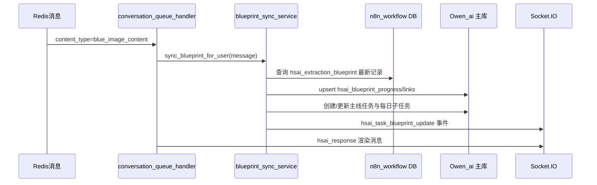
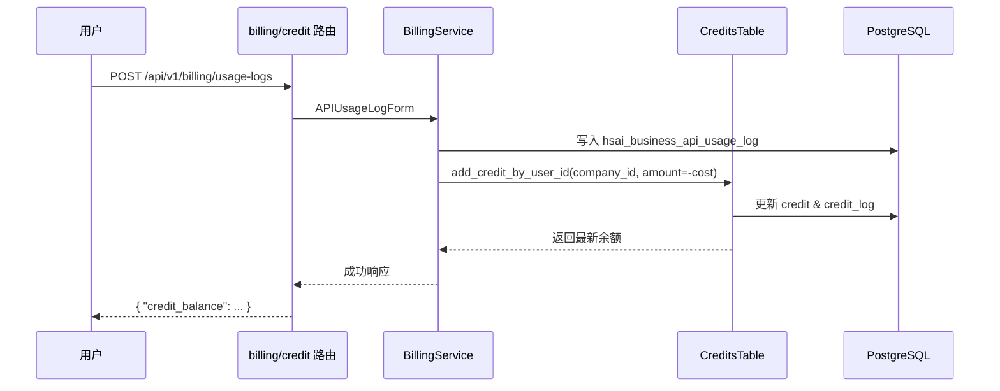
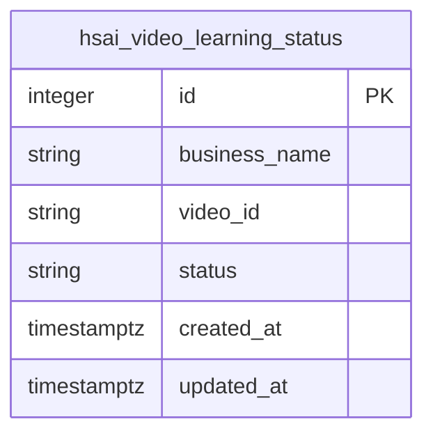
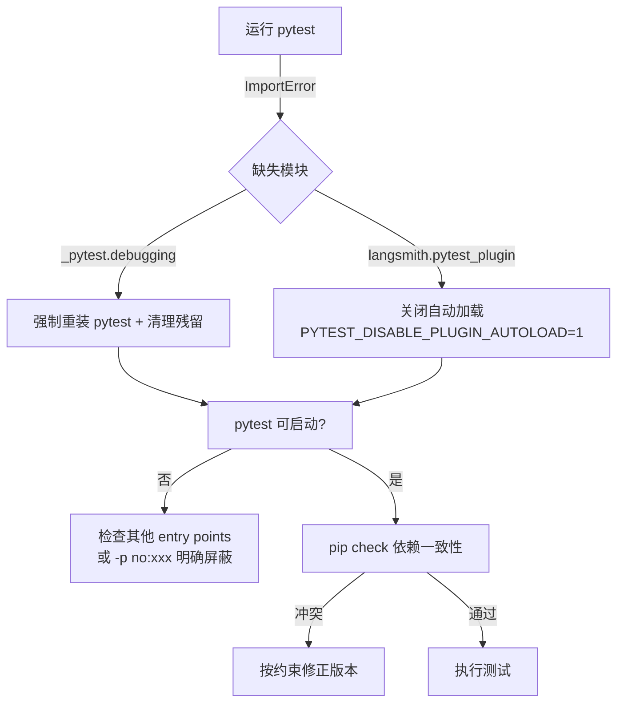
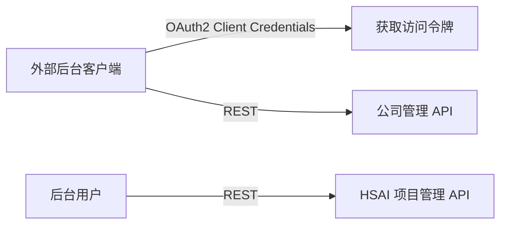

# HSAI 管理系统 · 项目知识库（PROJECTWIKI.md）
> 一等公民 · 与主干代码保持持续一致（UTF-8）

更新日期：2025-10-23（与 main 同步）

## 项目概述
HSAI 管理系统提供统一的 AI 任务编排、材料管理与计费能力，后端采用 FastAPI + Pydantic + SQLAlchemy，前端以 SvelteKit 为主。系统围绕“公司 → 项目 → 任务”的多租户模型构建，核心能力包括：
- 统一鉴权（JWT / OAuth2 Bearer / API Key）与用户、公司层级权限控制（组织模型已废弃）。
- 多模态任务执行（材料生成、视频学习、流程编排）及队列治理。
- 计费与积分体系：支持模型调用扣费、公司账户共享额度、充值对账。
- 可扩展的插件与工具生态（Tool Server、Workflow、外部模型接入）。

## 架构设计
### 总体架构
`````mermaid
flowchart LR
  FE[Web / API Client]
  subgraph Backend
    APIRouters[[FastAPI Routers]]
    Services[[Domain Services]]
    Models[[Pydantic / ORM Models]]
    Utils[[工具 & 公共模块]]
  end
  DB[(PostgreSQL)]
  Redis[(Redis)]
  N8N[(n8n_workflow DB)]

  FE <-->|REST / WebSocket| APIRouters
  APIRouters --> Services
  Services --> Models
  Services --> DB
  Services -->|队列/缓存| Redis
  Services -->|计费日志| N8N
  Utils -.-> Services
```

### 战略蓝图数据表
```mermaid
erDiagram
  hsai_projects ||--o{ hsai_blueprint_progress : "跟踪蓝图"
  hsai_blueprint_progress ||--o{ hsai_blueprint_progress_history : "版本历史"
  hsai_blueprint_progress ||--o{ hsai_task_blueprint_links : "生成主线任务"
  hsai_tasks ||--o{ hsai_task_blueprint_links : "蓝图来源"
  hsai_tasks ||--o{ hsai_task_state_logs : "状态日志"

  hsai_blueprint_progress {
    string id PK
    string project_id FK hsai_projects.id
    string blueprint_version
    string progress_state
    json daily_cycle_config
    json latest_digest
    bigint last_synced_at
  }
  hsai_blueprint_progress_history {
    string id PK
    string progress_id FK hsai_blueprint_progress.id
    string operation
    json changes_json
    bigint created_at
  }
  hsai_task_blueprint_links {
    string id PK
    string progress_id FK hsai_blueprint_progress.id
    string task_id FK hsai_tasks.id
    string template_key
    json metadata
    bigint created_at
  }
  hsai_task_state_logs {
    string id PK
    string task_id FK hsai_tasks.id
    string from_state
    string to_state
    string operator_id
    string source
    bigint created_at
  }
```

- `hsai_blueprint_progress`：记录最新蓝图版本、执行参数与同步时间，仅允许每个项目一条最新记录。
- `hsai_blueprint_progress_history`：保留蓝图变更快照，支持回溯更新日志。
- `hsai_task_blueprint_links`：建立蓝图与主线任务、循环子任务的追溯关系，避免重复生成。

### 战略蓝图同步流程


- 蓝图同步失败会记录错误日志但不会阻断原对话消息。
- Daily Publish 循环任务在依赖任务全部完成且到达配置时间窗口后自动生成当日子任务。


### 关键流程：公司账户扣费


## 数据模型
```mermaid
erDiagram
  companies ||--o{ hsai_projects : 拥有
  hsai_projects ||--o{ hsai_tasks : 包含
  users ||--o{ hsai_tasks : 创建
  users ||--o{ credit : 余额
  companies ||--o{ credit : 共享
  credit ||--o{ credit_log : 变动记录
  hsai_tasks ||--o{ hsai_cards : 派生
  hsai_idempotent_operations ||--o{ hsai_outbox_events : operation

  companies {
    string id PK
    string name
    string owner_user_id FK users.id
    json company_info
    string status
    json config
    timestamptz created_at
    timestamptz updated_at
  }
  hsai_projects {
    string id PK
    string name
    string description
    string user_id FK users.id
    string company_id FK companies.id
    string status
    json config
    timestamptz created_at
    timestamptz updated_at
  }
  hsai_tasks {
    string id PK
    string title
    string task_type
    string status
    string user_id FK users.id
    string project_id FK hsai_projects.id
    bigint progress
    bool is_recurring
    string recurring_state
    bigint last_run_at
    bigint next_run_at
    string external_controller
    json recurring_meta
    timestamptz created_at
    timestamptz updated_at
  }
  hsai_task_state_logs {
    string id PK
    string task_id FK hsai_tasks.id
    string from_state
    string to_state
    string operator_id
    string operator_name
    string source
    json snapshot_json
    bigint created_at
  }
  credit {
    string id PK
    string user_id FK users.id UNIQUE
    string company_id FK companies.id
    numeric credit
    timestamptz created_at
    timestamptz updated_at
  }
  credit_log {
  hsai_idempotent_operations {
    string id PK
    string operation_id UNIQUE
    string status
    json context
    string last_error
    bigint created_at
    bigint updated_at
  }
  hsai_outbox_events {
    string id PK
    string operation_id
    string event_type
    json payload
    string status
    int attempts
    string last_error
    bigint scheduled_at
    bigint created_at
    bigint updated_at
  }
    string id PK
    string user_id FK users.id
    string company_id FK companies.id
    numeric credit
    json detail
    timestamptz created_at
  }
```

- hsai_idempotent_operations：记录 onboarding / 回放等幂等操作执行状态，包含 operation_id、context、last_error。
- hsai_outbox_events：Outbox 事件队列，保存待分发的业务事件，记录重试次数与计划执行时间（scheduled_at）。
## 任务系统可靠性与调度（2025-11-04）
- 技术目标：确保“用户→公司→默认项目→主线任务”链路幂等、Outbox 可追溯，循环任务具备自动调度与状态复盘能力。
- 代码参考：ackend/open_webui/services/onboarding_orchestrator.py:48、ackend/open_webui/services/outbox_dispatcher.py:24、ackend/open_webui/services/recurring_scheduler.py:42、ackend/open_webui/models/hsai_tasks.py:614。

### 任务系统链路（Company → Project → Main Tasks）
`mermaid
sequenceDiagram
  participant API as Auth/Project API
  participant Orchestrator as onboarding_orchestrator
  participant Ops as hsai_idempotent_operations
  participant DB as PostgreSQL
  participant Tasks as hsai_tasks
  participant Outbox as hsai_outbox_events
  participant Dispatcher as outbox_dispatcher

  API->>Orchestrator: ensure_company_project_and_main_tasks(user_id)
  Orchestrator->>Ops: SELECT FOR UPDATE operation_id
  alt 新操作
    Orchestrator->>DB: INSERT companies/projects（business_name 幂等键）
    Orchestrator->>Tasks: 派生主线任务（模板去重）
    Orchestrator->>Outbox: enqueue onboarding.seed_summary
  else 已完成
    Orchestrator-->>API: 返回已有摘要
  end
  Dispatcher->>Outbox: acquire_pending()
  Dispatcher->>Dispatcher: 调用事件处理器/重试
  Dispatcher->>Outbox: mark_dispatched()
`
- hsai_idempotent_operations 以 operation_id 记录执行状态，异常时写入 last_error，避免重复执行。【backend/open_webui/services/onboarding_orchestrator.py:48】
- hsai_outbox_events 存储幂等链路产生的事件，由 OutboxDispatcher 轮询分发并支持重试/延时调度。【backend/open_webui/services/outbox_dispatcher.py:24】
- orchestrator 在登录、蓝图同步及对话补种链路中复用，同步更新 Outbox 与幂等记录。
- hsai_idempotent_operations 以 operation_id 记录执行状态，异常时写入 last_error，避免重复执行。【backend/open_webui/services/onboarding_orchestrator.py:48】
- hsai_outbox_events 存储幂等链路产生的事件，由 OutboxDispatcher 轮询分发并支持重试/延时调度。【backend/open_webui/services/outbox_dispatcher.py:24】
- orchestrator 在登录、蓝图同步及对话补种链路中复用，同步更新 Outbox 与幂等记录。

### 循环任务调度
- RecurringTaskScheduler 每 60 秒扫描激活任务，依据 
ecurring_meta.interval_* 计算下一次执行时间，并按 parent_task_id + scheduled_for 幂等生成子任务。【backend/open_webui/services/recurring_scheduler.py:42】
- 调度成功后自动更新 last_run_at/next_run_at，并写入 hsai_task_state_logs 供后台审计使用。
- 新增 HSAITasks.list_active_recurring_tasks / ll_main_tasks_completed 作为调度器与 API 共用的查询接口。【backend/open_webui/models/hsai_tasks.py:614】【backend/open_webui/models/hsai_tasks.py:633】

### API 行为调整
- /hsai/tasks/{task_id}/recurring/activate 在所属项目主线任务未全部完成时返回 400，保障主线→循环的顺序依赖。【backend/open_webui/routers/hsai_tasks.py:505】
- /hsai/tasks/{task_id}/start、/cancel、/progress 会同步写入 hsai_task_state_logs 并广播 WS 事件，覆盖后台/调试页的审计需求。【backend/open_webui/routers/hsai_tasks.py:860】【backend/open_webui/routers/hsai_tasks.py:1024】【backend/open_webui/routers/hsai_tasks.py:1102】
- main.py 在应用生命周期内启动/停止 OutboxDispatcher 与 RecurringTaskScheduler，确保后台任务与 API 同步上线。【backend/open_webui/main.py:569】【backend/open_webui/main.py:576】【backend/open_webui/main.py:619】【backend/open_webui/main.py:625】

### 视频学习状态（hsai_video_learning_status）
- 支撑视频学习进度的多租户隔离存储，使用联合唯一键 `business_name + video_id` 防止跨公司覆盖。
- 数据访问层新增 `get_status_map_for_business`、`list_video_ids_by_business`，方便批量映射和筛选。
- 业务索引 `(business_name, status)` 缓解按状态过滤的分页压力。


## 模块文档
### backend/open_webui/routers
- **hsai_video_learning.py**：按登录用户解析 `business_name`，分页聚合各视频学习状态，启动学习时调用 n8n 并写入 `learning` 状态；复用联合唯一约束避免重复写入。
- **hsai_companies.py**：公司 CRUD、分页、项目列表过滤；依赖 `get_verified_user`，输出 `PaginatedCompanyResponse`。
- **hsai_projects.py**：项目 CRUD、任务模板初始化；创建时自动注入默认任务；支撑分页与状态过滤。
- **hsai_tasks.py**：任务查询、指派、进度更新、统计，统一调用 `check_credit_by_user_id` 校验额度。
- **billing.py**：计费配置、API 使用日志、公司积分查询 (`GET /billing/user/credit`)；管理员权限由 `get_admin_user` 保障。
- **credit.py**：个人积分日志、充值票据、统计报表；普通用户分页读取自身日志，管理员支持关键字检索。
- **auths.py / users.py**：登录注册、用户资料维护、管理员批量操作等；与积分模块解耦但通过 `Credits` 初始化余额。

### backend/open_webui/services
- **billing_service.py**：封装资源费率计算、API 调用落库、公司积分扣减；`update_company_credit` 统一使用 `AddCreditForm(company_id=...)` 写入。
- **conversation_queue_handler.py**：对话队列消费与任务触发；依赖 Redis Streams。

### backend/open_webui/models
- **hsai_video_learning_status.py**：联合唯一约束保障 `business_name + video_id` 唯一，提供租户级批量查询与状态列表接口，写入阶段捕获自增序列异常并回滚。
- **hsai_business_good_video_v1.py**：视频列表与统计接口提供全局数据视图，同时结合学习状态表按 `business_name` 区分 pending / learning / learned / abandoned。
- **credits.py**：定义 `Credit`, `CreditLog`, `TradeTicket` ORM 表及 `CreditsTable` 操作。新增 `company_id` 字段后，`_resolve_credit_owner` 负责基于用户推导公司负责人。
- **hsai_companies.py / hsai_projects.py / hsai_tasks.py**：提供 Pydantic 校验与 SQLAlchemy 表结构（含时间戳归一化）。
- **billing_config.py / api_usage_log.py**：计费费率配置与日志模型。

### 工具与脚本
- **tool/fix_hsai_video_learning_status_sequence.py**：检测 `business_name + video_id` 重复、补齐联合唯一约束/索引，并同步 `hsai_video_learning_status` / `hsai_video_learning_logs` 自增序列（支持 PostgreSQL/SQLite），`--apply` 可一键执行修复。
- **tool/add_company_credit_columns.py**：为 `credit` 与 `credit_log` 表补齐 `company_id` 列并回填历史数据，支持 SQLite 与 PostgreSQL。
- **tool/test_redis_queue_insert.py** 等：用于 Redis 队列结构校验与修复。

## API 手册（核心端点）
### 公司与项目
| 方法 | 路径 | 描述 | 权限 |
|------|------|------|------|
| GET | `/api/v1/hsai/companies` | 公司分页（按状态过滤） | Verified User |
| POST | `/api/v1/hsai/companies` | 新建公司 | Verified User |
| GET | `/api/v1/hsai/companies/{company_id}` | 读取详情 | Verified User（公司负责人） |
| PUT | `/api/v1/hsai/companies/{company_id}` | 更新基本信息 | Verified User（公司负责人） |
| GET | `/api/v1/hsai/companies/{company_id}/projects` | 查看公司项目 | Verified User（公司负责人） |

| 方法 | 路径 | 描述 | 权限 |
|------|------|------|------|
| GET | `/api/v1/hsai/projects` | 项目分页/筛选 | Verified User |
| POST | `/api/v1/hsai/projects` | 创建项目并初始化默认任务 | Verified User |
| PUT | `/api/v1/hsai/projects/{project_id}` | 更新项目信息 | Verified User（所有者） |
| DELETE | `/api/v1/hsai/projects/{project_id}` | 删除项目 | Verified User（所有者） |

### 任务
| 方法 | 路径 | 描述 | 权限 |
|------|------|------|------|
| GET | `/api/v1/hsai/tasks` | 任务分页、状态筛选 | Verified User |
| POST | `/api/v1/hsai/tasks` | 创建任务（可附带 chat 快照） | Verified User |
| PUT | `/api/v1/hsai/tasks/{task_id}` | 更新任务详情 | Verified User（参与者） |
| PUT | `/api/v1/hsai/tasks/{task_id}/progress?progress=INT` | 更新进度 | Verified User（参与者） |
| POST | `/api/v1/hsai/tasks/{task_id}/assign?assignee_id=UID` | 指派任务 | Verified User（负责人） |
| GET | `/api/v1/hsai/tasks/cards/chat/{chat_id}` | 根据会话读取任务卡片 | Verified User |

### 积分与计费
| 方法 | 路径 | 描述 | 权限 |
|------|------|------|------|
| GET | `/api/v1/billing/user/credit` | 获取当前用户所属公司积分余额 | Verified User |
| GET | `/api/v1/credit/logs` | 获取个人积分日志 | Verified User |
| GET | `/api/v1/credit/all_logs` | 管理员查看全量日志 | Admin |
| POST | `/api/v1/billing/usage-logs` | 记录模型调用扣费 | Admin |
| GET | `/api/v1/billing/configs` | 计费费率配置分页 | Admin |
| POST | `/api/v1/credit/tickets` | 创建充值订单 | Verified User |

## 配置与运行依赖
- **数据库**：默认 PostgreSQL（`DATABASE_URL`），可配置 `DATABASE_SCHEMA`；某些日志写入 `N8N_DATABASE_URL`。
- **缓存/队列**：Redis 用于对话/任务排队。
- **环境变量关键项**：`WEBUI_AUTH_*`（鉴权）、`CREDIT_*`（积分策略）、`USAGE_CALCULATE_*`（计费单价）。
- **初始化脚本**：`backend/sql/postgresql_init_from_sqlite.sql`、`backend/sql/sqlite_dump_raw.sql` 已加入视频学习状态表的联合唯一约束与索引；导入历史数据后需运行 `tool/fix_hsai_video_learning_status_sequence.py --apply` 重置序列，必要时再执行 `tool/add_company_credit_columns.py` 修复旧表结构。

## 设计决策 & 技术债务

### 2025-11-01 接口查询崩溃（缺失 hsai_tasks.is_recurring）
- 背景：2025-10-31 14:54（UTC+08）起，/api/v1/hsai/tasks/ 与 /api/v1/hsai/dashboard/recent-activities 接口返回 500，日志报错 psycopg2.errors.UndefinedColumn: column hsai_tasks.is_recurring does not exist，导致管理后台任务列表与仪表盘无法加载。
- 根因：循环任务特性新增 ORM 字段后，仅提供 	ool/add_recurring_task_fields.py 手动迁移脚本；生产 PostgreSQL 未执行该脚本，且业务层缺乏列缺失防护，SQLAlchemy 在查询阶段即抛出缺列异常。
- 修复：
  - ackend/open_webui/internal/migrations/recurring_tasks.py 新增 ensure_recurring_task_schema，按数据库方言自动补齐循环任务字段、hsai_task_state_logs 表及索引，支持 dry-run 幂等执行。
  - ackend/open_webui/models/hsai_tasks.py 引入 _schema_aware_db 包装，确保任务/日志/卡片访问前统一触发 schema 校验。
  - 	ool/add_recurring_task_fields.py 复用共享逻辑并保留 CLI 输出，避免重复维护 SQL 片段。
  - 初始化脚本 ackend/sql/postgresql_init_from_sqlite.sql、ackend/sql/sqlite_dump_raw.sql 同步补入循环任务字段与索引，保证新环境无需额外迁移即可启用。
  - 新增回归测试 ackend/test/test_recurring_task_schema.py 覆盖 SQLite 场景下的列补齐、日志表/索引创建及 dry-run 幂等校验。
- 验证：执行 pytest backend/test/test_recurring_task_schema.py 通过；PostgreSQL 实例重启后日志显示 schema ensure 仅首次执行，原报错接口恢复 200。
- 预防：任务模块统一通过 _schema_aware_db 访问数据库；上线 checklist 新增 “	ool/add_recurring_task_fields.py --dry-run 无缺失列” 与 “首启日志出现 schema ensure 成功记录”。
- 关联：ackend/open_webui/models/hsai_tasks.py、ackend/open_webui/internal/migrations/recurring_tasks.py、ackend/sql/postgresql_init_from_sqlite.sql、ackend/sql/sqlite_dump_raw.sql、	ool/add_recurring_task_fields.py、ackend/test/test_recurring_task_schema.py、本条 WIKI。
- **时间戳持久化策略（2025-10-23）**：引入 `EpochTimestamp` TypeDecorator，将 ORM 层时间字段统一转换为 PostgreSQL `timestamptz`，业务仍以整型 Epoch 秒读写；此次覆盖 redis_queue_messages、billing_config、chats、files、hsai_*、credits、users 等核心模型，并配套更新校验脚本，消除 `DatatypeMismatch` 报错并锁定未来扩展范围。
- **积分统一于公司维度**：通过 `company_id` 将同公司用户余额合并，BillingService 与 CreditsTable 保持一致；后续需要对前端展示（个人额度）做差额提示。
- **双数据库架构**：业务主库与 n8n_workflow 分离，计费日志与视频学习读取使用二级连接池；需监控跨库事务失败的补偿逻辑。
- **任务模板自动化**：项目创建时批量生成默认任务，当前模板硬编码在 `PROJECT_MAIN_TASK_TEMPLATES`，未来应移至可配置存储。
- **技术债务**：
  - [2025-10-24] 回滚至提交 2c82f3694 后 `backend/open_webui/models/credits.py` 的 `CreditLogModel.company_id` 缩进异常导致后端无法启动；已修复并将回滚后的语法校验纳入标准流程。
  - [2025-10-24] 回滚后生产库 `credit`/`credit_log` 保持旧 schema，缺失 `company_id` 列且时间戳仍为 TIMESTAMP，导致 `credit initialize failed`。已执行 `tool/add_company_credit_columns.py` 补列，并通过 SQL 将 `credit.updated_at`/`credit.created_at`/`credit_log.created_at`/`trade_ticket.created_at` 统一转换为 BIGINT（UNIX 时间戳）。回滚或数据迁移时需同步执行上述脚本与列类型转换。
  - 缺少对公司层面积分消费的并发锁，短期通过数据库事务满足，但高并发下需引入悲观锁或分布式锁。
  - 计费日志缺乏聚合索引（company_id + created_at），大体量数据时分页可能退化。
  - Redis 队列脚本散落在 `tool/` 目录，建议统一为 CLI。

## 测试与运维
- **单元测试**：后端核心模块使用 `pytest`；计费相关测试见 `backend/test/test_billing_system.py`。
- **脚本验证**：`tool/` 目录提供数据库列校验、Redis 队列修复脚本，运行前需确认 `.env` 指向正确环境。
- **数据库修复脚本**：`tool/fix_hsai_video_learning_status_sequence.py` 支持 dry-run / --apply，两步完成重复检测与联合唯一约束/序列补齐。
- **监控建议**：重点观测 `credit`/`credit_log` 同步延迟、Redis Stream 消费积压、n8n 数据库链路。
- **调试工具**：`websocket-test.html` 调试页与 `static/ws-tester.js` 客户端脚本；任务标签页采用双列布局（左列操作中心，右列覆盖项目概览、任务列表、循环运行概览、循环状态日志、事件时间轴），按钮内置加载/禁用状态，事件卡片展示状态徽章、进度和会话信息；操作中心支持主线模板初始化、循环任务启动/暂停/恢复/交接/同步、子任务回放以及“填充到消息调试”快捷键；循环运行概览渲染蓝图关联与运行快照，循环状态日志支持一键刷新调用 `/api/v1/hsai/tasks/{task_id}/recurring/logs`；项目概览数据源保持 `/api/v1/hsai/projects/{project_id}/summary` + `/api/v1/hsai/projects/{project_id}/tasks`。操作手册见 `docs/410_websocket_test_page_manual.md`（2025-11-01 更新）。
- **后台对接缺口方案（2025-11-01）**：见 `docs/backend_integration_alignment_plan.md`，明确客户/公司/项目/任务/计费/审计的接口补齐计划、OAuth2 + HMAC 鉴权要求、审计 ID 返回格式，以及文档与 OpenAPI 同步流程；后续所有后台↔服务端契约调整需引用该方案并在完成后更新 `CHANGELOG.md` 与本节。

### Ops Dashboard 采集配置（2025-11-08）

- **配置项**：`.env` / `.env.example` 新增 `OPS_DASHBOARD_ENABLED`（开关）、`OPS_DASHBOARD_BASE_URL`（后台采集 host，当前内网为 `http://192.168.20.32:5000`）、`OPS_DASHBOARD_API_KEY`、`OPS_DASHBOARD_TIMEOUT`、`OPS_DASHBOARD_MAX_RETRY`、`OPS_DASHBOARD_ALLOW_CONTENT`。所有上报逻辑必须通过这些变量拼接 host + API，禁止硬编码地址。
- **设计文档**：`docs/500-599_后端设计/ops_dashboard_backend_plan.md` 描述采集接口契约、字段字典、组件划分与重试/鉴权策略；上线前需依据该方案完成联调并在 CHANGELOG 留痕。
- **运维提示**：后台接口不可达时可将 `OPS_DASHBOARD_ENABLED=false` 暂停上报；更换 host/API Key 后必须重启服务并观察 `ops_dashboard` 相关日志与重试队列深度，确认无堆积。


## 术语表
| 术语 | 说明 |
|------|------|
| 公司（Company） | 多租户入口，绑定负责人用户，提供共享积分。 |
| 项目（Project） | 公司内的业务容器，聚合任务与材料。 |
| 任务（Task） | AI 调用/流程执行的基本单元，可关联对话与素材。 |
| 积分（Credit） | 计费体系的虚拟货币，按公司维度共享，支持充值与扣费。 |
| Usage Log | `hsai_business_api_usage_log` 中的模型调用记录。 |
| Trade Ticket | 充值工单，结合第三方支付回调自动入账。 |

## 变更日志
### 2025-11-01
- 工具链：清除 'backend/open_webui/routers/external_admin.py' 的 UTF-8 BOM，解除 git 钩子 BOM 校验阻塞，要求后续新文件统一使用无 BOM UTF-8；同步手动校验未产生额外 diff。
- 后端：ackend/open_webui/models/hsai_tasks.py 引入 _schema_aware_db，在任务检索/统计/递归操作前自动确保循环任务字段和日志表已齐备，消除缺列报错；新增共享迁移工具 ackend/open_webui/internal/migrations/recurring_tasks.py。
- 工具：	ool/add_recurring_task_fields.py 复用共享迁移逻辑并保留 dry-run 输出；ackend/test/test_recurring_task_schema.py 新增单元测试覆盖列补齐/索引创建及幂等验证。
- 数据脚本：ackend/sql/postgresql_init_from_sqlite.sql、ackend/sql/sqlite_dump_raw.sql 同步补入 is_recurring 系列字段、hsai_task_state_logs 表与索引，保证全新部署即具备循环任务能力。
- 文档：PROJECTWIKI 数据模型、设计决策与运维段落同步记录循环任务字段、自检流程与上线 checklist。
- 数据库：将 `"group"` 表重命名为 `user_groups`，并统一使用 `company_id`（替换遗留的 `organization_id`）。运行 `tool/remove_legacy_organization_schema.py` 可自动完成重命名与外键校准。
- 前端：`websocket-test.html` 新增循环运行概览/循环状态日志卡片、任务选中提示与消息 ID 自动填充；`static/ws-tester.js` 扩展循环任务启动/暂停/恢复/交接/同步、日志刷新与时间输入解析，保持操作中心与事件流一致。
- 手册：`docs/410_websocket_test_page_manual.md` 更新至 2025-11-01 版，补充循环状态机按钮、日志刷新、验收清单与调试流程说明。
### 2025-10-28
- 后端：`backend/open_webui/models/hsai_video_learning_status.py` 引入联合唯一约束、租户级批量查询方法；`backend/open_webui/routers/hsai_video_learning.py` 依据 `business_name` 返回/写入学习状态；`backend/open_webui/models/hsai_business_good_video_v1.py` 在视频列表无租户匹配时回退到全局视图，并结合学习状态完成筛选。
- 数据脚本：`backend/sql/postgresql_init_from_sqlite.sql`、`backend/sql/sqlite_dump_raw.sql` 同步加入联合唯一约束与索引；新增 `tool/fix_hsai_video_learning_status_sequence.py`，一并校准 `hsai_video_learning_status` / `hsai_video_learning_logs` 序列并补齐约束。
- 测试：新增 `backend/test/test_video_learning_status.py` 覆盖跨租户插入、联合唯一约束及状态筛选逻辑。
- 文档：数据模型、模块说明、运维脚本段落同步记录视频学习状态设计，更新初始化/运维指引。
- 数据库：执行 `tool/fix_credit_timestamp_columns.py` 将 PostgreSQL `credit`/`credit_log` 表的 `created_at`、`updated_at` 列从 `bigint` 迁移为 `timestamptz`，修复登录初始化阶段抛出的 `credit initialize failed`。示例命令：`python tool/fix_credit_timestamp_columns.py --database-url "$DATABASE_URL"`，脚本支持幂等重复运行。
- 验证：迁移后 `Credits.init_credit_by_user_id` 与 `/api/v1/auths/signin` 均返回正常响应，新账号登录即可生成初始积分记录。

### 2025-10-30
- 后端：恢复 `PROJECT_MAIN_TASK_TEMPLATES` 常量定义，避免项目初始化阶段主线任务缺失；`hsai_tasks` 循环任务 API 补充状态日志回写与事件上下文，消除激活/暂停时的 `AttributeError`。
- 前端：重构调试页任务标签为双列布局，项目概览卡片接入 `/api/v1/hsai/projects/{project_id}/summary` 展示蓝图版本/状态/最近同步/计划结束，并改用 `/api/v1/hsai/tasks/{task_id}/recurring/activate` 激活循环任务，完善按钮状态与事件进度展示。
- 文档：更新 `docs/410_websocket_test_page_manual.md` 描述新的布局、蓝图指标与操作流程，并在验收清单新增操作禁用与事件展示的核对项。

### 2025-10-29
- 后端：新增 `backend/open_webui/services/blueprint_sync_service.py` 同步战略蓝图，按项目生成/更新主线任务并推送 Socket 通知。
- 数据层：引入 `hsai_blueprint_progress` / `hsai_blueprint_progress_history` / `hsai_task_blueprint_links` ORM，配套脚本 `tool/add_blueprint_progress_tables.py` 初始化表结构。
- 运行时：`conversation_queue_handler` 监听 `blue_image_content`，派发 `hsai_task_blueprint_update` 事件，避免蓝图通知缺失。
- 文档：PROJECTWIKI 增补蓝图数据模型与同步流程示意，记录新的依赖与操作手册。

### 2025-10-27
- 前端：`websocket-test.html` 新增“任务调试”标签页，提供任务上下文/事件流/操作面板；`static/ws-tester.js` 实现快照拉取、任务事件订阅、按钮状态联动与任务模板批量创建。
- 文档：`docs/410_websocket_test_page_manual.md` 补充任务调试流程、事件筛选与验证清单，保持与代码更新同步。
- 追踪：`PROJECTWIKI.md` 调试工具段落扩充任务调试功能描述，并在变更日志登记 2025-10-27 版本。

### 2025-10-26
- 前端：调整消息发送卡片为单卡片布局，新增会话 Markdown/JSON 双模态查看，工作流 `workflow_started` 中间态不再参与响应时延；同步完善按钮状态与模态交互。
- 文档：`docs/410_websocket_test_page_manual.md` 刷新布局描述、Markdown 弹窗说明及延迟计算策略，补充最新验收清单。
- 追踪：在 `PROJECTWIKI.md` “调试工具” 段落与变更日志中记录 Markdown/JSON 双模态及延迟策略，保持代码 ↔ 文档一致。

### 2025-10-24
- 数据：运行 `tool/add_company_credit_columns.py` 并手动执行列类型转换（TIMESTAMP → BIGINT），修复登录触发的 `credit initialize failed`。
- 提示：将数据库回滚校准步骤纳入运维清单，避免再次遗漏。
- 修复：回滚至提交 2c82f3694 后 `CreditLogModel.company_id` 一行缩进异常触发 `IndentationError`，已整理缩进并通过 `python -m py_compile backend/open_webui/models/credits.py` 验证。
- 文档：在“设计决策 & 技术债务”补充该回滚复盘条目，提醒回滚后执行静态语法检查。
- 前端：websocket-test.html 与 static/ws-tester.js 中文化更新，新增登录/调试工具改进；同步重写 docs/410_websocket_test_page_manual.md 并建立互链。
### 2025-10-23
- 更新：统一 ORM 时间字段使用 `EpochTimestamp` 装饰器持久化，修复 PostgreSQL `timestamptz` 类型写入错误，并补充 Redis 队列修复验证脚本。
- 修复：Markdown 中文乱码问题，重写 PROJECTWIKI 信息结构，确保控制字符与替换符清零。
- 更新：新增公司积分统一说明、`tool/add_company_credit_columns.py` 使用指引、`GET /billing/user/credit` 接口文档。

- 项目汇报：docs/pm/report_20251025.md（方案A口径，含问题与改进/路线图）。

## 运维/故障

### 故障指纹：pytest 启动即崩溃（_pytest.debugging / 第三方插件）
- 触发命令：`pytest -q tests_e2e_smoke`
- 典型症状：
  - `ModuleNotFoundError: No module named '_pytest.debugging'`
  - `ModuleNotFoundError: No module named 'langsmith.pytest_plugin'`
- 环境指纹（2025-10-26）：
  - Python 3.11.9（venv），pytest 8.3.5；Windows 10
  - langsmith 0.4.21；langfuse 2.44.0（需 packaging < 24.0）
- 处置摘要：
  - 强制重装 pytest 并清理 `pytest*` / `_pytest*` 残留
  - 在 venv 的 `site-packages/sitecustomize.py` 设置 `PYTEST_DISABLE_PLUGIN_AUTOLOAD=1`
  - 将 packaging 降至 `< 24.0`，通过 `pip check`
  - `pytest.ini` 增加 `-p no:langsmith.pytest_plugin`
- 验证：`pytest --version`、`pytest --collect-only -q tests_e2e_smoke/test_health_endpoints.py`、`pytest -q tests_e2e_smoke`



## 测试手册（E2E）
- 参见：docs/tests/e2e_guide.md（pytest 驱动的端到端冒烟/主流程验证手册）。


### API 手册（更新：公司管理与项目摘要）

以下条目与代码保持一致，更新于 2025-11-01：



| 模块 | 方法 | 路径 | 摘要 |
|------|------|------|------|
| 客户管理 | PUT  | `/api/v1/external/admin/users/{user_id}` | 更新客户资料（密码字段可选，未提供时保留原密码） |
| 客户管理 | POST | `/external/admin/users/{user_id}/reset-password` | 重置客户账号密码 |
| 客户管理 | POST | `/external/admin/users/{user_id}/enable` | 启用客户账号 |
| 客户管理 | POST | `/external/admin/users/{user_id}/disable` | 禁用客户账号 |
| 公司管理 | POST | `/external/admin/oauth/token` | 获取外部管理访问令牌（client_credentials） |
| 公司管理 | GET | `/external/admin/companies` | 分页获取公司列表 |
| 公司管理 | POST | `/external/admin/companies` | 创建公司并指定负责人 |
| 公司管理 | PUT | `/external/admin/companies/{company_id}` | 更新公司信息 |
| 公司管理 | DELETE | `/external/admin/companies/{company_id}` | 删除公司（需无关联项目/用户） |
| 公司管理 | POST | `/external/admin/companies/{company_id}/users/{user_id}` | 将用户加入公司 |
| 公司管理 | DELETE | `/external/admin/companies/{company_id}/users/{user_id}` | 将用户从公司移除 |
| HSAI 项目管理 | GET | `/api/v1/hsai/projects/{project_id}/tasks` | 获取项目任务列表 |
| HSAI 项目管理 | GET | `/api/v1/hsai/projects/{project_id}/summary` | 项目任务摘要（蓝图/循环任务） |
| 对话管理 | GET | `/api/v1/chats/` | 获取我的对话列表 |
| 对话管理 | DELETE | `/api/v1/chats/` | 删除我的全部对话 |
| 文件管理 | POST | `/api/v1/files/` | 上传文件 |
| 知识库管理 | GET | `/api/v1/knowledge/` | 获取知识库列表 |
> 兼容性说明（2025-11-04）：外部后台调用 PUT /api/v1/external/admin/users/{user_id} 时若省略 password，系统会保留原始密码；如需重置密码请使用 POST /external/admin/users/{user_id}/reset-password。

备注：
- 外部后台所有接口均需携带 Bearer Token；令牌通过 `/external/admin/oauth/token` 颁发且持久化存储，可追踪审计。
- 临时联调阶段可将 EXTERNAL_ADMIN_AUTH_BYPASS=true 以跳过外部后台 IP/Token 校验；需在开放窗口内加强审计并在恢复时验证鉴权。
- 新增公司接口后，“组织管理” 已下线；所有权限按 `company_id` 维度控制。
- 以上接口的中文摘要/描述已补齐；其余模块将按模块批次推进中文化与标签治理。


### 外部管理 Client Credentials 鉴权方案

- 详细方案见 docs/500-599_后端设计/模块设计/577-外部后台管理鉴权方案.md，涵盖配置映射、错误码、生命周期与安全策略。
- 本节仅保留提醒：所有外部管理接口必须携带 /external/admin/oauth/token 签发的 Bearer Token，生产环境需启用 IP 白名单与密钥轮换监控。

## 接口文档与 Swagger 中文化（2025-10-31）
- 本批次完成：
  - 对话管理（chats.py）：为归档/分享/标签/详情/更新/消息/文件夹/标签清空/导入/搜索等端点补齐中文摘要与描述；不改业务逻辑。
  - 认证与授权（auths.py）：统一中文标签为“认证与授权”。
  - 模型管理（models.py）：修复路由初始化缺失问题；补齐“获取模型列表/获取基础模型列表/创建模型”的中文描述。
  - 计费管理（billing.py）：修复若干中文描述乱码与不完整参数说明（UTC ISO8601、分页索引、会话累计积分）。
  - HSAI 项目管理（hsai_projects.py）：修正 tasks/summary 两端点的中文摘要（若控制台编码显示为乱码，请以 /docs 实际页面为准）。
- 影响：仅 OpenAPI 元信息与 Swagger 展示；零业务逻辑改动。
- 验证建议：本地运行后访问 /docs，检查上述端点摘要/描述均为中文。
\n## 设计决策 & 技术债务 / 缺陷复盘

### 2025-10-31 启动失败（SyntaxError: invalid non-printable character U+FEFF）
- 背景：在 Windows 环境下启动后端（uvicorn）时报错，堆栈定位到 `backend/open_webui/routers/chats.py` 第 1 行，提示 `invalid non-printable character U+FEFF`。
- 根因：文件头部残留 UTF‑8 BOM（U+FEFF），且紧随一枚异常字节，导致解析器在首行 `import` 之前读到不可见字符而报错。
- 受影响文件（检测样本，仅本目录）：
  - 必修复：`backend/open_webui/routers/chats.py`（首行异常字符 + BOM）。
  - 建议清理：`backend/open_webui/routers/auths.py`、`billing.py`、`hsai_projects.py`、`models.py`（存在 BOM，但当前未触发崩溃）。
- 处置：
  - 移除 `chats.py` 开头异常字符并以无 BOM 的 UTF‑8 重写文件；首行修正为 `import json`。
  - 用最小导入测试验证 `open_webui.routers.chats` 可被成功导入，服务可继续启动；其余告警（ffmpeg/USER_AGENT/msgpack/aiomcache）与本次崩溃无关。
- 预防：
  - 已上线 `tool/clean_special_chars.py` 扫描脚本，支持 `--check` / `--fix` 模式，统一使用 `python tool/clean_special_chars.py --root . --extensions .py --fix` 清理。
  - 通过 `.githooks/pre-commit` 钩子（需执行 `git config core.hooksPath .githooks`）及 `.github/workflows/bom-scan.yml` CI，在本地提交与 Push/PR 阶段阻断含 BOM 的 `*.py` 文件。
  - 团队 IDE/编辑器默认保持 UTF-8（无 BOM），避免再次写入 BOM。
- 关联：
  - 代码：`backend/open_webui/routers/chats.py` 首行修复。
  - 本条目：记录于 PROJECTWIKI.md「设计决策 & 技术债务 / 缺陷复盘」。

## 设计决策 & 技术债务 / 缺陷复盘（更新）

### 2025-11-01 BOM 自动化治理上线
- 背景：针对 2025-10-31 的 BOM 事故，需要可复用的工具链阻断含 BOM 的 Python 代码进入主干。
- 变更：
  - 新增 `tool/clean_special_chars.py`，提供 `--check` / `--fix` 模式批量清理 UTF-8 BOM 与控制字符，默认针对 `*.py` 扫描。
  - 新增 `.githooks/pre-commit`，调用上述脚本检查待提交内容（需执行 `git config core.hooksPath .githooks` 初始化钩子）。
  - 新增 `.github/workflows/bom-scan.yml`，在 Push/PR 阶段运行脚本并拒绝含 BOM 的 `*.py`。
- 验证：本地执行 `python tool/clean_special_chars.py --root . --extensions .py` 返回 0，`rg "\uFEFF"` 未再命中；GitHub Actions 任务通过。
- 影响面：FastAPI 路由代码、Git 工作流、CI 规范；要求团队在拉取后运行 `git config core.hooksPath .githooks`。


### 2025-11-05 素材管理与 FFmpeg OSS 服务对齐方案

- 背景：素材管理模块与《318-HSAI 接口模块功能描述文档》及 FFmpeg `/oss` 服务在接口路径、检索能力、签名下载与上传流程上存在差距，导致与视频转码链路协同效率低。

- 方案：编制《docs/materials_management_alignment_plan.md》，覆盖接口补齐（新增 `/search`、`/stats`）、标签/分类扩展检索、签名下载链接生成、FFmpeg OSS 客户端封装、配置治理及验证/回滚策略。

- 验证：按方案执行单元/集成/性能/安全测试；在灰度阶段通过监控验证签名链接有效性与过期策略。

- 回滚：保留 `USE_FFMPEG_OSS`、`STORAGE_PROVIDER` 等配置开关，可快速退回本地存储 / 直接 boto3 上传流程；详情见上述文档。
## 2025-10-31 编码统一化（移除路由模块 BOM）
- 背景：同目录多文件存在 UTF‑8 BOM，虽未立即导致崩溃，但增加跨平台与编辑器差异风险。
- 处置：统一将以下文件重写为 UTF‑8（无 BOM），不改任何业务逻辑：
  - backend/open_webui/routers/auths.py
  - backend/open_webui/routers/billing.py
  - backend/open_webui/routers/hsai_projects.py
  - backend/open_webui/routers/models.py
- 验证：重写后首 4 字节分别为：69 6D 70 6F(import)/66 72 6F 6D(from) 等常规 ASCII，未再出现 EF BB BF。
- 预防：沿用前述 BOM 检测策略（pre-commit/CI），统一团队编辑器默认编码为 UTF‑8（无 BOM）。

## HSAI 素材管理存储策略（2025-11-04）

- 素材上传统一由 `backend/open_webui/routers/hsai_materials.py` 处理，根据 `STORAGE_PROVIDER` 切换本地/OSS 管理方式：`local` 写入 `./uploads/materials/<company>/<user>/<hash-name>`，`s3` 则通过 `Storage.upload_file` 持久化到 `<company>/<user>/<hash-name>` 并同步 `oss_bucket`、`oss_key`。
- 公司目录取自 `User.business_name`（为空时回退 `default-company`），再辅以用户 ID 形成隔离目录，确保公司间素材完全隔离并可追溯。
- `material_metadata` 现新增 `storage_provider`、`storage_key`、`business_directory`、`user_directory` 字段，方便运维脚本快速定位源文件与存储模式。

```mermaid
flowchart TD
    U[上传请求] --> V[解析 business_name / user.id]
    V --> S{STORAGE_PROVIDER}
    S -->|local| L[落盘 ./uploads/materials/<company>/<user>/<hash-name>]
    S -->|s3| O[Storage.upload_file(company/user/hash-name)]
    O --> B[写入 oss_bucket + oss_key]
    L --> R[生成 material_metadata]
    B --> R
    R --> DB[(hsai_materials)]
```


## 容器化与部署参考
- 通用 Docker 技术使用方案：docs/docker_tech_general_plan.md
- 项目 Docker 方案参考（基于本仓库实践）：docs/docker_solution_reference.md
## 任务系统自动化测试（2025-11-07）

- **覆盖范围**：`tool/orchestrate_task_system_auto_test.py` 自动执行“账号初始化 → 数据回滚 → Redis 蓝图注入 → 服务端同步 → 数据校验 → 报告输出”，最新报告 `reports/task_system_auto_test_report_20251107_070656.md` 显示 PASS（7 条主线任务 + 1 条蓝图进度 + Outbox outbox_summary=1）。
- **关键修复**：
  - `backend/open_webui/services/blueprint_sync_service.py` 兼容 n8n 表字段并在自动化流程中直接调用 `sync_blueprint_for_user`，避免依赖外部监听进程。
  - `backend/open_webui/models/hsai_blueprint_progress.py` 去除 `metadata` alias，防止 Pydantic 将 SQLAlchemy `MetaData()` 解析为 JSON。
  - PostgreSQL 结构补齐：`hsai_idempotent_operations`、`hsai_outbox_events`、`hsai_blueprint_progress`、`hsai_task_blueprint_links` 表初始化；`hsai_task_state_logs.created_at` 调整为 `timestamptz`；`hsai_tasks.retry_count` 设为默认 0 且非空。
- **复盘记录**：`docs/task_system_auto_test_log.md` 追加 2025-11-07T07:06:46Z 通过日志，后续回归请先更新配置再执行脚本。
## 任务模板治理与缓存（2025-11-07）
- **数据源**：新增 `ADMIN_DATABASE_URL / ADMIN_DATABASE_SCHEMA`，默认指向 Owen_admin；模板读取使用 `backend/open_webui/internal/db_admin.py`。
- **注册中心**：`backend/open_webui/services/task_template_registry.py` 提供蓝图/项目模板枚举，具备 30s 内存缓存与本地 fallback；`main.py` 生命周期启动时强制刷新。
- **同步脚本**：
  ```bash
  python tool/sync_admin_task_templates.py --dry-run
  python tool/sync_admin_task_templates.py
  ```
- **治理计划**：详见 `docs/task_system_enhancement_plan.md`，四阶段任务（模板、链路、校验、文档）通过表格打勾追踪。

## 蓝图任务自动完成规则（2025-11-07）
`backend/open_webui/services/task_completion_service.py` 会在蓝图同步后调用，按模板 key 自动更新任务状态并写入 `progress_metrics`：

| 模板 Key | 判定条件 | 数据源 / 统计 | 结果 |
| --- | --- | --- | --- |
| `social_matrix_setup` | 活跃账号数 ≥ `required_accounts`（默认 3 或蓝图 `requiredTiktokAccounts`） | Owen_ai.`social_accounts` | 自动完成并记录 platform / active_accounts / required_accounts |
| `material_enrichment` | 素材数量 ≥ 清单模板 `required_items`（默认 12） | Owen_ai.`hsai_materials` + Owen_admin.`checklist_templates` | 记录素材总数及类型分布，达标即完成 |
| `video_learning` | 未使用脚本数 ≥ `script_threshold`（默认 10） | n8n_workflow.`hsai_business_video_content_learned` | 记录 business_name / available_scripts / threshold |

## 蓝图消息防抖与可观测性
- `backend/open_webui/utils/conversation_queue_handler.py` 增加 Debounce（`BLUEPRINT_SYNC_DEBOUNCE_SECONDS`，默认 20s）、Token TTL（`BLUEPRINT_SYNC_TOKEN_TTL_SECONDS`，默认 300s）与 per-user Lock，避免重复同步。
- 同步结果统一输出 `[BlueprintSync] template_source=… created=… updated=… duration=…`，以及跳过原因（debounce / duplicate_token）。
- 所有日志可通过 `BlueprintSyncResult.logs` 及 Socket 事件回显，便于排查蓝图耗时与任务生成情况。
