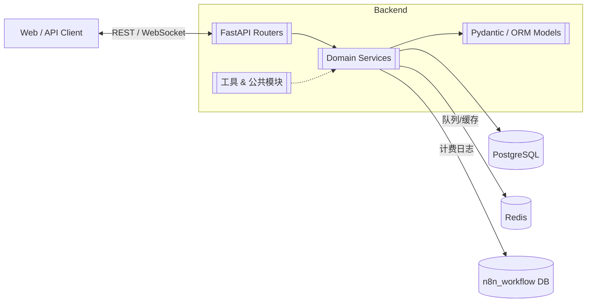
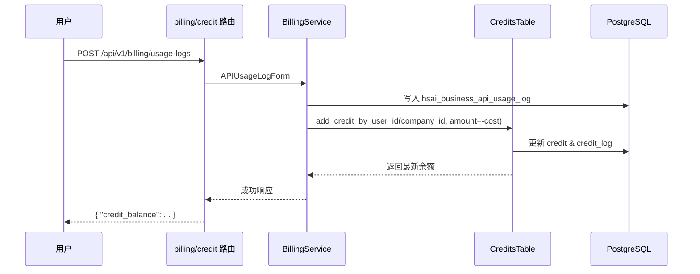

# HSAI 管理系统 · 项目知识库（PROJECTWIKI.md）
> 一等公民 · 与主干代码保持持续一致（UTF-8）

更新日期：2025-10-23（与 main 同步）

## 项目概述
HSAI 管理系统提供统一的 AI 任务编排、材料管理与计费能力，后端采用 FastAPI + Pydantic + SQLAlchemy，前端以 SvelteKit 为主。系统围绕“公司 → 项目 → 任务”的多租户模型构建，核心能力包括：
- 统一鉴权（JWT / API Key）与用户、组织、公司层级权限控制。
- 多模态任务执行（材料生成、视频学习、流程编排）及队列治理。
- 计费与积分体系：支持模型调用扣费、公司账户共享额度、充值对账。
- 可扩展的插件与工具生态（Tool Server、Workflow、外部模型接入）。

## 架构设计
### 总体架构


### 关键流程：公司账户扣费


## 数据模型
```mermaid
erDiagram
  companies ||--o{ hsai_projects : 拥有
  hsai_projects ||--o{ hsai_tasks : 包含
  users ||--o{ hsai_tasks : 创建
  users ||--o{ credit : 余额
  companies ||--o{ credit : 共享
  credit ||--o{ credit_log : 变动记录
  hsai_tasks ||--o{ hsai_cards : 派生

  companies {
    string id PK
    string name
    string owner_user_id FK users.id
    json company_info
    string status
    json config
    bigint created_at
    bigint updated_at
  }
  hsai_projects {
    string id PK
    string name
    string description
    string user_id FK users.id
    string company_id FK companies.id
    string status
    json config
    bigint created_at
    bigint updated_at
  }
  hsai_tasks {
    string id PK
    string title
    string task_type
    string status
    string user_id FK users.id
    string project_id FK hsai_projects.id
    bigint progress
    bigint created_at
    bigint updated_at
  }
  credit {
    string id PK
    string user_id FK users.id UNIQUE
    string company_id FK companies.id
    numeric credit
    bigint created_at
    bigint updated_at
  }
  credit_log {
    string id PK
    string user_id FK users.id
    string company_id FK companies.id
    numeric credit
    json detail
    bigint created_at
  }
```

## 模块文档
### backend/open_webui/routers
- **hsai_companies.py**：公司 CRUD、分页、项目列表过滤；依赖 `get_verified_user`，输出 `PaginatedCompanyResponse`。
- **hsai_projects.py**：项目 CRUD、任务模板初始化；创建时自动注入默认任务；支撑分页与状态过滤。
- **hsai_tasks.py**：任务查询、指派、进度更新、统计，统一调用 `check_credit_by_user_id` 校验额度。
- **billing.py**：计费配置、API 使用日志、公司积分查询 (`GET /billing/user/credit`)；管理员权限由 `get_admin_user` 保障。
- **credit.py**：个人积分日志、充值票据、统计报表；普通用户分页读取自身日志，管理员支持关键字检索。
- **auths.py / users.py**：登录注册、用户资料维护、管理员批量操作等；与积分模块解耦但通过 `Credits` 初始化余额。

### backend/open_webui/services
- **billing_service.py**：封装资源费率计算、API 调用落库、公司积分扣减；`update_company_credit` 统一使用 `AddCreditForm(company_id=...)` 写入。
- **conversation_queue_handler.py**：对话队列消费与任务触发；依赖 Redis Streams。

### backend/open_webui/models
- **credits.py**：定义 `Credit`, `CreditLog`, `TradeTicket` ORM 表及 `CreditsTable` 操作。新增 `company_id` 字段后，`_resolve_credit_owner` 负责基于用户推导公司负责人。
- **hsai_companies.py / hsai_projects.py / hsai_tasks.py**：提供 Pydantic 校验与 SQLAlchemy 表结构（含时间戳归一化）。
- **billing_config.py / api_usage_log.py**：计费费率配置与日志模型。

### 工具与脚本
- **tool/add_company_credit_columns.py**：为 `credit` 与 `credit_log` 表补齐 `company_id` 列并回填历史数据，支持 SQLite 与 PostgreSQL。
- **tool/test_redis_queue_insert.py** 等：用于 Redis 队列结构校验与修复。

## API 手册（核心端点）
### 公司与项目
| 方法 | 路径 | 描述 | 权限 |
|------|------|------|------|
| GET | `/api/v1/hsai/companies` | 公司分页（按状态过滤） | Verified User |
| POST | `/api/v1/hsai/companies` | 新建公司 | Verified User |
| GET | `/api/v1/hsai/companies/{company_id}` | 读取详情 | Verified User（公司负责人） |
| PUT | `/api/v1/hsai/companies/{company_id}` | 更新基本信息 | Verified User（公司负责人） |
| GET | `/api/v1/hsai/companies/{company_id}/projects` | 查看公司项目 | Verified User（公司负责人） |

| 方法 | 路径 | 描述 | 权限 |
|------|------|------|------|
| GET | `/api/v1/hsai/projects` | 项目分页/筛选 | Verified User |
| POST | `/api/v1/hsai/projects` | 创建项目并初始化默认任务 | Verified User |
| PUT | `/api/v1/hsai/projects/{project_id}` | 更新项目信息 | Verified User（所有者） |
| DELETE | `/api/v1/hsai/projects/{project_id}` | 删除项目 | Verified User（所有者） |

### 任务
| 方法 | 路径 | 描述 | 权限 |
|------|------|------|------|
| GET | `/api/v1/hsai/tasks` | 任务分页、状态筛选 | Verified User |
| POST | `/api/v1/hsai/tasks` | 创建任务（可附带 chat 快照） | Verified User |
| PUT | `/api/v1/hsai/tasks/{task_id}` | 更新任务详情 | Verified User（参与者） |
| PUT | `/api/v1/hsai/tasks/{task_id}/progress?progress=INT` | 更新进度 | Verified User（参与者） |
| POST | `/api/v1/hsai/tasks/{task_id}/assign?assignee_id=UID` | 指派任务 | Verified User（负责人） |
| GET | `/api/v1/hsai/tasks/cards/chat/{chat_id}` | 根据会话读取任务卡片 | Verified User |

### 积分与计费
| 方法 | 路径 | 描述 | 权限 |
|------|------|------|------|
| GET | `/api/v1/billing/user/credit` | 获取当前用户所属公司积分余额 | Verified User |
| GET | `/api/v1/credit/logs` | 获取个人积分日志 | Verified User |
| GET | `/api/v1/credit/all_logs` | 管理员查看全量日志 | Admin |
| POST | `/api/v1/billing/usage-logs` | 记录模型调用扣费 | Admin |
| GET | `/api/v1/billing/configs` | 计费费率配置分页 | Admin |
| POST | `/api/v1/credit/tickets` | 创建充值订单 | Verified User |

## 配置与运行依赖
- **数据库**：默认 PostgreSQL（`DATABASE_URL`），可配置 `DATABASE_SCHEMA`；某些日志写入 `N8N_DATABASE_URL`。
- **缓存/队列**：Redis 用于对话/任务排队。
- **环境变量关键项**：`WEBUI_AUTH_*`（鉴权）、`CREDIT_*`（积分策略）、`USAGE_CALCULATE_*`（计费单价）。
- **初始化脚本**：`backend/sql/postgresql_init_from_sqlite.sql`、`backend/sql/sqlite_dump_raw.sql` 用于数据库引导；执行后需运行 `tool/add_company_credit_columns.py` 修复旧表结构。

## 设计决策 & 技术债务
- **积分统一于公司维度**：通过 `company_id` 将同公司用户余额合并，BillingService 与 CreditsTable 保持一致；后续需要对前端展示（个人额度）做差额提示。
- **双数据库架构**：业务主库与 n8n_workflow 分离，计费日志与视频学习读取使用二级连接池；需监控跨库事务失败的补偿逻辑。
- **任务模板自动化**：项目创建时批量生成默认任务，当前模板硬编码在 `PROJECT_MAIN_TASK_TEMPLATES`，未来应移至可配置存储。
- **技术债务**：
  - 缺少对公司层面积分消费的并发锁，短期通过数据库事务满足，但高并发下需引入悲观锁或分布式锁。
  - 计费日志缺乏聚合索引（company_id + created_at），大体量数据时分页可能退化。
  - Redis 队列脚本散落在 `tool/` 目录，建议统一为 CLI。

## 测试与运维
- **单元测试**：后端核心模块使用 `pytest`；计费相关测试见 `backend/test/test_billing_system.py`。
- **脚本验证**：`tool/` 目录提供数据库列校验、Redis 队列修复脚本，运行前需确认 `.env` 指向正确环境。
- **监控建议**：重点观测 `credit`/`credit_log` 同步延迟、Redis Stream 消费积压、n8n 数据库链路。

## 术语表
| 术语 | 说明 |
|------|------|
| 公司（Company） | 多租户入口，绑定负责人用户，提供共享积分。 |
| 项目（Project） | 公司内的业务容器，聚合任务与材料。 |
| 任务（Task） | AI 调用/流程执行的基本单元，可关联对话与素材。 |
| 积分（Credit） | 计费体系的虚拟货币，按公司维度共享，支持充值与扣费。 |
| Usage Log | `hsai_business_api_usage_log` 中的模型调用记录。 |
| Trade Ticket | 充值工单，结合第三方支付回调自动入账。 |

## 变更日志
### 2025-10-23
- 修复：Markdown 中文乱码问题，重写 PROJECTWIKI 信息结构，确保控制字符与替换符清零。
- 更新：新增公司积分统一说明、`tool/add_company_credit_columns.py` 使用指引、`GET /billing/user/credit` 接口文档。
