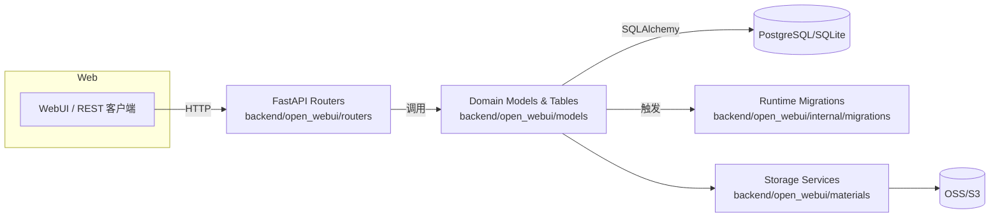
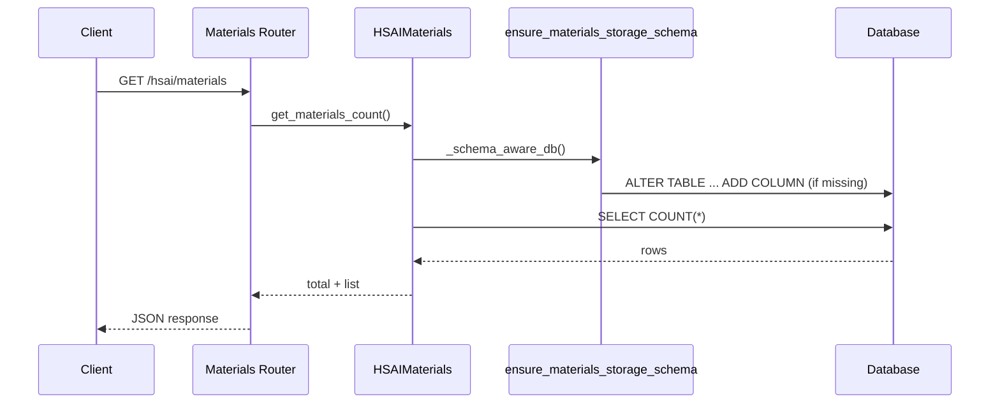

# PROJECTWIKI

## 项目概述
- 目标：提供集 FFmpeg、OSS、素材管理与工作流一体化的 AI 创作控制台，统一 WebUI、API 与任务调度。
- 入口：`backend/open_webui/main.py` 暴露 FastAPI (`/api/v1`)；前端通过 `vite` 构建。
- 部署：默认使用 PostgreSQL（或 SQLite）存储业务数据，可通过 `ENV`/`.env` 切换。

## 架构设计

### 质量基线
- Freshness：WIKI 与主干代码漂移 ≤ 7 天，新增/迁移须在同一提交更新。
- Traceability：`PROJECTWIKI.md` 段落引用具体代码路径（如 `backend/open_webui/models/hsai_materials.py:100`）。

## 架构决策记录（ADR）
### ADR-2025-11-13：HSAI 素材 OSS 列运行时自愈
- 背景：`hsai_materials` 表缺少 `oss_object_path` 列时，`HSAIMaterials.get_materials_count()` 的 `query.count()` 触发 `psycopg2.errors.UndefinedColumn`。
- 方案：新增 `ensure_materials_storage_schema()`（`backend/open_webui/internal/migrations/materials_storage.py`），并在 `HSAIMaterials` 所有 DB 访问前调用 `_schema_aware_db()`，首次连接即补列。
- 取舍：优先运行时自愈，避免用户手工执行 SQL；后续仍可叠加离线迁移。
- 验证：`pytest backend/test/test_materials_storage_schema.py` 覆盖 SQLite 场景；在 PostgreSQL 上依赖相同 SQL 片段。
- 回滚：若需关闭自愈，可在 `HSAIMaterials` 注释 `_schema_aware_db()` 调用并手动迁移（需在变更说明记录）。

## 设计决策 & 技术债务
- 仍缺少系统化的 Alembic 迁移；短期通过 runtime migrations 保持列一致性，但建议中期补齐版本化脚本。
- 素材 OSS 元数据没有冗余校验（如桶名称合法性），可在下个迭代补充约束。

## 模块文档
### HSAI Materials（`backend/open_webui/models/hsai_materials.py`）
- 职责：定义素材/标签/分类 ORM、Pydantic 模型与业务访问层。
- 入口：`HSAIMaterialsTable` (`HSAIMaterials` 单例) 提供 CRUD / 聚合。
- 外部依赖：`open_webui.internal.db` (SQLAlchemy Session)、`open_webui.internal.migrations.materials_storage`.
- 测试基线：`backend/test/test_materials_storage_schema.py`、`tests/materials_e2e_test.py`。
- 风险：大量方法直接暴露 Session；需保持 `_schema_aware_db()` 包裹，避免绕过迁移。

## API 手册
### GET `/api/v1/hsai/materials/`
- 参数：`folder_id`、`material_type`、`scene_code`、`item_code`、分页 `limit/offset`。
- 返回：`{"items": [HSAIMaterialResponse], "total": int}`；每条素材包含 `oss_bucket/oss_key/oss_object_path`。
- 错误：缺列时曾抛出 500（已由 runtime 迁移修复）。

## 数据模型
- `hsai_materials`：核心列 `id`, `name`, `material_type`, `scene_code`, `oss_bucket`, `oss_key`, `oss_object_path`, `created_at`.
- 软删除由 `is_deleted`, `deleted_at`, `deleted_by` 维护，查询需过滤。

## 核心流程

## 依赖图谱
- 应用依赖：FastAPI、SQLAlchemy、Pydantic、psycopg2、OSS SDK（上传/下载由 `materials/storage_backend.py` 调用）。
- 内部依赖：`open_webui.internal.migrations` 为模型提供 schema 保障；`open_webui.services` 复用 `HSAIMaterials` 进行复合业务。

## 维护建议
- 启动前监控日志中是否存在 `[MIGRATION] ensure_materials_storage_schema` 相关输出，确保 schema 自愈成功。
- 新增列时同步扩展 `_column_defs_for()`，避免 PostgreSQL/SQLite 定义不一致。
- 建议在 CI 中最低运行 `pytest backend/test/test_materials_storage_schema.py` 以防回归。

## 术语表
- **OSS**：阿里云对象存储，保存大文件。
- **Runtime Migration**：应用启动时执行的最小化 schema 校验/修复逻辑。
- **Schema Guard**：`_schema_aware_db()`，用于确保数据库结构满足模型需求。

## 变更日志
- 2025-11-13：引入 `ensure_materials_storage_schema()` 修复 `oss_object_path` 缺列导致的计数查询奔溃（参阅 ADR-2025-11-13）。
