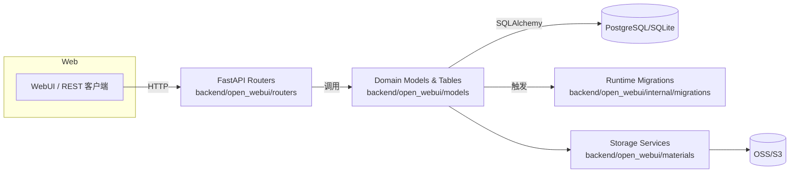
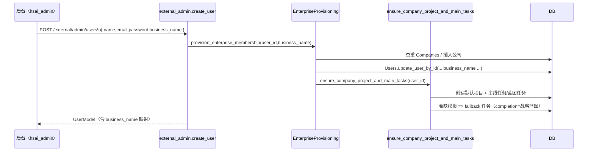
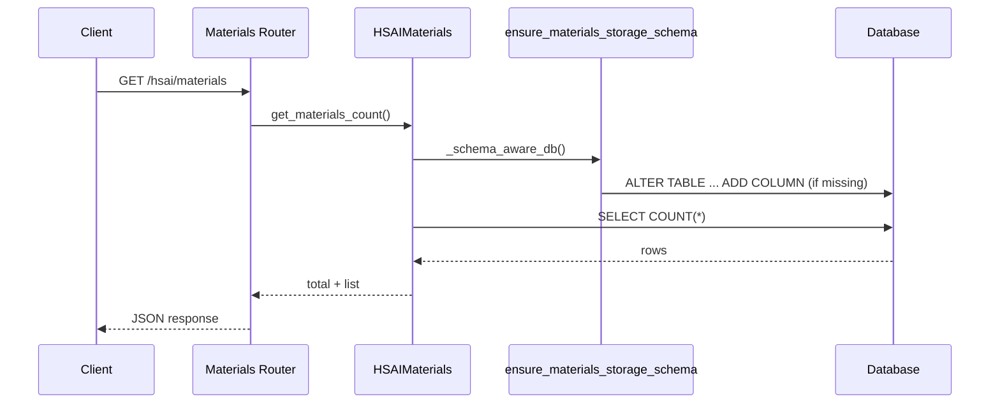

# PROJECTWIKI

## 项目概述
- 目标：提供集 FFmpeg、OSS、素材管理与工作流一体化的 AI 创作控制台，统一 WebUI、API 与任务调度。
- 入口：`backend/open_webui/main.py` 暴露 FastAPI (`/api/v1`)；前端通过 `vite` 构建。
- 部署：默认使用 PostgreSQL（或 SQLite）存储业务数据，可通过 `ENV`/`.env` 切换。

## 架构设计

### 质量基线
- Freshness：WIKI 与主干代码漂移 ≤ 7 天，新增/迁移须在同一提交更新。
- Traceability：`PROJECTWIKI.md` 段落引用具体代码路径（如 `backend/open_webui/models/hsai_materials.py:100`）。

## 架构决策记录（ADR）
### ADR-2025-11-14：外部开户企业编排（`backend/open_webui/services/enterprise_provisioning.py`）
- 背景：后台（hsai_admin）创建客户账号时，需要在业务服务端同步企业查重、默认项目与“企业信息收集”主线任务，历史上 `external_admin` 仅创建用户记录。
- 决策：
  1. `AddUserForm/ExternalAdminUserUpdateForm` 新增 `business_name` 字段，`external_admin` 路由强制要求该字段；
  2. 新建 `provision_enterprise_membership()` 服务，负责企业查重 → 公司创建 → 用户绑定 → 默认项目/任务编排；
  3. `ensure_company_project_and_main_tasks()` 在缺少 `company_info_collection` 模板时自动写入 fallback 任务（终止条件：收到战略蓝图）。
- 影响：`external_admin` 现在具备幂等的企业侧效应；后台只需提交企业名称即可完成联动。
- 回滚：可在 `external_admin` 中跳过 `provision_enterprise_membership()` 调用并将 `business_name` 设为可选，但需同时通知后台移除必填约束。

### ADR-2025-11-14：External Admin 企业 / 项目直连（ackend/open_webui/routers/external_admin.py, ackend/open_webui/main.py）
- 后台与脚本若需跨租户管理企业/项目，优先调用 /api/v1/external/admin/companies|projects（配合 erify_external_request 的 IP+Token 鉴权）；仅在携带 JWT 的 WebUI 内部操作时才使用 /api/v1/hsai/*。
- 决策：
  1. 在 external_admin 下新增 /companies、/companies/{id}/projects、/projects 全量 CRUD，并共用 PaginatedCompanyResponse / PaginatedHSAIProjectResponse；
  2. 通过 _build_company_pagination() 与 _build_project_pagination() 保证分页 schema 与后台客户端一致；
  3. 在 main.py 重新注册 hsai_companies 路由（/api/v1/hsai/companies），供 WebUI 内 JWT 用户继续使用，同时后台改调 /api/v1/external/admin/*。
- 影响：hsai_admin 的 MainSystemAPIClient 现以 external_admin 路径为唯一数据源，external_admin 也成为企业 / 项目运维的对外入口。
- 回滚：若 external_admin 暂不可用，可移除该路由并回退到 /api/v1/hsai/* + JWT 的旧链路，同时同步恢复后台客户端配置。

### ADR-2025-11-14：Ops Dashboard 异步派发（`backend/open_webui/services/ops_dashboard_ingestor.py`）
- 背景：`handle_conversation_agent_message()` 在 status ∈ {FINISHED,FAILED,ERROR} 时直接 `_fire_and_forget(_record_conversation_event)`，Redis 消费器基于一次性 `asyncio.run` 退出，未完成的上报任务会被销毁并丢失事件。
- 决策：实现 `ConversationEventDispatcher`（`asyncio.Queue` + worker）并在 FastAPI `lifespan` 中同步 start_conversation_ingestion()/stop_conversation_ingestion()；主流程仅 put_nowait，worker 负责 `await ops_dashboard_client.send_conversations()` 并按 `OPS_DASHBOARD_MAX_ATTEMPTS` 指数退避，停机阶段注入哨兵并关闭 `aiohttp` session。
- 影响：
  - `backend/open_webui/services/ops_dashboard_ingestor.py`：新增 dispatcher 与队列降级逻辑；
  - `backend/open_webui/services/ops_dashboard_client.py`：新增 `close()`；
  - `backend/open_webui/main.py`：在 `lifespan` 启停 dispatcher；
  - `backend/open_webui/env.py`：暴露 `OPS_DASHBOARD_QUEUE_MAXSIZE/OPS_DASHBOARD_MAX_ATTEMPTS`；
  - `backend/test/test_ops_dashboard_ingestor.py`：新增异步派发自测。
- 验证：`python -m pytest test/test_ops_dashboard_ingestor.py`；并在本地触发一条工作流后优雅关闭服务，确认日志无 pending task。
- 回滚：若需降级，可设置 `OPS_DASHBOARD_ENABLED=false`（停用埋点）或暂时移除 start_conversation_ingestion() 调用恢复旧的 `_fire_and_forget` 路径，并在 WIKI/CHANGELOG 记录。
### ADR-2025-11-13：HSAI 素材 OSS 列运行时自愈
- 背景：`hsai_materials` 表缺少 `oss_object_path` 列时，`HSAIMaterials.get_materials_count()` 的 `query.count()` 触发 `psycopg2.errors.UndefinedColumn`。
- 方案：新增 `ensure_materials_storage_schema()`（`backend/open_webui/internal/migrations/materials_storage.py`），并在 `HSAIMaterials` 所有 DB 访问前调用 `_schema_aware_db()`，首次连接即补列。
- 取舍：优先运行时自愈，避免用户手工执行 SQL；后续仍可叠加离线迁移。
- 验证：`pytest backend/test/test_materials_storage_schema.py` 覆盖 SQLite 场景；在 PostgreSQL 上依赖相同 SQL 片段。
- 回滚：若需关闭自愈，可在 `HSAIMaterials` 注释 `_schema_aware_db()` 调用并手动迁移（需在变更说明记录）。

## 设计决策 & 技术债务
- 仍缺少系统化的 Alembic 迁移；短期通过 runtime migrations 保持列一致性，但建议中期补齐版本化脚本。
- 素材 OSS 元数据没有冗余校验（如桶名称合法性），可在下个迭代补充约束。

## 模块文档
### Enterprise Provisioning（`backend/open_webui/services/enterprise_provisioning.py`）
- 职责：`provision_enterprise_membership()` 幂等化企业查重、公司创建、用户绑定以及触发 `ensure_company_project_and_main_tasks()`。
- 入口：`external_admin.create_user/update_user` 成功后调用，确保后台开户即同步企业资产。
- 风险：`business_name` 为空会抛出 400；若 `Companies.insert_new_company()` 返回空需要关注数据库连接/约束问题。

### Onboarding Orchestrator（`backend/open_webui/services/onboarding_orchestrator.py`）
- 更新点：当 `task_template_registry` 中缺少 `company_info_collection` 模板时，自动注入 fallback 任务（模板 key `company_info_collection_fallback`，完成条件“收到战略蓝图”）。
- 输出：`seeded_main_tasks` 现在可能包含 fallback 记录，外部系统可据此识别模板缺失情况。

### External Admin Router（`backend/open_webui/routers/external_admin.py`）
- `POST /external/admin/users`：新增 `business_name` 校验，并在创建用户后调用企业编排服务。
- `PUT /external/admin/users/{id}`：允许在更新时重新绑定企业名称，自动触发企业 / 项目同步。
- `/external/admin/companies|projects`：提供完整的分页列表、详情、创建、更新、删除与企业内项目列表接口，统一输出 `PaginatedCompanyResponse` / `PaginatedHSAIProjectResponse`，并沿用 `_build_*_pagination()` 计算分页信息。
- `/external/admin/companies/{company_id}/users/{user_id}`：允许后台批量绑定 / 解绑企业管理员，保持用户 `business_name`、`company_id` 一致。

### HSAI Companies / Projects Routers（`backend/open_webui/routers/hsai_companies.py`, `hsai_projects.py`）
- 超级管理员 (`is_super_admin=True`) 可以查询/管理全部企业与项目，并可通过请求体中的 `owner_user_id` 或 `user_id` 来指定企业负责人或项目负责人。
- 2025-11-14：GET /hsai/projects/{project_id} 在 backend/open_webui/routers/hsai_projects.py:244-251 修复 if 语句多余 “)” 导致的 SyntaxError，并确保无权限或缺少项目时正确返回 404。
- 2025-11-14：`GET /hsai/projects/{project_id}/tasks`（路径 `backend/open_webui/routers/hsai_projects.py:368-410`）补全 try/except 缩进并在权限校验通过后返回任务列表，避免 Uvicorn 导入期的 IndentationError。
- 2025-11-14：`GET /hsai/projects` 参数描述文本因编码损坏触发 SyntaxError（`backend/open_webui/routers/hsai_projects.py:96-101`），现已还原为 UTF-8 中文说明，保障 Uvicorn 可正常导入。
- 普通用户保持原有边界，仅能访问自身资源，从而保证 API 既能支撑后台联动，也不会破坏多租户隔离。
- 为兼容 WebUI 内部场景，main.py 重新注册 hsai_companies.router，携带 JWT 的用户继续走 /api/v1/hsai/companies|projects，后台统一使用 /api/v1/external/admin/*。

### HSAI Materials（`backend/open_webui/models/hsai_materials.py`）
- 职责：定义素材/标签/分类 ORM、Pydantic 模型与业务访问层。
- 入口：`HSAIMaterialsTable` (`HSAIMaterials` 单例) 提供 CRUD / 聚合。
- 外部依赖：`open_webui.internal.db` (SQLAlchemy Session)、`open_webui.internal.migrations.materials_storage`.
- 测试基线：`backend/test/test_materials_storage_schema.py`、`tests/materials_e2e_test.py`。
- 风险：大量方法直接暴露 Session；需保持 `_schema_aware_db()` 包裹，避免绕过迁移。

## API 手册
### GET `/api/v1/hsai/materials/`
- 参数：`folder_id`、`material_type`、`scene_code`、`item_code`、分页 `limit/offset`。
- 返回：`{"items": [HSAIMaterialResponse], "total": int}`；每条素材包含 `oss_bucket/oss_key/oss_object_path`。
- 错误：缺列时曾抛出 500（已由 runtime 迁移修复）。

## 数据模型
- `hsai_materials`：核心列 `id`, `name`, `material_type`, `scene_code`, `oss_bucket`, `oss_key`, `oss_object_path`, `created_at`.
- 软删除由 `is_deleted`, `deleted_at`, `deleted_by` 维护，查询需过滤。

## 核心流程

## 依赖图谱
- 应用依赖：FastAPI、SQLAlchemy、Pydantic、psycopg2、OSS SDK（上传/下载由 `materials/storage_backend.py` 调用）。
- 内部依赖：`open_webui.internal.migrations` 为模型提供 schema 保障；`open_webui.services` 复用 `HSAIMaterials` 进行复合业务。

## 维护建议
- 启动前监控日志中是否存在 `[MIGRATION] ensure_materials_storage_schema` 相关输出，确保 schema 自愈成功。
- 新增列时同步扩展 `_column_defs_for()`，避免 PostgreSQL/SQLite 定义不一致。
- 建议在 CI 中最低运行 `pytest backend/test/test_materials_storage_schema.py` 以防回归。
- 当后台或脚本需要跨租户管理企业/项目时，请使用 `is_super_admin` 账号调用 `/hsai/companies`、`/hsai/projects` API，避免直接写库。

## 术语表
- **OSS**：阿里云对象存储，保存大文件。
- **Runtime Migration**：应用启动时执行的最小化 schema 校验/修复逻辑。
- **Schema Guard**：`_schema_aware_db()`，用于确保数据库结构满足模型需求。

## 变更日志
- 2025-11-13：引入 `ensure_materials_storage_schema()` 修复 `oss_object_path` 缺列导致的计数查询奔溃（参阅 ADR-2025-11-13）。