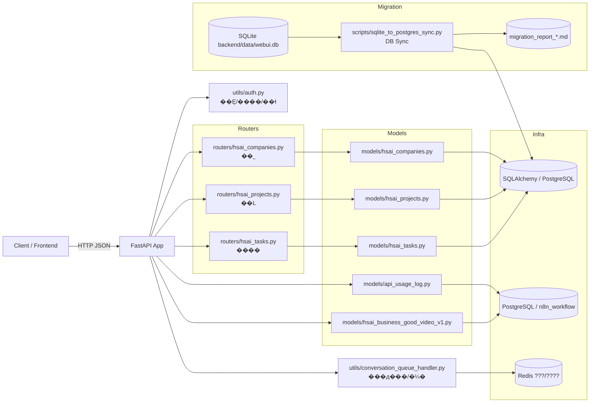
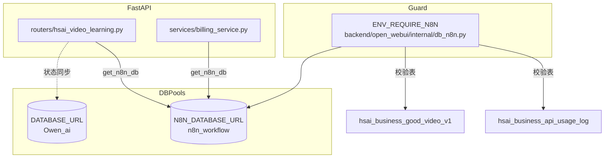
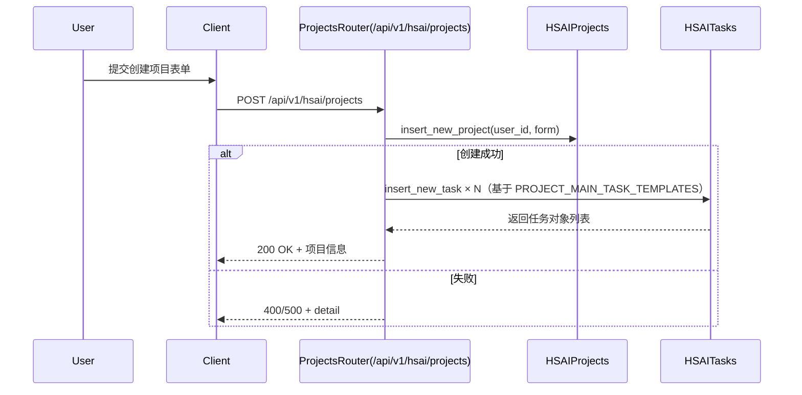
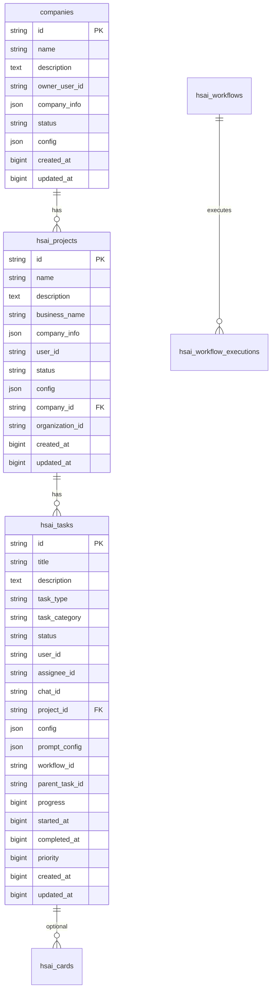

# HSAI 管理系统 · 项目知识库（PROJECTWIKI.md）
> 一等公民 · 与主干代码保持持续一致（UTF-8）

更新时间：2025-10-23（与 main 同步）

## 项目概述

HSAI 后台管理系统采用 FastAPI + Pydantic + SQLAlchemy 实现，统一以 `/api/v1` 为后端 API 前缀。业务核心域包括：公司（companies）、项目（hsai_projects）与任务（hsai_tasks）。所有接口默认要求鉴权（Bearer JWT 或 `sk-` 前缀 API Key，受端点白名单限制）。

数据库默认连接托管的 PostgreSQL（RDS），通过 .env 与 ackend/.env 中的 DATABASE_URL、可选 DATABASE_SCHEMA 管理；ackend/sql/postgresql_init_from_sqlite.sql 提供 SQLite → PostgreSQL 的全量初始化脚本（含结构与数据），执行前请先备份目标库。

## 架构设计

### 总览图


#### 视频学习 / 计费双数据库路由校验


> 说明：ENV_REQUIRE_N8N=true 时，启动期会校验 n8n_workflow 数据库是否存在上述两张表，缺失将阻断启动并提示修复或显式关闭自检。

节点与代码路径映射（节选）：
- FastAPI 装载与路由挂载：`backend/open_webui/main.py:1224`
- 公司路由：`backend/open_webui/routers/hsai_companies.py:1`
- 项目路由：`backend/open_webui/routers/hsai_projects.py:1`
- 任务路由：`backend/open_webui/routers/hsai_tasks.py:1`
- 公司模型：`backend/open_webui/models/hsai_companies.py:1`
- 项目模型：`backend/open_webui/models/hsai_projects.py:1`
- 任务模型：`backend/open_webui/models/hsai_tasks.py:1`
- API ???????`backend/open_webui/models/api_usage_log.py:1`
- n8n ???????`backend/open_webui/models/hsai_business_good_video_v1.py:1`
- 鉴权与当前用户：`backend/open_webui/utils/auth.py:210`
- SQLite 数据库文件：`backend/data/webui.db`
- 同步脚本：`scripts/sqlite_to_postgres_sync.py`
- 迁移报告产物：`migration_report_*.md`（脚本执行后生成）

### 关键流程（创建项目自动生成主线任务）


## 数据模型



来源：`backend/sql/init_scripts/2025-10-04_full_database_init.sql:606–652`, `685–704` 与对应 ORM 模型。

## 模块文档

### 公司（routers/hsai_companies.py）
- 职责：公司实体的增删改查与分页；按公司查询项目列表。
- 入口：`backend/open_webui/routers/hsai_companies.py:1`
- 关键类型：CompanyModel、CompanyForm、CompanyUpdateForm、CompanyResponse、PaginatedCompanyResponse。
- 外部依赖：鉴权 `get_verified_user`。

### 项目（routers/hsai_projects.py）
- 职责：项目增删改查与分页；创建项目后按模板自动创建主线任务。
- 入口：`backend/open_webui/routers/hsai_projects.py:1`
- 关键类型：HSAIProjectModel、HSAIProjectForm、HSAIProjectUpdateForm、HSAIProjectResponse、PaginatedHSAIProjectResponse。

### 任务（routers/hsai_tasks.py）
- 职责：任务增删改查、筛选分页、进度更新、指派、统计、按聊天获取卡片等。
- 入口：`backend/open_webui/routers/hsai_tasks.py:1`
- 关键枚举：
  - HSAITaskStatus：`pending|in_progress|completed|failed|cancelled`
  - HSAITaskType：`video_creation|content_analysis|material_processing|platform_publishing|workflow_execution`

## API 手册（HSAI 核心域）

统一前缀：`/api/v1`

### 公司 `/hsai/companies`
- GET `/` 获取公司列表（分页）
  - Query：`company_status?: string`, `ps?: int=20 [1..100]`, `pi?: int=1 (从1开始)`
  - Auth：`Authorization: Bearer <token>` 或 `Bearer sk-...`
  - Resp：`{ data: CompanyResponse[], pagination: { total, page, size, total_pages } }`
- POST `/` 创建公司
  - Body：CompanyForm `{ name: string, description?: string, company_info?: object, config?: object }`
  - Resp：CompanyResponse
- GET `/ {company_id}` 获取详情
- PUT `/ {company_id}` 更新
  - Body：CompanyUpdateForm（全部可选）
- DELETE `/ {company_id}` 删除（返回 `true|false`）
- GET `/ {company_id}/projects` 获取该公司项目（分页）
  - Query：`status?: string`, `ps?: int`, `pi?: int`
  - Resp：PaginatedHSAIProjectResponse

示例响应（分页）：
```json
{
  "data": [
    {"id":"...","name":"ACME","owner_user_id":"u1","status":"active","created_at":1690000000,"updated_at":1690000100}
  ],
  "pagination": {"total": 1, "page": 1, "size": 20, "total_pages": 1}
}
```

### 项目 `/hsai/projects`
- GET `/` 获取项目列表（分页）
  - Query：`status?: string`, `ps?: int=20`, `pi?: int=1`
- POST `/` 创建项目（自动创建主线任务）
  - Body：HSAIProjectForm `{ name: string, business_name: string, description?: string, company_info?: object, config?: object, organization_id?: string }`
- GET `/ {project_id}` 获取详情
- PUT `/ {project_id}` 更新（HSAIProjectUpdateForm）
- DELETE `/ {project_id}` 删除（bool）
- GET `/ {project_id}/tasks` 获取项目任务列表

### 任务 `/hsai/tasks`
- GET `/` 获取任务列表（分页/筛选）
  - Query：`status?: string`, `task_type?: string`, `assignee_id?: string`, `chat_id?: string`, `ps?: int=20`, `pi?: int=1`
- POST `/` 创建任务（可选绑定 chat 卡片）
  - Body：HSAITaskForm（见模型）
- GET `/ {task_id}` 获取详情
- PUT `/ {task_id}` 更新（HSAITaskUpdateForm）
- PUT `/ {task_id}/progress` 更新进度
  - Query：`progress: int (0..100)`
- POST `/ {task_id}/assign` 指派任务
  - Query：`assignee_id: string`
- GET `/statistics` 任务统计
  - Resp：`{ total_tasks, pending_tasks, in_progress_tasks, completed_tasks, failed_tasks, tasks_by_type, avg_completion_time? }`
- GET `/cards/chat/{chat_id}` 按会话获取卡片（分页）

错误与鉴权约定：
- 401 未认证 / 403 禁止：令牌无效或端点未获 API Key 许可
- 404 未找到：资源不存在或不属于当前用户
- 500 服务器内部错误：`detail` 使用统一错误消息（见 `open_webui/constants.py`）

分页约定：
- `ps` 为每页大小（1–100），`pi` 为页码（从 1 开始）；响应返回 `pagination.total/page/size/total_pages`。

## 依赖图谱（高层）

```mermaid
flowchart TB
  subgraph API(/api/v1)
    RC[hsai_companies]
    RP[hsai_projects]
    RT[hsai_tasks]
  end
  RC --> MC[Company ORM]
  RP --> MP[Project ORM]
  RT --> MT[Task/Card/Workflow ORM]
  MC --> DB[(DB)]
  MP --> DB
  MT --> DB
  API --> AUTH[Auth/JWT/APIKey]
```

## 运维

### 数据库配置（PostgreSQL）
- `DATABASE_URL`：根目录 `.env` 与 `backend/.env` 的主配置项，指向阿里云 RDS PostgreSQL；Windows 批处理脚本 `backend/start_windows.bat` 与 `backend/start_with_env.py` 会在未设置时注入同一 URL。
- `DATABASE_SCHEMA`（可选）：默认 `public`。如需多租户/逻辑隔离，可在 `.env` 中声明并同步更新 Alembic/脚本参数。
- `MIGRATION_BATCH_SIZE`（可选）：迁移脚本的批插入大小，默认 1000。
- 依赖：`psycopg2` 作为 PostgreSQL 驱动，随 `requirements.txt` 安装。

### SQLite -> PostgreSQL ͬ���ű� SOP
1. **��������**��Ϊ������ `.env` ��ϵͳ����������������`POSTGRES_HOST/PORT/DB/USER/PASSWORD` ��ѡ�� `DATABASE_URL`�����Ƽ���ͬʱ���� `DATABASE_SCHEMA` (Ĭ�� public)���ڵ��ڱ��ݱ��棬ָ�� `--backup-dir` Ǩ��ǰ���� SQLite `.dump` �� PostgreSQL `pg_dump`��
2. **Dry-Run ��**��
   ```bash
   POSTGRES_HOST=<host> POSTGRES_PORT=5432 POSTGRES_DB=Owen_ai \
   POSTGRES_USER=hsai POSTGRES_PASSWORD=**** \
   python scripts/sqlite_to_postgres_sync.py --dry-run --verbose --sqlite-path backend/data/webui.db
   ```
   Dry-run ģʽ��ֻ�����������������ƣ��� PostgreSQL ����ת��ʵִ�С�WIKI �ᱣ����ɫǨ�ƽű��Ϣ��
3. **ʵ��Ǩ��**��ȷ�� Dry-run û���������󣬽���ʵִ�У�Ĭ������ `recreate` ģʽ��DROP ������ͬ������
   ```bash
   POSTGRES_HOST=<host> POSTGRES_PORT=5432 POSTGRES_DB=Owen_ai \
   POSTGRES_USER=hsai POSTGRES_PASSWORD=**** \
   python scripts/sqlite_to_postgres_sync.py --batch-size 2000 --backup-dir backups/db --report-dir .
   ```
   - ���ݶ�ȡ�� SQLite `backend/data/webui.db`
   - ���ݷ���：PostgreSQL `Owen_ai`�� schema ע���� `--schema` ��������
   - �ű�����������Դ������Boolean/Timestamp/JSON �ֶκ͹ؼ������С�
4. **�����鿴**��ִ����ɺ�Ĭ��Ҫ���ɵ� `migration_report_<timestamp>.md` ���ڸ�Ŀ¼����������������Ϣ�����鿴��صIJ鿴������ָ����
   - �����������С����ر��Ӽ�¼����ڴ������/������־
   - �ű����Զ�����索��/ΨһԼ����ǰ��Ľ�ɫ״̬��
5. **�ع����Ի���**��
   - ����`--backup-dir` ���������ԭ�� SQLite �� PostgreSQL ���ݱ��棻
   - �ع��某�������� `TRUNCATE TABLE "<schema>"."<table>" CASCADE;` ����Ŀ���б��ٷ���ͬ����
   - ʹ�� `--strict` ѡ�������Ƚ���Ǩ��ʱ���ף�������ⷢ����Ӱ�췢���ԭ�мƻ��
6. **����֤����ű�**��Ǩ��֮����ִ��
   ```bash
   sqlite3 backend/data/webui.db "SELECT COUNT(*) FROM <table>;"
   psql "$DATABASE_URL" -c "SELECT COUNT(*) FROM "<table>";"
   ```
   �ԱȾ���ͳ�ƣ�״̬������������ WIKI Ǩ�Ʊ����¾���
### 监控与运维要点
- PostgreSQL 连接池参数由 `DATABASE_POOL_*` 环境变量控制（见 `open_webui/internal/db.py`），默认 NullPool，生产环境建议显式配置。
- n8n_workflow ???/?????????????? `N8N_DATABASE_*` ?????????????????????????? `DATABASE_*` ??????????????? `hsai_business_api_usage_log` ?? `hsai_business_good_video_v1` ???? 2PC ????????????（默认由 .env / backend/.env 指向 n8n_workflow，配合 ENV_REQUIRE_N8N 与 N8N_REQUIRED_TABLES 自检，详见 ADR-2025-10-23-006）
- `session_replication_role` 在迁移期间切换为 `replica`；若迁移异常退出，请确认已手动恢复为 `origin`。
- 保留 `backend/data/webui.db` 仅用于旧数据分析脚本；后续脚本应通过 SQLAlchemy/psycopg2 直接访问 PostgreSQL。

## 设计决策 & 技术债务/缺陷复盘

- ADR-2025-10-21-001：核心数据库切换至 PostgreSQL 并补齐用户/组织结构
  - 背景：SQLite 在并发写入、权限隔离和连接池管理方面受限；阿里云 RDS PostgreSQL 已启用，需要统一迁移并同步历史字段。
  - 变更：统一 `.env`、`backend/.env`、Windows 启动脚本的 `DATABASE_URL`；重写迁移脚本支持批量迁移、序列校准；在 PostgreSQL 中新增 `user.organization_id`、`user.is_super_admin`、`user.is_org_admin`、`user.credit_balance` 与 `"group".organization_id` 列；WIKI 与 Mermaid 图更新为 PostgreSQL 架构。
  - 影响：运行环境需开放 PostgreSQL 网络权限；SQLite 工具脚本转为只读；迁移脚本会覆盖所有表并重置序列。
  - 验证：在测试库执行 `psql "$DATABASE_URL" -f backend/sql/postgresql_init_from_sqlite.sql`，核对关键表行数与 `pg_get_serial_sequence` 结果后再切换生产。
  - 回滚：使用 `pg_dump` 备份恢复；将 `DATABASE_URL` 改回 SQLite；必要时重新导入 PostgreSQL 数据。
- ADR-2025-10-21-004��SQLite -> PostgreSQL ͬ���ű�（`scripts/sqlite_to_postgres_sync.py`）
  - ������������ܹ�һ����ʼ���ű�ͨ�� DROP/CREATE �ḻ����΢�ӡ��ű���ҵ���Ǩ���ڼ�Ҫ�Աȱ���������JSON/BOOLEAN/TIMESTAMP ����������
  - ������ƶ��� Python ִ���ű��������� SQLite �йأ�ͳһ�� `sqlalchemy` ������֧�֣���ѡ������ PostgreSQL �������ڼ��������Խ������Ӧ�ó���
  - Ӱ�죺���� WIKI ������ɢ�ű���ظģ�ʹ�� CLI ������һ�ֶ�ѡ������ PS �� CI ����ͨ��，�����ٷ��� 10 ����ʵʱ������；Ǩ��ǰ���Զ�����备��，Ǩ����ɺŷ��� Markdown ������¼
  - ��֤��Dry-run ģʽ������ Ping RDS ���ӡ�֮����� `python scripts/sqlite_to_postgres_sync.py --dry-run` �� `python scripts/sqlite_to_postgres_sync.py --backup-dir backups/db` ִ�����ɹ������������ܶȼ�����count() �ԱȺ���索�������У�顣
  - �ع���ʹ�� report ��¼��备��·���������µ��� `.dump` �� `pg_restore` ��������ȫ�����лָ����ִ�еڶ���ʱ��ѡ������ `--strict` ȷ�����д�����ֶ�ȫ��


- FIX-2025-10-22-Billing-AdminAwait?`get_admin_user` ???????????????? `await` ?? TypeError?
  - ??????`GET /api/v1/billing/billing/usage-logs`?`GET /api/v1/billing/billing/usage-logs/session/{session_id}`?`GET /api/v1/billing/billing/usage-logs/session/{session_id}/total`????? `backend/open_webui/routers/billing.py:246`?`backend/open_webui/routers/billing.py:332`?`backend/open_webui/routers/billing.py:366`?
  - ????? `await`??????? `get_admin_user(user)` ???????????????????????
  - ???`python -m compileall backend/open_webui/routers/billing.py`?
- ADR-2025-10-22-005?????? n8n_workflow ???
  - ???`hsai_business_api_usage_log` ? `hsai_business_good_video_v1` ?????? n8n_workflow ????????????????????????????
  - ????? `open_webui/internal/db_n8n.py` ?? `N8NBase`/`get_n8n_db()`?`APIUsageLog` ? `HSAIBusinessGoodVideoV1` ???? Base??? `N8N_DATABASE_*` ?????? `.env` ??????
  - ??????????????????????????????????? n8n ????????????
  - ???`python -m compileall backend/open_webui/models/api_usage_log.py backend/open_webui/models/hsai_business_good_video_v1.py backend/open_webui/internal/db_n8n.py`?

- ADR-2025-10-23-006：N8N 双库连接自检与环境变量收敛
  - 背景：2025-10-23 `/api/v1/hsai/video-learning/videos` 因连接主库缺少 `hsai_business_good_video_v1` 触发 `UndefinedTable`，暴露 `N8N_DATABASE_URL` 未显式配置导致的漂移。
  - 决策：`.env` 与 `backend/.env` 默认指向 `n8n_workflow`，并新增 `ENV_REQUIRE_N8N` / `N8N_REQUIRED_TABLES`，在 `internal/db_n8n.py` 启动期校验关键表，缺失立即阻断。
  - 影响：视频学习、计费模块依赖 n8n 库的接口获得一致的连接池配置；若需跳过校验，可显式设置 `ENV_REQUIRE_N8N=false`。
  - 验证：本地/CI 启动 FastAPI 时必须检测到两张表；运行 `python -m compileall backend/open_webui/internal/db_n8n.py backend/open_webui/models/{api_usage_log.py,hsai_business_good_video_v1.py}` 通过。
  - 回滚：如目标环境尚未初始化 n8n 库，临时关闭自检或回退 `.env` 版本，并使用 `n8n_workflow` 建表示例补齐后再恢复。
- FIX-2025-10-21-Function-Boolean：`function.is_active`/`is_global` ORM 布尔定义统一
  - 根因：SQLite 初始化脚本遗留 `INTEGER`，在 PostgreSQL 中与 SQLAlchemy 的 `BOOLEAN` 定义冲突。
  - 脚本调整：`backend/sql/postgresql_init_from_sqlite.sql` 现将 `meta`/`valves` 列定义为 JSON，`created_at`/`updated_at` 改为 BIGINT，并将 `is_active`/`is_global` 改为 BOOLEAN，全面与 ORM 模型保持一致。
  - 现网修复：若目标库已创建，可执行以下 SQL 进行就地转换：
    ```sql
    ALTER TABLE function
      ALTER COLUMN meta TYPE JSON USING meta::json,
      ALTER COLUMN valves TYPE JSON USING CASE WHEN valves IS NULL OR valves = '' THEN NULL ELSE valves::json END,
      ALTER COLUMN created_at TYPE BIGINT USING created_at::bigint,
      ALTER COLUMN updated_at TYPE BIGINT USING updated_at::bigint,
      ALTER COLUMN is_active TYPE BOOLEAN USING (is_active::bigint <> 0),
      ALTER COLUMN is_global TYPE BOOLEAN USING (is_global::bigint <> 0);
    ```
    若历史数据存在空字符串，可先批量更新为空值再执行转换；如需使用 JSONB，可将目标类型替换为 JSONB 并相应修改 `USING` 子句。
  - 验证：在目标库运行 `\d "function"` 与 `SELECT is_active, pg_typeof(is_active) FROM function LIMIT 5;`，确认列类型正确，应用启动不再报错。
  - 回滚：如需恢复旧结构，可重新导入 SQLite 备份或手动执行逆向 `ALTER TABLE` 将列改回整型/文本（不推荐）。
- FIX-2025-10-21-VideoLearning-Timestamps：`hsai_video_learning_status` 时间字段与模型对齐
  - 根因：SQLite 导出使用 TIMESTAMP/TEXT，ORM 期望 BIGINT Unix 秒。
  - 修复：`backend/sql/postgresql_init_from_sqlite.sql` 已统一以 BIGINT 存储时间戳，并在导入过程中写入整数值。
  - 验证：执行脚本后，通过 `\d "hsai_video_learning_status"` 与 `SELECT created_at FROM hsai_video_learning_status LIMIT 1;` 检查列类型与样例数据。
  - 回滚：重新导入 SQLite 备份或手工 `to_timestamp` 转换，谨慎使用。


- FIX-2025-10-22-HSAI-Timestamp-Normalization：素材库/视频学习时间戳归一化
  - 背景：PostgreSQL 同步后部分表字段实际存储 `timestamp`，而 ORM/Pydantic 仍按 Unix 秒整型定义，2025-10-21 起素材与视频学习接口频繁 500。
  - 根因：`HSAIMaterialFolderModel`、`HSAIMaterialModel`、`HSAIMaterialTagModel`、`HSAIMaterialCategoryModel`、`HSAIFileOperationLogModel` 与 `HSAIVideoLearningStatusModel` 的 `created_at`/`updated_at` 等字段直接校验 SQLAlchemy `datetime`，触发 `ValidationError(type=int_type)`。
  - 修复：新增 `backend/open_webui/models/_timestamp_utils.py`，统一 `normalize_required_timestamp`/`normalize_optional_timestamp`；在上述模型引入 `@field_validator`，支持 `int|float|datetime|ISO 字符串` 输入并下沉为秒级 Unix 时间戳。
  - 影响：`/api/v1/hsai/materials/`、`/api/v1/hsai/material-folders/`、`/api/v1/hsai/video-learning/videos` 恢复 200 响应；后续含时间戳的模型需复用该工具，避免重复编写转换逻辑。
  - 验证：`python -m compileall backend/open_webui/models/{hsai_materials.py,hsai_video_learning_status.py,_timestamp_utils.py}` 通过；重启后上述接口返回非空数据且日志无 `type=int_type`；可在 SQL 执行 `SELECT created_at FROM hsai_materials LIMIT 1;`，确认接口 JSON 与数据库秒级值一致。
  - 回滚：删除 `_timestamp_utils.py` 引用并移除新增 `field_validator` 即可恢复旧行为（会重新暴露 Pydantic 报错）；必要时保留问题样本用于进一步诊断数据源。

- FIX-2025-10-22-HSAI-Timestamp-Expansion：任务/聊天及公共模型时间戳归一化
  - 背景：2025-10-22 早间 `/api/v1/hsai/tasks/*`、`/api/v1/hsai/dashboard/recent-activities` 等接口继续返回 `ValidationError(type=int_type)`；`BillingConfigModel`、`GroupModel`、`ToolModel` 等通用模型同样存在 `datetime` → `int` 漂移风险。
  - 修复：在 `backend/open_webui/models/{hsai_tasks.py,chats.py,hsai_companies.py,hsai_projects.py,hsai_video_learning_log.py,hsai_viral_videos.py,billing_config.py,credits.py,feedbacks.py,functions.py,groups.py,organizations.py,redis_queue_messages.py,tools.py}` 引入 `_timestamp_utils.py` 的 `normalize_required_timestamp/normalize_optional_timestamp` 校验器；新增 `tool/check_timestamp_consistency.py` 自动化扫描缺失归一化的模型。
  - 验证：`python -m compileall backend/open_webui/models`；`python tool/check_timestamp_consistency.py` 应输出 “All inspected models …”；可在服务启动后执行 `python tool/test_hsai_endpoints.py --base-url http://localhost:8080/api/v1 --token <Bearer>`，逐一确认 HSAI GET 接口 2xx。
  - 影响：所有引用上述模型的路由现在接受 `int|float|datetime|ISO 字符串` 输入；若下游仍依赖毫秒精度需自行扩展 `_timestamp_utils`；新测试脚本默认检查分页参数 `pi`/`ps`，如需更多端点可扩展 `DEFAULT_ENDPOINTS`。
  - 回滚：移除新增的 `field_validator` 装饰器并删除 `_timestamp_utils` 引用即可恢复旧行为（会重新触发 Pydantic 报错）；测试脚本可自行清理。
- OPS-2025-10-21-No-Peewee-Migration：停用自动迁移，改为手工 SQL 管控
  - 决策：移除 `backend/open_webui/internal/db.py` 中的 Peewee Router 调用，彻底依赖手工初始化脚本。
  - 影响：版本演进需维护 `backend/sql/postgresql_init_from_sqlite.sql`，并在 PR 中提供执行步骤；旧版 `internal/migrations` 仅作为历史参考。
  - 验证：应用启动时不再访问 Peewee 迁移目录；数据库结构取决于人工执行的 SQL。

- OPS-2025-10-21-Reset-Default-Passwords：批量重置默认密码
  - 背景：PostgreSQL 切换后多账号口令不一致，运维期望统一默认密码以便重新分发。
  - 脚本：新增 `scripts/reset_all_passwords.py`，复用 `open_webui.utils.auth.get_password_hash` 生成 bcrypt 哈希，并通过 SQLAlchemy 更新 `auth` 全量记录。
  - 操作：设置 `DATABASE_URL`（指向目标实例，必要时可用 `RESET_PASSWORD_DEFAULT` 覆盖默认口令），执行 `backend/venv/Scripts/python.exe scripts/reset_all_passwords.py`。
  - 验证：`SELECT email, password FROM auth` 后使用 `passlib` 校验 `hsai1234` 返回 `True`；登录接口 `POST /api/v1/auths/signin` 需成功。
  - 测试工具：`websocket-test.html`（`DEFAULT_LOGIN_CREDENTIALS`）与 `tool/test_websocket_connection.py` 默认使用 `saiter2306001@163.com / hsai1234`，若重置口令需同步更新上述脚本避免自动登录 401。
  - 诊断：`tool/login_diagnose.py` 可模拟前端请求并比对 `verify_password`、`Auths.authenticate_user` 结果，输出真实哈希以确认登录失败是否由凭据漂移引起；若缺失 `user` 行，可用 `scripts/ensure_user_from_auth.py --email xxx` 补齐。
  - 风险：统一密码仅用于临时运维，需尽快要求用户自行修改；执行脚本前应备份数据库并在低峰时段操作。
- FIX-2025-10-21-User-Timestamps：PostgreSQL `user` 表将 `created_at/updated_at/last_active_at` 存储为 `TIMESTAMP`，导致 `Users.get_user_by_email()` 返回 `None`。
  - 根因：`UserModel` 仍按 BigInt（Unix 时间戳）验证，Pydantic 在模型校验阶段抛错并被原函数吞掉，最终引发登录接口 400。
  - 修复：`backend/open_webui/models/users.py:model_validate` 新增统一归一逻辑（将 `datetime` → `int`），兼容混合数据，入参既可为 SQLAlchemy 对象也可为字典。
  - 工具：新增 `tool/show_user_rows.py` 查看指定邮箱的 `user` 行；`scripts/ensure_user_from_auth.py` 支持从 `auth` 表回填缺失的用户元数据。
- ADR-2025-10-17-003：WIKI 与代码对齐（从 Flask/Blueprint 文档迁移到 FastAPI/Router）
  - 背景：历史文档描述了 `/system/*` 路由与 Jinja 模板，但当前工程为 FastAPI REST API（`/api/v1`）。
  - 变更：重写架构/流程/数据模型与 API 手册，删除过时 Blueprint 叙述；补齐分页与鉴权约定。
  - 影响：前后端联调、测试与监控文档引用路径变更。
  - 验证：`backend/open_webui/main.py:1224–1288` 的 `include_router` 列表与本文端点一致；Mermaid 渲染通过。
  - 回滚：保留上版 WIKI 作为历史记录，可一键恢复。

- 文档单一事实源
  - 决策：以根目录 `PROJECTWIKI.md` 为唯一事实源；`docs/PROJECTWIKI.md` 改为占位与跳转说明。
  - 风险：双份维护导致漂移；措施：CI 校验重复文件禁止实质内容。

已知技术债务（待排期）
- 任务/卡片的通知机制目前以 HTTP 轮询为主；是否恢复 WebSocket 推送需结合前端能力评估。
- 统一错误码与错误枚举常量导出（当前多处为字符串常量）。

## 质量度量与 SLO（WIKI）
- Freshness：≤ 7 天；
- Traceability：≥ 95%（端点 ↔ 文件路径/行号双向映射可解析）；
- Completeness：公司/项目/任务 API 含签名/参数/响应/示例；
- Consistency：Mermaid 渲染无悬空节点/循环（已校验）。

## 维护建议
- 端点新增/修改时，同步更新“节点映射表”和 API 手册；
- 分页一律使用 `ps/pi`，避免多分页参数混用；
- 统一通过 `get_verified_user` 控制访问边界，避免路由层遗漏鉴权。

## 术语表与缩写
- JWT：JSON Web Token
- API Key：以 `sk-` 开头的访问密钥
- ps：page size；pi：page index（从 1 开始）
- ADR：Architecture Decision Record

## 变更日志（Keep a Changelog）


### [Unreleased]
- Security：新增 `scripts/reset_all_passwords.py` 支持批量重置 `auth` 密码；PostgreSQL 实例统一默认口令为 `hsai1234`，执行后需督促用户修改个人密码。
- Changed：对齐为 FastAPI 架构 `/api/v1` 端点；补齐 HSAI 核心 API（ADR-2025-10-17-003）。
- Removed：过时的 Flask/Blueprint `/system/*` 模板描述。
- Fixed：更新 PostgreSQL 初始化脚本 `function` 表列类型，与 ORM 保持一致并消除布尔比较错误（参见 FIX-2025-10-21-Function-Boolean）。
- Fixed：ENV_REQUIRE_N8N 自检阻断缺失 n8n 表导致的视频学习 500（ADR-2025-10-23-006）。
### [2025-10-21]
- Added��`scripts/sqlite_to_postgres_sync.py` �� SQLite -> PostgreSQL ͬ���ű��������ɱ��� Markdown ���桢Batch/Backup/Strict ѡ�
- Added��WIKI ��运维/ADR/E2E SOP �����и���，������ͬ���ű�ʹ��·����ļ��ԱȽű����ع��淶��
- Added：新增 `backend/sql/postgresql_init_from_sqlite.sql`（及 `backend/sql/sqlite_dump_raw.sql` 存档）作为 SQLite → PostgreSQL 的全量初始化脚本。
- Changed：`DATABASE_URL` 默认指向 PostgreSQL，并同步更新 `.env`、`backend/.env`、Windows 启动脚本及文档说明；初始化脚本对 `user`、`"group"` 等新增列保持一致。
- Fixed：初始化脚本在导入阶段会重置关键序列，避免后续插入冲突。
- Fixed：`function` 与 `hsai_video_learning_status` 相关列在初始化脚本中已按 BOOLEAN/BIGINT 正确建模，解决运行时类型冲突。
- Removed：启动流程不再执行 Peewee Router，数据库结构完全由 SQL 脚本人工维护。

