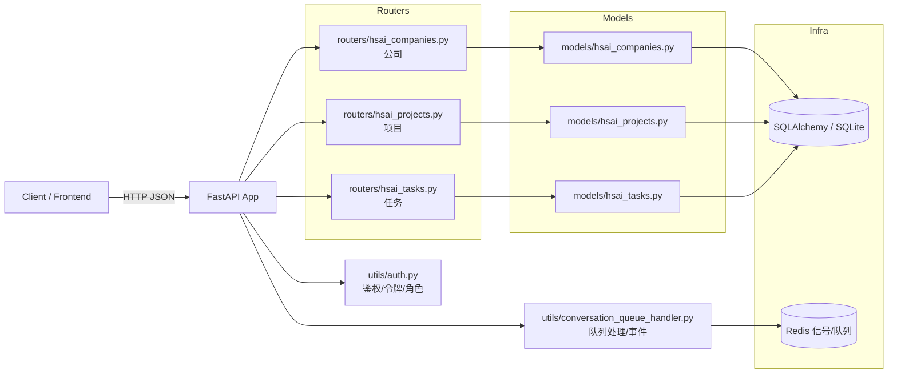
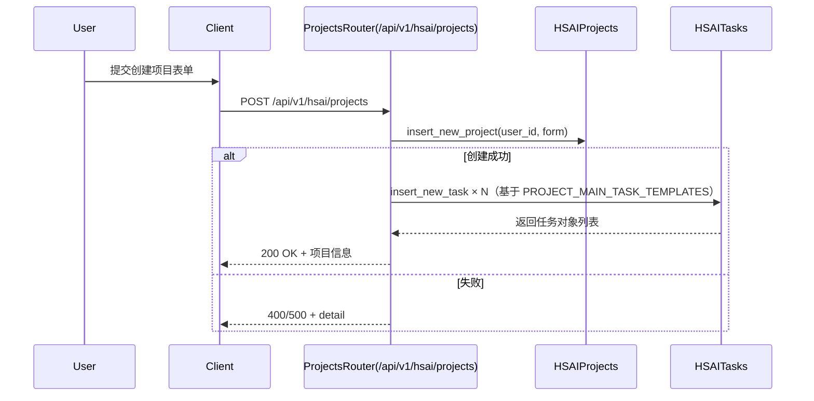
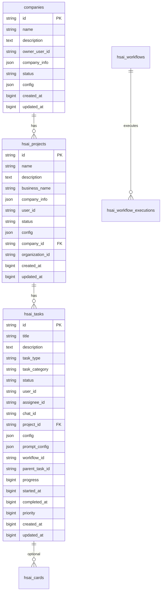

# HSAI 管理系统 · 项目知识库（PROJECTWIKI.md）
> 一等公民 · 与主干代码保持持续一致（UTF-8）

更新时间：2025-10-17（与 main 同步）

## 项目概述

HSAI 后台管理系统采用 FastAPI + Pydantic + SQLAlchemy 实现，统一以 `/api/v1` 为后端 API 前缀。业务核心域包括：公司（companies）、项目（hsai_projects）与任务（hsai_tasks）。所有接口默认要求鉴权（Bearer JWT 或 `sk-` 前缀 API Key，受端点白名单限制）。

## 架构设计

### 总览图


节点与代码路径映射（节选）：
- FastAPI 装载与路由挂载：`backend/open_webui/main.py:1224`
- 公司路由：`backend/open_webui/routers/hsai_companies.py:1`
- 项目路由：`backend/open_webui/routers/hsai_projects.py:1`
- 任务路由：`backend/open_webui/routers/hsai_tasks.py:1`
- 公司模型：`backend/open_webui/models/hsai_companies.py:1`
- 项目模型：`backend/open_webui/models/hsai_projects.py:1`
- 任务模型：`backend/open_webui/models/hsai_tasks.py:1`
- 鉴权与当前用户：`backend/open_webui/utils/auth.py:210`

### 关键流程（创建项目自动生成主线任务）


## 数据模型



来源：`backend/sql/init_scripts/2025-10-04_full_database_init.sql:606–652`, `685–704` 与对应 ORM 模型。

## 模块文档

### 公司（routers/hsai_companies.py）
- 职责：公司实体的增删改查与分页；按公司查询项目列表。
- 入口：`backend/open_webui/routers/hsai_companies.py:1`
- 关键类型：CompanyModel、CompanyForm、CompanyUpdateForm、CompanyResponse、PaginatedCompanyResponse。
- 外部依赖：鉴权 `get_verified_user`。

### 项目（routers/hsai_projects.py）
- 职责：项目增删改查与分页；创建项目后按模板自动创建主线任务。
- 入口：`backend/open_webui/routers/hsai_projects.py:1`
- 关键类型：HSAIProjectModel、HSAIProjectForm、HSAIProjectUpdateForm、HSAIProjectResponse、PaginatedHSAIProjectResponse。

### 任务（routers/hsai_tasks.py）
- 职责：任务增删改查、筛选分页、进度更新、指派、统计、按聊天获取卡片等。
- 入口：`backend/open_webui/routers/hsai_tasks.py:1`
- 关键枚举：
  - HSAITaskStatus：`pending|in_progress|completed|failed|cancelled`
  - HSAITaskType：`video_creation|content_analysis|material_processing|platform_publishing|workflow_execution`

## API 手册（HSAI 核心域）

统一前缀：`/api/v1`

### 公司 `/hsai/companies`
- GET `/` 获取公司列表（分页）
  - Query：`company_status?: string`, `ps?: int=20 [1..100]`, `pi?: int=1 (从1开始)`
  - Auth：`Authorization: Bearer <token>` 或 `Bearer sk-...`
  - Resp：`{ data: CompanyResponse[], pagination: { total, page, size, total_pages } }`
- POST `/` 创建公司
  - Body：CompanyForm `{ name: string, description?: string, company_info?: object, config?: object }`
  - Resp：CompanyResponse
- GET `/ {company_id}` 获取详情
- PUT `/ {company_id}` 更新
  - Body：CompanyUpdateForm（全部可选）
- DELETE `/ {company_id}` 删除（返回 `true|false`）
- GET `/ {company_id}/projects` 获取该公司项目（分页）
  - Query：`status?: string`, `ps?: int`, `pi?: int`
  - Resp：PaginatedHSAIProjectResponse

示例响应（分页）：
```json
{
  "data": [
    {"id":"...","name":"ACME","owner_user_id":"u1","status":"active","created_at":1690000000,"updated_at":1690000100}
  ],
  "pagination": {"total": 1, "page": 1, "size": 20, "total_pages": 1}
}
```

### 项目 `/hsai/projects`
- GET `/` 获取项目列表（分页）
  - Query：`status?: string`, `ps?: int=20`, `pi?: int=1`
- POST `/` 创建项目（自动创建主线任务）
  - Body：HSAIProjectForm `{ name: string, business_name: string, description?: string, company_info?: object, config?: object, organization_id?: string }`
- GET `/ {project_id}` 获取详情
- PUT `/ {project_id}` 更新（HSAIProjectUpdateForm）
- DELETE `/ {project_id}` 删除（bool）
- GET `/ {project_id}/tasks` 获取项目任务列表

### 任务 `/hsai/tasks`
- GET `/` 获取任务列表（分页/筛选）
  - Query：`status?: string`, `task_type?: string`, `assignee_id?: string`, `chat_id?: string`, `ps?: int=20`, `pi?: int=1`
- POST `/` 创建任务（可选绑定 chat 卡片）
  - Body：HSAITaskForm（见模型）
- GET `/ {task_id}` 获取详情
- PUT `/ {task_id}` 更新（HSAITaskUpdateForm）
- PUT `/ {task_id}/progress` 更新进度
  - Query：`progress: int (0..100)`
- POST `/ {task_id}/assign` 指派任务
  - Query：`assignee_id: string`
- GET `/statistics` 任务统计
  - Resp：`{ total_tasks, pending_tasks, in_progress_tasks, completed_tasks, failed_tasks, tasks_by_type, avg_completion_time? }`
- GET `/cards/chat/{chat_id}` 按会话获取卡片（分页）

错误与鉴权约定：
- 401 未认证 / 403 禁止：令牌无效或端点未获 API Key 许可
- 404 未找到：资源不存在或不属于当前用户
- 500 服务器内部错误：`detail` 使用统一错误消息（见 `open_webui/constants.py`）

分页约定：
- `ps` 为每页大小（1–100），`pi` 为页码（从 1 开始）；响应返回 `pagination.total/page/size/total_pages`。

## 依赖图谱（高层）

```mermaid
flowchart TB
  subgraph API(/api/v1)
    RC[hsai_companies]
    RP[hsai_projects]
    RT[hsai_tasks]
  end
  RC --> MC[Company ORM]
  RP --> MP[Project ORM]
  RT --> MT[Task/Card/Workflow ORM]
  MC --> DB[(DB)]
  MP --> DB
  MT --> DB
  API --> AUTH[Auth/JWT/APIKey]
```

## 设计决策 & 技术债务/缺陷复盘

- ADR-2025-10-17-003：WIKI 与代码对齐（从 Flask/Blueprint 文档迁移到 FastAPI/Router）
  - 背景：历史文档描述了 `/system/*` 路由与 Jinja 模板，但当前工程为 FastAPI REST API（`/api/v1`）。
  - 变更：重写架构/流程/数据模型与 API 手册，删除过时 Blueprint 叙述；补齐分页与鉴权约定。
  - 影响：前后端联调、测试与监控文档引用路径变更。
  - 验证：`backend/open_webui/main.py:1224–1288` 的 `include_router` 列表与本文端点一致；Mermaid 渲染通过。
  - 回滚：保留上版 WIKI 作为历史记录，可一键恢复。

- 文档单一事实源
  - 决策：以根目录 `PROJECTWIKI.md` 为唯一事实源；`docs/PROJECTWIKI.md` 改为占位与跳转说明。
  - 风险：双份维护导致漂移；措施：CI 校验重复文件禁止实质内容。

已知技术债务（待排期）
- 任务/卡片的通知机制目前以 HTTP 轮询为主；是否恢复 WebSocket 推送需结合前端能力评估。
- 统一错误码与错误枚举常量导出（当前多处为字符串常量）。

## 质量度量与 SLO（WIKI）
- Freshness：≤ 7 天；
- Traceability：≥ 95%（端点 ↔ 文件路径/行号双向映射可解析）；
- Completeness：公司/项目/任务 API 含签名/参数/响应/示例；
- Consistency：Mermaid 渲染无悬空节点/循环（已校验）。

## 维护建议
- 端点新增/修改时，同步更新“节点映射表”和 API 手册；
- 分页一律使用 `ps/pi`，避免多分页参数混用；
- 统一通过 `get_verified_user` 控制访问边界，避免路由层遗漏鉴权。

## 术语表与缩写
- JWT：JSON Web Token
- API Key：以 `sk-` 开头的访问密钥
- ps：page size；pi：page index（从 1 开始）
- ADR：Architecture Decision Record

## 变更日志（Keep a Changelog）

### [Unreleased]
- Changed：对齐为 FastAPI 架构与 `/api/v1` 端点；补齐 HSAI 核心域 API（ADR-2025-10-17-003）。
- Removed：过时的 Flask/Blueprint 与 `/system/*` 模板描述。

