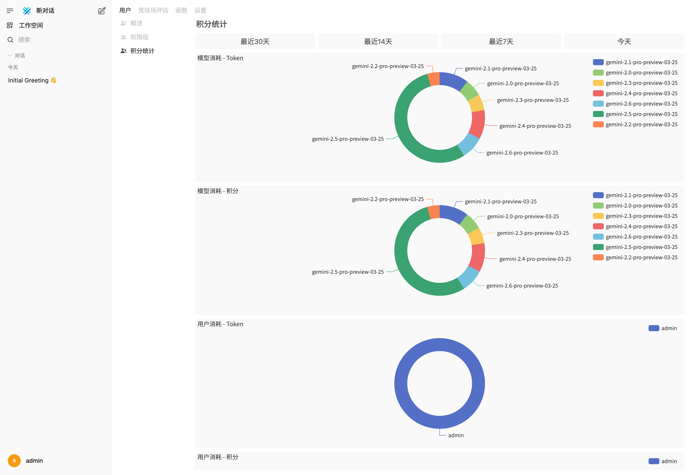
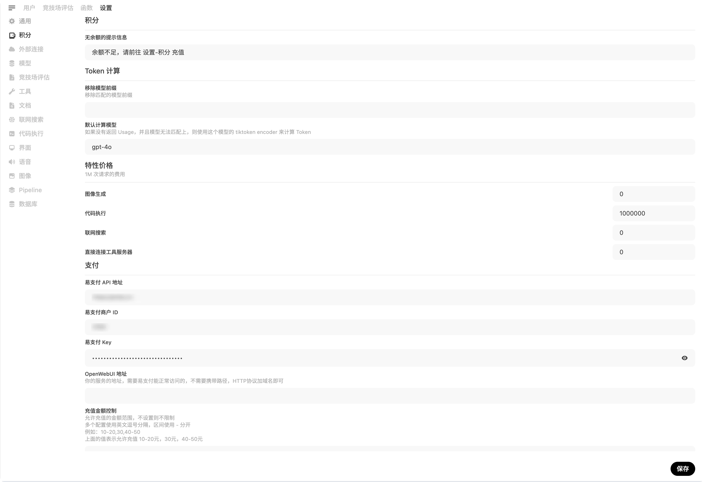
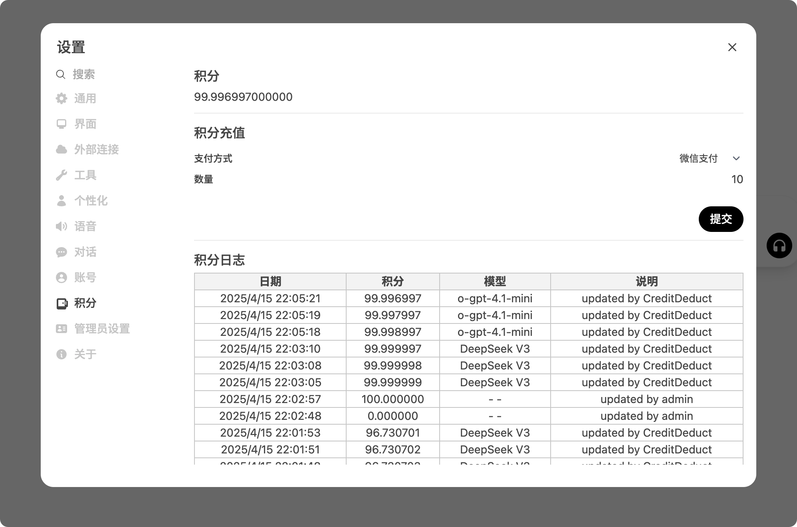
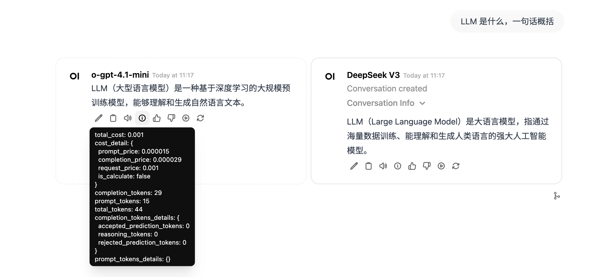
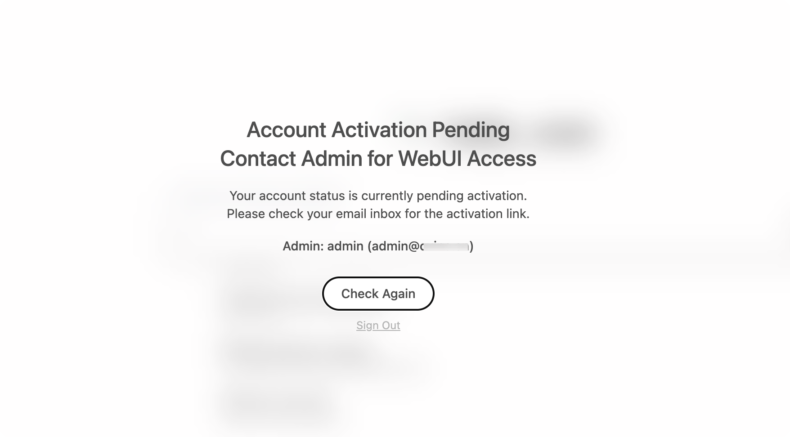
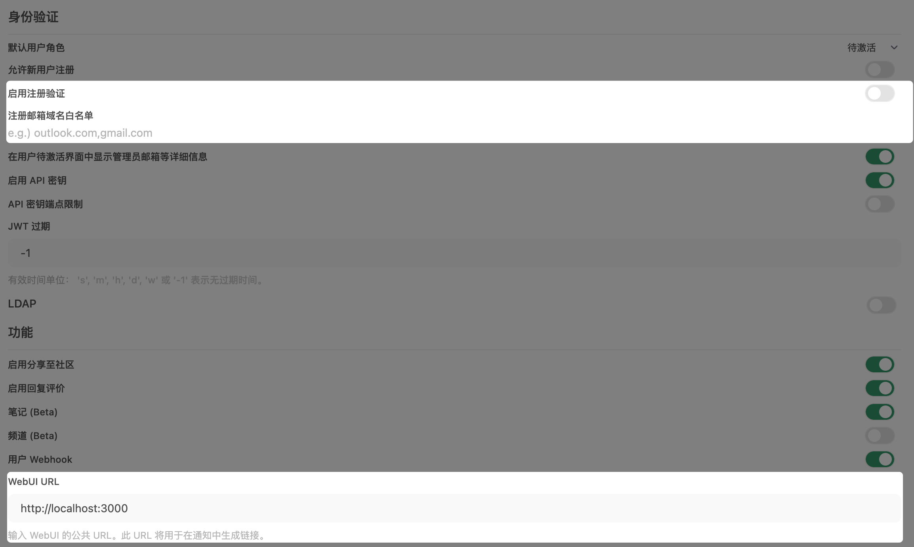

> 该项目是社区驱动的开源 AI 平台 [Open WebUI](https://github.com/open-webui/open-webui) 的定制分支。此版本与 Open WebUI 官方团队没有任何关联，亦非由其维护。

# Open WebUI 👋

官方文档: [Open WebUI Documentation](https://docs.openwebui.com/).  
官方更新日志: [CHANGELOG.md](./CHANGELOG.md)

## 虚拟环境配置

本项目使用 Python 3.11 虚拟环境进行依赖管理。虚拟环境位于项目根目录下的 `venv` 文件夹中。

### 创建虚拟环境

```bash
# 使用 Python 3.11 创建虚拟环境
python -m venv venv
```

### 激活虚拟环境

Windows:
```bash
# CMD
venv\Scripts\activate.bat

# PowerShell
venv\Scripts\Activate.ps1
```

### 安装依赖

```bash
# 升级 pip
python -m pip install --upgrade pip

# 安装项目依赖
cd backend
pip install -r requirements.txt
```

## 部署方式

部署后，不能直接回退到官方镜像；如需使用官方镜像，请参考此篇 [Wiki](https://github.com/U8F69/open-webui/wiki/%E9%87%8D%E6%96%B0%E4%BD%BF%E7%94%A8%E5%AE%98%E6%96%B9%E9%95%9C%E5%83%8F) 处理

部署二开版本只需要替换镜像和版本，其他的部署与官方版本没有差别，版本号请在 [Release](https://github.com/U8F69/open-webui/releases/latest) 中查看

```
ghcr.io/u8f69/open-webui:<版本号>
```

## 拓展特性

完整特性请看更新日志 [CHANGELOG_EXTRA.md](./CHANGELOG_EXTRA.md)

### 积分报表



### 全局积分设置



### 用户积分管理与充值



### 按照 Token 或请求次数计费，并在对话 Usage 中显示扣费详情



### 支持注册邮箱验证



## 文档说明

本项目包含以下重要文档，帮助开发者和用户更好地理解和使用系统：

### 爆款视频学习入库流程
- [爆款视频学习入库流程说明.md](./docs/爆款视频学习入库流程说明.md) - 详细描述了从n8n工作流抓取爆款视频到用户确认学习的完整流程，包含泳道图形式的流程图

### Redis队列处理
- [Agent2Redis消息体-技术文档-Michaell.md](./docs/Agent2Redis消息体-技术文档-Michaell.md) - 详细说明了Agent和n8n工作流如何通过Redis队列与后端通信的消息体结构

### 前端开发调试
- [前端调试用测试任务数据说明.md](./docs/前端调试用测试任务数据说明.md) - 为前端开发人员提供的测试任务数据说明，用于调试任务列表和任务详情功能

### 其他重要文档
- [Redis配置与切换指南.md](./docs/Redis配置与切换指南.md) - Redis配置切换的详细说明
- [WebSocket协议规范说明.md](./docs/WebSocket协议规范说明.md) - WebSocket通信协议规范

## 拓展配置

### HTTP Client Read Buffer Size

当有遇到 `Chunk too big` 报错时，可以适当调节这里的大小

```
# 默认是 64KB
AIOHTTP_CLIENT_READ_BUFFER_SIZE=65536
```

### 注册邮箱验证



请在管理端打开注册邮箱验证，配置 WebUI URL，同时配置如下环境变量

```
# 缓存
REDIS_URL=redis://192.168.20.31:6379/0
WEBSOCKET_REDIS_URL=redis://192.168.20.31:6379/0

# 邮件相关
SMTP_HOST=smtp.email.qq.com
SMTP_PORT=465
SMTP_USERNAME=example@qq.com
SMTP_PASSWORD=password
```

### Redis配置切换

项目支持内网和公网Redis配置的切换，可以通过修改`.env`文件中的`REDIS_MODE`变量来实现：

```
# 使用内网Redis (默认)
REDIS_MODE=internal

# 使用公网Redis
REDIS_MODE=external
```

详细配置说明请参考 [docs/Redis配置与切换指南.md](./docs/Redis配置与切换指南.md)

### 品牌/LOGO定制能力说明

本项目尊重并遵守 [Open WebUI License](https://docs.openwebui.com/license) 的品牌保护条款；我们鼓励社区用户尽量保留原有 Open WebUI 品牌，支持开源生态！

如需自定义品牌标识（如 LOGO、名称等）：

- 请务必确保您的实际部署满足 License 所要求的用户规模、授权条件等（详见 [官方说明#9](https://docs.openwebui.com/license#9-what-about-forks-can-i-start-one-and-remove-all-open-webui-mentions)）。
- 未经授权的商用或大规模去除品牌属于违规，由使用者自行承担法律风险。
- 具体自定义方法见 [docs/BRANDING.md](./docs/BRANDING.md)。