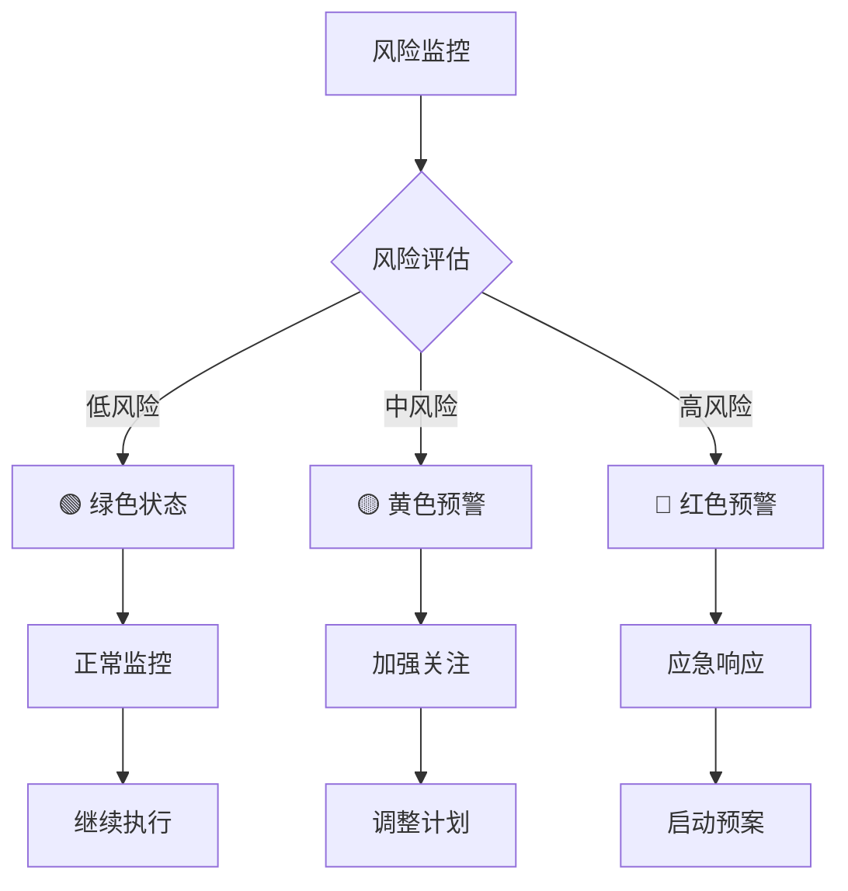
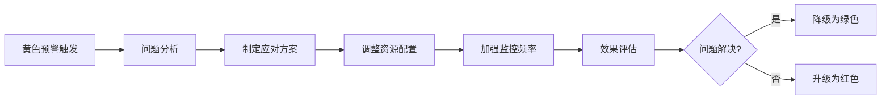
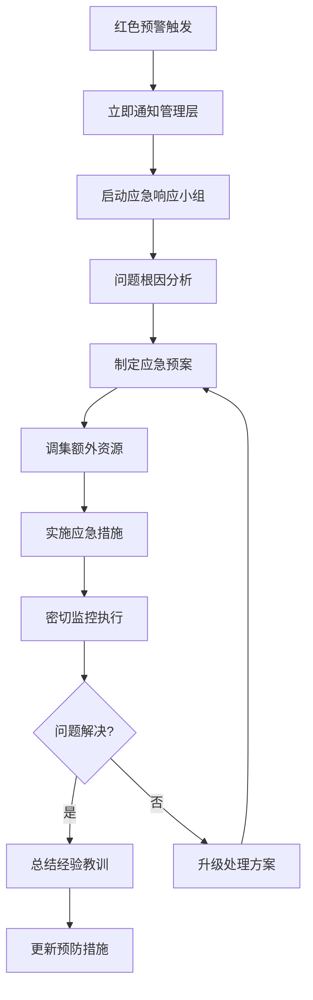
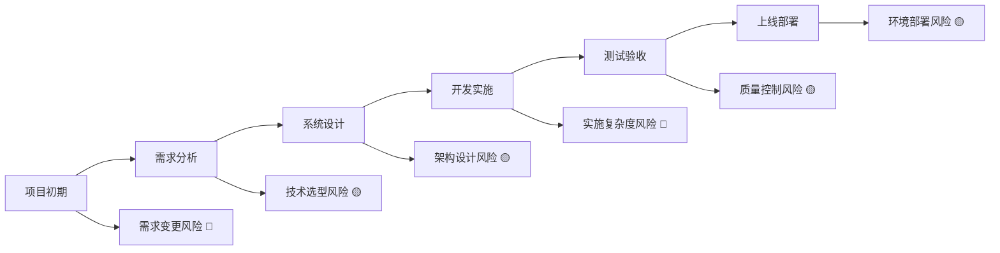
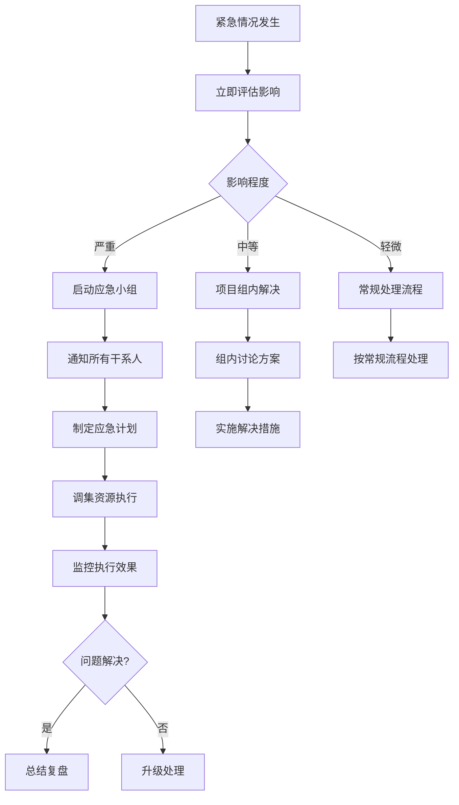

# 项目风险管理与预警

**版本**: v1.0.0  
**创建日期**: 2025-08-26  
**最后更新**: 2025-08-26  
**审核状态**: 待审核  
**适用项目**: HSAI外贸爆款短视频运营总管  

## 版本修订记录

| 版本 | 日期 | 修订内容 | 修订人 |
|------|------|----------|--------|
| v1.0.0 | 2025-08-26 | 初始版本，建立完整的项目风险管理与三级预警体系 | 项目管理办公室 |

---

## 🚨 三级风险预警体系

### 📊 预警等级定义



### 🟢 绿色状态 (正常运行)

#### 触发条件
- 项目进度按计划执行，偏差≤5%
- 质量指标正常，无严重缺陷
- 团队状态良好，资源充足
- 技术方案稳定，依赖服务正常

#### 监控指标
| 维度 | 指标 | 绿色标准 | 监控频率 |
|------|------|----------|----------|
| **进度** | Sprint完成率 | ≥95% | 每日 |
| **质量** | 缺陷密度 | <1个/KLOC | 每日 |
| **资源** | 团队可用性 | >90% | 每日 |
| **技术** | 系统可用性 | >99% | 实时 |

#### 响应措施
- 继续按计划执行
- 维持现有资源配置
- 定期进度汇报
- 经验总结和分享

### 🟡 黄色预警 (注意关注)

#### 触发条件
- 项目进度偏差5-15%
- 出现一般性质量问题
- 资源使用率过高(>85%)
- 技术方案存在潜在问题

#### 具体指标
| 风险类型 | 黄色预警阈值 | 检测方法 | 响应时间 |
|----------|--------------|----------|----------|
| **进度风险** | 里程碑延期1-3天 | 进度跟踪系统 | 2小时内 |
| **质量风险** | 缺陷密度1-3个/KLOC | 缺陷跟踪工具 | 4小时内 |
| **资源风险** | 关键人员请假 | 人员状态监控 | 1小时内 |
| **技术风险** | API响应时间>3秒 | 性能监控工具 | 实时 |

#### 响应措施


### 🔴 红色预警 (紧急响应)

#### 触发条件
- 项目进度严重偏差>15%
- 出现严重质量问题
- 关键资源不可用
- 技术方案重大缺陷

#### 紧急指标
| 紧急情况 | 触发阈值 | 影响范围 | 响应等级 |
|----------|----------|----------|----------|
| **里程碑风险** | 延期>3天 | 项目整体 | 最高优先级 |
| **严重缺陷** | P0级别bug | 核心功能 | 立即处理 |
| **人员风险** | 关键人员离职 | 技能断层 | 紧急备案 |
| **技术风险** | 架构方案失败 | 系统架构 | 重新设计 |

#### 应急响应流程


---

## 🔍 风险识别矩阵

### 📋 全面风险清单

| 风险ID | 风险类别 | 风险描述 | 影响程度 | 发生概率 | 风险等级 | 负责人 |
|--------|----------|----------|----------|----------|----------|--------|
| **R001** | 技术风险 | AI接口服务不稳定 | 高 | 中 | 🔴 高 | 后端开发 |
| **R002** | 技术风险 | 视频合成性能问题 | 高 | 中 | 🔴 高 | n8n开发 |
| **R003** | 资源风险 | 后端开发人员过载 | 中 | 高 | 🟡 中 | 项目经理 |
| **R004** | 技术风险 | n8n工作流复杂度过高 | 中 | 中 | 🟡 中 | n8n开发 |
| **R005** | 外部风险 | 第三方平台API限制 | 中 | 低 | 🟢 低 | 后端开发 |
| **R006** | 进度风险 | 前端功能开发延期 | 中 | 低 | 🟢 低 | 前端开发 |
| **R007** | 质量风险 | 测试覆盖不足 | 中 | 中 | 🟡 中 | 测试负责人 |
| **R008** | 资源风险 | 关键人员请假/离职 | 高 | 低 | 🟡 中 | 项目经理 |

### 🎯 风险影响评估

#### 影响程度定义
- **高**: 严重影响项目目标，可能导致项目失败
- **中**: 影响项目进度或质量，可通过调整解决
- **低**: 轻微影响，不影响主要目标

#### 发生概率定义
- **高**: 发生概率>60%，需要重点关注
- **中**: 发生概率30-60%，需要准备应对措施
- **低**: 发生概率<30%，保持关注即可

### 📈 风险趋势分析



---

## 🛠️ 风险应对策略

### 🔧 应对策略类型

#### 1. 风险规避 (Avoid)
- **策略**: 改变项目计划以完全消除风险
- **适用**: 高影响、高概率的风险
- **示例**: 使用成熟技术栈代替新技术

#### 2. 风险缓解 (Mitigate)
- **策略**: 降低风险发生概率或影响程度
- **适用**: 中高影响的风险
- **示例**: 增加技能培训、备份方案

#### 3. 风险转移 (Transfer)
- **策略**: 将风险责任转移给第三方
- **适用**: 外部依赖风险
- **示例**: 采购保险、外包服务

#### 4. 风险接受 (Accept)
- **策略**: 承认风险存在但不采取行动
- **适用**: 低影响、低概率的风险
- **示例**: 建立应急基金

### 📋 具体应对措施

#### R001: AI接口服务不稳定
**应对策略**: 缓解 + 转移
- **主要措施**: 
  - 集成多个AI服务提供商
  - 建立服务降级机制
  - 实现智能负载均衡
- **备选方案**: 
  - 本地AI模型部署
  - 人工客服介入机制
- **监控措施**: 
  - 实时响应时间监控
  - 错误率统计分析
  - 服务可用性监控

#### R002: 视频合成性能问题
**应对策略**: 缓解 + 规避
- **主要措施**:
  - 分布式视频处理
  - 预先模板渲染
  - 缓存机制优化
- **备选方案**:
  - 云端视频处理服务
  - 简化视频效果
- **监控措施**:
  - 处理时间统计
  - 资源使用监控
  - 用户体验跟踪

#### R003: 后端开发人员过载
**应对策略**: 缓解 + 转移
- **主要措施**:
  - 任务重新分配
  - Mock数据支持前端
  - 技能交叉培训
- **备选方案**:
  - 外部技术支持
  - 延长项目周期
- **监控措施**:
  - 工作量统计
  - 工作质量评估
  - 团队状态调研

### ⚡ 应急响应预案

#### 紧急情况处理流程



#### 应急资源清单

| 资源类型 | 资源描述 | 获取方式 | 响应时间 |
|----------|----------|----------|----------|
| **人力资源** | 高级开发工程师 | 外部技术顾问 | 24小时 |
| **技术资源** | 备选AI服务 | 云服务提供商 | 2小时 |
| **设备资源** | 高性能服务器 | 云计算资源 | 1小时 |
| **网络资源** | 备选网络线路 | 多ISP接入 | 30分钟 |

---

## 📊 风险监控与报告

### 📈 监控指标体系

#### 实时监控指标
| 指标类型 | 具体指标 | 监控工具 | 阈值设置 | 报警方式 |
|----------|----------|----------|----------|----------|
| **技术指标** | API响应时间 | APM监控 | >3秒黄色,>5秒红色 | 短信+邮件 |
| **技术指标** | 系统错误率 | 日志监控 | >5%黄色,>10%红色 | 实时推送 |
| **进度指标** | 任务完成率 | 项目管理工具 | <80%黄色,<60%红色 | 每日报告 |
| **质量指标** | 代码覆盖率 | CI/CD平台 | <70%黄色,<50%红色 | 构建失败 |

#### 定期评估指标
| 评估周期 | 评估内容 | 评估方法 | 负责人 | 报告对象 |
|----------|----------|----------|--------|----------|
| **每日** | 当日风险状态 | 指标检查 | 项目经理 | 项目组 |
| **每周** | 风险趋势分析 | 数据分析 | 风险管理员 | 管理层 |
| **每月** | 风险管理效果 | 综合评估 | 项目经理 | 高层管理 |

### 📋 风险报告模板

#### 每日风险状态报告
```markdown
# 风险状态日报 - YYYY-MM-DD

## 🚦 总体风险状态: [🟢绿色/🟡黄色/🔴红色]

### 新增风险
- [风险ID] [风险描述] - 等级: [🟢/🟡/🔴] - 负责人: [姓名]

### 风险状态变化
- [风险ID] [变化描述] - 从[原等级]变为[新等级] - 原因: [变化原因]

### 已解决风险
- [风险ID] [风险描述] - 解决方案: [具体措施] - 解决人: [姓名]

### 需要关注的风险
- [风险ID] [风险描述] - 当前状态: [具体情况] - 下步计划: [应对措施]

### 关键指标
| 指标 | 当前值 | 目标值 | 状态 |
|------|--------|--------|------|
| 项目进度 | XX% | XX% | 🟢 |
| 质量指标 | XX | XX | 🟡 |
| 团队状态 | 良好 | 良好 | 🟢 |
```

#### 周度风险分析报告
```markdown
# 风险管理周报 - YYYY年第XX周

## 📊 风险统计
- 总风险数量: XX个
- 高风险: XX个 (🔴)
- 中风险: XX个 (🟡)
- 低风险: XX个 (🟢)

## 📈 风险趋势
[风险数量变化图表]

## 🎯 重点关注
1. [高优先级风险1]
2. [高优先级风险2]
3. [高优先级风险3]

## 💡 改进建议
1. [改进建议1]
2. [改进建议2]
3. [改进建议3]

## 📅 下周重点
- [下周关注重点1]
- [下周关注重点2]
- [下周关注重点3]
```

---

## 🎓 风险管理最佳实践

### ✅ 风险管理原则

1. **主动识别**: 不等问题发生才应对
2. **系统管理**: 建立完整的管理体系
3. **持续监控**: 实时跟踪风险变化
4. **快速响应**: 及时采取应对措施
5. **经验积累**: 总结教训持续改进

### 🔧 实施建议

#### 风险文化建设
- 鼓励团队主动报告风险
- 建立无责任报告机制
- 定期进行风险意识培训
- 分享风险管理成功案例

#### 工具与技术
- 使用专业的风险管理工具
- 建立自动化监控系统
- 利用数据分析识别风险
- 集成项目管理系统

#### 持续改进
- 定期评估风险管理效果
- 更新风险识别清单
- 优化应对措施和流程
- 建立风险知识库

---

## 📚 附录

### 📖 风险管理术语表

| 术语 | 定义 |
|------|------|
| **风险** | 可能影响项目目标实现的不确定性事件 |
| **风险识别** | 确定可能影响项目的风险并记录其特征 |
| **风险分析** | 评估风险的影响程度和发生概率 |
| **风险应对** | 制定措施来增强机会和减少威胁 |
| **风险监控** | 跟踪已识别风险并识别新风险 |

### 🔗 相关文档链接

- [HSAI项目总体计划](./HSAI项目总体计划.md)
- [团队资源分析与协调](../07_项目管理/团队资源分析与协调.md)
- [项目进度跟踪与报告](../07_项目管理/项目进度跟踪与报告.md)
- [敏捷开发实践指南](../07_项目管理/敏捷开发实践指南.md)

---

**审核状态**: 待审核  
**下次更新**: 2025年9月2日 (根据项目进展更新风险状态)