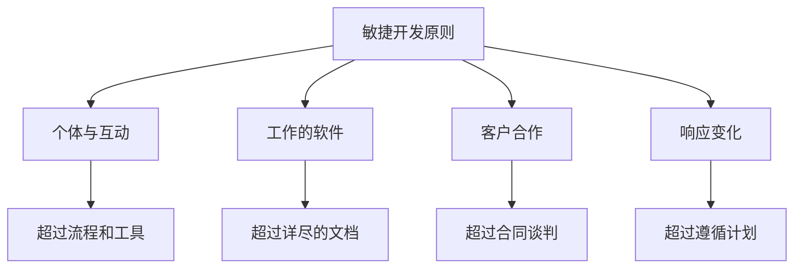
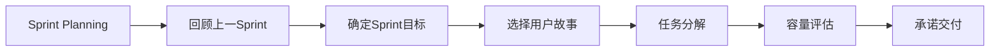
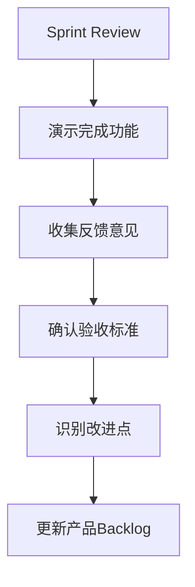
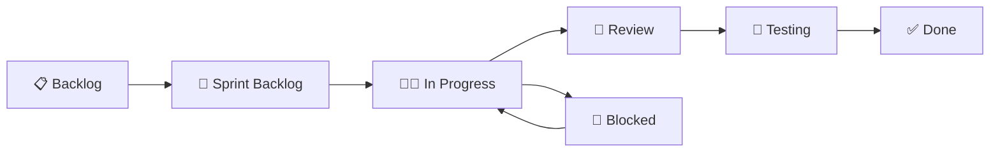
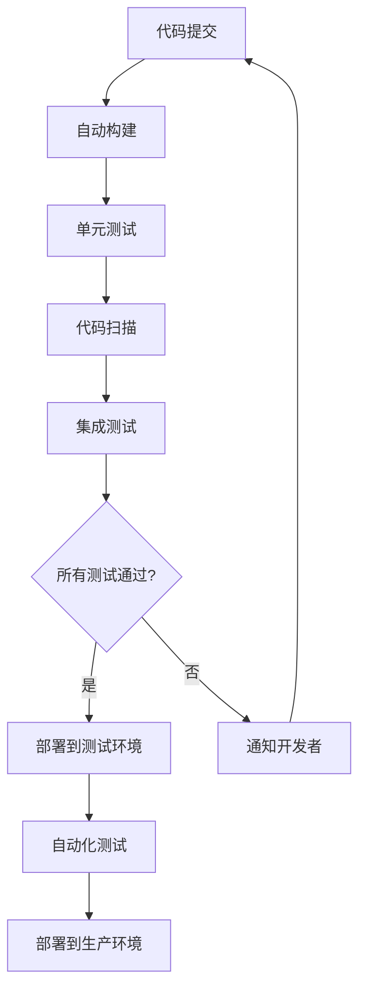
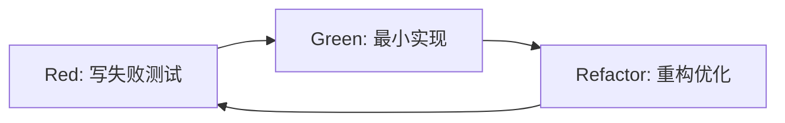
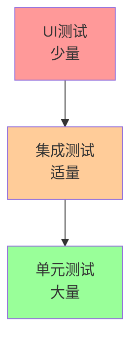
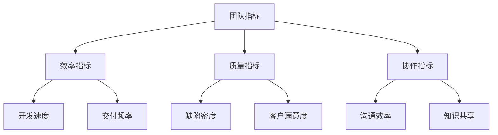
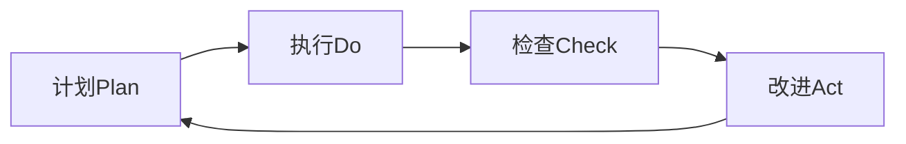
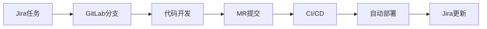

# 敏捷开发实践指南

**版本**: v1.0.0  
**创建日期**: 2025-08-26  
**最后更新**: 2025-08-26  
**审核状态**: 待审核  
**适用团队**: HSAI项目核心开发团队  

## 版本修订记录

| 版本 | 日期 | 修订内容 | 修订人 |
|------|------|----------|--------|
| v1.0.0 | 2025-08-26 | 初始版本，建立敏捷开发实践规范和流程 | 项目管理办公室 |

---

## 🚀 敏捷开发框架

### 📋 核心原则



### 🎯 HSAI项目敏捷实践

#### Sprint设计
- **Sprint周期**: 6天 (适合快速迭代和风险控制)
- **Sprint目标**: 基于里程碑的具体可交付功能
- **Sprint容量**: 基于团队历史速度和当前负载

#### 角色定义
| 角色 | 负责人 | 主要职责 | 权限范围 |
|------|--------|----------|----------|
| **Product Owner** | 产品经理 | 需求优先级、验收标准 | 需求变更决策 |
| **Scrum Master** | 项目经理 | 流程把控、阻塞移除 | 流程优化权 |
| **Dev Team** | 开发团队 | 功能实现、技术决策 | 实现方案权 |

---

## 🗓️ Sprint规划与执行

### 📅 Sprint Planning (第1天上午)

#### 会议流程


#### 规划模板
```markdown
# Sprint X 规划 (YYYY-MM-DD 至 YYYY-MM-DD)

## Sprint目标
[简洁描述本Sprint要实现的核心价值]

## 选定的用户故事
| 故事ID | 故事标题 | 优先级 | 故事点数 | 负责人 |
|--------|----------|--------|----------|--------|
| US001 | 用户登录功能 | P0 | 5 | 雨晨 |
| US002 | 工作台界面 | P0 | 8 | 谢颖敏 |

## 任务分解
### US001: 用户登录功能
- [ ] 设计登录API (2h) - 雨晨
- [ ] 实现认证逻辑 (4h) - 雨晨
- [ ] 前端登录页面 (6h) - 谢颖敏
- [ ] 集成测试 (2h) - 全员

## 团队容量
- 总可用时间: 160小时 (4人 × 40小时)
- 计划投入: 150小时
- 缓冲时间: 10小时 (6.25%)

## 风险识别
- [风险1]: 第三方API不稳定 - 准备Mock数据
- [风险2]: 界面设计变更 - 与设计师提前确认
```

### 📊 Daily Scrum (每日9:30)

#### 站会结构 (15分钟)
1. **昨日完成** (每人2分钟)
2. **今日计划** (每人2分钟)
3. **遇到阻塞** (每人1分钟)
4. **团队讨论** (5分钟)

#### 站会模板
```markdown
# Daily Scrum - YYYY-MM-DD

## 团队状态
- Sprint进度: XX% (燃尽图)
- 剩余工作: XX小时
- 阻塞问题: X个

## 个人汇报
### 雨晨 (后端开发)
- 昨日完成: [具体任务]
- 今日计划: [具体计划]
- 遇到阻塞: [具体问题]
- 需要帮助: [支持需求]

[其他成员类似...]

## 阻塞问题处理
1. **问题**: API限流问题
   - **负责人**: 雨晨
   - **预计解决**: 今日下午
   - **影响**: 前端测试延迟

## 决策事项
- [决策1]: 使用JWT认证方案
- [决策2]: 延期非核心功能开发
```

### 🔄 Sprint Review (第6天下午)

#### 评审流程


#### 评审标准
| 评审维度 | 标准 | 评估方法 | 通过条件 |
|----------|------|----------|----------|
| **功能完整性** | 100%实现计划功能 | 功能演示 | 所有功能可用 |
| **质量标准** | 无P0缺陷 | 测试报告 | 测试通过率≥95% |
| **用户体验** | 符合设计规范 | 界面检查 | 设计师确认 |
| **性能指标** | 响应时间达标 | 性能测试 | <2秒响应时间 |

### 🎯 Sprint Retrospective (第6天下午)

#### 回顾模板
```markdown
# Sprint X 回顾

## 数据总结
- 计划故事点: XX
- 完成故事点: XX
- 完成率: XX%
- 主要成就: [关键成果]

## 做得好的地方 👍
1. [团队协作优秀的地方]
2. [技术实现的亮点]
3. [流程改进的成果]

## 需要改进的地方 🔧
1. [发现的问题]
2. [可以优化的流程]
3. [技术债务]

## 改进行动 🎯
| 改进项 | 负责人 | 截止时间 | 成功标准 |
|--------|--------|----------|----------|
| 改进代码评审流程 | 技术负责人 | 下一Sprint | 评审时间减少50% |
| 优化构建脚本 | 清泉 | 3天内 | 构建时间<5分钟 |

## 下一Sprint重点
- [重点关注1]
- [重点关注2]
- [重点关注3]
```

---

## 📏 用户故事与任务管理

### 📝 用户故事规范

#### INVEST原则
- **Independent**: 独立的，不依赖其他故事
- **Negotiable**: 可协商的，细节可以讨论
- **Valuable**: 有价值的，对用户有意义
- **Estimable**: 可估算的，能够评估工作量
- **Small**: 小的，一个Sprint内可完成
- **Testable**: 可测试的，有明确验收标准

#### 故事模板
```markdown
# 用户故事: [简洁标题]

## 故事描述
作为 [用户角色]
我想要 [功能描述]
以便于 [价值说明]

## 验收标准
- [ ] 标准1: [具体的可验证条件]
- [ ] 标准2: [具体的可验证条件]
- [ ] 标准3: [具体的可验证条件]

## 技术任务
1. [技术任务1] - 预估: Xh
2. [技术任务2] - 预估: Xh

## 完成定义 (DoD)
- [ ] 代码实现完成
- [ ] 单元测试通过
- [ ] 代码评审通过
- [ ] 集成测试通过
- [ ] 产品经理验收通过
```

### 🎯 任务状态管理

#### 看板设计


#### 状态定义
| 状态 | 含义 | 进入条件 | 退出条件 |
|------|------|----------|----------|
| **Backlog** | 待办事项 | 用户故事创建 | 被拉入Sprint |
| **Sprint Backlog** | Sprint计划 | Sprint规划确定 | 开发开始 |
| **In Progress** | 开发中 | 开发者认领 | 开发完成 |
| **Review** | 代码评审 | 代码提交 | 评审通过 |
| **Testing** | 测试验证 | 评审通过 | 测试通过 |
| **Done** | 完成 | 测试通过 | - |
| **Blocked** | 阻塞 | 遇到阻塞 | 阻塞解除 |

---

## 🔧 敏捷工程实践

### 💻 持续集成/持续部署

#### CI/CD流程


#### 质量门禁
| 检查项 | 标准 | 工具 | 失败处理 |
|--------|------|------|----------|
| 代码覆盖率 | ≥80% | Jest/pytest | 阻止合并 |
| 代码重复率 | ≤5% | SonarQube | 警告提示 |
| 安全扫描 | 无高危漏洞 | Security Scanner | 阻止部署 |
| 性能测试 | 响应时间<2s | JMeter | 降级处理 |

### 🧪 测试驱动开发

#### TDD循环


#### 测试金字塔


### 👥 代码评审实践

#### 评审清单
- [ ] **功能性**: 代码实现了需求功能
- [ ] **可读性**: 代码清晰易懂，命名规范
- [ ] **性能**: 没有明显的性能问题
- [ ] **安全性**: 没有安全漏洞
- [ ] **测试**: 包含适当的测试用例
- [ ] **文档**: 复杂逻辑有注释说明

#### 评审流程
1. **提交PR**: 包含功能描述和测试说明
2. **自动检查**: CI/CD流程自动验证
3. **人工评审**: 至少1人评审，复杂功能2人
4. **修改完善**: 根据反馈修改代码
5. **批准合并**: 评审通过后合并到主分支

---

## 📊 度量与改进

### 📈 关键敏捷指标

#### Sprint层面指标
| 指标 | 计算方式 | 目标值 | 当前值 | 趋势 |
|------|----------|--------|--------|------|
| **速度** | 完成故事点/Sprint | 稳定增长 | [待更新] | - |
| **燃尽率** | 剩余工作/时间 | 线性下降 | [待更新] | - |
| **完成率** | 完成故事/计划故事 | ≥90% | [待更新] | - |
| **缺陷率** | 发现缺陷/交付功能 | <5% | [待更新] | - |

#### 团队层面指标


### 🎯 持续改进机制

#### 改进循环


#### 改进来源
1. **Sprint回顾**: 团队内部反思
2. **用户反馈**: 产品使用体验
3. **度量数据**: 客观数据分析
4. **行业最佳实践**: 外部经验学习

#### 改进跟踪
```markdown
# 改进跟踪表

| 改进项 | 提出时间 | 负责人 | 预期效果 | 完成时间 | 实际效果 |
|--------|----------|--------|----------|----------|----------|
| 自动化部署 | 2025-08-26 | 清泉 | 部署时间减少80% | 2025-09-02 | [待评估] |
| 代码评审模板 | 2025-08-26 | 技术负责人 | 评审效率提升50% | 2025-08-30 | [待评估] |
```

---

## 🛠️ 敏捷工具配置

### 📊 项目管理工具

#### Jira配置
- **项目类型**: Scrum项目
- **工作流**: 简化的敏捷工作流
- **字段配置**: 故事点、优先级、Sprint
- **报告**: 燃尽图、速度图、累积流图

#### GitLab集成
- **分支策略**: GitFlow简化版
- **合并请求**: 必须代码评审
- **CI/CD**: 自动化构建和部署
- **里程碑**: 与Sprint对应

### 🔗 工具集成链路



---

## 📚 敏捷实践检查清单

### ✅ Sprint启动检查
- [ ] Sprint目标明确
- [ ] 用户故事准备就绪
- [ ] 任务分解完成
- [ ] 团队容量评估
- [ ] 风险识别和应对
- [ ] 环境和工具准备

### ✅ Sprint执行检查
- [ ] 每日站会按时进行
- [ ] 任务状态及时更新
- [ ] 阻塞问题快速解决
- [ ] 代码评审及时完成
- [ ] 测试用例及时执行
- [ ] 持续集成正常运行

### ✅ Sprint结束检查
- [ ] 功能演示准备充分
- [ ] 验收标准全部满足
- [ ] 技术债务记录清楚
- [ ] 团队回顾及时进行
- [ ] 改进行动明确具体
- [ ] 下Sprint规划准备

---

## 🎓 敏捷最佳实践

### 💡 成功要素
1. **团队自组织**: 给团队足够的自主权
2. **快速反馈**: 尽早发现问题，快速调整
3. **持续改进**: 定期反思，不断优化
4. **客户协作**: 与产品经理密切合作
5. **拥抱变化**: 灵活应对需求变更

### ⚠️ 常见陷阱
1. **瀑布式伪装**: 形式上敏捷，实质上瀑布
2. **过度规划**: 计划过于详细，失去灵活性
3. **忽视技术债**: 只关注功能，忽视代码质量
4. **缺乏度量**: 没有数据支撑的改进
5. **工具导向**: 过分依赖工具，忽视人的因素

### 🏆 文化建设
- **透明化**: 信息公开，状态可见
- **信任**: 相信团队能力，给予自主权
- **学习**: 鼓励试错，从失败中学习
- **协作**: 团队优于个人，整体优于局部
- **持续改进**: 永远追求更好的方式

---

**审核状态**: 待审核  
**下次更新**: 2025年9月2日 (首个Sprint完成后更新实践经验)