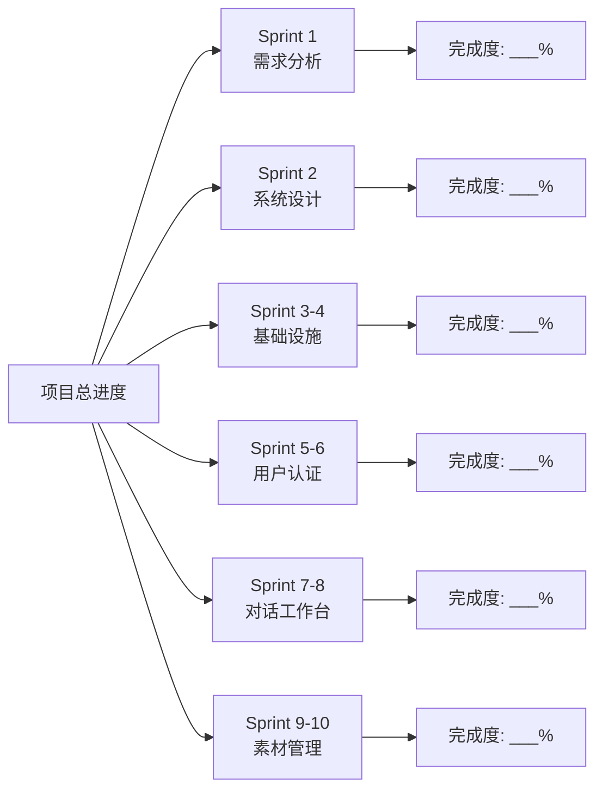
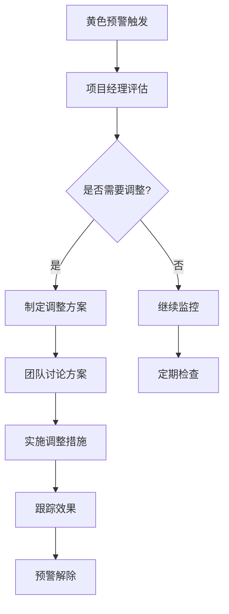
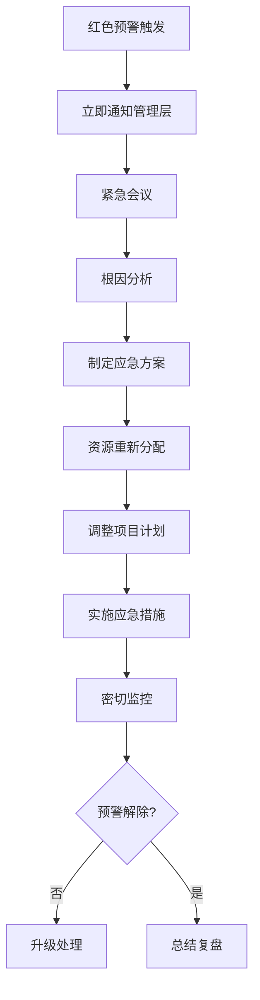

# 敏捷开发跟踪机制与风险预警

**版本**: v1.0.0  
**创建日期**: 2025-08-23  
**更新日期**: 2025-08-24  
**适用项目**: HSAI外贸爆款短视频运营总管  

## 版本修订记录

| 版本 | 日期 | 修改内容 | 修改人 |
|------|------|----------|--------|
| v1.0.0 | 2025-08-24 | 统一版本号格式为三段版本号，添加版本修订记录 | 系统整理 |
| v1.0 | 2025-08-23 | 初始版本，建立敏捷跟踪机制与风险预警体系 | 项目经理 |  

## 1. 项目跟踪仪表板

### 1.1 总体进度看板



### 1.2 实时监控指标

| 监控项 | 当前值 | 目标值 | 状态 | 更新时间 |
|--------|--------|--------|------|----------|
| 整体进度 | __%  | 按计划 | 🟢 | 实时更新 |
| 当前Sprint进度 | __%  | 90% | 🟡 | 每日更新 |
| 代码提交频率 | __次/天 | 8次/天 | 🟢 | 每日统计 |
| 缺陷数量 | __个 | <5个 | 🔴 | 实时更新 |
| 测试覆盖率 | __%  | >80% | 🟡 | 每次构建 |
| API响应时间 | __ms | <2000ms | 🟢 | 实时监控 |

## 2. 风险预警系统

### 2.1 三级预警机制

#### 🟢 绿色预警 (正常)
- **触发条件**: 所有指标在正常范围内
- **响应措施**: 继续按计划执行
- **通知范围**: 项目组内部

#### 🟡 黄色预警 (注意)
- **触发条件**: 
  - Sprint进度落后10-20%
  - 代码质量指标下降
  - 资源使用率超过70%
- **响应措施**: 
  - 增加资源投入
  - 调整任务优先级
  - 加强质量检查
- **通知范围**: 项目经理 + 技术负责人

#### 🔴 红色预警 (紧急)
- **触发条件**:
  - Sprint进度落后>20%
  - 出现P0级别缺陷
  - 关键依赖服务不可用
  - 团队成员请假>2人
- **响应措施**:
  - 启动应急响应
  - 重新评估计划
  - 寻求额外支援
- **通知范围**: 全体项目组 + 管理层

### 2.2 具体预警指标

#### 进度风险预警

| 指标 | 绿色 | 黄色 | 红色 | 监控频率 |
|------|------|------|------|----------|
| Sprint燃尽速度 | 按计划±5% | 偏离5-15% | 偏离>15% | 每日 |
| 任务完成率 | >90% | 80-90% | <80% | 每日 |
| 里程碑达成率 | 100% | 80-99% | <80% | 每周 |
| 团队可用性 | >90% | 75-90% | <75% | 每日 |

#### 质量风险预警

| 指标 | 绿色 | 黄色 | 红色 | 监控频率 |
|------|------|------|------|----------|
| 代码覆盖率 | >80% | 70-80% | <70% | 每次构建 |
| 缺陷密度 | <1个/KLOC | 1-3个/KLOC | >3个/KLOC | 每日 |
| 代码评审通过率 | >95% | 90-95% | <90% | 每次提交 |
| 性能测试通过率 | 100% | 90-99% | <90% | 每次发布 |

#### 技术风险预警

| 指标 | 绿色 | 黄色 | 红色 | 监控频率 |
|------|------|------|------|----------|
| 第三方API可用性 | >99% | 95-99% | <95% | 每小时 |
| 系统响应时间 | <1s | 1-2s | >2s | 实时 |
| 内存使用率 | <70% | 70-85% | >85% | 实时 |
| 磁盘使用率 | <80% | 80-90% | >90% | 每小时 |

## 3. 敏捷跟踪工具

### 3.1 Sprint跟踪表模板

```markdown
# Sprint X 跟踪表

**Sprint周期**: 2025-XX-XX 至 2025-XX-XX  
**Sprint目标**: [具体目标描述]  
**参与人员**: [团队成员列表]  

## 任务进度

| 任务ID | 任务名称 | 负责人 | 状态 | 计划工期 | 实际耗时 | 完成度 | 备注 |
|--------|----------|--------|------|----------|----------|--------|------|
| S1.T001 | 示例任务 | 张三 | 进行中 | 2天 | 1.5天 | 75% | 无阻塞 |

## 燃尽图数据

| 日期 | 剩余任务点 | 理想剩余 | 实际剩余 | 偏差 |
|------|------------|----------|----------|------|
| Day 1 | 50 | 45 | 48 | +3 |
| Day 2 | 45 | 40 | 42 | +2 |

## 阻塞问题

| 问题ID | 问题描述 | 负责人 | 优先级 | 状态 | 解决方案 |
|--------|----------|--------|--------|------|----------|
| B001 | API限流问题 | 李四 | P0 | 处理中 | 申请提升限额 |

## 风险识别

| 风险ID | 风险描述 | 影响程度 | 发生概率 | 应对措施 |
|--------|----------|----------|----------|----------|
| R001 | 第三方服务不稳定 | 高 | 中 | 准备备选方案 |
```

### 3.2 每日站会记录模板

```markdown
# 每日站会 - 2025-XX-XX

**参会人员**: [人员列表]  
**会议时长**: 15分钟  

## 团队成员汇报

### 张三 (前端开发)
- **昨日完成**: 登录页面开发
- **今日计划**: 注册页面开发  
- **遇到阻塞**: 无
- **需要帮助**: 无

### 李四 (后端开发)
- **昨日完成**: 用户认证API
- **今日计划**: 权限控制开发
- **遇到阻塞**: JWT库版本冲突
- **需要帮助**: 技术支持

## 阻塞问题处理
1. **JWT库版本冲突** - 负责人: 架构师, 预计解决时间: 今日下午

## 风险提醒
- 注意代码覆盖率下降趋势
- 关注API响应时间监控

## 决策事项
- 确定使用JWT 8.5.1版本
- 下午进行代码评审
```

### 3.3 缺陷跟踪模板

```markdown
# 缺陷跟踪表

| 缺陷ID | 标题 | 严重程度 | 发现人 | 负责人 | 状态 | 发现时间 | 解决时间 |
|--------|------|----------|--------|--------|------|----------|----------|
| BUG001 | 登录失败 | P0 | 测试员A | 后端开发 | 已修复 | 08-20 | 08-20 |
| BUG002 | 页面加载慢 | P1 | 用户B | 前端开发 | 处理中 | 08-21 | - |

## 缺陷分析

### 按严重程度统计
- P0 (致命): 1个 (已修复)
- P1 (严重): 3个 (2个处理中)
- P2 (一般): 5个 (3个处理中)
- P3 (轻微): 2个 (全部待处理)

### 按模块统计
- 用户认证: 3个
- 对话工作台: 2个
- 素材管理: 6个
```

## 4. 自动化监控脚本

### 4.1 进度监控脚本 (Python示例)

```python
#!/usr/bin/env python3
"""
项目进度自动监控脚本
定时检查项目各项指标，发送预警通知
"""

import requests
import json
from datetime import datetime

class ProjectMonitor:
    def __init__(self):
        self.warning_thresholds = {
            'task_completion_rate': 80,  # 任务完成率预警线
            'code_coverage': 70,         # 代码覆盖率预警线
            'api_response_time': 2000,   # API响应时间预警线(ms)
            'error_rate': 1              # 错误率预警线(%)
        }
    
    def check_sprint_progress(self):
        """检查Sprint进度"""
        # 这里集成项目管理工具API
        # 获取当前Sprint任务完成情况
        pass
    
    def check_code_quality(self):
        """检查代码质量指标"""
        # 集成SonarQube或其他代码质量工具API
        pass
    
    def check_system_performance(self):
        """检查系统性能指标"""
        # 集成监控系统API (如Prometheus)
        pass
    
    def send_alert(self, level, message):
        """发送预警通知"""
        # 集成通知系统 (钉钉、企业微信等)
        pass

if __name__ == "__main__":
    monitor = ProjectMonitor()
    monitor.run_checks()
```

### 4.2 每日报告生成脚本

```bash
#!/bin/bash
# 每日项目状态报告生成脚本

REPORT_DATE=$(date +%Y-%m-%d)
REPORT_FILE="daily_report_${REPORT_DATE}.md"

echo "# 项目每日状态报告 - ${REPORT_DATE}" > $REPORT_FILE
echo "" >> $REPORT_FILE

# 获取Git提交统计
echo "## 代码提交统计" >> $REPORT_FILE
git log --since="1 day ago" --oneline | wc -l >> $REPORT_FILE

# 获取测试覆盖率
echo "## 测试覆盖率" >> $REPORT_FILE
npm run test:coverage | grep "All files" >> $REPORT_FILE

# 获取构建状态
echo "## 构建状态" >> $REPORT_FILE
echo "最新构建: $(cat .build_status)" >> $REPORT_FILE

echo "报告生成完成: $REPORT_FILE"
```

## 5. 预警响应流程

### 5.1 黄色预警响应流程



### 5.2 红色预警响应流程



## 6. 工具推荐

### 6.1 项目管理工具
- **Jira**: 任务跟踪、Sprint管理
- **Confluence**: 文档管理、知识共享
- **GitLab**: 代码管理、CI/CD

### 6.2 监控工具
- **SonarQube**: 代码质量监控
- **Prometheus + Grafana**: 系统性能监控
- **ELK Stack**: 日志分析

### 6.3 通信工具
- **钉钉/企业微信**: 即时通讯、预警通知
- **Slack**: 团队协作
- **邮件**: 正式通知

---

**文档维护**: 项目管理办公室  
**更新频率**: 每月更新一次或根据实际需要  
**相关文档**: 敏捷开发任务分解.md, 项目开发计划.md