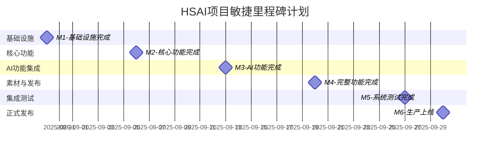
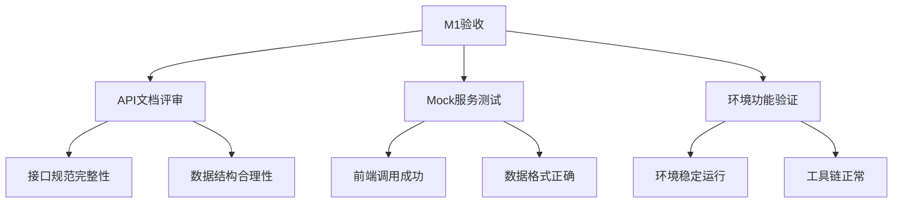
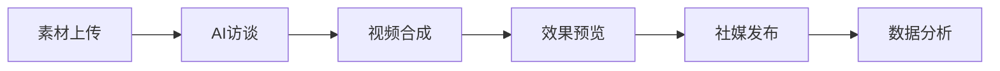
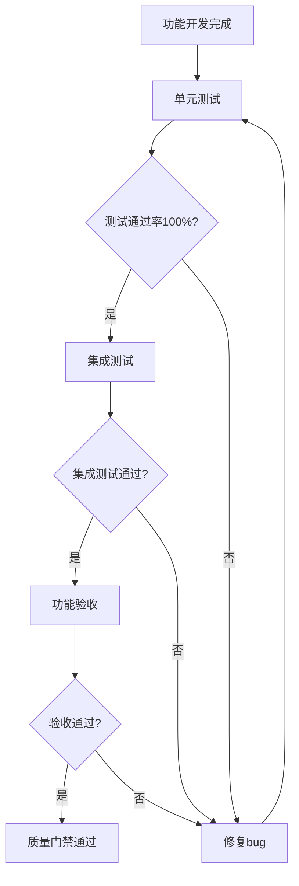
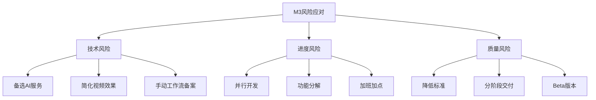
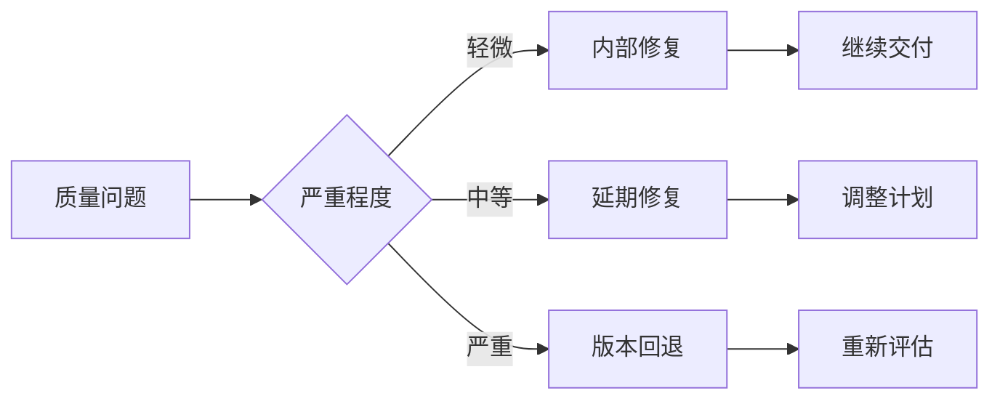

# 里程碑与交付计划

**版本**: v3.0.0  
**创建日期**: 2025-08-26  
**最后更新**: 2025-08-26  
**审核状态**: 待审核  
**项目周期**: 2025年8月26日 - 2025年9月30日  

## 版本修订记录

| 版本 | 日期 | 修订内容 | 修订人 |
|------|------|----------|--------|
| v3.0.0 | 2025-08-26 | 重新设计里程碑，采用敏捷6天迭代，聚焦MVP交付 | 项目管理办公室 |
| v2.1.0 | 2025-08-24 | 统一版本号格式，添加版本修订记录 | 系统整理 |
| v2.1 | 2025-08-22 | 完善交付质量标准，增加用户体验指标 | 项目经理 |

---

## 🎯 里程碑总览

### 📅 敏捷里程碑设计



### 📊 里程碑详情表

| 里程碑 | 日期 | 持续时间 | 主要交付物 | 成功标准 | 风险等级 |
|--------|------|----------|------------|----------|----------|
| **M1: 基础设施** | 8月30日 | 6天 | API设计、Mock服务、OpenWebUI网关 | 接口文档完整、Mock数据可用 | 🟢 低 |
| **M2: 核心功能** | 9月6日 | 6天 | 个人工作台、任务管理、用户认证 | 前端功能完整、后端API就绪 | 🟡 中 |
| **M3: AI功能** | 9月13日 | 6天 | AI访谈、视频合成、工作流集成 | AI对话流畅、视频合成可用 | 🔴 高 |
| **M4: 完整功能** | 9月20日 | 6天 | 素材管理、社媒发布、数据分析 | 完整业务流程可用 | 🟡 中 |
| **M5: 系统测试** | 9月27日 | 6天 | 全量测试、性能优化、bug修复 | 测试用例100%通过 | 🟡 中 |
| **M6: 生产上线** | 9月30日 | 3天 | 生产环境部署、用户培训 | 系统稳定运行24小时 | 🟢 低 |

---

## 🚀 阶段性交付计划

### 📋 M1: 基础设施搭建 (8/26-8/30)

#### 核心交付物
| 交付物 | 负责人 | 验收标准 | 质量要求 |
|--------|--------|----------|----------|
| **API接口设计** | 雨晨 | 完整接口文档、标准化格式 | 覆盖所有核心功能 |
| **Mock数据服务** | 雨晨 | 前端可用、数据真实 | 支持并行开发 |
| **OpenWebUI网关** | 雨晨+清泉 | 代理功能、WebSocket通信 | 解决单向请求问题 |
| **前端环境升级** | 谢颖敏 | 版本升级、功能正常 | 从0.6.7升级到0.6.18 |
| **n8n工作流环境** | Michael | 环境配置、基础工作流 | 支持Webhook触发 |
| **服务器环境配置** | 清泉 | Docker环境、监控配置 | 支持开发和测试 |

#### 验收标准


### 📋 M2: 核心功能开发 (9/2-9/6)

#### 核心交付物
| 功能模块 | 前端交付 | 后端交付 | 验收标准 |
|----------|----------|----------|----------|
| **个人工作台** | 页面完整、交互流畅 | API完整、数据准确 | 5个核心功能可用 |
| **任务管理** | 任务列表、状态管理 | CRUD接口、权限控制 | 6个管理功能可用 |
| **用户认证** | 登录界面、权限显示 | JWT认证、RBAC权限 | 安全登录和权限控制 |

#### 集成验收清单
- [ ] 用户可以正常登录系统
- [ ] 个人工作台数据显示正确
- [ ] 任务管理功能完整可用
- [ ] 前后端接口对接无误
- [ ] 权限控制生效
- [ ] 页面响应时间<3秒

### 📋 M3: AI功能集成 (9/9-9/13)

#### 核心交付物
| AI功能 | 技术实现 | 验收标准 | 风险应对 |
|--------|----------|----------|----------|
| **AI访谈功能** | 前端界面+AI服务集成 | 对话流畅、回复准确 | 备选AI服务 |
| **视频合成服务** | FFmpeg+工作流集成 | 合成成功、质量达标 | 分布式处理 |
| **工作流集成** | n8n+WebSocket状态同步 | 实时状态、错误处理 | 降级手动处理 |
| **视频播放器组件** | 前端组件封装 | 播放流畅、控制完整 | 标准播放器 |

#### 关键成功因素
- AI服务稳定性>95%
- 视频合成成功率>90%
- 工作流执行时间<5分钟
- 用户体验流畅自然

### 📋 M4: 完整功能开发 (9/16-9/20)

#### 核心交付物
| 功能模块 | 实现范围 | 验收标准 |
|----------|----------|----------|
| **素材管理** | 上传、搜索、删除、分类 | 支持多格式、批量操作 |
| **社媒发布** | 多平台、定时发布 | 支持主流平台、状态跟踪 |
| **数据分析** | 基础统计、效果分析 | 数据准确、图表清晰 |

#### 端到端验收


### 📋 M5: 系统测试与优化 (9/23-9/27)

#### 测试计划
| 测试类型 | 测试范围 | 通过标准 | 负责人 |
|----------|----------|----------|--------|
| **功能测试** | 所有功能模块 | 100%功能可用 | 全员 |
| **性能测试** | 响应时间、并发 | <2秒响应、支持50并发 | 清泉+雨晨 |
| **兼容性测试** | 浏览器、设备 | 主流环境100%兼容 | 谢颖敏 |
| **安全测试** | 权限、数据安全 | 无高危漏洞 | 雨晨 |
| **用户验收测试** | 完整业务流程 | 用户满意度>8/10 | 产品经理 |

#### 优化重点
- 代码覆盖率达到80%
- 接口响应时间优化
- 用户体验细节完善
- 错误处理机制完善

### 📋 M6: 生产上线 (9/28-9/30)

#### 上线准备
| 准备项 | 内容 | 验收标准 | 负责人 |
|--------|------|----------|--------|
| **环境部署** | 生产环境配置 | 服务稳定运行 | 清泉 |
| **数据迁移** | 测试数据清理 | 数据完整正确 | 雨晨 |
| **监控配置** | 性能监控、告警 | 监控体系完整 | 清泉 |
| **用户培训** | 操作手册、视频 | 用户可自主使用 | 产品经理 |

---

## 📏 交付质量标准

### 🎯 技术质量门禁

| 质量维度 | 指标 | 目标值 | 测量工具 | 检查频率 |
|----------|------|--------|----------|----------|
| **代码质量** | 覆盖率 | ≥80% | Jest/pytest | 每次提交 |
| **代码质量** | 重复率 | ≤5% | SonarQube | 每日扫描 |
| **性能质量** | 响应时间 | ≤2秒 | APM监控 | 实时监控 |
| **性能质量** | 并发支持 | 50用户 | JMeter | 每周测试 |
| **安全质量** | 漏洞等级 | 无高危 | 安全扫描 | 每次发布 |

### ✅ 功能验收标准

#### 通用验收标准


#### 里程碑验收清单模板
```markdown
# MX 里程碑验收清单

## 功能完整性 ✅
- [ ] 所有计划功能已实现
- [ ] 功能演示通过
- [ ] 用户验收通过

## 技术质量 ✅
- [ ] 代码覆盖率≥80%
- [ ] 代码评审通过
- [ ] 性能测试达标
- [ ] 安全测试通过

## 用户体验 ✅
- [ ] 界面设计符合规范
- [ ] 交互流程顺畅
- [ ] 错误处理友好
- [ ] 响应时间达标

## 文档完整 ✅
- [ ] 技术文档更新
- [ ] 用户文档完善
- [ ] 部署文档准确
- [ ] 变更记录完整
```

---

## ⚠️ 风险管理与应急计划

### 🚨 里程碑风险识别

#### 高风险里程碑: M3-AI功能集成
**风险因素**:
- AI服务不稳定
- 视频合成复杂度高
- 工作流集成困难

**应对策略**:


### 🔄 应急响应机制

#### 里程碑延期应急预案
| 延期程度 | 应对策略 | 决策权限 | 启动条件 |
|----------|----------|----------|----------|
| **轻微(1-2天)** | 加班、优化任务 | 项目经理 | 进度偏差>20% |
| **中等(3-5天)** | 减少功能、增加资源 | 管理层 | 里程碑延期确定 |
| **严重(>5天)** | 重新规划、外部支持 | 高层决策 | 影响总体目标 |

#### 质量问题应急预案


---

## 📊 里程碑监控与报告

### 📈 进度监控指标

#### 里程碑健康度仪表板
| 里程碑 | 进度状态 | 质量状态 | 风险状态 | 团队状态 | 综合评估 |
|--------|----------|----------|----------|----------|----------|
| **M1** | 🟢 90% | 🟢 优秀 | 🟢 低 | 🟢 良好 | 🟢 健康 |
| **M2** | ⏳ 计划中 | ⏳ 待评估 | 🟡 中 | 🟢 良好 | 🟡 关注 |
| **M3** | ⏳ 计划中 | ⏳ 待评估 | 🔴 高 | 🟡 饱和 | 🔴 风险 |

### 📋 里程碑报告模板

```markdown
# 里程碑MX完成报告

## 📊 总体状况
- **计划完成时间**: YYYY-MM-DD
- **实际完成时间**: YYYY-MM-DD
- **完成度**: XX%
- **质量评估**: 优秀/良好/一般/需改进

## 🎯 交付成果
### 主要交付物
1. [交付物1] - 状态: ✅/🔄/❌
2. [交付物2] - 状态: ✅/🔄/❌

### 验收结果
- 功能验收: ✅通过/❌不通过
- 技术验收: ✅通过/❌不通过
- 质量验收: ✅通过/❌不通过

## 📈 关键指标
| 指标 | 计划值 | 实际值 | 达成率 |
|------|--------|--------|--------|
| 功能完成度 | 100% | XX% | XX% |
| 代码覆盖率 | 80% | XX% | XX% |
| 性能指标 | <2秒 | XX秒 | 达标/未达标 |

## ⚠️ 问题与风险
### 已解决问题
1. [问题1] - 解决方案: [方案]

### 遗留问题
1. [问题1] - 影响: [影响] - 计划: [解决计划]

### 新发现风险
1. [风险1] - 等级: 🔴/🟡/🟢 - 应对: [措施]

## 💡 经验教训
### 成功经验
1. [经验1]
2. [经验2]

### 改进建议
1. [建议1]
2. [建议2]

## 📅 下一里程碑准备
- 下一里程碑: MX+1
- 关键依赖: [依赖项]
- 重点关注: [关注点]
```

---

## 🎯 成功标准与KPI

### 🏆 项目成功指标

#### 交付成功指标
| 维度 | 指标 | 目标值 | 权重 |
|------|------|--------|------|
| **时间** | 里程碑按时完成率 | 100% | 25% |
| **质量** | 功能验收通过率 | 100% | 30% |
| **范围** | 功能完整度 | 100% | 25% |
| **满意度** | 用户满意度 | ≥8/10 | 20% |

#### 商业价值指标
- 用户操作效率提升50%+
- 视频制作时间减少70%+
- 内容发布效率提升80%+
- 系统稳定性≥99.9%

### 📊 持续改进指标

#### 过程改进指标
| 指标 | 基线值 | 目标改进 | 当前值 |
|------|--------|----------|--------|
| 里程碑预测准确性 | 70% | 提升到90% | [待更新] |
| 缺陷发现速度 | 延迟发现 | 提前发现 | [待更新] |
| 团队协作效率 | 中等 | 高效 | [待更新] |
| 用户反馈响应速度 | 3天 | 1天内 | [待更新] |

---

**审核状态**: 待审核  
**下次更新**: 2025年9月2日 (首个里程碑完成后更新实际执行情况)