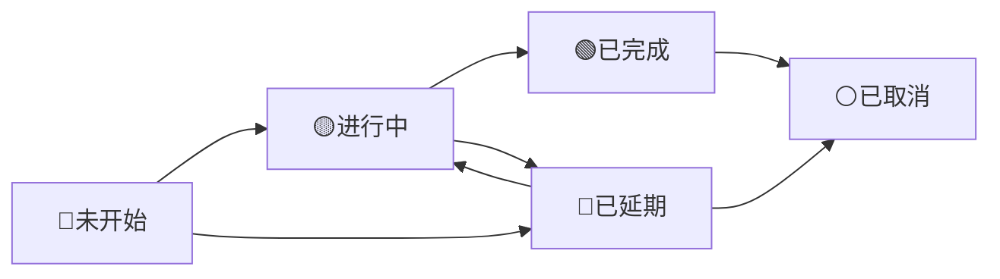
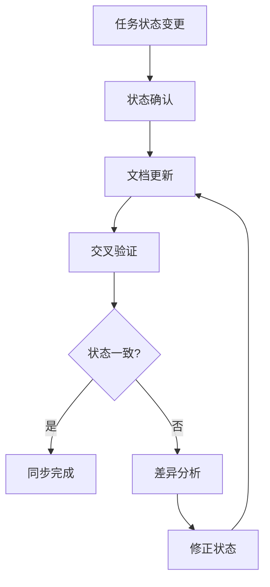

# 任务状态同步机制

**版本**: v1.0.0  
**创建日期**: 2025-08-31  
**最后更新**: 2025-08-31  
**审核状态**: 待审核  
**文档编写**: 郭雨晨  

## 版本修订记录

| 版本 | 日期 | 修订内容 | 修订人 |
|------|------|----------|--------|
| v1.0.0 | 2025-08-31 | 初始版本，建立任务状态同步机制 | 郭雨晨 |

---

## 1. 目的与范围

### 1.1 目的
建立统一的任务状态同步机制，确保项目中所有相关文档的任务状态保持一致，避免因状态不一致导致的项目执行偏差和沟通成本增加。

### 1.2 适用范围
本机制适用于HSAI项目中所有任务相关文档，包括但不限于：
- [HSAI项目任务明细计划.md](../04_项目计划/HSAI项目任务明细计划.md)
- [n8n工作流整合开发计划.md](../04_项目计划/n8n工作流整合开发计划.md)
- [项目整合开发计划.md](../04_项目计划/项目整合开发计划.md)
- [项目任务明细整理总结.md](../04_项目计划/项目任务明细整理总结.md)

## 2. 任务状态定义

### 2.1 统一状态标识
| 状态标识 | 状态名称 | 说明 | 颜色代码 |
|----------|----------|------|----------|
| 🟢已完成 | 已完成 | 任务按计划完成，达到验收标准 | 绿色 |
| 🟡进行中 | 进行中 | 任务正在执行中，尚未完成 | 黄色 |
| 🔵未开始 | 未开始 | 任务计划执行，但尚未开始 | 蓝色 |
| 🔴已延期 | 已延期 | 任务未按计划时间完成 | 红色 |
| ⚪已取消 | 已取消 | 任务因各种原因取消执行 | 白色 |

### 2.2 状态转换规则


## 3. 同步机制

### 3.1 同步频率
- **日常同步**: 每个工作日更新一次任务状态
- **关键节点同步**: 里程碑完成时立即同步
- **异常同步**: 任务状态发生变更时立即同步

### 3.2 同步流程


### 3.3 同步责任人
| 文档名称 | 责任人 | 同步职责 |
|----------|--------|----------|
| HSAI项目任务明细计划 | 项目管理办公室 | 总体任务状态维护 |
| n8n工作流整合开发计划 | Michael | n8n相关任务状态维护 |
| 项目整合开发计划 | 郭雨晨 | 架构和核心功能任务状态维护 |
| 项目任务明细整理总结 | 项目管理办公室 | 任务整理和总结状态维护 |

## 4. 状态更新规范

### 4.1 更新时机
1. **每日站会后**: 根据每日站会汇报更新任务状态
2. **任务完成时**: 任务完成后立即更新状态
3. **计划调整时**: 任务计划发生变更时更新状态
4. **里程碑评审后**: 里程碑评审完成后更新相关任务状态

### 4.2 更新内容
每次状态更新需包含以下信息：
- 任务ID和任务名称
- 原始状态和更新后状态
- 状态变更时间
- 状态变更原因
- 更新人

### 4.3 更新模板
```markdown
## 任务状态更新记录

| 更新时间 | 任务ID | 任务名称 | 原始状态 | 更新状态 | 变更原因 | 更新人 |
|----------|--------|----------|----------|----------|----------|--------|
| 2025-08-31 10:00 | T109 | 前端代码版本升级 | 🟡进行中 | 🟢已完成 | 按计划完成升级和测试 | 谢颖敏 |
| 2025-08-31 14:00 | M2.N8N001 | 主工作流开发 | 🔵未开始 | 🟡进行中 | 开始工作流开发工作 | Michael |
```

## 5. 质量控制

### 5.1 状态一致性检查
- **每日检查**: 每日由项目管理办公室检查各文档任务状态一致性
- **交叉验证**: 不同文档中的相同任务状态必须保持一致
- **异常报告**: 发现状态不一致时立即报告并修正

### 5.2 状态更新验证
- **责任人验证**: 状态更新需由任务责任人确认
- **文档关联验证**: 相关文档需同步更新
- **时间戳验证**: 状态更新需记录准确时间

## 6. 工具支持

### 6.1 状态跟踪工具
1. **Jira看板**: 实时跟踪任务状态
2. **甘特图**: 可视化任务进度和状态
3. **状态报告**: 自动生成状态同步报告

### 6.2 自动化同步
- 考虑开发脚本自动同步关键任务状态
- 建立状态变更通知机制
- 设置状态不一致预警

## 7. 异常处理

### 7.1 状态争议处理
当对任务状态存在争议时：
1. 由任务负责人提供完成证据
2. 项目经理组织相关方评审
3. 达成共识后更新状态
4. 记录争议处理过程

### 7.2 状态不一致处理
发现状态不一致时：
1. 立即通知相关责任人
2. 确认最新真实状态
3. 同步更新所有相关文档
4. 记录不一致原因和处理过程

## 8. 持续改进

### 8.1 机制评估
- 每月评估同步机制有效性
- 收集使用反馈
- 优化同步流程

### 8.2 培训与沟通
- 对项目成员进行机制培训
- 定期沟通状态同步重要性
- 分享最佳实践

---

**审核状态**: 待审核  
**维护负责**: 项目管理办公室  
**更新频率**: 根据项目需要调整