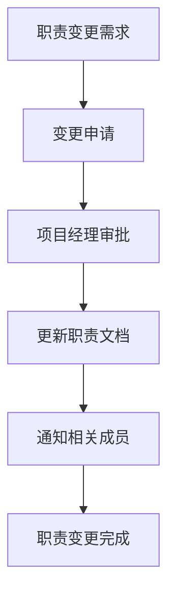

# 团队成员职责说明

**版本**: v1.0.0  
**创建日期**: 2025-08-31  
**最后更新**: 2025-08-31  
**审核状态**: 待审核  
**文档编写**: 郭雨晨  

## 版本修订记录

| 版本 | 日期 | 修订内容 | 修订人 |
|------|------|----------|--------|
| v1.0.0 | 2025-08-31 | 初始版本，明确团队成员职责描述 | 郭雨晨 |

---

## 1. 团队成员构成

HSAI项目团队由以下核心成员组成：
- **谢颖敏**: 前端开发工程师
- **郭雨晨**: 后端开发工程师
- **Michael**: n8n工作流工程师
- **郑清泉**: 运维工程师
- **Owen Gao**: 产品负责人

## 2. 职责详细说明

### 2.1 谢颖敏（前端开发工程师）
**核心技能**: Svelte, OpenWebUI, 界面开发

**主要职责**:
1. 负责前端界面设计与开发实现
2. 基于Svelte框架和OpenWebUI进行前端开发
3. 实现用户交互逻辑和界面效果
4. 与后端进行接口对接和联调测试
5. 前端性能优化和兼容性处理
6. 参与用户体验优化和界面改进

**关联任务**:
- 前端页面开发任务
- 前端与后端接口对接任务
- 用户体验优化任务

### 2.2 郭雨晨（后端开发工程师）
**核心技能**: FastAPI, 数据库, API设计

**主要职责**:
1. 负责后端服务架构设计与开发
2. 基于FastAPI开发后端API接口
3. 数据库设计与优化
4. OpenWebUI网关扩展开发
5. API文档编写和维护
6. 后端服务性能优化
7. 与n8n工作流进行集成开发

**关联任务**:
- 后端API开发任务
- 数据库设计与开发任务
- 网关扩展开发任务
- n8n工作流集成任务

### 2.3 Michael（n8n工作流工程师）
**核心技能**: n8n, AI集成, 工作流设计

**主要职责**:
1. 负责n8n工作流的设计与开发
2. AI服务集成与优化
3. 工作流性能调优
4. 数据存储节点开发
5. 第三方服务集成（如Apify、OSS等）
6. 工作流监控与维护
7. 与前后端进行工作流集成

**关联任务**:
- n8n工作流开发任务
- AI服务集成任务
- 数据存储节点开发任务
- 工作流性能优化任务

### 2.4 郑清泉（运维工程师）
**核心技能**: Docker, K8s, 环境配置

**主要职责**:
1. 负责项目环境搭建与维护
2. Docker容器化部署
3. Kubernetes集群管理
4. 服务监控与告警配置
5. 生产环境部署与维护
6. 系统安全与备份策略
7. 性能监控与优化

**关联任务**:
- 环境搭建与配置任务
- 部署与维护任务
- 监控配置任务
- 安全与备份任务

### 2.5 Owen Gao（产品负责人）
**核心技能**: 产品设计、需求分析、用户研究

**主要职责**:
1. 负责产品需求分析与规划
2. 用户体验设计与优化
3. 产品功能定义与优先级排序
4. 与开发团队沟通需求细节
5. 产品验收与质量把控
6. 用户反馈收集与分析
7. 市场调研与竞品分析

**关联任务**:
- 产品需求定义任务
- 功能验收任务
- 用户体验优化任务
- 产品规划任务

## 3. 跨职能协作

### 3.1 前后端协作
- **接口对接**: 前后端通过API文档进行接口对接
- **联调测试**: 定期进行前后端联调测试
- **问题处理**: 前后端协作解决接口问题

### 3.2 工作流集成
- **Webhook集成**: 后端与n8n通过Webhook进行集成
- **数据流转**: 前端→后端→n8n的数据流转协调
- **状态同步**: 工作流执行状态的实时同步

### 3.3 运维支持
- **环境保障**: 运维为开发提供稳定的开发和测试环境
- **部署支持**: 运维负责生产环境的部署和维护
- **监控告警**: 运维建立完善的监控告警体系

### 3.4 产品协调
- **需求澄清**: 产品负责向开发团队澄清需求细节
- **验收标准**: 产品制定功能验收标准
- **用户体验**: 产品关注用户体验并提出优化建议

## 4. 职责更新机制

### 4.1 更新原则
- 职责描述应根据项目进展和人员技能发展进行更新
- 重大职责调整需经项目经理批准
- 职责变更需及时通知相关团队成员

### 4.2 更新流程

## 5. 职责文档同步

### 5.1 同步要求
所有项目文档中的团队成员职责描述必须与此文档保持一致：
- [HSAI项目总体计划.md](../04_项目计划/HSAI项目总体计划.md)
- [n8n工作流整合开发计划.md](../04_项目计划/n8n工作流整合开发计划.md)
- [项目整合开发计划.md](../04_项目计划/项目整合开发计划.md)
- [团队协作机制.md](./团队协作机制.md)

### 5.2 同步责任人
- **总体计划**: 郭雨晨
- **开发计划**: 郭雨晨
- **n8n计划**: Michael
- **管理计划**: 项目经理

---

**审核状态**: 待审核  
**维护负责**: 项目管理办公室  
**更新频率**: 根据项目需要调整