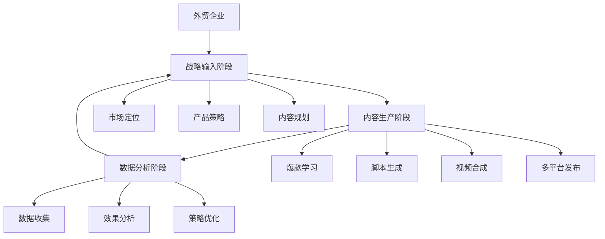
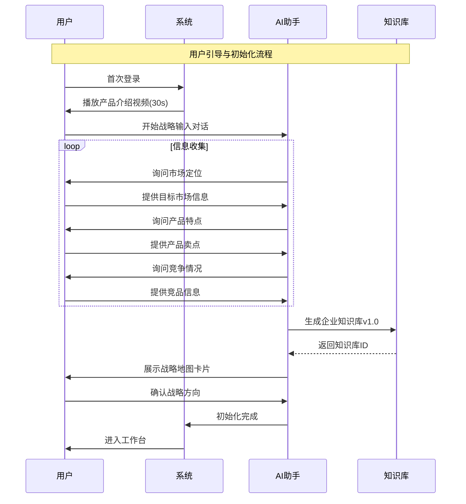
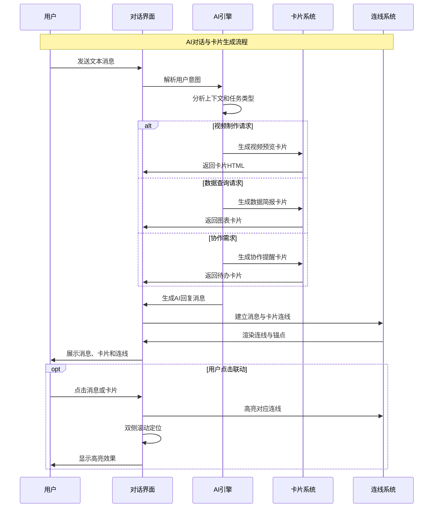
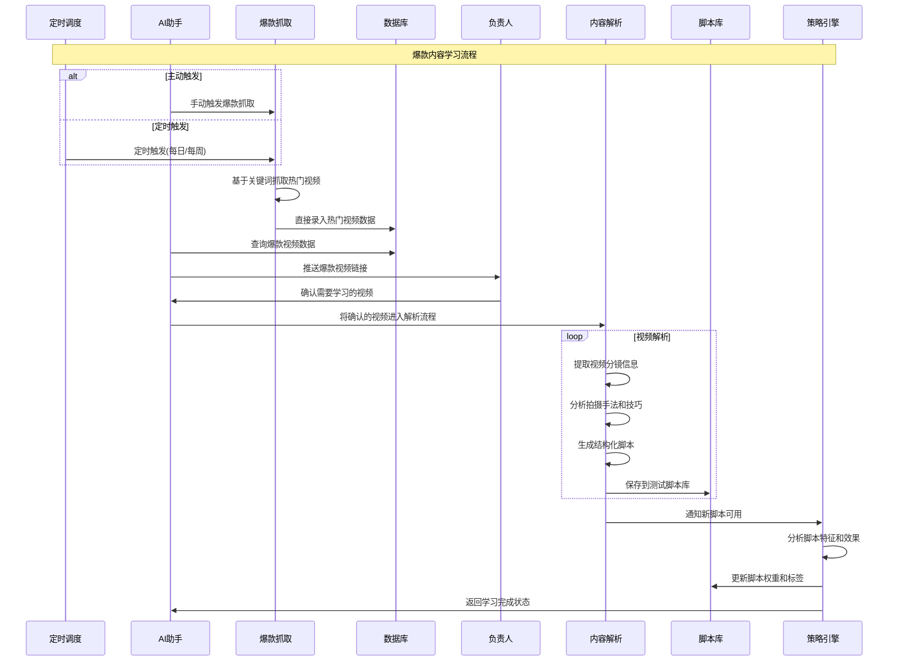
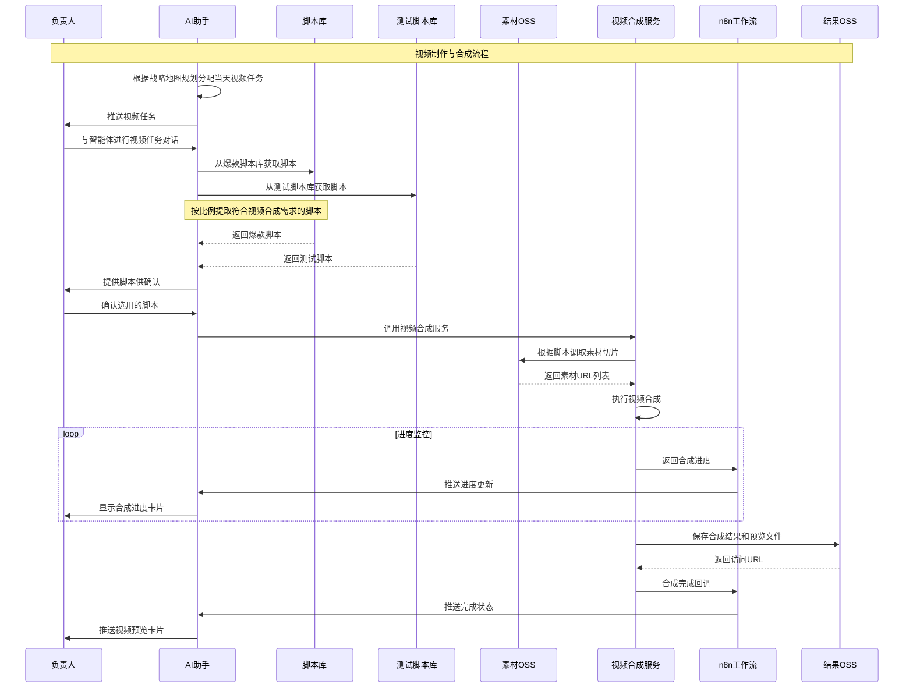
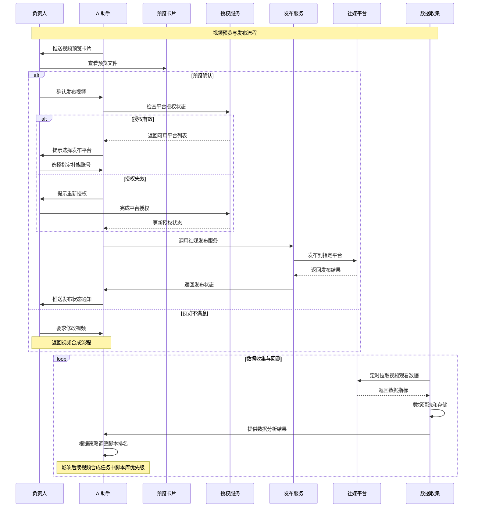
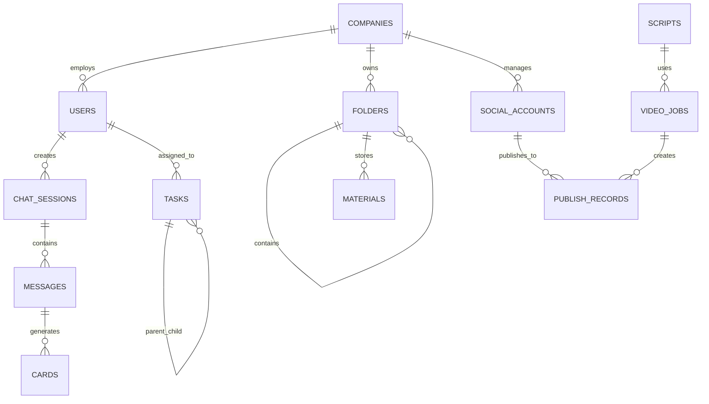

# 业务流程与数据规范

**版本**: v2.1.0  
**更新日期**: 2025-08-24  
**参考**: 核心业务与技术方案泳道图描述.md  
**审核状态**: 待审核  

## 版本修订记录

| 版本 | 日期 | 修改内容 | 修改人 |
|------|------|----------|--------|
| v2.1.0 | 2025-08-24 | 统一版本号格式为三段版本号，添加版本修订记录 | 系统整理 |
| v2.1 | 2025-08-22 | 优化业务流程图，增加数据规范说明 | 产品经理 |
| v2.0 | 2025-08-20 | 重新设计业务架构，完善数据流转流程 | 产品经理 |
| v1.0 | 2025-08-16 | 初始版本，定义基础业务流程与数据规范 | 产品经理 |  

## 1. 业务流程总览

### 1.1 核心业务架构



### 1.2 业务价值链

| 阶段   | 输入        | 处理        | 输出        | 价值   |
| ---- | --------- | --------- | --------- | ---- |
| 战略输入 | 企业背景、产品信息 | AI分析、策略生成 | 内容策略、制作计划 | 明确方向 |
| 内容生产 | 策略、素材     | 爆款学习、智能合成 | 高质量视频内容   | 高效制作 |
| 数据分析 | 发布数据、用户反馈 | 数据挖掘、AI优化 | 优化建议、新策略  | 持续改进 |

## 2. 详细业务流程

### 2.1 用户引导与初始化流程



**流程要点**:

- **触发条件**: 用户首次登录或重新设置战略
- **关键节点**: 信息收集、知识库生成、战略确认
- **输出产物**: 企业专属知识库、战略地图、制作计划

### 2.2 AI对话与卡片生成流程



**流程要点**:

- **智能解析**: AI根据用户输入自动判断意图和任务类型
- **卡片映射**: 不同意图生成对应类型的功能卡片
- **视觉关联**: 通过连线系统建立消息与卡片的视觉关系
- **交互反馈**: 支持点击联动和自动滚动定位

### 2.3 爆款内容学习流程



**流程要点**:

- **自动化程度**: 支持定时自动抓取和手动触发
- **数据录入**: 抓取的爆款热门视频直接录入数据库
- **人工确认**: 负责人确认需要学习的爆款视频
- **智能解析**: AI分析视频结构、手法和效果
- **脚本存储**: 生成的爆款脚本录入测试脚本库

### 2.4 视频制作与合成流程



**流程要点**:

- **任务分配**: 智能体根据战略地图规划分配每日视频任务
- **脚本选择**: 从爆款脚本库和测试脚本库按比例提取脚本
- **用户确认**: 负责人确认选用的脚本后才进行视频合成
- **素材调取**: 视频合成服务根据脚本调取需要的素材切片
- **异步处理**: 通过n8n工作流实现异步视频合成
- **预览文件**: 生成降级处理的预览文件提升用户体验

### 2.5 视频预览与发布流程



**流程要点**:

- **预览确认**: 用户查看预览文件后确认发布
- **指定发布**: 支持选择特定社媒账号发布
- **状态追踪**: 实时追踪发布状态和结果
- **数据回测**: 定时拉取视频观看数据用于本地更新
- **动态优化**: 根据视频表现调整脚本排名和优先级

## 3. 数据规范

### 3.1 核心数据实体

#### 3.1.1 用户与权限实体

```sql
-- 用户表
CREATE TABLE users (
    id BIGINT PRIMARY KEY,
    username VARCHAR(50) UNIQUE NOT NULL,
    email VARCHAR(100) UNIQUE NOT NULL,
    role ENUM('admin', 'manager', 'operator', 'viewer') NOT NULL,
    status ENUM('active', 'inactive', 'banned') DEFAULT 'active',
    created_at TIMESTAMP DEFAULT CURRENT_TIMESTAMP,
    updated_at TIMESTAMP DEFAULT CURRENT_TIMESTAMP ON UPDATE CURRENT_TIMESTAMP
);

-- 企业表
CREATE TABLE companies (
    id BIGINT PRIMARY KEY,
    name VARCHAR(100) NOT NULL,
    industry VARCHAR(50),
    target_markets JSON, -- ['Southeast Asia', 'South America']
    core_products JSON, -- 核心产品信息
    created_at TIMESTAMP DEFAULT CURRENT_TIMESTAMP
);
```

#### 3.1.2 对话与消息实体

```sql
-- 对话会话表
CREATE TABLE chat_sessions (
    id BIGINT PRIMARY KEY,
    user_id BIGINT NOT NULL,
    title VARCHAR(200),
    status ENUM('active', 'archived') DEFAULT 'active',
    created_at TIMESTAMP DEFAULT CURRENT_TIMESTAMP,
    FOREIGN KEY (user_id) REFERENCES users(id)
);

-- 消息表
CREATE TABLE messages (
    id BIGINT PRIMARY KEY,
    session_id BIGINT NOT NULL,
    role ENUM('user', 'ai') NOT NULL,
    content TEXT NOT NULL,
    message_type ENUM('text', 'voice', 'file') DEFAULT 'text',
    ai_id VARCHAR(50), -- 用于关联卡片
    created_at TIMESTAMP DEFAULT CURRENT_TIMESTAMP,
    FOREIGN KEY (session_id) REFERENCES chat_sessions(id)
);

-- 卡片表
CREATE TABLE cards (
    id BIGINT PRIMARY KEY,
    message_id BIGINT NOT NULL,
    card_type ENUM('video', 'strategy', 'collaboration', 'data', 'progress') NOT NULL,
    title VARCHAR(200) NOT NULL,
    data JSON NOT NULL, -- 卡片具体数据
    status ENUM('active', 'completed', 'cancelled') DEFAULT 'active',
    created_at TIMESTAMP DEFAULT CURRENT_TIMESTAMP,
    FOREIGN KEY (message_id) REFERENCES messages(id)
);
```

#### 3.1.3 素材管理实体

```sql
-- 文件夹表
CREATE TABLE folders (
    id BIGINT PRIMARY KEY,
    name VARCHAR(100) NOT NULL,
    parent_id BIGINT NULL,
    path VARCHAR(500) NOT NULL, -- 完整路径
    company_id BIGINT NOT NULL,
    created_at TIMESTAMP DEFAULT CURRENT_TIMESTAMP,
    FOREIGN KEY (parent_id) REFERENCES folders(id),
    FOREIGN KEY (company_id) REFERENCES companies(id)
);

-- 素材表
CREATE TABLE materials (
    id BIGINT PRIMARY KEY,
    folder_id BIGINT NOT NULL,
    name VARCHAR(200) NOT NULL,
    file_type ENUM('image', 'video', 'audio', 'document') NOT NULL,
    file_size BIGINT NOT NULL, -- 字节数
    file_url VARCHAR(500) NOT NULL,
    thumbnail_url VARCHAR(500),
    tags JSON, -- 标签数组
    metadata JSON, -- 文件元数据
    created_at TIMESTAMP DEFAULT CURRENT_TIMESTAMP,
    FOREIGN KEY (folder_id) REFERENCES folders(id)
);
```

#### 3.1.4 视频制作实体

```sql
-- 脚本库表
CREATE TABLE scripts (
    id BIGINT PRIMARY KEY,
    title VARCHAR(200) NOT NULL,
    script_type ENUM('trending', 'custom', 'template') NOT NULL,
    content JSON NOT NULL, -- 脚本结构化内容
    source_url VARCHAR(500), -- 原始视频链接
    performance_score DECIMAL(3,2) DEFAULT 0, -- 效果评分
    usage_count INT DEFAULT 0,
    tags JSON,
    created_at TIMESTAMP DEFAULT CURRENT_TIMESTAMP
);

-- 视频制作任务表
CREATE TABLE video_jobs (
    id BIGINT PRIMARY KEY,
    job_id VARCHAR(50) UNIQUE NOT NULL, -- 业务ID
    script_id BIGINT NOT NULL,
    material_ids JSON NOT NULL, -- 使用的素材ID数组
    status ENUM('pending', 'processing', 'completed', 'failed') DEFAULT 'pending',
    progress INT DEFAULT 0, -- 0-100
    result_url VARCHAR(500),
    error_message TEXT,
    created_at TIMESTAMP DEFAULT CURRENT_TIMESTAMP,
    completed_at TIMESTAMP NULL,
    FOREIGN KEY (script_id) REFERENCES scripts(id)
);
```

#### 3.1.5 任务与KPI实体

```sql
-- 任务表
CREATE TABLE tasks (
    id BIGINT PRIMARY KEY,
    title VARCHAR(200) NOT NULL,
    description TEXT,
    task_type ENUM('video_creation', 'content_planning', 'data_analysis') NOT NULL,
    status ENUM('pending', 'in_progress', 'completed', 'cancelled') DEFAULT 'pending',
    priority ENUM('low', 'medium', 'high', 'urgent') DEFAULT 'medium',
    assignee_id BIGINT,
    due_date DATE,
    progress INT DEFAULT 0,
    parent_task_id BIGINT NULL,
    created_at TIMESTAMP DEFAULT CURRENT_TIMESTAMP,
    FOREIGN KEY (assignee_id) REFERENCES users(id),
    FOREIGN KEY (parent_task_id) REFERENCES tasks(id)
);

-- KPI指标表
CREATE TABLE kpi_metrics (
    id BIGINT PRIMARY KEY,
    metric_name VARCHAR(100) NOT NULL,
    metric_value DECIMAL(15,2) NOT NULL,
    metric_unit VARCHAR(20), -- 单位：count, percentage, seconds等
    previous_value DECIMAL(15,2),
    change_type ENUM('up', 'down', 'neutral') DEFAULT 'neutral',
    record_date DATE NOT NULL,
    company_id BIGINT NOT NULL,
    created_at TIMESTAMP DEFAULT CURRENT_TIMESTAMP,
    FOREIGN KEY (company_id) REFERENCES companies(id)
);
```

#### 3.1.6 社媒矩阵实体

```sql
-- 社媒账号表
CREATE TABLE social_accounts (
    id BIGINT PRIMARY KEY,
    platform ENUM('douyin', 'kuaishou', 'xiaohongshu', 'youtube', 'tiktok') NOT NULL,
    account_name VARCHAR(100) NOT NULL,
    account_id VARCHAR(100) NOT NULL, -- 平台账号ID
    access_token TEXT,
    refresh_token TEXT,
    token_expires_at TIMESTAMP,
    status ENUM('active', 'expired', 'error') DEFAULT 'active',
    company_id BIGINT NOT NULL,
    created_at TIMESTAMP DEFAULT CURRENT_TIMESTAMP,
    FOREIGN KEY (company_id) REFERENCES companies(id)
);

-- 发布记录表
CREATE TABLE publish_records (
    id BIGINT PRIMARY KEY,
    video_job_id BIGINT NOT NULL,
    account_id BIGINT NOT NULL,
    platform_post_id VARCHAR(100),
    status ENUM('pending', 'published', 'failed') DEFAULT 'pending',
    publish_time TIMESTAMP,
    error_message TEXT,
    view_count BIGINT DEFAULT 0,
    like_count BIGINT DEFAULT 0,
    comment_count BIGINT DEFAULT 0,
    share_count BIGINT DEFAULT 0,
    created_at TIMESTAMP DEFAULT CURRENT_TIMESTAMP,
    FOREIGN KEY (video_job_id) REFERENCES video_jobs(id),
    FOREIGN KEY (account_id) REFERENCES social_accounts(id)
);
```

### 3.2 数据关系图



### 3.3 数据流转规范

#### 3.3.1 状态转换规则

**视频制作任务状态流**:

```
pending → processing → completed
   ↓
  failed (可重试)
```

**任务状态流**:

```
pending → in_progress → completed
   ↓
cancelled (任意状态可取消)
```

**发布状态流**:

```
pending → published
   ↓
 failed (可重试)
```

#### 3.3.2 数据同步策略

| 数据类型   | 同步频率 | 同步方式        | 容错策略     |
| ------ | ---- | ----------- | -------- |
| 用户操作   | 实时   | 同步API       | 乐观锁 + 重试 |
| 视频合成进度 | 5秒   | WebSocket推送 | 断线重连     |
| 社媒数据   | 1小时  | 定时拉取        | 失败重试3次   |
| KPI指标  | 15分钟 | 定时计算        | 异常数据过滤   |

#### 3.3.3 数据质量保证

**数据校验规则**:

- 必填字段校验
- 数据格式校验（邮箱、URL等）
- 业务逻辑校验（状态转换合法性）
- 数据范围校验（进度0-100%）

**数据清洗规则**:

- 去除重复数据
- 标准化数据格式
- 异常值检测和处理
- 数据完整性检查

## 4. API接口规范

### 4.1 统一响应格式

```json
{
  "code": 200,
  "message": "success",
  "data": {},
  "timestamp": "2025-08-22T00:00:00Z",
  "trace_id": "abc123def456"
}
```

### 4.2 错误码规范

| 错误码    | 说明      | HTTP状态码 |
| ------ | ------- | ------- |
| 200    | 成功      | 200     |
| 400001 | 参数错误    | 400     |
| 401001 | 未授权     | 401     |
| 403001 | 权限不足    | 403     |
| 404001 | 资源不存在   | 404     |
| 500001 | 服务器内部错误 | 500     |

### 4.3 关键接口示例

#### 4.3.1 对话接口

```http
POST /api/v1/chat/send
Content-Type: application/json

{
  "session_id": "12345",
  "message": "我想制作一个产品介绍视频",
  "message_type": "text"
}
```

#### 4.3.2 视频合成接口

```http
POST /api/v1/videos/compose
Content-Type: application/json

{
  "script_id": "67890",
  "material_ids": ["123", "456", "789"],
  "output_format": "mp4",
  "quality": "1080p"
}
```

## 5. 数据安全与隐私

### 5.1 数据分类

| 数据类型   | 敏感等级 | 处理方式 |
| ------ | ---- | ---- |
| 用户身份信息 | 高    | 加密存储 |
| 企业商业信息 | 高    | 隔离存储 |
| 素材文件   | 中    | 访问控制 |
| 操作日志   | 低    | 定期清理 |

### 5.2 数据保护措施

- **传输加密**: 全站HTTPS，API签名验证
- **存储加密**: 敏感数据AES-256加密
- **访问控制**: 基于角色的细粒度权限
- **审计日志**: 完整的操作审计链
- **数据备份**: 多地域热备份
- **合规遵循**: 符合GDPR、网络安全法要求

---

**文档维护**: 技术团队  
**审核状态**: 已审核  
**相关文档**: 产品需求规格说明书, 技术实现方案