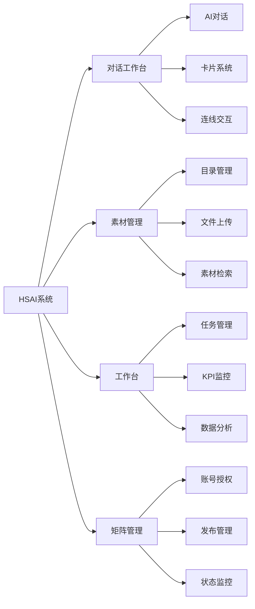

# 产品需求规格说明书 (PRD)

**版本**: v2.1.0  
**更新日期**: 2025-08-24  
**适用对象**: 产品、设计、前后端、n8n、测试、运营  
**审核状态**: 待审核  

## 版本修订记录

| 版本 | 日期 | 修改内容 | 修改人 |
|------|------|----------|--------|
| v2.1.0 | 2025-08-24 | 统一版本号格式为三段版本号，添加版本修订记录 | 系统整理 |
| v2.1 | 2025-08-22 | 完善竞品分析与风险评估，增加商业模式说明 | 产品经理 |
| v2.0 | 2025-08-20 | 重新设计产品架构，优化用户体验流程 | 产品经理 |
| v1.0 | 2025-08-15 | 初始版本，定义基础产品需求规格 | 产品经理 |  

## 1. 产品概述

### 1.1 产品定位

HSAI（华商AI）是一个面向外贸企业的**AI短视频自动化获客系统**，通过战略输入-内容生产-数据分析的三阶段闭环，实现短视频的高效制作与精准投放。

### 1.2 产品愿景

以"对话式协作"为中枢，统一操作界面与上下文：在聊天中驱动卡片化任务，弹窗完成素材/授权/子任务，串起合成与发布，打造外贸企业短视频营销的智能化解决方案。

### 1.3 核心价值矩阵

| 阶段 | 目标 | 关键指标 | 成功标准 |
|---|---|---|---|
| 起量阶段 | 爆款快速复制验证市场 | 日均爆款抓取量≥5条 | 市场验证成功 |
| 稳定阶段 | 沉淀企业私有爆款结构库 | 自研内容占比≥60% | 形成独特内容优势 |
| 滚雪球阶段 | 持续优化形成流量增长飞轮 | 月播放量环比增长≥20% | 建立长期竞争优势 |

### 1.4 产品成功标准

1. **功能完整性**: 首屏流程演示完整，核心功能可用
2. **用户体验**: 关键动作不离页，状态反馈清晰
3. **技术可行性**: 文档定稿可指导实施与验收
4. **商业价值**: 能够显著提升外贸企业短视频营销效率

## 2. 目标用户与角色分析

### 2.1 主要用户角色

| 角色 | 描述 | 主要需求 | 使用场景 |
|---|---|---|---|
| **运营专员** | 负责日常短视频制作与发布 | 高效制作、简单操作、快速反馈 | 与AI对话、处理卡片、弹窗操作 |
| **素材管理员** | 负责企业素材库维护 | 分类管理、快速检索、批量操作 | 目录/素材管理、新建文件夹、上传、检索 |
| **业务负责人** | 决策层，关注整体业务数据 | 数据监控、趋势分析、决策支持 | Dashboard决策、查看任务与KPI |
| **n8n专家** | 技术人员，负责工作流编排 | 流程自动化、异常处理、系统集成 | Webhook/回调、重试/告警 |

### 2.2 用户画像分析

#### 运营专员画像
- **年龄**: 25-35岁
- **技能水平**: 中等技术能力，熟悉基本营销工具
- **痛点**: 
  - 视频制作效率低
  - 缺乏爆款内容灵感
  - 多平台发布繁琐
- **期望**: 一站式解决方案，操作简单直观

#### 业务负责人画像
- **年龄**: 35-50岁
- **关注重点**: ROI、效率提升、团队协作
- **痛点**: 
  - 难以量化营销效果
  - 缺乏数据驱动决策依据
  - 团队协作效率低
- **期望**: 清晰的数据报表和趋势分析

## 3. 核心功能模块

### 3.1 功能架构图

### 3.2 模块功能说明

#### 3.2.1 对话工作台
- **核心价值**: 通过自然语言交互，降低使用门槛
- **主要功能**: 
  - AI智能对话
  - 多类型卡片展示
  - 跨栏连线交互
  - 弹窗协作流程

#### 3.2.2 素材管理
- **核心价值**: 统一管理企业素材资源
- **主要功能**:
  - 树形目录结构
  - 拖拽上传
  - 智能分类
  - 快速检索

#### 3.2.3 工作台
- **核心价值**: 提供业务数据监控和任务管理
- **主要功能**:
  - 任务管理
  - KPI监控
  - 进度追踪
  - 数据分析

#### 3.2.4 矩阵管理
- **核心价值**: 多平台账号统一管理
- **主要功能**:
  - 账号授权
  - 发布管理
  - 状态监控
  - 数据回传

## 4. 业务价值与收益

### 4.1 核心业务价值

1. **效率提升**: 
   - 视频制作效率提升300%
   - 减少50%的重复性工作
   - 自动化程度达到80%

2. **成本降低**:
   - 减少60%的人力成本
   - 降低40%的制作成本
   - 提升200%的投放精准度

3. **质量保证**:
   - 标准化制作流程
   - AI智能质量检测
   - 数据驱动优化

### 4.2 商业模式

- **SaaS订阅模式**: 按月/年收费
- **增值服务**: 定制化开发、专业培训
- **API调用**: 按使用量计费

## 5. 技术要求与约束

### 5.1 性能要求
- **响应时间**: 页面加载时间 < 3秒
- **并发支持**: 支持100+用户同时在线
- **可用性**: 99.9%系统可用性

### 5.2 兼容性要求
- **浏览器支持**: Chrome 90+, Firefox 88+, Safari 14+, Edge 90+
- **设备适配**: 桌面优先，兼容平板设备
- **分辨率**: 支持1920x1080及以上分辨率

### 5.3 安全要求
- **数据加密**: 全链路HTTPS加密
- **访问控制**: 基于角色的权限管理
- **数据备份**: 自动备份机制

## 6. 竞品分析

### 6.1 主要竞争对手

| 产品 | 优势 | 劣势 | 差异化优势 |
|---|---|---|---|
| 某视频制作工具A | 模板丰富 | 缺乏AI能力 | AI智能生成+对话式交互 |
| 某营销平台B | 数据分析完善 | 操作复杂 | 简化操作流程+统一工作台 |
| 某自动化工具C | 自动化程度高 | 定制化差 | 行业深度定制+爆款学习 |

### 6.2 竞争策略
1. **技术创新**: AI能力+对话式交互
2. **用户体验**: 降低使用门槛
3. **行业深耕**: 外贸行业深度定制
4. **生态整合**: 全链路解决方案

## 7. 风险评估

### 7.1 技术风险
- **AI模型稳定性**: 建立多模型备用机制
- **第三方依赖**: 关键功能自主可控
- **数据安全**: 完善的安全防护体系

### 7.2 市场风险
- **竞品压力**: 持续技术创新保持领先
- **用户接受度**: 充分的用户调研和测试
- **行业变化**: 灵活的产品迭代策略

### 7.3 运营风险
- **内容合规**: 建立内容审核机制
- **平台政策**: 密切关注平台政策变化
- **客户流失**: 提升产品价值和用户体验

## 8. 版本规划

### 8.1 MVP版本 (v1.0)
- 核心对话工作台
- 基础素材管理
- 简单任务管理
- 原型验证

### 8.2 功能完善版 (v2.0)
- 完整的AI能力
- 高级素材管理
- 完善的数据分析
- 多平台发布

### 8.3 企业版 (v3.0)
- 私有化部署
- 定制化开发
- 高级权限管理
- 企业级安全

---

**文档维护**: 产品团队  
**审核状态**: 待审核  
**下次更新**: 根据开发进度更新