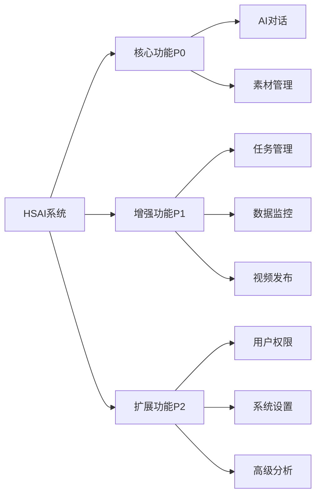

# 功能需求清单

**版本**: v2.1.0  
**更新日期**: 2025-08-24  
**对应原型**: prototypes/ 目录下的HTML文件  
**审核状态**: 待审核  

## 版本修订记录

| 版本 | 日期 | 修改内容 | 修改人 |
|------|------|----------|--------|
| v2.1.0 | 2025-08-24 | 统一版本号格式为三段版本号，添加版本修订记录 | 系统整理 |
| v2.1 | 2025-08-22 | 完善功能验收标准，增加技术实现要求 | 产品经理 |
| v2.0 | 2025-08-20 | 新增智能卡片系统和连线交互功能 | 产品经理 |
| v1.0 | 2025-08-18 | 初始版本，定义基础功能需求清单 | 产品经理 |  

## 1. 功能模块总览

### 1.1 模块优先级分类

| 优先级 | 模块 | 原型文件 | 开发阶段 |
|--------|------|----------|----------|
| P0 | 对话工作台 | chat.html | MVP |
| P0 | 素材管理 | material-management.html | MVP |
| P1 | 工作台 | dashboard.html | v1.0 |
| P1 | 矩阵管理 | matrix-management.html | v1.0 |
| P2 | 用户管理 | login.html | v1.0 |

### 1.2 功能覆盖矩阵

## 2. 详细功能清单

### 2.1 对话工作台 (chat.html) - P0

#### FR-CHAT-001: 消息发送与接收
**功能描述**: 用户可以发送文本消息给AI，AI能够智能回复  
**优先级**: P0  
**复杂度**: 中  

**详细需求**:
- ✅ 支持文本输入和发送
- ✅ 回车键快捷发送
- ✅ 发送后清空输入框
- ✅ 消息按时间顺序显示
- ✅ 用户消息和AI消息样式区分

**验收标准**:
- 输入文本后点击发送或按回车键能成功发送
- 发送后输入框自动清空
- 消息在左侧对话区域正确显示
- 用户消息右对齐蓝色气泡，AI消息左对齐白色气泡

**技术要求**:
- 支持多行文本输入
- 自动高度调整（最大120px）
- 输入框聚焦时显示蓝色边框

---

#### FR-CHAT-002: 语音输入功能
**功能描述**: 支持语音输入转文字，提升输入效率  
**优先级**: P1  
**复杂度**: 高  

**详细需求**:
- ✅ 基于Web Speech API实现
- ✅ 支持中英文语音识别
- ✅ 不支持语音的浏览器自动隐藏按钮
- ✅ 语音转文字准确率>90%
- ✅ 支持语音输入状态指示

**验收标准**:
- 点击语音按钮开始录音
- 录音过程中显示动态波形
- 语音停止后自动转为文字填入输入框
- 转换准确率达到预期要求

---

#### FR-CHAT-003: AI思考状态指示
**功能描述**: AI处理用户消息时显示思考状态  
**优先级**: P0  
**复杂度**: 低  

**详细需求**:
- ✅ 发送消息后立即显示"思考中"占位
- ✅ 占位气泡显示动画效果
- ✅ AI回复生成后替换占位气泡
- ✅ 思考时间超过10秒显示详细状态

**验收标准**:
- 用户发送消息后立即出现思考指示
- 动画效果流畅自然
- AI回复后思考指示消失
- 长时间思考有进度提示

---

#### FR-CHAT-004: 智能卡片生成
**功能描述**: 根据对话内容自动生成相应的功能卡片  
**优先级**: P0  
**复杂度**: 高  

**卡片类型**:

| 卡片类型 | 触发条件 | 展示内容 | 操作功能 |
|----------|----------|----------|----------|
| 视频预览卡片 | 视频制作完成 | 封面、标题、时长、预览按钮 | 播放预览、下载、重新编辑 |
| 战略地图卡片 | 战略分析讨论 | 目标、阶段、关键要点列表 | 展开详情、导出文档 |
| 协作提醒卡片 | 需要用户协作 | 待办清单、三个操作按钮 | 上传素材、授权账号、创建子任务 |
| 数据简报卡片 | 数据查询请求 | 关键指标、图表、趋势 | 查看详情、导出报告 |
| 任务进度卡片 | 任务状态更新 | 进度条、当前状态、建议 | 查看详情、更新状态 |

**验收标准**:
- AI回复后能自动生成对应类型卡片
- 卡片内容与对话内容相关
- 卡片操作功能正常
- 卡片样式符合设计规范

---

#### FR-CHAT-005: 连线与关联系统
**功能描述**: 显示消息与卡片之间的视觉关联关系  
**优先级**: P1  
**复杂度**: 高  

**详细需求**:
- ✅ 消息与卡片间显示渐变连线
- ✅ 连线两端显示圆形锚点
- ✅ 连线随页面滚动动态更新
- ✅ 选中状态下连线加粗高亮
- ✅ 窗口大小变化时连线重新计算

**技术实现**:
- 使用全屏SVG覆盖层绘制连线
- 连线颜色：渐变#6A5AE0 → #3B82F6
- 默认线宽2.5px，选中时3.5px
- 锚点半径默认4px，选中时6px

**验收标准**:
- 新生成的消息和卡片自动建立连线
- 连线位置准确，视觉效果美观
- 滚动时连线位置实时更新
- 点击联动时连线高亮效果明显

---

#### FR-CHAT-006: 点击联动与自动滚动
**功能描述**: 点击消息或卡片时互相定位高亮  
**优先级**: P1  
**复杂度**: 中  

**详细需求**:
- ✅ 点击左侧消息时右侧卡片高亮并滚动定位
- ✅ 点击右侧卡片时左侧消息高亮并滚动定位
- ✅ 新消息生成时双侧自动滚动到最新
- ✅ 滚动动画平滑自然
- ✅ 高亮状态明显区分

**验收标准**:
- 点击联动响应及时准确
- 滚动定位精确到目标元素居中
- 高亮效果符合设计规范
- 自动滚动不影响用户操作

---

#### FR-CHAT-007: 弹窗协作流程
**功能描述**: 关键操作通过弹窗完成，保持页面上下文  
**优先级**: P0  
**复杂度**: 中  

**弹窗类型**:
- 素材上传弹窗：支持拖拽上传，显示进度
- 账号授权弹窗：第三方平台OAuth授权
- 子任务创建弹窗：任务信息录入和分配

**验收标准**:
- 弹窗操作完成后状态在原页面可见
- 弹窗关闭后数据已更新
- 弹窗内操作流程顺畅
- 错误处理友好

### 2.2 素材管理 (material-management.html) - P0

#### FR-MAT-001: 目录树结构管理
**功能描述**: 多级目录结构管理，支持文件夹的创建、重命名、删除  
**优先级**: P0  
**复杂度**: 中  

**详细需求**:
- ✅ 支持无限级目录结构
- ✅ 目录行尾显示"+"按钮
- ✅ 点击"+"按钮在当前目录下新建子目录
- ✅ 支持目录重命名（双击或右键菜单）
- ✅ 支持目录删除（需确认，检查是否包含文件）
- ✅ 目录展开/折叠状态保持

**验收标准**:
- 目录结构显示清晰
- 新建目录操作简便
- 目录操作反馈及时
- 删除操作有安全确认

---

#### FR-MAT-002: 统一搜索与过滤
**功能描述**: 统一搜索框支持目录和文件的快速检索  
**优先级**: P1  
**复杂度**: 中  

**详细需求**:
- ✅ 搜索框位于页面顶部
- ✅ 支持文件名关键词搜索
- ✅ 支持文件类型筛选
- ✅ 搜索结果实时更新
- ✅ 搜索结果高亮显示关键词
- ✅ 支持清除搜索条件

**验收标准**:
- 搜索响应快速（<500ms）
- 搜索结果准确
- 高亮效果明显
- 筛选功能正常

---

#### FR-MAT-003: 右侧内容展示
**功能描述**: 右侧以卡片形式展示文件夹和文件，优先显示文件夹  
**优先级**: P0  
**复杂度**: 中  

**展示规则**:
- 优先显示子文件夹卡片（图标、名称、包含文件数量）
- 然后显示文件卡片（缩略图、文件名、文件大小、修改时间）
- 文件夹卡片可点击进入下级目录
- 文件卡片支持预览和下载

**验收标准**:
- 卡片排列顺序正确
- 文件夹卡片信息准确
- 文件缩略图正常显示
- 点击操作响应正确

---

#### FR-MAT-004: 文件上传功能
**功能描述**: 支持多种方式的文件上传，显示上传进度  
**优先级**: P0  
**复杂度**: 中  

**详细需求**:
- ✅ 点击上传按钮选择文件
- ✅ 支持拖拽文件到指定区域上传
- ✅ 支持多文件批量上传
- ✅ 实时显示上传进度
- ✅ 上传完成后自动刷新文件列表
- ✅ 支持上传暂停和取消
- ✅ 文件格式和大小限制提示

**技术要求**:
- 支持常见视频格式：MP4、AVI、MOV、WMV
- 支持常见图片格式：JPG、PNG、GIF、SVG
- 支持音频格式：MP3、WAV、AAC
- 单文件大小限制：100MB
- 批量上传数量限制：20个文件

**验收标准**:
- 上传流程顺畅
- 进度显示准确
- 错误处理友好
- 完成后状态更新及时

---

#### FR-MAT-005: 文件操作功能
**功能描述**: 支持文件的基本操作：预览、下载、移动、删除  
**优先级**: P1  
**复杂度**: 中  

**详细需求**:
- ✅ 图片文件支持预览
- ✅ 视频文件支持在线播放
- ✅ 文件下载功能
- ✅ 文件移动到其他目录
- ✅ 文件删除（需确认）
- ✅ 文件重命名
- ✅ 批量操作（多选后批量删除/移动）

**验收标准**:
- 预览功能正常
- 下载速度合理
- 移动操作准确
- 删除有安全确认

### 2.3 工作台 (dashboard.html) - P1

#### FR-DASH-001: KPI指标展示
**功能描述**: 页面顶部显示关键业务指标，用色块区分涨跌  
**优先级**: P1  
**复杂度**: 低  

**详细需求**:
- ✅ 顶部栏右侧显示KPI芯片
- ✅ 包含指标名称和数值
- ✅ 涨跌用不同颜色芯片表示
- ✅ 支持点击查看详细数据
- ✅ 数据定时自动刷新（15分钟）

**KPI指标**:
- 活跃项目数（activeProjects）
- 待处理任务数（pendingTasks）
- 完成率（completionRate）
- 风险等级（riskLevel）

**颜色规范**:
- 上升：绿色 #10B981
- 下降：红色 #EF4444  
- 持平：灰色 #64748B

**验收标准**:
- 指标数据准确
- 颜色区分明显
- 刷新机制正常
- 点击交互有效

---

#### FR-DASH-002: 任务管理面板
**功能描述**: 显示和管理主任务、子任务，支持进度跟踪  
**优先级**: P1  
**复杂度**: 中  

**详细需求**:
- ✅ 任务列表显示（主任务和子任务层级关系）
- ✅ 任务状态可视化（待处理、进行中、已完成、已取消）
- ✅ 任务优先级标识（高、中、低、紧急）
- ✅ 任务进度条显示
- ✅ 支持任务状态更新
- ✅ 支持创建新任务
- ✅ 任务分配和责任人显示

**验收标准**:
- 任务层级关系清晰
- 状态更新及时
- 进度显示准确
- 操作响应正常

---

#### FR-DASH-003: 时间轴视图
**功能描述**: 以时间轴形式展示项目进度和关键节点  
**优先级**: P2  
**复杂度**: 高  

**详细需求**:
- ✅ 横向时间轴布局
- ✅ 关键里程碑标记
- ✅ 任务时间段可视化
- ✅ 支持缩放和滚动
- ✅ 当前时间线指示
- ✅ 延期任务警示标识

**验收标准**:
- 时间轴布局合理
- 里程碑标记清晰
- 交互操作流畅
- 信息展示完整

---

#### FR-DASH-004: 自适应布局
**功能描述**: 页面布局自适应，无大块空白，面板内部滚动  
**优先级**: P0  
**复杂度**: 中  

**详细需求**:
- ✅ 网格系统自动填充
- ✅ 面板高度自适应
- ✅ 内容区域滚动，页面不滚动
- ✅ 不同分辨率下布局优化
- ✅ 面板最小宽度限制

**验收标准**:
- 页面无大块空白
- 面板布局合理
- 滚动体验良好
- 不同屏幕适配正常

### 2.4 矩阵管理 (matrix-management.html) - P1

#### FR-MATRIX-001: 社媒账号管理
**功能描述**: 管理多个社媒平台的账号授权和状态  
**优先级**: P1  
**复杂度**: 高  

**支持平台**:
- 抖音（Douyin）
- 快手（Kuaishou）
- 小红书（XiaoHongShu）
- YouTube
- TikTok

**详细需求**:
- ✅ 账号列表显示（平台、账号名、状态）
- ✅ 授权状态实时监控
- ✅ 授权过期提醒
- ✅ 支持重新授权
- ✅ 账号信息编辑
- ✅ 批量操作支持

**验收标准**:
- 授权流程顺畅
- 状态显示准确
- 过期提醒及时
- 重新授权有效

---

#### FR-MATRIX-002: 授权流程管理
**功能描述**: 引导用户完成各平台的OAuth授权流程  
**优先级**: P1  
**复杂度**: 高  

**详细需求**:
- ✅ 授权引导弹窗
- ✅ 平台授权页面跳转
- ✅ 授权回调处理
- ✅ 授权成功/失败反馈
- ✅ 授权信息安全存储
- ✅ 授权状态定期检查

**验收标准**:
- 授权引导清晰
- 跳转流程正常
- 回调处理正确
- 状态反馈及时

---

#### FR-MATRIX-003: 发布状态监控
**功能描述**: 监控各平台的发布状态和数据反馈  
**优先级**: P2  
**复杂度**: 中  

**详细需求**:
- ✅ 发布任务状态显示
- ✅ 发布成功/失败统计
- ✅ 平台数据回传（播放量、点赞等）
- ✅ 发布历史记录
- ✅ 异常情况告警

**验收标准**:
- 状态监控准确
- 数据回传及时
- 历史记录完整
- 异常告警有效

### 2.5 用户管理 (login.html) - P2

#### FR-LOGIN-001: 用户登录
**功能描述**: 支持用户名密码登录，包含记住登录状态  
**优先级**: P2  
**复杂度**: 低  

**详细需求**:
- ✅ 用户名/邮箱登录
- ✅ 密码输入和验证
- ✅ 记住登录状态选项
- ✅ 登录失败错误提示
- ✅ 密码强度要求
- ✅ 登录日志记录

**验收标准**:
- 登录流程顺畅
- 错误提示友好
- 状态保持有效
- 安全机制完善

---

#### FR-LOGIN-002: 密码重置
**功能描述**: 支持通过邮箱重置密码  
**优先级**: P2  
**复杂度**: 中  

**详细需求**:
- ✅ 邮箱验证码发送
- ✅ 验证码有效期限制
- ✅ 新密码设置
- ✅ 密码强度校验
- ✅ 重置成功通知

**验收标准**:
- 邮件发送成功
- 验证码校验正确
- 密码重置有效
- 流程安全可靠

## 3. 非功能性需求

### 3.1 性能需求

| 指标 | 要求 | 测试方法 |
|------|------|----------|
| 页面加载时间 | < 3秒 | 自动化性能测试 |
| 接口响应时间 | < 1秒 | API压力测试 |
| 文件上传速度 | > 1MB/s | 网络性能测试 |
| 并发用户数 | 100+ | 负载测试 |
| 内存使用 | < 200MB | 浏览器性能监控 |

### 3.2 兼容性需求

| 类别 | 要求 |
|------|------|
| 浏览器 | Chrome 90+, Firefox 88+, Safari 14+, Edge 90+ |
| 分辨率 | 1920×1080及以上，支持高DPI显示 |
| 操作系统 | Windows 10+, macOS 10.15+, Ubuntu 18.04+ |
| 网络 | 适应2Mbps以上网络环境 |

### 3.3 安全需求

| 项目 | 要求 |
|------|------|
| 数据传输 | 全站HTTPS加密 |
| 身份认证 | JWT Token + 刷新机制 |
| 权限控制 | 基于角色的访问控制（RBAC）|
| 数据存储 | 敏感数据加密存储 |
| 审计日志 | 完整的用户操作审计 |

### 3.4 可用性需求

| 项目 | 要求 |
|------|------|
| 系统可用性 | 99.9% |
| 故障恢复时间 | < 5分钟 |
| 数据备份 | 实时备份，24小时内可恢复 |
| 错误处理 | 友好的错误提示和恢复建议 |
| 操作反馈 | 所有操作1秒内给出反馈 |

## 4. 开发优先级规划

### 4.1 MVP阶段 (v0.9)
**时间**: 4周  
**目标**: 核心功能验证  

- ✅ 对话工作台基础功能
- ✅ 素材管理基础功能
- ✅ 简单卡片生成
- ✅ 基础UI框架

### 4.2 Alpha阶段 (v1.0)
**时间**: 6周  
**目标**: 完整功能实现  

- ✅ 完整对话功能（含连线和联动）
- ✅ 完整素材管理（含上传和搜索）
- ✅ 工作台基础功能
- ✅ 矩阵管理基础功能

### 4.3 Beta阶段 (v1.1)
**时间**: 4周  
**目标**: 功能完善和优化  

- ✅ 高级功能完善
- ✅ 性能优化
- ✅ 用户体验改进
- ✅ 测试和调试

### 4.4 Release阶段 (v1.2)
**时间**: 2周  
**目标**: 产品化和部署  

- ✅ 最终测试
- ✅ 文档完善
- ✅ 部署上线
- ✅ 用户培训

## 5. 质量标准

### 5.1 代码质量
- 代码覆盖率 > 80%
- 代码重复率 < 5%
- 代码复杂度控制
- 代码规范检查通过

### 5.2 功能质量
- 功能验收通过率 100%
- 用户验收测试通过率 > 95%
- 缺陷密度 < 1个/KLOC
- 性能指标达标率 100%

### 5.3 用户体验
- 用户满意度 > 4.5/5
- 任务完成率 > 90%
- 错误率 < 2%
- 学习时间 < 30分钟

---

**文档维护**: 产品团队  
**审核状态**: 待审核  
**相关文档**: 用户故事与用例分析, UI设计规范