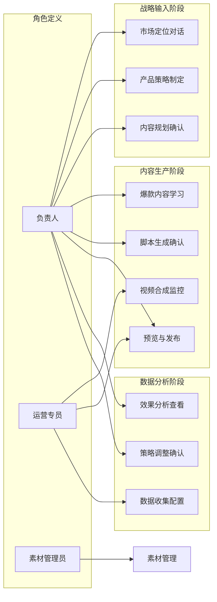

# 用户故事与用例分析

**版本**: v3.0.0  
**更新日期**: 2025-08-24  
**基于**: 业务流程与数据规范v2.1  
**审核状态**: 待审核  

## 版本修订记录

| 版本 | 日期 | 修改内容 | 修改人 |
|------|------|----------|--------|
| v3.0.0 | 2025-08-24 | 统一版本号格式为三段版本号，添加版本修订记录 | 系统整理 |
| v3.0 | 2025-08-22 | 重新设计用户故事架构，增加Epic级别规划 | 产品经理 |
| v2.0 | 2025-08-19 | 优化验收标准，增加技术验收细节 | 产品经理 |
| v1.0 | 2025-08-16 | 初始版本，定义基础用户故事与用例 | 产品经理 |  

### 1.1 业务流程驱动的Epic故事

基于核心业务架构的三阶段闭环，定义以下Epic级别用户故事：

| Epic ID     | Epic名称  | 业务阶段   | 描述                    | 优先级 |
| ----------- | ------- | ------ | --------------------- | --- |
| E-STRATEGY  | 战略输入与规划 | 战略输入阶段 | 企业通过AI对话完成市场定位和内容策略规划 | P0  |
| E-CONTENT   | 智能内容生产  | 内容生产阶段 | 爆款学习、脚本生成、视频合成的自动化流程  | P0  |
| E-PUBLISH   | 多平台发布管理 | 内容生产阶段 | 视频预览确认和多平台发布管理        | P1  |
| E-ANALYTICS | 数据分析优化  | 数据分析阶段 | 发布数据收集、效果分析和策略优化      | P1  |
| E-MATERIAL  | 素材资源管理  | 支撑服务   | 企业素材的统一管理和组织          | P0  |

### 1.2 用户角色与业务流程映射

## 2. 详细用户故事

### 2.1 战略输入与规划 (Epic: E-STRATEGY)

#### US-STRATEGY-01: 初始化战略输入

**作为** 负责人  
**我希望** 在首次登录时能够通过AI对话完成企业信息和战略输入  
**以便** 系统能够生成企业专属的知识库和内容策略  

**验收标准**:

- ✅ 首次登录自动播放产品介绍视频(30秒)
- ✅ AI按序询问市场定位、产品特点、竞争情况
- ✅ 系统自动生成企业知识库v1.0
- ✅ 展示战略地图卡片供确认
- ✅ 初始化完成后进入工作台

#### US-STRATEGY-02: 每日任务规划

**作为** 负责人  
**我希望** AI能够根据战略地图自动规划和分配每日的视频制作任务  
**以便** 确保内容制作符合整体营销策略  

**验收标准**:

- ✅ AI每日自动推送视频任务
- ✅ 任务内容与战略地图保持一致
- ✅ 支持任务优先级调整
- ✅ 任务分配记录可查询

### 2.2 智能内容生产 (Epic: E-CONTENT)

#### US-CONTENT-01: 爆款内容学习管理

**作为** 负责人  
**我希望** 能够管理系统抓取的爆款视频并确认需要学习的内容  
**以便** 控制学习质量和系统性能  

**验收标准**:

- ✅ 支持手动和定时爆款抓取触发
- ✅ 系统自动将爆款视频录入数据库
- ✅ AI推送爆款视频链接供确认
- ✅ 确认后的视频进入解析流程
- ✅ 生成的脚本存入测试脚本库

#### US-CONTENT-02: 视频任务对话与脚本选择

**作为** 负责人  
**我希望** 通过与智能体对话来完成视频任务并选择合适的脚本  
**以便** 确保制作的视频符合预期要求  

**验收标准**:

- ✅ AI根据任务要求推荐脚本
- ✅ 从爆款脚本库和测试脚本库按比例提取
- ✅ 支持脚本内容预览和比较
- ✅ 确认选用脚本后才可进入合成流程

#### US-CONTENT-03: 视频合成进度监控

**作为** 运营专员  
**我希望** 能够实时监控视频合成的进度状态  
**以便** 及时了解任务进展和处理可能的异常情况  

**验收标准**:

- ✅ 显示实时合成进度百分比
- ✅ 显示当前处理步骤说明
- ✅ 合成失败时提供错误信息和重试选项
- ✅ 合成完成后自动推送预览卡片

### 2.3 多平台发布管理 (Epic: E-PUBLISH)

#### US-PUBLISH-01: 视频预览与发布确认

**作为** 负责人  
**我希望** 能够预览生成的视频并选择发布平台  
**以便** 确保视频质量和发布到合适的社媒账号  

**验收标准**:

- ✅ 提供降级处理的预览文件快速加载
- ✅ 支持视频播放控制（暂停、快进、音量）
- ✅ 显示已授权的可用平台列表
- ✅ 支持选择特定社媒账号发布
- ✅ 实时显示发布状态和结果

#### US-PUBLISH-02: 平台授权管理

**作为** 负责人  
**我希望** 能够管理各社媒平台的授权状态  
**以便** 确保视频能够正常发布到目标平台  

**验收标准**:

- ✅ 检查平台授权有效性
- ✅ 授权失效时提供重新授权功能
- ✅ 支持OAuth授权流程
- ✅ 显示授权状态和到期时间
- ✅ 支持批量授权管理

#### US-PUBLISH-03: 发布状态追踪

**作为** 运营专员  
**我希望** 能够追踪视频在各平台的发布状态  
**以便** 及时处理发布失败的情况  

**验收标准**:

- ✅ 实时显示发布进度
- ✅ 记录发布成功/失败状态
- ✅ 提供发布链接和平台信息
- ✅ 发布失败时支持重试功能
- ✅ 发布记录可查询和导出

### 2.4 数据分析优化 (Epic: E-ANALYTICS)

#### US-ANALYTICS-01: 视频数据收集

**作为** 数据分析师  
**我希望** 系统能够自动收集视频在各平台的表现数据  
**以便** 分析视频效果和优化内容策略  

**验收标准**:

- ✅ 定时拉取各平台视频数据
- ✅ 收集播放量、点赞数、评论数、分享数
- ✅ 数据收集失败时自动重试
- ✅ 支持手动触发数据更新
- ✅ 数据准确性验证和清洗

#### US-ANALYTICS-02: 策略优化反馈

**作为** 负责人  
**我希望** 系统能够根据视频表现数据自动优化脚本策略  
**以便** 提高后续视频的制作效果  

**验收标准**:

- ✅ 根据视频表现计算脚本评分
- ✅ 动态调整脚本库中的权重排名
- ✅ 高表现脚本获得更高推荐优先级
- ✅ 低表现脚本降低推荐频率
- ✅ 优化效果可量化追踪

#### US-ANALYTICS-03: 数据报表分析

**作为** 负责人  
**我希望** 能够查看详细的视频表现分析报表  
**以便** 了解内容营销的整体效果和趋势  

**验收标准**:

- ✅ 提供多维度数据分析视图
- ✅ 支持时间范围筛选
- ✅ 展示关键指标趋势图表
- ✅ 支持平台间数据对比
- ✅ 报表支持导出功能

### 2.5 素材资源管理 (Epic: E-MATERIAL)

#### US-MATERIAL-01: 素材分类管理

**作为** 素材管理员  
**我希望** 能够创建清晰的素材分类目录结构  
**以便** 高效组织和管理企业素材资源  

**验收标准**:

- ✅ 支持多级目录结构创建
- ✅ 目录支持重命名和移动
- ✅ 支持目录权限控制
- ✅ 提供目录容量统计
- ✅ 支持目录批量操作

#### US-MATERIAL-02: 素材上传与标签

**作为** 素材管理员  
**我希望** 能够批量上传素材并添加标签  
**以便** 快速定位和使用相关素材  

**验收标准**:

- ✅ 支持拖拽批量上传
- ✅ 自动生成缩略图和预览
- ✅ 支持自定义标签添加
- ✅ 提供文件格式和大小检查
- ✅ 上传进度实时显示

#### US-MATERIAL-03: 素材搜索与使用

**作为** 运营专员  
**我希望** 能够快速搜索和使用相关素材  
**以便** 高效完成视频制作任务  

**验收标准**:

- ✅ 支持关键词和标签搜索
- ✅ 提供素材预览功能
- ✅ 支持素材收藏和历史记录
- ✅ 显示素材使用次数和效果
- ✅ 支持素材批量选择

### 3.1 典型业务用例

#### 用例1: 制作新产品介绍视频

**参与者**: 运营专员
**前置条件**: 用户已登录系统，素材库中有相关素材
**主要流程**:

1. 运营专员进入对话工作台
2. 输入"我要制作一个新产品介绍视频"
3. AI询问产品详情和制作要求
4. 运营专员提供产品信息
5. AI生成视频脚本卡片
6. 运营专员确认脚本
7. AI生成协作提醒卡片，提示上传产品素材
8. 运营专员上传相关素材
9. AI启动视频合成流程
10. 显示任务进度卡片
11. 合成完成后显示视频预览卡片
12. 运营专员预览确认后发布

**成功后置条件**: 视频成功制作并发布
**异常处理**: 

- 素材上传失败：重新上传或使用其他素材
- 合成失败：检查素材格式，重新合成
- 发布失败：检查平台授权，重新发布

#### 用例2: 批量管理素材

**参与者**: 素材管理员
**前置条件**: 用户已登录系统
**主要流程**:

1. 素材管理员进入素材管理页面
2. 创建产品分类目录结构
3. 批量上传产品相关素材
4. 为素材添加标签和描述
5. 设置素材访问权限
6. 创建素材使用规则

**成功后置条件**: 素材库结构清晰，素材管理规范

### 3.2 边界用例

#### 边界用例1: 网络异常处理

- **场景**: 用户在使用过程中网络中断
- **处理方式**: 
  - 自动保存用户操作状态
  - 网络恢复后自动重连
  - 提示用户网络状态

#### 边界用例2: 大文件上传

- **场景**: 用户上传超大视频文件
- **处理方式**:
  - 分片上传机制
  - 断点续传功能
  - 上传进度实时显示

#### 边界用例3: 并发操作冲突

- **场景**: 多用户同时编辑同一资源
- **处理方式**:
  - 乐观锁机制
  - 操作冲突提醒
  - 版本控制功能

## 4. 非功能性需求

### 4.1 性能需求

- **响应时间**: 页面加载 < 3秒，操作响应 < 1秒
- **并发用户**: 支持100+并发用户
- **文件上传**: 支持100MB以内文件，上传速度优化

### 4.2 可用性需求

- **系统可用性**: 99.9%
- **错误恢复**: 自动重试机制
- **数据备份**: 实时备份，支持快速恢复

### 4.3 安全需求

- **身份认证**: 多因子认证
- **访问控制**: 基于角色的权限管理
- **数据加密**: 全链路加密传输

### 4.4 兼容性需求

- **浏览器**: Chrome 90+, Firefox 88+, Safari 14+, Edge 90+
- **设备**: 桌面优先，支持1920x1080+分辨率
- **网络**: 适应不同网络环境

## 5. 验收测试场景

### 5.1 功能验收场景

| 场景ID | 场景描述     | 输入     | 预期输出    | 优先级 |
| ---- | -------- | ------ | ------- | --- |
| T-01 | 新用户首次使用  | 注册并登录  | 引导流程完整  | P0  |
| T-02 | AI对话制作视频 | 文本指令   | 生成对应卡片  | P0  |
| T-03 | 素材上传管理   | 拖拽文件   | 上传成功并分类 | P0  |
| T-04 | 多平台发布    | 选择平台发布 | 发布状态正常  | P1  |
| T-05 | 数据分析查看   | 查看报表   | 数据准确展示  | P1  |

### 5.2 性能验收场景

| 指标     | 期望值     | 测试方法    |
| ------ | ------- | ------- |
| 页面加载时间 | < 3秒    | 自动化性能测试 |
| 接口响应时间 | < 1秒    | API压力测试 |
| 文件上传速度 | > 1MB/s | 网络性能测试  |
| 并发用户数  | 100+    | 负载测试    |

## 6. 风险与假设

### 6.1 关键假设

- 用户具备基本的计算机操作能力
- 网络环境稳定，带宽充足
- 第三方平台API稳定可用
- AI模型能够准确理解用户意图

### 6.2 主要风险

- **技术风险**: AI模型不稳定，影响用户体验
- **业务风险**: 竞品快速跟进，市场竞争激烈
- **合规风险**: 平台政策变化，影响功能实现

### 6.3 缓解措施

- 建立多模型备用机制
- 持续技术创新保持竞争优势
- 密切关注行业政策变化

## 7. 成功指标与数据度量

### 7.1 业务成功指标

| 指标类别 | 具体指标   | 目标值       | 计算方式         |
| ---- | ------ | --------- | ------------ |
| 效率指标 | 视频制作时间 | < 30分钟    | 从任务开始到视频生成完成 |
| 质量指标 | 用户满意度  | > 4.5/5.0 | 用户反馈评分平均值    |
| 成长指标 | 月活跃用户  | 环比增长20%   | 每月登录使用的独立用户数 |
| 技术指标 | 系统可用性  | > 99.9%   | 服务正常运行时间占比   |

### 7.2 核心KPI定义

#### 战略输入阶段KPI

- **初始化完成率**: 新用户完成战略输入的比例
- **知识库生成成功率**: 企业知识库成功生成的比例
- **战略确认时长**: 从开始引导到确认战略的平均时间

#### 内容生产阶段KPI

- **视频合成成功率**: 视频合成任务的成功率
- **脚本使用分布**: 爆款脚本vs测试脚本的使用比例
- **用户操作步骤数**: 完成视频制作的平均操作步

#### 数据分析阶段KPI

- **数据收集覆盖率**: 成功收集数据的发布视频比例
- **策略优化效果**: 优化后视频表现的改善程度
- **反馈周期**: 从发布到策略调整的时间周期

### 7.3 用户体验指标

| 体验维度 | 指标名称    | 期望值     | 测量方法           |
| ---- | ------- | ------- | -------------- |
| 易用性  | 新手完成率   | > 90%   | 新用户完成首个视频制作的比例 |
| 效率性  | 任务完成时间  | < 预期50% | 与传统方式对比的时间节省   |
| 满意度  | NPS净推荐值 | > 50    | 用户推荐意愿调研       |
| 错误率  | 操作错误率   | < 5%    | 用户操作失败的频率      |

### 7.4 技术性能指标

#### 系统响应时间

- **页面加载**: < 3秒
- **API响应**: < 1秒
- **文件上传**: > 1MB/s
- **视频合成**: < 10分钟(5分钟视频)

#### 系统稳定性

- **服务可用性**: 99.9%
- **错误率**: < 0.1%
- **并发处理**: 支持100+用户
- **数据准确性**: 99.99%

---

**文档维护**: 产品团队  
**审核状态**: 待审核  
**相关文档**: 产品需求规格说明书, 功能需求清单, 业务流程与数据规范