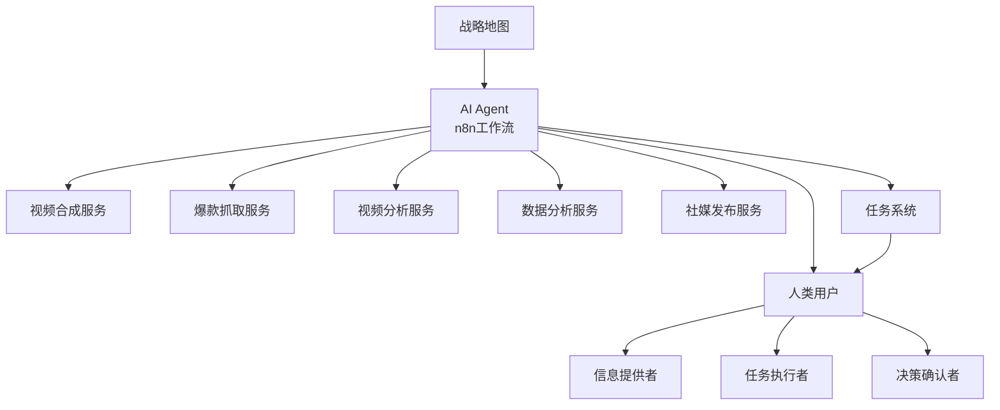
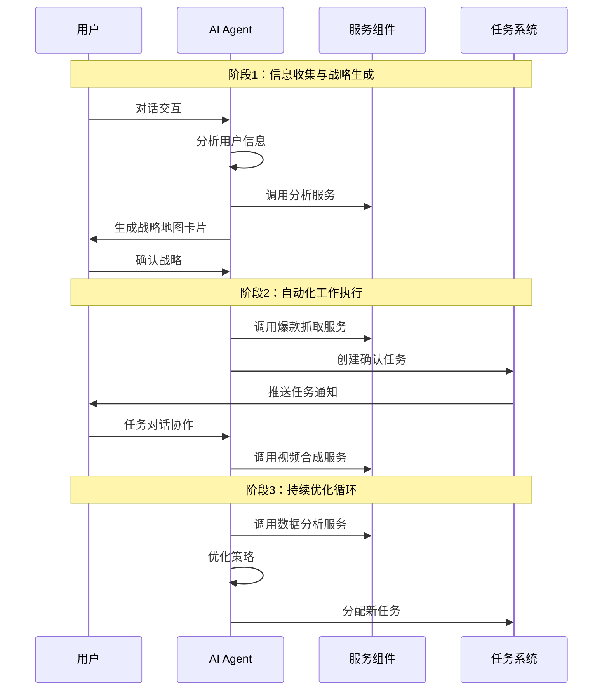
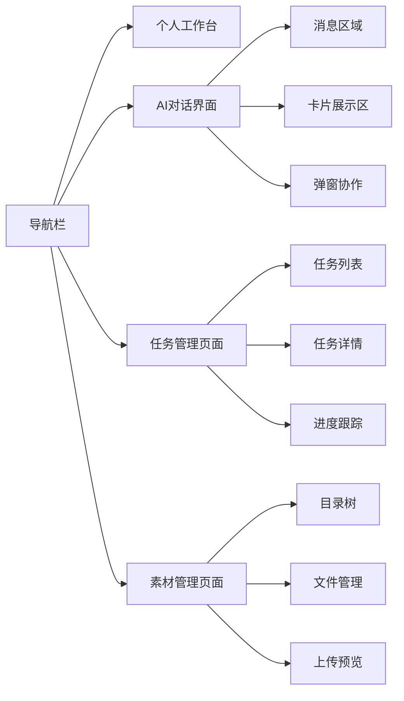
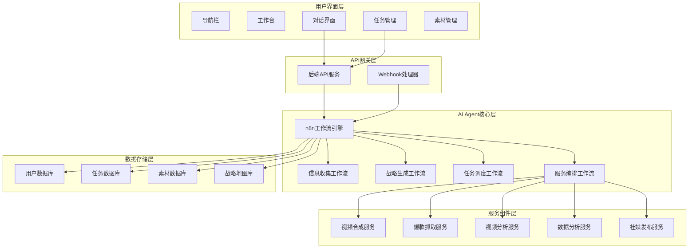
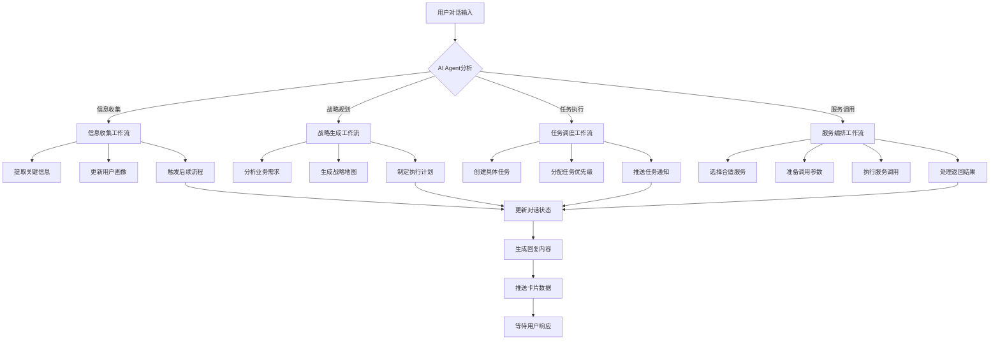
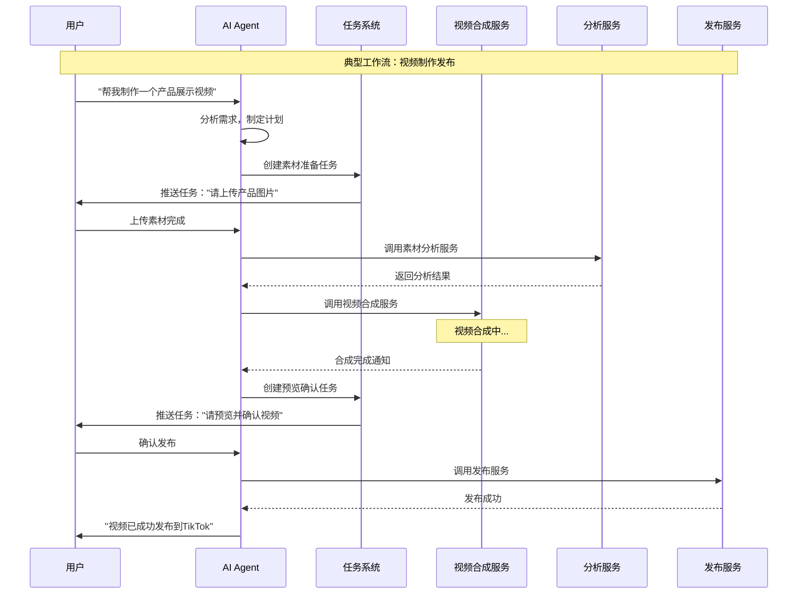
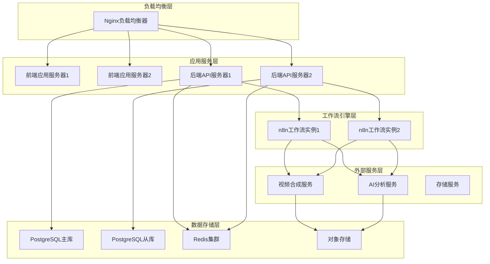

# 华商AI简化版本需求设计

**版本**: v1.0.0  
**创建日期**: 2025-08-30  
**设计理念**: AI Agent协调调度的智能工作系统  
**核心架构**: 对话驱动 + 任务协作 + 服务编排  

## 1. 系统设计核心

### 1.1 核心设计理念

华商AI系统的核心是一个**智能协调调度系统**，其中AI Agent（基于n8n工作流实现）作为中央协调者，负责：

- **信息收集与分析**：通过对话收集用户信息，生成个性化战略地图
- **资源调度**：协调各种服务组件（视频合成、爆款抓取、数据分析等）
- **任务分配**：将复杂工作分解为具体任务，分配给人类用户
- **流程编排**：根据战略地图自动化执行日常工作流程

### 1.2 系统参与者角色



**角色定义**：

- **AI Agent**：中央协调者，负责整体流程编排和资源调度
- **人类用户**：作为工作链的重要一环，负责信息确认、素材补充、决策支持
- **服务组件**：各种专业服务，由AI Agent根据需要调用
- **任务系统**：AI Agent与人类用户的协作接口

### 1.3 工作流程核心逻辑



## 2. 简化版本页面功能设计

### 2.1 页面架构总览



### 2.2 详细页面功能

#### 2.2.1 导航栏（原型1）

**功能定位**：系统入口和状态监控

**核心功能**：

- 系统Logo和品牌标识
- 主要功能模块导航
- 实时KPI指标显示（活跃任务数、完成率等）
- 用户信息和系统状态

**AI Agent交互**：

- 接收AI Agent推送的系统状态更新
- 显示当前AI Agent工作状态（空闲/工作中/分析中）

#### 2.2.2 个人工作台（原型2）

**功能定位**：工作概览和快速操作中心

**核心功能**：

- 当日任务概览和进度展示
- 关键数据指标可视化
- 快速操作入口（开始对话、查看任务、上传素材）
- 最近活动和通知中心

**AI Agent交互**：

- 展示AI Agent生成的工作计划
- 显示AI Agent推荐的优先任务
- 接收AI Agent的工作建议和提醒

#### 2.2.3 AI对话界面（原型4）

**功能定位**：人机协作的核心界面

**核心功能**：

- **对话区域**：
  
  - 用户消息输入和发送
  - AI Agent回复展示
  - 支持文本、语音、文件输入
  - 对话历史记录

- **智能卡片系统**：
  
  - 战略地图卡片：显示AI Agent生成的策略分析
  - 任务进度卡片：实时任务状态和进度
  - 视频预览卡片：合成完成的视频预览
  - 数据分析卡片：关键指标和趋势分析
  - 协作提醒卡片：需要用户参与的工作项

- **弹窗协作流程**：
  
  - 素材上传弹窗：AI Agent请求素材时触发
  - 任务确认弹窗：重要决策确认
  - 账号授权弹窗：社媒平台授权管理

**AI Agent交互核心**：

```javascript
// 对话流程示例
{
  "信息收集阶段": {
    "AI": "请告诉我您的产品类型和目标市场",
    "用户": "我们做LED灯具，主要面向欧美市场",
    "AI": "基于您的信息，我建议制作3类视频内容...",
    "卡片": "战略地图卡片生成"
  },
  "任务执行阶段": {
    "AI": "我已经为您抓取了5个爆款视频，请确认学习",
    "任务": "爆款视频确认任务推送",
    "用户": "确认学习前3个",
    "AI": "开始分析视频结构，预计10分钟完成"
  }
}
```

#### 2.2.4 任务指派弹窗（原型3）

**功能定位**：AI Agent向用户分配任务的界面

**核心功能**：

- 任务详情展示（标题、描述、优先级、截止时间）
- 任务类型标识（素材补充、内容确认、决策支持等）
- 快速操作按钮（接受、延期、需要帮助）
- 任务相关资源链接

**AI Agent调用场景**：

- 需要用户确认爆款视频学习
- 需要用户补充素材
- 需要用户确认视频发布
- 需要用户提供额外信息

#### 2.2.5 任务管理页面（原型6）

**功能定位**：任务全生命周期管理

**核心功能**：

- 任务列表展示（待处理、进行中、已完成）
- 任务筛选和搜索
- 任务详情查看和编辑
- 任务进度跟踪
- 批量操作功能

**AI Agent协作**：

- 接收AI Agent创建的新任务
- 向AI Agent反馈任务完成状态
- 展示AI Agent的任务建议和优化

#### 2.2.6 素材管理页面（原型7-9）

**功能定位**：企业素材资源统一管理

**核心功能**：

- **目录管理**：树形结构，支持多级分类
- **文件上传**：拖拽上传，批量处理，进度显示
- **素材预览**：图片预览、视频播放、文件信息
- **智能分类**：AI Agent辅助的自动分类建议
- **快速检索**：关键词搜索、标签筛选

**AI Agent集成**：

- AI Agent根据战略地图建议素材分类
- AI Agent分析素材质量和适用场景
- AI Agent在需要时请求特定类型素材

## 3. 核心系统调度架构

### 3.1 整体系统架构图



### 3.2 AI Agent工作流调度逻辑



### 3.3 服务编排调度机制



## 4. 接口设计规范

### 4.1 前端与后端API接口

#### 4.1.1 对话系统接口

```javascript
// 发送消息
POST /api/chat/send
{
  "user_id": "user123",
  "message": "我想制作一个产品视频",
  "message_type": "text", // text, voice, file
  "session_id": "session456",
  "context": {
    "current_page": "chat",
    "previous_action": "upload_material"
  }
}

// 响应格式
{
  "success": true,
  "data": {
    "message_id": "msg789",
    "ai_response": "我来帮您制作产品视频...",
    "cards": [
      {
        "type": "strategy_map",
        "title": "视频制作策略",
        "data": {...},
        "actions": ["view_detail", "confirm", "modify"]
      }
    ],
    "tasks": [
      {
        "task_id": "task123",
        "title": "上传产品素材",
        "priority": "high",
        "due_date": "2025-08-31"
      }
    ]
  }
}

// 获取对话历史
GET /api/chat/history?session_id=session456&limit=50

// 卡片操作
POST /api/chat/card-action
{
  "card_id": "card123",
  "action": "confirm",
  "data": {...}
}
```

#### 4.1.2 任务管理接口

```javascript
// 获取任务列表
GET /api/tasks?status=pending&user_id=user123&page=1&limit=20

// 任务详情
GET /api/tasks/:task_id

// 更新任务状态
PUT /api/tasks/:task_id/status
{
  "status": "completed", // pending, in_progress, completed, cancelled
  "result": {...},
  "notes": "任务完成备注"
}

// 任务对话
POST /api/tasks/:task_id/chat
{
  "message": "我需要更多时间完成这个任务",
  "attachments": [...]
}
```

#### 4.1.3 素材管理接口

```javascript
// 上传素材
POST /api/materials/upload
FormData: {
  file: File,
  folder_path: "/products/led-lights",
  tags: ["product", "demo"],
  description: "LED灯产品展示"
}

// 获取素材列表
GET /api/materials?folder=/products&type=image&page=1

// 素材预览
GET /api/materials/:material_id/preview

// 创建文件夹
POST /api/materials/folders
{
  "name": "新产品系列",
  "parent_path": "/products",
  "description": "2025年新产品素材"
}
```

### 4.2 AI Agent（n8n）工作流接口

#### 4.2.1 工作流触发接口

```javascript
// 对话消息处理工作流
POST /webhook/n8n/chat-process
{
  "user_id": "user123",
  "message": "用户消息内容",
  "context": {...},
  "user_profile": {...}
}

// 任务完成通知工作流
POST /webhook/n8n/task-completed
{
  "task_id": "task123",
  "user_id": "user123",
  "result": {...},
  "completion_time": "2025-08-30T15:30:00Z"
}

// 素材上传通知工作流
POST /webhook/n8n/material-uploaded
{
  "material_id": "mat123",
  "user_id": "user123",
  "file_info": {...},
  "auto_analysis": true
}
```

#### 4.2.2 工作流回调接口

```javascript
// AI回复回调
POST /api/webhooks/n8n/chat-response
{
  "session_id": "session456",
  "message_id": "msg789",
  "response": {
    "text": "AI回复内容",
    "cards": [...],
    "tasks": [...],
    "next_action": "wait_user_input"
  }
}

// 任务创建回调
POST /api/webhooks/n8n/task-created
{
  "task_id": "task123",
  "user_id": "user123",
  "task_data": {...},
  "notification": {
    "type": "push",
    "message": "您有新的任务需要处理"
  }
}

// 服务调用结果回调
POST /api/webhooks/n8n/service-result
{
  "service_name": "video_synthesis",
  "request_id": "req123",
  "status": "completed",
  "result": {...},
  "next_steps": [...]
}
```

### 4.3 外部服务集成接口

#### 4.3.1 视频合成服务

```javascript
// 创建视频合成任务
POST /api/services/video/create
{
  "template_id": "product_showcase",
  "materials": [
    {
      "type": "image",
      "url": "https://...",
      "duration": 3,
      "position": "center"
    }
  ],
  "audio": {
    "background_music": "upbeat_1",
    "voiceover": "请介绍我们的LED产品..."
  },
  "settings": {
    "resolution": "1080p",
    "format": "mp4",
    "duration": 30
  }
}

// 查询合成状态
GET /api/services/video/status/:task_id

// 获取合成结果
GET /api/services/video/result/:task_id
```

#### 4.3.2 爆款抓取服务

```javascript
// 启动爆款抓取
POST /api/services/viral/fetch
{
  "platform": "tiktok",
  "keywords": ["LED lights", "home lighting"],
  "region": "US",
  "count": 10,
  "filters": {
    "min_views": 100000,
    "max_duration": 60
  }
}

// 获取抓取结果
GET /api/services/viral/results/:batch_id

// 确认学习爆款
POST /api/services/viral/learn
{
  "video_id": "viral123",
  "learn_aspects": ["structure", "script", "visual_style"],
  "priority": "high"
}
```

## 5. 数据模型设计

### 5.1 核心数据实体

#### 5.1.1 用户与战略

```javascript
// 用户信息
{
  "user_id": "user123",
  "profile": {
    "company_name": "LED科技有限公司",
    "industry": "LED照明",
    "target_markets": ["US", "EU", "CA"],
    "products": [...],
    "current_stage": "growth" // startup, growth, mature
  },
  "strategy_map": {
    "map_id": "strategy456",
    "version": "v2.1",
    "objectives": [...],
    "tactics": [...],
    "kpis": [...],
    "created_at": "2025-08-30T10:00:00Z",
    "updated_at": "2025-08-30T14:30:00Z"
  }
}

// 战略地图详细结构
{
  "strategy_map": {
    "content_strategy": {
      "video_types": ["product_demo", "installation_guide", "comparison"],
      "posting_frequency": "daily",
      "target_platforms": ["tiktok", "youtube_shorts"],
      "content_pillars": ["education", "entertainment", "promotion"]
    },
    "resource_requirements": {
      "materials_needed": ["product_photos", "installation_videos"],
      "team_roles": ["content_creator", "reviewer"],
      "tools_required": ["video_editor", "analytics_tool"]
    },
    "success_metrics": {
      "views_target": 10000,
      "engagement_rate": 0.05,
      "conversion_rate": 0.02
    }
  }
}
```

#### 5.1.2 任务与工作流

```javascript
// 任务实体
{
  "task_id": "task123",
  "type": "material_upload", // material_upload, content_review, decision_confirm
  "title": "上传LED产品展示图片",
  "description": "请上传5-10张高质量的LED产品图片...",
  "priority": "high", // low, medium, high, urgent
  "status": "pending", // pending, in_progress, completed, cancelled
  "assigned_to": "user123",
  "created_by": "ai_agent",
  "created_at": "2025-08-30T14:00:00Z",
  "due_date": "2025-08-31T18:00:00Z",
  "context": {
    "related_strategy": "strategy456",
    "workflow_id": "wf789",
    "parent_task": null,
    "dependencies": []
  },
  "requirements": {
    "file_types": ["jpg", "png"],
    "min_resolution": "1920x1080",
    "max_file_size": "10MB",
    "quantity": {"min": 5, "max": 10}
  },
  "result": {
    "completion_time": null,
    "deliverables": [],
    "notes": "",
    "quality_score": null
  }
}

// 工作流执行记录
{
  "workflow_id": "wf789",
  "name": "产品视频制作流程",
  "trigger": {
    "type": "user_message",
    "content": "制作产品展示视频",
    "timestamp": "2025-08-30T14:00:00Z"
  },
  "steps": [
    {
      "step_id": "step1",
      "name": "需求分析",
      "status": "completed",
      "start_time": "2025-08-30T14:00:00Z",
      "end_time": "2025-08-30T14:02:00Z",
      "result": {...}
    }
  ],
  "current_step": "step2",
  "status": "running", // pending, running, completed, failed, paused
  "context": {...}
}
```

#### 5.1.3 素材与内容

```javascript
// 素材实体
{
  "material_id": "mat123",
  "user_id": "user123",
  "file_info": {
    "original_name": "led_product_1.jpg",
    "file_type": "image/jpeg",
    "file_size": 2048576,
    "dimensions": {"width": 1920, "height": 1080},
    "duration": null // 视频文件才有
  },
  "storage": {
    "path": "/users/user123/products/led_product_1.jpg",
    "url": "https://cdn.example.com/...",
    "thumbnail_url": "https://cdn.example.com/thumbs/..."
  },
  "metadata": {
    "folder_path": "/products/led-lights",
    "tags": ["product", "led", "lighting"],
    "description": "LED吸顶灯产品展示图",
    "ai_analysis": {
      "quality_score": 0.85,
      "suggested_use": ["product_showcase", "comparison"],
      "detected_objects": ["led_light", "ceiling"],
      "color_palette": ["#FFFFFF", "#FFD700"]
    }
  },
  "usage_history": [
    {
      "used_in": "video_task_456",
      "usage_type": "main_product",
      "timestamp": "2025-08-30T15:00:00Z"
    }
  ],
  "created_at": "2025-08-30T14:30:00Z",
  "updated_at": "2025-08-30T14:30:00Z"
}
```

## 6. 关键技术实现要点

### 6.1 AI Agent工作流设计原则

#### 6.1.1 工作流模块化设计

```javascript
// 核心工作流模块
{
  "信息收集模块": {
    "功能": "多轮对话收集用户信息",
    "输入": "用户消息、历史对话",
    "输出": "结构化用户信息、下一步问题",
    "触发条件": "新用户注册、信息更新请求"
  },
  "战略生成模块": {
    "功能": "基于用户信息生成个性化战略",
    "输入": "用户画像、行业数据、竞品分析",
    "输出": "战略地图、执行计划、资源需求",
    "触发条件": "信息收集完成、战略更新请求"
  },
  "任务调度模块": {
    "功能": "将战略分解为具体任务并分配",
    "输入": "战略地图、当前进度、资源状态",
    "输出": "任务列表、优先级排序、执行时间",
    "触发条件": "战略确认、定时调度、任务完成"
  },
  "服务编排模块": {
    "功能": "协调各种外部服务完成复杂任务",
    "输入": "任务需求、服务状态、资源可用性",
    "输出": "服务调用序列、参数配置、结果处理",
    "触发条件": "任务执行、服务请求、异常处理"
  }
}
```

#### 6.1.2 状态管理与错误处理

```javascript
// 工作流状态管理
{
  "状态持久化": {
    "对话上下文": "保存多轮对话的完整上下文",
    "任务状态": "跟踪所有任务的执行状态",
    "服务状态": "监控外部服务的可用性",
    "用户状态": "记录用户的当前工作阶段"
  },
  "错误处理机制": {
    "重试策略": "指数退避重试机制",
    "降级方案": "服务不可用时的备选方案",
    "异常通知": "及时通知用户和管理员",
    "状态恢复": "从异常状态自动恢复"
  },
  "监控告警": {
    "性能监控": "工作流执行时间和资源消耗",
    "错误监控": "异常频率和错误类型统计",
    "业务监控": "任务完成率和用户满意度",
    "系统监控": "服务可用性和响应时间"
  }
}
```

### 6.2 实时通信与状态同步

#### 6.2.1 WebSocket连接管理

```javascript
// WebSocket事件类型
{
  "ai_response": {
    "description": "AI Agent回复消息",
    "payload": {
      "message": "回复内容",
      "cards": [...],
      "typing_indicator": false
    }
  },
  "task_notification": {
    "description": "新任务通知",
    "payload": {
      "task": {...},
      "notification_type": "new_task",
      "priority": "high"
    }
  },
  "workflow_status": {
    "description": "工作流状态更新",
    "payload": {
      "workflow_id": "wf789",
      "status": "running",
      "progress": 0.6,
      "current_step": "视频合成中..."
    }
  },
  "system_notification": {
    "description": "系统级通知",
    "payload": {
      "type": "service_unavailable",
      "message": "视频合成服务暂时不可用",
      "action_required": false
    }
  }
}
```

### 6.3 性能优化策略

#### 6.3.1 缓存策略

```javascript
// 多层缓存设计
{
  "浏览器缓存": {
    "静态资源": "CSS、JS、图片等静态文件",
    "API响应": "用户信息、任务列表等相对稳定的数据",
    "缓存时间": "根据数据更新频率设置不同的过期时间"
  },
  "Redis缓存": {
    "会话数据": "用户登录状态、对话上下文",
    "热点数据": "频繁访问的战略地图、任务信息",
    "计算结果": "AI分析结果、数据统计结果"
  },
  "数据库查询优化": {
    "索引优化": "为常用查询字段建立合适的索引",
    "查询优化": "减少N+1查询，使用批量查询",
    "分页策略": "合理的分页大小和游标分页"
  }
}
```

## 7. 部署与运维

### 7.1 系统部署架构



### 7.2 监控与告警

```javascript
// 监控指标体系
{
  "业务指标": {
    "用户活跃度": "DAU、MAU、用户留存率",
    "任务完成率": "任务创建数、完成数、超时数",
    "工作流成功率": "工作流执行成功率、平均执行时间",
    "服务调用成功率": "外部服务调用成功率、响应时间"
  },
  "技术指标": {
    "系统性能": "CPU使用率、内存使用率、磁盘IO",
    "网络性能": "带宽使用率、连接数、延迟",
    "数据库性能": "查询响应时间、连接池状态、慢查询",
    "缓存性能": "命中率、内存使用率、过期策略效果"
  },
  "告警规则": {
    "紧急告警": "系统宕机、数据库连接失败、关键服务不可用",
    "重要告警": "响应时间超过阈值、错误率超过5%、磁盘空间不足",
    "一般告警": "性能指标异常、缓存命中率下降、任务积压"
  }
}
```

## 8. 开发计划与里程碑

### 8.1 开发阶段规划

#### Phase 1: 基础框架搭建 (4周)

**目标**: 建立基本的系统架构和核心功能框架

**主要任务**:

- 前端基础界面开发（导航、工作台、对话界面）
- 后端API框架搭建（用户管理、基础CRUD）
- n8n工作流环境搭建和基础工作流开发
- 数据库设计和基础数据模型实现
- WebSocket实时通信机制建立

**交付物**:

- 可运行的前端界面原型
- 基础的后端API服务
- 简单的n8n工作流示例
- 完整的数据库schema

#### Phase 2: 核心工作流开发 (6周)

**目标**: 实现AI Agent的核心调度和协作功能

**主要任务**:

- 信息收集和战略生成工作流开发
- 任务调度和分配工作流开发
- 对话系统和卡片生成机制实现
- 素材管理功能完整实现
- 外部服务集成接口开发

**交付物**:

- 完整的AI Agent工作流系统
- 功能完善的对话界面
- 完整的任务管理系统
- 素材管理和上传功能

#### Phase 3: 服务集成与优化 (4周)

**目标**: 集成外部服务，优化系统性能和用户体验

**主要任务**:

- 视频合成服务集成和测试
- 爆款抓取服务集成和测试
- 系统性能优化和缓存策略实施
- 用户体验优化和界面完善
- 错误处理和异常恢复机制完善

**交付物**:

- 完整的服务集成系统
- 性能优化后的应用
- 完善的错误处理机制
- 用户体验优化的界面

#### Phase 4: 测试与部署 (2周)

**目标**: 全面测试，准备生产环境部署

**主要任务**:

- 系统集成测试和压力测试
- 用户验收测试和反馈收集
- 生产环境部署和配置
- 监控告警系统搭建
- 文档编写和用户培训

**交付物**:

- 通过测试的完整系统
- 生产环境部署方案
- 完整的系统文档
- 用户操作手册

### 8.2 风险控制与质量保证

```javascript
// 风险控制措施
{
  "技术风险": {
    "n8n工作流复杂性": {
      "风险": "工作流逻辑复杂，调试困难",
      "缓解": "模块化设计，充分的单元测试，完善的日志系统"
    },
    "外部服务依赖": {
      "风险": "外部服务不稳定影响系统可用性",
      "缓解": "服务降级机制，多供应商策略，本地缓存"
    },
    "实时通信稳定性": {
      "风险": "WebSocket连接不稳定",
      "缓解": "自动重连机制，消息队列缓冲，降级到轮询"
    }
  },
  "业务风险": {
    "用户接受度": {
      "风险": "用户不适应AI协作模式",
      "缓解": "渐进式引导，充分的用户测试，灵活的交互模式"
    },
    "数据安全": {
      "风险": "用户数据泄露或丢失",
      "缓解": "数据加密，访问控制，定期备份，安全审计"
    }
  },
  "项目风险": {
    "进度延期": {
      "风险": "开发进度落后于计划",
      "缓解": "敏捷开发，定期评估，优先级调整，资源弹性配置"
    },
    "质量问题": {
      "风险": "系统质量不达标",
      "缓解": "代码审查，自动化测试，持续集成，质量门禁"
    }
  }
}
```

## 9. 总结

### 9.1 系统核心价值

华商AI简化版本的核心价值在于构建了一个**AI Agent驱动的智能协作系统**，其中：

1. **AI Agent作为中央协调者**：负责整体流程编排、资源调度和决策支持
2. **人类用户作为协作伙伴**：提供创意输入、质量把控和最终决策
3. **服务组件作为执行工具**：提供专业的技术能力和处理能力
4. **任务系统作为协作桥梁**：连接AI Agent和人类用户的工作界面

### 9.2 技术创新点

1. **对话驱动的工作流**：通过自然语言对话触发和控制复杂的业务流程
2. **智能任务分解**：AI Agent能够将复杂目标分解为具体的可执行任务
3. **动态资源调度**：根据实际情况动态选择和调用最合适的服务组件
4. **人机协作模式**：将人类的创造力和AI的执行力有机结合

### 9.3 商业价值

1. **效率提升**：自动化处理重复性工作，人类专注于创意和决策
2. **质量保证**：AI Agent确保流程标准化，人类确保内容质量
3. **成本控制**：减少人力投入，提高资源利用效率
4. **规模扩展**：系统化的流程便于业务规模化扩展

这个简化版本在保持核心功能完整性的同时，通过清晰的架构分工和合理的技术选型，实现了一个既实用又可扩展的智能协作系统。

---

**文档维护**: 产品团队  
**审核状态**: 待审核  
**最后更新**: 2025-08-30