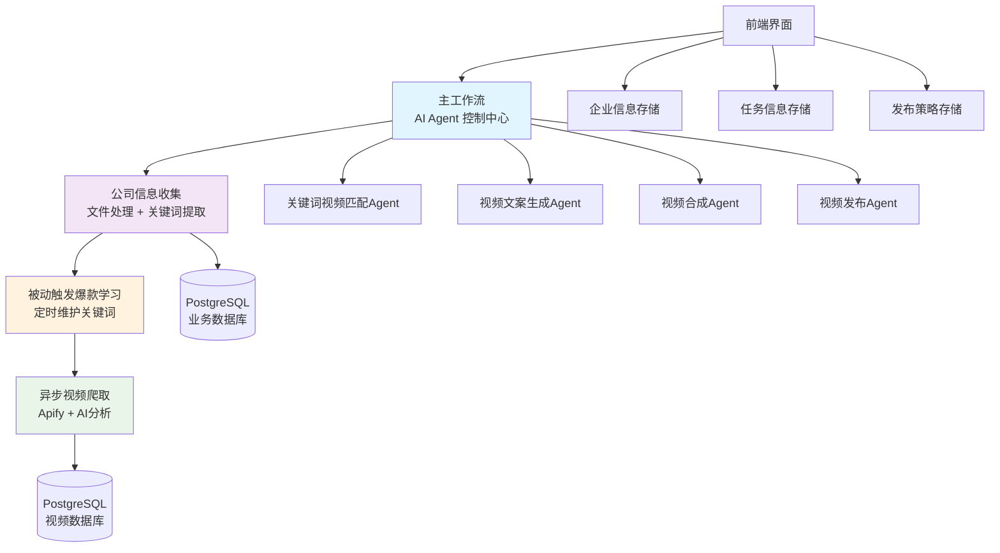
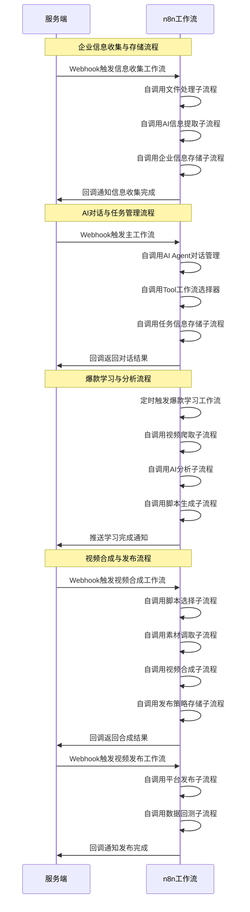

# n8n工作流完整需求文档

**版本**: v1.0.0  
**创建日期**: 2025-08-28  
**适用项目**: HSAI外贸爆款短视频运营总管  
**文档类型**: 完整需求规格说明  
**状态**: 整合版本

## 版本修订记录

| 版本     | 日期         | 修订内容                   | 修订人    |
| ------ | ---------- | ---------------------- | ------ |
| v1.0.0 | 2025-08-28 | 整合所有n8n相关需求，形成统一完整需求文档 | AI系统分析 |

## 1. 需求概述

### 1.1 项目背景

基于HSAI外贸爆款短视频运营总管的业务需求，通过n8n工作流引擎实现"战略输入-内容生产-数据分析"的三阶段闭环自动化。采用**AI Agent + Tool工具**的架构模式，实现智能化的视频内容生产和管理流程。

### 1.2 核心价值

- **快速复制爆款内容**：通过爆款视频抓取和分析，快速验证市场并起量
- **沉淀企业私有结构库**：形成稳定的内容生产能力和企业知识库
- **持续优化增长飞轮**：基于数据分析的持续改进和策略优化

### 1.3 技术架构概览



## 2. 业务流程需求

### 2.1 用户引导与初始化流程

#### 需求描述

新用户首次使用时，通过AI对话收集企业信息，生成专属知识库和战略规划。

#### 功能要求

- **信息收集**：市场定位、产品特点、竞争情况等企业核心信息
- **知识库生成**：基于收集信息自动生成企业专属知识库v1.0
- **战略地图**：生成包含市场定位、产品策略、内容规划的战略卡片
- **数据存储**：企业信息确认后进行持久化存储

#### 技术要求

```json
{
  "工作流": "公司信息收集及作战地图梳理",
  "触发方式": "前端Webhook调用",
  "AI模型": "Gemini-2.5-pro",
  "数据存储": "PostgreSQL.hsai_business_enterprise_info",
  "文件支持": ["图片", "PDF", "Excel", "CSV", "JSON", "XML", "RTF"]
}
```

### 2.2 AI对话与内容生产流程

#### 需求描述

用户通过自然语言与AI智能体对话，完成视频制作任务的全流程管理。

#### 功能要求

- **多轮对话**：支持上下文保持的智能对话
- **任务识别**：自动识别用户意图和任务类型
- **Tool调用**：根据需求调用相应的工具工作流
- **状态跟踪**：实时跟踪任务执行状态
- **结果反馈**：格式化展示任务结果

#### 工具工作流清单

| Tool名称                    | 功能描述      | 输入      | 输出      |
| ------------------------- | --------- | ------- | ------- |
| keywords2videotext_agent  | 关键词匹配爆款文案 | 关键词     | 5个匹配文案  |
| videotext2videojson_agent | 文案生成视频脚本  | 确认文案    | 10个视频脚本 |
| videojson2video_agent     | 视频合成      | 脚本+素材   | 合成视频    |
| videototk                 | 视频发布      | 视频+平台信息 | 发布结果    |

#### 技术要求

```json
{
  "工作流": "主工作流",
  "AI模型": "Gemini-2.5-pro + GPT-4.1",
  "会话管理": "PostgreSQL Chat Memory (50条上下文)",
  "响应格式": "JSON (success, session_id, displayText)",
  "错误处理": "工具调用失败重试机制"
}
```

### 2.3 爆款内容学习流程

#### 需求描述

通过定时或手动触发，抓取热门爆款视频进行学习分析，生成结构化脚本库。

#### 功能要求

- **自动抓取**：基于关键词抓取TikTok热门视频
- **数据存储**：爆款视频数据直接录入数据库
- **人工确认**：负责人确认需要学习的视频
- **智能解析**：AI分析视频结构和拍摄手法
- **脚本生成**：生成结构化脚本并存入测试脚本库

#### 技术要求

```json
{
  "触发工作流": "被动触发爆款学习",
  "爬取工作流": "异步视频爬取关键词分析",
  "爬虫服务": "Apify TikTok Scraper",
  "数据库": "PostgreSQL.hsai_business_good_video",
  "AI分析": "Gemini-2.5-pro (视频内容分析)",
  "抓取频率": "定时/手动触发，1分钟间隔限流"
}
```

### 2.4 视频合成与发布流程

#### 需求描述

基于选定脚本和素材，自动合成视频并支持多平台发布。

#### 功能要求

- **脚本选择**：从爆款脚本库和测试脚本库按比例选择
- **素材调取**：根据脚本需求调取相应素材
- **视频合成**：自动执行视频剪辑和特效处理
- **预览生成**：生成预览文件供用户确认
- **多平台发布**：支持TikTok等主流平台发布
- **状态跟踪**：实时跟踪合成和发布状态

#### 技术要求

```json
{
  "视频处理": "FFmpeg + AI合成服务",
  "素材存储": "OSS对象存储",
  "发布平台": ["TikTok", "抖音", "快手", "小红书", "YouTube"],
  "状态管理": "异步任务队列 + WebSocket推送",
  "质量控制": "自动质量检测和优化"
}
```

## 3. n8n工作流业务流程

### 3.1 核心业务流程泳道图

基于业务需求，n8n工作流系统主要涉及服务端和n8n工作流两个泳道，通过工作流自调用实现复杂业务逻辑。



### 3.2 数据存储需求

#### 3.2.1 企业信息存储

**业务场景**：用户确认企业资料、目标人群、产品特点后进行存储  
**业务价值**：为二创视频文案生成提供基础数据，改写爆款脚本时调用企业信息优化提示词  

#### 3.2.2 任务信息存储

**业务场景**：系统生成准备任务后进行存储  
**业务价值**：任务跟踪和进度管理，团队协作和任务分配  

#### 3.2.3 发布策略存储

**业务场景**：生成每日发布数量策略后进行存储  
**业务价值**：员工工作台显示每日待完成视频数量，根据发布策略确定脚本抓取数量标准

## 4. 工作流节点设计

### 4.1 核心工作流

#### 4.1.1 主工作流

**功能**：AI Agent对话管理和工具调用
**关键节点**：

- Webhook触发器
- AI Agent (Gemini-2.5-pro)
- Postgres Chat Memory
- Tool工作流调用
- 响应格式化

#### 4.1.2 公司信息收集工作流

**功能**：多格式文件处理和信息提取
**支持格式**：图片、PDF、CSV、JSON、XML、Excel、RTF等
**关键节点**：

- 文件类型判断
- 格式转换和内容提取
- AI信息分析
- 关键词生成
- 企业信息存储

#### 4.1.3 爆款学习工作流

**功能**：关键词管理和视频爬取触发
**关键节点**：

- 数据库关键词查询
- 关键词预处理和去重
- 批量循环处理
- 爬取工作流调用

#### 4.1.4 视频爬取分析工作流

**功能**：TikTok视频爬取和内容分析
**关键节点**：

- Apify API调用
- 视频元数据提取
- AI内容分析
- 数据库存储

#### 4.1.5 视频合成工作流

**功能**：脚本选择、素材调取和视频合成
**关键节点**：

- 脚本库查询和选择
- 素材匹配和调取
- 视频合成服务调用
- 发布策略存储
- 任务状态更新

### 4.2 数据存储节点要求

#### 4.2.1 企业信息存储节点

**触发条件**：用户确认企业信息后  
**存储内容**：企业资料、目标人群、产品特点等信息  
**数据格式**：JSON格式，支持结构化查询和更新  

#### 4.2.2 任务信息存储节点

**触发条件**：系统生成任务后  
**存储内容**：任务描述、素材数量、账号数量、期限等  
**数据格式**：支持任务状态跟踪和进度管理  

#### 4.2.3 发布策略存储节点

**触发条件**：发布策略生成后  
**存储内容**：每日发布数量、时间安排、内容策略等  
**数据格式**：支持策略查询和动态调整

## 5. 技术规范

### 5.1 开发环境

**核心技术栈**：

- **n8n**: 工作流引擎 
- **PostgreSQL**: 数据存储和会话管理
- **AI服务**: Gemini-2.5-pro/flash, GPT-4.1 (api.gpt.ge)
- **第三方服务**: Apify TikTok爬虫
- **文件存储**: OSS对象存储

**API配置**：

```bash
# AI模型服务
AI_API_BASE_URL=https://api.gpt.ge/v1
AI_API_KEY=sk-P7eWBZs2JfAHahcC442675C308374b5181CaC2Bd1929D84e

# Apify爬虫服务
APIFY_API_BASE_URL=https://api.apify.com/v2
APIFY_API_KEY=apify_api_AdT8bYLhHfrhAqI4qQ8oqqabY4PBtK48AxJt

# n8n Webhook基础URL
N8N_WEBHOOK_BASE_URL=https://webhook-n8n.hsai.cc
```

### 5.2 错误处理

**重试机制**：

```json
{
  "AI模型调用": "3次重试，500ms间隔",
  "Apify爬虫": "1次重试，无间隔", 
  "数据库连接": "使用连接池管理",
  "文件处理": "格式检查和异常捕获"
}
```

**监控告警**：

- 工作流执行失败率 > 5%
- AI服务响应时间 > 10秒
- 数据库连接异常
- 第三方服务不可用

### 5.3 数据安全

**敏感信息处理**：

- API密钥加密存储
- 用户数据隔离访问
- 操作审计日志
- 数据备份和恢复

## 6. 用户故事

### 6.1 核心用户故事

#### US-N8N-001: 企业信息收集

**作为** 外贸企业负责人  
**我希望** 通过AI对话快速完成企业信息录入  
**以便** 系统能够生成个性化的内容策略  

**验收标准**：

- ✅ 支持多种文件格式上传
- ✅ AI自动提取关键信息
- ✅ 信息确认后自动存储
- ✅ 生成企业知识库

#### US-N8N-002: 爆款内容学习

**作为** 内容运营人员  
**我希望** 系统能自动抓取和学习爆款视频  
**以便** 快速复制成功的内容模式  

**验收标准**：

- ✅ 定时自动抓取热门视频
- ✅ 支持手动触发抓取
- ✅ AI分析视频结构和特点
- ✅ 生成可复用的脚本模板

#### US-N8N-003: 智能视频制作

**作为** 内容创作者  
**我希望** 通过对话完成视频制作全流程  
**以便** 提高视频制作效率  

**验收标准**：

- ✅ 自然语言任务描述
- ✅ 自动匹配合适脚本
- ✅ 一键启动视频合成
- ✅ 实时进度跟踪

### 6.2 扩展用户故事

#### US-N8N-004: 任务管理

**作为** 项目管理员  
**我希望** 系统能够记录和跟踪制作任务  
**以便** 更好地管理团队工作进度  

#### US-N8N-005: 发布策略优化

**作为** 营销负责人  
**我希望** 基于数据分析优化发布策略  
**以便** 提升内容营销效果  

## 7. 验收标准

### 7.1 功能验收

**基础功能**：

- [ ] 4个核心工作流稳定运行
- [ ] 3个新存储模块正常工作
- [ ] AI对话流程完整可用
- [ ] 文件处理支持多格式
- [ ] 视频爬取和分析准确

**性能验收**：

- [ ] 工作流执行成功率 > 95%
- [ ] AI响应时间符合要求
- [ ] 数据存储一致性100%
- [ ] 异常处理覆盖率100%

### 7.2 集成验收

**前端集成**：

- [ ] Webhook触发正常
- [ ] 实时状态同步
- [ ] 错误信息传递准确
- [ ] 用户体验流畅

**数据集成**：

- [ ] 数据库操作正确
- [ ] 第三方API集成稳定
- [ ] 数据格式标准化
- [ ] 安全机制有效

## 8. 风险评估

### 8.1 技术风险

| 风险          | 概率  | 影响  | 缓解措施        |
| ----------- | --- | --- | ----------- |
| AI服务不稳定     | 中   | 高   | 备选AI服务+降级方案 |
| Apify API限制 | 中   | 中   | 账户额度监控+限流策略 |
| 数据库性能       | 低   | 中   | 索引优化+连接池管理  |
| 第三方依赖       | 中   | 中   | 多供应商策略+监控告警 |

### 8.2 业务风险

| 风险     | 概率  | 影响  | 缓解措施       |
| ------ | --- | --- | ---------- |
| 平台政策变化 | 高   | 高   | 多平台支持+政策跟踪 |
| 用户需求变化 | 中   | 中   | 快速迭代+用户反馈  |
| 竞品压力   | 中   | 中   | 技术创新+差异化功能 |

---

**文档维护**: AI系统分析 + n8n开发团队  
**审核状态**: 待项目组审核  
**相关文档**: 

- [n8n工作流开发指南](../03_技术实现/n8n工作流开发指南.md)
- [用户故事与用例分析](./用户故事与用例分析.md)