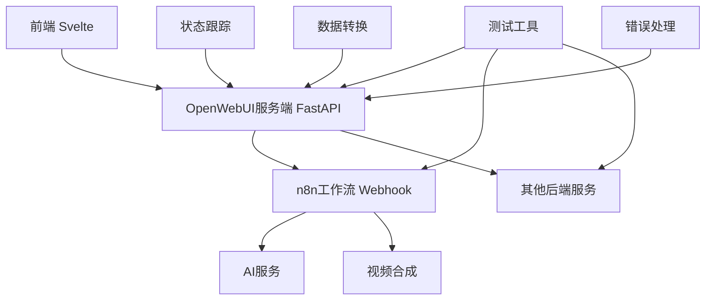
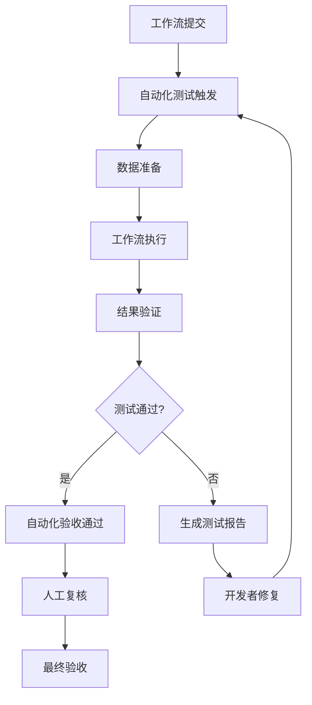
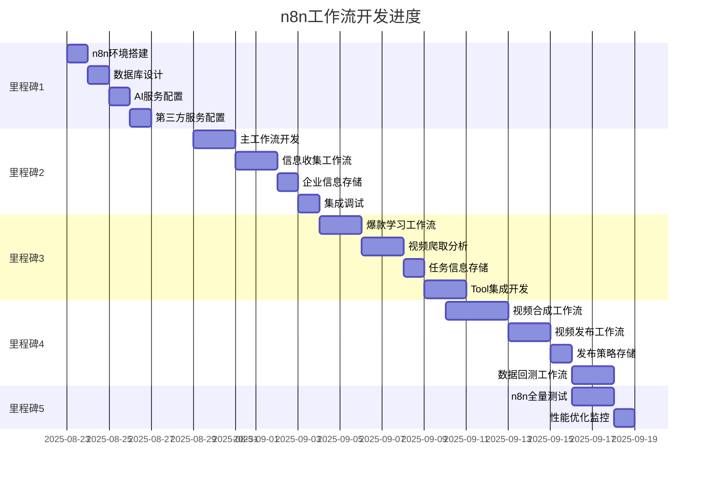

# HSAI项目整合开发计划

**版本**: v1.3.0  
**创建日期**: 2025-08-24  
**最后更新**: 2025-08-31  
**审核状态**: 待审核  

## 版本修订记录

| 版本 | 日期 | 修订内容 | 修订人 |
|------|------|----------|--------|
| v1.0.0 | 2025-08-24 | 初始版本，包含基础架构设计和任务分解 | 项目管理办公室 |
| v1.1.0 | 2025-08-24 | 增加自动化测试先行策略、详细验收标准、中台服务架构 | 项目管理办公室 |
| v1.2.0 | 2025-08-25 | 修正中台架构为OpenWebUI网关扩展，移除独立Golang中台开发 | 项目管理办公室 |  

## 1. 重要架构调整

### 1.1 OpenWebUI网关架构


### 1.2 OpenWebUI网关职责
- **请求代理**: 接收前端请求，代理调用n8n工作流
- **状态跟踪**: 实时跟踪工作流执行状态并推送给前端
- **数据转换**: 处理n8n返回数据的结构化问题
- **错误处理**: 统一异常处理和用户友好错误提示
- **响应缓存**: 缓存工作流结果，提升响应速度

### 1.3 测试驱动验收策略
- **自动化测试先行**: 测试工具作为验收标准
- **工作流验收**: 通过测试用例即通过验收
- **人工复核**: 仅针对完整业务流程
- **阶段性验证**: 每个工作流场景独立验证

## 2. 关键时间节点调整

### 2.1 8月27日前必须完成
| 任务 | 负责人 | 完成时间 | 输出物 | 重要性 |
|------|--------|----------|--------|--------|
| 完整API接口列表 | 后端开发 | 8月27日 | 接口文档+数据结构 | 🔴极高 |
| Mock数据服务 | 后端开发 | 8月27日 | Mock服务+测试数据 | 🔴极高 |
| OpenWebUI网关设计 | 后端开发 | 8月27日 | 网关架构+接口规范 | 🔴极高 |
| 自动化测试框架 | 测试工程师 | 8月27日 | 测试框架+基础用例 | 🔴极高 |

## 3. 优化后的里程碑计划

### 里程碑1: 基础设施与测试先行 (8/23-8/28)
**目标**: 测试工具先行，完整接口列表，中台架构设计

#### 核心交付物 (8月27日前必须完成)

##### 1. 完整API接口列表设计
| 任务ID | 任务名称 | 工期 | 负责人 | 详细验收标准 | 输出物 |
|--------|----------|------|--------|-------------|--------|
| M1.API001 | 用户认证接口设计 | 0.5天 | 后端开发 | **输入**: 用户名/密码/验证码<br>**处理**: JWT生成、权限验证<br>**输出**: token+用户信息<br>**错误码**: 401,403,422 | 接口文档+Mock数据 |
| M1.API002 | 个人工作台接口设计 | 0.5天 | 后端开发 | **输入**: 用户ID+查询条件<br>**处理**: 数据聚合、权限过滤<br>**输出**: 工作台数据结构<br>**性能**: <500ms | 5个接口规范+测试用例 |
| M1.API003 | 任务管理接口设计 | 0.5天 | 后端开发 | **输入**: 任务对象+操作类型<br>**处理**: CRUD+状态变更<br>**输出**: 操作结果+更新数据<br>**并发**: 支持10个并发 | 6个接口规范+性能要求 |
| M1.API004 | AI对话接口设计 | 0.5天 | 后端开发 | **输入**: 对话上下文+用户消息<br>**处理**: AI调用+上下文管理<br>**输出**: AI回复+会话状态<br>**实时性**: WebSocket支持 | 对话接口+WebSocket规范 |
| M1.API005 | 素材管理接口设计 | 0.5天 | 后端开发 | **输入**: 文件数据+元信息<br>**处理**: 存储+格式转换+缩略图<br>**输出**: 文件URL+元数据<br>**限制**: 单文件<100MB | 文件接口+存储策略 |

##### 2. OpenWebUI网关扩展设计
| 任务ID | 任务名称 | 工期 | 负责人 | 详细验收标准 | 输出物 |
|--------|----------|------|--------|-------------|--------|
| M1.GW001 | 网关架构设计 | 0.5天 | 后端开发 | **架构**: 基于OpenWebUI FastAPI扩展<br>**功能**: 工作流代理+状态跟踪+数据转换<br>**接口**: RESTful API + WebSocket<br>**性能**: 支持100并发请求 | 架构文档+接口规范 |
| M1.GW002 | 工作流代理接口设计 | 0.5天 | 后端开发 | **代理功能**: 前端请求转发到n8n<br>**状态跟踪**: 实时跟踪工作流状态<br>**错误处理**: 统一异常处理机制<br>**响应格式**: 标准化JSON响应 | 代理接口+状态API |
| M1.GW003 | 数据转换规则设计 | 0.5天 | 后端开发 | **转换规则**: 支持5种工作流数据格式<br>**容错处理**: 异常数据自动修复<br>**配置化**: 转换规则可配置管理<br>**验证**: 数据格式验证机制 | 转换规则+配置示例 |

##### 3. 自动化测试框架
| 任务ID | 任务名称 | 工期 | 负责人 | 详细验收标准 | 输出物 |
|--------|----------|------|----------|-------------|--------|
| M1.TEST001 | 测试框架搭建 | 1天 | 测试工程师 | **框架**: pytest+requests+allure<br>**覆盖**: API+工作流+集成测试<br>**报告**: HTML测试报告<br>**CI集成**: Jenkins自动执行 | 测试框架+示例用例 |
| M1.TEST002 | n8n工作流测试用例 | 1天 | 测试工程师 | **场景覆盖**: 视频合成+信息收集+发布<br>**验证点**: 输入输出+性能+异常<br>**自动化**: 测试通过即验收通过<br>**数据**: 测试数据自动生成 | 工作流测试用例库 |
| M1.TEST003 | 接口自动化测试 | 1天 | 测试工程师 | **覆盖**: 所有API接口<br>**场景**: 正常+异常+边界条件<br>**断言**: 数据格式+业务逻辑<br>**性能**: 响应时间阈值检查 | API测试用例+性能基线 |

##### 4. n8n工作流基础设施
| 任务ID | 任务名称 | 工期 | 负责人 | 详细验收标准 | 输出物 |
|--------|----------|------|----------|-------------|--------|
| M1.N8N001 | n8n环境搭建配置 | 1天 | n8n工程师 | **环境**: n8n服务正常运行<br>**配置**: Webhook基础URL配置<br>**认证**: API密钥管理配置<br>**监控**: 基础监控指标配置 | n8n运行环境+配置文档 |
| M1.N8N002 | PostgreSQL数据库设计 | 1天 | n8n工程师+DBA | **表结构**: 企业信息、任务信息、发布策略表<br>**索引**: 关键字段索引优化<br>**权限**: 数据库访问权限配置<br>**备份**: 数据备份策略配置 | 数据库schema+权限配置 |
| M1.N8N003 | AI服务接口配置 | 0.5天 | n8n工程师 | **Gemini**: Gemini-2.5-pro API配置<br>**GPT**: GPT-4.1 API配置<br>**限流**: API调用限流策略<br>**错误处理**: API失败重试机制 | AI服务配置+凭据管理 |
| M1.N8N004 | 第三方服务配置 | 0.5天 | n8n工程师 | **Apify**: TikTok爬虫API配置<br>**OSS**: 对象存储服务配置<br>**监控**: 第三方服务监控<br>**降级**: 服务不可用降级方案 | 第三方服务配置+监控 |

#### 前端任务优化
| 任务ID | 任务名称 | 工期 | 负责人 | 详细验收标准 | 风险应对 |
|--------|----------|------|--------|-------------|----------|
| M1.F001 | 前端代码版本升级 | 1天 | 前端开发 | **版本**: 升级至0.6.18<br>**功能**: 所有现有功能正常<br>**性能**: 页面加载时间不增加<br>**兼容**: 浏览器兼容性测试通过 | 版本回滚方案+兼容性测试 |
| M1.F002 | Mock数据集成 | 1天 | 前端开发 | **集成**: 调用Mock API成功<br>**数据**: 模拟真实业务场景<br>**切换**: 一键切换真实API<br>**调试**: 详细的调试信息 | Mock服务不可用时的应急方案 |
| M1.F003 | 网关接口对接准备 | 1天 | 前端开发 | **接口**: OpenWebUI网关调用接口<br>**错误处理**: 统一错误处理机制<br>**状态管理**: 工作流状态展示<br>**用户体验**: 加载状态和进度条 | 网关服务延迟的降级策略 |
| M1.F004 | n8n工作流前端集成准备 | 1天 | 前端开发 | **Webhook**: 前端触发n8n工作流接口<br>**状态跟踪**: 工作流执行状态展示<br>**数据格式**: n8n返回数据标准化处理<br>**错误处理**: 工作流异常友好提示 | 工作流服务不可用时的降级 |

### 里程碑2: 核心功能与中台集成 (8/29-9/3)
**目标**: 个人工作台+任务管理+中台服务上线

#### 中台网关扩展开发
| 任务ID | 任务名称 | 工期 | 负责人 | 详细验收标准 | 技术要求 |
|--------|----------|------|--------|-------------|----------|
| M2.GW001 | 工作流代理服务实现 | 1天 | 后端开发 | **代理功能**: 接收前端请求并转发n8n<br>**异步处理**: 工作流异步执行跟踪<br>**状态管理**: Redis存储执行状态<br>**WebSocket**: 实时状态推送 | FastAPI+Redis+WebSocket |
| M2.GW002 | 数据转换服务实现 | 1天 | 后端开发 | **转换准确率**: 95%以上<br>**错误修复**: 自动处理数据缺失<br>**规则引擎**: 支持配置化转换规则<br>**性能**: 转换延迟<100ms | Python数据处理+JSON映射 |
| M2.GW003 | 前端集成联调 | 1天 | 后端+前端 | **接口集成**: 前端成功调用网关<br>**实时通信**: WebSocket状态推送正常<br>**数据格式**: 完全匹配前端需求<br>**错误处理**: 异常情况友好提示 | 联调环境+调试工具 |

#### n8n核心工作流开发
| 任务ID | 任务名称 | 工期 | 负责人 | 详细验收标准 | 技术要求 |
|--------|----------|------|--------|-------------|----------|
| M2.N8N001 | 主工作流开发 | 2天 | n8n工程师 | **AI Agent**: Gemini-2.5-pro对话管理<br>**会话管理**: PostgreSQL Chat Memory 50条上下文<br>**Tool调用**: 支持多个Tool工作流调用<br>**响应格式**: JSON(success,session_id,displayText) | AI Agent + Tool架构 |
| M2.N8N002 | 公司信息收集工作流 | 2天 | n8n工程师 | **文件支持**: 图片、PDF、Excel、CSV、JSON、XML、RTF<br>**信息提取**: AI自动提取关键信息<br>**知识库**: 生成企业专属知识库v1.0<br>**数据存储**: 企业信息确认后存储 | 文件处理+AI分析 |
| M2.N8N003 | 企业信息存储节点开发 | 1天 | n8n工程师 | **触发条件**: 用户确认企业资料后<br>**存储内容**: 企业资料、目标人群、产品特点<br>**数据格式**: JSON结构化存储<br>**错误处理**: 存储失败重试机制 | PostgreSQL存储节点 |
| M2.N8N004 | n8n与中台集成调试 | 1天 | n8n工程师+后端 | **Webhook触发**: 中台正常触发n8n工作流<br>**数据传递**: 数据在中台和n8n间正确传递<br>**状态同步**: 工作流状态实时同步<br>**错误处理**: 异常情况正确处理 | Webhook+JSON数据交互 |

#### 测试驱动验收
| 任务ID | 任务名称 | 工期 | 负责人 | 详细验收标准 | 自动化程度 |
|--------|----------|------|--------|-------------|------------|
| M2.TEST001 | 个人工作台测试验收 | 1天 | 测试工程师 | **功能测试**: 5个模块100%通过<br>**性能测试**: 页面加载<3秒<br>**兼容性**: 3个主流浏览器<br>**数据**: 测试数据自动验证 | 90%自动化验收 |
| M2.TEST002 | 中台服务测试验收 | 1天 | 测试工程师 | **接口测试**: 所有接口功能正常<br>**性能测试**: 压力测试通过<br>**容错测试**: 异常处理验证<br>**集成测试**: 与前后端集成正常 | 95%自动化验收 |
| M2.TEST003 | 网关服务测试验收 | 1天 | 测试+后端开发 | **代理测试**: 工作流代理功能正常<br>**转换测试**: 数据转换准确率>95%<br>**实时通信**: WebSocket推送及时<br>**集成测试**: 前端网关n8n集成正常 | 测试用例通过即验收 |
| M2.TEST004 | n8n核心工作流测试验收 | 1天 | 测试+n8n工程师 | **主工作流**: AI Agent对话功能正常<br>**信息收集**: 多格式文件处理正常<br>**数据存储**: 企业信息存储正常<br>**集成测试**: 与中台服务集成正常 | 100%自动化验收 |

### 里程碑3: AI访谈与视频处理 (9/4-9/9)
**目标**: AI对话功能+视频合成服务+工作流深度集成

#### AI功能集成
| 任务ID | 任务名称 | 工期 | 负责人 | 详细验收标准 | 质量要求 |
|--------|----------|------|--------|-------------|----------|
| M3.AI001 | AI对话服务 | 2天 | 后端开发 | **AI集成**: 支持多个AI模型<br>**上下文**: 多轮对话上下文保持<br>**性能**: AI响应时间<5秒<br>**容错**: AI服务异常时降级处理 | 备选AI服务+缓存机制 |
| M3.AI002 | 视频合成服务 | 3天 | 后端开发 | **输入**: 支持多种素材格式<br>**处理**: 视频剪辑+特效+字幕<br>**输出**: 多种分辨率和格式<br>**性能**: 1分钟视频<5分钟合成 | FFmpeg+分布式处理 |
| M3.AI003 | 中台AI数据处理 | 2天 | 中台开发 | **数据流**: AI结果标准化处理<br>**状态管理**: AI任务状态跟踪<br>**错误处理**: AI失败时的重试机制<br>**监控**: AI调用成功率监控 | 状态机+重试策略 |

#### n8n AI功能工作流开发
| 任务ID | 任务名称 | 工期 | 负责人 | 详细验收标准 | 技术要求 |
|--------|----------|------|--------|-------------|----------|
| M3.N8N001 | 爆款学习工作流开发 | 2天 | n8n工程师 | **定时触发**: 支持定时/手动触发<br>**关键词管理**: 数据库关键词查询和去重<br>**批量处理**: 支持批量循环处理<br>**限流策略**: 1分钟间隔限流机制 | 定时任务+批量处理 |
| M3.N8N002 | 视频爬取分析工作流 | 2天 | n8n工程师 | **Apify集成**: TikTok视频爬取API调用<br>**元数据提取**: 视频URL、文本、标签提取<br>**AI分析**: Gemini-2.5-pro视频内容分析<br>**数据存储**: PostgreSQL爆款视频数据存储 | Apify API + AI分析 |
| M3.N8N003 | 任务信息存储节点开发 | 1天 | n8n工程师 | **触发条件**: 系统生成任务后<br>**存储内容**: 任务描述、素材数量、账号数量、期限<br>**状态管理**: 支持任务状态跟踪和更新<br>**数据格式**: JSON结构化存储 | PostgreSQL存储+状态管理 |
| M3.N8N004 | Tool工作流集成开发 | 2天 | n8n工程师 | **Tool清单**: keywords2videotext,videotext2videojson,videojson2video,videototk<br>**调用机制**: 主工作流正确调用各Tool工作流<br>**参数传递**: 输入输出参数正确传递<br>**错误处理**: Tool调用失败重试机制 | 工作流调用+参数映射 |

#### 工作流深度验收
| 任务ID | 任务名称 | 工期 | 负责人 | 详细验收标准 | 验收方式 |
|--------|----------|------|--------|-------------|----------|
| M3.WF001 | 视频合成工作流验收 | 2天 | 测试+n8n开发 | **输入验证**: 素材格式检查通过<br>**处理验证**: 合成过程无错误<br>**输出验证**: 视频质量符合要求<br>**性能验证**: 合成时间在预期范围 | 自动化测试+人工抽检 |
| M3.WF002 | AI内容生成工作流验收 | 2天 | 测试+n8n开发 | **内容质量**: AI生成内容符合要求<br>**格式验证**: 输出格式标准化<br>**异常处理**: AI失败时处理正确<br>**数据完整性**: 生成数据完整无缺失 | 测试用例自动验收 |
| M3.WF003 | 中台工作流集成验收 | 1天 | 测试+中台+n8n | **数据流转**: 前端→中台→n8n数据正确<br>**状态同步**: 工作流状态实时同步<br>**错误传递**: 错误信息正确传递<br>**性能验证**: 端到端响应时间合理 | 集成测试自动化 |
| M3.WF004 | n8n AI功能工作流验收 | 2天 | 测试+n8n开发 | **爆款学习**: 定时触发和视频爬取正常<br>**AI分析**: 视频内容分析准确性验证<br>**Tool调用**: 各Tool工作流调用正常<br>**数据存储**: 任务信息存储功能正常 | 100%自动化验收 |

### 里程碑4: 素材管理与发布优化 (9/10-9/15)
**目标**: 素材管理完善+发布流程+全链路测试

#### 素材服务完善
| 任务ID | 任务名称 | 工期 | 负责人 | 详细验收标准 | 技术指标 |
|--------|----------|------|--------|-------------|----------|
| M4.MAT001 | 素材存储服务 | 2天 | 后端开发 | **存储**: 支持本地+云存储<br>**格式**: 支持10种文件格式<br>**安全**: 文件扫描+权限控制<br>**性能**: 上传速度>10MB/s | 分布式存储+CDN加速 |
| M4.MAT002 | 素材处理工作流 | 2天 | n8n开发 | **自动处理**: 上传后自动转码<br>**缩略图**: 自动生成预览图<br>**元数据**: 自动提取文件信息<br>**分类**: 智能分类和标签 | 异步处理+队列机制 |
| M4.MAT003 | 中台素材数据服务 | 1天 | 中台开发 | **数据统一**: 素材数据格式统一<br>**搜索**: 高效的搜索接口<br>**缓存**: 热点数据缓存<br>**同步**: 多端数据同步 | Redis缓存+搜索引擎 |

#### n8n视频处理工作流开发
| 任务ID | 任务名称 | 工期 | 负责人 | 详细验收标准 | 技术要求 |
|--------|----------|------|--------|-------------|----------|
| M4.N8N001 | 视频合成工作流开发 | 3天 | n8n工程师 | **脚本选择**: 从爆款和测试脚本库按比例选择<br>**素材调取**: 根据脚本需求调取相应素材<br>**视频合成**: FFmpeg+AI合成服务集成<br>**状态跟踪**: 实时跟踪合成和发布状态 | FFmpeg+异步任务队列 |
| M4.N8N002 | 视频发布工作流开发 | 2天 | n8n工程师 | **多平台支持**: TikTok、抖音、快手、小红书、YouTube<br>**发布策略**: 支持定时发布和立即发布<br>**结果跟踪**: 发布结果自动跟踪和回测<br>**错误处理**: 平台API异常时的处理机制 | 多平台API集成 |
| M4.N8N003 | 发布策略存储节点开发 | 1天 | n8n工程师 | **触发条件**: 发布策略生成后<br>**存储内容**: 每日发布数量、时间安排、内容策略<br>**策略查询**: 支持策略查询和动态调整<br>**数据格式**: JSON结构化存储 | PostgreSQL存储+策略管理 |
| M4.N8N004 | 数据回测工作流开发 | 2天 | n8n工程师 | **定时拉取**: 定时拉取视频观看数据<br>**数据分析**: 提供数据分析结果<br>**策略调整**: 根据数据调整脚本排名<br>**影响优化**: 影响后续视频合成任务中脚本库优先级 | 数据分析+策略优化 |

#### 发布流程验收
| 任务ID | 任务名称 | 工期 | 负责人 | 详细验收标准 | 验收标准 |
|--------|----------|------|--------|-------------|----------|
| M4.PUB001 | 发布工作流验收 | 2天 | 测试+n8n开发 | **平台支持**: 支持5个主流平台<br>**批量发布**: 一键多平台发布<br>**定时发布**: 定时任务正确执行<br>**结果跟踪**: 发布结果自动跟踪 | 测试用例100%通过 |
| M4.PUB002 | 完整业务流程验收 | 2天 | 全员 | **端到端**: 从素材到发布全流程<br>**用户体验**: 操作步骤≤5步<br>**性能**: 完整流程<10分钟<br>**稳定性**: 连续100次操作成功率>95% | 人工复核+压力测试 |
| M4.PUB003 | n8n视频处理工作流验收 | 2天 | 测试+n8n开发 | **视频合成**: 脚本选择、素材调取、合成正常<br>**发布功能**: 多平台发布功能正常<br>**数据存储**: 发布策略存储正常<br>**数据回测**: 观看数据拉取和分析正常 | 100%自动化验收 |
| M4.PUB004 | 数据存储节点验收 | 1天 | 测试+n8n开发 | **企业信息**: 企业信息存储节点功能正常<br>**任务信息**: 任务信息存储节点功能正常<br>**发布策略**: 发布策略存储节点功能正常<br>**数据一致性**: 数据存储一致性100% | 数据格式校验+一致性测试 |

### 里程碑5: 集成测试与上线准备 (9/16-9/21)
**目标**: 全量测试+性能优化+上线准备

#### 全量集成测试
| 任务ID | 任务名称 | 工期 | 负责人 | 详细验收标准 | 质量门禁 |
|--------|----------|------|--------|-------------|----------|
| M5.INT001 | 系统集成测试 | 2天 | 全员 | **功能完整性**: 所有功能正常运行<br>**数据一致性**: 多系统数据同步正确<br>**性能达标**: 所有性能指标达标<br>**安全验证**: 安全测试全部通过 | 零严重bug+性能达标 |
| M5.INT002 | 压力测试与优化 | 2天 | 后端+运维 | **并发支持**: 支持100并发用户<br>**响应时间**: 95%请求<2秒响应<br>**稳定性**: 24小时压力测试无故障<br>**资源使用**: CPU<70%, 内存<80% | 性能基线达标 |
| M5.INT003 | 上线部署准备 | 2天 | 运维+全员 | **环境准备**: 生产环境部署就绪<br>**数据迁移**: 测试数据迁移方案<br>**监控配置**: 完整的监控体系<br>**应急预案**: 故障处理预案完整 | 部署成功+监控正常 |
| M5.INT004 | n8n工作流全量测试 | 2天 | 测试+n8n工程师 | **所有工作流**: 5个核心工作流全部测试通过<br>**数据存储**: 3个存储节点功能正常<br>**集成测试**: 与前端中台集成正常<br>**性能测试**: 工作流执行性能符合要求 | 100%自动化测试通过 |
| M5.INT005 | n8n性能优化与监控 | 1天 | n8n工程师+运维 | **响应优化**: AI响应时间<5秒<br>**工作流性能**: 工作流执行时间<300秒<br>**监控告警**: 工作流失败率<5%<br>**文档完善**: n8n工作流开发文档完整 | 性能指标达标+文档完整 |

## 4. 详细验收标准模板

### 4.1 功能验收标准
```yaml
功能验收模板:
  输入验证:
    - 数据格式: [具体格式要求]
    - 必填字段: [字段列表]
    - 数据范围: [有效值范围]
    - 边界条件: [边界值测试]
  
  处理验证:
    - 业务逻辑: [逻辑正确性]
    - 计算结果: [计算准确性]
    - 状态变更: [状态流转正确]
    - 并发处理: [并发安全性]
  
  输出验证:
    - 数据格式: [输出格式标准]
    - 完整性: [数据完整性检查]
    - 一致性: [数据一致性验证]
    - 性能指标: [响应时间要求]
  
  异常验证:
    - 错误处理: [异常场景处理]
    - 错误码: [错误码准确性]
    - 用户提示: [友好错误提示]
    - 系统恢复: [自动恢复能力]
```

### 4.2 性能验收标准
| 指标类型 | 验收标准 | 测试方法 | 监控工具 |
|----------|----------|----------|----------|
| 响应时间 | API<2秒, 页面<3秒 | 自动化压力测试 | Prometheus+Grafana |
| 并发能力 | 支持100并发用户 | JMeter压力测试 | 系统监控 |
| 吞吐量 | 1000次/分钟 | 持续负载测试 | APM监控 |
| 资源使用 | CPU<70%, 内存<80% | 24小时监控 | 系统资源监控 |

### 4.3 数据验收标准
| 验证类型 | 验收要求 | 测试用例 | 工具支持 |
|----------|----------|----------|----------|
| 数据格式 | 100%符合Schema定义 | 自动化格式检查 | JSON Schema验证 |
| 数据完整性 | 必填字段100%非空 | 完整性检查脚本 | 数据质量工具 |
| 数据一致性 | 跨系统数据一致 | 一致性对比测试 | 数据对比工具 |
| 数据安全 | 敏感数据加密存储 | 安全扫描测试 | 安全测试工具 |

## 5. 自动化测试验收流程

### 5.1 n8n工作流验收流程


### 5.2 测试用例设计规范
| 测试场景 | 用例数量 | 覆盖内容 | 自动化程度 |
|----------|----------|----------|------------|
| 视频合成 | 15个 | 格式+质量+性能+异常 | 100%自动化 |
| 信息收集 | 12个 | 数据+验证+存储+查询 | 100%自动化 |
| AI内容生成 | 10个 | 质量+格式+性能+错误 | 90%自动化 |
| 素材处理 | 18个 | 上传+转换+存储+检索 | 95%自动化 |
| 发布流程 | 20个 | 平台+时间+状态+追踪 | 85%自动化 |

## 6. 风险控制与应急预案

### 6.1 关键风险监控
| 风险类型 | 监控指标 | 预警阈值 | 应急措施 |
|----------|----------|----------|----------|
| API接口延迟 | 开发进度 | 延迟>1天 | 启用Mock数据，并行开发 |
| 中台服务问题 | 服务可用性 | 可用性<95% | 直连后端，绕过中台 |
| n8n工作流异常 | 执行成功率 | 成功率<90% | 手动处理，简化流程 |
| 测试用例失败 | 通过率 | 通过率<90% | 用例降级，关键功能优先 |

### 6.2 应急响应时间要求
| 问题等级 | 响应时间 | 处理时间 | 负责人 |
|----------|----------|----------|---------|
| P0(阻塞) | 30分钟 | 4小时 | 技术负责人 |
| P1(严重) | 2小时 | 24小时 | 模块负责人 |
| P2(一般) | 8小时 | 72小时 | 开发者 |
| P3(轻微) | 24小时 | 1周 | 开发者 |

## 7. n8n工作流任务总结

### 7.1 核心交付物
基于[n8n工作流完整需求文档](../01_需求分析/n8n工作流完整需求文档.md)，本项目中包含了完整的n8n工作流开发任务：

#### 工作流开发任务 (18个)
- **里程碑1**: 4个基础设施任务（环境搭建、数据库设计、AI/第三方服务配置）
- **里程碑2**: 4个核心工作流任务（主工作流、信息收集、企业信息存储、集成调试）
- **里程碑3**: 4个AI功能任务（爆款学习、视频爬取、任务存储、Tool集成）
- **里程碑4**: 4个视频处理任务（视频合成、发布、策略存储、数据回测）
- **里程碑5**: 2个集成测试任务（全量测试、性能优化）

#### 测试验收任务 (8个)
- **里程碑2**: 1个测试任务（核心工作流验收）
- **里程碑3**: 1个测试任务（AI功能工作流验收）
- **里程碑4**: 2个测试任务（视频处理工作流验收、数据存储节点验收）
- **里程碑5**: 2个测试任务（n8n全量测试、性能优化验收）

### 7.2 技术要求覆盖
✅ **AI Agent + Tool架构**: 主工作流 + 4个Tool工作流集成  
✅ **多格式文件处理**: 支持7种文件格式的信息收集  
✅ **AI服务集成**: Gemini-2.5-pro + GPT-4.1 + 容错处理  
✅ **第三方服务**: Apify TikTok爬虫 + OSS对象存储  
✅ **数据存储**: 3个关键业务数据存储节点  
✅ **多平台发布**: 5个主流社交媒体平台支持  

### 7.3 任务依赖关系


### 7.4 质量保证措施
- **自动化测试驱动**: 所有工作流都有相应的自动化测试用例
- **阶段性验收**: 每个里程碑都有独立的验收标准和测试任务
- **性能基线**: AI响应<5秒，工作流执行<300秒，失败率<5%
- **数据一致性**: 100%数据存储一致性校验
- **集成测试**: 前端→中台→n8n的全链路集成测试

---

**文档维护**: 项目管理办公室  
**更新频率**: 每日更新进度，问题发生时即时更新  
**关联文档**: 任务依赖关系与并行开发协调_v1.0.md  
**审核状态**: 待审核