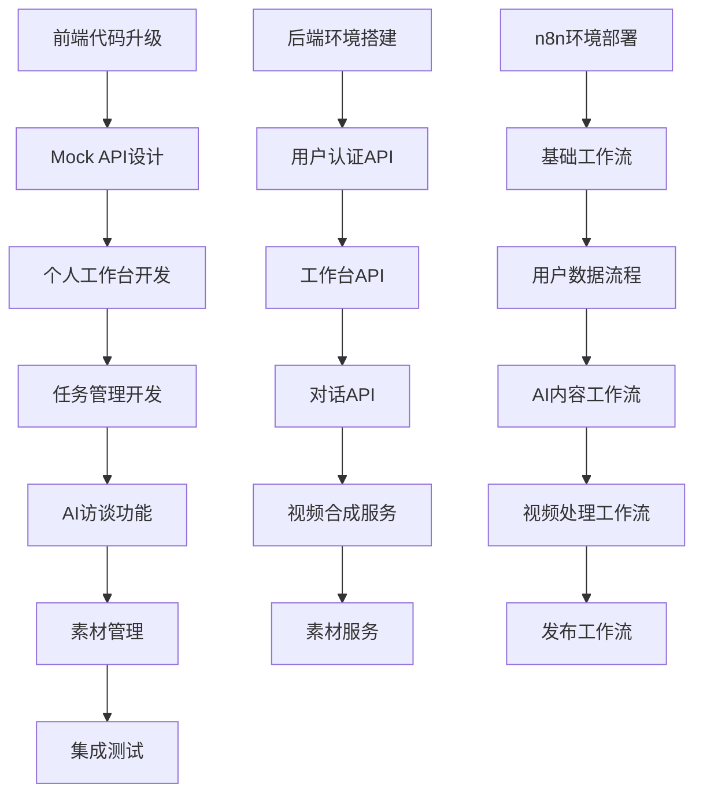
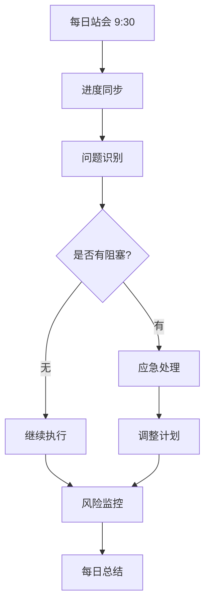
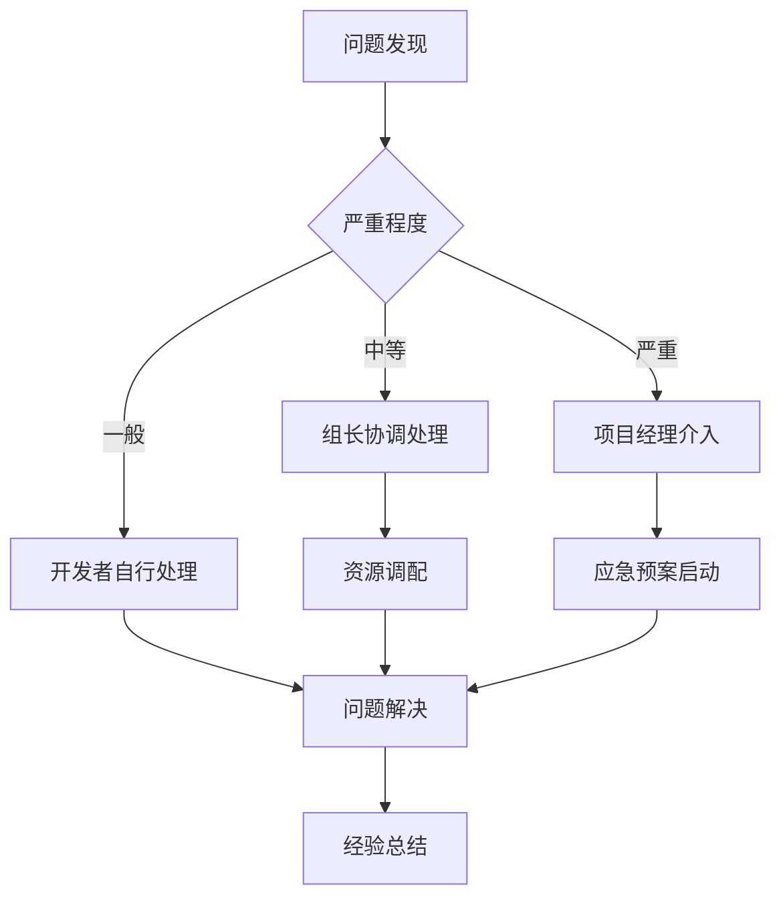

# 任务依赖关系与并行开发协调方案

**版本**: v1.0.0  
**创建日期**: 2025-08-24  
**最后更新**: 2025-08-25  
**审核状态**: 待审核  
**关联文档**: 项目整合开发计划.md  

## 版本修订记录

| 版本 | 日期 | 修订内容 | 修订人 |
|------|------|----------|--------|
| v1.0.0 | 2025-08-24 | 初始版本，定义任务依赖关系和并行开发协调机制 | 项目管理办公室 |  

## 1. 关键路径分析

### 1.1 项目关键路径识别


### 1.2 关键路径风险点
| 路径节点 | 风险等级 | 风险描述 | 缓解措施 |
|----------|----------|----------|----------|
| Mock API设计 | 🟡中 | 接口设计与后端不一致 | 提前API设计评审 |
| AI访谈功能 | 🔴高 | AI接口稳定性问题 | 准备降级方案 |
| 视频合成服务 | 🔴高 | 性能和稳定性问题 | 分步实现，先简后繁 |
| n8n工作流集成 | 🟡中 | 工作流与前端功能不匹配 | 每2天同步验收 |

## 2. 任务依赖矩阵

### 2.1 前端任务依赖关系
| 前端任务 | 依赖任务 | 依赖类型 | 风险等级 | 应对策略 |
|----------|----------|----------|----------|----------|
| 个人工作台页面 | Mock API设计 | 强依赖 | 🟢低 | Mock数据支持 |
| 任务管理页面 | 个人工作台页面 | 弱依赖 | 🟢低 | 可并行开发 |
| AI访谈页面 | 视频播放器组件 | 强依赖 | 🟡中 | 组件先行开发 |
| 工作台接口对接 | 用户认证API | 强依赖 | 🟡中 | API优先开发 |
| 视频合成对接 | 视频合成服务 | 强依赖 | 🔴高 | Mock数据应急 |

### 2.2 后端任务依赖关系
| 后端任务 | 依赖任务 | 依赖类型 | 风险等级 | 应对策略 |
|----------|----------|----------|----------|----------|
| 用户认证API | 后端环境搭建 | 强依赖 | 🟢低 | 环境优先配置 |
| 工作台API | 用户认证API | 弱依赖 | 🟢低 | 可并行开发 |
| AI模型集成 | 第三方AI服务 | 强依赖 | 🔴高 | 备选服务准备 |
| 视频合成服务 | AI模型集成 | 弱依赖 | 🟡中 | 独立开发测试 |
| 素材服务 | 文件存储配置 | 强依赖 | 🟡中 | 本地存储先行 |

### 2.3 n8n工作流依赖关系
| n8n任务 | 依赖任务 | 依赖类型 | 风险等级 | 应对策略 |
|---------|----------|----------|----------|----------|
| 基础工作流 | n8n环境部署 | 强依赖 | 🟢低 | 环境优先配置 |
| 用户数据流程 | 工作台API | 强依赖 | 🟡中 | API Mock支持 |
| AI内容工作流 | AI模型集成 | 强依赖 | 🔴高 | 简化版本先行 |
| 视频处理工作流 | 视频合成服务 | 强依赖 | 🔴高 | 分阶段实现 |
| 发布工作流 | 第三方平台API | 强依赖 | 🔴高 | 手动发布备选 |

## 3. 并行开发协调机制

### 3.1 角色协调矩阵
| 时间段 | 前端开发 | 后端开发 | n8n开发 | 协调要点 |
|--------|----------|----------|---------|----------|
| M1 (8/23-8/28) | 代码升级+工作台框架 | 环境搭建+用户API | n8n环境部署 | Mock API设计同步 |
| M2 (8/29-9/3) | 工作台+任务管理 | 工作台API+对话API | 用户数据工作流 | 接口对接同步 |
| M3 (9/4-9/9) | AI访谈功能 | AI集成+视频服务 | AI+视频工作流 | AI接口稳定性 |
| M4 (9/10-9/15) | 素材管理+发布 | 素材服务+测试 | 素材+发布工作流 | 文件处理协调 |
| M5 (9/16-9/21) | 测试+bug修复 | 性能优化+测试 | 工作流优化 | 集成测试协调 |

### 3.2 日常协调机制


### 3.3 协调工具与规范
| 协调工具 | 使用场景 | 更新频率 | 负责人 |
|----------|----------|----------|---------|
| 任务看板 | 任务状态跟踪 | 实时更新 | 各开发者 |
| API文档 | 接口设计协调 | 每日更新 | 后端开发 |
| Mock服务 | 前后端并行开发 | 按需更新 | 后端开发 |
| 测试报告 | 质量状态跟踪 | 每日更新 | 测试负责人 |
| 工作流状态 | n8n执行监控 | 实时监控 | n8n开发 |

## 4. Mock数据详细设计

### 4.1 Mock API规范
```json
{
  "api_design_principles": {
    "consistency": "与后端API接口完全一致",
    "realism": "数据模拟真实业务场景",
    "flexibility": "支持不同状态和错误模拟",
    "maintainability": "易于更新和维护"
  },
  "response_format": {
    "success": {
      "code": 200,
      "message": "操作成功",
      "data": "实际数据"
    },
    "error": {
      "code": 400,
      "message": "错误描述",
      "data": null
    }
  }
}
```

### 4.2 Mock数据分类
| 数据类型 | 用途 | 数据量 | 更新策略 |
|----------|------|--------|----------|
| 用户数据 | 登录认证测试 | 10个用户 | 固定数据 |
| 任务数据 | 工作台功能测试 | 50个任务 | 动态生成 |
| 对话数据 | AI访谈功能测试 | 20组对话 | 模板数据 |
| 素材数据 | 素材管理测试 | 30个文件 | 固定+动态 |
| 工作流数据 | n8n集成测试 | 多种状态 | 状态模拟 |

### 4.3 Mock切换策略
```javascript
// 配置文件控制
const config = {
  useMock: process.env.NODE_ENV === 'development',
  mockEndpoint: 'http://localhost:3001/mock',
  realEndpoint: 'http://localhost:8000/api'
};

// API调用封装
const apiCall = (endpoint, params) => {
  const baseUrl = config.useMock ? config.mockEndpoint : config.realEndpoint;
  return fetch(`${baseUrl}${endpoint}`, params);
};
```

## 5. 风险预警与应急处理

### 5.1 预警触发机制
| 监控指标 | 绿色阈值 | 黄色阈值 | 红色阈值 | 检查频率 |
|----------|----------|----------|----------|----------|
| 任务进度 | ≥90% | 70-89% | <70% | 每日 |
| API接口状态 | 全部正常 | 1-2个异常 | ≥3个异常 | 实时 |
| n8n工作流 | ≥95%成功 | 80-94%成功 | <80%成功 | 每2小时 |
| 代码质量 | 0个严重bug | 1-2个bug | ≥3个bug | 每日 |
| 依赖服务 | 全部可用 | 1个不可用 | ≥2个不可用 | 每小时 |

### 5.2 应急处理预案
| 风险场景 | 应急措施 | 执行时间 | 负责人 |
|----------|----------|----------|---------|
| 后端API延迟 | 启用Mock数据 | 2小时内 | 前端开发 |
| AI服务不稳定 | 切换备选服务 | 4小时内 | 后端开发 |
| n8n工作流失败 | 手动处理流程 | 1小时内 | n8n开发 |
| 环境问题 | Docker快速恢复 | 30分钟内 | 运维 |
| 第三方服务中断 | 启用备选方案 | 2小时内 | 相关开发者 |

### 5.3 升级机制


## 6. 质量控制检查点

### 6.1 代码质量检查点
| 检查点 | 检查内容 | 标准 | 工具 | 频率 |
|--------|----------|------|------|------|
| 提交前检查 | 代码规范、单元测试 | 100%通过 | ESLint, Jest | 每次提交 |
| 日构建检查 | 集成测试、代码覆盖率 | >70%覆盖率 | CI/CD | 每日 |
| 功能完成检查 | 功能测试、性能测试 | 符合需求 | 手动+自动 | 功能完成 |
| 里程碑检查 | 端到端测试、安全测试 | 全面通过 | 综合测试 | 每里程碑 |

### 6.2 集成测试检查点
| 集成层面 | 测试内容 | 验收标准 | 负责人 |
|----------|----------|----------|---------|
| 前后端集成 | API接口对接 | 所有接口正常响应 | 前端+后端 |
| 前端+n8n集成 | 工作流触发和结果 | 工作流正常执行 | 前端+n8n |
| 后端+n8n集成 | 服务调用和数据 | 数据流转正常 | 后端+n8n |
| 端到端集成 | 完整业务流程 | 用户场景完整 | 全员 |

## 7. 持续改进机制

### 7.1 反馈收集机制
- **每日反馈**: 站会中收集问题和建议
- **周度回顾**: 总结经验教训，调整策略
- **里程碑回顾**: 深度分析，优化流程
- **项目复盘**: 整体经验总结，形成规范

### 7.2 流程优化建议
| 优化方向 | 当前问题 | 改进建议 | 预期效果 |
|----------|----------|----------|----------|
| 并行开发效率 | 依赖等待时间长 | Mock数据充分准备 | 减少50%等待时间 |
| 沟通协调 | 信息不对称 | 统一协调平台 | 提高响应速度 |
| 质量控制 | 集成测试滞后 | 持续集成机制 | 早期发现问题 |
| 风险管控 | 风险发现较晚 | 预警机制完善 | 提前2-3天预警 |

---

**文档维护**: 项目管理办公室  
**更新频率**: 每周更新，问题发生时即时更新  
**关联文档**: 项目整合开发计划_v1.0.md  
**审核状态**: 待审核