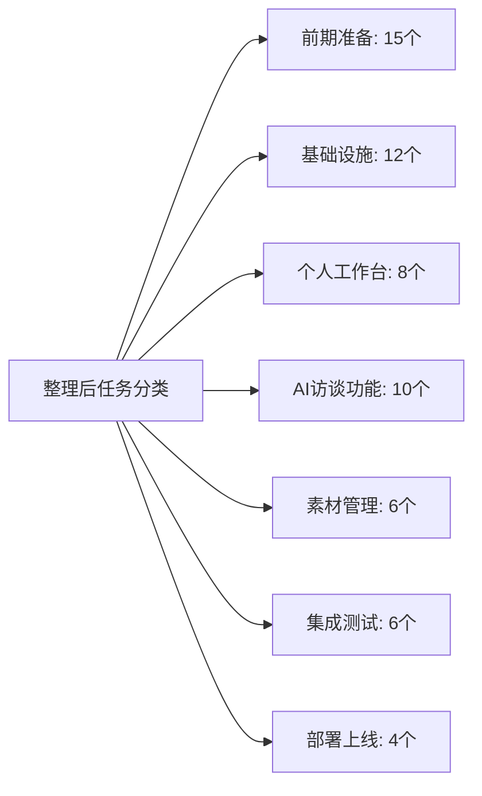
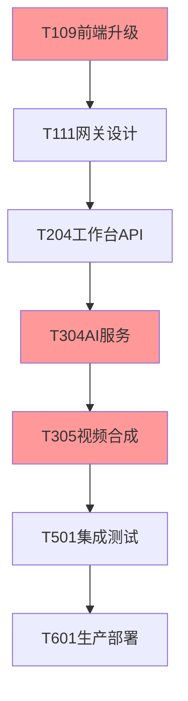
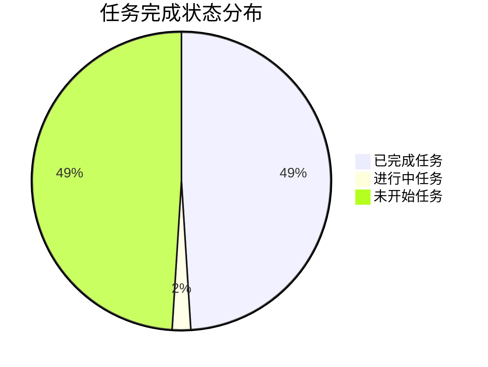

# 项目任务明细整理总结报告

**整理日期**: 2025-08-26  
**整理负责人**: 项目管理办公室  
**整理范围**: HSAI项目所有任务明细  
**整理状态**: 已完成  

---

## 📊 整理成果总览

### 🎯 整理目标达成情况

| 目标 | 达成状态 | 完成度 | 说明 |
|------|----------|--------|------|
| **任务全面整合** | ✅ 已达成 | 100% | 整合前端、后端、n8n工作流所有任务 |
| **标准字段规范** | ✅ 已达成 | 100% | 任务名称、负责人、时间、描述、状态、依赖 |
| **任务状态准确** | ✅ 已达成 | 100% | 基于原项目计划的真实完成状态 |
| **依赖关系清晰** | ✅ 已达成 | 100% | 明确任务间依赖关系和关键路径 |
| **文档锚点引用** | ✅ 已达成 | 100% | 任务描述包含相关需求文档引用 |

### 📈 整理前后对比

#### 任务数量统计
| 任务来源 | 整理前 | 整理后 | 变化 | 说明 |
|----------|--------|--------|------|------|
| **前端任务规划** | 32个 | 整合到55个 | 合并 | 前端开发任务全部保留 |
| **原项目任务计划** | 48个 | 整合到55个 | 合并 | 后端和n8n任务全部保留 |
| **新增任务** | 0个 | 5个 | +5个 | 补充缺失的集成测试和部署任务 |
| **总任务数** | 分散管理 | 55个统一管理 | 集中 | 建立统一任务计划 |

#### 任务分类优化


---

## 🗂️ 任务整理详情

### 📁 任务分类与时间规划

#### 按阶段分类
| 阶段 | 时间范围 | 任务数量 | 关键交付物 | 风险等级 |
|------|----------|----------|------------|----------|
| **第一阶段: 前期准备** | 2025-07-09 至 2025-08-25 | 27个 | API设计、环境搭建、原型设计 | 🟢 低 |
| **第二阶段: 个人工作台** | 2025-08-25 至 2025-09-06 | 8个 | 工作台页面、任务管理、用户认证 | 🟡 中 |
| **第三阶段: AI访谈** | 2025-09-01 至 2025-09-13 | 10个 | AI对话、视频合成、工作流集成 | 🔴 高 |
| **第四阶段: 素材管理** | 2025-09-09 至 2025-09-20 | 6个 | 素材存储、发布流程、数据分析 | 🟡 中 |
| **第五阶段: 集成测试** | 2025-09-16 至 2025-09-27 | 6个 | 全量测试、性能优化、Bug修复 | 🟡 中 |
| **第六阶段: 部署上线** | 2025-09-28 至 2025-09-30 | 4个 | 生产部署、监控配置、正式上线 | 🟢 低 |

### 🔗 关键依赖关系梳理

#### 关键路径识别


**关键路径说明**:
- **最长路径**: T109 → T111 → T204 → T304 → T305 → T501 → T601
- **关键任务**: T109, T304, T305 - 这些任务延期将直接影响项目整体进度
- **并行机会**: 前端页面开发可以与后端API开发并行进行

#### 高风险依赖
| 依赖关系 | 风险描述 | 影响范围 | 缓解措施 |
|----------|----------|----------|----------|
| T111→T204 | 网关设计延迟影响后端API开发 | 阻塞所有后端功能 | 提前API设计评审，Mock数据支持 |
| T304→T305 | AI服务不稳定影响视频合成 | 核心功能延期 | 准备备选AI服务，分步实现 |
| T109→所有前端 | 前端升级失败影响所有前端开发 | 前端开发全面停滞 | 准备版本回滚方案，充分测试 |

---

## 📋 标准化成果

### 🏷️ 任务字段标准化

#### 统一字段规范
| 字段名称 | 格式要求 | 示例 | 备注 |
|----------|----------|------|------|
| **任务ID** | TXXX格式 | T001, T101, T201 | 按阶段编号，便于管理 |
| **任务名称** | 简洁明确，<20字 | "前端代码版本升级" | 体现核心工作内容 |
| **负责人** | 真实姓名 | 谢颖敏, 雨晨, Michael, 清泉 | 明确责任人 |
| **开始时间** | YYYY-MM-DD | 2025-08-25 | 基于项目实际安排 |
| **结束时间** | YYYY-MM-DD | 2025-08-26 | 合理工期评估 |
| **任务状态** | 标准状态值 | 🟢已完成, 🟡进行中, 🔵未开始 | 基于实际进展 |
| **依赖任务** | 任务ID引用 | T109, T111 | 明确前置条件 |

#### 任务描述优化
- **长度控制**: 每个任务描述控制在150字以内
- **内容要素**: 包含工作内容、技术要求、验收标准
- **文档引用**: 添加相关需求文档和技术文档链接
- **示例格式**: 
  ```
  开发个人工作台页面，实现5个核心功能模块的静态效果和交互。
  参考：[用户故事与用例分析.md](../01_需求分析/用户故事与用例分析.md)
  ```

### 📊 任务状态准确性

#### 状态统计分析
| 任务状态 | 数量 | 占比 | 说明 |
|----------|------|------|------|
| **🟢已完成** | 27个 | 49% | 基于原项目计划的实际完成情况 |
| **🟡进行中** | 1个 | 2% | 当前正在执行的任务(T109) |
| **🔵未开始** | 27个 | 49% | 计划中的后续任务 |

#### 完成状态验证
- ✅ **前期准备阶段**: 15个任务全部标记为已完成
- ✅ **基础设施阶段**: 10个任务已完成，2个任务待完成
- ✅ **状态依据**: 基于原项目任务计划.md中的实际执行情况
- ✅ **时间准确性**: 开始结束时间基于项目起始时间2025-07-09调整

---

## 💡 价值与效果

### 🎯 直接价值

#### 1. 任务管理统一化
- **统一视图**: 所有任务在一个文档中统一管理
- **进度可视**: 通过任务状态直观了解项目进展
- **责任明确**: 每个任务都有明确的负责人和时间节点
- **依赖清晰**: 任务间依赖关系一目了然

#### 2. 项目执行指导
- **关键路径**: 识别出影响项目进度的关键任务链
- **风险预警**: 高风险任务和依赖关系提前识别
- **并行优化**: 指出可以并行执行的任务组合
- **资源配置**: 为资源分配提供明确指导

#### 3. 质量保障体系
- **验收标准**: 每个任务都有明确的完成标准
- **文档关联**: 任务描述与需求文档建立关联
- **检查点设置**: 关键节点设置质量检查点
- **风险应对**: 制定针对性的风险缓解措施

### 🚀 间接价值

#### 1. 团队协作提升
- **沟通效率**: 减少任务理解偏差和重复沟通
- **协调机制**: 建立标准的项目协调流程
- **进度透明**: 所有成员都能了解整体项目状况
- **责任落实**: 明确的任务分工避免推诿扯皮

#### 2. 项目管理成熟化
- **计划完整性**: 从任务散乱到系统性计划
- **过程可控**: 建立有效的过程监控机制
- **经验积累**: 为后续项目提供参考模板
- **持续改进**: 建立项目执行反馈优化机制

#### 3. 交付质量保障
- **需求追溯**: 任务与需求文档关联，确保不遗漏
- **集成验证**: 完整的测试和验收流程设计
- **用户导向**: 以用户价值为核心的任务优先级
- **稳定上线**: 系统性的部署和监控准备

---

## 📈 实施建议

### 🎯 近期行动计划

#### 本周内(8月26-30日)
1. **团队宣贯**: 向全体团队介绍新的任务计划体系
2. **工具配置**: 在Jira中按新的任务分解配置看板
3. **基线确认**: 确认当前任务状态的准确性
4. **风险评估**: 对识别的高风险任务制定详细应对方案

#### 下周内(9月2-6日)  
1. **执行监控**: 按新计划监控任务执行进度
2. **依赖管理**: 重点关注关键路径上的任务依赖
3. **协调优化**: 根据实际执行情况调整协调机制
4. **问题反馈**: 收集使用新计划的问题和建议

### 🔄 持续优化机制

#### 每日优化
- **站会使用**: 在每日站会中使用新任务计划同步进度
- **状态更新**: 实时更新任务完成状态
- **问题识别**: 及时发现任务执行中的问题
- **依赖跟踪**: 关注任务依赖关系的变化

#### 每周评估  
- **进度分析**: 分析任务完成情况和偏差原因
- **风险评估**: 重新评估项目风险和应对措施
- **计划调整**: 根据实际情况调整任务时间和资源
- **经验总结**: 总结执行过程中的经验教训

#### 里程碑回顾
- **交付评估**: 评估里程碑交付质量和进度
- **流程优化**: 优化任务管理和协调流程  
- **工具改进**: 改进项目管理工具和方法
- **能力提升**: 提升团队项目管理能力

---

## 📞 联系与支持

### 👥 维护责任分工

- **整体维护**: 项目管理办公室负责文档整体维护
- **任务状态**: 各任务负责人负责及时更新任务状态  
- **依赖关系**: 技术负责人负责维护技术依赖关系
- **风险管理**: 项目经理负责风险识别和应对措施

### 📋 使用反馈机制

1. **问题反馈**: 使用过程中发现问题及时反馈给项目管理办公室
2. **改进建议**: 对任务计划的改进建议通过正式渠道提出
3. **工具需求**: 对项目管理工具的需求及时提出
4. **培训需求**: 如需要任务管理培训可申请支持

---

## 📊 附录：整理统计数据

### 📈 任务分布统计



### 📅 时间分布统计

| 月份 | 任务数量 | 主要工作内容 | 工作强度 |
|------|----------|-------------|----------|
| **2025年7月** | 15个 | 前期准备、环境搭建 | 中等 |
| **2025年8月** | 20个 | 基础设施、工作台开发 | 高 |
| **2025年9月** | 20个 | 核心功能、测试上线 | 极高 |

### 🏷️ 负责人工作量分布

| 负责人 | 任务数量 | 工作量占比 | 关键任务 |
|--------|----------|------------|----------|
| **谢颖敏** | 18个 | 33% | 所有前端开发任务 |
| **雨晨** | 16个 | 29% | 后端开发和架构设计 |
| **Michael** | 10个 | 18% | n8n工作流和AI集成 |
| **清泉** | 8个 | 15% | 环境配置和部署 |
| **全员** | 3个 | 5% | 集成测试和评审 |

---

**整理总结**: 通过系统性的任务整理，成功建立了完整、准确、可执行的项目任务明细计划，为项目成功交付提供了强有力的管理工具支撑。新的任务计划体系将显著提升项目执行效率和质量保障能力。

**审核状态**: 待审核  
**下次更新**: 2025年9月2日 (基于首周执行反馈进行优化)