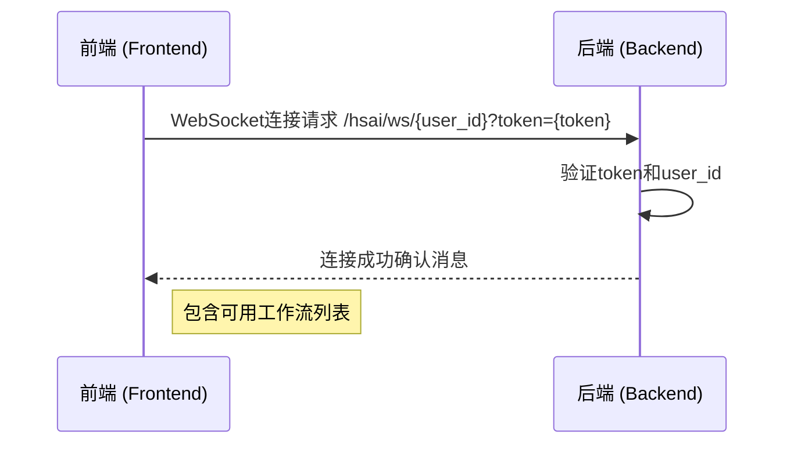
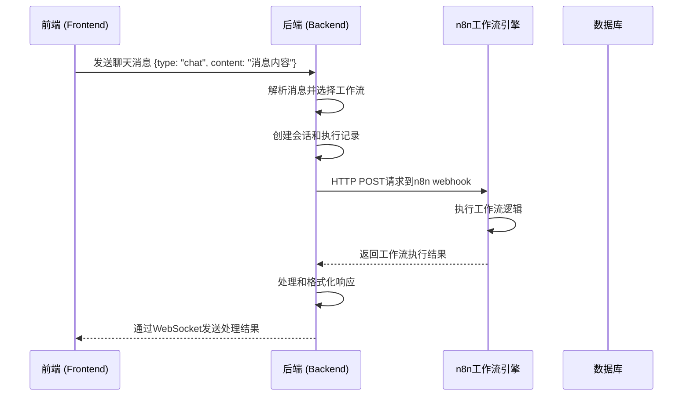
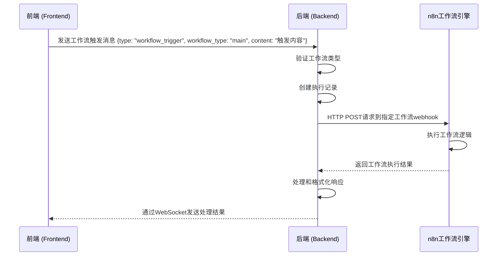
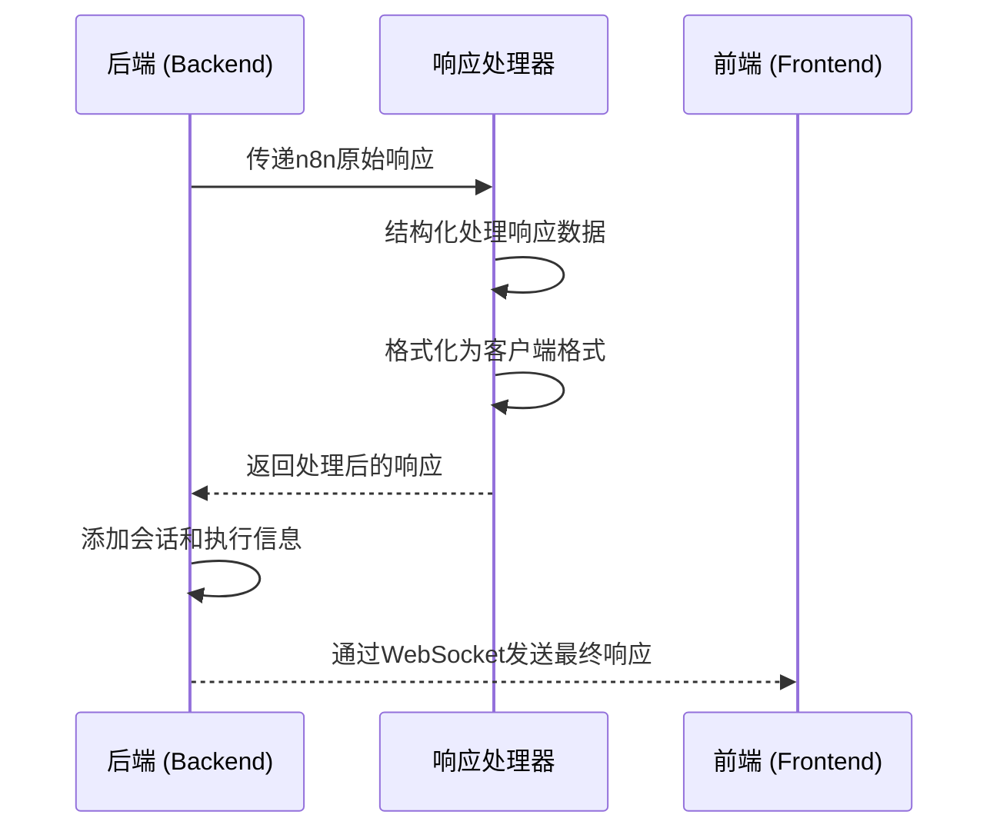
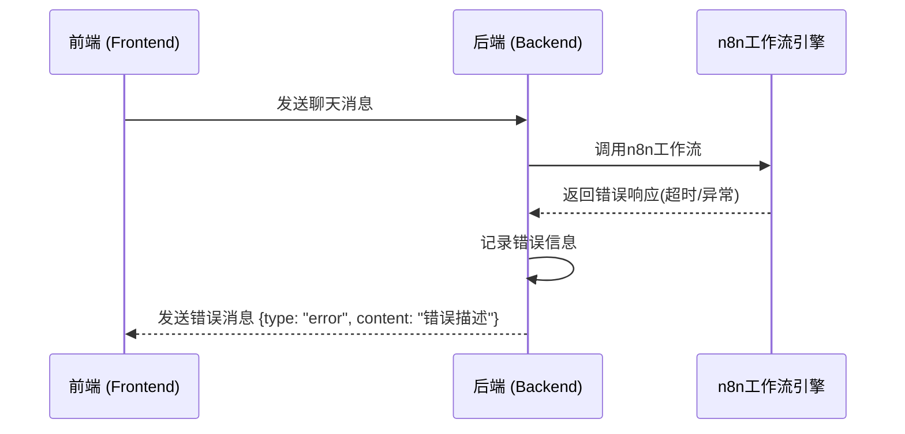
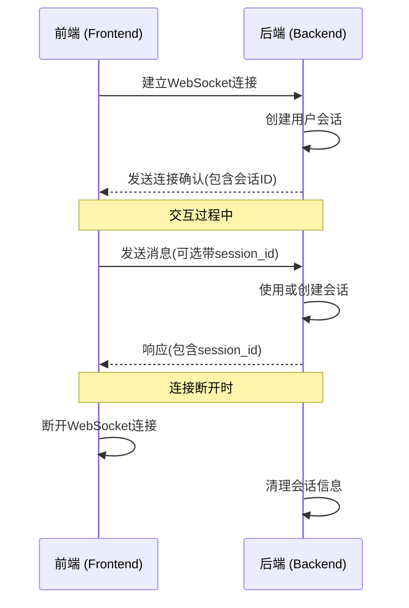

# HSAI详细交互场景与通讯方案说明

**版本**: v1.2.0  
**更新日期**: 2025-09-13  
**适用范围**: 前端 ↔ 后端 ↔ n8n工作流  

## 技术通讯架构方案

### OpenWebUI + n8n 通讯方案

```
客户端 ←→ OpenWebUI后端 ←→ n8n工作流引擎 ←→ 数据库
         ↕                  ↕
    WebSocket实时通信     HTTP WebHook调用
         ↕                  ↕
      用户界面          工作流处理逻辑
```

### 阶段一：HTTP协议优化方案

#### 工作流服务架构
```python
class WorkflowService:
    def __init__(self):
        self.n8n_webhooks = {
            "main": "https://webhook-n8n.hsai.cc/webhook/hROwwd7UTCzQeFxj",
            "company_info": "https://webhook-n8n.hsai.cc/webhook/cXeGsB422GErqFvi",
            "viral_learning": "https://webhook-n8n.hsai.cc/webhook/VuLYqKoSILQRHJ1r",
            "video_scraping": "https://webhook-n8n.hsai.cc/webhook/p8IAfFdOW4xfKICE"
        }
        self.llm_client = self._init_llm_client()
        
    async def process_workflow_request(self, request: WorkflowRequest) -> WorkflowResponse:
        """处理工作流请求的主入口"""
        try:
            # 1. 调用n8n工作流
            raw_response = await self._call_n8n_workflow(request)
            
            # 2. 结构化处理响应
            structured_response = await self._structure_response(raw_response, request)
            
            # 3. 验证和修复响应格式
            validated_response = await self._validate_and_fix_response(structured_response)
            
            return WorkflowResponse(
                success=True,
                data=validated_response,
                metadata={
                    "workflow_type": request.workflow_type,
                    "execution_time": datetime.now().isoformat(),
                    "session_id": request.session_id
                }
            )
        except Exception as e:
            return self._create_error_response(str(e))
```

### 阶段二：WebSocket实时通信

#### WebSocket事件管理
```javascript
class HSAIWebSocketClient {
    constructor(userId, token) {
        this.userId = userId;
        this.token = token;
        this.eventHandlers = new Map();
    }
    
    connect() {
        this.ws = new WebSocket(`ws://localhost:8080/hsai/ws/${this.userId}?token=${this.token}`);
        
        this.ws.onmessage = (event) => {
            const message = JSON.parse(event.data);
            this.handleMessage(message);
        };
    }
    
    handleMessage(message) {
        const handler = this.eventHandlers.get(message.type);
        if (handler) {
            handler(message);
        }
    }
    
    sendMessage(type, content, options = {}) {
        const message = {
            type,
            content,
            user_id: this.userId,
            timestamp: Date.now(),
            ...options
        };
        
        this.ws.send(JSON.stringify(message));
    }
}
```  

## 交互时序图

### 1. WebSocket连接建立时序



### 2. 聊天消息处理流程时序



### 3. 直接工作流触发流程时序



### 4. 工作流响应处理时序



### 5. 错误处理流程时序



### 6. 会话管理时序



## 详细交互场景  

## 1. 用户登录并建立WebSocket连接

### 1.1 场景描述
用户成功登录系统后，前端需要建立与后端的WebSocket连接以接收实时通知。

### 1.2 交互流程
1. 用户登录成功，前端获取到用户ID和认证token
2. 前端构造WebSocket连接URL: `/hsai/ws/{user_id}?token={token}`
3. 建立WebSocket连接
4. 后端验证认证信息
5. 验证通过后，后端发送连接确认消息，包含可用工作流列表

### 1.3 消息示例

**前端连接请求**:
```
WebSocket URL: ws://localhost:8080/hsai/ws/user_123?token=eyJhbGciOiJIUzI1NiIsInR5cCI6IkpXVCJ9...
```

**后端响应**:
```json
{
  "type": "status",
  "content": "连接成功",
  "timestamp": 1640995200.0,
  "available_workflows": [
    {
      "type": "main",
      "name": "主工作流",
      "description": "主工作流 - 处理通用对话和任务分发"
    },
    {
      "type": "company_info",
      "name": "公司信息收集及作战地图梳理",
      "description": "公司信息收集及作战地图梳理 - 收集公司信息并生成作战地图"
    }
  ]
}
```

## 2. 发送普通聊天消息

### 2.1 场景描述
用户在对话界面输入普通消息，系统需要将其路由到合适的工作流进行处理。

### 2.2 交互流程
1. 用户在前端输入消息并发送
2. 前端通过WebSocket发送聊天消息
3. 后端接收到消息后进行处理
4. 根据消息内容和入口类型选择工作流
5. 调用n8n工作流webhook
6. n8n处理完成后返回结果
7. 后端处理响应并格式化
8. 通过WebSocket将结果发送回前端

### 2.3 消息示例

**前端发送**:
```json
{
  "type": "chat",
  "content": "帮我分析一下这家公司的信息",
  "user_id": "user_123",
  "entry_type": "company"
}
```

**后端处理过程**:
1. 接收消息并解析
2. 根据`entry_type: "company"`选择公司信息收集工作流
3. 生成会话ID: `session_user_123_1640995200`
4. 调用n8n webhook: `https://webhook-n8n.hsai.cc/webhook/company-info`

**n8n响应**:
```json
{
  "success": true,
  "message": "公司信息收集完成",
  "company_info": {
    "name": "示例公司",
    "industry": "科技",
    "size": "100-500人"
  },
  "battle_map": {
    "strengths": ["技术优势", "团队经验"],
    "weaknesses": ["市场知名度"],
    "opportunities": ["新兴市场"],
    "threats": ["竞争加剧"]
  }
}
```

**后端发送给前端**:
```json
{
  "type": "workflow_response",
  "content": "公司信息收集完成",
  "timestamp": 1640995200.0,
  "session_id": "session_user_123_1640995200",
  "user_id": "user_123",
  "execution_id": "exec_456",
  "data": {
    "company_info": {
      "name": "示例公司",
      "industry": "科技",
      "size": "100-500人"
    },
    "battle_map": {
      "strengths": ["技术优势", "团队经验"],
      "weaknesses": ["市场知名度"],
      "opportunities": ["新兴市场"],
      "threats": ["竞争加剧"]
    }
  }
}
```

## 3. 直接触发指定工作流

### 3.1 场景描述
用户通过特定操作直接触发某个工作流，绕过智能路由。

### 3.2 交互流程
1. 用户执行特定操作（如点击"收集公司信息"按钮）
2. 前端明确指定工作流类型发送消息
3. 后端直接调用指定的工作流
4. 后续流程与普通聊天消息相同

### 3.3 消息示例

**前端发送**:
```json
{
  "type": "workflow_trigger",
  "content": "收集公司信息",
  "user_id": "user_123",
  "workflow_type": "company_info"
}
```

## 4. 处理n8n响应错误

### 4.1 场景描述
n8n工作流执行过程中出现错误，需要向前端报告。

### 4.2 交互流程
1. 后端调用n8n webhook
2. n8n返回错误响应或超时
3. 后端捕获错误并处理
4. 向前端发送错误消息

### 4.3 消息示例

**n8n错误响应**:
```json
{
  "success": false,
  "message": "文件解析失败",
  "error": "不支持的文件格式"
}
```

**后端发送给前端**:
```json
{
  "type": "error",
  "content": "工作流处理失败: 文件解析失败",
  "timestamp": 1640995200.0,
  "session_id": "session_user_123_1640995200",
  "user_id": "user_123",
  "execution_id": "exec_456"
}
```

## 5. 会话维持与管理

### 5.1 场景描述
用户在一次会话中进行多次交互，系统需要正确管理会话状态。

### 5.2 交互流程
1. 用户首次交互时创建会话
2. 后续交互使用相同会话ID
3. 会话在连接断开后保留一段时间

### 5.3 消息示例

**首次交互**:
```json
// 前端发送
{
  "type": "chat",
  "content": "分析公司信息",
  "user_id": "user_123"
}

// 后端响应(包含新创建的会话ID)
{
  "type": "workflow_response",
  "content": "分析完成",
  "session_id": "session_user_123_1640995200",
  "user_id": "user_123"
}
```

**后续交互**:
```json
// 前端发送(可选带session_id)
{
  "type": "chat",
  "content": "基于刚才的分析，制定竞争策略",
  "user_id": "user_123",
  "session_id": "session_user_123_1640995200"
}

// 后端响应(使用相同会话ID)
{
  "type": "workflow_response",
  "content": "策略制定完成",
  "session_id": "session_user_123_1640995200",
  "user_id": "user_123"
}
```