# n8n工作流详细设计文档

**版本**: v1.0.0  
**更新日期**: 2025-10-04  
**作者**: AI助手

## 1. 概述

本文档详细描述了HSAI项目中使用的n8n工作流系统的设计和实现。n8n工作流系统是HSAI平台的核心组件之一，负责处理视频内容的获取、处理、合成和发布等自动化任务。

## 2. 工作流架构总览

HSAI系统中共有11个工作流，可以分为以下几类：

### 2.1 核心业务工作流
- 1公司信息收集及作战地图梳理-雨晨后端对接.json
- 2主工作流.json
- 前端确认学习流.json

### 2.2 视频处理工作流
- 2视频爬取agent.json
- 3异步-视频爬取关键词分析.json
- 4videotext2videojson_agent.json
- 5videojson2video_agent.json
- 6video2tk.json

### 2.3 数据管理与维护工作流
- 建表及查博主信息的流.json
- 功能-webhook触发对关键词的爬取-给后端雨晨用.json

### 2.4 辅助工作流
- 3keywords2videotext_agent.json

### 2.5 其他工作流
无

## 3. 核心工作流详解

### 3.1 1公司信息收集及作战地图梳理-雨晨后端对接.json

#### 3.1.1 工作流功能
该工作流负责收集企业信息并生成作战地图，与后端系统对接。

#### 3.1.2 主要节点
- **Webhook**: 接收来自后端的请求
- **Code**: 处理文件数据
- **Split Out**: 分割文件数据
- **Loop Over Items**: 循环处理文件
- **Switch**: 根据文件类型进行分类处理
- **Convert to File**: 将数据转换为文件格式
- **Extract from File**: 从文件中提取内容
- **Aggregate**: 聚合提取的内容
- **chat1 (AI Agent)**: 主要的AI对话代理
- **collect_message1**: 信息收集工具
- **message_analy1**: 消息分析工具
- **blue_image1**: 视频制作蓝图工具

#### 3.1.3 工作流程
1. 通过Webhook接收后端请求
2. 处理上传的文件数据
3. 根据文件类型(MIME类型)进行分类
4. 提取文件内容并聚合
5. 使用AI Agent进行信息收集、分析和视频制作蓝图生成
6. 将结果通过Redis发送回后端

#### 3.1.4 数据库交互
- 使用PostgreSQL存储企业关键信息
- 表: hsai_business_key_messages

#### 3.1.5 时序图
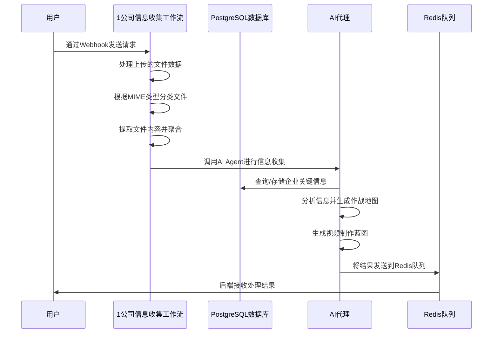

### 3.2 2主工作流.json

#### 3.2.1 工作流功能
主工作流负责协调整个视频创作和发布流程。

#### 3.2.2 主要节点
- **Webhook**: 接收用户请求
- **AI Agent**: 主要的AI对话代理
- **keywords2videotext_agent**: 关键词转视频文本工具
- **videotext2videojson_agent**: 视频文本转JSON工具
- **videojson2video_agent**: JSON转视频工具
- **videototk**: 视频发布到TikTok工具

#### 3.2.3 工作流程
1. 接收用户输入信息
2. 通过AI Agent管理整个流程状态
3. 根据用户需求调用不同工具:
   - 提取作战地图和待测试脚本库数量
   - 从文案到选定脚本
   - 从脚本到视频合成
   - 发布视频
4. 将结果返回给前端

#### 3.2.4 状态管理
工作流维护四个状态:
1. `STATE_WAITING_FOR_TEXT_SELECTION`: 等待用户确认执行调取待测试库视频开始合成视频
2. `STATE_WAITING_FOR_JSON_SELECTION`: 等待用户选择拍摄脚本
3. `STATE_WAITING_FOR_PUBLISH_CONFIRMATION`: 等待用户确认发布视频
4. `STATE_VIDEO_PUBLISHING`: 执行视频发布

#### 3.2.5 时序图
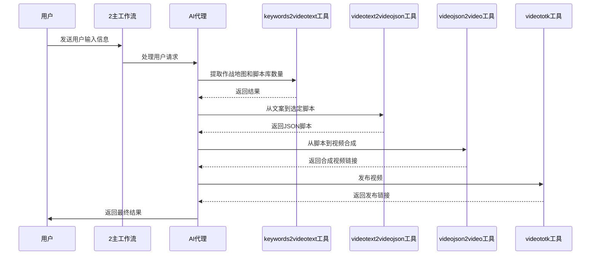

### 3.3 前端确认学习流.json

#### 3.3.1 工作流功能
处理前端确认的学习流程，生成新的视频内容。

#### 3.3.2 主要节点
- **Webhook**: 接收请求
- **企业信息/产品信息/目标人群**: 从数据库查询相关信息
- **AI Agent4**: 生成新的视频文案
- **入库**: 将学习到的内容写入数据库

#### 3.3.3 工作流程
1. 查询企业、产品和目标人群信息
2. 使用AI生成新的视频文案和标签
3. 将新内容写入已学习的素材表

#### 3.3.4 时序图
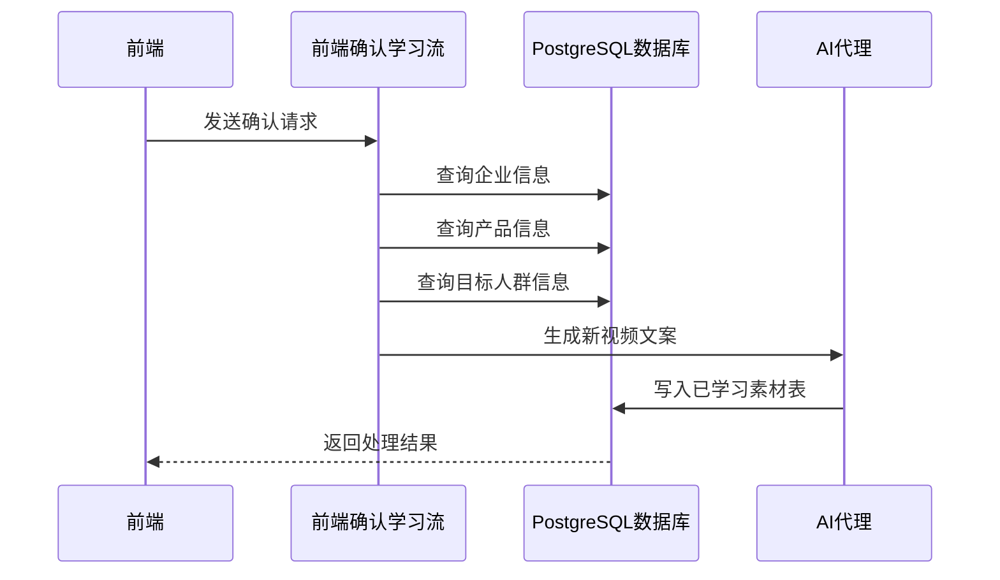

### 3.4 2视频爬取agent.json

#### 3.4.1 工作流功能
处理视频关键词的爬取任务。

#### 3.4.2 主要节点
- **When Executed by Another Workflow**: 接收其他工作流的调用
- **Insert rows in a table**: 将关键词插入数据库
- **Split Out**: 分割关键词
- **Loop Over Items**: 循环处理每个关键词
- **HTTP Request1**: 发送爬取请求

#### 3.4.3 工作流程
1. 接收关键词和企业名称
2. 将关键词信息存入数据库
3. 分割关键词并逐个处理
4. 调用异步爬取工作流进行视频爬取

#### 3.4.4 时序图
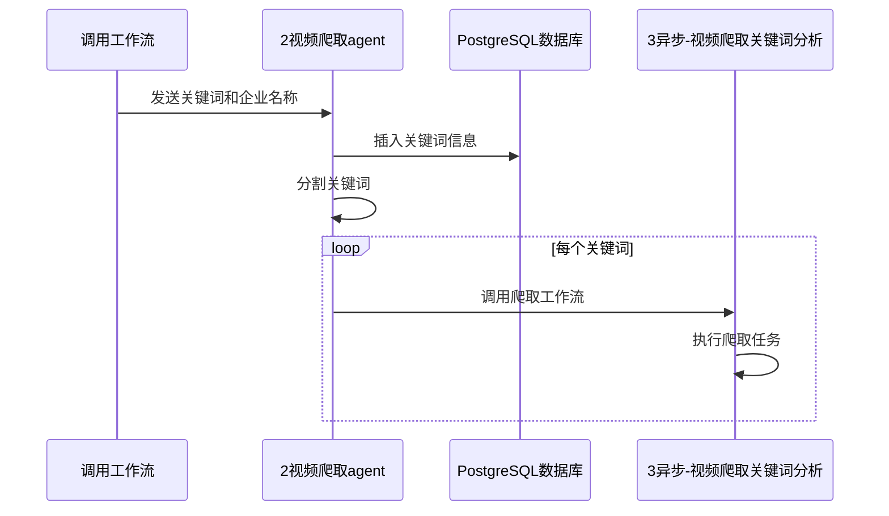

### 3.5 3异步-视频爬取关键词分析.json

#### 3.5.1 工作流功能
异步执行视频爬取和分析任务。

#### 3.5.2 主要节点
- **Webhook**: 接收爬取请求
- **爬视频**: 使用Apify爬取TikTok视频
- **Edit Fields**: 处理爬取结果
- **入库**: 将视频信息存入数据库

#### 3.5.3 工作流程
1. 接收关键词和企业名称
2. 使用Apify API爬取相关视频
3. 处理爬取结果并提取关键信息
4. 将视频信息存入数据库表hsai_business_good_video_v1

#### 3.5.4 时序图
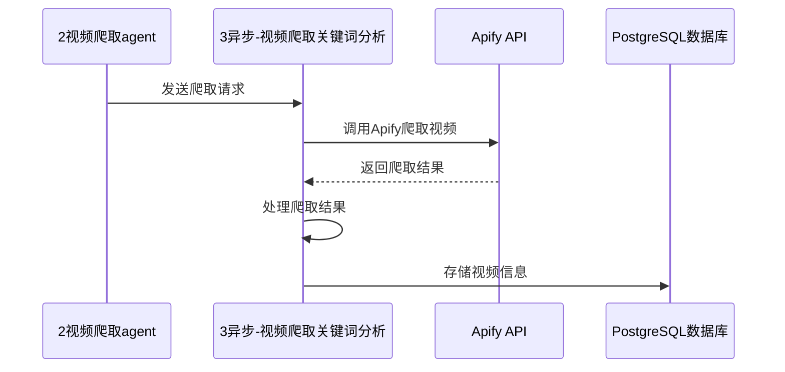

### 3.6 4videotext2videojson_agent.json

#### 3.6.1 工作流功能
将视频文本转换为JSON格式的拍摄脚本。

#### 3.6.2 主要节点
- **When Executed by Another Workflow**: 接收调用
- **企业信息/产品信息/目标人群**: 查询相关信息
- **AI Agent4**: 生成新的视频内容
- **Basic LLM Chain**: 处理文案结构

#### 3.6.3 工作流程
1. 查询企业相关信息
2. 使用AI生成10个不同的视频拍摄脚本
3. 分析文案结构并返回结果

#### 3.6.4 时序图
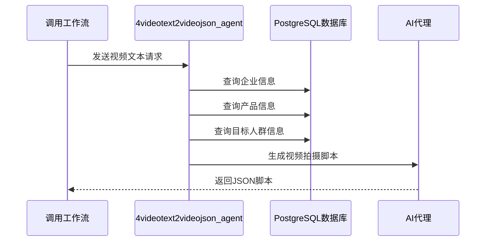

### 3.7 5videojson2video_agent.json

#### 3.7.1 工作流功能
将JSON格式的拍摄脚本转换为实际视频。

#### 3.7.2 主要节点
- **When Executed by Another Workflow**: 接收调用
- **get_tts_token**: 获取语音合成token
- **HTTP Request**: 发送TTS请求
- **识别场景**: 使用AI识别视频场景
- **oss1-oss5**: 获取视频片段
- **合成视频拿到链接**: 发送合成请求

#### 3.7.3 工作流程
1. 接收JSON格式的拍摄脚本
2. 使用阿里云TTS将文本转换为语音
3. 识别视频场景并匹配相应的视频片段
4. 将所有素材发送到GPU服务器进行视频合成

#### 3.7.4 时序图
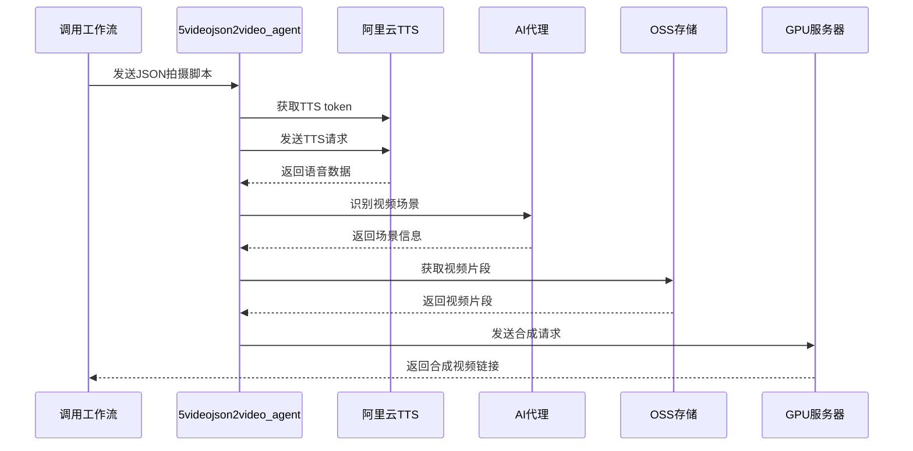

### 3.8 3keywords2videotext_agent.json

#### 3.8.1 工作流功能
该工作流负责从数据库中提取作战地图和待制作视频脚本库的信息，计算需要生成的视频数量。

#### 3.8.2 主要节点
- **When Executed by Another Workflow**: 接收其他工作流的调用
- **待制作视频脚本库**: 查询待制作的视频脚本
- **查询作战地图**: 查询企业的作战地图信息
- **Summarize**: 统计视频脚本数量
- **AI Agent**: 使用AI分析作战地图并计算需要生成的视频数量

#### 3.8.3 工作流程
1. 接收企业名称参数
2. 查询待制作视频脚本库中的视频数量
3. 查询企业的作战地图信息
4. 使用AI分析作战地图，计算需要生成的视频数量
5. 返回相关信息供主工作流使用

#### 3.8.4 时序图
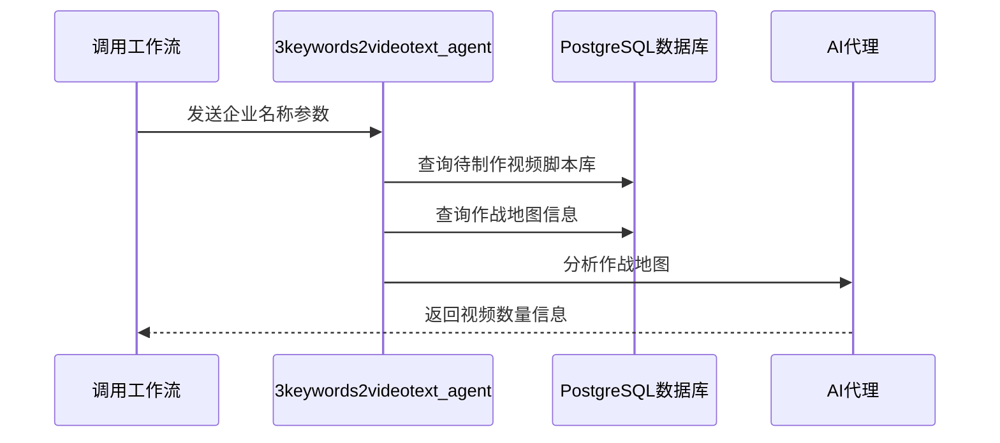

#### 3.8.4 数据库交互
- 查询表: hsai_business_video_content_to_learn（待制作视频脚本库）
- 查询表: hsai_business_key_messages（作战地图信息）

### 3.9 6video2tk.json

#### 3.9.1 工作流功能
将合成好的视频发布到TikTok平台。

#### 3.9.2 主要节点
- **When Executed by Another Workflow**: 接收调用
- **account ids**: 设置账户ID
- **Upload video**: 上传视频到Blotato服务器
- **publish post tiktok**: 发布视频到TikTok

#### 3.9.3 工作流程
1. 接收视频URL
2. 设置TikTok账户ID
3. 上传视频到Blotato服务器
4. 通过Blotato API发布视频到TikTok

#### 3.9.4 时序图
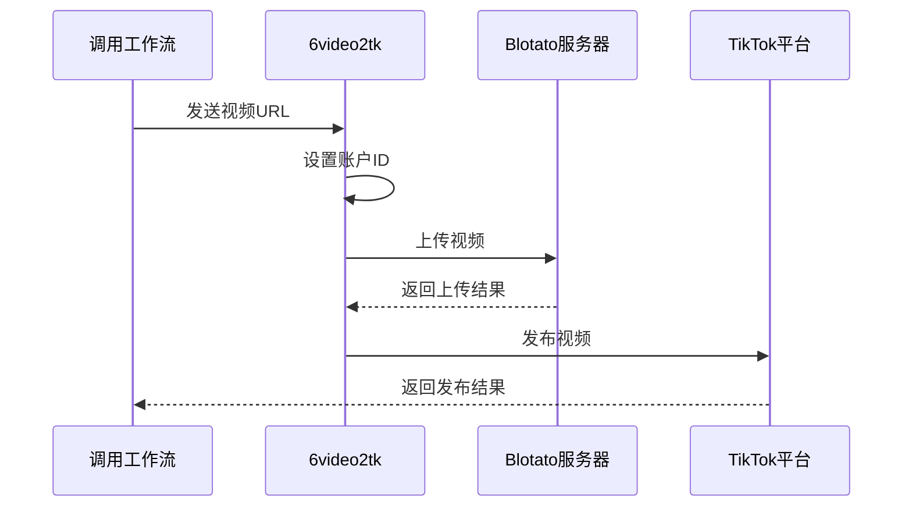

### 3.9 前端确认学习流.json

#### 3.9.1 工作流功能
处理前端确认的学习流程，生成新的视频内容并写入已学习的素材表。

#### 3.9.2 主要节点
- **Webhook**: 接收前端请求
- **企业信息/产品信息/目标人群**: 从数据库查询相关信息
- **AI Agent4**: 生成新的视频文案
- **写入已学习的素材**: 将学习到的内容写入数据库

#### 3.9.3 工作流程
1. 查询企业、产品和目标人群信息
2. 使用AI生成新的视频文案和标签
3. 将新内容写入已学习的素材表

#### 3.9.4 时序图


### 3.10 2视频爬取agent.json

#### 3.10.1 工作流功能
处理视频关键词的爬取任务，将关键词信息存入数据库并调用异步爬取工作流。

#### 3.10.2 主要节点
- **When Executed by Another Workflow**: 接收其他工作流的调用
- **Insert rows in a table**: 将关键词插入数据库
- **Split Out**: 分割关键词
- **Loop Over Items**: 循环处理每个关键词
- **HTTP Request1**: 发送爬取请求

#### 3.10.3 工作流程
1. 接收关键词和企业名称
2. 将关键词信息存入数据库
3. 分割关键词并逐个处理
4. 调用异步爬取工作流进行视频爬取

#### 3.10.4 时序图


### 3.11 3异步-视频爬取关键词分析.json

#### 3.11.1 工作流功能
异步执行视频爬取和分析任务，使用Apify API爬取相关视频并存入数据库。

#### 3.11.2 主要节点
- **Webhook**: 接收爬取请求
- **爬视频**: 使用Apify爬取TikTok视频
- **Edit Fields**: 处理爬取结果
- **入库**: 将视频信息存入数据库

#### 3.11.3 工作流程
1. 接收关键词和企业名称
2. 使用Apify API爬取相关视频
3. 处理爬取结果并提取关键信息
4. 将视频信息存入数据库表hsai_business_good_video_v1

#### 3.11.4 时序图


### 3.12 4videotext2videojson_agent.json

#### 3.12.1 工作流功能
将视频文本转换为JSON格式的拍摄脚本，生成10个不同的视频拍摄脚本。

#### 3.12.2 主要节点
- **When Executed by Another Workflow**: 接收调用
- **企业信息/产品信息/目标人群**: 查询相关信息
- **AI Agent4**: 生成新的视频内容
- **Basic LLM Chain**: 处理文案结构

#### 3.12.3 工作流程
1. 查询企业相关信息
2. 使用AI生成10个不同的视频拍摄脚本
3. 分析文案结构并返回结果

#### 3.12.4 时序图


### 3.13 5videojson2video_agent.json

#### 3.13.1 工作流功能
将JSON格式的拍摄脚本转换为实际视频，使用阿里云TTS将文本转换为语音并发送到GPU服务器进行视频合成。

#### 3.13.2 主要节点
- **When Executed by Another Workflow**: 接收调用
- **get_tts_token**: 获取语音合成token
- **HTTP Request**: 发送TTS请求
- **识别场景**: 使用AI识别视频场景
- **oss1-oss5**: 获取视频片段
- **合成视频拿到链接**: 发送合成请求

#### 3.13.3 工作流程
1. 接收JSON格式的拍摄脚本
2. 使用阿里云TTS将文本转换为语音
3. 识别视频场景并匹配相应的视频片段
4. 将所有素材发送到GPU服务器进行视频合成

#### 3.13.4 时序图


### 3.14 建表及查博主信息的流.json

#### 3.14.1 工作流功能
负责数据库表的创建和博主信息的查询。

#### 3.14.2 主要节点
- **建表**: 创建数据库表
- **查博主**: 查询博主信息
- **写入新表**: 将数据写入新表

#### 3.14.3 工作流程
1. 创建必要的数据库表结构
2. 查询博主相关信息
3. 将数据写入相应的表中

#### 3.14.4 时序图
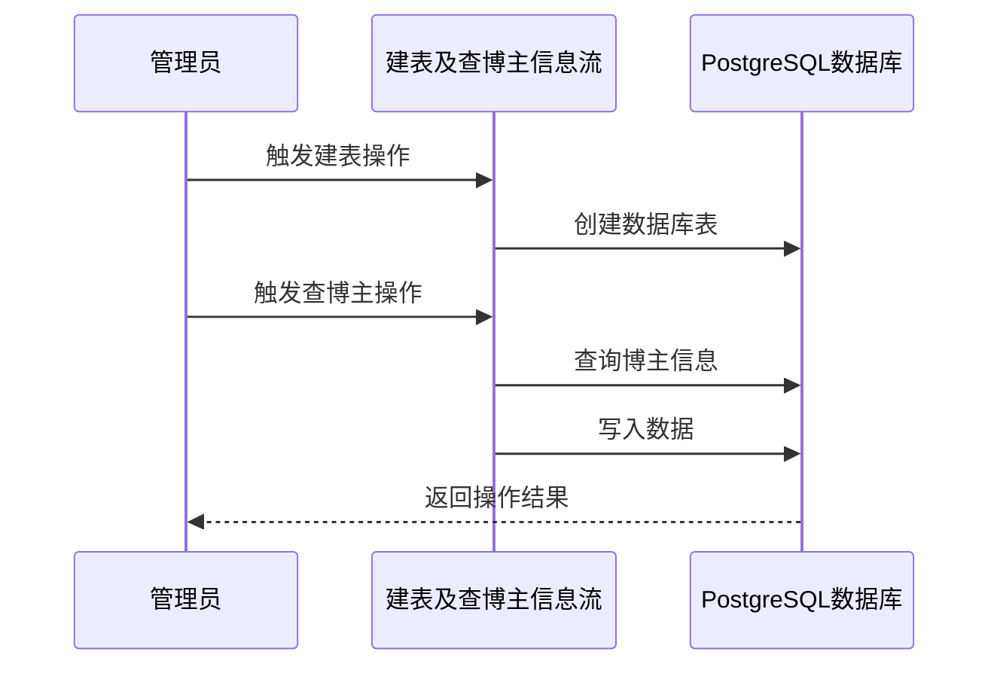

### 3.15 功能-webhook触发对关键词的爬取-给后端雨晨用.json

#### 3.15.1 工作流功能
通过Webhook触发对关键词的爬取任务，从数据库中查询关键词并调用爬取子工作流。

#### 3.15.2 主要节点
- **Webhook**: 接收Webhook请求
- **Select rows from a table**: 从数据库查询关键词
- **Edit Fields2/3**: 处理关键词数据
- **Split Out1**: 分割关键词
- **Remove Duplicates**: 去除重复关键词
- **Loop Over Items1**: 循环处理关键词
- **HTTP Request**: 发送爬取请求

#### 3.15.3 工作流程
1. 通过Webhook接收爬取请求
2. 从数据库中查询指定企业的关键词
3. 处理关键词数据，去除重复项
4. 对每个关键词调用爬取子工作流进行爬取

#### 3.15.4 时序图
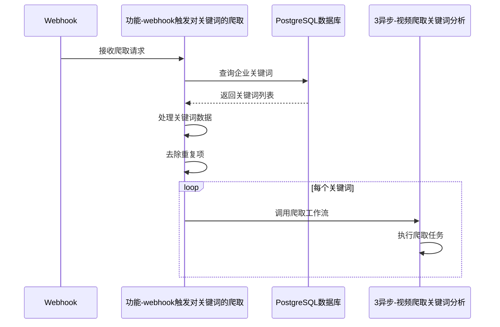


## 4. 数据库设计

### 4.1 主要数据表

#### 4.1.1 hsai_business_key_messages
存储企业关键信息:
- business_name: 企业名称
- message_type: 消息类型
- data_info: 数据信息
- session_id: 会话ID

#### 4.1.2 hsai_business_good_video_v1
存储爬取到的视频信息:
- businessname: 企业名称
- videourl: 视频URL
- music: 音乐名称
- text: 视频文本
- hashtags: 标签
- video_type: 视频类型
- publishedtime: 发布时间
- authorurl: 作者URL
- authorname: 作者名称
- authorid: 作者ID
- 统计数据字段(isad, diggCount, shareCount等)

#### 4.1.3 hsai_business_video_content_learned
存储已学习的视频内容:
- businessname: 企业名称
- videoid: 视频ID
- videourl: 视频URL
- videotranscript: 视频转录
- videoshots: 视频分镜
- newttscontent: 新的TTS内容
- newtags: 新标签

## 5. 集成与通信

### 5.1 与后端系统通信
- 使用Redis队列进行消息传递
- 通过Webhook接收和发送请求
- 使用PostgreSQL存储持久化数据

### 5.2 与前端通信
- 通过WebSocket实时推送状态更新
- 返回结构化的JSON响应

### 5.3 第三方服务集成
- **Apify**: 视频爬取服务
- **阿里云TTS**: 文本转语音服务
- **Blotato**: 社交媒体发布服务
- **Google Gemini**: AI内容生成服务

## 6. 部署与配置

### 6.1 环境变量
```
N8N_MAIN_WORKFLOW_URL=https://webhook-n8n.hsai.cc/webhook/n8n_chat
N8N_COMPANY_INFO_WORKFLOW_URL=https://webhook-n8n.hsai.cc/webhook/business_information_get
N8N_VIRAL_LEARNING_WORKFLOW_URL=https://webhook-n8n.hsai.cc/webhook/keywords2video
```

### 6.2 数据库配置
- PostgreSQL连接信息
- 表结构初始化脚本

### 6.3 第三方服务配置
- Apify API密钥
- 阿里云TTS凭证
- Blotato API密钥

## 7. 错误处理与监控

### 7.1 错误处理策略
- 重试机制: 对于网络请求失败的情况进行重试
- 错误日志: 记录详细的错误信息用于调试
- 状态回滚: 在失败时回滚到之前的状态

### 7.2 监控指标
- 工作流执行成功率
- 视频爬取成功率
- 视频合成成功率
- 视频发布成功率

## 8. 性能优化

### 8.1 并行处理
- 使用批处理节点处理多个任务
- 异步执行耗时操作

### 8.2 缓存策略
- 缓存频繁查询的数据
- 使用Redis存储临时状态

### 8.3 资源管理
- 合理分配GPU资源用于视频合成
- 控制并发请求数量避免服务过载

## 9. 安全考虑

### 9.1 数据安全
- 敏感信息加密存储
- 数据传输使用HTTPS
- 访问控制和身份验证

### 9.2 API安全
- API密钥管理
- 请求频率限制
- 输入验证和清理

## 10. 维护与升级

### 10.1 版本管理
- 工作流版本控制
- 数据库迁移脚本

### 10.2 监控与告警
- 系统健康检查
- 性能指标监控
- 异常情况告警

### 10.3 备份与恢复
- 定期备份工作流配置
- 数据库备份策略
- 灾难恢复计划