# 基于任务的对话管理系统优化方案

## 1. 方案概述

### 1.1 设计理念

本方案旨在构建一个基于任务的对话管理系统，通过将对话内容分解为最小工作单元（任务），避免因对话内容增长导致的上下文过长问题。系统将通过任务体系实现关键信息的阶段性切割，在较短对话中完成任务并保存进度，从而开启新的上下文对对话影响较小。

### 1.2 核心目标

1. **上下文管理优化**：通过任务划分对话上下文，避免长对话导致的信息丢失
2. **进度保存机制**：实现任务完成状态的持久化保存
3. **企业级隔离**：通过项目概念实现多企业数据隔离
4. **工作流集成**：深度集成n8n工作流，实现复杂业务逻辑处理
5. **配置热更新**：支持任务提示词和配置的动态更新，无需重启服务
6. **灵活的任务模板**：通过混合存储策略实现系统稳定性和用户自定义的平衡

## 2. 系统架构设计

### 2.1 核心概念

系统设计围绕以下几个核心概念构建：

1. **用户(User)**：系统的操作者和使用者，每个用户可以属于一个公司实体，可以创建和管理项目，执行各种任务。

2. **公司(Company)**：代表一个企业实体，是用户和项目的容器。一个公司可以有多个用户成员和多个项目，公司负责人拥有对该公司的管理权限。

3. **项目(Project)**：用户工作的基本单位，隶属于某个公司。项目包含了所有相关的工作任务，包括主线任务和循环任务。项目负责人负责项目的整体管理。

4. **主线任务(Main Task)**：项目创建时自动生成的关键任务，必须在循环任务启动前完成。这些任务通常涉及项目初始化和关键信息收集，每个项目实例中只能完成一次（除非重置）。主线任务根据处理方式可分为对话任务(dialog)、人工任务(manual)等类型。

5. **循环任务(Recurring Task)**：在主线任务全部完成后启动的周期性任务，基于战略地图的KPI自动生成，用于日常运营工作。循环任务可进一步分解为具体的子任务。

6. **子任务(Sub Task)**：循环任务的具体执行单元，如每日需要发布的视频内容制作任务。

7. **对话会话(Chat Session)**：用户与系统进行交互的界面，每个任务可以启动一个独立的对话会话来完成任务目标。

8. **n8n工作流**：外部工作流引擎，负责执行复杂的业务逻辑，与系统任务进行集成。

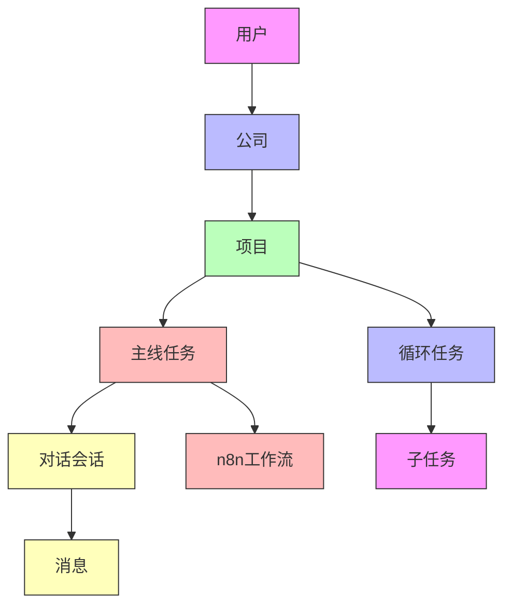

### 2.2 数据模型扩展

#### 2.2.1 公司模型 (Company)

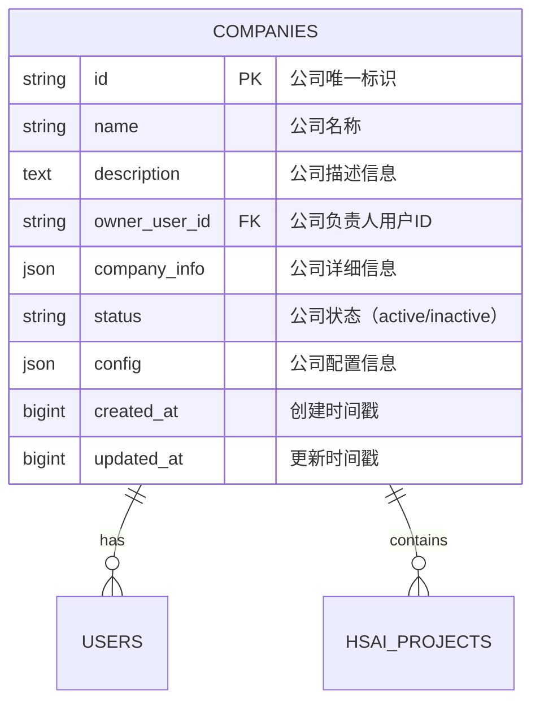

#### 2.2.2 用户模型扩展 (User)

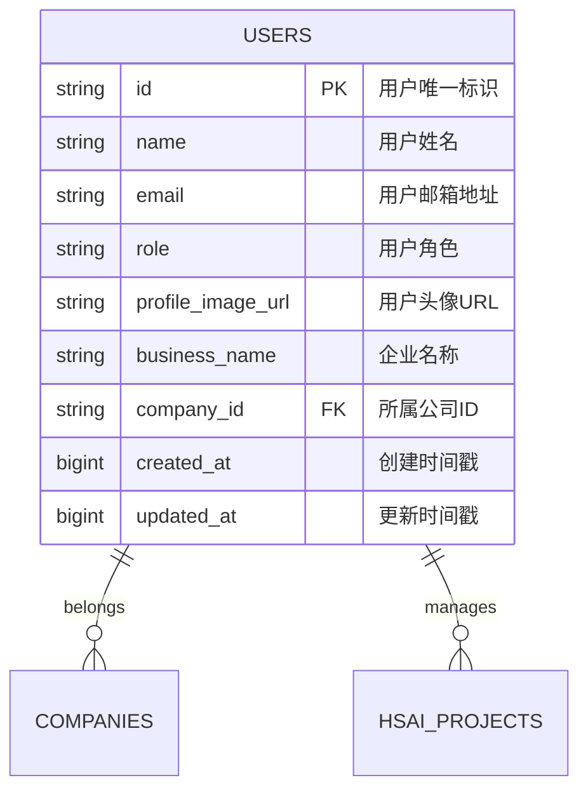

#### 2.2.3 项目模型扩展 (HSAIProject)

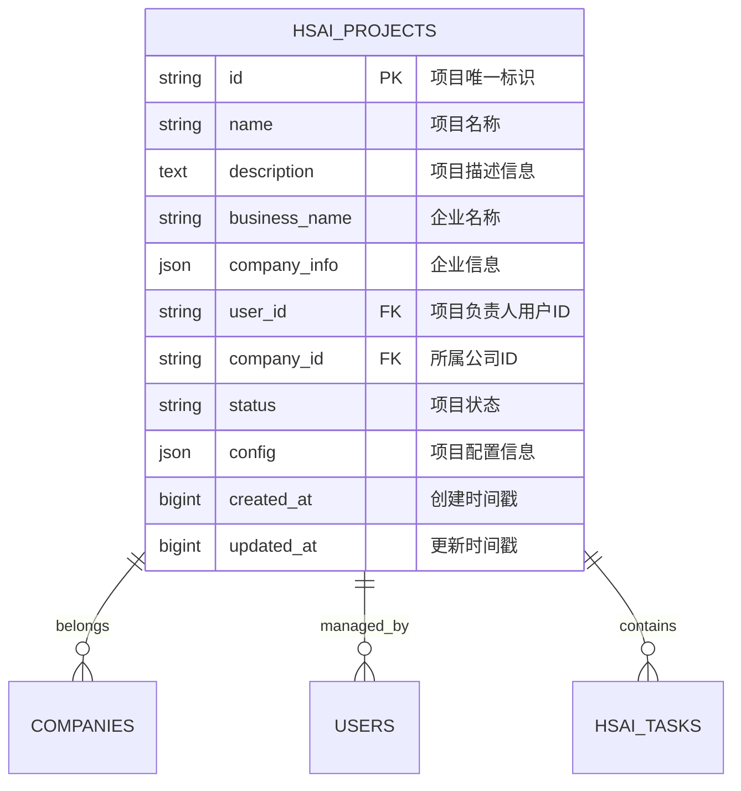

#### 2.2.4 任务模型扩展 (HSAITask)

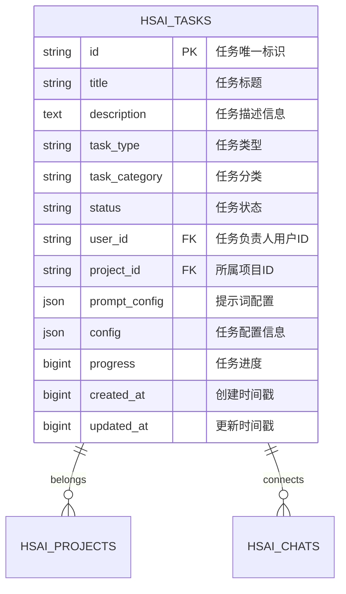

## 3. 核心功能实现

### 3.1 用户与公司管理机制

#### 3.1.1 用户创建流程

当用户通过接口创建时，需要提供公司名称：

1. 系统查找是否存在对应名称的公司
2. 如果存在，则将新创建用户与查找到的公司进行绑定
3. 如果不存在，则使用请求的公司名称创建一个新的公司，并将新创建用户与新创建公司进行绑定

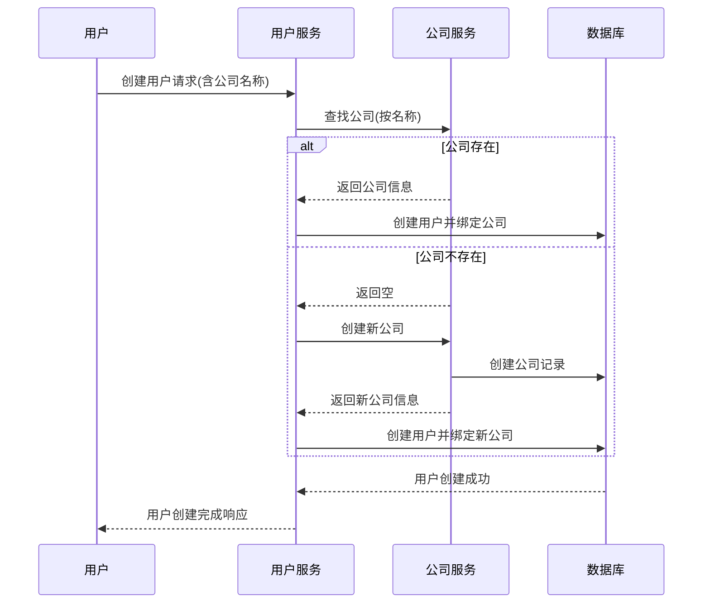

#### 3.1.2 公司与项目管理

1. 一个公司存在一个以上的用户绑定
2. 一个公司也可以有多个项目
3. 创建公司时的用户账号既是公司的负责人
4. 创建项目时的用户账号既是项目的负责人
5. 公司负责人可以管理公司信息和公司下属的项目及项目任务
6. 项目负责人可以管理项目项目信息及下属任务

#### 3.1.3 默认项目创建机制

为了确保任务能够正确归属，系统在创建公司时将自动创建一个默认项目：

1. 当创建新公司时，系统会自动生成一个默认项目
2. 默认项目名称为"{公司名称} - 默认项目"
3. 创建公司的用户将自动成为默认项目的负责人
4. 所有与该公司相关的任务都将默认归属于该项目，除非特别指定
5. 这样设计确保了公司与任务之间通过项目进行居中对接，保持数据结构的一致性

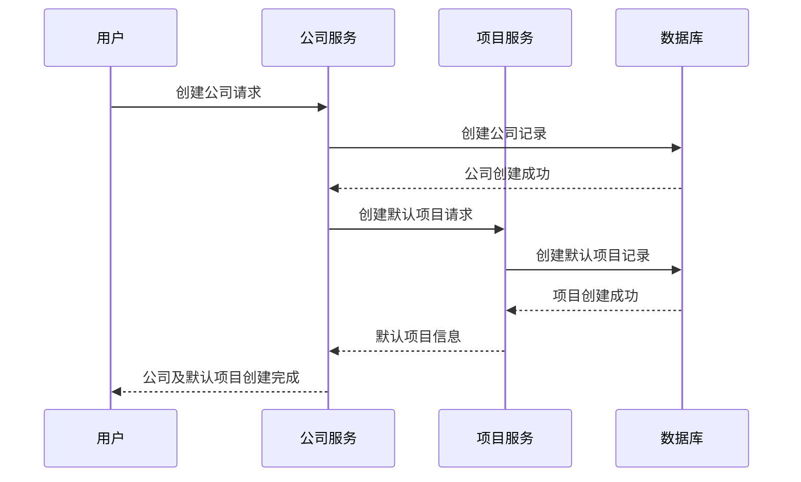

### 3.2 项目管理机制

#### 3.2.1 项目创建流程

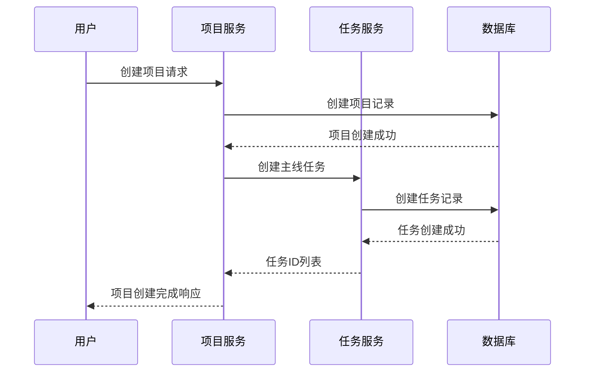

### 3.3 主线任务管理机制

#### 3.3.1 主线任务创建机制

1. 主线任务在创建项目的时候根据主线任务模板创建
2. 所有主线任务除了用户主动重置的情况外，在项目存续期间只能执行一次
3. 主线任务的模板由管理员在系统后台创建
4. 在项目创建时，根据已配置的主线任务模板自动创建任务
5. 默认的主线任务有：
   - 素材库补充
   - 社媒账号绑定
   - 企业信息收集（战略地图生成）

#### 3.3.2 主线任务执行机制

1. 主线任务没有先后顺序，用户可以任意选择主线任务完成，或者同时进行
2. 在每个主线任务完成时需要检查是否所有主线任务都已经完成
3. 只有主线任务都完成时才能开启循环任务
4. 否则在用户登录系统时进行socket通知用户有未完成的主线任务

### 3.4 循环任务管理机制

#### 3.4.1 循环任务创建机制

在战略地图的任务完成之后：

1. 将工作流返回的战略地图信息保存为一个循环任务
2. 每天自动根据战略地图的KPI设计和当前项目的视频发布情况计算当天需要完成的视频发布数量
3. 每个视频发布的需求产生一个视频发布的子任务

#### 3.4.2 循环任务执行机制

循环任务每天自动生成，根据战略地图的KPI和当前项目状态动态调整任务内容和数量。

### 3.5 任务状态管理机制

#### 3.5.1 任务状态定义

任务需要具有完成状态，分为：

- 待处理(pending)
- 处理中(in_progress)
- 已完成(completed)
- 已取消(cancelled)

#### 3.5.2 任务完成方式

任务的完成方式分为两种：

**第一种：对话完成**

1. 点击处理任务时，将携带任务id进入对话
2. 这个时候将任务设置为处理中
3. 任务的完成根据工作流发送的信号判断
4. 如果接收到工作流通过redis发送的指定信号，则将对应的任务设置为已完成

**第二种：人工处理**

1. 在点击处理时设置任务为处理中状态
2. 并且提供完成任务的跳转链接（比如素材补充的任务，跳转到素材管理页面，跳转的页面在模板中配置）
3. 在素材补充完成时点击任务完成修改任务状态
4. 在设置任务完成时需要检查素材清单的完成度，只有在素材清单都完成之后，才能设置素材补充的任务完成

#### 3.5.3 任务完成信号处理机制

为了实现任务的自动化完成，系统通过监听Redis队列中的工作流信号来更新任务状态。

#### 3.5.3.1 Redis队列监听设计

系统使用Redis信号处理器来监听指定队列中的消息，当n8n工作流完成任务处理后，会向Redis队列发送完成信号。

**监听队列**：

- 主要监听队列：`ai-conversation-agent-message-queue` - 用于处理对话代理消息
- 扩展监听队列：可根据业务需要添加更多队列

**消息格式**：

```json
{
  "env": "gray",
  "session_id": "会话ID",
  "user_id": "用户ID",
  "operate_id": "操作标识",
  "request_id": "请求ID",
  "socket_id": "Socket连接ID",
  "status": "FINISHED",
  "content_type": 1,
  "content": {
    "text": "返回的文本内容",
    "data": {
      "video_link": "视频链接"
    }
  },
  "create_ts": 1759163185072
}
```

#### 3.5.3.2 信号处理流程

当Redis信号处理器监听到队列中的消息时，将按照以下流程处理：

1. **消息接收**：Redis信号处理器通过`blpop`命令阻塞式监听指定队列，超时时间为30秒
2. **消息解析**：接收到消息后，解析JSON格式的消息内容
3. **任务查找**：根据消息中的`session_id`或`request_id`查找对应的任务
4. **状态更新**：调用任务服务更新任务状态为`completed`，并设置完成时间戳
5. **结果通知**：通过Socket.IO将任务完成状态通知给前端

#### 3.5.3.3 技术实现

**Redis信号处理器**：

```python
class RedisSignalHandler:
    def register_handler(self, signal_type: str, handler: Callable, config: Optional[Dict[str, Any]] = None):
        """注册信号处理器"""
        self._handlers[signal_type] = {
            "handler": handler,
            "config": config or {}
        }

    def _listen_to_queue(self, queue_name: str):
        """监听指定队列的消息"""
        redis_client = get_redis_client()
        result = redis_client.blpop([queue_name], timeout=30)
        # 解析并处理消息
```

**对话消息队列处理器**：

```python
def register_conversation_queue_handler(redis_queue_listener) -> None:
    """注册对话消息队列处理器"""
    redis_queue_listener.register_handler(
        "ai-conversation-agent-message-queue", 
        handle_conversation_agent_message,
        {
            "timeout": 30,
            "max_retry": 3,
            "dead_letter_queue": "conversation_agent_dead_letter"
        }
    )
```

**任务状态更新**：

```python
def update_task_by_id(self, task_id: str, form_data: HSAITaskUpdateForm) -> Optional[HSAITaskModel]:
    """更新任务状态"""
    task = db.get(HSAITask, task_id)
    if task:
        # 设置完成时间戳
        if form_data.status in [HSAITaskStatus.COMPLETED, HSAITaskStatus.FAILED]:
            setattr(task, 'completed_at', int(time.time()))
        db.commit()
        return HSAITaskModel.model_validate(task)
    return None
```

#### 3.5.3.4 n8n工作流集成

n8n工作流在完成处理后，通过Redis节点向指定队列发送消息：

1. **Redis节点配置**：
   
   - 操作类型：`push`
   - 队列名称：`ai-conversation-agent-message-queue`
   - 消息内容：包含会话ID、用户ID、状态和内容的JSON数据

2. **消息发送示例**：
   
   ```json
   {
   "operation": "push",
   "list": "ai-conversation-agent-message-queue",
   "messageData": {
    "env": "gray",
    "session_id": "{{ session_id }}",
    "user_id": "{{ user_id }}",
    "operate_id": "主agent回复",
    "request_id": "{{ request_id }}",
    "socket_id": "{{ socket_id }}",
    "status": "FINISHED",
    "content_type": 1,
    "content": {
      "text": "{{ 输出文本 }}",
      "data": {
        "video_link": "{{ 视频链接 }}"
      }
    },
    "create_ts": {{ 时间戳 }}
   }
   }
   ```

通过以上机制，系统能够实现任务的自动化完成，减少人工干预，提高工作效率。

### 3.6 提示词配置机制

#### 3.6.1 提示词配置结构

由于项目目前未集成LLM，提示词配置相对简化，主要包含任务启动时所需的基本信息：

```json
{
  "system_prompt": "系统提示词",
  "initial_message": "初始引导消息"
}
```

#### 3.6.2 提示词应用流程

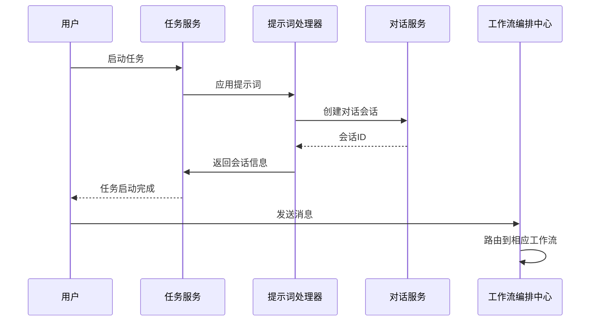

> 注：当前系统中提示词主要用于任务启动时的前端引导，实际的业务逻辑处理由n8n工作流完成，无需复杂的LLM提示词配置。

### 3.7 任务模板热更新机制

#### 3.7.1 设计理念

为了实现任务提示词和配置的动态更新，系统采用Redis发布/订阅机制，允许非技术人员在不重启服务的情况下调整任务配置。

#### 3.7.2 技术实现

1. **Redis信号监听**：系统通过Redis发布/订阅机制监听配置更新信号
2. **动态配置加载**：任务执行时实时获取最新配置，而非依赖启动时的静态配置
3. **配置版本管理**：支持配置版本控制，便于回滚和审计

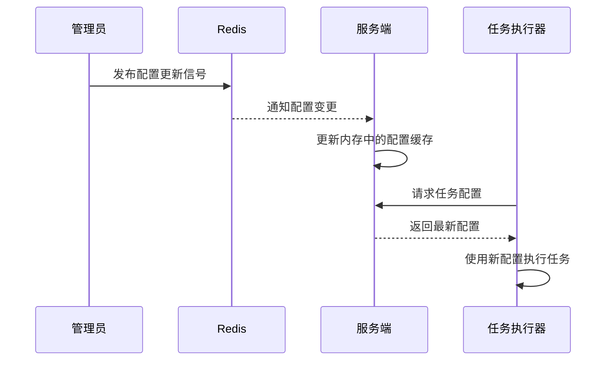

#### 3.7.3 配置更新接口

系统提供REST API接口用于更新任务模板配置：

```python
# 任务模板更新API
@app.put("/api/v1/tasks/templates/{template_id}")
async def update_task_template(
    template_id: str,
    template_data: TaskTemplateUpdate,
    user=Depends(get_admin_user)
):
    """
    更新任务模板配置，支持热更新
    """
    # 更新数据库中的模板配置
    updated_template = update_template_in_db(template_id, template_data)

    # 通过Redis发布配置更新信号
    await redis.publish("task_template_updates", json.dumps({
        "template_id": template_id,
        "updated_config": template_data.dict()
    }))

    return updated_template
```

## 4. 数据流向设计

### 4.1 任务创建数据流

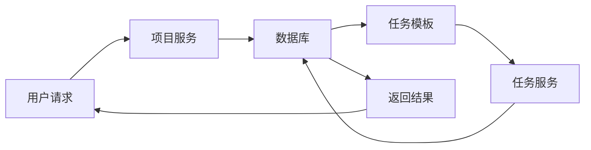

### 4.2 对话处理数据流

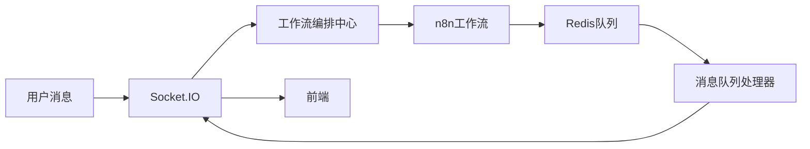

## 5. 技术实现细节

### 5.1 公司模型实现

#### 5.1.1 数据库表结构

```sql
CREATE TABLE companies (
    id VARCHAR(255) PRIMARY KEY,
    name VARCHAR(255) NOT NULL,
    description TEXT,
    owner_user_id VARCHAR(255) NOT NULL,
    company_info JSON,
    status VARCHAR(50) DEFAULT 'active',
    config JSON,
    created_at BIGINT,
    updated_at BIGINT
);
```

#### 5.1.2 模型类定义

```python
class Company(Base):
    __tablename__ = "companies"

    id = Column(String, primary_key=True)
    name = Column(String, nullable=False)
    description = Column(Text, nullable=True)
    owner_user_id = Column(String, nullable=False)
    company_info = Column(JSON, nullable=True)
    status = Column(String, default="active")
    config = Column(JSON, nullable=True)
    created_at = Column(BigInteger)
    updated_at = Column(BigInteger)
```

### 5.2 用户模型扩展

#### 5.2.1 数据库表结构扩展

```sql
ALTER TABLE user 
ADD COLUMN company_id VARCHAR(255) REFERENCES companies(id);
```

#### 5.2.2 模型类扩展

```python
class User(Base):
    # ... 现有字段 ...

    # 新增公司关联字段
    company_id = Column(String, ForeignKey("companies.id"), nullable=True)
```

### 5.3 项目模型扩展

#### 5.3.1 数据库表结构扩展

```sql
ALTER TABLE hsai_projects 
ADD COLUMN company_id VARCHAR(255) REFERENCES companies(id);
```

#### 5.3.2 模型类扩展

```python
class HSAIProject(Base):
    # ... 现有字段 ...

    # 新增公司关联字段
    company_id = Column(String, ForeignKey("companies.id"), nullable=True)
```

### 5.4 任务模型扩展

#### 5.4.1 数据库表结构扩展

```sql
ALTER TABLE hsai_tasks 
ADD COLUMN project_id VARCHAR(255) REFERENCES hsai_projects(id),
ADD COLUMN task_category VARCHAR(50),
ADD COLUMN prompt_config JSON;
```

#### 5.4.2 模型类扩展

```python
class HSAITask(Base):
    # ... 现有字段 ...

    # 新增项目关联字段
    project_id = Column(String, ForeignKey("hsai_projects.id"), nullable=True)

    # 任务类型扩展
    task_category = Column(String, nullable=True)

    # 任务提示词配置
    prompt_config = Column(JSON, nullable=True)
```

### 5.5 主线任务模板

主线任务模板用于描述任务的各项配置信息，包括展示信息、处理方式、工作流关联等。

```python
TASK_TEMPLATES = {
    "company_info": {
        "title": "完善企业信息",  # 主线任务的名称（在前端展示）
        "description": "请提供您企业的基本信息，包括企业名称、行业、规模等",  # 主线任务的描述（在前端展示）
        "task_type": "dialog",  # 主线任务的类型（dialog: 对话任务, manual: 人工任务, recurring: 循环任务）
        "workflow_name": "company_info_workflow",  # 工作流名称（用于对话完成的主线任务处理）
        "redirect_url": "",  # 跳转链接（用于人工完成的主线任务处理）
        "recurring_config": {},  # 循环任务配置（用于循环任务创建）
        "prompt_config": {  # 提示词配置
            "system_prompt": "您是一个企业信息收集助手，请引导用户完善企业基本信息",
            "initial_message": "您好！为了更好地为您服务，我们需要收集一些您企业的基本信息。"
        },
        "extended_config": {}  # 扩展配置（用于后续使用中需要根据实际需求扩充的配置信息）
    },
    "project_info": {
        "title": "完善项目信息",
        "description": "请提供项目的基本信息，包括项目目标、预期成果、时间规划等",
        "task_type": "dialog",
        "workflow_name": "project_info_workflow",
        "redirect_url": "",
        "recurring_config": {},
        "prompt_config": {
            "system_prompt": "您是一个项目信息收集助手，请引导用户完善项目基本信息",
            "initial_message": "接下来我们需要了解您的项目基本信息，以便为您提供更好的服务。"
        },
        "extended_config": {}
    },
    "material_init": {
        "title": "素材库初始化",
        "description": "初始化项目素材库，上传相关素材文件",
        "task_type": "manual",  # 人工任务
        "workflow_name": "",  # 人工任务不需要工作流
        "redirect_url": "/materials",  # 人工任务的跳转链接
        "recurring_config": {},
        "prompt_config": {},  # 人工任务不需要提示词配置
        "extended_config": {}
    },
    "daily_publish_task": {
        "title": "每日发布任务",
        "description": "根据战略地图KPI自动生成的每日发布任务",
        "task_type": "recurring",  # 循环任务
        "workflow_name": "",
        "redirect_url": "",
        "recurring_config": {  # 循环任务配置
            "schedule_time": "09:00",  # 创建子任务的时间
            "calculation_logic": "根据项目目标与当前完成情况计算当天发布目标"
        },
        "prompt_config": {},
        "extended_config": {}
    }
    // ... 其他模板定义
}
```

### 5.6 任务模板混合存储策略

#### 5.6.1 设计理念

采用混合存储策略来平衡系统稳定性和用户自定义需求：

1. **系统默认模板**：定义在代码中的常量模板，保证核心功能的稳定性
2. **用户自定义模板**：存储在数据库中，提供灵活性和可配置性

#### 5.6.2 实现机制

```python
class TaskTemplateManager:
    def __init__(self):
        self.default_templates = TASK_TEMPLATES  # 硬编码的默认模板
        self.custom_templates = {}  # 从数据库加载的自定义模板

    def get_template(self, template_id: str):
        """
        获取任务模板，优先使用自定义模板
        """
        # 先查找自定义模板
        if template_id in self.custom_templates:
            return self.custom_templates[template_id]

        # 再查找默认模板
        if template_id in self.default_templates:
            return self.default_templates[template_id]

        return None

    def update_custom_template(self, template_id: str, template_data: dict):
        """
        更新自定义模板并发布更新信号
        """
        # 更新数据库
        self.custom_templates[template_id] = template_data

        # 通过Redis发布更新信号
        redis_client.publish("task_template_updates", json.dumps({
            "template_id": template_id,
            "template_data": template_data
        }))
```

#### 5.6.3 模板加载与缓存机制

为了提高系统性能并支持配置热更新，任务模板采用多层缓存机制：

1. **内存缓存层**：系统启动时将所有默认模板和用户自定义模板加载到内存中，提供最快的访问速度
2. **Redis缓存层**：将模板数据同时存储在Redis中，支持分布式部署环境下的模板共享和热更新
3. **数据库持久层**：用户自定义模板存储在数据库中，确保数据持久化

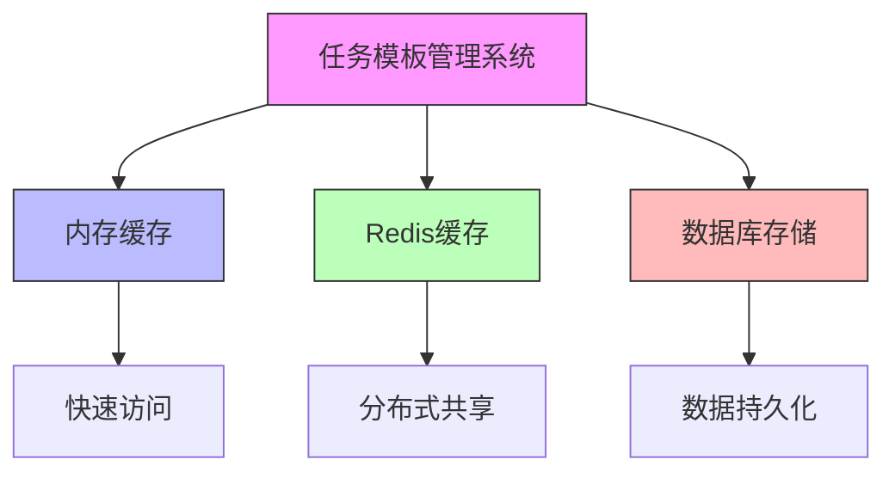

#### 5.6.4 模板优先级与覆盖机制

系统采用明确的模板优先级策略：

1. **最高优先级**：运行时通过Redis发布的临时模板更新
2. **中等优先级**：用户自定义模板（存储在数据库中）
3. **最低优先级**：系统默认模板（硬编码在代码中）

当需要获取模板时，系统按以下顺序查找：

1. 首先检查Redis中是否有临时更新的模板
2. 如果没有，则检查内存中的用户自定义模板
3. 如果仍未找到，则使用硬编码的默认模板

```python
class TaskTemplateManager:
    def __init__(self):
        self.default_templates = TASK_TEMPLATES  # 硬编码的默认模板
        self.custom_templates = {}  # 从数据库加载的自定义模板
        self.runtime_templates = {}  # 运行时通过Redis更新的模板

    def get_template(self, template_id: str):
        """
        获取任务模板，按优先级顺序查找
        """
        # 最高优先级：运行时模板
        if template_id in self.runtime_templates:
            return self.runtime_templates[template_id]

        # 中等优先级：用户自定义模板
        if template_id in self.custom_templates:
            return self.custom_templates[template_id]

        # 最低优先级：默认模板
        if template_id in self.default_templates:
            return self.default_templates[template_id]

        return None

    def load_templates_from_db(self):
        """
        从数据库加载用户自定义模板到内存
        """
        # 查询数据库中的自定义模板
        db_templates = query_custom_templates_from_database()
        self.custom_templates.update(db_templates)

    def handle_template_update_signal(self, message):
        """
        处理Redis发布的模板更新信号
        """
        try:
            update_data = json.loads(message)
            template_id = update_data.get("template_id")
            template_data = update_data.get("template_data")

            # 将更新的模板保存到运行时缓存
            self.runtime_templates[template_id] = template_data

            # 同时更新内存中的自定义模板
            if template_id in self.custom_templates:
                self.custom_templates[template_id] = template_data

        except Exception as e:
            log.error(f"Error handling template update signal: {e}")
```

#### 5.6.5 模板更新与同步机制

为了确保模板更新能够及时生效，系统采用以下同步机制：

1. **数据库更新**：用户通过管理界面更新模板时，首先更新数据库中的模板数据
2. **内存同步**：更新数据库后，同步更新内存中的模板缓存
3. **Redis广播**：通过Redis发布/订阅机制，将模板更新广播到所有服务实例
4. **本地缓存更新**：各服务实例接收到更新消息后，更新本地内存缓存

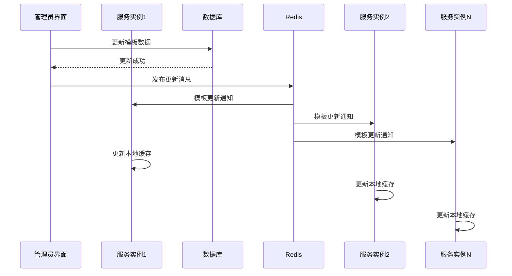

#### 5.6.6 模板版本管理

为了支持模板的版本控制和回滚，系统引入模板版本管理机制：

1. **版本标识**：每个模板都有版本号，格式为`v1.0.0`
2. **历史记录**：模板更新时保留历史版本记录
3. **回滚支持**：支持快速回滚到指定历史版本

```python
class TaskTemplate:
    def __init__(self, template_id: str, data: dict, version: str = "v1.0.0"):
        self.template_id = template_id
        self.data = data
        self.version = version
        self.created_at = int(time.time())
        self.updated_at = int(time.time())

class TaskTemplateManager:
    def __init__(self):
        self.templates = {}  # 当前版本模板
        self.template_history = {}  # 模板历史版本

    def update_template(self, template_id: str, template_data: dict, new_version: str):
        """
        更新模板并保存历史版本
        """
        # 保存当前版本到历史记录
        if template_id in self.templates:
            current_template = self.templates[template_id]
            if template_id not in self.template_history:
                self.template_history[template_id] = []
            self.template_history[template_id].append(current_template)

        # 更新当前版本
        new_template = TaskTemplate(template_id, template_data, new_version)
        self.templates[template_id] = new_template

        # 更新数据库和Redis
        self.save_to_database(new_template)
        self.publish_update_signal(new_template)

    def rollback_template(self, template_id: str, target_version: str):
        """
        回滚模板到指定版本
        """
        if template_id not in self.template_history:
            return False

        # 查找目标版本
        target_template = None
        for template in self.template_history[template_id]:
            if template.version == target_version:
                target_template = template
                break

        if not target_template:
            return False

        # 执行回滚
        self.templates[template_id] = target_template
        self.save_to_database(target_template)
        self.publish_update_signal(target_template)

        return True
```

## 6. 系统集成方案

### 6.1 与用户系统集成

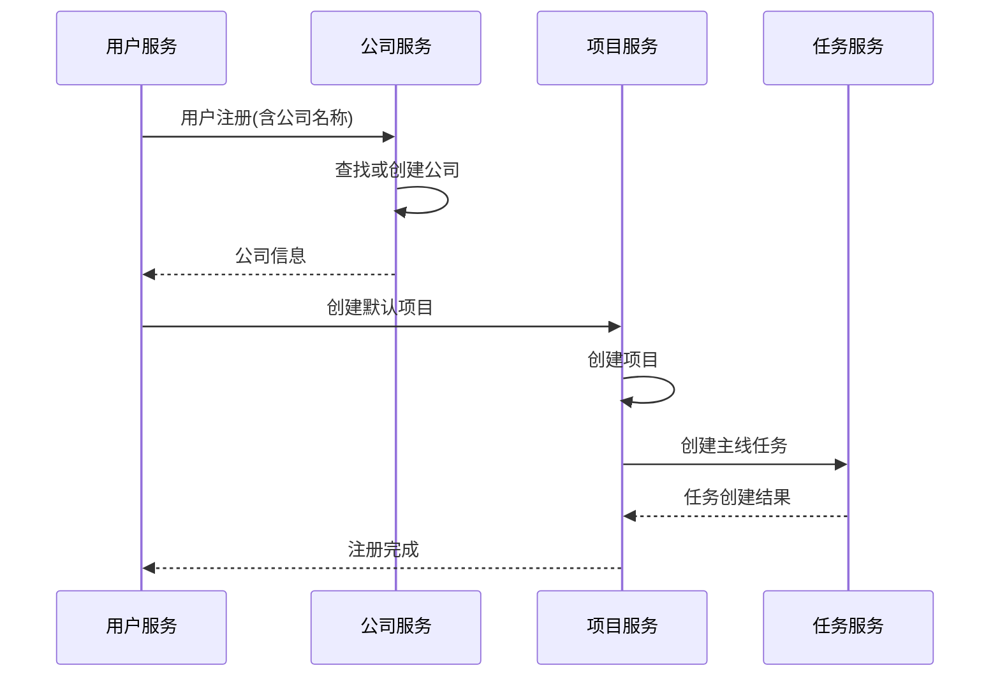

### 6.2 与工作流系统集成

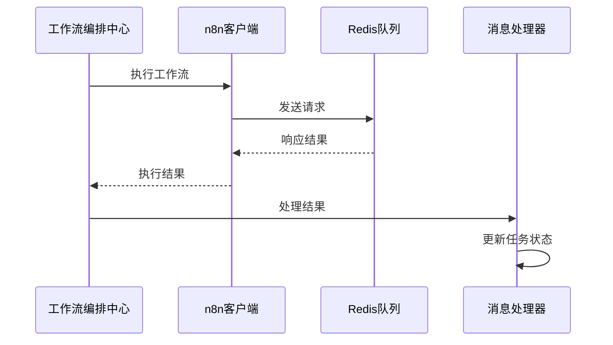

## 7. 实施计划（按优先级划分）

### 7.1 高优先级任务（核心功能实现）

#### 7.1.1 数据模型与基础架构

- 创建公司表（companies）及相应索引
- 扩展用户表结构，添加公司关联字段
- 扩展项目表结构，添加公司关联字段
- 扩展任务表结构，添加项目关联字段和任务分类字段
- 实现公司CRUD操作API
- 实现公司与用户关联关系
- 实现项目与公司关联关系
- 实现任务与项目关联关系

#### 7.1.2 核心业务逻辑

- 实现用户创建时的公司绑定逻辑（查找或创建公司）
- 实现默认项目自动创建机制
- 实现主线任务模板定义与管理
- 实现项目创建时主线任务自动生成机制
- 实现任务状态管理机制（待处理、处理中、已完成、已取消）

#### 7.1.3 基础集成

- 实现公司、项目、任务数据的前后端交互接口
- 实现基础的前端页面展示（公司列表、项目列表、任务列表）
- 实现任务状态更新的基础功能

### 7.2 中优先级任务（功能完善与扩展）

#### 7.2.1 任务管理增强

- 实现主线任务执行机制（对话任务与人工任务）
- 实现主线任务完成检查机制
- 实现循环任务生成机制
- 实现基于战略地图的KPI计算逻辑
- 实现每日任务自动分发功能
- 实现任务提示词配置管理

#### 7.2.2 工作流集成

- 实现工作流信号监听机制
- 实现Redis队列消息处理
- 实现任务完成状态更新机制
- 实现人工任务完成检查机制
- 实现任务与n8n工作流的关联配置

#### 7.2.3 用户体验优化

- 实现任务进度可视化展示
- 实现未完成任务提醒机制
- 实现任务详情页面
- 实现任务操作界面（启动、完成等）

### 7.3 低优先级任务（高级功能与优化）

#### 7.3.1 配置管理

- 实现任务模板热更新机制
- 实现Redis发布/订阅配置更新
- 实现任务模板混合存储策略（默认模板+自定义模板）
- 实现配置更新API接口
- 实现模板版本管理机制

#### 7.3.2 性能与稳定性

- 实现任务查询性能优化
- 实现配置加载机制优化
- 实现缓存策略（内存缓存+Redis缓存）
- 实现系统监控与日志记录
- 实现错误处理与恢复机制

#### 7.3.3 扩展功能

- 实现多租户权限管理
- 实现任务模板自定义功能
- 实现任务统计与报表功能
- 实现批量任务处理功能
- 实现任务导出与导入功能

## 8. 预期效果（按价值优先级排序）

### 8.1 核心价值（高优先级实现）

#### 8.1.1 数据隔离与组织管理

- 实现企业级数据隔离，确保不同公司数据安全
- 建立清晰的公司-项目-任务层级关系
- 提供组织结构管理能力，支持企业用户管理

#### 8.1.2 任务驱动的对话管理

- 通过任务划分对话上下文，解决长对话信息过载问题
- 实现任务进度持久化保存，支持断点续续完成
- 提供任务状态跟踪，增强用户对工作进度的掌控感

### 8.2 重要价值（中优先级实现）

#### 8.2.1 工作流集成效益

- 深度集成n8n工作流，实现复杂业务逻辑自动化处理
- 通过工作流信号更新任务状态，减少人工干预
- 支持对话任务与人工任务的混合处理模式

#### 8.2.2 用户体验提升

- 提供直观的任务管理界面，简化用户操作
- 实现任务进度可视化，提升用户满意度
- 提供未完成任务提醒，避免工作遗漏

### 8.3 附加价值（低优先级实现）

#### 8.3.1 系统可维护性

- 支持配置热更新，降低系统维护成本
- 提供灵活的任务模板管理机制，适应不同业务场景
- 实现模板版本管理，支持配置回滚

#### 8.3.2 运营效率提升

- 降低非技术人员的维护门槛，提高团队协作效率
- 提供任务统计分析功能，支持业务决策
- 增强系统可扩展性，便于后续功能扩展
