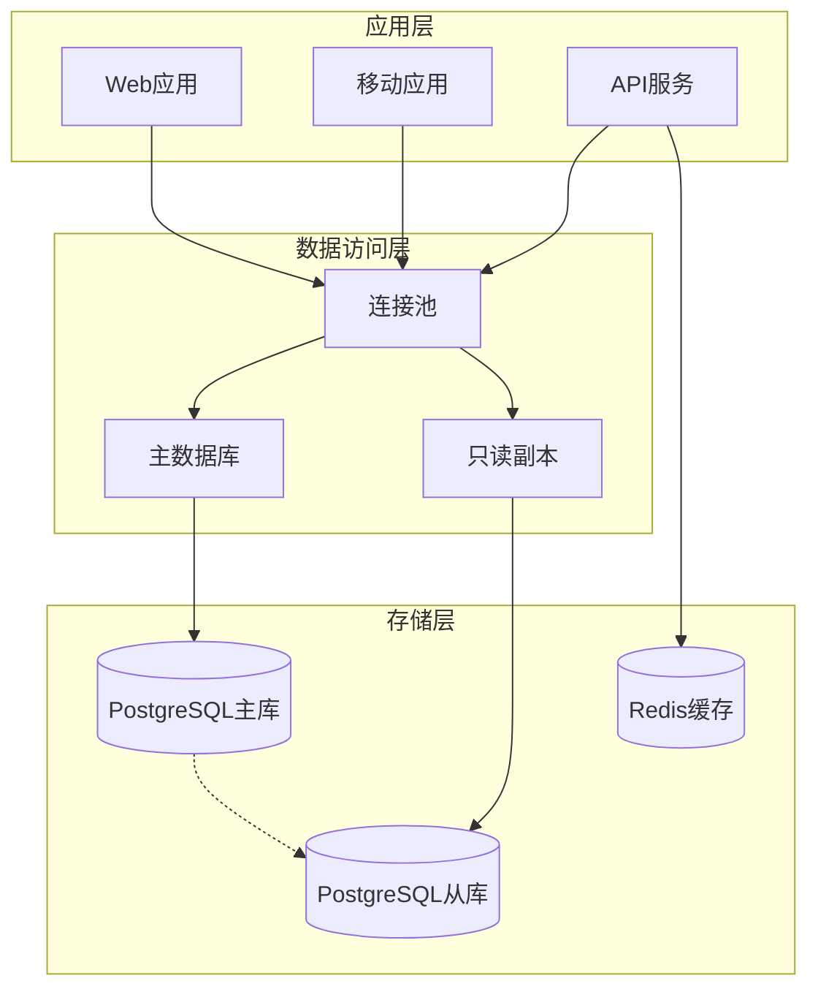

# 数据库设计

**版本**: v2.1.0  
**更新日期**: 2025-08-24  
**基于**: 系统架构设计_v3.0.0.md  
**适用范围**: 产品/设计/前后端/测试  
**编写人**: 数据库设计师  

## 版本修订记录

| 版本 | 日期 | 修改内容 | 修改人 |
|------|------|----------|--------|
| v2.1.0 | 2025-08-24 | 统一版本号格式为三段版本号，添加版本修订记录 | 系统整理 |
| v2.1 | 2025-08-22 | 优化索引设计，增加数据分区策略 | 数据库设计师 |
| v2.0 | 2025-08-19 | 新增素材管理和视频合成表结构 | 数据库设计师 |
| v1.0 | 2025-08-16 | 初始版本，定义基础数据库表结构 | 数据库设计师 |  

## 1. 数据库架构

### 1.1 架构概述



### 1.2 数据库配置

```sql
-- 数据库创建
CREATE DATABASE hsai_production
    WITH 
    OWNER = hsai_user
    ENCODING = 'UTF8'
    LC_COLLATE = 'zh_CN.UTF-8'
    LC_CTYPE = 'zh_CN.UTF-8'
    TIMEZONE = 'Asia/Shanghai';

-- 扩展安装
CREATE EXTENSION IF NOT EXISTS "uuid-ossp";
CREATE EXTENSION IF NOT EXISTS "pg_trgm";
CREATE EXTENSION IF NOT EXISTS "btree_gin";
```

## 2. 表结构设计

### 2.1 用户与权限表

```sql
-- 企业表
CREATE TABLE companies (
    id BIGSERIAL PRIMARY KEY,
    name VARCHAR(100) NOT NULL,
    slug VARCHAR(50) UNIQUE NOT NULL,
    industry VARCHAR(50),
    scale company_scale,
    contact_info JSONB,
    settings JSONB DEFAULT '{}',
    status company_status DEFAULT 'active',
    created_at TIMESTAMP WITH TIME ZONE DEFAULT CURRENT_TIMESTAMP,
    updated_at TIMESTAMP WITH TIME ZONE DEFAULT CURRENT_TIMESTAMP
);

-- 用户表
CREATE TABLE users (
    id BIGSERIAL PRIMARY KEY,
    username VARCHAR(50) UNIQUE NOT NULL,
    email VARCHAR(100) UNIQUE NOT NULL,
    password_hash VARCHAR(255) NOT NULL,
    salt VARCHAR(32) NOT NULL,
    role user_role NOT NULL DEFAULT 'operator',
    status user_status NOT NULL DEFAULT 'active',
    company_id BIGINT NOT NULL REFERENCES companies(id) ON DELETE CASCADE,
    profile JSONB DEFAULT '{}',
    last_login_at TIMESTAMP WITH TIME ZONE,
    created_at TIMESTAMP WITH TIME ZONE DEFAULT CURRENT_TIMESTAMP,
    updated_at TIMESTAMP WITH TIME ZONE DEFAULT CURRENT_TIMESTAMP
);

-- 用户会话表
CREATE TABLE user_sessions (
    id UUID PRIMARY KEY DEFAULT uuid_generate_v4(),
    user_id BIGINT NOT NULL REFERENCES users(id) ON DELETE CASCADE,
    token_hash VARCHAR(255) NOT NULL,
    device_info JSONB,
    ip_address INET,
    expires_at TIMESTAMP WITH TIME ZONE NOT NULL,
    created_at TIMESTAMP WITH TIME ZONE DEFAULT CURRENT_TIMESTAMP
);
```

### 2.2 对话系统表

```sql
-- 对话会话表
CREATE TABLE chat_sessions (
    id BIGSERIAL PRIMARY KEY,
    user_id BIGINT NOT NULL REFERENCES users(id) ON DELETE CASCADE,
    title VARCHAR(200),
    context JSONB DEFAULT '{}',
    status session_status DEFAULT 'active',
    message_count INTEGER DEFAULT 0,
    last_message_at TIMESTAMP WITH TIME ZONE,
    created_at TIMESTAMP WITH TIME ZONE DEFAULT CURRENT_TIMESTAMP,
    updated_at TIMESTAMP WITH TIME ZONE DEFAULT CURRENT_TIMESTAMP
);

-- 消息表
CREATE TABLE messages (
    id BIGSERIAL PRIMARY KEY,
    session_id BIGINT NOT NULL REFERENCES chat_sessions(id) ON DELETE CASCADE,
    parent_id BIGINT REFERENCES messages(id),
    role message_role NOT NULL,
    content TEXT NOT NULL,
    content_type content_type DEFAULT 'text',
    ai_id VARCHAR(50),
    metadata JSONB DEFAULT '{}',
    tokens_used INTEGER,
    processing_time INTEGER,
    created_at TIMESTAMP WITH TIME ZONE DEFAULT CURRENT_TIMESTAMP
);

-- 卡片表
CREATE TABLE cards (
    id BIGSERIAL PRIMARY KEY,
    message_id BIGINT NOT NULL REFERENCES messages(id) ON DELETE CASCADE,
    card_type card_type NOT NULL,
    title VARCHAR(200) NOT NULL,
    description TEXT,
    data JSONB NOT NULL DEFAULT '{}',
    status card_status DEFAULT 'active',
    priority INTEGER DEFAULT 0,
    expires_at TIMESTAMP WITH TIME ZONE,
    created_at TIMESTAMP WITH TIME ZONE DEFAULT CURRENT_TIMESTAMP,
    updated_at TIMESTAMP WITH TIME ZONE DEFAULT CURRENT_TIMESTAMP
);

-- 连线关系表
CREATE TABLE connections (
    id BIGSERIAL PRIMARY KEY,
    session_id BIGINT NOT NULL REFERENCES chat_sessions(id) ON DELETE CASCADE,
    message_id BIGINT NOT NULL REFERENCES messages(id) ON DELETE CASCADE,
    card_id BIGINT NOT NULL REFERENCES cards(id) ON DELETE CASCADE,
    connection_type VARCHAR(20) DEFAULT 'standard',
    weight DECIMAL(3,2) DEFAULT 1.0,
    created_at TIMESTAMP WITH TIME ZONE DEFAULT CURRENT_TIMESTAMP
);
```

### 2.3 素材管理表

```sql
-- 文件夹表
CREATE TABLE folders (
    id BIGSERIAL PRIMARY KEY,
    name VARCHAR(100) NOT NULL,
    parent_id BIGINT REFERENCES folders(id) ON DELETE CASCADE,
    path TEXT NOT NULL,
    level INTEGER NOT NULL DEFAULT 0,
    company_id BIGINT NOT NULL REFERENCES companies(id) ON DELETE CASCADE,
    created_by BIGINT REFERENCES users(id),
    permissions JSONB DEFAULT '{}',
    metadata JSONB DEFAULT '{}',
    created_at TIMESTAMP WITH TIME ZONE DEFAULT CURRENT_TIMESTAMP,
    updated_at TIMESTAMP WITH TIME ZONE DEFAULT CURRENT_TIMESTAMP
);

-- 素材文件表
CREATE TABLE materials (
    id BIGSERIAL PRIMARY KEY,
    folder_id BIGINT NOT NULL REFERENCES folders(id) ON DELETE CASCADE,
    name VARCHAR(200) NOT NULL,
    original_name VARCHAR(200),
    file_type file_type NOT NULL,
    mime_type VARCHAR(100),
    file_size BIGINT NOT NULL,
    file_hash VARCHAR(64),
    file_url VARCHAR(500) NOT NULL,
    thumbnail_url VARCHAR(500),
    metadata JSONB DEFAULT '{}',
    tags TEXT[],
    processing_status processing_status DEFAULT 'completed',
    download_count INTEGER DEFAULT 0,
    created_by BIGINT REFERENCES users(id),
    created_at TIMESTAMP WITH TIME ZONE DEFAULT CURRENT_TIMESTAMP,
    updated_at TIMESTAMP WITH TIME ZONE DEFAULT CURRENT_TIMESTAMP
);

-- 素材访问日志表
CREATE TABLE material_access_logs (
    id BIGSERIAL PRIMARY KEY,
    material_id BIGINT NOT NULL REFERENCES materials(id) ON DELETE CASCADE,
    user_id BIGINT REFERENCES users(id),
    action VARCHAR(20) NOT NULL,
    ip_address INET,
    user_agent TEXT,
    created_at TIMESTAMP WITH TIME ZONE DEFAULT CURRENT_TIMESTAMP
);
```

### 2.4 视频制作表

```sql
-- 脚本库表
CREATE TABLE scripts (
    id BIGSERIAL PRIMARY KEY,
    title VARCHAR(200) NOT NULL,
    description TEXT,
    script_type script_type NOT NULL,
    content JSONB NOT NULL DEFAULT '{}',
    source_url VARCHAR(500),
    source_platform VARCHAR(50),
    performance_metrics JSONB DEFAULT '{}',
    usage_count INTEGER DEFAULT 0,
    rating DECIMAL(3,2),
    tags TEXT[],
    created_by BIGINT REFERENCES users(id),
    company_id BIGINT REFERENCES companies(id),
    status script_status DEFAULT 'active',
    created_at TIMESTAMP WITH TIME ZONE DEFAULT CURRENT_TIMESTAMP,
    updated_at TIMESTAMP WITH TIME ZONE DEFAULT CURRENT_TIMESTAMP
);

-- 视频合成任务表
CREATE TABLE video_jobs (
    id BIGSERIAL PRIMARY KEY,
    job_id VARCHAR(50) UNIQUE NOT NULL,
    user_id BIGINT NOT NULL REFERENCES users(id),
    script_id BIGINT NOT NULL REFERENCES scripts(id),
    material_ids JSONB NOT NULL DEFAULT '[]',
    job_name VARCHAR(200),
    settings JSONB DEFAULT '{}',
    status job_status DEFAULT 'pending',
    progress INTEGER DEFAULT 0 CHECK (progress >= 0 AND progress <= 100),
    current_stage VARCHAR(50),
    estimated_duration INTEGER,
    actual_duration INTEGER,
    result_url VARCHAR(500),
    result_metadata JSONB DEFAULT '{}',
    error_code VARCHAR(50),
    error_message TEXT,
    retry_count INTEGER DEFAULT 0,
    priority INTEGER DEFAULT 5,
    scheduled_at TIMESTAMP WITH TIME ZONE,
    started_at TIMESTAMP WITH TIME ZONE,
    completed_at TIMESTAMP WITH TIME ZONE,
    created_at TIMESTAMP WITH TIME ZONE DEFAULT CURRENT_TIMESTAMP
);

-- 任务日志表
CREATE TABLE job_logs (
    id BIGSERIAL PRIMARY KEY,
    job_id BIGINT NOT NULL REFERENCES video_jobs(id) ON DELETE CASCADE,
    level log_level NOT NULL,
    stage VARCHAR(50),
    message TEXT NOT NULL,
    metadata JSONB DEFAULT '{}',
    created_at TIMESTAMP WITH TIME ZONE DEFAULT CURRENT_TIMESTAMP
);
```

### 2.5 社媒矩阵表

```sql
-- 社媒账号表
CREATE TABLE social_accounts (
    id BIGSERIAL PRIMARY KEY,
    company_id BIGINT NOT NULL REFERENCES companies(id) ON DELETE CASCADE,
    platform social_platform NOT NULL,
    account_name VARCHAR(100) NOT NULL,
    account_id VARCHAR(100) NOT NULL,
    account_url VARCHAR(200),
    access_token TEXT,
    refresh_token TEXT,
    token_expires_at TIMESTAMP WITH TIME ZONE,
    account_info JSONB DEFAULT '{}',
    status account_status DEFAULT 'active',
    last_sync_at TIMESTAMP WITH TIME ZONE,
    created_by BIGINT REFERENCES users(id),
    created_at TIMESTAMP WITH TIME ZONE DEFAULT CURRENT_TIMESTAMP,
    updated_at TIMESTAMP WITH TIME ZONE DEFAULT CURRENT_TIMESTAMP,
    UNIQUE(platform, account_id)
);

-- 发布记录表
CREATE TABLE publish_records (
    id BIGSERIAL PRIMARY KEY,
    publish_id VARCHAR(50) UNIQUE NOT NULL,
    video_job_id BIGINT REFERENCES video_jobs(id),
    account_id BIGINT NOT NULL REFERENCES social_accounts(id) ON DELETE CASCADE,
    title VARCHAR(200),
    description TEXT,
    tags TEXT[],
    content_url VARCHAR(500),
    cover_url VARCHAR(500),
    platform_post_id VARCHAR(100),
    publish_settings JSONB DEFAULT '{}',
    status publish_status DEFAULT 'pending',
    scheduled_at TIMESTAMP WITH TIME ZONE,
    published_at TIMESTAMP WITH TIME ZONE,
    error_message TEXT,
    metrics JSONB DEFAULT '{}',
    created_by BIGINT REFERENCES users(id),
    created_at TIMESTAMP WITH TIME ZONE DEFAULT CURRENT_TIMESTAMP,
    updated_at TIMESTAMP WITH TIME ZONE DEFAULT CURRENT_TIMESTAMP
);

-- 发布数据收集表
CREATE TABLE publish_metrics (
    id BIGSERIAL PRIMARY KEY,
    publish_record_id BIGINT NOT NULL REFERENCES publish_records(id) ON DELETE CASCADE,
    metric_type VARCHAR(50) NOT NULL,
    metric_value BIGINT NOT NULL DEFAULT 0,
    collected_at TIMESTAMP WITH TIME ZONE NOT NULL,
    metadata JSONB DEFAULT '{}',
    created_at TIMESTAMP WITH TIME ZONE DEFAULT CURRENT_TIMESTAMP,
    UNIQUE(publish_record_id, metric_type, collected_at)
);
```

### 2.6 任务与KPI表

```sql
-- 任务表
CREATE TABLE tasks (
    id BIGSERIAL PRIMARY KEY,
    title VARCHAR(200) NOT NULL,
    description TEXT,
    task_type task_type NOT NULL,
    status task_status DEFAULT 'pending',
    priority task_priority DEFAULT 'medium',
    progress INTEGER DEFAULT 0 CHECK (progress >= 0 AND progress <= 100),
    assignee_id BIGINT REFERENCES users(id),
    creator_id BIGINT REFERENCES users(id),
    parent_task_id BIGINT REFERENCES tasks(id),
    related_entity_type VARCHAR(50),
    related_entity_id BIGINT,
    metadata JSONB DEFAULT '{}',
    due_date DATE,
    completed_at TIMESTAMP WITH TIME ZONE,
    created_at TIMESTAMP WITH TIME ZONE DEFAULT CURRENT_TIMESTAMP,
    updated_at TIMESTAMP WITH TIME ZONE DEFAULT CURRENT_TIMESTAMP
);

-- KPI指标表
CREATE TABLE kpi_metrics (
    id BIGSERIAL PRIMARY KEY,
    company_id BIGINT NOT NULL REFERENCES companies(id) ON DELETE CASCADE,
    metric_name VARCHAR(100) NOT NULL,
    metric_category VARCHAR(50),
    metric_value DECIMAL(15,4) NOT NULL,
    metric_unit VARCHAR(20),
    previous_value DECIMAL(15,4),
    change_percentage DECIMAL(8,4),
    change_type change_type DEFAULT 'neutral',
    calculation_method TEXT,
    record_date DATE NOT NULL,
    record_hour INTEGER,
    metadata JSONB DEFAULT '{}',
    created_at TIMESTAMP WITH TIME ZONE DEFAULT CURRENT_TIMESTAMP,
    UNIQUE(company_id, metric_name, record_date, record_hour)
);
```

## 3. 枚举类型定义

```sql
-- 用户角色枚举
CREATE TYPE user_role AS ENUM ('admin', 'manager', 'operator', 'viewer');

-- 用户状态枚举
CREATE TYPE user_status AS ENUM ('active', 'inactive', 'suspended', 'deleted');

-- 企业规模枚举
CREATE TYPE company_scale AS ENUM ('startup', 'small', 'medium', 'large', 'enterprise');

-- 企业状态枚举
CREATE TYPE company_status AS ENUM ('active', 'trial', 'suspended', 'deleted');

-- 会话状态枚举
CREATE TYPE session_status AS ENUM ('active', 'archived', 'deleted');

-- 消息角色枚举
CREATE TYPE message_role AS ENUM ('user', 'ai', 'system');

-- 内容类型枚举
CREATE TYPE content_type AS ENUM ('text', 'voice', 'image', 'file');

-- 卡片类型枚举
CREATE TYPE card_type AS ENUM ('video', 'strategy', 'collaboration', 'data', 'progress', 'notification');

-- 卡片状态枚举
CREATE TYPE card_status AS ENUM ('active', 'completed', 'cancelled', 'expired');

-- 文件类型枚举
CREATE TYPE file_type AS ENUM ('image', 'video', 'audio', 'document', 'other');

-- 处理状态枚举
CREATE TYPE processing_status AS ENUM ('pending', 'processing', 'completed', 'failed');

-- 脚本类型枚举
CREATE TYPE script_type AS ENUM ('trending', 'custom', 'template', 'generated');

-- 脚本状态枚举
CREATE TYPE script_status AS ENUM ('active', 'draft', 'archived', 'deleted');

-- 任务状态枚举
CREATE TYPE job_status AS ENUM ('pending', 'queued', 'processing', 'completed', 'failed', 'cancelled');

-- 日志级别枚举
CREATE TYPE log_level AS ENUM ('debug', 'info', 'warn', 'error', 'fatal');

-- 社媒平台枚举
CREATE TYPE social_platform AS ENUM ('douyin', 'kuaishou', 'xiaohongshu', 'youtube', 'tiktok', 'instagram');

-- 账号状态枚举
CREATE TYPE account_status AS ENUM ('active', 'expired', 'error', 'suspended');

-- 发布状态枚举
CREATE TYPE publish_status AS ENUM ('pending', 'scheduled', 'publishing', 'published', 'failed', 'cancelled');

-- 任务类型枚举
CREATE TYPE task_type AS ENUM ('video_creation', 'content_planning', 'material_upload', 'account_setup', 'data_analysis', 'other');

-- 任务状态枚举
CREATE TYPE task_status AS ENUM ('pending', 'in_progress', 'completed', 'cancelled', 'blocked');

-- 任务优先级枚举
CREATE TYPE task_priority AS ENUM ('low', 'medium', 'high', 'urgent');

-- 变化类型枚举
CREATE TYPE change_type AS ENUM ('up', 'down', 'neutral');
```

## 4. 索引设计

### 4.1 性能优化索引

```sql
-- 用户相关索引
CREATE INDEX idx_users_company_role ON users(company_id, role);
CREATE INDEX idx_users_email_status ON users(email, status) WHERE status = 'active';
CREATE INDEX idx_user_sessions_token ON user_sessions(token_hash);
CREATE INDEX idx_user_sessions_expires ON user_sessions(expires_at) WHERE expires_at > CURRENT_TIMESTAMP;

-- 对话相关索引
CREATE INDEX idx_chat_sessions_user_status ON chat_sessions(user_id, status, last_message_at DESC);
CREATE INDEX idx_messages_session_created ON messages(session_id, created_at DESC);
CREATE INDEX idx_messages_ai_id ON messages(ai_id) WHERE ai_id IS NOT NULL;
CREATE INDEX idx_cards_message_type ON cards(message_id, card_type);
CREATE INDEX idx_cards_status_priority ON cards(status, priority DESC) WHERE status = 'active';
CREATE INDEX idx_connections_session ON connections(session_id);

-- 素材相关索引
CREATE INDEX idx_folders_company_parent ON folders(company_id, parent_id);
CREATE INDEX idx_folders_path ON folders USING gin(path gin_trgm_ops);
CREATE INDEX idx_materials_folder_type ON materials(folder_id, file_type);
CREATE INDEX idx_materials_name_search ON materials USING gin(name gin_trgm_ops);
CREATE INDEX idx_materials_tags ON materials USING gin(tags);
CREATE INDEX idx_materials_hash ON materials(file_hash);
CREATE INDEX idx_material_access_logs_material_created ON material_access_logs(material_id, created_at DESC);

-- 视频相关索引
CREATE INDEX idx_scripts_type_company ON scripts(script_type, company_id, status);
CREATE INDEX idx_scripts_tags ON scripts USING gin(tags);
CREATE INDEX idx_scripts_rating ON scripts(rating DESC) WHERE status = 'active';
CREATE INDEX idx_video_jobs_user_status ON video_jobs(user_id, status, created_at DESC);
CREATE INDEX idx_video_jobs_status_priority ON video_jobs(status, priority DESC, created_at) WHERE status IN ('pending', 'queued');
CREATE INDEX idx_video_jobs_job_id ON video_jobs(job_id);
CREATE INDEX idx_job_logs_job_level ON job_logs(job_id, level, created_at DESC);

-- 社媒相关索引
CREATE INDEX idx_social_accounts_company_platform ON social_accounts(company_id, platform, status);
CREATE INDEX idx_social_accounts_expires ON social_accounts(token_expires_at) WHERE token_expires_at IS NOT NULL;
CREATE INDEX idx_publish_records_account_status ON publish_records(account_id, status, scheduled_at);
CREATE INDEX idx_publish_records_publish_id ON publish_records(publish_id);
CREATE INDEX idx_publish_metrics_record_type ON publish_metrics(publish_record_id, metric_type, collected_at DESC);

-- 任务相关索引
CREATE INDEX idx_tasks_assignee_status ON tasks(assignee_id, status) WHERE assignee_id IS NOT NULL;
CREATE INDEX idx_tasks_parent_status ON tasks(parent_task_id, status) WHERE parent_task_id IS NOT NULL;
CREATE INDEX idx_tasks_type_priority ON tasks(task_type, priority, due_date) WHERE status != 'completed';
CREATE INDEX idx_kpi_metrics_company_date ON kpi_metrics(company_id, record_date DESC);
CREATE INDEX idx_kpi_metrics_name_date ON kpi_metrics(metric_name, record_date DESC);
```

### 4.2 全文搜索索引

```sql
-- 全文搜索配置
CREATE TEXT SEARCH CONFIGURATION chinese_zh (COPY = simple);

-- 全文搜索索引
CREATE INDEX idx_materials_fulltext ON materials 
USING gin(to_tsvector('chinese_zh', name || ' ' || COALESCE(original_name, '')));

CREATE INDEX idx_scripts_fulltext ON scripts 
USING gin(to_tsvector('chinese_zh', title || ' ' || COALESCE(description, '')));

CREATE INDEX idx_tasks_fulltext ON tasks 
USING gin(to_tsvector('chinese_zh', title || ' ' || COALESCE(description, '')));
```

## 5. 触发器与约束

### 5.1 自动更新触发器

```sql
-- 更新时间戳触发器函数
CREATE OR REPLACE FUNCTION update_updated_at_column()
RETURNS TRIGGER AS $$
BEGIN
    NEW.updated_at = CURRENT_TIMESTAMP;
    RETURN NEW;
END;
$$ language 'plpgsql';

-- 应用到相关表
CREATE TRIGGER update_companies_updated_at 
    BEFORE UPDATE ON companies 
    FOR EACH ROW EXECUTE FUNCTION update_updated_at_column();

CREATE TRIGGER update_users_updated_at 
    BEFORE UPDATE ON users 
    FOR EACH ROW EXECUTE FUNCTION update_updated_at_column();

CREATE TRIGGER update_chat_sessions_updated_at 
    BEFORE UPDATE ON chat_sessions 
    FOR EACH ROW EXECUTE FUNCTION update_updated_at_column();

-- 消息计数更新触发器
CREATE OR REPLACE FUNCTION update_session_message_count()
RETURNS TRIGGER AS $$
BEGIN
    IF TG_OP = 'INSERT' THEN
        UPDATE chat_sessions 
        SET message_count = message_count + 1,
            last_message_at = NEW.created_at
        WHERE id = NEW.session_id;
        RETURN NEW;
    ELSIF TG_OP = 'DELETE' THEN
        UPDATE chat_sessions 
        SET message_count = message_count - 1
        WHERE id = OLD.session_id;
        RETURN OLD;
    END IF;
    RETURN NULL;
END;
$$ language 'plpgsql';

CREATE TRIGGER update_session_message_count_trigger
    AFTER INSERT OR DELETE ON messages
    FOR EACH ROW EXECUTE FUNCTION update_session_message_count();
```

### 5.2 数据完整性约束

```sql
-- 文件夹路径约束
ALTER TABLE folders ADD CONSTRAINT check_folder_path 
CHECK (path ~ '^/([^/]+(/[^/]+)*)?$');

-- 文件大小约束
ALTER TABLE materials ADD CONSTRAINT check_file_size 
CHECK (file_size > 0 AND file_size <= 5368709120); -- 5GB

-- 进度百分比约束
ALTER TABLE video_jobs ADD CONSTRAINT check_progress_range 
CHECK (progress >= 0 AND progress <= 100);

-- 任务进度约束
ALTER TABLE tasks ADD CONSTRAINT check_task_progress_range 
CHECK (progress >= 0 AND progress <= 100);

-- KPI值约束
ALTER TABLE kpi_metrics ADD CONSTRAINT check_metric_value_positive 
CHECK (metric_value >= 0);

-- 账号平台唯一性约束
ALTER TABLE social_accounts ADD CONSTRAINT unique_platform_account 
UNIQUE (platform, account_id);
```

## 6. 数据分区策略

### 6.1 时间分区表

```sql
-- 消息表按月分区
CREATE TABLE messages_partitioned (
    LIKE messages INCLUDING ALL
) PARTITION BY RANGE (created_at);

-- 创建分区
CREATE TABLE messages_2025_08 PARTITION OF messages_partitioned
    FOR VALUES FROM ('2025-08-01') TO ('2025-09-01');

CREATE TABLE messages_2025_09 PARTITION OF messages_partitioned
    FOR VALUES FROM ('2025-09-01') TO ('2025-10-01');

-- 日志表按周分区
CREATE TABLE job_logs_partitioned (
    LIKE job_logs INCLUDING ALL
) PARTITION BY RANGE (created_at);

-- 自动分区管理函数
CREATE OR REPLACE FUNCTION create_monthly_partition(
    table_name TEXT,
    start_date DATE
) RETURNS VOID AS $$
DECLARE
    partition_name TEXT;
    end_date DATE;
BEGIN
    partition_name := table_name || '_' || to_char(start_date, 'YYYY_MM');
    end_date := start_date + INTERVAL '1 month';
    
    EXECUTE format('
        CREATE TABLE IF NOT EXISTS %I PARTITION OF %I
        FOR VALUES FROM (%L) TO (%L)',
        partition_name, table_name, start_date, end_date);
END;
$$ LANGUAGE plpgsql;
```

## 7. 数据备份与恢复

### 7.1 备份策略

```sql
-- 逻辑备份脚本
-- 每日全量备份
pg_dump -h localhost -U hsai_user -d hsai_production \
    --format=custom --compress=9 --verbose \
    --file=/backup/hsai_$(date +%Y%m%d).dump

-- 增量备份（WAL归档）
archive_command = 'cp %p /archive/%f'
wal_level = replica
max_wal_senders = 3
archive_mode = on
```

### 7.2 恢复策略

```sql
-- 时间点恢复
pg_basebackup -h master_host -D /recovery -U replication -P -v -R -X stream

-- 恢复到指定时间点
recovery_target_time = '2025-08-22 10:30:00'
recovery_target_action = 'promote'
```

---

**文档维护**: 数据库管理员团队  
**审核状态**: 待审核  
**相关文档**: 系统架构设计, API接口规范