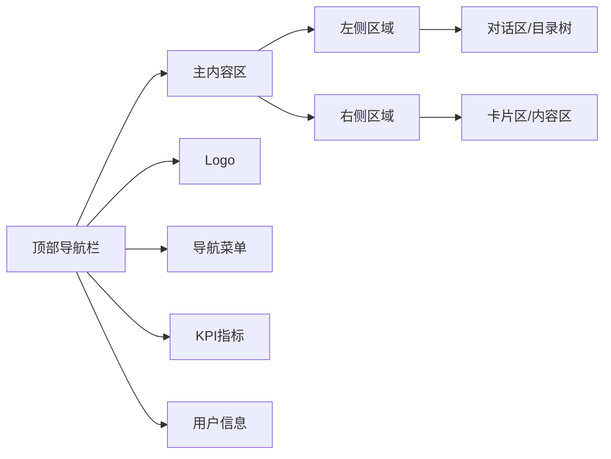

# 界面设计规范

**版本**: v2.1.0  
**更新日期**: 2025-08-24  
**基于**: UI设计规范_定稿_v2.0.md  
**适用范围**: 产品/设计/前端/测试  

## 版本修订记录

| 版本 | 日期 | 修改内容 | 修改人 |
|------|------|----------|--------|
| v2.1.0 | 2025-08-24 | 统一版本号格式为三段版本号，添加版本修订记录 | 系统整理 |
| v2.1 | 2025-08-22 | 完善色彩系统和间距规范，增加辅助性设计要求 | UI设计师 |
| v2.0 | 2025-08-20 | 重新设计视觉系统，统一设计语言 | UI设计师 |
| v1.0 | 2025-08-15 | 初始版本，定义基础界面设计规范 | UI设计师 |  

## 1. 设计原则

### 1.1 核心设计理念

**简约高效** - 界面简洁，操作高效，减少用户认知负担  
**一致性** - 统一的视觉语言和交互模式  
**可用性** - 符合用户习惯，提供清晰的操作反馈  
**可访问性** - 考虑不同用户群体的使用需求  

### 1.2 设计目标

| 目标 | 具体表现 | 衡量标准 |
|------|----------|----------|
| 易用性 | 新用户30分钟内掌握基本操作 | 用户测试通过率>90% |
| 效率性 | 常用操作3步内完成 | 任务完成时间<业界平均水平 |
| 美观性 | 现代化、专业化视觉设计 | 用户满意度>4.5/5 |
| 一致性 | 统一的设计语言和规范 | 设计评审通过率100% |

## 2. 色彩系统

### 2.1 主色调规范

```css
/* 主色调 */
--primary-blue: #3B82F6;        /* 主要交互色 */
--primary-blue-light: #60A5FA;  /* 浅色变体 */
--primary-blue-dark: #2563EB;   /* 深色变体 */

/* 辅助色 */
--secondary-cyan: #0EA5E9;      /* 辅助强调色 */
--secondary-purple: #6A5AE0;    /* 渐变起始色 */

/* 功能色 */
--success-green: #10B981;       /* 成功状态 */
--warning-yellow: #F59E0B;      /* 警告状态 */
--error-red: #EF4444;          /* 错误状态 */
--info-blue: #3B82F6;          /* 信息提示 */

/* 中性色 */
--gray-50: #F9FAFB;
--gray-100: #F3F4F6;
--gray-200: #E5E7EB;
--gray-300: #D1D5DB;
--gray-400: #9CA3AF;
--gray-500: #6B7280;
--gray-600: #4B5563;
--gray-700: #374151;
--gray-800: #1F2937;
--gray-900: #111827;
```

### 2.2 色彩应用规则

| 场景 | 色彩 | 用法说明 |
|------|------|----------|
| 主要按钮 | Primary Blue | 确认、提交、发送等主要操作 |
| 次要按钮 | Gray 边框 | 取消、重置等次要操作 |
| 链接文字 | Primary Blue | 可点击的文字链接 |
| 成功反馈 | Success Green | 操作成功、状态正常 |
| 警告提示 | Warning Yellow | 需要注意的信息 |
| 错误提示 | Error Red | 错误状态、失败操作 |
| 禁用状态 | Gray 400 | 不可操作的元素 |

### 2.3 渐变色应用

```css
/* 连线渐变 */
.connection-line {
  background: linear-gradient(45deg, #6A5AE0 0%, #3B82F6 100%);
}

/* 按钮悬停渐变 */
.button-primary:hover {
  background: linear-gradient(135deg, #3B82F6 0%, #2563EB 100%);
}

/* 卡片背景渐变 */
.card-highlight {
  background: linear-gradient(145deg, #F8FAFC 0%, #E2E8F0 100%);
}
```

## 3. 字体系统

### 3.1 字体选择

```css
/* 字体优先级 */
font-family: 
  "Inter",                    /* 西文优先 */
  "PingFang SC",             /* macOS 中文 */
  "Microsoft YaHei",         /* Windows 中文 */
  "Segoe UI",                /* Windows 西文 */
  "Helvetica Neue",          /* macOS 西文 */
  "Arial",                   /* 通用兜底 */
  sans-serif;
```

### 3.2 字体规格体系

| 级别 | 字号 | 行高 | 字重 | 应用场景 |
|------|------|------|------|----------|
| H1 | 32px | 40px | 600 | 页面主标题 |
| H2 | 24px | 32px | 600 | 区块标题 |
| H3 | 20px | 28px | 600 | 子标题 |
| H4 | 18px | 24px | 500 | 小标题 |
| Body Large | 16px | 24px | 400 | 重要正文 |
| Body | 14px | 20px | 400 | 常规正文 |
| Caption | 12px | 16px | 400 | 辅助说明 |
| Small | 10px | 14px | 400 | 小字说明 |

### 3.3 字体颜色规范

```css
/* 文字颜色层级 */
--text-primary: #1F2937;     /* 主要文字 - 标题、重要内容 */
--text-secondary: #4B5563;   /* 次要文字 - 正文 */
--text-tertiary: #6B7280;    /* 三级文字 - 辅助信息 */
--text-quaternary: #9CA3AF;  /* 四级文字 - 占位符、禁用 */
--text-inverse: #FFFFFF;     /* 反色文字 - 深色背景上 */
--text-link: #3B82F6;        /* 链接文字 */
--text-error: #EF4444;       /* 错误文字 */
--text-success: #10B981;     /* 成功文字 */
--text-warning: #F59E0B;     /* 警告文字 */
```

## 4. 间距系统

### 4.1 空间标准

```css
/* 间距标准 - 基于8px网格 */
--space-1: 4px;    /* 0.25rem */
--space-2: 8px;    /* 0.5rem */
--space-3: 12px;   /* 0.75rem */
--space-4: 16px;   /* 1rem */
--space-5: 20px;   /* 1.25rem */
--space-6: 24px;   /* 1.5rem */
--space-8: 32px;   /* 2rem */
--space-10: 40px;  /* 2.5rem */
--space-12: 48px;  /* 3rem */
--space-16: 64px;  /* 4rem */
--space-20: 80px;  /* 5rem */
--space-24: 96px;  /* 6rem */
```

### 4.2 间距应用规则

| 场景 | 间距值 | 说明 |
|------|--------|------|
| 组件内边距 | 12px, 16px | 根据组件大小选择 |
| 组件间距 | 12px, 16px, 24px | 根据关联度选择 |
| 区块间距 | 24px, 32px | 大区块之间的间距 |
| 页面边距 | 20px, 24px | 页面与边界的间距 |
| 文字间距 | 8px, 12px | 标题与正文的间距 |

### 4.3 布局间距示例

```scss
/* 卡片内部间距 */
.card {
  padding: var(--space-4) var(--space-6); /* 16px 24px */
}

/* 表单元素间距 */
.form-item {
  margin-bottom: var(--space-4); /* 16px */
}

.form-item label {
  margin-bottom: var(--space-2); /* 8px */
}

/* 按钮组间距 */
.button-group {
  gap: var(--space-3); /* 12px */
}
```

## 5. 圆角与阴影

### 5.1 圆角规范

```css
/* 圆角标准 */
--radius-none: 0;
--radius-sm: 4px;      /* 小圆角 - 标签、徽章 */
--radius-md: 6px;      /* 中圆角 - 按钮 */
--radius-lg: 8px;      /* 大圆角 - 卡片、面板 */
--radius-xl: 12px;     /* 超大圆角 - 输入框 */
--radius-full: 9999px; /* 完全圆角 - 头像、图标 */
```

### 5.2 阴影规范

```css
/* 阴影层级 */
--shadow-sm: 0 1px 2px 0 rgba(0, 0, 0, 0.05);      /* 轻微阴影 */
--shadow-md: 0 4px 6px -1px rgba(0, 0, 0, 0.1);    /* 标准阴影 */
--shadow-lg: 0 10px 15px -3px rgba(0, 0, 0, 0.1);  /* 明显阴影 */
--shadow-xl: 0 20px 25px -5px rgba(0, 0, 0, 0.1);  /* 强烈阴影 */
--shadow-inner: inset 0 2px 4px 0 rgba(0, 0, 0, 0.06); /* 内阴影 */

/* 特殊阴影 */
--shadow-focus: 0 0 0 3px rgba(59, 130, 246, 0.1); /* 聚焦阴影 */
--shadow-card: 0 4px 12px rgba(0, 0, 0, 0.08);     /* 卡片阴影 */
--shadow-modal: 0 25px 50px -12px rgba(0, 0, 0, 0.25); /* 弹窗阴影 */
```

### 5.3 阴影应用规则

| 组件类型 | 阴影级别 | 应用场景 |
|----------|----------|----------|
| 平铺元素 | None/SM | 页面背景、分割线 |
| 卡片 | MD | 内容卡片、列表项 |
| 悬浮元素 | LG | 下拉菜单、提示框 |
| 弹窗 | XL/Modal | 对话框、抽屉 |
| 聚焦状态 | Focus | 输入框、按钮聚焦 |

## 6. 信息架构与导航

### 6.1 页面布局结构



### 6.2 导航层级规范

| 层级 | 元素 | 样式 | 状态 |
|------|------|------|------|
| 一级导航 | 主要功能模块 | 顶部横向布局 | 当前页高亮 |
| 二级导航 | 子功能页面 | 左侧侧边栏 | 激活状态区分 |
| 面包屑 | 路径导航 | 页面顶部 | 当前页不可点击 |
| Tab导航 | 平级内容切换 | 水平标签页 | 当前tab高亮 |

### 6.3 响应式断点

```css
/* 响应式断点 */
--breakpoint-sm: 640px;   /* 小屏幕 */
--breakpoint-md: 768px;   /* 中等屏幕 */
--breakpoint-lg: 1024px;  /* 大屏幕 */
--breakpoint-xl: 1280px;  /* 超大屏幕 */
--breakpoint-2xl: 1536px; /* 2K屏幕 */

/* 媒体查询示例 */
@media (max-width: 768px) {
  .nav-menu {
    flex-direction: column;
  }
}

@media (min-width: 1280px) {
  .container {
    max-width: 1200px;
  }
}
```

## 7. 组件设计规范

### 7.1 按钮设计

#### 按钮类型

| 类型 | 用途 | 样式特征 |
|------|------|----------|
| Primary | 主要操作 | 蓝色填充，白色文字 |
| Secondary | 次要操作 | 蓝色边框，蓝色文字 |
| Tertiary | 辅助操作 | 无边框，蓝色文字 |
| Danger | 危险操作 | 红色填充，白色文字 |
| Success | 成功操作 | 绿色填充，白色文字 |

#### 按钮尺寸

```css
/* 按钮尺寸规范 */
.btn-small {
  padding: 6px 12px;
  font-size: 12px;
  height: 28px;
}

.btn-medium {
  padding: 8px 16px;
  font-size: 14px;
  height: 36px;
}

.btn-large {
  padding: 12px 24px;
  font-size: 16px;
  height: 44px;
}
```

### 7.2 输入框设计

```css
/* 输入框样式 */
.input {
  padding: 12px 16px;
  border: 1px solid var(--gray-300);
  border-radius: var(--radius-xl);
  font-size: 14px;
  font-family: inherit;
  transition: all 0.2s ease;
}

.input:focus {
  outline: none;
  border-color: var(--primary-blue);
  box-shadow: var(--shadow-focus);
}

.input:disabled {
  background-color: var(--gray-100);
  color: var(--gray-400);
  cursor: not-allowed;
}

.input.error {
  border-color: var(--error-red);
}
```

### 7.3 卡片设计

```css
/* 卡片样式 */
.card {
  background: white;
  border-radius: var(--radius-lg);
  box-shadow: var(--shadow-card);
  padding: var(--space-6);
  transition: all 0.2s ease;
}

.card:hover {
  box-shadow: var(--shadow-lg);
  transform: translateY(-2px);
}

.card-header {
  padding-bottom: var(--space-4);
  border-bottom: 1px solid var(--gray-200);
  margin-bottom: var(--space-4);
}
```

## 8. 图标系统

### 8.1 图标规范

**图标库**: Material Design Icons  
**图标风格**: 线性图标，2px描边  
**图标尺寸**: 16px, 20px, 24px, 32px  

### 8.2 图标使用规则

| 尺寸 | 应用场景 | 描边粗细 |
|------|----------|----------|
| 16px | 小按钮、标签 | 1.5px |
| 20px | 导航、列表 | 2px |
| 24px | 主要功能 | 2px |
| 32px | 大图标、空状态 | 2.5px |

### 8.3 图标颜色

```css
/* 图标颜色状态 */
.icon-primary { color: var(--primary-blue); }
.icon-secondary { color: var(--text-secondary); }
.icon-tertiary { color: var(--text-tertiary); }
.icon-success { color: var(--success-green); }
.icon-warning { color: var(--warning-yellow); }
.icon-error { color: var(--error-red); }
.icon-disabled { color: var(--gray-400); }
```

## 9. 状态设计

### 9.1 交互状态

| 状态 | 视觉表现 | 应用场景 |
|------|----------|----------|
| Default | 默认样式 | 初始状态 |
| Hover | 颜色加深、阴影增强 | 鼠标悬停 |
| Active | 颜色最深、阴影最强 | 点击/激活 |
| Focus | 蓝色外圈阴影 | 键盘聚焦 |
| Disabled | 灰色、降低透明度 | 不可操作 |
| Loading | 加载动画 | 处理中 |

### 9.2 数据状态

| 状态 | 图标 | 颜色 | 说明 |
|------|------|------|------|
| 成功 | ✓ | 绿色 | 操作成功 |
| 警告 | ⚠ | 黄色 | 需要注意 |
| 错误 | ✗ | 红色 | 操作失败 |
| 信息 | ℹ | 蓝色 | 一般信息 |
| 加载 | ⟳ | 蓝色 | 处理中 |

## 10. 可访问性规范

### 10.1 色彩对比度

- 普通文字与背景对比度 ≥ 4.5:1
- 大文字（18px+）与背景对比度 ≥ 3:1
- 图标与背景对比度 ≥ 3:1
- 聚焦指示器对比度 ≥ 3:1

### 10.2 键盘导航

```css
/* 键盘聚焦样式 */
.focusable:focus-visible {
  outline: 2px solid var(--primary-blue);
  outline-offset: 2px;
}

/* Tab 顺序优化 */
.skip-link {
  position: absolute;
  top: -40px;
  left: 6px;
  z-index: 1000;
}

.skip-link:focus {
  top: 6px;
}
```

### 10.3 语义化标记

- 使用恰当的HTML语义标签
- 为图标和图片添加alt属性
- 为交互元素添加aria-label
- 使用role属性明确元素作用

## 11. 动效规范

### 11.1 过渡时间

```css
/* 动效时间标准 */
--duration-fast: 150ms;    /* 快速反馈 */
--duration-normal: 250ms;  /* 标准过渡 */
--duration-slow: 350ms;    /* 复杂动画 */

/* 缓动函数 */
--ease-in: cubic-bezier(0.4, 0, 1, 1);
--ease-out: cubic-bezier(0, 0, 0.2, 1);
--ease-in-out: cubic-bezier(0.4, 0, 0.2, 1);
```

### 11.2 动效类型

| 动效 | 持续时间 | 缓动 | 应用场景 |
|------|----------|------|----------|
| 按钮悬停 | 150ms | ease-out | 鼠标hover |
| 页面过渡 | 250ms | ease-in-out | 路由切换 |
| 弹窗动画 | 300ms | ease-out | 模态框 |
| 元素进入 | 400ms | ease-out | 新增元素 |
| 加载动画 | 1000ms | linear | 循环动画 |

## 12. 暗色模式规范

### 12.1 暗色调色板

```css
/* 暗色模式色彩 */
@media (prefers-color-scheme: dark) {
  :root {
    --bg-primary: #0F172A;
    --bg-secondary: #1E293B;
    --bg-tertiary: #334155;
    
    --text-primary: #F1F5F9;
    --text-secondary: #CBD5E1;
    --text-tertiary: #94A3B8;
    
    --border-color: #475569;
  }
}
```

### 12.2 暗色模式适配

- 保持品牌色不变
- 调整文字对比度
- 适配阴影效果
- 确保图标清晰可见

---

**文档维护**: 设计团队  
**审核状态**: 待审核  
**相关文档**: 交互逻辑与动效规范, 组件库设计规范