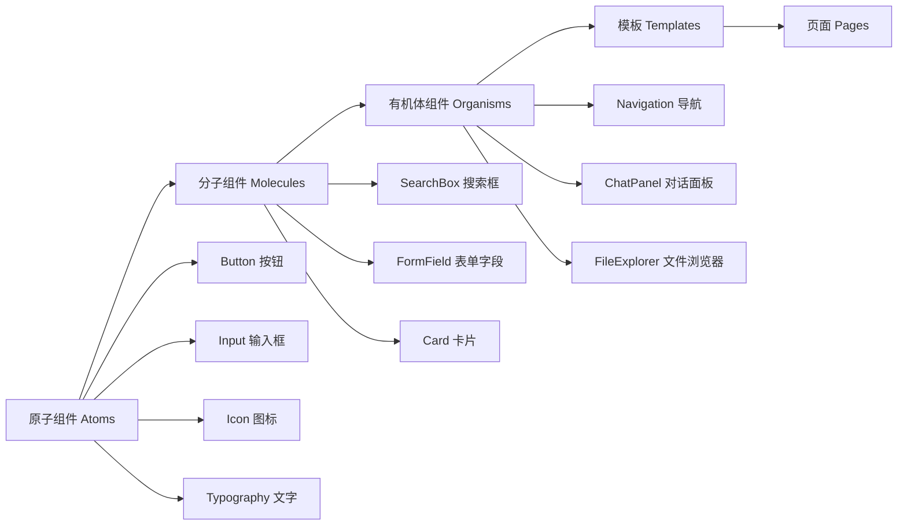

# 组件库设计规范

**版本**: v2.1.0  
**更新日期**: 2025-08-24  
**基于**: UI设计规范_定稿_v2.0.md 组件规范部分  

## 版本修订记录

| 版本 | 日期 | 修改内容 | 修改人 |
|------|------|----------|--------|
| v2.1.0 | 2025-08-24 | 统一版本号格式为三段版本号，添加版本修订记录 | 系统整理 |
| v2.1 | 2025-08-22 | 完善原子组件规范，增加交互状态设计 | UI设计师 |
| v2.0 | 2025-08-19 | 重新设计组件库架构，引入原子设计方法论 | UI设计师 |
| v1.0 | 2025-08-16 | 初始版本，定义基础组件规范 | UI设计师 |  

## 1. 组件库概述

### 1.1 设计理念

**原子设计方法论** - 从原子组件到分子组件再到有机体组件  
**可复用性** - 组件在不同场景下保持一致性和可复用性  
**可组合性** - 小组件可以组合成复杂的界面元素  
**可扩展性** - 组件库支持主题定制和功能扩展  

### 1.2 组件层级



## 2. 原子组件 (Atoms)

### 2.1 Button 按钮组件

#### 2.1.1 按钮变体

| 变体 | 用途 | 视觉特征 | 代码示例 |
|------|------|----------|----------|
| Primary | 主要操作 | 蓝色填充 | `<Button variant="primary">` |
| Secondary | 次要操作 | 蓝色边框 | `<Button variant="secondary">` |
| Tertiary | 辅助操作 | 无边框 | `<Button variant="tertiary">` |
| Danger | 危险操作 | 红色填充 | `<Button variant="danger">` |
| Ghost | 幽灵按钮 | 透明背景 | `<Button variant="ghost">` |

#### 2.1.2 按钮尺寸

```tsx
// 按钮尺寸定义
interface ButtonSize {
  small: {
    height: '28px';
    padding: '6px 12px';
    fontSize: '12px';
  };
  medium: {
    height: '36px';
    padding: '8px 16px';
    fontSize: '14px';
  };
  large: {
    height: '44px';
    padding: '12px 24px';
    fontSize: '16px';
  };
}
```

#### 2.1.3 按钮状态

```css
/* 按钮状态样式 */
.btn-primary {
  background-color: var(--primary-blue);
  color: white;
  border: none;
  transition: all 0.2s ease;
}

.btn-primary:hover {
  background-color: var(--primary-blue-dark);
  transform: translateY(-1px);
  box-shadow: 0 4px 12px rgba(59, 130, 246, 0.3);
}

.btn-primary:active {
  transform: translateY(0);
  box-shadow: 0 2px 4px rgba(59, 130, 246, 0.3);
}

.btn-primary:disabled {
  background-color: var(--gray-400);
  cursor: not-allowed;
  transform: none;
  box-shadow: none;
}

.btn-primary:focus-visible {
  outline: 2px solid var(--primary-blue);
  outline-offset: 2px;
}
```

### 2.2 Input 输入框组件

#### 2.2.1 输入框类型

| 类型 | 用途 | 特性 |
|------|------|------|
| Text | 文本输入 | 单行文本 |
| Textarea | 多行文本 | 自动高度调整 |
| Password | 密码输入 | 隐藏输入内容 |
| Email | 邮箱输入 | 邮箱格式验证 |
| Number | 数字输入 | 数字格式限制 |
| Search | 搜索输入 | 带搜索图标 |

#### 2.2.2 输入框状态

```css
/* 输入框基础样式 */
.input {
  padding: 12px 16px;
  border: 1px solid var(--gray-300);
  border-radius: var(--radius-xl);
  font-size: 14px;
  font-family: inherit;
  transition: all 0.2s ease;
  background: white;
}

/* 聚焦状态 */
.input:focus {
  outline: none;
  border-color: var(--primary-blue);
  box-shadow: 0 0 0 3px rgba(59, 130, 246, 0.1);
}

/* 错误状态 */
.input.error {
  border-color: var(--error-red);
  box-shadow: 0 0 0 3px rgba(239, 68, 68, 0.1);
}

/* 成功状态 */
.input.success {
  border-color: var(--success-green);
  box-shadow: 0 0 0 3px rgba(16, 185, 129, 0.1);
}

/* 禁用状态 */
.input:disabled {
  background-color: var(--gray-100);
  color: var(--gray-400);
  cursor: not-allowed;
}
```

#### 2.2.3 多行输入框特性

```css
/* 可调节高度的文本域 */
.textarea {
  min-height: 80px;
  max-height: 200px;
  resize: vertical;
  font-family: inherit;
  line-height: 1.5;
}

/* 自动高度调整 */
.textarea-auto {
  resize: none;
  overflow: hidden;
}
```

### 2.3 Icon 图标组件

#### 2.3.1 图标规格

```typescript
interface IconProps {
  name: string;          // 图标名称
  size?: 16 | 20 | 24 | 32 | 48; // 图标尺寸
  color?: string;        // 图标颜色
  strokeWidth?: 1.5 | 2 | 2.5; // 描边粗细
  className?: string;    // 自定义样式
}

// 使用示例
<Icon name="search" size={20} color="currentColor" />
<Icon name="chevron-down" size={16} strokeWidth={2} />
```

#### 2.3.2 图标库标准

| 类别 | 数量 | 风格 | 示例 |
|------|------|------|------|
| 导航图标 | 8个 | 线性 | home, menu, arrow-left |
| 操作图标 | 12个 | 线性 | edit, delete, download |
| 状态图标 | 6个 | 线性+填充 | check, alert, info |
| 文件图标 | 10个 | 线性 | file, folder, image |
| 社交图标 | 5个 | 品牌色 | share, like, comment |

### 2.4 Typography 文字组件

#### 2.4.1 文字层级

```css
/* 标题组件 */
.heading-1 { font-size: 32px; font-weight: 600; line-height: 1.25; }
.heading-2 { font-size: 24px; font-weight: 600; line-height: 1.33; }
.heading-3 { font-size: 20px; font-weight: 600; line-height: 1.4; }
.heading-4 { font-size: 18px; font-weight: 500; line-height: 1.44; }

/* 正文组件 */
.body-large { font-size: 16px; font-weight: 400; line-height: 1.5; }
.body-medium { font-size: 14px; font-weight: 400; line-height: 1.43; }
.body-small { font-size: 12px; font-weight: 400; line-height: 1.33; }

/* 辅助文字 */
.caption { font-size: 12px; font-weight: 400; line-height: 1.33; color: var(--text-tertiary); }
.label { font-size: 12px; font-weight: 500; line-height: 1.33; text-transform: uppercase; }
```

#### 2.4.2 文字颜色变体

```css
/* 文字颜色类 */
.text-primary { color: var(--text-primary); }
.text-secondary { color: var(--text-secondary); }
.text-tertiary { color: var(--text-tertiary); }
.text-muted { color: var(--text-quaternary); }
.text-inverse { color: var(--text-inverse); }
.text-link { color: var(--text-link); cursor: pointer; }
.text-success { color: var(--success-green); }
.text-warning { color: var(--warning-yellow); }
.text-error { color: var(--error-red); }
```

## 3. 分子组件 (Molecules)

### 3.1 SearchBox 搜索框组件

#### 3.1.1 组件结构

```tsx
interface SearchBoxProps {
  placeholder?: string;
  value: string;
  onChange: (value: string) => void;
  onSubmit?: (value: string) => void;
  size?: 'small' | 'medium' | 'large';
  loading?: boolean;
  disabled?: boolean;
}

const SearchBox: React.FC<SearchBoxProps> = ({
  placeholder = "搜索...",
  value,
  onChange,
  onSubmit,
  size = 'medium',
  loading = false,
  disabled = false
}) => {
  return (
    <div className={`search-box search-box--${size}`}>
      <Icon name="search" size={16} />
      <input
        type="text"
        placeholder={placeholder}
        value={value}
        onChange={(e) => onChange(e.target.value)}
        onKeyPress={(e) => e.key === 'Enter' && onSubmit?.(value)}
        disabled={disabled}
      />
      {loading && <Spinner size="small" />}
      {value && (
        <Button
          variant="ghost"
          size="small"
          onClick={() => onChange('')}
          aria-label="清除搜索"
        >
          <Icon name="x" size={14} />
        </Button>
      )}
    </div>
  );
};
```

#### 3.1.2 样式实现

```css
.search-box {
  display: flex;
  align-items: center;
  background: white;
  border: 1px solid var(--gray-300);
  border-radius: var(--radius-xl);
  padding: 0 12px;
  transition: all 0.2s ease;
}

.search-box:focus-within {
  border-color: var(--primary-blue);
  box-shadow: 0 0 0 3px rgba(59, 130, 246, 0.1);
}

.search-box input {
  flex: 1;
  border: none;
  outline: none;
  padding: 10px 8px;
  font-size: 14px;
}

.search-box--small { padding: 0 8px; }
.search-box--small input { padding: 6px 8px; font-size: 12px; }

.search-box--large { padding: 0 16px; }
.search-box--large input { padding: 14px 8px; font-size: 16px; }
```

### 3.2 FormField 表单字段组件

#### 3.2.1 组件结构

```tsx
interface FormFieldProps {
  label: string;
  required?: boolean;
  error?: string;
  helperText?: string;
  children: React.ReactNode;
}

const FormField: React.FC<FormFieldProps> = ({
  label,
  required = false,
  error,
  helperText,
  children
}) => {
  const fieldId = useId();
  
  return (
    <div className="form-field">
      <label htmlFor={fieldId} className="form-field__label">
        {label}
        {required && <span className="form-field__required">*</span>}
      </label>
      
      <div className="form-field__input">
        {React.cloneElement(children as React.ReactElement, {
          id: fieldId,
          'aria-describedby': error ? `${fieldId}-error` : helperText ? `${fieldId}-helper` : undefined,
          'aria-invalid': !!error
        })}
      </div>
      
      {error && (
        <div id={`${fieldId}-error`} className="form-field__error">
          <Icon name="alert-circle" size={14} />
          {error}
        </div>
      )}
      
      {helperText && !error && (
        <div id={`${fieldId}-helper`} className="form-field__helper">
          {helperText}
        </div>
      )}
    </div>
  );
};
```

### 3.3 Card 卡片组件

#### 3.3.1 卡片变体

```tsx
interface CardProps {
  variant?: 'default' | 'outlined' | 'elevated' | 'filled';
  padding?: 'none' | 'small' | 'medium' | 'large';
  interactive?: boolean;
  children: React.ReactNode;
  onClick?: () => void;
}

const Card: React.FC<CardProps> = ({
  variant = 'default',
  padding = 'medium',
  interactive = false,
  children,
  onClick
}) => {
  return (
    <div
      className={cn(
        'card',
        `card--${variant}`,
        `card--padding-${padding}`,
        interactive && 'card--interactive'
      )}
      onClick={onClick}
      role={onClick ? 'button' : undefined}
      tabIndex={onClick ? 0 : undefined}
    >
      {children}
    </div>
  );
};
```

#### 3.3.2 卡片样式

```css
.card {
  background: white;
  border-radius: var(--radius-lg);
  transition: all 0.2s ease;
}

.card--default {
  box-shadow: var(--shadow-card);
}

.card--outlined {
  border: 1px solid var(--gray-200);
}

.card--elevated {
  box-shadow: var(--shadow-lg);
}

.card--filled {
  background: var(--gray-50);
}

.card--interactive {
  cursor: pointer;
}

.card--interactive:hover {
  transform: translateY(-2px);
  box-shadow: var(--shadow-lg);
}

.card--padding-none { padding: 0; }
.card--padding-small { padding: var(--space-3); }
.card--padding-medium { padding: var(--space-6); }
.card--padding-large { padding: var(--space-8); }
```

## 4. 有机体组件 (Organisms)

### 4.1 Navigation 导航组件

#### 4.1.1 顶部导航

```tsx
interface NavigationItem {
  id: string;
  label: string;
  href: string;
  icon?: string;
  active?: boolean;
}

interface TopNavigationProps {
  items: NavigationItem[];
  logo?: React.ReactNode;
  actions?: React.ReactNode;
}

const TopNavigation: React.FC<TopNavigationProps> = ({
  items,
  logo,
  actions
}) => {
  return (
    <nav className="top-navigation" role="navigation" aria-label="主导航">
      <div className="top-navigation__container">
        {logo && (
          <div className="top-navigation__logo">
            {logo}
          </div>
        )}
        
        <ul className="top-navigation__menu" role="menubar">
          {items.map(item => (
            <li key={item.id} role="none">
              <a
                href={item.href}
                className={cn(
                  'top-navigation__item',
                  item.active && 'top-navigation__item--active'
                )}
                role="menuitem"
                aria-current={item.active ? 'page' : undefined}
              >
                {item.icon && <Icon name={item.icon} size={16} />}
                {item.label}
              </a>
            </li>
          ))}
        </ul>
        
        {actions && (
          <div className="top-navigation__actions">
            {actions}
          </div>
        )}
      </div>
    </nav>
  );
};
```

### 4.2 ChatPanel 对话面板组件

#### 4.2.1 消息组件

```tsx
interface Message {
  id: string;
  role: 'user' | 'ai';
  content: string;
  timestamp: Date;
  aiId?: string;
}

interface MessageItemProps {
  message: Message;
  onMessageClick?: (message: Message) => void;
}

const MessageItem: React.FC<MessageItemProps> = ({
  message,
  onMessageClick
}) => {
  return (
    <div
      className={cn(
        'message',
        `message--${message.role}`,
        onMessageClick && 'message--interactive'
      )}
      data-ai-id={message.aiId}
      onClick={() => onMessageClick?.(message)}
    >
      <div className="message__avatar">
        {message.role === 'user' ? (
          <Icon name="user" size={20} />
        ) : (
          <Icon name="bot" size={20} />
        )}
      </div>
      
      <div className="message__content">
        <div className="message__text">
          {message.content}
        </div>
        <div className="message__timestamp">
          {formatTime(message.timestamp)}
        </div>
      </div>
    </div>
  );
};
```

#### 4.2.2 消息输入组件

```tsx
interface MessageInputProps {
  value: string;
  onChange: (value: string) => void;
  onSubmit: (message: string) => void;
  disabled?: boolean;
  placeholder?: string;
  supportVoice?: boolean;
}

const MessageInput: React.FC<MessageInputProps> = ({
  value,
  onChange,
  onSubmit,
  disabled = false,
  placeholder = "输入消息...",
  supportVoice = false
}) => {
  const textareaRef = useRef<HTMLTextAreaElement>(null);
  
  // 自动调整高度
  useEffect(() => {
    const textarea = textareaRef.current;
    if (textarea) {
      textarea.style.height = 'auto';
      textarea.style.height = `${Math.min(textarea.scrollHeight, 120)}px`;
    }
  }, [value]);
  
  const handleSubmit = () => {
    if (value.trim() && !disabled) {
      onSubmit(value.trim());
      onChange('');
    }
  };
  
  return (
    <div className="message-input">
      <div className="message-input__field">
        <textarea
          ref={textareaRef}
          value={value}
          onChange={(e) => onChange(e.target.value)}
          onKeyPress={(e) => {
            if (e.key === 'Enter' && !e.shiftKey) {
              e.preventDefault();
              handleSubmit();
            }
          }}
          placeholder={placeholder}
          disabled={disabled}
          className="message-input__textarea"
          rows={1}
        />
        
        <div className="message-input__actions">
          {supportVoice && (
            <Button
              variant="ghost"
              size="small"
              aria-label="语音输入"
            >
              <Icon name="mic" size={16} />
            </Button>
          )}
          
          <Button
            variant="primary"
            size="small"
            onClick={handleSubmit}
            disabled={disabled || !value.trim()}
            aria-label="发送消息"
          >
            <Icon name="send" size={16} />
          </Button>
        </div>
      </div>
    </div>
  );
};
```

### 4.3 FileExplorer 文件浏览器组件

#### 4.3.1 文件夹树组件

```tsx
interface FolderNode {
  id: string;
  name: string;
  children?: FolderNode[];
  isExpanded?: boolean;
}

interface FolderTreeProps {
  data: FolderNode[];
  selectedId?: string;
  onSelect: (node: FolderNode) => void;
  onToggle: (nodeId: string) => void;
  onCreateFolder: (parentId: string) => void;
}

const FolderTree: React.FC<FolderTreeProps> = ({
  data,
  selectedId,
  onSelect,
  onToggle,
  onCreateFolder
}) => {
  const renderNode = (node: FolderNode, level = 0) => (
    <div key={node.id} className="folder-tree__node">
      <div
        className={cn(
          'folder-tree__item',
          selectedId === node.id && 'folder-tree__item--selected'
        )}
        style={{ paddingLeft: `${level * 20 + 12}px` }}
        onClick={() => onSelect(node)}
      >
        {node.children && (
          <Button
            variant="ghost"
            size="small"
            className="folder-tree__toggle"
            onClick={(e) => {
              e.stopPropagation();
              onToggle(node.id);
            }}
          >
            <Icon
              name={node.isExpanded ? 'chevron-down' : 'chevron-right'}
              size={14}
            />
          </Button>
        )}
        
        <Icon name="folder" size={16} />
        <span className="folder-tree__name">{node.name}</span>
        
        <Button
          variant="ghost"
          size="small"
          className="folder-tree__add"
          onClick={(e) => {
            e.stopPropagation();
            onCreateFolder(node.id);
          }}
          aria-label={`在 ${node.name} 中新建文件夹`}
        >
          <Icon name="plus" size={12} />
        </Button>
      </div>
      
      {node.isExpanded && node.children && (
        <div className="folder-tree__children">
          {node.children.map(child => renderNode(child, level + 1))}
        </div>
      )}
    </div>
  );
  
  return (
    <div className="folder-tree">
      {data.map(node => renderNode(node))}
    </div>
  );
};
```

## 5. 主题定制

### 5.1 主题变量

```typescript
interface Theme {
  colors: {
    primary: string;
    secondary: string;
    success: string;
    warning: string;
    error: string;
    background: string;
    surface: string;
    text: {
      primary: string;
      secondary: string;
      tertiary: string;
    };
  };
  spacing: {
    xs: string;
    sm: string;
    md: string;
    lg: string;
    xl: string;
  };
  typography: {
    fontFamily: string;
    fontSize: {
      xs: string;
      sm: string;
      md: string;
      lg: string;
      xl: string;
    };
  };
  shadows: {
    sm: string;
    md: string;
    lg: string;
  };
}
```

### 5.2 主题切换

```tsx
const ThemeProvider: React.FC<{ theme: Theme; children: React.ReactNode }> = ({
  theme,
  children
}) => {
  useEffect(() => {
    const root = document.documentElement;
    
    // 应用主题变量
    Object.entries(theme.colors).forEach(([key, value]) => {
      if (typeof value === 'string') {
        root.style.setProperty(`--color-${key}`, value);
      } else {
        Object.entries(value).forEach(([subKey, subValue]) => {
          root.style.setProperty(`--color-${key}-${subKey}`, subValue);
        });
      }
    });
  }, [theme]);
  
  return <>{children}</>;
};
```

## 6. 组件文档规范

### 6.1 组件API文档

```typescript
/**
 * Button 按钮组件
 * 
 * @example
 * ```tsx
 * <Button variant="primary" size="medium" onClick={handleClick}>
 *   点击我
 * </Button>
 * ```
 */
export interface ButtonProps {
  /** 按钮变体 */
  variant?: 'primary' | 'secondary' | 'tertiary' | 'danger' | 'ghost';
  
  /** 按钮尺寸 */
  size?: 'small' | 'medium' | 'large';
  
  /** 是否禁用 */
  disabled?: boolean;
  
  /** 是否显示加载状态 */
  loading?: boolean;
  
  /** 按钮内容 */
  children: React.ReactNode;
  
  /** 点击事件处理器 */
  onClick?: (event: React.MouseEvent<HTMLButtonElement>) => void;
  
  /** 自定义CSS类名 */
  className?: string;
}
```

### 6.2 使用示例

```tsx
// 基础用法
<Button variant="primary">主要按钮</Button>

// 带图标
<Button variant="secondary">
  <Icon name="download" size={16} />
  下载
</Button>

// 加载状态
<Button variant="primary" loading>
  提交中...
</Button>

// 危险操作
<Button variant="danger" onClick={handleDelete}>
  删除
</Button>
```

---

**文档维护**: 设计团队  
**审核状态**: 待审核  
**相关文档**: 界面设计规范, 交互逻辑与动效规范