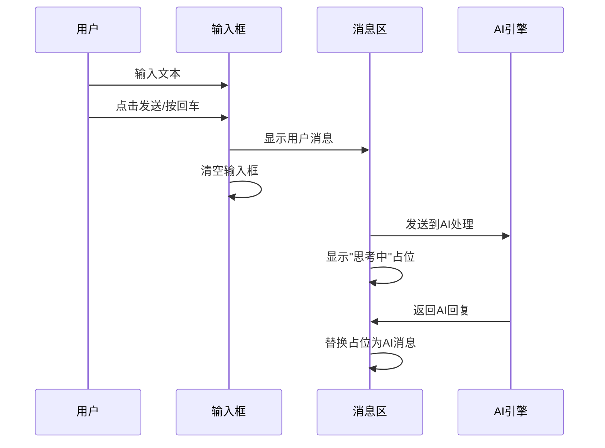

# 交互逻辑与动效规范

**版本**: v2.1.0  
**更新日期**: 2025-08-24  
**基于**: UI设计规范_定稿_v2.0.md 连线与交互规则  
**适用范围**: 产品/设计/前端开发  

## 版本修订记录

| 版本 | 日期 | 修改内容 | 修改人 |
|------|------|----------|--------|
| v2.1.0 | 2025-08-24 | 统一版本号格式为三段版本号，添加版本修订记录 | 系统整理 |
| v2.1 | 2025-08-22 | 完善连线系统交互逻辑，增加动效规范 | 交互设计师 |
| v2.0 | 2025-08-20 | 重新设计对话工作台交互系统 | 交互设计师 |
| v1.0 | 2025-08-17 | 初始版本，定义基础交互逻辑与动效 | 交互设计师 |  

## 1. 交互设计原则

### 1.1 核心交互理念

**直观性** - 交互行为符合用户直觉和习惯  
**反馈性** - 每个操作都有明确的视觉和状态反馈  
**一致性** - 相同功能在不同页面保持一致的交互方式  
**可预测性** - 用户能够预期操作的结果  

### 1.2 交互设计目标

| 目标 | 具体表现 | 衡量方式 |
|------|----------|----------|
| 易学性 | 新用户快速上手 | 首次使用成功率>85% |
| 高效性 | 操作步骤最少化 | 核心任务3步内完成 |
| 容错性 | 错误操作可恢复 | 用户错误率<5% |
| 满意度 | 操作体验愉悦 | 用户满意度>4.5/5 |

## 2. 对话工作台交互规范

### 2.1 消息交互逻辑

#### 2.1.1 消息发送流程



**交互要点**:
- 输入框支持多行文本，自动高度调整（最大120px）
- 回车键发送，Shift+回车换行
- 发送按钮在有内容时高亮可点击
- 语音输入按钮在不支持时自动隐藏

#### 2.1.2 消息状态反馈

| 状态 | 视觉表现 | 持续时间 |
|------|----------|----------|
| 输入中 | 输入框边框高亮 | 实时 |
| 发送中 | 发送按钮Loading动画 | <1s |
| AI思考 | 思考中气泡，点点动画 | 3-10s |
| 完成 | 消息正常显示 | 持久 |
| 失败 | 红色错误提示，重试按钮 | 直到重试 |

### 2.2 卡片系统交互

#### 2.2.1 卡片生成逻辑

```typescript
// 卡片类型判断逻辑
function generateCard(aiMessage: string, intent: string) {
  switch(intent) {
    case 'video_creation':
      return new VideoPreviewCard(aiMessage);
    case 'strategy_discussion':
      return new StrategyMapCard(aiMessage);
    case 'collaboration_request':
      return new CollaborationCard(aiMessage);
    case 'data_query':
      return new DataReportCard(aiMessage);
    case 'task_update':
      return new ProgressCard(aiMessage);
    default:
      return null;
  }
}
```

#### 2.2.2 卡片交互行为

| 卡片类型 | 主要交互 | 次要交互 | 状态变化 |
|----------|----------|----------|----------|
| 视频预览 | 点击播放 | 下载、编辑、分享 | 播放中→暂停 |
| 战略地图 | 点击展开 | 导出、编辑 | 折叠→展开 |
| 协作提醒 | 点击操作按钮 | 忽略、延后 | 待处理→处理中→已完成 |
| 数据简报 | 点击查看详情 | 导出、刷新 | 加载中→已加载 |
| 任务进度 | 点击更新状态 | 查看详情、分配 | 各状态间切换 |

### 2.3 连线系统交互

#### 2.3.1 连线渲染逻辑

```javascript
// 连线计算和渲染
class ConnectionSystem {
  constructor() {
    this.svg = document.querySelector('#connection-layer');
    this.connections = new Map();
  }
  
  // 创建连线
  createConnection(messageElement, cardElement, aiId) {
    const line = this.calculateBezierPath(messageElement, cardElement);
    const connection = {
      line,
      messageEl: messageElement,
      cardEl: cardElement,
      aiId
    };
    this.connections.set(aiId, connection);
    this.renderConnection(connection);
  }
  
  // 计算贝塞尔曲线路径
  calculateBezierPath(startEl, endEl) {
    const startRect = startEl.getBoundingClientRect();
    const endRect = endEl.getBoundingClientRect();
    
    const startX = startRect.right;
    const startY = startRect.top + startRect.height / 2;
    const endX = endRect.left;
    const endY = endRect.top + endRect.height / 2;
    
    const controlX1 = startX + (endX - startX) * 0.5;
    const controlY1 = startY;
    const controlX2 = startX + (endX - startX) * 0.5;
    const controlY2 = endY;
    
    return `M${startX},${startY} C${controlX1},${controlY1} ${controlX2},${controlY2} ${endX},${endY}`;
  }
}
```

#### 2.3.2 连线状态变化

| 状态 | 线宽 | 锚点半径 | 颜色透明度 | 触发条件 |
|------|------|----------|------------|----------|
| 默认 | 2.5px | 4px | 1.0 | 初始状态 |
| 悬停 | 3px | 5px | 1.0 | 鼠标悬停相关元素 |
| 选中 | 3.5px | 6px | 1.0 | 点击联动 |
| 淡化 | 2.5px | 4px | 0.3 | 其他连线选中时 |

#### 2.3.3 连线更新机制

```javascript
// 连线更新触发条件
const updateTriggers = [
  'window.resize',     // 窗口大小变化
  'scroll.left-panel', // 左侧滚动
  'scroll.right-panel',// 右侧滚动
  'message.add',       // 新增消息
  'card.add',          // 新增卡片
  'selection.change'   // 选择变化
];

// 防抖更新机制
const debouncedUpdate = debounce(() => {
  connectionSystem.updateAllConnections();
}, 16); // 60fps
```

### 2.4 点击联动交互

#### 2.4.1 联动触发逻辑

```javascript
// 点击联动处理
function handleElementClick(element, type) {
  const aiId = element.dataset.aiId;
  
  if (type === 'message') {
    // 点击消息，联动卡片
    const cardElement = document.querySelector(`[data-ai-id="${aiId}"].card`);
    if (cardElement) {
      highlightConnection(aiId);
      scrollToElement(cardElement, 'right-panel');
    }
  } else if (type === 'card') {
    // 点击卡片，联动消息
    const messageElement = document.querySelector(`[data-ai-id="${aiId}"].message`);
    if (messageElement) {
      highlightConnection(aiId);
      scrollToElement(messageElement, 'left-panel');
    }
  }
}
```

#### 2.4.2 滚动定位算法

```javascript
// 平滑滚动到目标元素
function scrollToElement(element, panelId) {
  const panel = document.getElementById(panelId);
  const elementRect = element.getBoundingClientRect();
  const panelRect = panel.getBoundingClientRect();
  
  // 计算目标位置（居中显示）
  const targetScroll = panel.scrollTop + 
    elementRect.top - panelRect.top - 
    (panelRect.height / 2) + 
    (elementRect.height / 2);
  
  // 平滑滚动
  panel.scrollTo({
    top: Math.max(0, targetScroll),
    behavior: 'smooth'
  });
}
```

### 2.5 自动滚动机制

#### 2.5.1 新消息自动滚动

```javascript
// 新消息自动滚动逻辑
function handleNewMessage(messageData) {
  const leftPanel = document.getElementById('left-panel');
  const rightPanel = document.getElementById('right-panel');
  
  // 添加新消息到DOM
  const messageElement = createMessageElement(messageData);
  appendToPanel(messageElement, leftPanel);
  
  // 如果是AI消息且有对应卡片
  if (messageData.role === 'ai' && messageData.cardData) {
    const cardElement = createCardElement(messageData.cardData);
    appendToPanel(cardElement, rightPanel);
    
    // 创建连线
    connectionSystem.createConnection(messageElement, cardElement, messageData.aiId);
    
    // 双侧同步滚动到最新
    requestAnimationFrame(() => {
      scrollToBottom(leftPanel);
      scrollToBottom(rightPanel);
    });
  } else {
    // 只滚动左侧
    scrollToBottom(leftPanel);
  }
}
```

#### 2.5.2 滚动边界检测

```javascript
// 滚动边界检测
function scrollToBottom(panel) {
  const isNearBottom = panel.scrollTop + panel.clientHeight >= 
    panel.scrollHeight - 50; // 50px容错
  
  if (isNearBottom) {
    panel.scrollTo({
      top: panel.scrollHeight,
      behavior: 'smooth'
    });
  }
}
```

## 3. 素材管理交互规范

### 3.1 目录树交互

#### 3.1.1 目录操作交互

| 操作 | 触发方式 | 反馈 | 状态变化 |
|------|----------|------|----------|
| 展开/折叠 | 点击文件夹图标 | 箭头旋转动画 | 展开→折叠 |
| 新建子目录 | 点击行尾"+"按钮 | 输入框出现 | 正常→编辑模式 |
| 重命名 | 双击目录名 | 文字变为输入框 | 显示→编辑 |
| 删除 | 右键菜单 | 确认对话框 | 存在→删除 |
| 选中 | 点击目录名 | 高亮背景 | 未选中→选中 |

#### 3.1.2 目录树状态管理

```javascript
// 目录树状态管理
class FolderTreeState {
  constructor() {
    this.expandedFolders = new Set();
    this.selectedFolder = null;
    this.editingFolder = null;
  }
  
  toggleExpand(folderId) {
    if (this.expandedFolders.has(folderId)) {
      this.expandedFolders.delete(folderId);
    } else {
      this.expandedFolders.add(folderId);
    }
    this.updateTreeDisplay();
  }
  
  selectFolder(folderId) {
    this.selectedFolder = folderId;
    this.updateSelection();
    this.loadFolderContent(folderId);
  }
}
```

### 3.2 文件上传交互

#### 3.2.1 上传区域交互状态

| 状态 | 视觉表现 | 触发条件 |
|------|----------|----------|
| 默认 | 虚线边框，灰色背景 | 初始状态 |
| 悬停 | 实线边框，浅蓝背景 | 鼠标悬停 |
| 拖拽进入 | 蓝色边框，高亮背景 | 文件拖拽到区域 |
| 上传中 | 进度条显示 | 文件上传过程中 |
| 完成 | 绿色边框，成功提示 | 上传完成 |
| 错误 | 红色边框，错误信息 | 上传失败 |

#### 3.2.2 拖拽上传逻辑

```javascript
// 拖拽上传处理
class DragUploadHandler {
  constructor(dropZone) {
    this.dropZone = dropZone;
    this.initEventListeners();
  }
  
  initEventListeners() {
    this.dropZone.addEventListener('dragover', this.handleDragOver.bind(this));
    this.dropZone.addEventListener('dragleave', this.handleDragLeave.bind(this));
    this.dropZone.addEventListener('drop', this.handleDrop.bind(this));
  }
  
  handleDragOver(event) {
    event.preventDefault();
    this.dropZone.classList.add('drag-over');
  }
  
  handleDragLeave(event) {
    if (!this.dropZone.contains(event.relatedTarget)) {
      this.dropZone.classList.remove('drag-over');
    }
  }
  
  handleDrop(event) {
    event.preventDefault();
    this.dropZone.classList.remove('drag-over');
    
    const files = Array.from(event.dataTransfer.files);
    this.processFiles(files);
  }
  
  processFiles(files) {
    files.forEach(file => {
      if (this.validateFile(file)) {
        this.uploadFile(file);
      }
    });
  }
}
```

### 3.3 文件浏览交互

#### 3.3.1 文件网格交互

| 交互 | 行为 | 反馈 |
|------|------|------|
| 单击文件 | 选中文件 | 高亮边框 |
| 双击文件 | 预览/打开 | 预览窗口 |
| 右键文件 | 上下文菜单 | 菜单弹出 |
| Ctrl+点击 | 多选 | 多个高亮 |
| 悬停文件 | 显示详情 | 工具提示 |

#### 3.3.2 文件预览交互

```javascript
// 文件预览处理
class FilePreview {
  static previewFile(file) {
    const fileType = file.type || this.getFileTypeByExtension(file.name);
    
    switch(fileType.split('/')[0]) {
      case 'image':
        return this.previewImage(file);
      case 'video':
        return this.previewVideo(file);
      case 'audio':
        return this.previewAudio(file);
      default:
        return this.previewDocument(file);
    }
  }
  
  static previewImage(file) {
    const modal = document.createElement('div');
    modal.className = 'preview-modal';
    modal.innerHTML = `
      <div class="preview-content">
        
        <div class="preview-controls">
          <button class="btn-download">下载</button>
          <button class="btn-close">关闭</button>
        </div>
      </div>
    `;
    document.body.appendChild(modal);
  }
}
```

## 4. 弹窗交互规范

### 4.1 弹窗行为模式

#### 4.1.1 弹窗层级管理

```css
/* 弹窗层级规范 */
.modal-overlay {
  z-index: 1000;  /* 基础弹窗层 */
}

.modal-high {
  z-index: 1100;  /* 高优先级弹窗 */
}

.modal-critical {
  z-index: 1200;  /* 关键操作弹窗 */
}

.tooltip {
  z-index: 1300;  /* 工具提示 */
}
```

#### 4.1.2 弹窗动画规范

| 弹窗类型 | 进入动画 | 退出动画 | 持续时间 |
|----------|----------|----------|----------|
| 模态框 | 淡入+缩放 | 淡出+缩放 | 300ms |
| 抽屉 | 滑入 | 滑出 | 250ms |
| 工具提示 | 淡入 | 淡出 | 150ms |
| 确认框 | 弹跳进入 | 淡出 | 200ms |

```css
/* 弹窗动画实现 */
@keyframes modalEnter {
  from {
    opacity: 0;
    transform: scale(0.9) translateY(20px);
  }
  to {
    opacity: 1;
    transform: scale(1) translateY(0);
  }
}

@keyframes modalExit {
  from {
    opacity: 1;
    transform: scale(1) translateY(0);
  }
  to {
    opacity: 0;
    transform: scale(0.9) translateY(20px);
  }
}
```

### 4.2 弹窗关闭逻辑

#### 4.2.1 关闭触发方式

| 触发方式 | 适用场景 | 实现方式 |
|----------|----------|----------|
| 点击关闭按钮 | 所有弹窗 | 按钮点击事件 |
| 点击遮罩层 | 非关键操作 | 遮罩点击事件 |
| 按ESC键 | 所有弹窗 | 键盘事件监听 |
| 自动关闭 | 成功提示 | 定时器 |

```javascript
// 弹窗关闭逻辑
class ModalManager {
  constructor() {
    this.openModals = [];
    this.initGlobalListeners();
  }
  
  initGlobalListeners() {
    // ESC键关闭最顶层弹窗
    document.addEventListener('keydown', (event) => {
      if (event.key === 'Escape' && this.openModals.length > 0) {
        this.closeTopModal();
      }
    });
    
    // 点击遮罩关闭
    document.addEventListener('click', (event) => {
      if (event.target.classList.contains('modal-overlay')) {
        this.closeModal(event.target);
      }
    });
  }
  
  openModal(modalElement) {
    this.openModals.push(modalElement);
    modalElement.classList.add('modal-open');
    document.body.classList.add('modal-open');
  }
  
  closeModal(modalElement) {
    modalElement.classList.add('modal-closing');
    setTimeout(() => {
      modalElement.remove();
      this.openModals = this.openModals.filter(m => m !== modalElement);
      if (this.openModals.length === 0) {
        document.body.classList.remove('modal-open');
      }
    }, 300);
  }
}
```

## 5. 动效设计规范

### 5.1 动效类型与用途

| 动效类型 | 用途 | 示例 |
|----------|------|------|
| 过渡动效 | 状态切换 | 按钮hover、tab切换 |
| 加载动效 | 等待反馈 | 旋转圈、进度条 |
| 反馈动效 | 操作确认 | 成功勾选、错误摇摆 |
| 引导动效 | 用户引导 | 箭头指示、高亮闪烁 |
| 装饰动效 | 品牌体验 | Logo动画、粒子效果 |

### 5.2 动效时间规范

```css
/* 动效时间标准 */
:root {
  --duration-instant: 0ms;      /* 即时反馈 */
  --duration-fast: 150ms;       /* 快速反馈 */
  --duration-normal: 250ms;     /* 标准过渡 */
  --duration-slow: 350ms;       /* 复杂动画 */
  --duration-extra-slow: 500ms; /* 特殊效果 */
}

/* 缓动函数 */
:root {
  --ease-linear: linear;
  --ease-in: cubic-bezier(0.4, 0, 1, 1);
  --ease-out: cubic-bezier(0, 0, 0.2, 1);
  --ease-in-out: cubic-bezier(0.4, 0, 0.2, 1);
  --ease-back: cubic-bezier(0.68, -0.55, 0.265, 1.55);
}
```

### 5.3 具体动效实现

#### 5.3.1 连线绘制动效

```css
/* 连线绘制动画 */
.connection-line {
  stroke-dasharray: 1000;
  stroke-dashoffset: 1000;
  animation: drawLine 0.8s ease-out forwards;
}

@keyframes drawLine {
  to {
    stroke-dashoffset: 0;
  }
}

/* 连线高亮动效 */
.connection-line.highlight {
  animation: lineHighlight 0.3s ease-in-out;
}

@keyframes lineHighlight {
  0%, 100% { opacity: 1; }
  50% { opacity: 0.6; }
}
```

#### 5.3.2 卡片进入动效

```css
/* 卡片进入动画 */
.card-enter {
  animation: cardSlideIn 0.4s ease-out;
}

@keyframes cardSlideIn {
  from {
    opacity: 0;
    transform: translateX(30px) scale(0.95);
  }
  to {
    opacity: 1;
    transform: translateX(0) scale(1);
  }
}

/* 卡片悬停动效 */
.card:hover {
  transform: translateY(-2px);
  box-shadow: 0 8px 25px rgba(0, 0, 0, 0.15);
  transition: all 0.2s ease-out;
}
```

#### 5.3.3 加载动效

```css
/* 思考中动画 */
.thinking-dots {
  display: inline-flex;
  gap: 4px;
}

.thinking-dots span {
  width: 6px;
  height: 6px;
  background: var(--primary-blue);
  border-radius: 50%;
  animation: thinking 1.4s infinite ease-in-out;
}

.thinking-dots span:nth-child(1) { animation-delay: -0.32s; }
.thinking-dots span:nth-child(2) { animation-delay: -0.16s; }
.thinking-dots span:nth-child(3) { animation-delay: 0s; }

@keyframes thinking {
  0%, 80%, 100% {
    opacity: 0.3;
    transform: scale(0.8);
  }
  40% {
    opacity: 1;
    transform: scale(1);
  }
}
```

#### 5.3.4 成功反馈动效

```css
/* 成功勾选动画 */
.success-check {
  animation: checkScale 0.3s ease-in-out;
}

@keyframes checkScale {
  0% {
    transform: scale(0);
  }
  50% {
    transform: scale(1.2);
  }
  100% {
    transform: scale(1);
  }
}

/* 成功提示震动 */
.success-shake {
  animation: successShake 0.5s ease-in-out;
}

@keyframes successShake {
  0%, 20%, 40%, 60%, 80%, 100% {
    transform: translateX(0);
  }
  10%, 30%, 50%, 70%, 90% {
    transform: translateX(-3px);
  }
}
```

## 6. 响应式交互

### 6.1 断点行为

| 断点 | 屏幕尺寸 | 交互变化 |
|------|----------|----------|
| Mobile | <768px | 单列布局，手势操作 |
| Tablet | 768-1024px | 双列布局，触摸优化 |
| Desktop | >1024px | 多列布局，鼠标交互 |

### 6.2 触摸交互优化

```css
/* 触摸目标尺寸 */
.touch-target {
  min-height: 44px;
  min-width: 44px;
  padding: 12px;
}

/* 触摸反馈 */
.touch-feedback:active {
  background-color: rgba(0, 0, 0, 0.1);
  transform: scale(0.98);
}
```

## 7. 无障碍交互

### 7.1 键盘导航

```javascript
// 键盘导航处理
class KeyboardNavigation {
  constructor() {
    this.focusableElements = [
      'button', 'input', 'select', 'textarea', 
      'a[href]', '[tabindex]:not([tabindex="-1"])'
    ];
    this.initKeyboardListeners();
  }
  
  initKeyboardListeners() {
    document.addEventListener('keydown', (event) => {
      switch(event.key) {
        case 'Tab':
          this.handleTabNavigation(event);
          break;
        case 'Enter':
        case ' ':
          this.handleActivation(event);
          break;
        case 'Escape':
          this.handleEscape(event);
          break;
      }
    });
  }
}
```

### 7.2 屏幕阅读器支持

```html
<!-- 语义化标记示例 -->
<nav aria-label="主导航">
  <ul role="menubar">
    <li role="none">
      <a href="#" role="menuitem" aria-current="page">对话工作台</a>
    </li>
  </ul>
</nav>

<main aria-label="主要内容">
  <section aria-labelledby="chat-title">
    <h2 id="chat-title">AI对话</h2>
    <div role="log" aria-live="polite" aria-label="对话消息">
      <!-- 消息内容 -->
    </div>
  </section>
</main>
```

---

**文档维护**: 设计团队  
**审核状态**: 待审核  
**相关文档**: 界面设计规范, 组件库设计规范