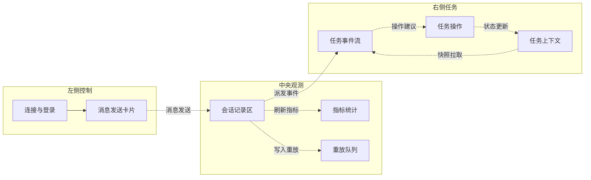

# WebSocket 调试页面开发手册
> 版本：2025-10-30  
> 维护角色：前端工程师 & 调试工程师  
> 关联文件：`websocket-test.html`、`static/ws-tester.js`

## 1. 页面概览

### 1.1 功能摘要
- **连接管理**：账户密码登录、Token 状态展示、自动登录/自动连接切换。
- **消息调试**：封装于单卡片的消息发送表单，覆盖消息类型、Session 锁定、模板填充等操作。
- **事件观测**：会话分组展示，支持主会话聚焦与 Markdown/JSON 双模态查看。
- **性能分析**：统计往返耗时（自动忽略 `workflow_started` 中间态）、收发次数和错误数。
- **工具集成**：配置导入导出、Engine.IO 心跳监测、请求重放、日志导出。
- **任务调试**：聚合任务上下文、事件流与操作入口，一站式查看和驱动任务执行流程。

### 1.2 布局速览

## 2. 环境准备
- **浏览器**：Chrome ≥ 118，需开启 `localStorage` 与 `FileReader`。
- **后端服务**：本地 `http://localhost:8080`，Socket.IO 路径 `/ws/socket.io`。
- **默认账号**：邮箱 `saiter2306001@163.com`，密码 `hsai1234`（可覆盖）。
- **网络要求**：允许访问本地 8080 端口；跨域时需确认 CORS/Socket 配置已放行。
- **本地存储**：配置保存在 `localStorage.openwebui_ws_tester_config_v2`，可通过“清空本地缓存”重置。

## 3. 操作流程

### 3.1 初始化配置
1. 打开 `websocket-test.html`。
2. 填写服务器地址与账号密码，必要时更新默认值。
3. 可勾选“页面加载后自动登录”“登录成功后自动连接 Socket”以免手动操作。
4. 若需分享当前环境设置，点击“导出配置”生成 JSON。

### 3.2 登录与连接
1. 点击“登录”，成功后用户 ID 与 Token 信息自动填充。
2. Token 面板会解析 JWT 的签发、过期时间，异常时显示“Token 解析失败”。
3. 登录按钮根据状态切换为“登录中… / 已登录 / 重新登录”；刷新 Token 时仅刷新按钮会进入 Loading 状态。
4. 点击“连接 Socket”，指示点转为绿色并展示当前 `socket.id`；按钮改为“连接中…/已连接”，并自动控制“断开连接”启用状态。
5. 若连接失败或断开，可在“最近事件”查看 `connect_error` 详情并再次尝试。

### 3.3 消息调试
1. 消息发送卡片中的控件已分组：消息类型、入口类型、Session 管理、正文、元数据与任务 ID 均在卡片内部完成。
2. 勾选“锁定当前会话”时，首次发送会自动填充生成的 `session_id` 并保持后续复用。
3. “消息正文”“附加元数据（JSON）”为必填区：若 JSON 校验失败会自动忽略并提示。
4. 底部按钮区提供“发送消息 / 发送欢迎语 / 查询系统状态”；操作成功后自动写入会话记录与重放队列。
5. 模板列表滚动展示，可一键填充常用 payload，并记录系统事件以便追踪。

### 3.4 会话记录与查看
1. 右侧卡片支持按会话、事件类型筛选；“聚焦输入 Session”“聚焦最新会话”“取消聚焦”分别对应三种视图模式。
2. 主会话会高亮并在标题下方显示徽章，其他会话会弱化显示但仍可展开查看。
3. 点击会话卡片中的正文区域将弹出 Markdown 模态框（依赖 `payload.displayText` 或 `content`）；若文本为空则直接展示 JSON。
4. 点击“查看 JSON”链接始终打开原始 JSON 模态框，两种模态互不干扰，支持 `Esc`/背景点击关闭。
5. 每条消息均保留原始时间、往返耗时（忽略 `workflow_started` 中间态）、事件类型等元信息，便于对比。

### 3.5 请求重放与导出
1. 所有进出消息（含状态查询）都会写入重放队列，默认保留 40 条。
2. “立即重放”复用原始 payload 再次发送；“填充到编辑区”可在当前表单内进行修改。
3. “导出记录”会依据当前筛选条件导出 JSON；“导出配置”保存登录环境、订阅状态与模板列表。

### 3.6 调试收尾
1. 调试结束后可手动断开连接、清除 Token、清空本地缓存等，避免后续测试残留。
2. 若有需要保留的配置，请优先导出并传递给团队成员。

### 3.7 任务系统

1. 切换到“任务系统”标签后，左列为操作中心，右列依次展示“项目概览 → 任务列表 → 任务事件”。首次进入请点击“刷新概览”，前端会优先定位默认项目（`/api/v1/hsai/projects?ps=1&pi=1`），随后调用 `/api/v1/hsai/projects/{project_id}/summary` + `/api/v1/hsai/projects/{project_id}/tasks` 拉取项目概览与任务清单。卡片会同步展示企业名称、项目名、战略蓝图版本/状态/最近同步时间/计划结束日，以及主线完成度与循环任务活跃度。

2. 任务列表按“主线任务”“循环任务”分组展示，支持下拉框快速定位，也可直接点击卡片设置当前选中任务；子任务单独占据操作中心底部滚动区域，并保留选中高亮。

3. “创建默认主线任务”按钮会针对当前项目调用 `POST /api/v1/hsai/tasks` 写入 `PROJECT_MAIN_TASK_TEMPLATES` 中定义的模板，适合初始化项目或回归测试。操作过程中按钮会进入 Loading 状态并禁用其他入口。

4. 主线任务操作区提供“标记主线完成”“重置为未开始”两个入口，对应 `PUT /api/v1/hsai/tasks/{task_id}`；执行后页面自动刷新概览，并在事件面板留下状态记录。

5. 循环任务激活入口请求 `POST /api/v1/hsai/tasks/{task_id}/recurring/activate`，成功后会写入状态日志并推送 `task_status_updated` 事件；“模拟调度日期”输入框+按钮仍调用 `POST /api/v1/hsai/tasks/{task_id}/simulate` 生成当日子任务，用于验证调度逻辑及依赖链路。若遗漏日期或未选择循环任务，操作日志会提示原因。

6. 事件面板默认订阅 `task_status_updated`、`task_progress`、`task_replay` 三类 Socket 事件，可结合类型下拉框与“仅当前会话”开关过滤调试记录；事件卡片展示状态徽章、进度百分比和会话 ID，便于追踪上下游。

7. 子任务列表会收集最近生成的执行项，选中后点击“回放选中子任务”即可将 payload 写回会话事件，辅助复盘或再次触发。

8. 蓝图指标位于项目概览卡片右半区：`蓝图版本` 与 `蓝图状态` 直接映射 summary 的 `blueprint.version`、`blueprint.progress_state`；`蓝图更新时间` 使用本地时区展示最近同步时间，`蓝图计划结束` 根据执行周期推算预计完结日，便于核对 n8n 蓝图生成成果。

## 4. 调试工具说明
- **消息发送卡片**：重新布局为纵向表单，确保全部控件在卡片内自洽展示；模板区域具有独立滚动容器。
- **Markdown / JSON 双模态**：正文区域默认渲染 Markdown（依赖 `marked` 库），JSON 查看链接保留原始结构，可分别关闭。
- **工作流响应延时**：在监控往返耗时时自动忽略 `subtype = workflow_started` 的中间事件，仅在工作流实际返回时计入延迟。
- **系统事件流**：所有操作、异常、延时提示均写入“最近事件”，滚动保留最近 20 条。
- **任务事件流**：卡片展示事件类型、状态徽章、进度百分比与会话 ID，缺省信息会自动回退到错误详情；新增事件会滚动到时间轴顶部。
- **指标统计**：显示发送/接收/错误次数、平均/最小/最大/最近延迟；发送消息后立即刷新统计面板。
- **任务调试**：刷新任务快照、筛选任务事件，并提供主任务模板、状态更新与周期调度等操作按钮。

## 5. 常见问题与排障
| 问题 | 排查步骤 | 对应提示 |
| --- | --- | --- |
| 登录失败 | 检查邮箱/密码或 `POST /api/v1/auths/signin` 服务状态 | “登录失败：…” |
| Socket 无法连接 | 确认 Token 有效、服务端监听 `/ws/socket.io`、浏览器 Console 报错 | “连接错误：…” |
| 工作流迟迟无响应 | 检查是否只收到 `workflow_started`，确认后端是否存在长流程或异常 | 系统事件提示“工作流开始执行…” |
| 重放无效 | Socket 未连接或消息类型不支持重放 | “未连接 Socket，重放操作已取消” |
| Markdown 未渲染 | 检查 `displayText/content` 是否为空或包含非法字符 | 模态框回退到纯文本/JSON |

## 6. 验收清单
- [ ] 使用默认账号完成登录并成功显示 Token 信息。
- [ ] 建立 Socket 连接后，发送 `chat` 消息并收到至少一条完成态响应，延迟统计出现有效值。
- [ ] 会话聚焦徽章可正确反映“聚焦输入 Session”“聚焦最新会话”“取消聚焦”的状态切换。
- [ ] Markdown 模态能正常渲染 `displayText`，JSON 模态可独立打开并支持 `Esc` 关闭。
- [ ] 导出配置与日志文件可重新导入/下载并校验内容完整。
- [ ] 请求重放队列可写入最新记录，且“立即重放”能触发消息。
- [ ] 任务调试标签页可刷新快照，事件筛选与各操作按钮能正确调用 API 并在事件流中记录结果。
- [ ] 操作中心按钮在请求执行期间自动禁用并恢复，操作日志区域可反馈成功/失败信息。
- [ ] 任务事件时间轴展示状态徽章、进度和会话信息，过滤条件及自动滚动生效。

## 7. 变更对齐
- 代码：详见 `websocket-test.html`（任务标签页双列布局、项目概览与操作中心）与 `static/ws-tester.js`（任务快照刷新、事件分发、按钮状态机与错误提示）。
- 文档：本手册同步 2025-10-27 版交互说明，并在 `PROJECTWIKI.md` “调试工具” 小节建立互链。
- 验证：建议在浏览器中连接实际 Socket 服务，逐项验证 Markdown/JSON 弹窗、延迟统计与重放功能。
