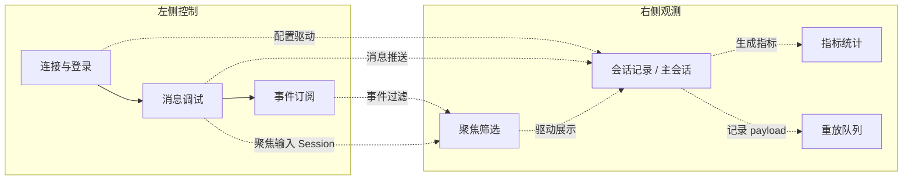

# WebSocket 调试页面开发手册

> 版本：2025-10-26  
> 维护角色：前端工程师 & 调试工程师  
> 关联文件：`websocket-test.html`、`static/ws-tester.js`

## 1. 页面概览

### 1.1 功能摘要
- **连接管理**：支持账户密码登录、Token 状态展示、自动登录与自动连接。
- **消息调试**：覆盖消息类型选择、模板填充、元数据编辑、请求重放。
- **事件观测**：会话分组展示、事件过滤、原始 JSON 弹窗化阅读。
- **会话聚焦**：支持一键聚焦最新或指定 Session，并对非主会话弱化显示。
- **性能分析**：自动统计消息往返耗时、最值与最新延迟。
- **工具集成**：配置导入导出、Engine.IO 心跳监测、日志导出。

### 1.2 布局速览

## 2. 环境准备
- **浏览器**：Chrome ≥ 118，启用 `localStorage`、`FileReader`。
- **后端服务**：本地 `http://localhost:8080`，Socket.IO 路径 `/ws/socket.io`。
- **默认账户**：邮箱 `saiter2306001@163.com`，密码 `hsai1234`（可覆盖）。
- **网络要求**：允许浏览器访问本地 8080 端口；若跨域需确保 CORS/Socket 配置开放。
- **本地存储**：配置保存在 `localStorage.openwebui_ws_tester_config_v2`，调试完成后可用“清空本地配置”按钮重置。

## 3. 操作流程

### 3.1 初始化配置
1. 打开 `websocket-test.html`。
2. 确认服务器地址、账号密码；若需修改默认值，填写后点击“登录”。
3. 勾选“页面加载后自动登录”“登录成功后自动连接 Socket”可实现免操作调试。
4. 如需同步配置给其他成员，可在登录前点击“导出配置”。

### 3.2 登录与连接
1. 点击“登录”，成功后用户 ID、Token 信息会自动填充。
2. Token 信息区会解析 JWT 的签发时间、过期时间，异常会提示“Token 解析失败”。
3. 点击“连接 Socket”，状态指示点将从灰色切换为绿色，同时显示当前 `socket.id`。
4. 登录按钮会根据流程切换为“登录中… / 已登录 / 重新登录”，避免重复触发；刷新 Token 时仅高亮“刷新 Token”按钮。
5. 连接按钮会在连接阶段显示“连接中… / 已连接”，同时自动启用或禁用“断开连接”。
6. 若网络异常，可在“最近事件”中查看 `connect_error` 详情，必要时手动重连。

### 3.3 消息调试
1. 在“消息类型”选择 `chat`、`welcome`、`workflow_trigger` 或自定义。
2. `Session ID` 留空时自动生成；勾选“锁定当前会话”可复用同一会话。
3. 在“消息正文”“附加元数据（JSON）”内编写内容。无效 JSON 会被忽略并追加系统提示。
4. 点击“发送消息”或“发送欢迎语”“查询系统状态”；成功会写入会话记录并进入重放队列。
5. 模板区域可一键填充常用 payload，填充后会追加系统事件用于追踪。

### 3.4 事件订阅与过滤
1. “事件订阅”列表包含 `hsai_response`、`hsai_error`、`channel-events`、Engine.IO 事件等。
2. 通过“全选/全不选”快速切换订阅组合，变更后自动持久化。
3. 右侧“会话记录”支持按会话与事件类型过滤；“聚焦输入 Session”“聚焦最新会话”可锁定主会话，其余会话自动弱化处理。
4. 点击“取消聚焦”恢复默认展示；聚焦状态会同步显示在标题下方的徽标，便于确认当前关注的 `session_id`。
5. 每个会话卡片和“查看 JSON”按钮均会弹出独立对话框展示原始 payload，支持 `Esc` / 背景点击关闭。
6. “最近事件”展示最新 20 条系统事件与性能提示，方便定位异常。

### 3.5 请求重放与导出
1. 每次发送或接收响应都会写入“请求重放队列”，默认保留 40 条。
2. “立即重放”按钮可复用原始 payload 再次发送；“填充到编辑区”便于修改后发送。
3. “导出记录”支持下载基于当前过滤出的消息日志；“导出配置”保存当前环境、订阅与模板。

### 3.6 调试收尾
1. 点击“断开连接”“清除 Token”“清空本地配置”清理环境。
2. 关闭页面前确认需要保留的配置已导出或记录。

## 4. 调试工具说明
- **Token 信息面板**：解析 JWT，显示用户 ID、签发时间、过期时间；失败时给出错误提示。
- **Engine.IO 心跳**：实时统计 `ping/pong` 间隔，异常超时会标记为红色警告。
- **指标统计**：维持发送/接收/错误次数，记录往返耗时（平均、最小、最大、最近）。
- **会话聚焦面板**：在“聚焦输入 Session”时会优先读取消息编辑区的 `session_id`；若当前会话尚无数据，会保持徽标提示直至消息写入。
- **系统事件流**：`appendSystemEvent` 输出所有操作提示、异常信息，支持审查历史动作。
- **消息弹窗**：Modal 会保留滚动位置与语法高亮（原生 `<pre>`），方便复制粘贴；支持键盘 `Enter/Space` 触发。

## 5. 常见问题 & 排障
| 问题 | 排查步骤 | 对应提示 |
| --- | --- | --- |
| 登录失败 | 检查邮箱/密码、后端 `/api/v1/auths/signin` 是否可访问 | “登录失败：...” |
| Socket 无法连接 | 确认 Token 生效、服务端是否监听 `/ws/socket.io`、浏览器控制台报错 | “连接错误：...” |
| 消息未返回响应 | 检查事件订阅是否包含 `hsai_response`，确认 `session_id` 是否匹配 | 会话记录无响应条目 |
| 重放无效 | 确保 Socket 已连接；未连接会提示“未连接 Socket，重放操作已取消” | 系统事件 |
| JSON 解析失败 | 使用 JSON 校验工具，或在页面中减少多余逗号 | “Metadata 不是合法 JSON” |

## 6. 验收清单
- [ ] 使用默认账号完成一次登录并成功显示 Token 信息。
- [ ] 建立 Socket 连接后，发送 `chat` 消息并收到至少一条 `hsai_response`。
- [ ] 校验 `statAvgLatency` 等指标出现非 `-` 的数值。
- [ ] 成功导出配置与日志文件，并重新导入配置验证字段恢复。
- [ ] 请求重放队列出现最新请求，且“立即重放”能再次触发消息。
- [ ] 会话聚焦徽标可正确反映“聚焦输入 Session”“聚焦最新会话”“取消聚焦”的状态切换。

## 7. 变更对齐
- 页面与脚本：详见 `websocket-test.html`（UI 本地化、控件恢复）与 `static/ws-tester.js`（默认账号、中文提示）。
- 项目知识库：在 `PROJECTWIKI.md` → “调试工具” 小节同步本次优化说明，并建立与本手册的互链。
- 测试记录：在提交报告中注明是否连接到真实 8080 服务，若未连通需提供模拟或静态验证说明。
