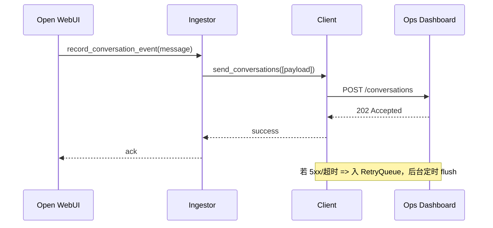

# OPS Dashboard 服务端对接方案（2025-11-08）

> 目标：让 Open WebUI 作为「数据采集客户端」，通过后台提供的统一接口上报会话、活跃度与系统指标，后台再落盘到自身统计库并对外提供 `/system/index/ops_dashboard` 聚合接口，实现单一数据源与可追溯的统计链路。

---

## 1. 范围与约束
- **后台负责统计表设计与存储**，Open WebUI 不再直接写任何统计表，仅负责调用后台「采集接口」。
- **接口协议**：HTTPS + JSON，统一 Header `Authorization: Bearer <token>`；支持 `X-Ops-Source`, `X-Request-Id` 便于追踪。
- **时区与日期**：全部采用 UTC；日粒度字段使用 `YYYY-MM-DD`，小时粒度使用 `YYYY-MM-DDTHH:00:00Z`。
- **敏感内容脱敏**：正文文本仅在确需时发送摘要，默认发送结构化指标。

---

## 2. 采集接口契约

| 接口 | 方法 | 用途 | 幂等键 | 备注 |
| --- | --- | --- | --- | --- |
| `/system/index/ops_dashboard/conversations` | POST | 上送单条/批量会话摘要（可附消息指标） | `session_id` + `last_event_ts` | 支持批量数组；服务端负责 upsert 会话表与消息表 |
| `/system/index/ops_dashboard/user-activity` | POST | 上送登录/API/对话活跃事件 | `stat_date` + `user_id` + `event_type` | 服务端按事件聚合至 `user_activity_daily` |
| `/system/index/ops_dashboard/system-metrics` | POST | 上送系统稳定性指标 | `metric` + `stat_hour` + `dimension_hash` | 面向运维/任务调度；支持 Webhook/CLI |
| `/system/index/ops_dashboard` | GET | 后台页面读取 KPI | N/A | 本项目无需实现，仅用于确认字段字典 |

### 2.1 会话采集字段
```json
{
  "session_id": "uuid",
  "company_id": "c_123",
  "user_id": "u_456",
  "channel": "web|api|wechat|sms",
  "started_at": "2025-11-08T10:05:00Z",
  "ended_at": "2025-11-08T10:08:30Z",
  "duration_seconds": 210,
  "turn_count": 5,
  "is_bounced": false,
  "max_latency_ms": 950,
  "tags": ["blueprint", "sales"],
  "messages": [
    {
      "seq": 1,
      "role": "user",
      "latency_ms": 0,
      "tokens": 120
    }
  ]
}
```

### 2.2 活跃事件字段
```json
{
  "stat_date": "2025-11-08",
  "company_id": "c_123",
  "user_id": "u_456",
  "event_type": "login|api_call|conversation",
  "count": 1,
  "metadata": {
    "ip": "1.2.3.4",
    "session_id": "..."
  }
}
```

### 2.3 系统指标字段
```json
{
  "stat_hour": "2025-11-08T10:00:00Z",
  "metric": "job_success_rate|api_5xx|avg_latency",
  "value": 0.9825,
  "dimension": {
    "service": "redis-worker",
    "region": "cn-east-1"
  }
}
```

---

## 3. Open WebUI 侧实现方案

### 3.1 组件划分
```mermaid
flowchart LR
  QueueHandler -->|record_conversation_event| Ingestor
  AuthRouter -->|record_user_activity(login)| Ingestor
  BillingService -->|record_user_activity(api_call)| Ingestor
  OpsJobs -->|record_system_metric| Ingestor
  Ingestor --> Client
  Client -->|HTTPS POST| OpsBackend
  Client -->|失败| RetryQueue
  RetryQueue -->|定时flush| Client
```

- **OpsDashboardIngestor**：负责从业务事件构造标准 payload，并提交给客户端。
- **OpsDashboardClient**：封装 HTTP 访问、鉴权 Header、重试与日志；在失败时落到 `RetryQueue`。
- **RetryQueue**：使用 `redis_queue_messages` 表或本地 SQLite 作为幂等缓存，后台可用 CLI 触发重放。

### 3.2 事件触发点
1. `backend/open_webui/utils/conversation_queue_handler.py`：当 Redis 消息进入 FINISHED 状态后，将 session 摘要传给 `record_conversation_event`。
2. `backend/open_webui/routers/auths.py`：登录成功后调用 `record_user_activity("login", ...)`。
3. `backend/open_webui/services/billing_service.py`：API 扣费、任务完成后调用 `record_user_activity("api_call", ...)`。
4. 运维脚本（如 `tools/update_ops_dashboard_metrics.py`）：周期性读取 Job/Nginx 指标并调用 `record_system_metric`。

### 3.3 请求生命周期


---

## 4. 鉴权与安全
- **Token 策略**：默认使用后台分配的长期 API Key；若切换 OAuth Client Credentials，`OpsDashboardClient` 需缓存 access token 并在过期前刷新。
- **请求签名（可选）**：`X-Ops-Timestamp`, `X-Ops-Nonce`, `X-Ops-Signature = HMACSHA256(secret, body+timestamp+nonce)`。
- **数据脱敏**：消息正文仅上传长度/摘要，禁止携带用户输入原文；如需示例文本，需额外配置 `OPS_DASHBOARD_ALLOW_CONTENT=true`。
- **幂等性**：所有接口要求 `Idempotency-Key` Header，对应 payload 的 hash，后台根据该值拒绝重复写入。

---

## 5. 错误处理与重试
- **分类**：
  - 4xx（参数/鉴权）：立即告警并丢弃，写入 `ops_dashboard_failed_events` 日志。
  - 5xx/网络：进入重试队列，默认指数回退（5s → 30s → 5m → 30m，最多 8 次）。
- **监控**：
  - 计数器：`ops_dashboard.events_sent_total{type}`、`ops_dashboard.retry_queue_depth`。
  - 日志：按 session_id、user_id 记录 payload 摘要与响应码。
- **手动恢复**：提供 `tools/replay_ops_dashboard_queue.py --since 10m` 脚本，方便人工重放。

---

## 6. 配置项
| 变量 | 默认 | 说明 |
| --- | --- | --- |
| `OPS_DASHBOARD_ENABLED` | `false` | 总开关 |
| `OPS_DASHBOARD_BASE_URL` | `` | 后台 API 根路径 |
| `OPS_DASHBOARD_API_KEY` | `` | 鉴权所需 key/token |
| `OPS_DASHBOARD_TIMEOUT` | `5s` | HTTP 超时 |
| `OPS_DASHBOARD_MAX_RETRY` | `8` | 最大重试次数 |
| `OPS_DASHBOARD_ALLOW_CONTENT` | `false` | 是否允许上传消息正文 |

---

## 7. 里程碑
1. **M1（本迭代）**：实现客户端、ingestor、配置 & 文档；在会话、登录、计费路径挂载事件，上线前与后台完成联调。
2. **M2**：接入运维指标 webhook / CLI；提供批量缓冲、Prometheus 指标、Grafana 告警。
3. **M3**：与 `PROJECTWIKI` 建立自动对齐流程，接入更多业务事件（任务、积分告警等）。

---

## 8. 与现有文档的链接
- `docs/ops_dashboard_data_integration.md`：字段字典 & 责任矩阵，本方案引用其指标定义及角色可见性要求。
- `PROJECTWIKI.md`：「运维指标」「API 手册」章节将引用本方案，并建立接口 ↔ 代码 ↔ 配置的追溯链接。
