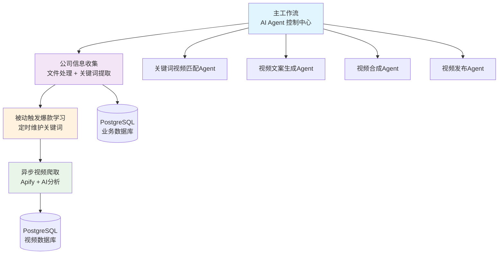
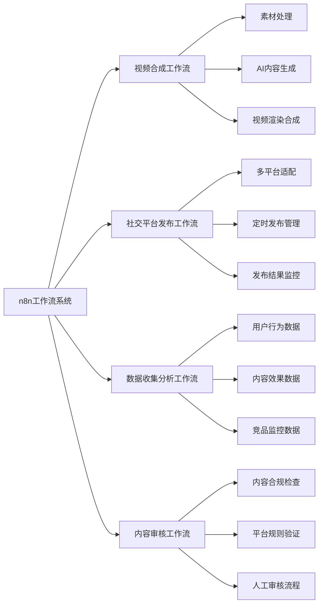
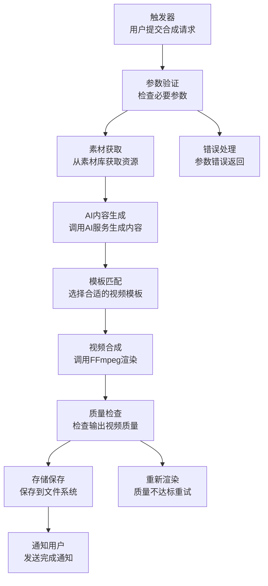
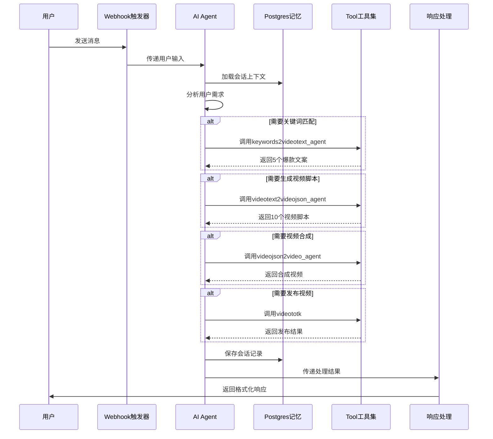
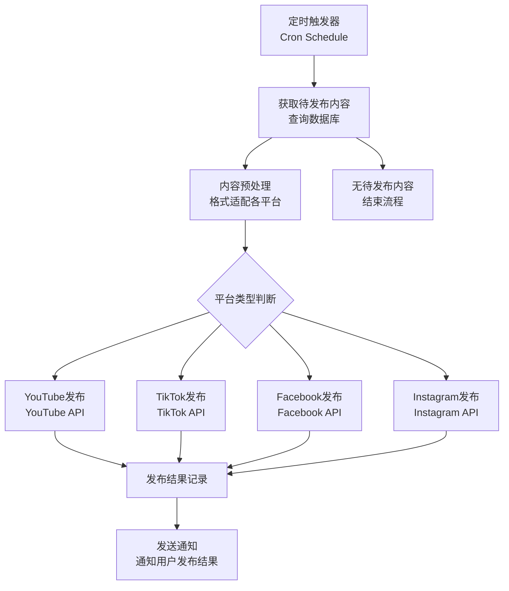
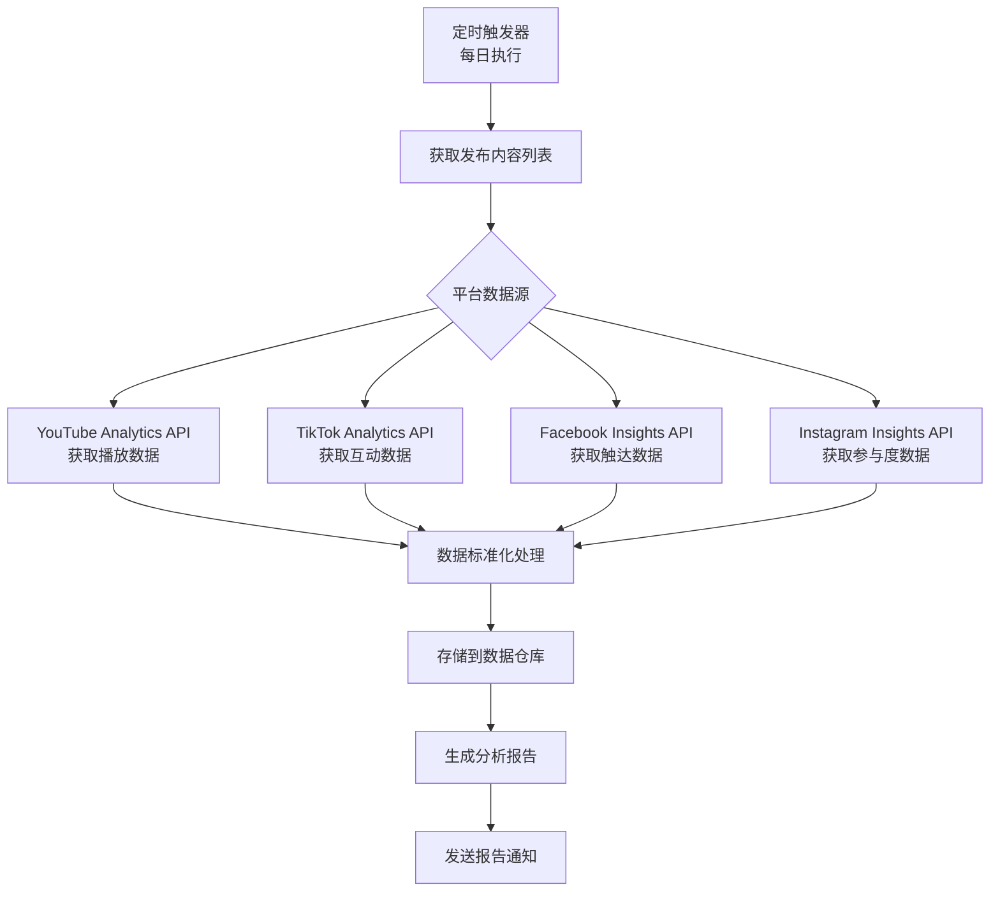

# n8n工作流开发指南

**版本**: v2.0.0  
**更新日期**: 2025-08-28  
**基于**: 系统架构设计_v3.0.0.md  
**适用范围**: 产品/设计/前后端/测试  
**编写人**: AI系统分析  

> **重要更新说明**: v2.0版本基于已实现的4个n8n工作流进行了重大更新，增加了实际实现内容分析和具体配置示例。建议优先查看[n8n工作流现状分析报告](./n8n工作流现状分析报告.md)了解实际实现情况。  

## 版本修订记录

| 版本 | 日期 | 修订内容 | 修订人 |
|------|------|----------|--------|
| v1.0.0 | 2025-08-23 | 初始版本，定义n8n工作流开发规范和配置指南 | 技术架构组 |
| v2.0.0 | 2025-08-28 | 新增已实现工作流分析，更新AI Agent架构说明，增加实际配置示例 | AI系统分析 |  

## 0. 已实现工作流说明

### 0.1 实际架构概览

目前项目中已实现了4个n8n工作流，采用了**AI Agent + Tool工具**的架构模式，而非传统的流水线式工作流。



### 0.2 已实现工作流清单

| 工作流名称 | 文件名 | 主要功能 | 状态 |
|------------|--------|----------|------|
| 主工作流 | 主工作流.json | 核心业务流程管理，AI对话控制 | ✅ 已实现 |
| 公司信息收集及作战地图梳理 | 公司信息收集及作战地图梳理.json | 文件上传处理，信息提取，关键词生成 | ✅ 已实现 |
| 被动触发爆款学习 | 被动触发爆款学习.json | 定时/手动触发关键词爬取 | ✅ 已实现 |
| 异步视频爬取关键词分析 | 异步视频爬取关键词分析.json | TikTok视频爬取和内容分析 | ✅ 已实现 |

### 0.3 技术栈说明

**核心技术**:
- **AI模型**: Gemini-2.5-pro/flash, GPT-4.1
- **数据存储**: PostgreSQL (会话管理 + 业务数据)
- **第三方服务**: Apify TikTok爬虫
- **集成方式**: Webhook + 子工作流调用

详细分析请参考: [n8n工作流现状分析报告](./n8n工作流现状分析报告.md)

---

## 1. n8n工作流概览

> **注意**: 以下章节内容为设计规范和理论架构，实际实现情况请参考上方的"已实现工作流说明"章节。

### 1.1 核心工作流清单



### 1.2 工作流优先级

| 工作流 | 优先级 | 依赖关系 | 开发周期 |
|--------|--------|----------|----------|
| 视频合成工作流 | P0 | 素材管理、AI服务 | Sprint 11 |
| 社交平台发布工作流 | P0 | 视频合成工作流 | Sprint 11-12 |
| 数据收集分析工作流 | P1 | 发布工作流 | Sprint 12 |
| 内容审核工作流 | P1 | 独立 | Sprint 12 |

## 2. 视频合成工作流详细设计

### 2.1 工作流架构



### 2.2 关键节点配置

#### 2.2.1 触发器配置 (Webhook)
```json
{
  "node": "Webhook",
  "parameters": {
    "httpMethod": "POST",
    "path": "/workflow/video-compose",
    "authentication": "bearerToken",
    "responseMode": "responseNode"
  },
  "expectedInput": {
    "projectId": "string",
    "templateId": "string", 
    "materials": ["materialId1", "materialId2"],
    "aiPrompts": {
      "title": "string",
      "description": "string",
      "keywords": ["keyword1", "keyword2"]
    },
    "settings": {
      "resolution": "1920x1080",
      "duration": 30,
      "aspectRatio": "16:9"
    }
  }
}
```

#### 2.2.2 参数验证节点 (Code)
```javascript
// 验证必要参数
const requiredFields = ['projectId', 'templateId', 'materials'];
const input = $json;
let errors = [];

for (const field of requiredFields) {
  if (!input[field]) {
    errors.push(`Missing required field: ${field}`);
  }
}

// 验证素材ID有效性
if (input.materials && input.materials.length === 0) {
  errors.push('At least one material is required');
}

if (errors.length > 0) {
  return [{
    json: {
      success: false,
      errors: errors,
      code: 'VALIDATION_ERROR'
    }
  }];
}

return [{
  json: {
    success: true,
    validatedInput: input
  }
}];
```

#### 2.2.3 素材获取节点 (HTTP Request)
```json
{
  "node": "HTTP Request",
  "parameters": {
    "url": "{{$node['Webhook'].json.baseUrl}}/api/materials/batch",
    "method": "POST",
    "authentication": "predefinedCredentialType",
    "nodeCredentialType": "httpBasicAuth",
    "sendBody": true,
    "bodyContentType": "json",
    "jsonBody": "{\n  \"materialIds\": {{$json.validatedInput.materials}}\n}",
    "options": {
      "timeout": 30000,
      "retry": {
        "enabled": true,
        "maxRetries": 3
      }
    }
  }
}
```

#### 2.2.4 AI内容生成节点 (HTTP Request)
```json
{
  "node": "HTTP Request - AI Service",
  "parameters": {
    "url": "{{$node['Webhook'].json.aiServiceUrl}}/api/generate/content",
    "method": "POST",
    "authentication": "predefinedCredentialType",
    "nodeCredentialType": "httpHeaderAuth",
    "sendBody": true,
    "bodyContentType": "json",
    "jsonBody": "{\n  \"prompt\": {{$json.validatedInput.aiPrompts}},\n  \"type\": \"video_script\",\n  \"language\": \"zh-CN\"\n}",
    "options": {
      "timeout": 60000,
      "retry": {
        "enabled": true,
        "maxRetries": 2
      }
    }
  }
}
```

#### 2.2.5 视频合成节点 (Execute Command)
```json
{
  "node": "Execute Command",
  "parameters": {
    "command": "python",
    "arguments": "/app/scripts/video_composer.py --project {{$json.validatedInput.projectId}} --template {{$json.validatedInput.templateId}} --config /tmp/compose_config.json",
    "options": {
      "timeout": 300000,
      "env": {
        "FFMPEG_PATH": "/usr/bin/ffmpeg",
        "TEMP_DIR": "/tmp/video_compose"
      }
    }
  }
}
```

## 2.5 AI Agent工作流实际实现

### 2.5.1 主工作流架构 (已实现)

基于实际的`主工作流.json`实现：



### 2.5.2 AI Agent节点配置

#### 主控制Agent配置
```json
{
  "node": "AI Agent",
  "parameters": {
    "promptType": "define",
    "text": "# 用户输入信息\n{{ $json.body.message }}",
    "options": {
      "systemMessage": "# Agent角色：B2B智能视频创作助手\n\n你是一个专业的B2B智能视频创作助手..."
    }
  },
  "tools": [
    "keywords2videotext_agent",
    "videotext2videojson_agent", 
    "videojson2video_agent",
    "videototk"
  ]
}
```

#### 记忆管理配置
```json
{
  "node": "Postgres Chat Memory",
  "parameters": {
    "sessionIdType": "customKey",
    "sessionKey": "{{ $('Webhook').item.json.body.session_id }}",
    "contextWindowLength": 50
  },
  "credentials": {
    "postgres": {
      "id": "KJscbDCc0CfgKGjb",
      "name": "Postgres account"
    }
  }
}
```

### 2.5.3 文件处理工作流 (已实现)

基于`公司信息收集及作战地图梳理.json`的实际实现：

#### 支持的文件格式
```javascript
// 文件类型判断逻辑
const rules = {
  "Image": { "mimeType": { "startsWith": "image/" } },
  "Plain Text": { "mimeType": { "equals": "text/plain" } },
  "PDF": { "mimeType": { "equals": "application/pdf" } },
  "CSV": { "mimeType": { "equals": "text/csv" } },
  "JSON": { "mimeType": { "equals": "application/json" } },
  "XML": { "mimeType": { "regex": "^(application|text)/xml$" } },
  "Excel": { "mimeType": { "regex": "/^(application\\/vnd\\.ms-excel|application\\/vnd\\.openxmlformats-officedocument\\.spreadsheetml\\.sheet)$/" } },
  "RTF": { "mimeType": { "equals": "application/rtf" } }
};
```

#### Apify TikTok爬虫配置
```json
{
  "node": "爬视频",
  "parameters": {
    "method": "POST",
    "url": "https://api.apify.com/v2/acts/clockworks~tiktok-scraper/run-sync-get-dataset-items",
    "sendHeaders": true,
    "headerParameters": {
      "parameters": [
        {
          "name": "Accept",
          "value": "application/json"
        },
        {
          "name": "Authorization", 
          "value": "Bearer apify_api_AdT8bYLhHfrhAqI4qQ8oqqabY4PBtK48AxJt"
        }
      ]
    },
    "sendBody": true,
    "specifyBody": "json",
    "jsonBody": {
      "excludePinnedPosts": false,
      "oldestPostDateUnified": "{{ $now.minus('90','days').format('yyyy-MM-dd') }}",
      "proxyCountryCode": "None",
      "resultsPerPage": 1,
      "scrapeRelatedVideos": false,
      "searchQueries": ["{{ $json.body.keywords.trim() }}"],
      "searchSection": "/video",
      "shouldDownloadSubtitles": true,
      "shouldDownloadVideos": true,
      "videoKvStoreIdOrName": "tkvideo"
    }
  }
}
```

## 3. 社交平台发布工作流详细设计

### 3.1 工作流架构



### 3.2 关键节点配置

#### 3.2.1 定时触发器 (Schedule Trigger)
```json
{
  "node": "Schedule Trigger",
  "parameters": {
    "rule": {
      "interval": [
        {
          "field": "cronExpression",
          "expression": "0 */30 * * * *"
        }
      ]
    },
    "triggerAtStartup": false
  }
}
```

#### 3.2.2 获取待发布内容 (Postgres)
```sql
SELECT 
    p.id as publish_id,
    p.video_id,
    p.platform,
    p.scheduled_time,
    p.content_title,
    p.content_description,
    p.hashtags,
    v.file_path,
    v.thumbnail_path,
    u.platform_tokens
FROM publish_schedule p
JOIN videos v ON p.video_id = v.id  
JOIN users u ON p.user_id = u.id
WHERE p.status = 'pending' 
    AND p.scheduled_time <= NOW()
    AND p.scheduled_time > NOW() - INTERVAL '30 minutes'
ORDER BY p.scheduled_time ASC
LIMIT 50
```

#### 3.2.3 平台适配处理 (Code)
```javascript
const items = $input.all();
const adaptedItems = [];

for (const item of items) {
  const platform = item.json.platform;
  let adaptedContent = {
    publishId: item.json.publish_id,
    videoId: item.json.video_id,
    platform: platform,
    filePath: item.json.file_path,
    thumbnailPath: item.json.thumbnail_path
  };

  // 根据平台调整内容
  switch(platform) {
    case 'youtube':
      adaptedContent.title = item.json.content_title.substring(0, 100);
      adaptedContent.description = item.json.content_description;
      adaptedContent.tags = item.json.hashtags.split(',').slice(0, 15);
      break;
      
    case 'tiktok':
      adaptedContent.caption = `${item.json.content_title} ${item.json.hashtags}`.substring(0, 300);
      break;
      
    case 'facebook':
      adaptedContent.message = `${item.json.content_title}\n\n${item.json.content_description}\n\n${item.json.hashtags}`;
      break;
      
    case 'instagram':
      adaptedContent.caption = `${item.json.content_title}\n${item.json.hashtags}`.substring(0, 2200);
      break;
  }
  
  adaptedItems.push({ json: adaptedContent });
}

return adaptedItems;
```

#### 3.2.4 YouTube发布节点 (HTTP Request)
```json
{
  "node": "HTTP Request - YouTube",
  "parameters": {
    "url": "https://www.googleapis.com/upload/youtube/v3/videos",
    "method": "POST",
    "authentication": "predefinedCredentialType",
    "nodeCredentialType": "youtubeOAuth2Api",
    "sendBody": true,
    "bodyContentType": "multipart-form-data",
    "bodyParameters": {
      "parameters": [
        {
          "name": "snippet",
          "value": "{\n  \"title\": \"{{$json.title}}\",\n  \"description\": \"{{$json.description}}\",\n  \"tags\": {{$json.tags}},\n  \"defaultLanguage\": \"zh-CN\"\n}"
        },
        {
          "name": "status", 
          "value": "{\n  \"privacyStatus\": \"public\",\n  \"publishAt\": \"{{$json.publishTime}}\"\n}"
        }
      ]
    },
    "bodyFormData": {
      "values": [
        {
          "key": "media",
          "value": "={{$json.filePath}}",
          "type": "file"
        }
      ]
    }
  }
}
```

## 4. 数据收集分析工作流详细设计

### 4.1 工作流架构



### 4.2 关键节点配置

#### 4.2.1 数据收集节点 (HTTP Request - YouTube)
```json
{
  "node": "HTTP Request - YouTube Analytics",
  "parameters": {
    "url": "https://youtubeanalytics.googleapis.com/v2/reports",
    "method": "GET",
    "authentication": "predefinedCredentialType", 
    "nodeCredentialType": "youtubeOAuth2Api",
    "qs": {
      "ids": "channel==MINE",
      "startDate": "{{$json.startDate}}",
      "endDate": "{{$json.endDate}}", 
      "metrics": "views,likes,comments,shares,estimatedMinutesWatched,subscribersGained",
      "dimensions": "video",
      "filters": "video=={{$json.videoId}}"
    }
  }
}
```

#### 4.2.2 数据标准化处理 (Code)
```javascript
const platformData = $input.all();
const standardizedData = [];

for (const data of platformData) {
  const platform = data.json.platform;
  const rawMetrics = data.json.metrics;
  
  let standardMetrics = {
    videoId: data.json.videoId,
    platform: platform,
    collectDate: new Date().toISOString(),
    views: 0,
    likes: 0, 
    comments: 0,
    shares: 0,
    engagement: 0,
    reachRate: 0
  };

  // 根据平台映射指标
  switch(platform) {
    case 'youtube':
      standardMetrics.views = rawMetrics.views || 0;
      standardMetrics.likes = rawMetrics.likes || 0;
      standardMetrics.comments = rawMetrics.comments || 0;
      standardMetrics.shares = rawMetrics.shares || 0;
      standardMetrics.watchTime = rawMetrics.estimatedMinutesWatched || 0;
      break;
      
    case 'tiktok':
      standardMetrics.views = rawMetrics.play_count || 0;
      standardMetrics.likes = rawMetrics.digg_count || 0;
      standardMetrics.comments = rawMetrics.comment_count || 0; 
      standardMetrics.shares = rawMetrics.share_count || 0;
      break;
      
    // 其他平台映射...
  }

  // 计算参与度
  if (standardMetrics.views > 0) {
    standardMetrics.engagement = 
      (standardMetrics.likes + standardMetrics.comments + standardMetrics.shares) / 
      standardMetrics.views * 100;
  }

  standardizedData.push({ json: standardMetrics });
}

return standardizedData;
```

## 5. 开发与部署指南

### 5.1 环境准备

#### 5.1.1 实际部署的技术栈

**核心组件**:
- **n8n**: 工作流引擎
- **PostgreSQL**: 数据存储和会话管理
- **AI模型服务**: Gemini-2.5-pro/flash, GPT-4.1 (通过api.gpt.ge)
- **Apify**: TikTok视频爬虫服务
- **文件存储**: OSS对象存储

**实际使用的API端点**:
``bash
# AI模型服务
AI_API_BASE_URL=https://api.gpt.ge/v1
AI_API_KEY=sk-P7eWBZs2JfAHahcC442675C308374b5181CaC2Bd1929D84e

# Apify爬虫服务
APIFY_API_BASE_URL=https://api.apify.com/v2
APIFY_API_KEY=apify_api_AdT8bYLhHfrhAqI4qQ8oqqabY4PBtK48AxJt

# n8n Webhook基础URL
N8N_WEBHOOK_BASE_URL=https://webhook-n8n.hsai.cc
```

#### 5.1.2 已实现的凭据配置

| 服务 | 凭据类型 | 实际配置 |
|------|----------|----------|
| OpenAI API | HTTP Header Auth | api.gpt.ge endpoint |
| Apify | Bearer Token | TikTok爬虫服务 |
| PostgreSQL | Database | 会话存储和业务数据 |
| n8n Webhook | HTTP Basic Auth | 工作流触发认证 |

#### 5.1.3 n8n安装配置
``bash
# Docker部署方式
docker run -it --rm \
  --name n8n \
  -p 5678:5678 \
  -e WEBHOOK_URL=https://your-domain.com/ \
  -e N8N_BASIC_AUTH_ACTIVE=true \
  -e N8N_BASIC_AUTH_USER=admin \
  -e N8N_BASIC_AUTH_PASSWORD=your-password \
  -v n8n_data:/home/node/.n8n \
  n8nio/n8n

# 数据库配置 (PostgreSQL)
docker run -d \
  --name n8n-postgres \
  -e POSTGRES_DB=n8n \
  -e POSTGRES_USER=n8n \
  -e POSTGRES_PASSWORD=n8n_password \
  -v postgres_data:/var/lib/postgresql/data \
  postgres:13
```

#### 5.1.4 必要凭据配置

| 服务 | 凭据类型 | 必要信息 |
|------|----------|----------|
| YouTube | OAuth2 | Client ID, Client Secret, Refresh Token |
| TikTok | API Key | API Key, API Secret |
| Facebook | OAuth2 | App ID, App Secret, Access Token |
| Instagram | OAuth2 | App ID, App Secret, Access Token |
| 系统API | HTTP Basic Auth | Username, Password |
| 数据库 | Postgres | Host, Port, Database, Username, Password |

### 5.2 工作流导入导出

#### 5.2.1 工作流备份脚本
``bash
#!/bin/bash
# n8n工作流备份脚本

N8N_URL="http://localhost:5678"
AUTH_HEADER="Authorization: Basic $(echo -n admin:password | base64)"
BACKUP_DIR="/backup/n8n-workflows/$(date +%Y%m%d)"

mkdir -p $BACKUP_DIR

# 获取所有工作流列表
curl -H "$AUTH_HEADER" "$N8N_URL/rest/workflows" | jq '.data[] | .id' | while read id; do
    id=$(echo $id | tr -d '"')
    echo "Backing up workflow $id"
    curl -H "$AUTH_HEADER" "$N8N_URL/rest/workflows/$id" > "$BACKUP_DIR/workflow_$id.json"
done

echo "Backup completed: $BACKUP_DIR"
```

#### 5.2.2 工作流部署脚本
``bash
#!/bin/bash
# n8n工作流部署脚本

N8N_URL="http://localhost:5678"
AUTH_HEADER="Authorization: Basic $(echo -n admin:password | base64)"
WORKFLOWS_DIR="./workflows"

for workflow_file in $WORKFLOWS_DIR/*.json; do
    echo "Deploying workflow: $workflow_file"
    curl -X POST \
         -H "$AUTH_HEADER" \
         -H "Content-Type: application/json" \
         -d @"$workflow_file" \
         "$N8N_URL/rest/workflows"
    echo "Deployed: $(basename $workflow_file)"
done
```

### 5.3 监控与日志

#### 5.3.1 工作流执行监控
``javascript
// n8n工作流执行状态监控脚本
const axios = require('axios');

class N8nMonitor {
  constructor(baseUrl, auth) {
    this.baseUrl = baseUrl;
    this.auth = auth;
  }

  async getExecutionStats(timeRange = '24h') {
    try {
      const response = await axios.get(`${this.baseUrl}/rest/executions`, {
        headers: { Authorization: this.auth },
        params: {
          filter: JSON.stringify({
            startedAt: {
              $gte: new Date(Date.now() - 24*60*60*1000).toISOString()
            }
          })
        }
      });

      const executions = response.data.data;
      const stats = {
        total: executions.length,
        success: executions.filter(e => e.finished && !e.stoppedAt).length,
        failed: executions.filter(e => e.stoppedAt).length,
        running: executions.filter(e => !e.finished && !e.stoppedAt).length
      };

      return stats;
    } catch (error) {
      console.error('Failed to get execution stats:', error.message);
      return null;
    }
  }

  async getFailedExecutions(limit = 10) {
    // 获取失败的工作流执行详情
    const response = await axios.get(`${this.baseUrl}/rest/executions`, {
      headers: { Authorization: this.auth },
      params: {
        filter: JSON.stringify({ stoppedAt: { $exists: true } }),
        limit
      }
    });

    return response.data.data;
  }
}

// 使用示例
const monitor = new N8nMonitor('http://localhost:5678', 'Basic YWRtaW46cGFzc3dvcmQ=');
monitor.getExecutionStats().then(stats => {
  console.log('n8n Execution Stats:', stats);
});
```

## 6. 测试策略

### 6.1 单元测试

每个工作流节点都需要独立测试：

```javascript
// 工作流节点单元测试示例
describe('Video Compose Workflow', () => {
  test('Parameter Validation Node', async () => {
    const input = {
      projectId: 'test-project',
      templateId: 'template-001',
      materials: ['material-1', 'material-2']
    };
    
    const result = await executeNode('parameter-validation', input);
    expect(result.success).toBe(true);
    expect(result.validatedInput).toEqual(input);
  });

  test('Material Fetch Node', async () => {
    const input = {
      materialIds: ['material-1', 'material-2']
    };
    
    const result = await executeNode('material-fetch', input);
    expect(result.materials).toHaveLength(2);
    expect(result.materials[0]).toHaveProperty('url');
  });
});
```

### 6.2 集成测试

```javascript
// 端到端工作流测试
describe('End-to-End Workflow Tests', () => {
  test('Complete Video Composition Flow', async () => {
    const workflowInput = {
      projectId: 'test-project-e2e',
      templateId: 'template-001',
      materials: ['test-material-1'],
      aiPrompts: {
        title: '测试视频标题',
        description: '测试视频描述'
      }
    };

    // 触发工作流
    const executionId = await triggerWorkflow('video-compose', workflowInput);
    
    // 等待执行完成
    const result = await waitForExecution(executionId, 300000); // 5分钟超时
    
    expect(result.status).toBe('success');
    expect(result.data.videoPath).toBeDefined();
    expect(result.data.thumbnailPath).toBeDefined();
  });
});
```

## 7. 故障排除指南

### 7.1 常见问题

| 问题 | 症状 | 解决方案 |
|------|------|----------|
| Apify API限流 | TikTok视频爬取失败 | 检查账户额度，实现指数退避重试 |
| AI模型超时 | Gemini服务响应超时 | 增加超时时间至300秒，添加备用模型 |
| PostgreSQL连接失败 | 会话管理失效 | 检查数据库连接池，重启服务 |
| 文件上传失败 | 大文件或不支持格式 | 检查文件大小限制，优化处理逻辑 |
| Webhook触发失败 | 工作流未正常执行 | 检查Webhook URL和认证信息 |

### 7.2 实际性能优化经验

**工作流执行优化**:
```json
{
  "AI Agent超时设置": {
    "Gemini模型": "300秒",
    "文件处理": "180秒",
    "Apify爬虫": "600秒"
  },
  "重试机制": {
    "AI模型调用": "3次重试，500ms间隔",
    "Apify爬虫": "1次重试，无间隔",
    "数据库连接": "使用连接池管理"
  },
  "内存管理": {
    "会话上下文": "50条记录限制",
    "文件处理": "单次处理，避免并发"
  }
}
```

``javascript
// n8n性能优化配置
{
  "executions": {
    "pruneData": true,
    "pruneDataMaxAge": 336, // 14天
    "pruneDataMaxCount": 10000
  },
  "nodes": {
    "exclude": ["n8n-nodes-base.function"]
  },
  "cache": {
    "backend": "redis",
    "redis": {
      "host": "localhost",
      "port": 6379,
      "ttl": 3600
    }
  }
}
```

---

**文档维护**: DevOps工程师  
**更新频率**: 每次工作流更新后同步更新  
**相关文档**: 敏捷开发任务分解.md, API接口文档