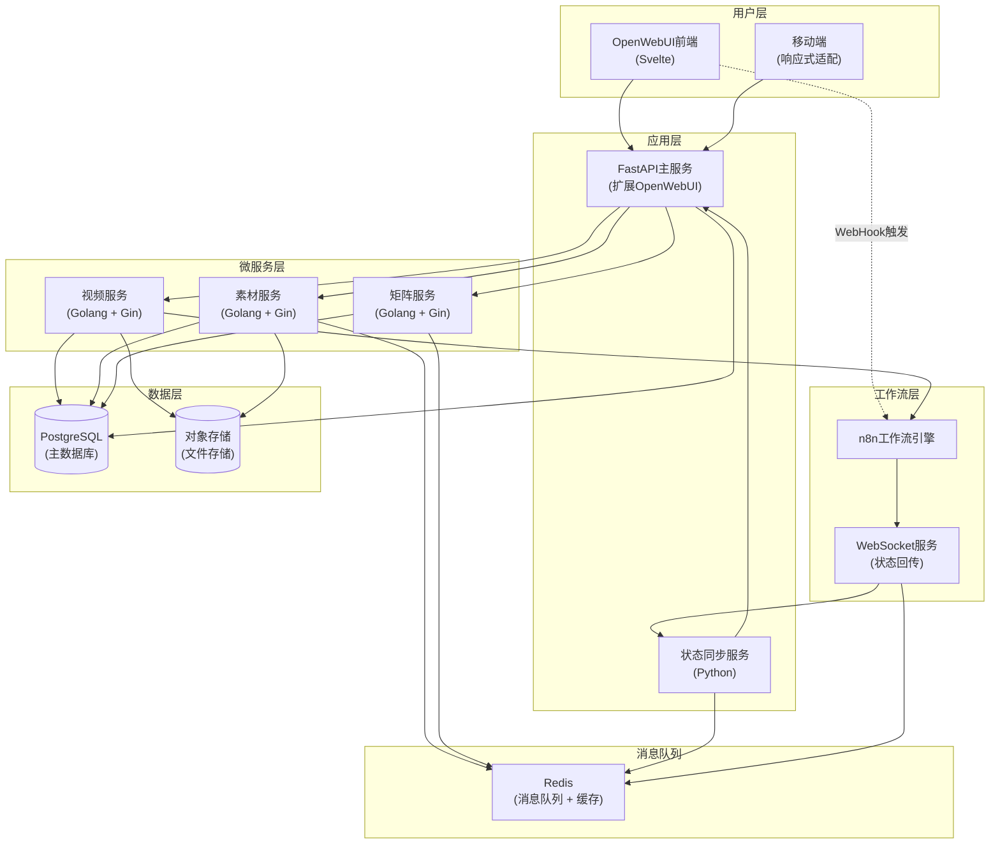
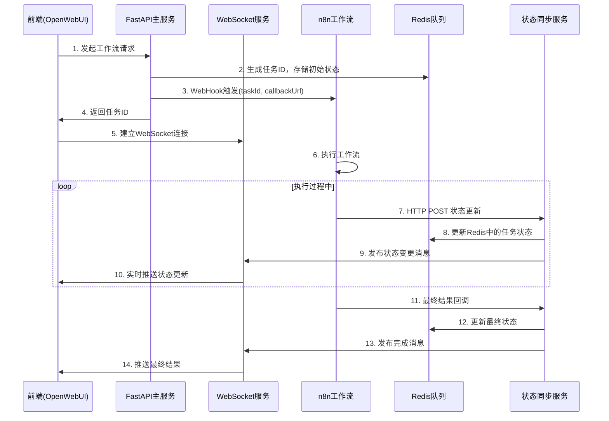

# 系统架构设计

**版本**: v3.0.0  
**更新日期**: 2025-08-24  
**基于**: 产品需求规格说明书_v2.1.md  
**适用范围**: 产品/设计/前后端/测试  
**编写人**: 架构师  

## 版本修订记录

| 版本 | 日期 | 修改内容 | 修改人 |
|------|------|----------|--------|
| v3.0.0 | 2025-08-24 | 统一版本号格式为三段版本号，添加版本修订记录 | 系统整理 |
| v3.0 | 2025-08-22 | 重大重构：改为OpenWebUI网关扩展架构，移除独立中台服务 | 架构师 |
| v2.0 | 2025-08-20 | 微服务架构优化，增加WebSocket状态同步 | 架构师 |
| v1.0 | 2025-08-18 | 初始版本，定义基础系统架构 | 架构师 |  

## 1. 架构概述

### 1.1 总体架构



### 1.2 技术栈选型

| 层级 | 技术选型 | 版本要求 | 说明 |
|------|----------|----------|------|
| 前端框架 | OpenWebUI + Svelte | v0.3+ | 成熟的对话式UI框架 |
| 主应用服务 | FastAPI + Python | 3.11+ | 高性能异步Web框架 |
| 微服务框架 | Golang + Gin | Go 1.21+ | 高并发微服务架构 |
| 数据库 | PostgreSQL | 15+ | 企业级关系数据库 |
| 缓存&队列 | Redis | 7.0+ | 内存数据库 + 消息队列 |
| 存储服务 | MinIO / 阿里云OSS | - | 分布式对象存储 |
| 工作流引擎 | n8n | 1.0+ | 可视化工作流编排 |
| 状态同步 | WebSocket + Redis | - | 实时双向通信 |
| 容器化 | Docker + K8s | - | 云原生部署 |

## 2. 关键技术问题解决方案

### 2.1 n8n WebHook单向通信问题及解决方案

#### 2.1.1 问题分析
**现有问题**:
- WebHook仅支持HTTP协议的单向请求（前端 → n8n）
- 无法主动向前端推送工作流执行状态
- 用户无法实时了解任务进度和结果
- 需要前端轮询，消耗资源且体验差

#### 2.1.2 解决方案：混合式状态同步机制



#### 2.1.3 技术实现方案

**方案A: WebSocket + Redis发布订阅模式（推荐）**
- 优势：真正的实时双向通信，Redis确保消息不丢失，支持多实例部署
- 实现复杂度：中等

**方案B: Server-Sent Events (SSE)**
- 优势：实现简单，浏览器原生支持，自动重连机制
- 劣势：单向通信（服务器到客户端），连接数限制

**方案C: 长轮询 + 缓存**
- 优势：实现最简单，兼容性最好
- 劣势：资源消耗大，实时性不佳，扩展性差

#### 2.1.4 n8n工作流配置要求

**标准回调节点**:
- 工作流开始：状态更新为"processing"
- 关键节点：更新进度百分比和当前步骤
- 工作流结束：发送最终结果和状态

### 2.2 核心服务设计

#### 2.2.1 FastAPI主服务（基于OpenWebUI扩展）

**服务职责**:
- 用户认证与授权管理
- AI对话业务逻辑
- 智能卡片生成与管理
- 微服务编排与协调

**核心数据结构**:
```python
# 对话会话
class ChatSession:
    id: str
    user_id: str
    title: str
    status: str  # 'active' | 'archived'
    created_at: datetime
    
# AI消息
class AIMessage:
    id: str
    session_id: str
    role: str  # 'user' | 'assistant'
    content: str
    ai_id: str  # 用于连线关联
    intent: str  # 意图识别结果
    timestamp: datetime

# 智能卡片
class SmartCard:
    id: str
    message_id: str
    card_type: str  # 'video' | 'strategy' | 'collaboration' | 'data'
    title: str
    data: dict
    status: str
    ai_id: str  # 与AI消息的关联ID
```

#### 2.2.2 Golang微服务架构

**视频合成服务**:
- 服务职责：视频脚本处理、素材组合、视频渲染合成
- 技术栈：Golang + Gin + FFmpeg

```go
// 视频任务数据结构
type VideoJob struct {
    ID          uint      `json:"id"`
    JobID       string    `json:"job_id"`
    ScriptID    uint      `json:"script_id"`
    MaterialIDs []uint    `json:"material_ids"`
    Status      string    `json:"status"` // pending/processing/completed/failed
    Progress    int       `json:"progress"`
    ResultURL   *string   `json:"result_url,omitempty"`
    ErrorMsg    *string   `json:"error_message,omitempty"`
    CreatedAt   time.Time `json:"created_at"`
}
```

**素材管理服务**:
- 服务职责：文件上传、存储管理、缩略图生成、文件分类
- 技术栈：Golang + Gin + MinIO

```go
// 素材文件数据结构
type Material struct {
    ID           uint      `json:"id"`
    FolderID     uint      `json:"folder_id"`
    Name         string    `json:"name"`
    FileType     string    `json:"file_type"`
    FileSize     int64     `json:"file_size"`
    FileURL      string    `json:"file_url"`
    ThumbnailURL *string   `json:"thumbnail_url,omitempty"`
    CreatedAt    time.Time `json:"created_at"`
}
```

**社媒矩阵服务**:
- 服务职责：社媒账号管理、内容发布、数据统计分析
- 技术栈：Golang + Gin + 第三方API

```go
// 社媒账号数据结构
type SocialAccount struct {
    ID          uint      `json:"id"`
    CompanyID   uint      `json:"company_id"`
    Platform    string    `json:"platform"` // douyin/kuaishou/xiaohongshu
    AccountName string    `json:"account_name"`
    AccessToken string    `json:"access_token"`
    Status      string    `json:"status"`
    CreatedAt   time.Time `json:"created_at"`
}
```

## 3. 数据库设计优化

### 3.1 数据库选型对比

| 数据库 | 适用场景 | 性能特点 | 选择理由 |
|----------|----------|----------|----------|
| PostgreSQL | 主业务数据 | ACID事务、复杂查询 | 企业级可靠性 |
| Redis | 缓存+消息队列 | 高性能内存数据库 | 实时性要求 |
| MinIO/OSS | 文件存储 | 分布式对象存储 | 大文件处理 |

### 3.2 核心表结构设计

```sql
-- ==========================
-- 用户管理模块（扩展OpenWebUI）
-- ==========================

-- 扩展用户表（基于OpenWebUI User表）
CREATE TABLE hsai_user_profiles (
    id BIGSERIAL PRIMARY KEY,
    user_id VARCHAR(50) NOT NULL REFERENCES auth_user(id),
    company_id BIGINT NOT NULL,
    department VARCHAR(100),
    job_title VARCHAR(100),
    preferences JSONB DEFAULT '{}',
    created_at TIMESTAMP DEFAULT CURRENT_TIMESTAMP
);

-- 企业信息表
CREATE TABLE companies (
    id BIGSERIAL PRIMARY KEY,
    name VARCHAR(200) NOT NULL,
    industry VARCHAR(100),
    scale VARCHAR(50), -- 初创期/成长期/成熟期
    contact_info JSONB,
    settings JSONB DEFAULT '{}',
    created_at TIMESTAMP DEFAULT CURRENT_TIMESTAMP
);

-- ==========================
-- 对话工作台模块
-- ==========================

-- 对话会话表（扩展OpenWebUI Chat）
CREATE TABLE hsai_chat_sessions (
    id BIGSERIAL PRIMARY KEY,
    openwebui_chat_id VARCHAR(50) REFERENCES chat(id),
    user_id VARCHAR(50) NOT NULL,
    title VARCHAR(500),
    session_type VARCHAR(50) DEFAULT 'general', -- general/video/strategy/analysis
    metadata JSONB DEFAULT '{}',
    created_at TIMESTAMP DEFAULT CURRENT_TIMESTAMP,
    updated_at TIMESTAMP DEFAULT CURRENT_TIMESTAMP
);

-- AI消息表（扩展OpenWebUI Message）
CREATE TABLE hsai_messages (
    id BIGSERIAL PRIMARY KEY,
    openwebui_message_id VARCHAR(50) REFERENCES message(id),
    session_id BIGINT NOT NULL REFERENCES hsai_chat_sessions(id),
    ai_id VARCHAR(50) UNIQUE, -- 用于连线关联
    role VARCHAR(20) NOT NULL, -- user/assistant/system
    content TEXT NOT NULL,
    intent VARCHAR(100), -- 意图识别结果
    entities JSONB, -- 实体识别结果
    confidence DECIMAL(3,2), -- AI置信度
    created_at TIMESTAMP DEFAULT CURRENT_TIMESTAMP
);

-- 智能卡片表
CREATE TABLE smart_cards (
    id BIGSERIAL PRIMARY KEY,
    message_id BIGINT NOT NULL REFERENCES hsai_messages(id),
    ai_id VARCHAR(50) NOT NULL, -- 与AI消息的关联
    card_type VARCHAR(50) NOT NULL, -- video/strategy/collaboration/data/progress
    title VARCHAR(500) NOT NULL,
    data JSONB NOT NULL,
    status VARCHAR(50) DEFAULT 'active', -- active/completed/cancelled
    priority INTEGER DEFAULT 1, -- 1-5优先级
    expires_at TIMESTAMP,
    created_at TIMESTAMP DEFAULT CURRENT_TIMESTAMP,
    updated_at TIMESTAMP DEFAULT CURRENT_TIMESTAMP
);

-- 连线关系表
CREATE TABLE connections (
    id BIGSERIAL PRIMARY KEY,
    session_id BIGINT NOT NULL REFERENCES hsai_chat_sessions(id),
    message_ai_id VARCHAR(50) NOT NULL,
    card_ai_id VARCHAR(50) NOT NULL,
    connection_type VARCHAR(50) DEFAULT 'generated', -- generated/manual
    strength DECIMAL(3,2) DEFAULT 1.0, -- 关联强度
    created_at TIMESTAMP DEFAULT CURRENT_TIMESTAMP
);

-- ==========================
-- 素材管理模块
-- ==========================

-- 文件夹表
CREATE TABLE material_folders (
    id BIGSERIAL PRIMARY KEY,
    company_id BIGINT NOT NULL REFERENCES companies(id),
    parent_id BIGINT REFERENCES material_folders(id),
    name VARCHAR(200) NOT NULL,
    path VARCHAR(1000) NOT NULL, -- 完整路径
    description TEXT,
    folder_type VARCHAR(50) DEFAULT 'general', -- general/template/archive
    permissions JSONB DEFAULT '{}',
    created_by VARCHAR(50) NOT NULL,
    created_at TIMESTAMP DEFAULT CURRENT_TIMESTAMP
);

-- 素材文件表
CREATE TABLE materials (
    id BIGSERIAL PRIMARY KEY,
    folder_id BIGINT NOT NULL REFERENCES material_folders(id),
    name VARCHAR(500) NOT NULL,
    original_name VARCHAR(500) NOT NULL,
    file_type VARCHAR(50) NOT NULL, -- image/video/audio/document
    mime_type VARCHAR(100) NOT NULL,
    file_size BIGINT NOT NULL,
    file_url VARCHAR(1000) NOT NULL,
    thumbnail_url VARCHAR(1000),
    duration INTEGER, -- 音视频时长（秒）
    dimensions JSONB, -- {"width": 1920, "height": 1080}
    metadata JSONB DEFAULT '{}',
    tags TEXT[], -- 标签数组
    status VARCHAR(50) DEFAULT 'active', -- active/processing/archived/deleted
    uploaded_by VARCHAR(50) NOT NULL,
    created_at TIMESTAMP DEFAULT CURRENT_TIMESTAMP
);

-- ==========================
-- 视频制作模块
-- ==========================

-- 视频脚本表
CREATE TABLE video_scripts (
    id BIGSERIAL PRIMARY KEY,
    company_id BIGINT NOT NULL REFERENCES companies(id),
    title VARCHAR(500) NOT NULL,
    content TEXT NOT NULL,
    script_type VARCHAR(50) DEFAULT 'product', -- product/brand/tutorial/news
    duration_estimate INTEGER, -- 预计时长（秒）
    template_id BIGINT REFERENCES video_scripts(id),
    metadata JSONB DEFAULT '{}',
    created_by VARCHAR(50) NOT NULL,
    created_at TIMESTAMP DEFAULT CURRENT_TIMESTAMP
);

-- 视频合成任务表
CREATE TABLE video_jobs (
    id BIGSERIAL PRIMARY KEY,
    job_id VARCHAR(100) UNIQUE NOT NULL,
    script_id BIGINT NOT NULL REFERENCES video_scripts(id),
    material_ids JSONB NOT NULL, -- [素材ID数组]
    parameters JSONB NOT NULL, -- {分辨率,质量,格式等}
    status VARCHAR(50) DEFAULT 'pending', -- pending/processing/completed/failed/cancelled
    progress INTEGER DEFAULT 0,
    result_url VARCHAR(1000),
    thumbnail_url VARCHAR(1000),
    error_message TEXT,
    processing_logs JSONB DEFAULT '[]',
    estimated_duration INTEGER,
    actual_duration INTEGER,
    created_by VARCHAR(50) NOT NULL,
    created_at TIMESTAMP DEFAULT CURRENT_TIMESTAMP,
    updated_at TIMESTAMP DEFAULT CURRENT_TIMESTAMP
);

-- ==========================
-- 社媒矩阵模块
-- ==========================

-- 社媒平台表
CREATE TABLE social_platforms (
    id BIGSERIAL PRIMARY KEY,
    platform_name VARCHAR(50) UNIQUE NOT NULL, -- douyin/kuaishou/xiaohongshu/youtube
    platform_display_name VARCHAR(100) NOT NULL,
    api_config JSONB NOT NULL,
    is_active BOOLEAN DEFAULT true,
    supported_formats TEXT[], -- 支持的文件格式
    max_file_size BIGINT, -- 最大文件大小（字节）
    max_duration INTEGER, -- 最大时长（秒）
    created_at TIMESTAMP DEFAULT CURRENT_TIMESTAMP
);

-- 社媒账号表
CREATE TABLE social_accounts (
    id BIGSERIAL PRIMARY KEY,
    company_id BIGINT NOT NULL REFERENCES companies(id),
    platform_id BIGINT NOT NULL REFERENCES social_platforms(id),
    account_name VARCHAR(200) NOT NULL,
    account_id VARCHAR(200) NOT NULL,
    access_token TEXT,
    refresh_token TEXT,
    token_expires_at TIMESTAMP,
    account_info JSONB DEFAULT '{}', -- 粉丝数,认证状态等
    status VARCHAR(50) DEFAULT 'active', -- active/expired/error/suspended
    last_sync_at TIMESTAMP,
    created_by VARCHAR(50) NOT NULL,
    created_at TIMESTAMP DEFAULT CURRENT_TIMESTAMP
);

-- 发布计划表
CREATE TABLE publish_plans (
    id BIGSERIAL PRIMARY KEY,
    company_id BIGINT NOT NULL REFERENCES companies(id),
    title VARCHAR(500) NOT NULL,
    description TEXT,
    content_type VARCHAR(50) NOT NULL, -- video/image/text
    target_accounts JSONB NOT NULL, -- [account_id数组]
    schedule_time TIMESTAMP NOT NULL,
    content_data JSONB NOT NULL, -- 发布内容数据
    status VARCHAR(50) DEFAULT 'draft', -- draft/scheduled/publishing/published/failed
    publish_results JSONB DEFAULT '{}',
    created_by VARCHAR(50) NOT NULL,
    created_at TIMESTAMP DEFAULT CURRENT_TIMESTAMP
);

-- 发布记录表
CREATE TABLE publish_records (
    id BIGSERIAL PRIMARY KEY,
    plan_id BIGINT NOT NULL REFERENCES publish_plans(id),
    account_id BIGINT NOT NULL REFERENCES social_accounts(id),
    platform_post_id VARCHAR(200),
    status VARCHAR(50) DEFAULT 'pending', -- pending/published/failed
    publish_time TIMESTAMP,
    error_message TEXT,
    engagement_stats JSONB DEFAULT '{}', -- 点赞,评论,转发等
    last_stats_update TIMESTAMP,
    created_at TIMESTAMP DEFAULT CURRENT_TIMESTAMP
);

-- ==========================
-- 任务和工作流模块
-- ==========================

-- 任务表
CREATE TABLE tasks (
    id BIGSERIAL PRIMARY KEY,
    task_id VARCHAR(100) UNIQUE NOT NULL, -- 全局唯一任务ID
    task_type VARCHAR(100) NOT NULL, -- video_generation/content_publish/data_analysis
    title VARCHAR(500) NOT NULL,
    description TEXT,
    parameters JSONB NOT NULL,
    status VARCHAR(50) DEFAULT 'pending', -- pending/running/completed/failed/cancelled
    progress INTEGER DEFAULT 0,
    result_data JSONB DEFAULT '{}',
    error_info JSONB DEFAULT '{}',
    workflow_id VARCHAR(100), -- n8n工作流ID
    estimated_duration INTEGER, -- 预计耗时（秒）
    actual_duration INTEGER, -- 实际耗时（秒）
    priority INTEGER DEFAULT 1, -- 1-5优先级
    assigned_to VARCHAR(50),
    created_by VARCHAR(50) NOT NULL,
    created_at TIMESTAMP DEFAULT CURRENT_TIMESTAMP,
    updated_at TIMESTAMP DEFAULT CURRENT_TIMESTAMP
);

-- 任务执行日志表
CREATE TABLE task_logs (
    id BIGSERIAL PRIMARY KEY,
    task_id VARCHAR(100) NOT NULL,
    log_level VARCHAR(20) NOT NULL, -- DEBUG/INFO/WARN/ERROR
    message TEXT NOT NULL,
    details JSONB DEFAULT '{}',
    created_at TIMESTAMP DEFAULT CURRENT_TIMESTAMP
);
```

### 3.3 索引优化策略

```sql
-- ==========================
-- 性能优化索引
-- ==========================

-- 对话消息查询优化
CREATE INDEX idx_hsai_messages_session_time ON hsai_messages(session_id, created_at DESC);
CREATE INDEX idx_hsai_messages_ai_id ON hsai_messages(ai_id) WHERE ai_id IS NOT NULL;

-- 智能卡片查询优化
CREATE INDEX idx_smart_cards_message_type ON smart_cards(message_id, card_type);
CREATE INDEX idx_smart_cards_ai_id ON smart_cards(ai_id);
CREATE INDEX idx_smart_cards_status_priority ON smart_cards(status, priority DESC);

-- 素材搜索优化
CREATE INDEX idx_materials_folder_type ON materials(folder_id, file_type);
CREATE INDEX idx_materials_name_search ON materials USING gin(to_tsvector('english', name));
CREATE INDEX idx_materials_tags ON materials USING gin(tags);
CREATE INDEX idx_materials_status_time ON materials(status, created_at DESC);

-- 文件夹层级查询优化
CREATE INDEX idx_material_folders_parent_id ON material_folders(parent_id) WHERE parent_id IS NOT NULL;
CREATE INDEX idx_material_folders_company_path ON material_folders(company_id, path);

-- 视频任务状态查询优化
CREATE INDEX idx_video_jobs_status_created ON video_jobs(status, created_at DESC);
CREATE INDEX idx_video_jobs_created_by ON video_jobs(created_by, created_at DESC);
CREATE INDEX idx_video_jobs_job_id ON video_jobs(job_id);

-- 社媒账号查询优化
CREATE INDEX idx_social_accounts_company_platform ON social_accounts(company_id, platform_id);
CREATE INDEX idx_social_accounts_status ON social_accounts(status) WHERE status != 'active';

-- 发布计划查询优化
CREATE INDEX idx_publish_plans_schedule_status ON publish_plans(schedule_time, status);
CREATE INDEX idx_publish_plans_company_time ON publish_plans(company_id, created_at DESC);

-- 任务查询优化
CREATE INDEX idx_tasks_status_priority ON tasks(status, priority DESC, created_at);
CREATE INDEX idx_tasks_type_created ON tasks(task_type, created_at DESC);
CREATE INDEX idx_tasks_assigned_status ON tasks(assigned_to, status) WHERE assigned_to IS NOT NULL;

-- 任务日志查询优化
CREATE INDEX idx_task_logs_task_time ON task_logs(task_id, created_at DESC);
CREATE INDEX idx_task_logs_level_time ON task_logs(log_level, created_at DESC) WHERE log_level IN ('WARN', 'ERROR');
```

### 3.4 数据分区策略

```sql
-- 按时间分区的日志表（PostgreSQL 12+）
CREATE TABLE task_logs_partitioned (
    id BIGSERIAL,
    task_id VARCHAR(100) NOT NULL,
    log_level VARCHAR(20) NOT NULL,
    message TEXT NOT NULL,
    details JSONB DEFAULT '{}',
    created_at TIMESTAMP DEFAULT CURRENT_TIMESTAMP
) PARTITION BY RANGE (created_at);

-- 创建按月分区
CREATE TABLE task_logs_y2025m01 PARTITION OF task_logs_partitioned
    FOR VALUES FROM ('2025-01-01') TO ('2025-02-01');

CREATE TABLE task_logs_y2025m02 PARTITION OF task_logs_partitioned
    FOR VALUES FROM ('2025-02-01') TO ('2025-03-01');

-- 自动分区管理脚本
CREATE OR REPLACE FUNCTION create_monthly_partition(table_name text, start_date date)
RETURNS void AS $$
DECLARE
    partition_name text;
    end_date date;
BEGIN
    partition_name := table_name || '_y' || EXTRACT(year FROM start_date) || 'm' || LPAD(EXTRACT(month FROM start_date)::text, 2, '0');
    end_date := start_date + INTERVAL '1 month';
    
    EXECUTE format('CREATE TABLE %I PARTITION OF %I FOR VALUES FROM (%L) TO (%L)',
        partition_name, table_name, start_date, end_date);
END;
$$ LANGUAGE plpgsql;
```

## 4. API设计规范

### 4.1 API设计规范

**FastAPI主服务API路径**:
- `/api/v1/chat/sessions` - 对话会话管理
- `/api/v1/chat/messages` - 消息处理
- `/api/v1/cards` - 智能卡片管理
- `/api/v1/workflow/trigger` - 工作流触发

**Golang微服务API路径**:
- `/api/v1/video/jobs` - 视频合成任务
- `/api/v1/material/upload` - 素材上传管理
- `/api/v1/matrix/accounts` - 社媒账号管理
- `/api/v1/matrix/publish` - 内容发布

**统一响应格式**:
- 成功: `{"success": true, "data": {}, "message": ""}`
- 失败: `{"success": false, "error_code": "", "message": ""}`
- 分页: 包含`pagination`字段

## 5. 安全架构设计

### 5.1 认证与授权

**JWT Token结构**:
- 用户ID、用户名、角色、公司ID
- 签发时间、过期时间
- 权限范围和特殊标识

**权限控制策略**:
- 基于角色的访问控制（RBAC）
- API端点级别权限校验
- 资源级别访问控制

### 5.2 数据安全

**加密存储**:
- AES-256加密算法
- 社媒账号Token加密存储
- 用户敏感信息加密

**网络安全**:
- 请求频率限制
- CORS域名白名单
- 文件上传校验
- SQL注入和XSS防护

## 6. 性能优化策略

### 6.1 缓存策略

**Redis缓存分层**:
- L1: 热点数据缓存（用户会话、AI响应）
- L2: 业务数据缓存（文件夹树、视频任务）
- L3: 静态数据缓存（公司设置、平台配置）

**缓存时效配置**:
- 用户信息: 1小时
- 会话消息: 30分钟
- 文件夹树: 10分钟
- 任务状态: 1分钟

### 6.2 数据库优化

**性能策略**:
- 按时间分区的日志表
- 物化视图加速查询
- 数据库连接池管理
- 索引优化设计

## 7. 技术决策总结

### 8.1 架构选择理由

| 决策点 | 选择 | 理由 |
|--------|------|------|
| 前端框架 | OpenWebUI + Svelte | 专业对话UI，性能优异 |
| 主服务 | FastAPI | 快速开发，异步性能好 |
| 微服务 | Golang + Gin | 高并发，资源效率高 |
| 通信问题解决 | WebSocket + Redis | 实时双向通信 |
| 数据库 | PostgreSQL | 企业级可靠性 |

### 8.2 WebHook单向通信解决方案

**核心思路**: WebSocket + Redis发布订阅 + HTTP回调

1. **前端触发**: WebHook触发n8n工作流
2. **状态回传**: n8n通过HTTP回调更新状态
3. **实时推送**: WebSocket实时推送状态给前端
4. **消息队列**: Redis确保消息不丢失

### 8.3 实施建议

1. **第一阶段**: 完成基础架构搭建和WebHook通信优化
2. **第二阶段**: 完善微服务功能和性能优化
3. **第三阶段**: 添加监控、日志和安全加固

---

**文档维护**: 技术架构师团队  
**审核状态**: 待审核  
**相关文档**: API接口规范, 数据库设计文档, 部署指南