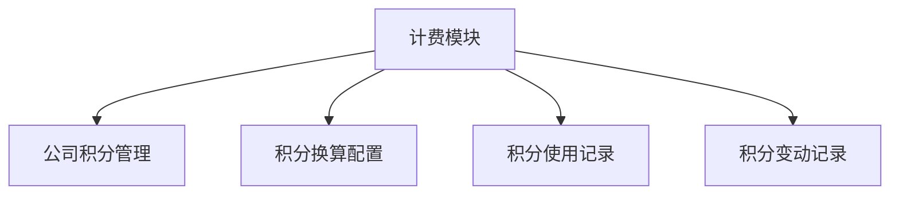

# HSAI后台管理系统计费模块功能设计文档

## 1. 文档概述

### 1.1 目的
本文档旨在详细描述HSAI后台管理系统计费模块的功能设计，包括系统架构、模块划分、数据库设计、接口设计等，为开发团队提供详细的技术实现指导。

### 1.2 范围
本文档适用于HSAI后台管理系统计费模块的开发团队，包括系统架构师、开发工程师、测试工程师等。

### 1.3 参考资料
- [HSAI项目计费方案.md](../HSAI项目计费方案.md)
- [计费模块需求文档](./billing_module_requirements.md)

## 2. 系统架构设计

### 2.1 整体架构
计费模块作为后台管理系统的一个功能模块，采用MVC架构模式：
- **Model层**: 负责数据模型定义和数据访问
- **View层**: 负责页面展示和用户交互
- **Controller层**: 负责业务逻辑处理和请求分发

### 2.2 技术架构
- 后端框架：Flask
- 前端框架：Layui
- 数据库：SQLite
- ORM框架：SQLAlchemy

## 3. 功能模块设计

### 3.1 模块划分
计费模块包含以下子模块：
1. **公司积分管理模块**: 负责公司积分余额的展示和管理
2. **积分换算配置模块**: 负责积分换算规则的配置和管理
3. **积分使用记录模块**: 负责API使用记录的查询和展示
4. **积分变动记录模块**: 负责积分变动记录的查询和展示

### 3.2 模块关系图


## 4. 数据库设计

### 4.1 数据表结构

#### 4.1.1 计费配置表 (billing_config)
```sql
CREATE TABLE IF NOT EXISTS [billing_config] (
    id VARCHAR NOT NULL PRIMARY KEY,
    config_type VARCHAR NOT NULL,
    config_key VARCHAR NOT NULL,
    config_value JSON NOT NULL,
    description TEXT,
    is_active VARCHAR DEFAULT '1',
    created_at BIGINT,
    updated_at BIGINT
);
```

字段说明：
- `id`: 主键，UUID格式
- `config_type`: 配置类型，固定为"resource"
- `config_key`: 配置键名，如"api_call"
- `config_value`: 配置值，JSON格式，包含换算比率等信息
- `description`: 配置描述
- `is_active`: 是否启用，"1"表示启用，"0"表示禁用
- `created_at`: 创建时间戳
- `updated_at`: 更新时间戳

#### 4.1.2 API使用记录表 (hsai_business_api_usage_log)
```sql
CREATE TABLE IF NOT EXISTS [hsai_business_api_usage_log] (
    id BIGINT NOT NULL PRIMARY KEY,
    user_id TEXT NOT NULL,
    session_id TEXT,
    service_provider VARCHAR(100) NOT NULL,
    model_name VARCHAR(100),
    credits_consumed NUMERIC(12, 6) NOT NULL DEFAULT 0,
    consumed_at DATETIME NOT NULL DEFAULT CURRENT_TIMESTAMP
);
```

字段说明：
- `id`: 主键，自增ID
- `user_id`: 用户ID，不能为空
- `session_id`: 会话ID，可为空
- `service_provider`: 服务提供商，最大长度100字符，不能为空
- `model_name`: 模型名称，最大长度100字符，可为空
- `credits_consumed`: 消耗的积分数量，数值类型(12,6)，默认值为0
- `consumed_at`: 消耗时间，默认值为当前时间

#### 4.1.3 积分变动记录表 (company_credit_logs)
```sql
CREATE TABLE IF NOT EXISTS [company_credit_logs] (
    id VARCHAR NOT NULL PRIMARY KEY,
    company_id VARCHAR(255) NOT NULL,
    change_type VARCHAR(20) NOT NULL, -- 'increase' 或 'decrease'
    change_amount NUMERIC(12, 6) NOT NULL,
    balance_before NUMERIC(12, 6) NOT NULL,
    balance_after NUMERIC(12, 6) NOT NULL,
    operator_id INTEGER NOT NULL,
    operated_at DATETIME NOT NULL DEFAULT CURRENT_TIMESTAMP,
    remark TEXT
);
```

字段说明：
- `id`: 主键，UUID格式
- `company_id`: 公司ID
- `change_type`: 变动类型，"increase"表示增加，"decrease"表示减少
- `change_amount`: 变动数量
- `balance_before`: 变动前余额
- `balance_after`: 变动后余额
- `operator_id`: 操作人ID
- `operated_at`: 操作时间
- `remark`: 备注信息

#### 4.1.4 公司积分余额扩展
在现有[user表](file:///c:/work/hsai_admin/applications/models/webui_user.py#L7-L30)中添加公司积分余额字段：
```sql
ALTER TABLE user 
ADD COLUMN company_id VARCHAR(255) REFERENCES companies(id);

ALTER TABLE user
ADD COLUMN credit_balance NUMERIC(12, 6) DEFAULT 0;
```

### 4.2 索引设计
```sql
-- billing_config表索引
CREATE INDEX IF NOT EXISTS ix_billing_config_type ON [billing_config] (config_type);
CREATE INDEX IF NOT EXISTS ix_billing_config_key ON [billing_config] (config_key);
CREATE INDEX IF NOT EXISTS ix_billing_config_active ON [billing_config] (is_active);

-- hsai_business_api_usage_log表索引
CREATE INDEX IF NOT EXISTS ix_hsai_business_api_usage_log_user_id ON [hsai_business_api_usage_log] (user_id);
CREATE INDEX IF NOT EXISTS ix_hsai_business_api_usage_log_session_id ON [hsai_business_api_usage_log] (session_id);
CREATE INDEX IF NOT EXISTS ix_hsai_business_api_usage_log_service_provider ON [hsai_business_api_usage_log] (service_provider);
CREATE INDEX IF NOT EXISTS ix_hsai_business_api_usage_log_consumed_at ON [hsai_business_api_usage_log] (consumed_at);

-- company_credit_logs表索引
CREATE INDEX IF NOT EXISTS ix_company_credit_logs_company_id ON [company_credit_logs] (company_id);
CREATE INDEX IF NOT EXISTS ix_company_credit_logs_operated_at ON [company_credit_logs] (operated_at);
CREATE INDEX IF NOT EXISTS ix_company_credit_logs_operator_id ON [company_credit_logs] (operator_id);
```

## 5. 接口设计

### 5.1 后端API接口

#### 5.1.1 公司积分管理接口

##### 获取公司积分余额列表
```
GET /billing/companies
参数:
- page: 页码，默认1
- limit: 每页记录数，默认10
- company_name: 公司名称（模糊查询）
返回:
{
  "code": 0,
  "msg": "success",
  "count": 100,
  "data": [
    {
      "company_id": "company_001",
      "company_name": "测试公司",
      "credit_balance": 1000.00,
      "last_updated": "2023-01-01 12:00:00"
    }
  ]
}
```

##### 获取指定公司积分详情
```
GET /billing/companies/{company_id}
返回:
{
  "code": 0,
  "msg": "success",
  "data": {
    "company_id": "company_001",
    "company_name": "测试公司",
    "credit_balance": 1000.00,
    "last_updated": "2023-01-01 12:00:00"
  }
}
```

##### 调整公司积分余额
```
POST /billing/companies/{company_id}/credit
参数:
{
  "amount": 100.00,  -- 调整金额，正数表示增加，负数表示减少
  "remark": "充值"   -- 备注
}
返回:
{
  "code": 0,
  "msg": "success"
}
```

#### 5.1.2 积分换算配置接口

##### 获取积分换算配置列表
```
GET /billing/configs
参数:
- page: 页码，默认1
- limit: 每页记录数，默认10
- config_type: 配置类型
- is_active: 是否启用
返回:
{
  "code": 0,
  "msg": "success",
  "count": 100,
  "data": [
    {
      "id": "config_001",
      "config_type": "resource",
      "config_key": "api_call",
      "config_value": {"rate": "0.1"},
      "description": "API调用积分换算",
      "is_active": "1",
      "created_at": "2023-01-01 12:00:00",
      "updated_at": "2023-01-01 12:00:00"
    }
  ]
}
```

##### 创建积分换算配置
```
POST /billing/configs
参数:
{
  "config_type": "resource",
  "config_key": "api_call",
  "config_value": {"rate": "0.1"},
  "description": "API调用积分换算",
  "is_active": "1"
}
返回:
{
  "code": 0,
  "msg": "success",
  "data": {
    "id": "config_001"
  }
}
```

##### 更新积分换算配置
```
PUT /billing/configs/{config_id}
参数:
{
  "config_value": {"rate": "0.15"},
  "description": "API调用积分换算",
  "is_active": "1"
}
返回:
{
  "code": 0,
  "msg": "success"
}
```

##### 删除积分换算配置
```
DELETE /billing/configs/{config_id}
返回:
{
  "code": 0,
  "msg": "success"
}
```

#### 5.1.3 积分使用记录接口

##### 获取API使用记录列表
```
GET /billing/usage-logs
参数:
- page: 页码，默认1
- limit: 每页记录数，默认10
- user_id: 用户ID
- company_id: 公司ID
- service_provider: 服务提供商
- start_time: 开始时间
- end_time: 结束时间
返回:
{
  "code": 0,
  "msg": "success",
  "count": 100,
  "data": [
    {
      "id": 1,
      "user_id": "user_001",
      "company_id": "company_001",
      "company_name": "测试公司",
      "session_id": "session_001",
      "service_provider": "openai",
      "model_name": "gpt-3.5-turbo",
      "credits_consumed": 0.1,
      "consumed_at": "2023-01-01 12:00:00"
    }
  ]
}
```

#### 5.1.4 积分变动记录接口

##### 获取积分变动记录列表
```
GET /billing/credit-logs
参数:
- page: 页码，默认1
- limit: 每页记录数，默认10
- company_id: 公司ID
- operator_id: 操作人ID
- start_time: 开始时间
- end_time: 结束时间
返回:
{
  "code": 0,
  "msg": "success",
  "count": 100,
  "data": [
    {
      "id": "log_001",
      "company_id": "company_001",
      "company_name": "测试公司",
      "change_type": "increase",
      "change_amount": 100.00,
      "balance_before": 900.00,
      "balance_after": 1000.00,
      "operator_id": 1,
      "operator_name": "管理员",
      "operated_at": "2023-01-01 12:00:00",
      "remark": "充值"
    }
  ]
}
```

### 5.2 前端页面设计

#### 5.2.1 公司积分管理页面
- 页面路径：`/system/billing/companies`
- 功能：
  - 展示公司积分余额列表
  - 支持按公司名称搜索
  - 支持分页显示
  - 点击公司可查看积分详情和调整积分

#### 5.2.2 积分换算配置页面
- 页面路径：`/system/billing/configs`
- 功能：
  - 展示积分换算配置列表
  - 支持新增、编辑、删除配置
  - 支持启用/禁用配置
  - 支持分页显示

#### 5.2.3 积分使用记录页面
- 页面路径：`/system/billing/usage-logs`
- 功能：
  - 展示API使用记录列表
  - 支持按条件筛选记录
  - 支持分页显示

#### 5.2.4 积分变动记录页面
- 页面路径：`/system/billing/credit-logs`
- 功能：
  - 展示积分变动记录列表
  - 支持按条件筛选记录
  - 支持分页显示

## 6. 权限设计

### 6.1 权限点定义

#### 6.1.1 计费管理主菜单
- 权限名称：计费管理
- 权限编码：system:billing:main
- 权限类型：菜单权限

#### 6.1.2 公司积分管理权限
- 权限名称：公司积分管理
- 权限编码：system:billing:company:main
- 权限类型：菜单权限
- 父权限：system:billing:main

- 权限名称：调整公司积分
- 权限编码：system:billing:company:adjust
- 权限类型：操作权限
- 父权限：system:billing:company:main

#### 6.1.3 积分换算配置权限
- 权限名称：积分换算配置
- 权限编码：system:billing:config:main
- 权限类型：菜单权限
- 父权限：system:billing:main

- 权限名称：新增配置
- 权限编码：system:billing:config:add
- 权限类型：操作权限
- 父权限：system:billing:config:main

- 权限名称：编辑配置
- 权限编码：system:billing:config:edit
- 权限类型：操作权限
- 父权限：system:billing:config:main

- 权限名称：删除配置
- 权限编码：system:billing:config:remove
- 权限类型：操作权限
- 父权限：system:billing:config:main

### 6.2 权限分配建议
- 系统管理员：拥有所有计费模块权限
- 财务人员：拥有查看权限和调整公司积分权限
- 运营人员：拥有查看权限

## 7. 安全设计

### 7.1 数据安全
- 所有敏感操作都需要记录操作日志
- 积分余额变更需要事务处理，确保数据一致性
- 删除操作采用软删除方式

### 7.2 访问安全
- 所有接口都需要进行身份验证
- 敏感操作需要进行权限验证
- 关键接口需要进行频率限制

## 8. 性能设计

### 8.1 数据库优化
- 合理设计索引，提高查询效率
- 对于大表查询，采用分页机制
- 定期清理历史数据

### 8.2 缓存设计
- 对于频繁访问的配置数据，可以考虑使用缓存
- 积分余额可以考虑在缓存中存储，提高访问速度

## 9. 错误处理设计

### 9.1 错误码定义
- 200: 操作成功
- 400: 请求参数错误
- 401: 未授权访问
- 403: 权限不足
- 500: 服务器内部错误

### 9.2 异常处理
- 数据库操作异常需要回滚事务
- 网络异常需要重试机制
- 业务逻辑异常需要返回友好的错误信息

## 10. 部署设计

### 10.1 部署环境
- 与现有后台管理系统部署在同一环境中
- 数据库使用现有数据库

### 10.2 部署步骤
1. 数据库表结构更新
2. 后端代码部署
3. 前端页面部署
4. 权限配置更新
5. 功能测试

## 11. 附录

### 11.1 数据字典
| 表名 | 描述 |
|------|------|
| billing_config | 计费配置表 |
| hsai_business_api_usage_log | API使用记录表 |
| company_credit_logs | 公司积分变动记录表 |

### 11.2 代码结构
```
applications/
├── models/
│   └── billing.py              # 计费相关数据模型
├── view/
│   └── system/
│       └── billing.py          # 计费模块视图控制器
├── schemas/
│   └── billing.py              # 计费模块序列化器
└── common/
    └── script/
        └── billing_menu.py     # 计费模块菜单初始化脚本

templates/
└── system/
    └── billing/
        ├── company_main.html   # 公司积分管理页面
        ├── config_main.html    # 积分换算配置页面
        ├── usage_log.html      # 积分使用记录页面
        └── credit_log.html     # 积分变动记录页面
```