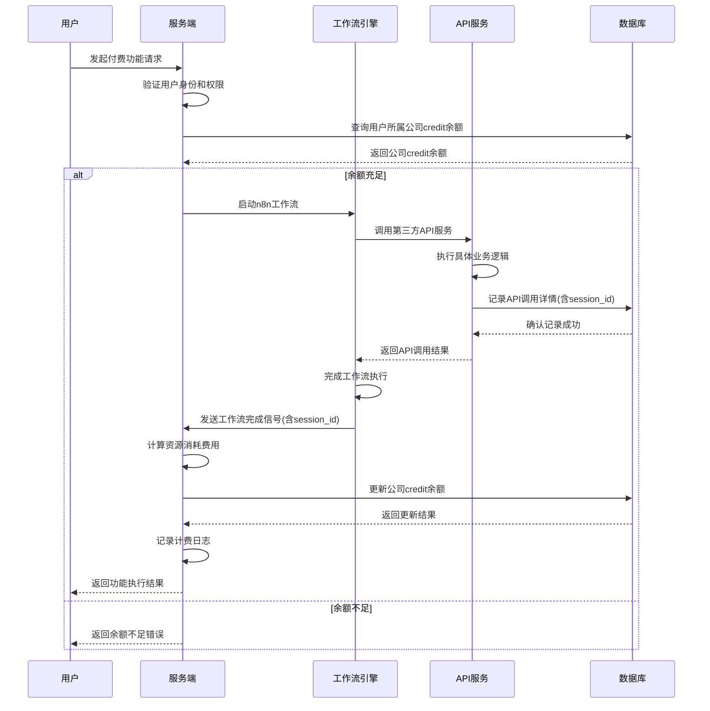

# HSAI项目计费方案

## 1. 背景与挑战

在当前的HSAI项目中，我们面临以下计费挑战：

1. **大模型集成在n8n中，无法有效获取token消耗**：由于大语言模型（LLM）直接在n8n工作流中集成，后端系统无法直接获取模型的token消耗数据，这使得传统的基于token的计费方式变得困难。

2. **n8n中集成了除对话模型以外的各种类型的模型及第三方接口，各渠道的计费方式不同，难以统一计算**：n8n工作流中不仅包含LLM，还集成了多种第三方服务和API，这些服务的计费方式各不相同，难以建立统一的计费模型。

3. **Redis连接不稳定导致计费风险**：系统中偶发Redis连接丢失的情况，如果将计费的关键节点放在Redis，遇到Redis连接丢失时将会出现用户超额度使用的情况。

## 2. 解决方案概述

针对上述挑战，我们提出了一种基于资源消耗的计费模式，该模式不依赖于直接的token消耗数据，而是通过系统资源的使用情况来计算费用。为解决Redis连接不稳定的问题，本方案采用数据库作为计费记录的核心存储，确保计费数据的持久性和一致性。

### 2.1 基于资源消耗的计费

对系统资源的使用情况进行计费：

- **存储资源**：按存储空间大小和时间收费（默认2积分/GB/月）
- **第三方API调用**：按调用次数收费（默认0.1积分/次）

> 注：单价配置存储在数据库中，可通过后台管理系统随时调整

## 3. 具体实施方案

为解决Redis连接不稳定的问题，本方案采用数据库作为计费记录的核心存储，确保计费数据的持久性和一致性。

### 3.1 计费模型设计

#### 3.1.1 资源计费模型

| 资源类型     | 计费方式  | 单价（积分） | 说明      |
| -------- | ----- | ------ | ------- |
| 存储空间     | 按GB/月 | 2/GB/月 | 素材和视频存储 |
| 第三方API调用 | 按调用次数 | 0.1/次  | 外部服务调用  |

> 注：单价配置存储在数据库中，可通过后台管理系统随时调整

### 3.2 计费实现机制

#### 3.2.1 数据库计费记录机制

为避免Redis连接不稳定导致的计费风险，采用数据库进行计费统计：

1. **API调用记录**：在n8n工作流的每次API调用之后，在数据库中记录一次用户的API调用，记录用户ID、API服务商、调用次数、会话ID(session_id)等信息，便于工作流返回之后使用会话ID索引当前请求产生的计费信息，减少数据库请求的时间
2. **实时余额检查**：credit记录在公司信息中，用户每次使用付费功能时，通过查询公司的credit余量确认是否可以使用，同一个公司的用户共享公司的credit
3. **计费计算**：在每次工作流执行完成返回时，读取数据表根据返回结构的session_id查找本次请求产生了多少消耗
4. **余额更新**：根据调用次数乘上换算credit来计算用户的积分使用情况，更新公司表的credit余量

#### 3.2.2 计费记录与统计

在数据库中建立完整的计费记录与统计机制：

1. **API调用记录**：记录每次API调用的详细信息，包括用户ID、API服务商、调用时间、调用次数、会话ID等，便于后续通过会话ID快速索引计费信息
2. **计费日志**：记录每次计费的详细信息，包括资源消耗、费用计算过程等
3. **公司余额跟踪**：实时跟踪每个公司的credit余量变化，确保余额准确性。同一个公司的所有用户共享该公司的credit余额，当任一用户使用付费功能时，都会影响整个公司的余额
4. **统计报表**：提供计费统计报表，展示用户消费情况和系统收入情况
5. **余额提醒**：当公司积分余额不足时，及时提醒充值

##### 计费记录表结构

计费记录存储在`hsai_business_api_usage_log`表中，表结构如下：

```sql
CREATE TABLE IF NOT EXISTS [hsai_business_api_usage_log] (
    id BIGINT NOT NULL PRIMARY KEY,
    user_id TEXT NOT NULL,
    session_id TEXT,
    service_provider VARCHAR(100) NOT NULL,
    model_name VARCHAR(100),
    credits_consumed NUMERIC(12, 6) NOT NULL DEFAULT 0,
    consumed_at DATETIME NOT NULL DEFAULT CURRENT_TIMESTAMP
);
CREATE INDEX IF NOT EXISTS ix_hsai_business_api_usage_log_user_id ON [hsai_business_api_usage_log] (user_id);
CREATE INDEX IF NOT EXISTS ix_hsai_business_api_usage_log_session_id ON [hsai_business_api_usage_log] (session_id);
CREATE INDEX IF NOT EXISTS ix_hsai_business_api_usage_log_service_provider ON [hsai_business_api_usage_log] (service_provider);
CREATE INDEX IF NOT EXISTS ix_hsai_business_api_usage_log_consumed_at ON [hsai_business_api_usage_log] (consumed_at);
```

该表包含以下字段：

- `id`：主键
- `user_id`：用户ID，不能为空
- `session_id`：会话ID，可为空
- `service_provider`：服务提供商，最大长度100字符，不能为空
- `model_name`：模型名称，最大长度100字符，可为空
- `credits_consumed`：消耗的积分数量，数值类型(12,6)，默认值为0
- `consumed_at`：消耗时间，默认值为当前时间

API调用记录数据模型定义如下：

```python
class APIUsageLog(Base):
    __tablename__ = "hsai_business_api_usage_log"

    id = Column(BigInteger, primary_key=True, autoincrement=True)
    user_id = Column(Text, nullable=False)
    session_id = Column(Text)
    service_provider = Column(String(100), nullable=False)
    model_name = Column(String(100))
    credits_consumed = Column(Numeric(12, 6), nullable=False, default=0)
    consumed_at = Column(DateTime(timezone=True), nullable=False, default=func.now())
```

### 3.3 技术实现细节

### 3.3.0 用户使用付费功能时序图

以下是用户使用付费功能的完整流程时序图，按照用户、服务端、工作流、API服务、数据库来描述付费流程：



### 3.3.1 计费服务模块

创建独立的计费服务模块，包含以下功能：

```python
class BillingService:
    """计费服务类"""

    def __init__(self):
        self.billing_configs = BillingConfigs
        self.api_usage_logs = APIUsageLogs
        self.hsai_tasks = HSAITasks
        self.companies = Companies
        self.credits = Credits

    def calculate_resource_cost(self, resource_type: str, usage: dict) -> Decimal:
        """计算资源使用费用"""
        # 从数据库配置中获取计费比率
        rate = self.billing_configs.get_billing_rate("resource", resource_type)
        # 根据具体资源类型和使用量计算费用
        return self._calculate_cost_by_rate(rate, usage)

    def _calculate_cost_by_rate(self, rate: Decimal, data: dict) -> Decimal:
        """根据费率和数据计算费用"""
        # 默认按调用次数计算
        count = data.get("count", 0)
        return rate * Decimal(str(count))

    def update_company_credit(self, company_id: str, amount: Decimal, detail: dict) -> bool:
        """更新公司积分余额"""
        try:
            company = self.companies.get_company_by_id(company_id)
            if not company:
                log.error(f"公司不存在: company_id={company_id}")
                return False

            # 获取公司所有用户中第一个用户作为积分操作的用户
            # 在实际实现中，可能需要更复杂的逻辑来确定使用哪个用户
            # 这里简化处理，使用公司负责人的用户ID
            user_id = company.owner_user_id

            # 更新用户积分余额
            result = self.credits.add_credit_by_user_id(
                form_data=AddCreditForm(
                    user_id=user_id,
                    amount=amount,
                    detail=SetCreditFormDetail(**detail)
                )
            )

            return result is not None
        except Exception as e:
            log.error(f"更新公司积分余额失败: {e}")
            return False

    def record_api_call(self, user_id: str, session_id: str, service_provider: str, 
                       model_name: Optional[str], credits_consumed: Decimal, 
                       consumed_at: time.struct_time) -> bool:
        """记录API调用到hsai_business_api_usage_log表"""
        try:
            # 创建API调用记录
            api_log_form = APIUsageLogForm(
                user_id=user_id,
                session_id=session_id,
                service_provider=service_provider,
                model_name=model_name,
                credits_consumed=credits_consumed
            )

            result = self.api_usage_logs.insert_new_log(api_log_form)
            return result is not None
        except Exception as e:
            log.error(f"记录API调用失败: {e}")
            return False

    def handle_task_completion_with_billing(self, message: Dict[str, Any]) -> None:
        """处理任务完成信号并触发计费"""
        try:
            # 获取任务信息
            session_id = message.get("session_id")
            if not session_id:
                log.warning("消息中缺少session_id")
                return

            # 根据session_id查找任务
            # 注意：在实际实现中，可能需要通过其他方式关联session_id和任务
            # 这里假设任务ID等于session_id或可以通过session_id找到任务
            task = None
            # 尝试直接通过session_id查找任务
            # 这需要在HSAITasks中实现相应的方法

            # 如果找不到任务，记录警告并返回
            if not task:
                log.warning(f"未找到与session_id关联的任务: session_id={session_id}")
                return

            # 记录API调用到hsai_business_api_usage_log表
            # 注意：这里需要从message中提取相关信息
            service_provider = message.get("service_provider", "unknown")
            model_name = message.get("model_name")
            credits_consumed = Decimal(str(message.get("credits_consumed", 0)))

            self.record_api_call(
                user_id=task.user_id,
                session_id=task.session_id or session_id,  # 使用任务的会话ID或消息中的session_id
                service_provider=service_provider,
                model_name=model_name,
                credits_consumed=credits_consumed,
                consumed_at=time.localtime()
            )

            # 计算费用（仅基于资源消耗）
            # 这里需要根据实际的资源使用情况计算费用
            # 示例：计算API调用费用
            api_calls = message.get("content", {}).get("api_calls", 0)
            cost = self.calculate_resource_cost("api_call", {"count": api_calls})

            # 更新公司credit余量
            if hasattr(task, 'company_id') and task.company_id:
                self.update_company_credit(
                    company_id=task.company_id,
                    amount=-cost,  # 负值表示消耗积分
                    detail={
                        "session_id": session_id,
                        "resource_type": "api_call",
                        "amount": float(cost)
                    }
                )
            else:
                log.warning(f"任务没有关联公司: task_id={getattr(task, 'id', 'unknown')}")

        except Exception as e:
            log.error(f"计费处理失败: {e}")
```

#### 3.3.2 数据库计费处理器

创建独立的数据库计费处理器，处理工作流完成后的计费逻辑：

```python
# 在实际实现中，计费处理逻辑集成在BillingService类中
# 通过handle_task_completion_with_billing方法处理任务完成信号并触发计费

# API调用记录函数定义如下：
class APIUsageService:
    @staticmethod
    def record_api_call(user_id: str, session_id: str, service_provider: str, 
                       model_name: str, credits_consumed: Decimal, 
                       consumed_at: datetime) -> bool:
        """记录API调用到hsai_business_api_usage_log表"""
        try:
            # 创建API调用记录
            api_log = APIUsageLog(
                user_id=user_id,
                session_id=session_id,
                service_provider=service_provider,
                model_name=model_name,
                credits_consumed=credits_consumed,
                consumed_at=consumed_at
            )

            # 保存到数据库
            db.add(api_log)
            db.commit()

            return True
        except Exception as e:
            db.rollback()
            log.error(f"记录API调用失败: {e}")
            return False
```

#### 3.3.3 数据库计费配置管理

将调用次数对应的credit换算配置存储在数据库中，方便后台随时调整：

```python
# 数据库计费配置表
class BillingConfig(Base):
    __tablename__ = "billing_config"

    id = Column(String, primary_key=True)
    config_type = Column(String, nullable=False)  # 配置类型：resource
    config_key = Column(String, nullable=False)   # 配置键名
    config_value = Column(JSON, nullable=False)   # 配置值
    description = Column(Text)                    # 配置描述
    is_active = Column(String, default="1")      # 是否启用
    created_at = Column(BigInteger)
    updated_at = Column(BigInteger)

# 计费配置服务
class BillingConfigService:
    def get_billing_rate(self, config_type: str, config_key: str) -> Decimal:
        """获取计费比率"""
        config = db.query(BillingConfig).filter_by(
            config_type=config_type, 
            config_key=config_key, 
            is_active="1"
        ).first()

        if config:
            rate_str = config.config_value.get("rate", "0")
            try:
                return Decimal(rate_str)
            except:
                return Decimal("0")
        return Decimal("0")

    def update_billing_rate(self, config_type: str, config_key: str, rate: Decimal, description: str = ""):
        """更新计费比率"""
        config = db.query(BillingConfig).filter_by(
            config_type=config_type, 
            config_key=config_key
        ).first()

        if config:
            config.config_value = {"rate": str(rate)}
            config.description = description
            config.updated_at = int(time.time())
        else:
            config = BillingConfig(
                id=str(uuid.uuid4()),
                config_type=config_type,
                config_key=config_key,
                config_value={"rate": str(rate)},
                description=description,
                created_at=int(time.time()),
                updated_at=int(time.time())
            )
            db.add(config)

        db.commit()
```

### 3.4 计费API接口

提供RESTful API接口用于管理计费配置和查询使用记录：

#### 3.4.1 计费配置管理接口

```python
# 获取计费配置列表
@router.get("/billing/configs")
async def get_billing_configs(
    config_type: Optional[str] = None,
    is_active: Optional[bool] = None,
    ps: int = Query(20, ge=1, le=100),
    pi: int = Query(1, ge=1),
    user=Depends(get_admin_user)
):
    pass

# 创建计费配置
@router.post("/billing/configs")
async def create_billing_config(
    form_data: BillingConfigForm,
    user=Depends(get_admin_user)
):
    pass

# 更新计费配置
@router.put("/billing/configs/{config_id}")
async def update_billing_config(
    config_id: str,
    form_data: BillingConfigUpdateForm,
    user=Depends(get_admin_user)
):
    pass
```

#### 3.4.2 API使用记录接口

```python
# 获取API使用记录列表
@router.get("/billing/usage-logs")
async def get_api_usage_logs(
    user_id: Optional[str] = None,
    ps: int = Query(20, ge=1, le=100),
    pi: int = Query(1, ge=1),
    user=Depends(get_verified_user)
):
    pass

# 根据会话ID获取API使用记录
@router.get("/billing/usage-logs/session/{session_id}")
async def get_api_usage_logs_by_session(
    session_id: str,
    user=Depends(get_verified_user)
):
    pass

# 根据会话ID获取总消耗积分
@router.get("/billing/usage-logs/session/{session_id}/total")
async def get_total_credits_consumed_by_session(
    session_id: str,
    user=Depends(get_verified_user)
):
    pass
```

## 4. 数据库表结构变更

### 4.1 新增表结构

#### 4.1.1 计费配置表 (billing_config)

```sql
-- 计费配置表结构
CREATE TABLE IF NOT EXISTS [billing_config] (
    id VARCHAR NOT NULL PRIMARY KEY,
    config_type VARCHAR NOT NULL,
    config_key VARCHAR NOT NULL,
    config_value JSON NOT NULL,
    description TEXT,
    is_active VARCHAR DEFAULT '1',
    created_at BIGINT,
    updated_at BIGINT
);
CREATE INDEX IF NOT EXISTS ix_billing_config_type ON [billing_config] (config_type);
CREATE INDEX IF NOT EXISTS ix_billing_config_key ON [billing_config] (config_key);
CREATE INDEX IF NOT EXISTS ix_billing_config_active ON [billing_config] (is_active);
```

#### 4.1.2 API使用记录表 (hsai_business_api_usage_log)

```sql
-- HSAI API使用记录表结构
CREATE TABLE IF NOT EXISTS [hsai_business_api_usage_log] (
    id BIGINT NOT NULL PRIMARY KEY,
    user_id TEXT NOT NULL,
    session_id TEXT,
    service_provider VARCHAR(100) NOT NULL,
    model_name VARCHAR(100),
    credits_consumed NUMERIC(12, 6) NOT NULL DEFAULT 0,
    consumed_at DATETIME NOT NULL DEFAULT CURRENT_TIMESTAMP
);
CREATE INDEX IF NOT EXISTS ix_hsai_business_api_usage_log_user_id ON [hsai_business_api_usage_log] (user_id);
CREATE INDEX IF NOT EXISTS ix_hsai_business_api_usage_log_session_id ON [hsai_business_api_usage_log] (session_id);
CREATE INDEX IF NOT EXISTS ix_hsai_business_api_usage_log_service_provider ON [hsai_business_api_usage_log] (service_provider);
CREATE INDEX IF NOT EXISTS ix_hsai_business_api_usage_log_consumed_at ON [hsai_business_api_usage_log] (consumed_at);
```

### 4.2 现有表结构扩展

#### 4.2.1 用户表扩展

为`user`表添加公司关联字段：

```sql
ALTER TABLE user 
ADD COLUMN company_id VARCHAR(255) REFERENCES companies(id);
```

#### 4.2.2 项目表扩展

为`hsai_projects`表添加公司关联字段：

```sql
ALTER TABLE hsai_projects 
ADD COLUMN company_id VARCHAR(255) REFERENCES companies(id);
```

#### 4.2.3 任务表扩展

为`hsai_tasks`表添加项目关联字段和提示词配置字段：

```sql
ALTER TABLE hsai_tasks 
ADD COLUMN project_id VARCHAR(255) REFERENCES hsai_projects(id);

ALTER TABLE hsai_tasks 
ADD COLUMN prompt_config JSON;
```

## 5. 实施计划

为确保计费系统的稳定性和准确性，采用分阶段实施的方式：

### 5.1 第一阶段：基础计费功能实现（1-2周）

- 实现基于资源消耗的计费模型
- 创建数据库计费处理器，替代Redis消息处理器的计费触发逻辑
- 实现计费记录和统计功能
- 实现公司表credit余量字段和更新逻辑

### 5.2 第二阶段：资源计费完善（2-3周）

- 完善基于资源消耗的计费模型
- 实现计费配置的数据库存储和后台管理功能

### 5.3 第三阶段：优化和扩展（3-4周）

- 优化计费算法，提高准确性
- 扩展资源计费模型，支持更多资源类型
- 完善统计报表和数据分析功能
- 实现计费配置的动态调整和实时生效机制

## 6. 风险控制与监控

为确保计费系统的稳定运行和数据准确性，建立完善的风险控制和监控机制：

### 6.1 计费准确性监控

- 建立计费日志审计机制，确保每次计费都有详细记录
- 定期对账，核对系统收入与用户消费是否一致
- 设置异常消费预警，及时发现异常计费情况
- 实现数据库事务一致性，确保计费记录与余额更新的原子性

### 6.2 用户体验保障

- 提供积分余额查询和消费记录查询功能
- 在积分不足时及时提醒用户充值
- 提供计费争议处理机制，保障用户权益

### 6.3 系统稳定性保障

- 计费服务与主业务分离，避免计费异常影响主业务
- 实现计费失败的重试机制

## 7. 总结

本计费方案通过基于资源消耗的计费模式，有效解决了HSAI项目面临的计费挑战。该方案不依赖于直接的token消耗数据，而是通过系统资源的使用情况来计算费用。通过采用数据库而非Redis进行关键计费记录，避免了Redis连接丢失导致的计费风险，同时通过在公司表中实时记录credit余量，确保了余额检查的准确性。调用次数与credit换算的数据库配置设计，方便了后台随时调整计费策略，提升了系统的灵活性和可维护性。