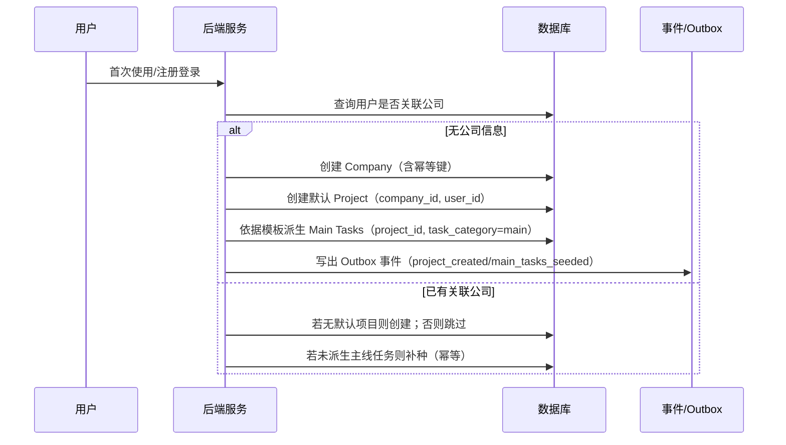
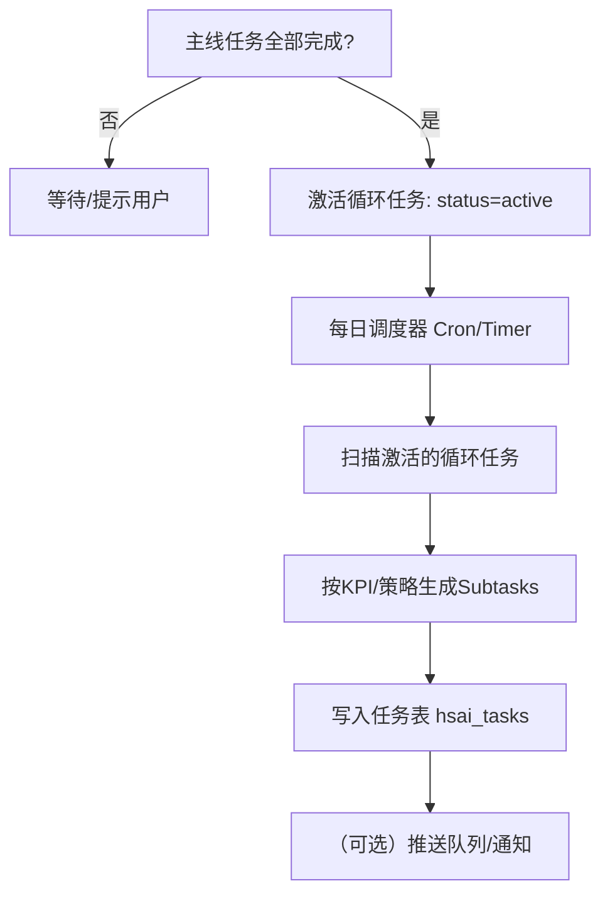
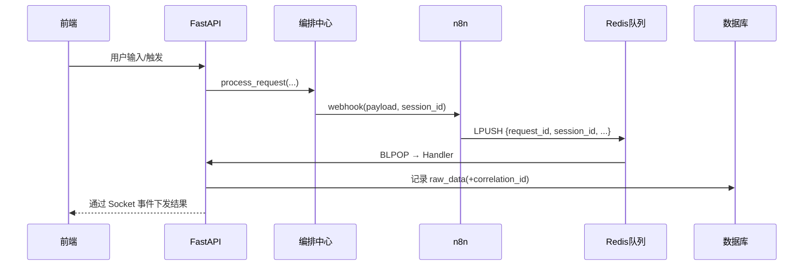
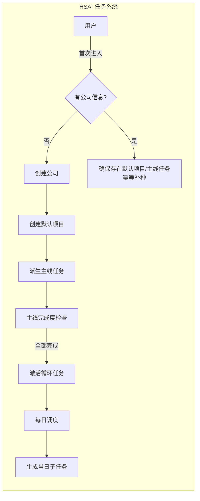
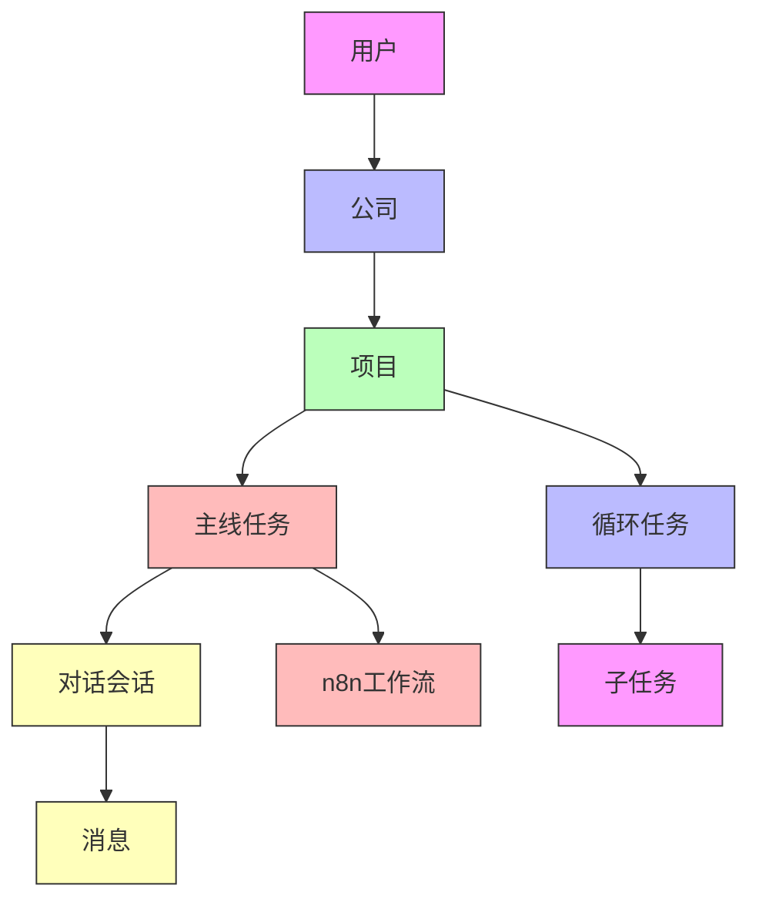
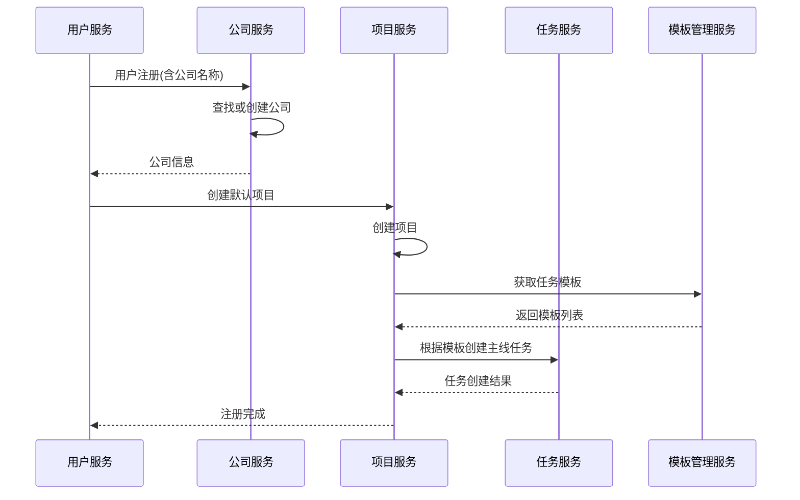
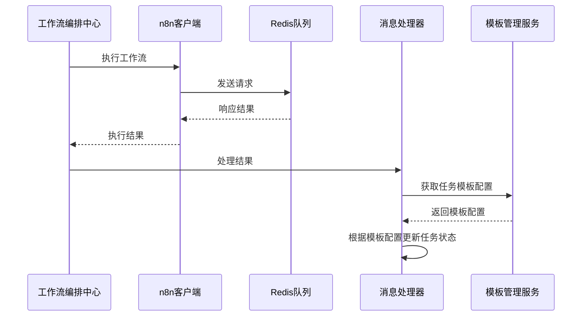
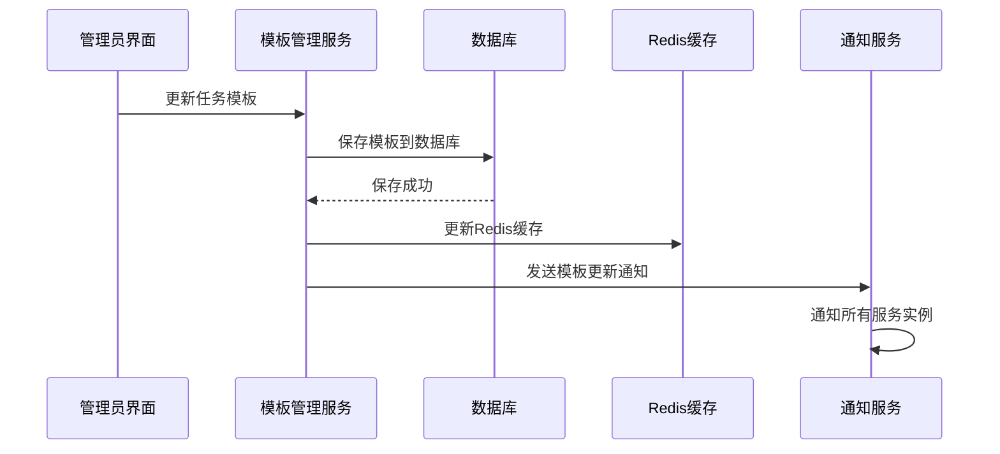

# HSAI项目任务系统设计文档

> 修订记录：
> - 2025-10-17：按业务方最新要求修正“主线任务生成”“循环/定时任务启用条件与子任务派发”“可靠性与保全机制”，并对齐数据结构与消息规范；补充架构/时序图与验收标准。


## 0. 本次修正要点（2025-10-17）

- 主线任务（Main Tasks）并非独立创建入口，而是在“用户注册/登录后的企业（Company）创建流程”之中触发：
  1) 当用户缺少公司信息时，系统先创建企业；
  2) 在企业创建阶段同时创建“默认项目（Default Project）”；
  3) 项目创建成功后，依据“任务模板（Task Templates）”为该项目一次性派生主线任务；
  4) 该链路需具备幂等与保全（失败可恢复/不中断关键数据）。
- 循环/定时任务（Recurring Tasks）不默认加入企业任务池。仅当“主线任务全部完成”后，系统从任务模板中激活循环任务；独立的每日调度器按天检查激活的循环任务并生成子任务（Subtasks）派发给企业。
- 可靠性与保全：对“用户→企业→默认项目→主线任务派生”的连续自动操作引入幂等键、事务边界、补偿/重试、Outbox 事件与有序提交，避免串行操作中断导致关键数据丢失。
- 数据结构对齐：确认 hsai_tasks 的核心字段集合，移除历史冗余字段（inputs/outputs/retry_count/tags/collaborators/shared_sessions/error_message），新增/保留 project_id、task_category、prompt_config。
- 消息与可追踪性：队列消息引入 correlation_id（优先取 request_id/reply_id），贯穿 RedisQueueMessage ↔ 任务/工作流执行的状态追踪。

数据库方言约定：本项目以 PostgreSQL 为主，所有示例 SQL 以 PG 方言为准；不再提供 SQLite 相关说明。


## 1.1 主线任务生成与企业默认项目（修正）



要点：
- 所有写入操作需具备“幂等键（例如 operation_id 或 user_id+company_name 哈希）”；
- 采用“事务+Outbox”提交顺序：先提交本地事务，再由后台转发 Outbox 事件，保证“至少一次”派发且避免重复；
- 若任一环节失败，可通过“重放幂等操作”恢复到一致状态。


## 1.2 循环任务激活与每日调度（修正）

触发条件：项目内“全部主线任务 = completed”。



每日调度器职责：
- 每日固定时段检查已激活的循环任务；
- 根据 KPI / 配置计算当天目标量并生成子任务；
- 生成记录需具备幂等（同一日期与任务的生成操作不重复）。


## 2.x 数据结构对齐与建议（新增）

- hsai_tasks 核心字段（对齐当前实现）：id/title/description/task_type/task_category/status/user_id/chat_id/project_id/config/prompt_config/workflow_id/parent_task_id/progress/started_at/completed_at/priority/created_at/updated_at。
- 历史冗余字段已清理：inputs/outputs/retry_count/tags/collaborators/shared_sessions/error_message。
- 建议：为 RedisQueueMessage 增加 correlation_id，用于与 request_id/reply_id 关联追踪。

参考 SQL 片段（PostgreSQL，文档示意）：
```sql
-- 任务表（精简结构）
CREATE TABLE hsai_tasks (
  id VARCHAR PRIMARY KEY,
  title VARCHAR NOT NULL,
  description TEXT,
  task_type VARCHAR NOT NULL,
  task_category VARCHAR,
  status VARCHAR NOT NULL,
  user_id VARCHAR NOT NULL,
  chat_id VARCHAR,
  project_id VARCHAR REFERENCES hsai_projects(id),
  config JSON,
  prompt_config JSON,
  workflow_id VARCHAR,
  parent_task_id VARCHAR,
  progress BIGINT DEFAULT 0,
  started_at BIGINT,
  completed_at BIGINT,
  priority BIGINT DEFAULT 0,
  created_at BIGINT,
  updated_at BIGINT
);
```


## 3.x 可靠性与保全（新增）

- 幂等与去重：所有链路（创建公司/默认项目/主线任务派生/每日子任务生成）均要求携带 idempotency key；
- 事务边界：以“Company+Project+MainTasks 派生”为单元提交，失败整体回滚；
- Outbox & 有序提交：先落库后转发事件，保证状态可追溯；
- 补偿/重试：失败时记录补偿任务，按指数退避重试；
- 断点恢复：关键步骤写入“里程碑”与“最后成功检查点”，支持恢复；
- 观测性：为每次操作打上 correlation_id（优先取 request_id/reply_id），贯穿日志/事件/DB。


## 4.x 队列与时序（新增）

- 队列：ai-conversation-agent-message-queue / ai-task-completion-queue / video_learning_notification。
- 必备字段：correlation_id、session_id、user_id、status、timestamp。
- 持久化：RedisQueueMessage 保存 raw_data + correlation_id + status + last_executed_at。
- 状态机：pending → completed/failed；失败进入死信队列并可人工/自动重放。




## 5.x 验收标准（DoD，新增）

1. 用户首次进入且无公司信息时，自动创建公司与默认项目，并一次性派生主线任务；重复触发不产生重复数据（幂等）。
2. 项目内主线任务全部完成后，系统自动激活循环任务（不需人工介入）。
3. 每日调度器在配置时段内生成当日子任务，重复触发不重复生成（以 task_id+date 幂等）。
4. 队列消息均具备 correlation_id，并可在数据库中以该 ID 追踪处理状态。
5. 所有关键流程具备日志、指标与失败重试策略；出现异常可通过补偿/重放恢复。


## 6.x 体系结构补充（Mermaid）



## 1. 系统概述

HSAI项目的任务系统基于公司-项目-任务三级结构设计，通过任务驱动的对话管理机制，解决长对话导致的信息过载问题，实现任务进度的持久化保存和状态跟踪。

### 1.1 核心概念

系统围绕以下核心概念构建：
- **用户(User)**：系统的操作者和使用者，每个用户属于一个公司实体
- **公司(Company)**：企业实体，是用户和项目的容器
- **项目(Project)**：用户工作的基本单位，隶属于某个公司，包含所有相关任务
- **主线任务(Main Task)**：项目创建时自动生成的关键任务，必须在循环任务启动前完成
- **循环任务(Recurring Task)**：主线任务完成后启动的周期性任务，基于战略地图的KPI自动生成
- **子任务(Sub Task)**：循环任务的具体执行单元

## 2. 系统架构设计

### 2.1 数据模型结构



### 2.2 数据库表结构

#### 公司表(companies)
```sql
CREATE TABLE companies (
    id VARCHAR(255) PRIMARY KEY,
    name VARCHAR(255) NOT NULL,
    description TEXT,
    owner_user_id VARCHAR(255) NOT NULL,
    company_info JSON,
    status VARCHAR(50) DEFAULT 'active',
    config JSON,
    created_at BIGINT,
    updated_at BIGINT
);
```

#### 项目表(hsai_projects)
```sql
CREATE TABLE hsai_projects (
    id VARCHAR NOT NULL PRIMARY KEY,
    name VARCHAR NOT NULL,
    description TEXT,
    business_name VARCHAR NOT NULL,
    company_info JSON,
    user_id VARCHAR NOT NULL,
    status VARCHAR DEFAULT 'active',
    config JSON,
    company_id VARCHAR REFERENCES companies(id),
    created_at BIGINT,
    updated_at BIGINT
);
```

#### 任务表(hsai_tasks)
```sql
CREATE TABLE hsai_tasks (
    id VARCHAR NOT NULL PRIMARY KEY,
    title VARCHAR NOT NULL,
    description TEXT,
    task_type VARCHAR NOT NULL,
    task_category VARCHAR,
    status VARCHAR NOT NULL,
    user_id VARCHAR NOT NULL,
    chat_id VARCHAR,
    config JSON,
    inputs JSON,
    outputs JSON,
    workflow_id VARCHAR,
    parent_task_id VARCHAR,
    progress BIGINT NOT NULL,
    started_at BIGINT,
    completed_at BIGINT,
    error_message TEXT,
    retry_count BIGINT NOT NULL,
    priority BIGINT,
    tags JSON,
    created_at BIGINT,
    updated_at BIGINT,
    assignee_id VARCHAR,
    collaborators JSON,
    shared_sessions JSON,
    project_id VARCHAR REFERENCES hsai_projects(id),
    prompt_config JSON
);
```

## 3. 详细功能实现

### 3.1 主线任务、循环任务在后台的配置管理设计

#### 3.1.1 主线任务创建机制
1. 主线任务在创建项目时根据主线任务模板自动创建
2. 所有主线任务在项目存续期间只能执行一次（除用户主动重置外）
3. 主线任务模板由管理员在系统后台创建和管理
4. 项目创建时根据已配置的主线任务模板自动创建任务

#### 3.1.2 默认主线任务
- 素材库补充
- 社媒账号绑定
- 企业信息收集（战略地图生成）

#### 3.1.3 主线任务执行机制
1. 主线任务无先后顺序，用户可任意选择完成
2. 每个主线任务完成时检查是否所有主线任务都已完成
3. 只有主线任务都完成时才能开启循环任务
4. 否则在用户登录时通过socket通知未完成的主线任务

#### 3.1.4 循环任务创建机制
1. 在战略地图任务完成后，将工作流返回的战略地图信息保存为循环任务
2. 每天根据战略地图的KPI设计和当前项目视频发布情况计算当天需要完成的视频发布数量
3. 每个视频发布需求产生一个视频发布的子任务

#### 3.1.5 循环任务执行机制
循环任务每天自动生成，根据战略地图的KPI和当前项目状态动态调整任务内容和数量。

### 3.2 用户端如何携带任务id与任务进行联动

#### 3.2.1 任务ID传递机制
在前端dashboard.html中，任务ID通过URL参数传递：
```javascript
// 主任务联系AI秘书
function contactAIForMainTask(mainTaskId) {
    const url = `./chat.html?mainTaskId=${mainTaskId}&source=dashboard&action=consult`;
    window.open(url, '_blank');
}

// 子任务联系AI秘书
function contactAIForSubTask(subTaskId) {
    const url = `./chat.html?taskId=${subTaskId}&source=dashboard&action=consult`;
    window.open(url, '_blank');
}

// 进入任务对话
function openTaskChat(subTaskId) {
    const url = `./chat.html?taskId=${subTaskId}&source=dashboard`;
    window.open(url, '_blank');
}
```

#### 3.2.2 任务上下文处理
在chat.html中，通过URL参数解析任务上下文：
```javascript
function initTaskContext() {
    const q = parseQuery();
    const mainTaskId = q.get('mainTaskId');
    const taskId = q.get('taskId');
    
    if (mainTaskId) {
        // 处理主任务上下文
        const mt = mains.find(m => m.id === mainTaskId);
        if (mt) {
            addMessage(`已载入项目【${mt.title}】。\n目标：${mt.goal}`, 'ai');
        }
    }
    
    if (taskId) {
        // 处理子任务上下文
        const st = subs.find(s => s.id === taskId);
        const mt = st ? mains.find(m => m.id === st.mainTaskId) : null;
        addMessage(`已载入任务【${st ? st.title : taskId}】${mt ? `（项目：${mt.title}）` : ''}`, 'ai');
    }
}
```

### 3.3 循环任务如何判断主线任务完成，并触发循环任务开启

#### 3.3.1 主线任务完成检查机制
1. 每个主线任务完成时，系统检查是否所有主线任务都已完成
2. 检查逻辑在任务服务中实现：
```python
def check_all_main_tasks_completed(project_id):
    """检查项目的所有主线任务是否都已完成"""
    main_tasks = get_project_main_tasks(project_id)
    return all(task.status == 'completed' for task in main_tasks)
```

#### 3.3.2 循环任务触发机制
1. 当检测到所有主线任务完成时，系统自动创建循环任务
2. 循环任务基于战略地图信息生成：
```python
def create_recurring_task_from_strategy_map(strategy_map_data, project_id):
    """根据战略地图创建循环任务"""
    recurring_task = {
        "title": "每日发布任务",
        "description": "根据战略地图KPI自动生成的每日发布任务",
        "task_type": "recurring",
        "project_id": project_id,
        "recurring_config": {
            "schedule_time": "09:00",
            "calculation_logic": "根据项目目标与当前完成情况计算当天发布目标"
        }
    }
    return create_task(recurring_task)
```

### 3.4 循环任务如何获取KPI，并根据KPI目标、循环任务开始时间、循环任务配置、当前的项目完成进度生成当天的子任务

#### 3.4.1 KPI数据获取
1. 从KPI指标表中获取项目相关指标：
```sql
SELECT * FROM kpi_metrics 
WHERE company_id = ? 
AND record_date = CURRENT_DATE
ORDER BY metric_name;
```

#### 3.4.2 子任务生成逻辑
```python
def generate_daily_subtasks(recurring_task, kpi_data, project_progress):
    """根据KPI和项目进度生成每日子任务"""
    # 获取循环任务配置
    config = recurring_task.get('recurring_config', {})
    
    # 计算当天需要完成的任务数量
    daily_target = calculate_daily_target(
        kpi_data, 
        project_progress, 
        config.get('calculation_logic')
    )
    
    # 生成子任务
    subtasks = []
    for i in range(daily_target):
        subtask = {
            "title": f"视频发布任务 #{i+1}",
            "description": "根据KPI目标生成的视频发布子任务",
            "task_type": "daily",
            "parent_task_id": recurring_task.id,
            "project_id": recurring_task.project_id,
            "scheduled_time": config.get('schedule_time'),
            "priority": config.get('priority', 'medium')
        }
        subtasks.append(create_subtask(subtask))
    
    return subtasks
```

#### 3.4.3 KPI计算逻辑
```python
def calculate_daily_target(kpi_data, project_progress, calculation_logic):
    """根据KPI数据和项目进度计算每日目标"""
    if calculation_logic == "根据项目目标与当前完成情况计算当天发布目标":
        # 示例计算逻辑
        total_target = kpi_data.get('monthly_video_target', 0)
        days_remaining = get_days_remaining_in_month()
        current_progress = project_progress.get('completed_videos', 0)
        target_remaining = total_target - current_progress
        
        return max(1, target_remaining // days_remaining)
    
    return 1  # 默认每天1个任务
```

### 3.5 后台如何设计项目管理，支持查看指定公司创建的项目，形成简单直观的公司->项目->任务三级结构

#### 3.5.1 数据库关联关系
通过外键约束建立三级结构关系：
```sql
-- 公司与项目的关联
ALTER TABLE hsai_projects ADD COLUMN company_id VARCHAR(255) REFERENCES companies(id);

-- 项目与任务的关联  
ALTER TABLE hsai_tasks ADD COLUMN project_id VARCHAR(255) REFERENCES hsai_projects(id);
```

#### 3.5.2 API接口设计
提供以下REST API接口：

**获取公司列表**
```
GET /hsai/companies
```

**获取指定公司的项目列表**
```
GET /hsai/companies/{company_id}/projects
```

**获取指定项目的任务列表**
```
GET /hsai/projects/{project_id}/tasks
```

#### 3.5.3 查询逻辑实现
```python
def get_company_projects(company_id):
    """获取指定公司的所有项目"""
    query = """
        SELECT * FROM hsai_projects 
        WHERE company_id = ? 
        ORDER BY created_at DESC
    """
    return execute_query(query, (company_id,))

def get_project_tasks(project_id):
    """获取指定项目的所有任务"""
    query = """
        SELECT * FROM hsai_tasks 
        WHERE project_id = ? 
        ORDER BY created_at DESC
    """
    return execute_query(query, (project_id,))
```

#### 3.5.4 前端展示结构
在dashboard.html中展示三级结构：
```javascript
// 公司信息
{
    id: 'company_001',
    name: '华商时代开发',
    description: '短视频内容制作公司'
}

// 项目信息  
{
    id: 'project_001',
    name: '户外防水手机壳TikTok推广项目',
    company_id: 'company_001',
    goal: '30天内获得10万播放量'
}

// 任务信息
{
    id: 'task_001',
    title: 'TikTok Business账号注册与认证',
    project_id: 'project_001',
    type: 'prerequisite',
    status: 'todo'
}
```

### 3.6 当前版本暂不在用户端开启项目的相关表现，任何涉及到项目的信息获取，统一使用默认项目

#### 3.6.1 默认项目创建机制
1. 当创建新公司时，系统自动生成一个默认项目
2. 默认项目名称为"{公司名称} - 默认项目"
3. 创建公司的用户自动成为默认项目的负责人
4. 所有与公司相关的任务默认归属于该项目

#### 3.6.2 默认项目实现逻辑
```python
def create_default_project_for_company(company):
    """为新创建的公司创建默认项目"""
    default_project = {
        "name": f"{company.name} - 默认项目",
        "description": "系统自动创建的默认项目",
        "business_name": company.name,
        "company_id": company.id,
        "user_id": company.owner_user_id,
        "status": "active"
    }
    return create_project(default_project)

def assign_task_to_default_project(task_data, user):
    """将任务分配给用户的默认项目"""
    default_project = get_user_default_project(user.id)
    if default_project:
        task_data['project_id'] = default_project.id
    return task_data
```

#### 3.6.3 前端任务处理
在前端代码中，所有任务创建都默认关联到默认项目：
```javascript
// 在chat.html中处理任务上下文时
function loadMainTasksMock() {
    return [
        { 
            id: 'main_001', 
            title: '户外防水手机壳TikTok推广项目',
            // 默认项目信息
            project_id: 'default_project_for_user' 
        }
    ];
}
```

## 4. 任务状态管理机制

### 4.1 任务状态定义
- **待处理(pending)**: 任务已创建但未开始
- **处理中(in_progress)**: 任务正在执行中
- **已完成(completed)**: 任务成功完成
- **已取消(cancelled)**: 任务被用户取消

### 4.2 任务完成方式
#### 对话完成
1. 点击处理任务时携带任务ID进入对话
2. 设置任务为处理中状态
3. 根据工作流发送的信号判断任务完成
4. 接收到工作流通过Redis发送的指定信号后，将任务设置为已完成

#### 人工处理
1. 点击处理时设置任务为处理中状态
2. 提供完成任务的跳转链接
3. 在素材补充完成时点击任务完成修改任务状态
4. 检查素材清单完成度，只有全部完成后才能设置任务完成

### 4.3 任务完成信号处理机制
通过Redis队列监听n8n工作流完成信号：
```python
def handle_workflow_completion_signal(signal_data):
    """处理工作流完成信号"""
    session_id = signal_data.get('session_id')
    task = find_task_by_session_id(session_id)
    if task:
        update_task_status(task.id, 'completed')
```

## 5. 任务模板与配置管理

### 5.1 任务模板结构
任务模板完全存储在数据库中，通过`task_templates`表进行管理：

```sql
CREATE TABLE task_templates (
    id VARCHAR(255) PRIMARY KEY,
    name VARCHAR(255) NOT NULL,
    description TEXT,
    task_type VARCHAR(50) NOT NULL,
    config JSON NOT NULL,
    is_system BOOLEAN DEFAULT FALSE,
    status VARCHAR(20) DEFAULT 'active',
    version VARCHAR(20),
    created_at BIGINT,
    updated_at BIGINT
);
```

模板配置示例：
```json
{
  "company_info_template": {
    "id": "company_info_template",
    "name": "企业信息收集模板",
    "description": "用于收集企业基本信息的任务模板",
    "task_type": "dialog",
    "config": {
      "workflow_name": "company_info_workflow",
      "prompt_config": {
        "system_prompt": "您是一个企业信息收集助手",
        "initial_message": "您好！为了更好地为您服务，我们需要收集一些您企业的基本信息。"
      }
    },
    "is_system": true,
    "status": "active"
  },
  "daily_publish_task_template": {
    "id": "daily_publish_task_template",
    "name": "每日发布任务模板",
    "description": "根据战略地图KPI自动生成的每日发布任务模板",
    "task_type": "recurring",
    "config": {
      "recurring_config": {
        "schedule_time": "09:00",
        "calculation_logic": "根据项目目标与当前完成情况计算当天发布目标"
      }
    },
    "is_system": true,
    "status": "active"
  }
}
```

### 5.2 模板管理策略
采用纯数据库存储策略：
1. 所有任务模板（包括系统模板和用户自定义模板）都存储在数据库中
2. 系统启动时从数据库加载所有活动模板到内存缓存
3. 通过管理界面可以创建、修改、禁用模板
4. 支持模板版本管理，确保模板变更的可追溯性
5. 使用Redis缓存提高模板访问性能
6. 模板更新时通过消息机制通知各服务实例刷新缓存

### 5.3 基于配置字段的任务类型识别

系统通过任务的配置字段来识别不同的任务类型，并应用相应的处理逻辑：

1. **对话任务(Dialog Task)**
   - 配置特征：包含`prompt_config`字段
   - 处理逻辑：启动AI对话会话，通过工作流处理用户输入

2. **人工任务(Manual Task)**
   - 配置特征：包含`redirect_url`字段
   - 处理逻辑：跳转到指定URL完成任务，需要人工确认完成

3. **循环任务(Recurring Task)**
   - 配置特征：包含`recurring_config`字段
   - 处理逻辑：根据配置定时生成子任务

4. **审批任务(Approval Task)**
   - 配置特征：包含`approval_config`字段
   - 处理逻辑：需要指定人员审批后才能完成

任务类型识别逻辑示例：
```python
def identify_task_type(task_config):
    """根据任务配置识别任务类型"""
    if 'prompt_config' in task_config:
        return 'dialog'
    elif 'redirect_url' in task_config:
        return 'manual'
    elif 'recurring_config' in task_config:
        return 'recurring'
    elif 'approval_config' in task_config:
        return 'approval'
    else:
        return 'generic'

def get_task_processor(task_config):
    """根据任务类型获取相应的处理器"""
    task_type = identify_task_type(task_config)
    processors = {
        'dialog': DialogTaskProcessor(),
        'manual': ManualTaskProcessor(),
        'recurring': RecurringTaskProcessor(),
        'approval': ApprovalTaskProcessor(),
        'generic': GenericTaskProcessor()
    }
    return processors.get(task_type, GenericTaskProcessor())
```

### 5.4 模板加载与缓存机制

```python
class TaskTemplateManager:
    def __init__(self):
        self.templates_cache = {}
        self.redis_client = get_redis_client()
        self.db_client = get_db_client()
        
    def load_templates(self):
        """系统启动时从数据库加载所有活动模板"""
        query = "SELECT * FROM task_templates WHERE status = 'active'"
        templates = self.db_client.execute(query)
        
        for template in templates:
            self.templates_cache[template['id']] = template
            # 同时存储到Redis缓存
            self.redis_client.set(
                f"task_template:{template['id']}", 
                json.dumps(template)
            )
        
    def get_template(self, template_id):
        """获取任务模板，优先从缓存获取"""
        # 先从内存缓存获取
        if template_id in self.templates_cache:
            return self.templates_cache[template_id]
            
        # 再从Redis缓存获取
        cached = self.redis_client.get(f"task_template:{template_id}")
        if cached:
            template = json.loads(cached)
            self.templates_cache[template_id] = template
            return template
            
        # 最后从数据库获取
        query = "SELECT * FROM task_templates WHERE id = ? AND status = 'active'"
        template = self.db_client.execute(query, (template_id,))
        if template:
            # 更新缓存
            self.templates_cache[template_id] = template
            self.redis_client.set(
                f"task_template:{template_id}", 
                json.dumps(template)
            )
            return template
            
        return None
        
    def refresh_cache(self, template_id=None):
        """刷新模板缓存"""
        if template_id:
            # 刷新指定模板缓存
            query = "SELECT * FROM task_templates WHERE id = ? AND status = 'active'"
            template = self.db_client.execute(query, (template_id,))
            if template:
                self.templates_cache[template_id] = template
                self.redis_client.set(
                    f"task_template:{template_id}", 
                    json.dumps(template)
                )
        else:
            # 刷新所有模板缓存
            self.load_templates()
```

### 5.5 模板版本管理

为了支持模板的版本控制和回滚，系统引入模板版本管理机制：

1. **版本标识**：每个模板都有版本号，格式为`v1.0.0`
2. **历史记录**：模板更新时保留历史版本记录
3. **回滚支持**：支持快速回滚到指定历史版本

```sql
CREATE TABLE task_template_versions (
    id VARCHAR(255) PRIMARY KEY,
    template_id VARCHAR(255) NOT NULL,
    version VARCHAR(20) NOT NULL,
    name VARCHAR(255) NOT NULL,
    description TEXT,
    config JSON NOT NULL,
    created_at BIGINT,
    created_by VARCHAR(255)
);
```

```python
class TaskTemplateVersionManager:
    def __init__(self):
        self.db_client = get_db_client()
        
    def create_version(self, template_id, template_data, version, created_by):
        """创建模板版本"""
        version_data = {
            'id': f"{template_id}_v{version}",
            'template_id': template_id,
            'version': version,
            'name': template_data['name'],
            'description': template_data['description'],
            'config': template_data['config'],
            'created_at': int(time.time()),
            'created_by': created_by
        }
        
        query = """INSERT INTO task_template_versions 
                   (id, template_id, version, name, description, config, created_at, created_by)
                   VALUES (?, ?, ?, ?, ?, ?, ?, ?)"""
        self.db_client.execute(query, (
            version_data['id'],
            version_data['template_id'],
            version_data['version'],
            version_data['name'],
            version_data['description'],
            json.dumps(version_data['config']),
            version_data['created_at'],
            version_data['created_by']
        ))
        
        return version_data
        
    def rollback_to_version(self, template_id, target_version):
        """回滚到指定版本"""
        # 获取目标版本数据
        query = "SELECT * FROM task_template_versions WHERE template_id = ? AND version = ?"
        version_data = self.db_client.execute(query, (template_id, target_version))
        
        if not version_data:
            raise ValueError(f"Version {target_version} not found for template {template_id}")
            
        # 更新当前模板
        update_query = """UPDATE task_templates 
                         SET name = ?, description = ?, config = ?, updated_at = ?
                         WHERE id = ?"""
        self.db_client.execute(update_query, (
            version_data['name'],
            version_data['description'],
            json.dumps(version_data['config']),
            int(time.time()),
            template_id
        ))
        
        return version_data
```

## 6. 系统集成方案

### 6.1 与用户系统集成


### 6.2 与工作流系统集成


### 6.3 与模板管理系统集成


## 7. 权限管理设计

### 7.1 角色定义
- **系统管理员**: 拥有所有权限，可管理系统配置和用户权限
- **公司管理员**: 管理本公司及下属项目和任务
- **项目经理**: 管理指定项目的任务和团队成员
- **普通用户**: 执行分配给自己的任务

### 7.2 权限控制策略
1. 基于角色的访问控制(RBAC)
2. 数据级权限控制(用户只能访问所属公司的数据)
3. 操作级权限控制(不同角色具有不同的操作权限)

## 8. 任务依赖关系管理

### 8.1 依赖关系定义
任务之间可以建立依赖关系，支持以下类型：
- **完成依赖**: 前置任务完成后才能开始后续任务
- **开始依赖**: 前置任务开始后后续任务才能开始
- **阻塞依赖**: 前置任务阻塞时后续任务无法执行

### 8.2 依赖关系处理
```python
def check_task_dependencies(task_id):
    """检查任务依赖关系"""
    dependencies = get_task_dependencies(task_id)
    for dep in dependencies:
        if not is_dependency_satisfied(dep):
            return False
    return True

def update_task_dependency_status(task_id, status):
    """更新任务依赖状态"""
    # 更新任务状态
    update_task_status(task_id, status)
    
    # 检查是否有后续任务可以解锁
    dependent_tasks = get_dependent_tasks(task_id)
    for task in dependent_tasks:
        if check_task_dependencies(task.id):
            unlock_task(task.id)
```

## 9. 任务提醒与通知机制

### 9.1 提醒类型
- **截止日期提醒**: 任务截止前24小时提醒
- **进度提醒**: 任务长时间未更新进度时提醒
- **依赖提醒**: 前置任务完成后提醒后续任务负责人
- **分配提醒**: 任务分配给用户时发送通知

### 9.2 通知渠道
- **站内消息**: 系统内消息通知
- **邮件通知**: 重要任务通过邮件通知
- **移动端推送**: 移动端应用推送通知

## 10. 任务统计与分析

### 10.1 统计指标
- **任务完成率**: 已完成任务/总任务数
- **任务平均耗时**: 任务从开始到完成的平均时间
- **任务延期率**: 超过截止日期完成的任务比例
- **用户任务负载**: 每个用户承担的任务数量

### 10.2 分析功能
- **任务趋势分析**: 任务完成情况的时间趋势
- **用户效率分析**: 不同用户的任务完成效率对比
- **项目进度分析**: 各个项目任务完成情况对比
- **瓶颈识别**: 识别任务执行中的瓶颈环节

## 11. 系统监控与日志

### 11.1 监控指标
- **系统可用性**: 任务系统正常运行时间比例
- **响应时间**: 任务相关API的响应时间
- **错误率**: 任务操作失败的比例
- **并发处理能力**: 系统同时处理任务的数量

### 11.2 日志记录
- **操作日志**: 记录用户对任务的所有操作
- **系统日志**: 记录系统级别的运行信息
- **错误日志**: 记录任务处理过程中的错误信息
- **审计日志**: 记录关键业务操作的审计信息

## 12. 性能优化策略

### 12.1 数据库优化
- **索引优化**: 为常用查询字段建立索引
- **查询优化**: 优化复杂查询语句
- **分表策略**: 对大表进行分表处理
- **缓存机制**: 使用Redis缓存热点数据

### 12.2 接口优化
- **分页查询**: 大量数据查询时使用分页
- **批量操作**: 支持任务的批量操作
- **异步处理**: 耗时操作采用异步处理方式
- **压缩传输**: 对大数据进行压缩传输

## 13. 安全设计

### 13.1 数据安全
- **数据加密**: 敏感数据进行加密存储
- **访问控制**: 严格控制数据访问权限
- **备份策略**: 定期备份重要数据
- **审计跟踪**: 记录所有数据访问操作

### 13.2 接口安全
- **身份认证**: 使用JWT进行身份认证
- **权限验证**: 每个接口调用都进行权限验证
- **参数校验**: 对所有输入参数进行校验
- **防注入攻击**: 防止SQL注入和XSS攻击

## 14. 扩展性设计

### 14.1 微服务架构
- **服务拆分**: 将任务管理拆分为独立服务
- **服务通信**: 通过消息队列进行服务间通信
- **负载均衡**: 支持服务的水平扩展
- **容错机制**: 具备服务容错和降级能力

### 14.2 插件化设计
- **任务类型扩展**: 支持自定义任务类型
- **工作流集成**: 支持集成不同的工作流引擎
- **通知渠道扩展**: 支持扩展不同的通知渠道
- **报表插件**: 支持自定义统计报表

### 14.3 模板管理扩展
- **模板存储扩展**: 支持多种存储后端（关系数据库、NoSQL数据库等）
- **模板格式扩展**: 支持多种模板格式（JSON、YAML、XML等）
- **模板版本控制**: 支持Git等版本控制系统集成
- **模板市场集成**: 支持第三方模板市场集成

---
**文档版本**: v1.0
**最后更新**: 2025-10-15
**编写人**: 系统架构师
