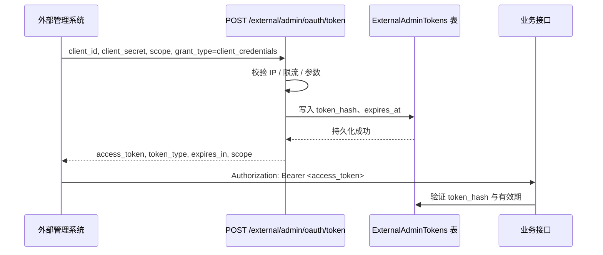

# 外部后台管理 Client Credentials 鉴权方案

> 版本：2025-11-03  
> 维护人：后端平台组  
> 关联代码：`backend/open_webui/routers/external_admin.py`

## 1. 背景与目标

外部后台管理系统需要以机器对机器（M2M）的方式访问 `/api/v1/external/admin/*` 接口，用于客户、公司及权限同步。为保证安全性与可追溯性，本方案基于 **OAuth2 Client Credentials** 流程签发短生命周期的 Bearer Token，并统一密钥、限流与审计策略。

## 2. 环境变量与代码映射

| 变量 | 说明 | 默认值 | 作用位置 |
|------|------|--------|----------|
| `EXTERNAL_ADMIN_CLIENT_ID` | 外部系统的 client_id，建议按租户自定义 | `external-admin` | `issue_oauth_token` 中校验 |
| `EXTERNAL_ADMIN_CLIENT_SECRET` | 主密钥，由密钥管理平台注入 | _无默认_ | `client_secret` 校验、审计记录 |
| `EXTERNAL_ADMIN_CLIENT_SECRET_ROLLOVER` | 轮换时期的备用密钥，可为空 | _无默认_ | 支持双密钥灰度校验 |
| `EXTERNAL_ADMIN_TOKEN_TTL_SECONDS` | Access Token 有效期（秒） | `900` | 控制 `expires_in` 与数据库过期时间 |
| `EXTERNAL_ADMIN_RATE_LIMIT_PER_MIN` | Token 接口每分钟请求上限 | `60` | `_enforce_rate_limit` 中限流 |
| `EXTERNAL_ADMIN_IP_WHITELIST` | 允许访问的源 IP，逗号分隔 | 空字符串（不限制） | `verify_external_request` 中校验 |
| `EXTERNAL_ADMIN_ALLOWED_SCOPES` | 允许下发的 scope 列表，空格分隔 | `customers:read customers:write` | scope 校验与响应写回 |
| `EXTERNAL_ADMIN_AUTH_BYPASS` | 是否跳过鉴权（true 表示全开放，仅限临时联调） | `true`（当前开放，生产需设为 `false`） | `verify_external_request` 中短路放行 |

> **注意**：所有密钥禁止写入仓库或日志，生产环境必须通过 Vault / Secret Manager 等平台注入。

## 3. 鉴权流程概览



### 3.1 获取 Token 示例

```bash
curl -X POST https://<api-host>/api/v1/external/admin/oauth/token \
  -H "Content-Type: application/json" \
  -d '{
    "grant_type": "client_credentials",
    "client_id": "external-admin",
    "client_secret": "<server-managed-secret>",
    "scope": "customers:read customers:write"
  }'
```

### 3.2 成功响应

```json
{
  "access_token": "<opaque-token>",
  "token_type": "bearer",
  "expires_in": 900,
  "scope": "customers:read customers:write"
}
```

### 3.3 临时开放模式（仅限联调阶段）

- 设置环境变量 `EXTERNAL_ADMIN_AUTH_BYPASS=true` 后，`verify_external_request` 将跳过 IP 白名单与 Token 校验，所有 /external/admin/* 接口无鉴权开放。
- 仅用于短期联调或紧急应急场景，开放期间需收紧网络入口并开启访问审计。
- 联调完成后将该变量设置为 `false`（或删除），重启服务即可恢复原鉴权流程。
- 建议在开放窗口内关注用户/公司写操作与异常调用，必要时增加限流。

## 4. 错误码定义

| HTTP 状态 | error | 触发条件 | 处理建议 |
|-----------|-------|----------|----------|
| 400 | `invalid_grant` | `grant_type` 非 `client_credentials` 或缺失 | 修正请求参数 |
| 400 | `invalid_scope` | 请求 scope 不在允许列表内 | 核对 `EXTERNAL_ADMIN_ALLOWED_SCOPES` 配置 |
| 401 | `invalid_client` | `client_id` / `client_secret` 校验失败 | 检查密钥是否正确、是否过期 |
| 401 | `invalid_token` | 访问业务接口时 Token 缺失或失效 | 重新获取 Token |
| 403 | `ip_not_allowed` | 源 IP 不在白名单中 | 更新 `EXTERNAL_ADMIN_IP_WHITELIST` |
| 429 | `rate_limited` | 触发每分钟请求上限 | 等待后重试或申请提升限额 |
| 503 | `client_secret_not_configured` | 服务端未注入密钥 | 检查部署配置 |
| 500 | `token_issue_failed` | 数据库写入失败等异常 | 查看日志排查具体原因 |

## 5. 生命周期管理

1. **Token 签发**：只返回一次明文 `access_token`，数据库仅持久化 SHA-256 哈希与有效期。  
2. **刷新策略**：外部系统应在 `expires_in` 的 80% 时提前刷新，避免因过期触发 401。  
3. **密钥轮换**：默认每 90 天轮换一次 `client_secret`，流程如下：  
   - 在密钥管理平台新增 `EXTERNAL_ADMIN_CLIENT_SECRET_ROLLOVER`。  
   - 服务端同时接受新旧密钥，等待外部系统切换。  
   - 切换完成后清除旧密钥，并移除回滚变量。  
4. **数据清理**：通过定时任务或运维脚本调用 `ExternalAdminTokens.cleanup_expired()`，避免历史记录膨胀。  
5. **告警监控**：关注密钥缺失、限流、异常状态码及审计日志，必要时接入企业监控平台。

## 6. 安全与审计要求

- **密钥存储**：必须使用 Vault/Secret Manager 等平台；仓库、工单、IM 中出现明文密钥视为高危事件。  
- **网络控制**：生产环境强制配置 IP 白名单，可叠加 WAF、反向代理的 mTLS / 签名校验。  
- **速率限制**：默认 60 req/min，可结合 Nginx/Envoy 对 `client_id` 与 IP 做并发限制（建议 50 并发）。  
- **审计记录**：`issue_oauth_token` 会记录 `client_id`、scope、TraceId 等信息，支持安全与合规追溯。  
- **密钥泄露应急**：立即吊销相关 Token、替换密钥、通知集成方，并追踪异常 IP / 请求来源。

## 7. 验证清单（DoD）

- [ ] `.env` / `.env.example` 已配置上表变量并纳入部署模板。  
- [ ] `/external/admin/oauth/token` 在 200 路径下写入 `ExternalAdminTokens`，且 scope / TTL 符合预期。  
- [ ] 针对 401 / 403 / 429 / 503 等分支编写集成或沙箱用例。  
- [ ] CI/CD 流水线验证密钥注入与定时清理任务。  
- [ ] `PROJECTWIKI.md` 外部系统章节链接至本方案，保持信息同步。  
- [ ] 若启用了 `EXTERNAL_ADMIN_AUTH_BYPASS`，需记录开放窗口并在恢复时验证鉴权流程已重新生效。
- [ ] 安全团队确认密钥轮换频率与告警阈值。

## 8. 对外使用手册

### 8.1 接入前准备

1. 获取专属 `client_id` 与 `client_secret`（如存在轮换计划，会额外分配 `client_secret_rollover`）。  
2. 提供固定出口 IP，加入 `EXTERNAL_ADMIN_IP_WHITELIST`。  
3. 确认所需业务权限，对应 scope（例如 `customers:read customers:write`）。  
4. 建议在调用方实现本地缓存与自动刷新逻辑，并妥善加密存储密钥。

### 8.2 获取 Token

1. 构造 POST 请求至 `/api/v1/external/admin/oauth/token`，`grant_type` 固定为 `client_credentials`。  
2. 请求体需包含 `client_id`、`client_secret`、`scope`；Header `Content-Type: application/json`。  
3. 成功获取 `access_token` 与 `expires_in` 后，将其安全缓存，并记录过期时间（可按 `expires_in * 0.8` 提前刷新）。

### 8.3 调用业务接口

1. 在每个业务请求中附加 `Authorization: Bearer <access_token>`。  
2. 接口返回 401 时，优先检查 Token 是否过期或 scope 是否缺失；403 则检查 IP 白名单。  
3. 反复触发 429 说明超出限流，可延迟重试或联系平台调整限额。

### 8.4 轮换与回退

1. 平台将提前通知新的 `client_secret_rollover`，调用方需在约定窗口内完成切换。  
2. 切换期间允许使用任意一个密钥；切换完成后删除旧密钥，并回收相关凭据。  
3. 若轮换过程出现异常，可短期回退至旧密钥，但需及时告知平台并安排再次切换。

### 8.5 常见问题排查

| 现象 | 可能原因 | 处理建议 |
|------|----------|----------|
| 401 `invalid_client` | 密钥错误 / 已过期 | 核对密钥或等待轮换通知 |
| 401 `invalid_token` | Token 过期或格式错误 | 重新获取 Token，并检查 Header 拼写 |
| 403 `ip_not_allowed` | 出口 IP 变化 | 更新白名单或通过 VPN 固定出口 |
| 429 `rate_limited` | 单位时间请求超限 | 提前重试机制、优化批量任务或申请提升限额 |
| 503 `client_secret_not_configured` | 平台未注入密钥 | 联系平台运维确认配置 |

## 9. 关联文档

- `PROJECTWIKI.md`：「外部系统集成」章节  
- `docs/500-599_后端设计/模块设计/573-外部后台管理系统对接方案.md`  
- `docs/500-599_后端设计/模块设计/574-外部后台管理系统对接测试方案.md`
