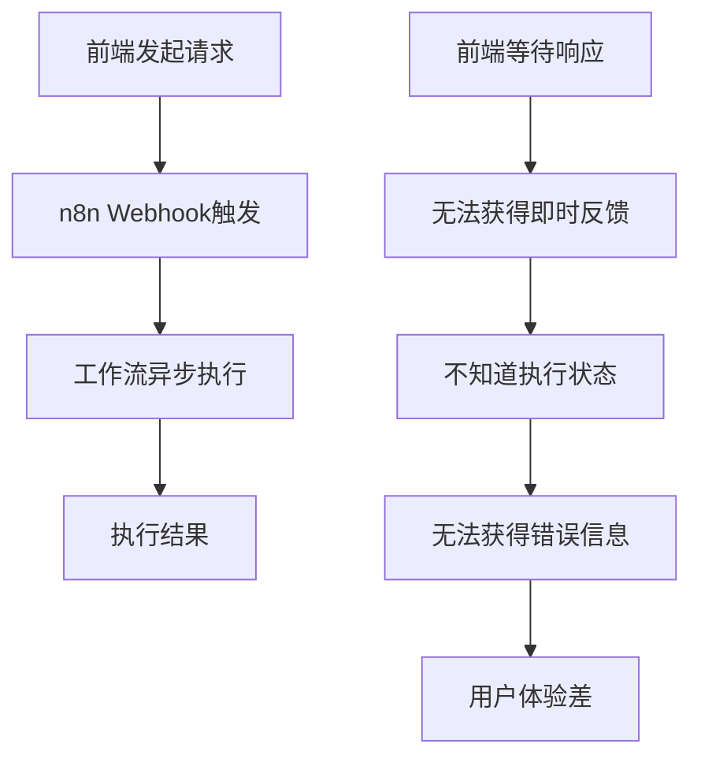
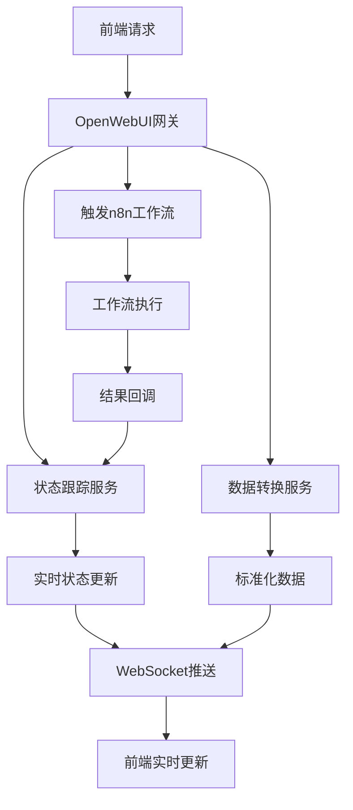

# OpenWebUI网关扩展技术方案

**版本**: v1.0.0  
**更新日期**: 2025-08-25  
**基于**: 系统架构设计_v3.0.0.md  
**适用范围**: 产品/设计/前后端/测试  
**编写人**: 技术架构组  

## 版本修订记录

| 版本 | 日期 | 修订内容 | 修订人 |
|------|------|----------|--------|
| v1.0.0 | 2025-08-24 | 初始版本，定义OpenWebUI网关扩展架构，解决n8n Webhook设计缺陷 | 技术架构组 |  

## 1. 解决Webhook设计缺陷

### 1.1 现有问题分析


### 1.2 OpenWebUI网关解决方案


## 2. OpenWebUI扩展架构设计

### 2.1 核心模块设计
| 模块名称 | 职责 | 实现方式 | 技术要求 |
|----------|------|----------|----------|
| **请求代理** | 接收前端请求，代理调用n8n | FastAPI路由 | 异步处理 |
| **状态跟踪** | 跟踪工作流执行状态 | Redis + 定时任务 | 实时性 |
| **数据转换** | 处理n8n数据结构问题 | Python数据处理 | 容错性强 |
| **WebSocket服务** | 实时推送状态给前端 | FastAPI WebSocket | 低延迟 |
| **错误处理** | 统一异常处理和用户提示 | 中间件 | 用户友好 |

### 2.2 文件结构设计
```
backend/
├── app/
│   ├── api/
│   │   ├── workflow/          # 工作流相关API
│   │   │   ├── router.py      # 路由定义
│   │   │   ├── proxy.py       # n8n代理服务
│   │   │   └── status.py      # 状态跟踪
│   │   └── websocket/         # WebSocket服务
│   │       └── workflow_ws.py # 工作流状态推送
│   ├── services/
│   │   ├── workflow_service.py    # 工作流服务层
│   │   ├── data_transformer.py   # 数据转换服务
│   │   └── status_tracker.py     # 状态跟踪服务
│   └── models/
│       ├── workflow.py        # 工作流数据模型
│       └── task.py           # 任务数据模型
```

## 3. 核心功能实现

### 3.1 工作流代理服务
```python
# app/api/workflow/proxy.py
from fastapi import APIRouter, HTTPException, BackgroundTasks
from app.services.workflow_service import WorkflowService
from app.services.status_tracker import StatusTracker

router = APIRouter()

@router.post("/workflow/{workflow_type}/execute")
async def execute_workflow(
    workflow_type: str,
    data: dict,
    background_tasks: BackgroundTasks
):
    """
    代理执行n8n工作流
    
    Args:
        workflow_type: 工作流类型 (video_compose, info_collect, etc.)
        data: 前端传入的数据
        background_tasks: 后台任务
    
    Returns:
        {
            "task_id": "唯一任务ID",
            "status": "running",
            "message": "工作流已启动"
        }
    """
    try:
        # 1. 生成唯一任务ID
        task_id = await WorkflowService.generate_task_id()
        
        # 2. 初始化任务状态
        await StatusTracker.init_task(task_id, workflow_type, data)
        
        # 3. 后台异步执行工作流
        background_tasks.add_task(
            WorkflowService.execute_async,
            task_id, workflow_type, data
        )
        
        return {
            "task_id": task_id,
            "status": "running",
            "message": f"{workflow_type} 工作流已启动",
            "websocket_url": f"/ws/workflow/{task_id}"
        }
        
    except Exception as e:
        raise HTTPException(status_code=500, detail=str(e))

@router.get("/workflow/{task_id}/status")
async def get_workflow_status(task_id: str):
    """获取工作流执行状态"""
    status = await StatusTracker.get_status(task_id)
    if not status:
        raise HTTPException(status_code=404, detail="任务不存在")
    return status
```

### 3.2 数据转换服务
```python
# app/services/data_transformer.py
import json
from typing import Dict, Any, Optional
from app.core.logger import logger

class DataTransformer:
    """n8n数据转换服务"""
    
    # 转换规则配置
    TRANSFORM_RULES = {
        "video_compose": {
            "video_url": {
                "source_path": "data.video.output.url",
                "target_path": "videoInfo.downloadUrl",
                "required": True,
                "validator": "validate_url"
            },
            "video_duration": {
                "source_path": "data.video.metadata.duration",
                "target_path": "videoInfo.duration",
                "required": False,
                "default_value": 0,
                "transformer": "format_duration"
            },
            "video_size": {
                "source_path": "data.video.metadata.size",
                "target_path": "videoInfo.fileSize",
                "required": False,
                "transformer": "format_file_size"
            }
        },
        "info_collect": {
            "user_input": {
                "source_path": "data.user.input",
                "target_path": "userInfo.input",
                "required": True
            },
            "ai_analysis": {
                "source_path": "data.ai.analysis",
                "target_path": "analysis.result",
                "required": True,
                "transformer": "format_analysis"
            },
            "strategies": {
                "source_path": "data.strategies",
                "target_path": "recommendations.strategies",
                "required": False,
                "default_value": []
            }
        }
    }
    
    @classmethod
    async def transform_workflow_data(
        cls, 
        workflow_type: str, 
        raw_data: Dict[str, Any]
    ) -> Dict[str, Any]:
        """
        转换n8n工作流数据
        
        Args:
            workflow_type: 工作流类型
            raw_data: n8n原始数据
            
        Returns:
            转换后的标准化数据
        """
        try:
            rules = cls.TRANSFORM_RULES.get(workflow_type, {})
            transformed_data = {}
            errors = []
            warnings = []
            
            for field_name, rule in rules.items():
                try:
                    # 提取源数据
                    value = cls._extract_value(raw_data, rule["source_path"])
                    
                    if value is None:
                        if rule.get("required", False):
                            errors.append(f"必填字段 {field_name} 缺失")
                            continue
                        else:
                            value = rule.get("default_value")
                            if value is not None:
                                warnings.append(f"字段 {field_name} 使用默认值")
                    
                    # 数据转换
                    if rule.get("transformer"):
                        transformer = getattr(cls, rule["transformer"], None)
                        if transformer:
                            value = transformer(value)
                    
                    # 数据验证
                    if rule.get("validator"):
                        validator = getattr(cls, rule["validator"], None)
                        if validator and not validator(value):
                            errors.append(f"字段 {field_name} 验证失败")
                            continue
                    
                    # 设置目标路径
                    cls._set_value(transformed_data, rule["target_path"], value)
                    
                except Exception as e:
                    errors.append(f"处理字段 {field_name} 时出错: {str(e)}")
            
            # 返回转换结果
            result = {
                "success": len(errors) == 0,
                "data": transformed_data,
                "errors": errors,
                "warnings": warnings,
                "original_data": raw_data if len(errors) > 0 else None
            }
            
            logger.info(f"数据转换完成: {workflow_type}, 成功: {result['success']}")
            return result
            
        except Exception as e:
            logger.error(f"数据转换失败: {workflow_type}, 错误: {str(e)}")
            return {
                "success": False,
                "data": {},
                "errors": [f"转换过程出错: {str(e)}"],
                "warnings": [],
                "original_data": raw_data
            }
    
    @staticmethod
    def _extract_value(data: Dict[str, Any], path: str) -> Any:
        """从嵌套字典中提取值"""
        try:
            keys = path.split('.')
            value = data
            for key in keys:
                if isinstance(value, dict) and key in value:
                    value = value[key]
                else:
                    return None
            return value
        except:
            return None
    
    @staticmethod
    def _set_value(data: Dict[str, Any], path: str, value: Any):
        """在嵌套字典中设置值"""
        keys = path.split('.')
        current = data
        for key in keys[:-1]:
            if key not in current:
                current[key] = {}
            current = current[key]
        current[keys[-1]] = value
    
    @staticmethod
    def validate_url(url: str) -> bool:
        """验证URL格式"""
        import re
        url_pattern = re.compile(
            r'^https?://'  # http:// or https://
            r'(?:(?:[A-Z0-9](?:[A-Z0-9-]{0,61}[A-Z0-9])?\.)+[A-Z]{2,6}\.?|'  # domain...
            r'localhost|'  # localhost...
            r'\d{1,3}\.\d{1,3}\.\d{1,3}\.\d{1,3})'  # ...or ip
            r'(?::\d+)?'  # optional port
            r'(?:/?|[/?]\S+)$', re.IGNORECASE)
        return url_pattern.match(url) is not None
    
    @staticmethod
    def format_duration(seconds: Any) -> int:
        """格式化时长为整数秒"""
        try:
            return int(float(seconds))
        except:
            return 0
    
    @staticmethod
    def format_file_size(size: Any) -> int:
        """格式化文件大小为字节"""
        try:
            return int(size)
        except:
            return 0
    
    @staticmethod
    def format_analysis(analysis: Any) -> Dict[str, Any]:
        """格式化AI分析结果"""
        if isinstance(analysis, dict):
            return {
                "content": analysis.get("content", ""),
                "confidence": float(analysis.get("confidence", 0.0)),
                "suggestions": analysis.get("suggestions", [])
            }
        return {"content": str(analysis), "confidence": 0.0, "suggestions": []}
```

### 3.3 状态跟踪服务
```python
# app/services/status_tracker.py
import asyncio
import json
from datetime import datetime, timedelta
from typing import Dict, Any, Optional
import redis.asyncio as redis
from app.core.config import settings
from app.core.logger import logger

class StatusTracker:
    """工作流状态跟踪服务"""
    
    def __init__(self):
        self.redis = redis.from_url(settings.REDIS_URL)
        self.status_prefix = "workflow:status:"
        self.result_prefix = "workflow:result:"
        self.ttl = 86400  # 24小时过期
    
    async def init_task(self, task_id: str, workflow_type: str, input_data: Dict[str, Any]):
        """初始化任务状态"""
        status = {
            "task_id": task_id,
            "workflow_type": workflow_type,
            "status": "running",
            "progress": 0,
            "message": "工作流启动中...",
            "created_at": datetime.now().isoformat(),
            "updated_at": datetime.now().isoformat(),
            "input_data": input_data,
            "steps": []
        }
        
        await self.redis.setex(
            f"{self.status_prefix}{task_id}",
            self.ttl,
            json.dumps(status)
        )
        
        logger.info(f"任务状态初始化: {task_id}")
    
    async def update_status(
        self, 
        task_id: str, 
        status: str = None,
        progress: int = None,
        message: str = None,
        step_info: Dict[str, Any] = None
    ):
        """更新任务状态"""
        current_status = await self.get_status(task_id)
        if not current_status:
            logger.warning(f"尝试更新不存在的任务: {task_id}")
            return False
        
        # 更新字段
        if status:
            current_status["status"] = status
        if progress is not None:
            current_status["progress"] = min(100, max(0, progress))
        if message:
            current_status["message"] = message
        if step_info:
            current_status["steps"].append({
                **step_info,
                "timestamp": datetime.now().isoformat()
            })
        
        current_status["updated_at"] = datetime.now().isoformat()
        
        await self.redis.setex(
            f"{self.status_prefix}{task_id}",
            self.ttl,
            json.dumps(current_status)
        )
        
        # 通知WebSocket客户端
        await self._notify_websocket_clients(task_id, current_status)
        
        logger.info(f"任务状态更新: {task_id}, 状态: {status}, 进度: {progress}%")
        return True
    
    async def complete_task(
        self, 
        task_id: str, 
        result_data: Dict[str, Any],
        success: bool = True
    ):
        """完成任务"""
        status = "completed" if success else "failed"
        progress = 100 if success else None
        message = "工作流执行完成" if success else "工作流执行失败"
        
        # 更新状态
        await self.update_status(task_id, status, progress, message)
        
        # 保存结果
        await self.redis.setex(
            f"{self.result_prefix}{task_id}",
            self.ttl,
            json.dumps(result_data)
        )
        
        logger.info(f"任务完成: {task_id}, 成功: {success}")
    
    async def get_status(self, task_id: str) -> Optional[Dict[str, Any]]:
        """获取任务状态"""
        data = await self.redis.get(f"{self.status_prefix}{task_id}")
        if data:
            return json.loads(data)
        return None
    
    async def get_result(self, task_id: str) -> Optional[Dict[str, Any]]:
        """获取任务结果"""
        data = await self.redis.get(f"{self.result_prefix}{task_id}")
        if data:
            return json.loads(data)
        return None
    
    async def _notify_websocket_clients(self, task_id: str, status_data: Dict[str, Any]):
        """通知WebSocket客户端"""
        # 这里需要与WebSocket管理器集成
        from app.api.websocket.workflow_ws import WebSocketManager
        await WebSocketManager.broadcast_to_task(task_id, {
            "type": "status_update",
            "data": status_data
        })

# 全局实例
status_tracker = StatusTracker()
```

## 4. WebSocket实时通信

### 4.1 WebSocket管理器
```python
# app/api/websocket/workflow_ws.py
from fastapi import WebSocket, WebSocketDisconnect
from typing import Dict, List
import json
import asyncio
from app.core.logger import logger

class WebSocketManager:
    """WebSocket连接管理器"""
    
    def __init__(self):
        # 存储活跃连接: {task_id: [websocket1, websocket2, ...]}
        self.active_connections: Dict[str, List[WebSocket]] = {}
    
    async def connect(self, websocket: WebSocket, task_id: str):
        """建立WebSocket连接"""
        await websocket.accept()
        
        if task_id not in self.active_connections:
            self.active_connections[task_id] = []
        
        self.active_connections[task_id].append(websocket)
        logger.info(f"WebSocket连接建立: {task_id}, 当前连接数: {len(self.active_connections[task_id])}")
    
    def disconnect(self, websocket: WebSocket, task_id: str):
        """断开WebSocket连接"""
        if task_id in self.active_connections:
            if websocket in self.active_connections[task_id]:
                self.active_connections[task_id].remove(websocket)
            
            # 如果没有连接了，清理key
            if not self.active_connections[task_id]:
                del self.active_connections[task_id]
        
        logger.info(f"WebSocket连接断开: {task_id}")
    
    async def send_personal_message(self, message: dict, websocket: WebSocket):
        """发送个人消息"""
        try:
            await websocket.send_text(json.dumps(message))
        except Exception as e:
            logger.error(f"发送WebSocket消息失败: {e}")
    
    async def broadcast_to_task(self, task_id: str, message: dict):
        """向特定任务的所有连接广播消息"""
        if task_id not in self.active_connections:
            return
        
        disconnected = []
        for websocket in self.active_connections[task_id]:
            try:
                await websocket.send_text(json.dumps(message))
            except Exception as e:
                logger.error(f"广播消息失败: {e}")
                disconnected.append(websocket)
        
        # 清理断开的连接
        for websocket in disconnected:
            self.disconnect(websocket, task_id)

# 全局实例
websocket_manager = WebSocketManager()

# WebSocket路由
from fastapi import APIRouter
router = APIRouter()

@router.websocket("/ws/workflow/{task_id}")
async def workflow_websocket_endpoint(websocket: WebSocket, task_id: str):
    """工作流状态WebSocket端点"""
    await websocket_manager.connect(websocket, task_id)
    
    try:
        # 发送当前状态
        from app.services.status_tracker import status_tracker
        current_status = await status_tracker.get_status(task_id)
        if current_status:
            await websocket_manager.send_personal_message({
                "type": "status_update",
                "data": current_status
            }, websocket)
        
        # 保持连接
        while True:
            data = await websocket.receive_text()
            # 处理客户端消息（如果需要）
            message = json.loads(data)
            if message.get("type") == "ping":
                await websocket_manager.send_personal_message({
                    "type": "pong"
                }, websocket)
    
    except WebSocketDisconnect:
        websocket_manager.disconnect(websocket, task_id)
    except Exception as e:
        logger.error(f"WebSocket错误: {e}")
        websocket_manager.disconnect(websocket, task_id)
```

## 5. 开发时间重新安排

### 5.1 时间节省分析
| 原计划 | 调整后 | 节省时间 | 说明 |
|--------|--------|----------|------|
| Golang中台开发 8天 | OpenWebUI扩展 4天 | 4天 | 复用现有框架 |
| 独立部署配置 2天 | 集成部署 0.5天 | 1.5天 | 复用现有环境 |
| 接口设计开发 3天 | 扩展现有接口 1.5天 | 1.5天 | 基于现有架构 |
| **总计节省** | | **7天** | |

### 5.2 优化后的里程碑安排
| 里程碑 | 原时间 | 优化后 | 提前天数 | 主要任务 |
|--------|--------|--------|----------|----------|
| M1 | 8/23-8/28 | 8/23-8/26 | 2天 | 基础设施+网关设计 |
| M2 | 8/29-9/3 | 8/27-9/1 | 2天 | 核心功能+网关实现 |
| M3 | 9/4-9/9 | 9/2-9/6 | 2天 | AI功能+深度集成 |
| M4 | 9/10-9/15 | 9/7-9/11 | 3天 | 素材管理+优化 |
| M5 | 9/16-9/21 | 9/12-9/16 | 4天 | 测试+上线准备 |

### 5.3 OpenWebUI扩展开发任务
| 任务 | 工期 | 负责人 | 交付物 | 验收标准 |
|------|------|--------|--------|----------|
| 网关架构设计 | 0.5天 | 后端开发 | 架构文档+接口规范 | 方案评审通过 |
| 工作流代理服务 | 1天 | 后端开发 | 代理API+状态跟踪 | 可成功调用n8n |
| 数据转换服务 | 1天 | 后端开发 | 转换引擎+规则配置 | 转换准确率>95% |
| WebSocket服务 | 1天 | 后端开发 | 实时推送服务 | 状态可实时推送 |
| 集成测试 | 0.5天 | 全员 | 端到端测试 | 完整流程可用 |

## 6. 技术优势总结

### 6.1 架构优势
- ✅ **复用现有框架**: 基于OpenWebUI，减少重复开发
- ✅ **技术栈统一**: FastAPI技术栈，降低维护成本
- ✅ **部署简化**: 无需额外的中台服务部署
- ✅ **开发效率**: 节省7天开发时间

### 6.2 功能优势
- ✅ **解决Webhook缺陷**: 实现双向通信和状态跟踪
- ✅ **数据处理统一**: 统一处理n8n数据结构问题
- ✅ **实时性提升**: WebSocket实时推送状态更新
- ✅ **用户体验改善**: 即时反馈和进度显示

### 6.3 运维优势
- ✅ **监控集成**: 复用现有监控体系
- ✅ **日志统一**: 统一的日志管理
- ✅ **错误处理**: 一体化的错误处理机制
- ✅ **扩展性好**: 易于后续功能扩展

---

**文档维护**: 技术架构组  
**更新频率**: 开发过程中持续更新  
**关联文档**: 项目整合开发计划_v1.1_优化版.md  
**审核状态**: 待审核