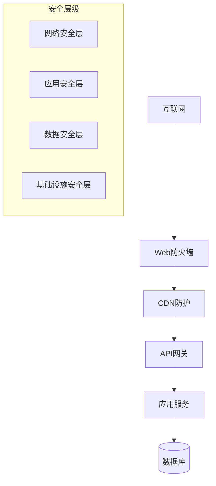

# 安全与部署方案

**版本**: v2.1.0  
**更新日期**: 2025-08-24  
**基于**: 系统架构设计_v3.0.0.md  
**适用范围**: 产品/设计/前后端/测试  
**编写人**: 安全架构师  

## 版本修订记录

| 版本 | 日期 | 修改内容 | 修改人 |
|------|------|----------|--------|
| v2.1.0 | 2025-08-24 | 统一版本号格式为三段版本号，添加版本修订记录 | 系统整理 |
| v2.1 | 2025-08-22 | 增加Kubernetes部署配置，完善安全策略 | DevOps工程师 |
| v2.0 | 2025-08-19 | 重新设计安全架构，增加容器化部署 | 安全架构师 |
| v1.0 | 2025-08-16 | 初始版本，定义基础安全与部署方案 | 安全架构师 |  

## 1. 安全架构

### 1.1 分层安全模型



### 1.2 核心安全策略

| 安全域 | 安全措施 | 技术实现 |
|--------|----------|----------|
| 网络安全 | 防火墙、DDoS防护、WAF | CloudFlare + 阿里云安全组 |
| 应用安全 | 身份认证、权限控制、API安全 | JWT + RBAC + 限流 |
| 数据安全 | 加密传输、加密存储、备份 | TLS + AES-256 + 定期备份 |
| 运维安全 | 访问审计、监控告警、漏洞管理 | 日志审计 + 安全扫描 |

## 2. 身份认证与授权

### 2.1 JWT认证流程

```typescript
// JWT Token结构
interface JWTPayload {
  sub: string;      // 用户ID
  role: string;     // 用户角色
  permissions: string[]; // 权限列表
  companyId: string;     // 企业ID
  iat: number;      // 签发时间
  exp: number;      // 过期时间
}

// 认证中间件
const authenticateJWT = (req: Request, res: Response, next: NextFunction) => {
  const token = req.header('Authorization')?.replace('Bearer ', '');
  
  if (!token) {
    return res.status(401).json({ error: 'Access token required' });
  }
  
  try {
    const decoded = jwt.verify(token, process.env.JWT_SECRET!) as JWTPayload;
    req.user = decoded;
    next();
  } catch (error) {
    return res.status(403).json({ error: 'Invalid token' });
  }
};
```

### 2.2 权限控制 (RBAC)

```typescript
// 权限检查
const requirePermission = (permission: string) => {
  return (req: Request, res: Response, next: NextFunction) => {
    if (!req.user?.permissions.includes(permission)) {
      return res.status(403).json({ error: 'Insufficient permissions' });
    }
    next();
  };
};

// 使用示例
app.get('/api/admin/*', authenticateJWT, requirePermission('admin:read'));
app.post('/api/materials/upload', authenticateJWT, requirePermission('material:create'));
```

## 3. 数据安全

### 3.1 数据加密

```typescript
// 敏感数据加密
class EncryptionService {
  private readonly algorithm = 'aes-256-gcm';
  
  encrypt(text: string): string {
    const iv = crypto.randomBytes(16);
    const cipher = crypto.createCipher(this.algorithm, process.env.ENCRYPTION_KEY!);
    
    let encrypted = cipher.update(text, 'utf8', 'hex');
    encrypted += cipher.final('hex');
    
    return iv.toString('hex') + ':' + encrypted;
  }
  
  decrypt(encryptedText: string): string {
    const [ivHex, encrypted] = encryptedText.split(':');
    const iv = Buffer.from(ivHex, 'hex');
    const decipher = crypto.createDecipher(this.algorithm, process.env.ENCRYPTION_KEY!);
    
    let decrypted = decipher.update(encrypted, 'hex', 'utf8');
    decrypted += decipher.final('utf8');
    
    return decrypted;
  }
}
```

### 3.2 数据库安全

```sql
-- 数据库用户权限配置
CREATE USER hsai_app WITH PASSWORD 'strong_password';
GRANT CONNECT ON DATABASE hsai_production TO hsai_app;
GRANT USAGE ON SCHEMA public TO hsai_app;
GRANT SELECT, INSERT, UPDATE, DELETE ON ALL TABLES IN SCHEMA public TO hsai_app;

-- 只读用户
CREATE USER hsai_readonly WITH PASSWORD 'readonly_password';
GRANT CONNECT ON DATABASE hsai_production TO hsai_readonly;
GRANT USAGE ON SCHEMA public TO hsai_readonly;
GRANT SELECT ON ALL TABLES IN SCHEMA public TO hsai_readonly;
```

## 4. 部署架构

### 4.1 容器化部署

```yaml
# docker-compose.yml
version: '3.8'

services:
  # 前端服务
  frontend:
    build: ./frontend
    ports:
      - "80:80"
    environment:
      - NODE_ENV=production
    restart: unless-stopped
    
  # 后端API服务
  backend:
    build: ./backend
    ports:
      - "3000:3000"
    environment:
      - NODE_ENV=production
      - DB_HOST=postgres
      - REDIS_HOST=redis
    depends_on:
      - postgres
      - redis
    restart: unless-stopped
    
  # 数据库
  postgres:
    image: postgres:14
    environment:
      - POSTGRES_DB=hsai_production
      - POSTGRES_USER=hsai_user
      - POSTGRES_PASSWORD=${DB_PASSWORD}
    volumes:
      - postgres_data:/var/lib/postgresql/data
    restart: unless-stopped
    
  # 缓存
  redis:
    image: redis:7-alpine
    command: redis-server --requirepass ${REDIS_PASSWORD}
    restart: unless-stopped
    
  # n8n工作流
  n8n:
    image: n8nio/n8n:latest
    ports:
      - "5678:5678"
    environment:
      - N8N_HOST=${N8N_HOST}
      - DB_TYPE=postgresdb
      - DB_POSTGRESDB_HOST=postgres
    depends_on:
      - postgres
    restart: unless-stopped

volumes:
  postgres_data:
```

### 4.2 Kubernetes部署

```yaml
# k8s-deployment.yaml
apiVersion: apps/v1
kind: Deployment
metadata:
  name: hsai-backend
spec:
  replicas: 3
  selector:
    matchLabels:
      app: hsai-backend
  template:
    metadata:
      labels:
        app: hsai-backend
    spec:
      containers:
      - name: backend
        image: hsai/backend:latest
        ports:
        - containerPort: 3000
        env:
        - name: NODE_ENV
          value: "production"
        - name: DB_HOST
          valueFrom:
            secretKeyRef:
              name: hsai-secrets
              key: db-host
        resources:
          requests:
            memory: "256Mi"
            cpu: "200m"
          limits:
            memory: "512Mi"
            cpu: "500m"
        livenessProbe:
          httpGet:
            path: /health
            port: 3000
          initialDelaySeconds: 30
          periodSeconds: 10
        readinessProbe:
          httpGet:
            path: /ready
            port: 3000
          initialDelaySeconds: 5
          periodSeconds: 5

---
apiVersion: v1
kind: Service
metadata:
  name: hsai-backend-service
spec:
  selector:
    app: hsai-backend
  ports:
  - port: 80
    targetPort: 3000
  type: ClusterIP
```

## 5. 网络安全

### 5.1 HTTPS配置

```nginx
# nginx SSL配置
server {
    listen 443 ssl http2;
    server_name api.hsai.com;
    
    ssl_certificate /etc/ssl/certs/hsai.crt;
    ssl_certificate_key /etc/ssl/private/hsai.key;
    
    ssl_protocols TLSv1.2 TLSv1.3;
    ssl_ciphers ECDHE-RSA-AES256-GCM-SHA512:DHE-RSA-AES256-GCM-SHA512;
    ssl_prefer_server_ciphers off;
    
    # 安全头
    add_header Strict-Transport-Security "max-age=63072000" always;
    add_header X-Frame-Options DENY;
    add_header X-Content-Type-Options nosniff;
    add_header X-XSS-Protection "1; mode=block";
    
    location / {
        proxy_pass http://backend;
        proxy_set_header Host $host;
        proxy_set_header X-Real-IP $remote_addr;
        proxy_set_header X-Forwarded-For $proxy_add_x_forwarded_for;
        proxy_set_header X-Forwarded-Proto $scheme;
    }
}
```

### 5.2 防火墙规则

```bash
#!/bin/bash
# 防火墙配置脚本

# 清空现有规则
iptables -F

# 默认策略
iptables -P INPUT DROP
iptables -P FORWARD DROP
iptables -P OUTPUT ACCEPT

# 允许本地环回
iptables -A INPUT -i lo -j ACCEPT

# 允许已建立的连接
iptables -A INPUT -m state --state ESTABLISHED,RELATED -j ACCEPT

# 允许SSH (限制IP)
iptables -A INPUT -p tcp --dport 22 -s 管理员IP -j ACCEPT

# 允许HTTP/HTTPS
iptables -A INPUT -p tcp --dport 80 -j ACCEPT
iptables -A INPUT -p tcp --dport 443 -j ACCEPT

# 保存规则
iptables-save > /etc/iptables/rules.v4
```

## 6. 监控与日志

### 6.1 安全监控

```typescript
// 安全事件监控
class SecurityMonitor {
  // 异常登录检测
  async detectAnomalousLogin(loginAttempt: LoginAttempt) {
    const user = await this.userService.getUser(loginAttempt.userId);
    const recentLogins = await this.getRecentLogins(user.id, 24); // 24小时内
    
    // 检查异常条件
    const anomalies = [];
    
    // 地理位置异常
    if (this.isLocationAnomalous(loginAttempt.location, recentLogins)) {
      anomalies.push('异常登录地点');
    }
    
    // 设备异常
    if (this.isDeviceAnomalous(loginAttempt.device, user.knownDevices)) {
      anomalies.push('未知设备');
    }
    
    // 时间异常
    if (this.isTimeAnomalous(loginAttempt.timestamp, user.normalHours)) {
      anomalies.push('异常登录时间');
    }
    
    if (anomalies.length > 0) {
      await this.alertSecurityTeam(user, loginAttempt, anomalies);
    }
  }
  
  // 暴力破解检测
  async detectBruteForce(ip: string, timeWindow: number = 300) {
    const attempts = await this.getFailedAttempts(ip, timeWindow);
    
    if (attempts.length > 5) {
      await this.blockIP(ip, 3600); // 封锁1小时
      await this.alertSecurityTeam(null, { ip, attempts }, ['暴力破解攻击']);
    }
  }
}
```

### 6.2 审计日志

```typescript
// 审计日志记录
interface AuditLog {
  timestamp: string;
  userId?: string;
  action: string;
  resource: string;
  result: 'success' | 'failure';
  details: any;
  ip: string;
  userAgent: string;
}

class AuditLogger {
  async log(auditData: Partial<AuditLog>) {
    const logEntry: AuditLog = {
      timestamp: new Date().toISOString(),
      userId: auditData.userId,
      action: auditData.action || 'unknown',
      resource: auditData.resource || 'unknown',
      result: auditData.result || 'success',
      details: auditData.details || {},
      ip: auditData.ip || 'unknown',
      userAgent: auditData.userAgent || 'unknown'
    };
    
    // 存储到数据库
    await this.db.auditLogs.create(logEntry);
    
    // 敏感操作实时告警
    if (this.isSensitiveAction(logEntry.action)) {
      await this.sendAlert(logEntry);
    }
  }
}
```

## 7. 备份与恢复

### 7.1 数据备份策略

```bash
#!/bin/bash
# 数据库备份脚本

DB_NAME="hsai_production"
BACKUP_DIR="/backup/postgres"
DATE=$(date +%Y%m%d_%H%M%S)

# 全量备份
pg_dump -h localhost -U hsai_user -d $DB_NAME \
  --format=custom --compress=9 --verbose \
  --file="$BACKUP_DIR/full_backup_$DATE.dump"

# 保留30天的备份
find $BACKUP_DIR -name "full_backup_*.dump" -mtime +30 -delete

# 上传到云存储
aws s3 cp "$BACKUP_DIR/full_backup_$DATE.dump" \
  s3://hsai-backups/postgres/$(date +%Y/%m/%d)/
```

### 7.2 灾难恢复

```bash
#!/bin/bash
# 灾难恢复脚本

BACKUP_FILE="$1"
DB_NAME="hsai_production"

if [ -z "$BACKUP_FILE" ]; then
  echo "请指定备份文件路径"
  exit 1
fi

# 停止应用服务
kubectl scale deployment hsai-backend --replicas=0

# 恢复数据库
dropdb $DB_NAME
createdb $DB_NAME
pg_restore -h localhost -U hsai_user -d $DB_NAME --verbose "$BACKUP_FILE"

# 重启应用服务
kubectl scale deployment hsai-backend --replicas=3

echo "数据库恢复完成"
```

## 8. 安全最佳实践

### 8.1 开发安全

- **代码审查**: 所有代码必须经过安全审查
- **依赖扫描**: 定期扫描第三方依赖漏洞
- **静态分析**: 使用SAST工具检查代码安全
- **动态测试**: 定期进行渗透测试

### 8.2 运维安全

- **最小权限**: 人员和服务只分配必要权限
- **定期更新**: 及时更新系统和依赖包
- **密钥轮换**: 定期轮换密钥和证书
- **访问审计**: 记录所有管理员操作

### 8.3 应急响应

```typescript
// 安全事件响应流程
class IncidentResponse {
  async handleSecurityIncident(incident: SecurityIncident) {
    // 1. 立即响应
    await this.immediateResponse(incident);
    
    // 2. 影响评估
    const impact = await this.assessImpact(incident);
    
    // 3. 通知相关人员
    await this.notifyStakeholders(incident, impact);
    
    // 4. 隔离威胁
    await this.containThreat(incident);
    
    // 5. 修复和恢复
    await this.remediate(incident);
    
    // 6. 事后分析
    await this.postIncidentAnalysis(incident);
  }
}
```

---

**文档维护**: 安全团队  
**审核状态**: 待审核  
**相关文档**: 系统架构设计, 运维手册