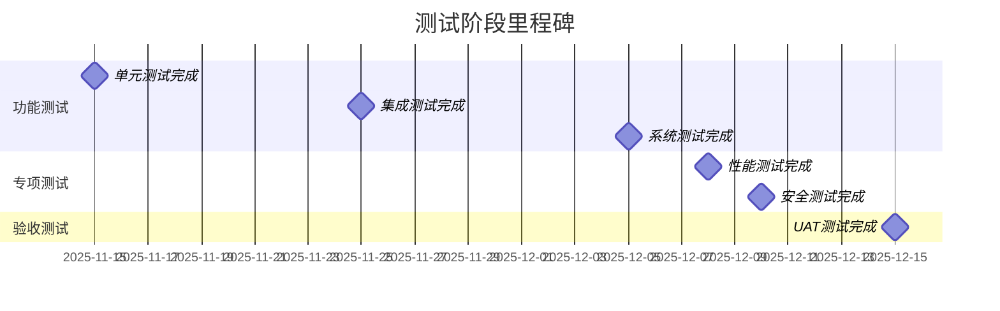

# 测试计划

**版本**: v2.0.0  
**更新日期**: 2025-08-24  
**测试周期**: 2025年11月16日 - 2025年12月15日  

## 版本修订记录

| 版本 | 日期 | 修改内容 | 修改人 |
|------|------|----------|--------|
| v2.0.0 | 2025-08-24 | 统一版本号格式为三段版本号，添加版本修订记录 | 系统整理 |
| v2.0 | 2025-08-22 | 重新设计测试策略，增加自动化测试计划 | 测试经理 |
| v1.0 | 2025-08-18 | 初始版本，定义基础测试计划和流程 | 测试经理 |  

## 1. 测试概述

### 1.1 测试目标

确保HSAI智能社媒矩阵平台满足产品需求规格说明书中的所有功能和非功能性要求，保证系统的稳定性、可用性、安全性和用户体验。

### 1.2 测试范围

**功能测试范围**:
- 用户认证与权限管理
- AI对话工作台核心功能
- 素材管理系统
- 视频制作与合成
- 社媒矩阵管理
- 工作流自动化

**非功能测试范围**:
- 性能测试
- 安全性测试
- 兼容性测试
- 可用性测试

### 1.3 测试策略

**多层次测试**: 单元测试 → 集成测试 → 系统测试 → 用户验收测试  
**自动化优先**: 自动化测试覆盖率≥70%  
**风险驱动**: 优先测试高风险和核心功能  
**持续测试**: 集成到CI/CD流程中  

## 2. 测试阶段规划

### 2.1 测试阶段时间表

| 测试阶段 | 开始日期 | 结束日期 | 负责团队 | 主要产出 |
|----------|----------|----------|----------|----------|
| 单元测试 | 2025-10-01 | 2025-11-15 | 开发团队 | 单元测试报告 |
| 集成测试 | 2025-11-16 | 2025-11-25 | 测试团队 | 集成测试报告 |
| 系统测试 | 2025-11-26 | 2025-12-05 | 测试团队 | 系统测试报告 |
| 性能测试 | 2025-12-01 | 2025-12-08 | 测试团队 | 性能测试报告 |
| 安全测试 | 2025-12-03 | 2025-12-10 | 安全团队 | 安全测试报告 |
| 用户验收测试 | 2025-12-06 | 2025-12-15 | 产品团队 | UAT测试报告 |

### 2.2 测试里程碑

## 3. 功能测试计划

### 3.1 核心功能测试

#### 3.1.1 用户认证功能

**测试用例**:
- TC001: 用户登录成功
- TC002: 用户登录失败（错误密码）
- TC003: JWT Token刷新
- TC004: 用户权限验证
- TC005: 账户锁定机制

**验收标准**:
- 登录成功率 ≥99.9%
- 权限控制100%有效
- 安全策略正确执行

#### 3.1.2 对话工作台功能

**测试用例**:
- TC010: 发送文本消息
- TC011: AI消息回复
- TC012: 卡片生成与显示
- TC013: 连线绘制与更新
- TC014: 点击联动效果
- TC015: 语音输入功能
- TC016: 文件上传功能

**验收标准**:
- 消息发送成功率 ≥99%
- AI回复时间 ≤3秒
- 连线绘制准确率 100%
- 联动响应时间 ≤500ms

#### 3.1.3 素材管理功能

**测试用例**:
- TC020: 文件上传（拖拽/点击）
- TC021: 目录创建与管理
- TC022: 文件搜索功能
- TC023: 批量操作功能
- TC024: 文件预览功能
- TC025: 权限控制功能

**验收标准**:
- 文件上传成功率 ≥98%
- 搜索响应时间 ≤2秒
- 批量操作成功率 ≥95%

#### 3.1.4 视频制作功能

**测试用例**:
- TC030: 视频脚本创建
- TC031: 素材选择与组合
- TC032: 视频合成处理
- TC033: 合成进度跟踪
- TC034: 结果文件下载

**验收标准**:
- 合成成功率 ≥95%
- 进度跟踪准确率 100%
- 合成质量符合设定参数

#### 3.1.5 矩阵管理功能

**测试用例**:
- TC040: 社媒账号绑定
- TC041: 多平台内容发布
- TC042: 定时发布功能
- TC043: 发布状态跟踪
- TC044: 数据统计与分析

**验收标准**:
- 账号绑定成功率 ≥98%
- 发布成功率 ≥97%
- 数据统计准确率 100%

### 3.2 集成测试

#### 3.2.1 模块间集成

**API集成测试**:
- 前后端API接口集成
- 第三方服务API集成
- 数据库集成测试

**数据流测试**:
- 用户数据流转测试
- 文件数据流转测试
- 业务数据一致性测试

#### 3.2.2 系统集成

**外部系统集成**:
- n8n工作流引擎集成
- 社媒平台API集成
- 文件存储服务集成
- AI服务集成

## 4. 非功能性测试

### 4.1 性能测试

#### 4.1.1 负载测试

**测试场景**:
- 并发用户数: 100/500/1000用户
- 持续时间: 30分钟/2小时/8小时
- 业务场景: 登录、对话、上传、发布

**性能指标**:
- 响应时间: P95 ≤ 3秒
- 吞吐量: ≥ 1000 TPS
- 错误率: ≤ 0.1%
- 资源利用率: CPU ≤ 80%, Memory ≤ 85%

#### 4.1.2 压力测试

**测试目标**:
- 确定系统最大承载能力
- 验证系统在高负载下的稳定性
- 测试系统恢复能力

#### 4.1.3 容量测试

**测试维度**:
- 数据存储容量测试
- 文件上传大小限制测试
- 并发连接数限制测试

### 4.2 安全测试

#### 4.2.1 认证安全测试

**测试项目**:
- 密码强度验证
- 会话管理安全
- JWT Token安全
- OAuth授权安全

#### 4.2.2 数据安全测试

**测试项目**:
- 数据传输加密
- 数据存储加密
- 敏感数据脱敏
- 文件上传安全

#### 4.2.3 漏洞扫描测试

**测试工具**:
- OWASP ZAP
- Nessus
- 代码安全扫描

### 4.3 兼容性测试

#### 4.3.1 浏览器兼容性

| 浏览器 | 版本 | 优先级 | 测试范围 |
|--------|------|--------|----------|
| Chrome | 最新3个版本 | P0 | 全功能测试 |
| Safari | 最新2个版本 | P0 | 全功能测试 |
| Firefox | 最新2个版本 | P1 | 核心功能 |
| Edge | 最新2个版本 | P1 | 核心功能 |

#### 4.3.2 设备兼容性

| 设备类型 | 屏幕尺寸 | 测试重点 |
|----------|----------|----------|
| 桌面设备 | 1920×1080, 1366×768 | 全功能测试 |
| 平板设备 | 1024×768, 768×1024 | 响应式布局 |
| 移动设备 | 375×667, 414×896 | 触摸交互 |

### 4.4 可用性测试

#### 4.4.1 易用性测试

**测试方法**:
- 用户任务完成测试
- 新用户上手测试
- 错误恢复测试

**评估指标**:
- 任务完成率 ≥ 90%
- 任务完成时间符合预期
- 用户满意度 ≥ 4.5/5

#### 4.4.2 无障碍性测试

**测试标准**: WCAG 2.1 AA级别

**测试项目**:
- 键盘导航测试
- 屏幕阅读器兼容性
- 色彩对比度测试
- 焦点管理测试

## 5. 自动化测试

### 5.1 自动化测试策略

**测试金字塔**:
- 单元测试: 70%
- 集成测试: 20%
- UI测试: 10%

### 5.2 自动化测试工具

**前端测试**:
- Jest (单元测试)
- React Testing Library (组件测试)
- Cypress (E2E测试)

**后端测试**:
- Jest (单元测试)
- Supertest (API测试)
- Docker (环境隔离)

**性能测试**:
- JMeter (负载测试)
- Lighthouse (前端性能)

### 5.3 CI/CD集成

**自动化流程**:
1. 代码提交触发自动化测试
2. 单元测试和集成测试并行执行
3. 测试通过后自动部署到测试环境
4. 执行端到端测试
5. 生成测试报告和覆盖率报告

## 6. 测试环境

### 6.1 测试环境配置

| 环境 | 用途 | 配置 | 数据 |
|------|------|------|------|
| 开发环境 | 开发调试 | 本地/Docker | 模拟数据 |
| 测试环境 | 功能测试 | K8s集群 | 测试数据 |
| 预生产环境 | 集成测试 | 生产同配置 | 脱敏生产数据 |
| 性能环境 | 性能测试 | 独立高配置 | 批量测试数据 |

### 6.2 测试数据管理

**数据类型**:
- 用户测试数据
- 文件测试数据
- 业务测试数据
- 边界测试数据

**数据策略**:
- 数据脱敏处理
- 数据版本管理
- 数据自动生成
- 数据清理机制

## 7. 风险与应对

### 7.1 测试风险

| 风险项 | 风险等级 | 影响 | 应对措施 |
|--------|----------|------|----------|
| 第三方API不稳定 | 高 | 功能测试阻塞 | Mock服务 + 备用方案 |
| 测试环境不稳定 | 中 | 测试进度延迟 | 多环境备份 |
| 测试数据不充分 | 中 | 测试覆盖不足 | 自动化数据生成 |
| 人员配置不足 | 低 | 测试质量下降 | 外部测试支持 |

### 7.2 质量门禁

**代码门禁**:
- 代码覆盖率 ≥ 80%
- 静态扫描无高危问题
- 单元测试通过率 100%

**集成门禁**:
- 集成测试通过率 ≥ 95%
- 关键业务流程验证通过
- 性能指标达到基线要求

**发布门禁**:
- 所有测试用例执行完毕
- 严重和高级缺陷修复率 100%
- 用户验收测试通过

## 8. 测试交付物

### 8.1 测试文档

- 测试计划文档
- 测试用例文档
- 测试执行报告
- 缺陷分析报告
- 测试总结报告

### 8.2 测试代码

- 自动化测试脚本
- 测试数据文件
- 测试工具配置
- CI/CD流水线配置

### 8.3 测试报告

- 每日测试执行报告
- 周度测试进展报告
- 里程碑测试报告
- 最终测试报告

---

**文档维护**: 测试团队  
**审核状态**: 待审核  
**相关文档**: 产品需求规格说明书, 系统架构设计