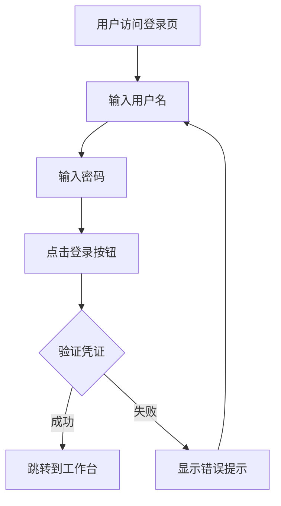

# 登录页面演示说明

**页面文件**: `prototypes/login.html`  
**页面状态**: 已完成  
**最后更新**: 2025-08-22  

## 1. 页面概述

### 1.1 功能定位
登录页面作为系统入口，提供用户身份验证和权限控制功能，确保只有授权用户能够访问系统。

### 1.2 设计理念
**简洁专业** - 采用简洁的设计风格，突出品牌形象  
**安全可信** - 通过视觉设计传达系统的安全性和可信度  
**易用性优** - 优化登录流程，减少用户操作步骤  

## 2. 页面布局

### 2.1 整体布局
```
┌─────────────────────────────────────┐
│              顶部Logo               │
├─────────────────────────────────────┤
│                                     │
│        ┌─────────────────┐          │
│        │                 │          │
│        │   登录表单区     │          │
│        │                 │          │
│        └─────────────────┘          │
│                                     │
├─────────────────────────────────────┤
│            版权信息区                │
└─────────────────────────────────────┘
```

### 2.2 核心区域

| 区域名称 | 功能描述 | 交互要素 |
|----------|----------|----------|
| Logo区域 | 品牌标识展示 | 静态展示 |
| 登录表单 | 用户凭证输入 | 输入框、按钮 |
| 记住密码 | 登录便利功能 | 复选框 |
| 登录按钮 | 提交登录请求 | 点击交互 |
| 版权信息 | 法律声明 | 静态展示 |

## 3. 交互流程

### 3.1 标准登录流程



### 3.2 操作步骤

1. **输入用户名**
   - 在用户名输入框中输入邮箱或用户名
   - 支持中英文输入
   - 实时验证格式

2. **输入密码**
   - 在密码输入框中输入密码
   - 自动隐藏密码字符
   - 支持密码显示/隐藏切换

3. **选择记住密码**
   - 可选择是否记住登录状态
   - 勾选后下次自动填充

4. **点击登录**
   - 提交登录信息
   - 显示登录进度
   - 验证成功后跳转

## 4. 实际功能说明

### 4.1 登录模拟机制

**验证规则**: 任意非空用户名和密码组合都可以登录成功  
**登录状态**: 无后端验证，纯前端表单验证  
**跳转目标**: 登录成功后自动跳转到 `dashboard.html`  
**错误处理**: 空值输入显示“请输入用户名与密码”提示

### 4.2 特殊功能详解

#### 4.2.1 密码显示切换
- **触发位置**: 密码输入框右侧的眼睛图标
- **默认状态**: `type="password"` + `mdi:eye-outline` 图标
- **点击后**: `type="text"` + `mdi:eye-off-outline` 图标
- **JavaScript实现**: 动态切换input的type属性和图标

#### 4.2.2 本地存储功能
- **存储触发**: 勾选“记住我” + 登录成功
- **存储内容**: `localStorage.setItem('hsai_u', username)`
- **存储范围**: 仅存储用户名，不存储密码
- **安全考虑**: 遵循最佳实践，不存储敏感信息

#### 4.2.3 第三方登录按钮
- **Google登录**: 具备Google图标和样式，但无实际功能
- **GitHub登录**: 具备GitHub图标和样式，但无实际功能
- **展示目的**: 仅为界面展示，模拟真实产品的登录选项  

## 5. 技术实现特点

### 5.1 前端技术栈

**HTML5**: 语义化标签结构，支持现代浏览器特性  
**Tailwind CSS**: 通过CDN引入，实现快速样式开发  
**Iconify**: 丰富的图标库支持，提供一致的图标体验  
**阿里巴巴普惠体**: 专业的中文字体，提升中文显示质量  
**原生JavaScript**: ES6+语法，无框架依赖，轻量高效

### 5.2 响应式设计实现

**桌面端布局** (`lg:显示`):
- 左右分屏结构，左侧宣传区 + 右侧登录区
- 左侧蓝色渐变背景，展示产品价值和特性
- 右侧白色背景，突出登录表单

**移动端布局** (`hidden lg:flex`):
- 隐藏左侧宣传区域，仅显示登录表单
- 全屏宽布局，优化移动端体验
- 增大触摸目标，提升操作便利性

### 5.3 交互体验优化

**输入框焦点效果**:
```css
.input-base:focus {
  box-shadow: 0 0 0 3px rgba(58,134,255,0.2);
  border-color: #3A86FF;
}
```

**按钮悬停效果**:
```css
.btn-primary:hover {
  background: #2563eb; /* 蓝色加深 */
}
```

**动画过渡**: 所有交互元素都具备 `transition` 属性，提供平滑的视觉反馈

## 6. 操作指南

### 6.1 基本操作流程

1. **打开页面**: 在浏览器中打开 `prototypes/login.html`
2. **输入信息**: 在用户名框输入任意内容（如：admin）
3. **输入密码**: 在密码框输入任意内容（如：123456）
4. **可选操作**: 点击眼睛图标切换密码显示/隐藏
5. **可选操作**: 勾选“记住我”复选框
6. **提交登录**: 点击“登录”按钮
7. **自动跳转**: 系统自动跳转到工作台页面

### 6.2 特殊情况处理

**空值验证**: 如果用户名或密码为空，会在表单上方显示红色错误提示框  
**错误清除**: 用户重新输入时，错误提示会自动隐藏  
**表单重置**: 刷新页面后所有输入内容清空，但localStorage中的用户名保留  

### 6.3 测试建议

**功能测试**:
- 正常登录流程测试
- 空值输入错误提示测试
- 密码显示/隐藏切换测试
- 记住登录功能测试
- 页面跳转测试

**兼容性测试**:
- Chrome/Firefox/Safari/Edge 浏览器测试
- 桌面/平板/手机设备测试
- 不同分辨率下的显示效果测试

---

**文档维护**: 产品设计团队  
**审核状态**: 待审核  
**相关文档**: 原型总体介绍, 用户故事与用例分析