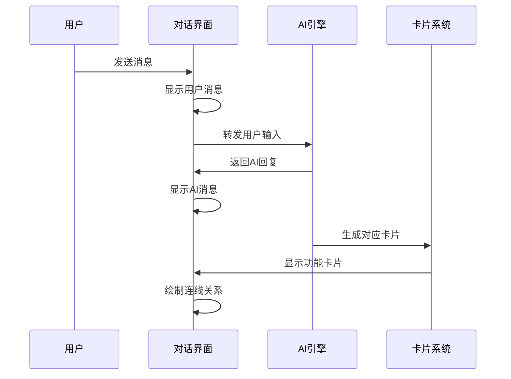

# 对话工作台演示说明

**页面文件**: `prototypes/chat.html` / `prototypes/chat_dynamic.html`  
**页面状态**: 核心功能完成  
**最后更新**: 2025-08-22  

## 1. 页面概述

### 1.1 功能定位
对话工作台是HSAI平台的核心功能模块，提供人机对话、智能卡片生成、连线可视化等创新交互体验，是用户与AI协作的主要工作界面。

### 1.2 核心特性
**双面板布局** - 左侧对话区，右侧卡片区，信息分离清晰  
**智能连线** - AI消息与卡片间的可视化连接关系  
**动态卡片** - 根据对话内容自动生成相应的功能卡片  
**实时交互** - 流畅的对话体验和即时反馈  

## 2. 页面布局

### 2.1 整体架构
```
┌─────────────────────────────────────────────────────┐
│                    顶部导航栏                         │
├────────────────────┬────────────────────────────────┤
│                    │                                │
│     对话区域        │         卡片区域                │
│   ┌─────────────┐   │   ┌─────────────────────────┐   │
│   │  会话列表    │   │   │      功能卡片            │   │
│   ├─────────────┤   │   ├─────────────────────────┤   │
│   │  消息历史    │   │   │      视频预览            │   │
│   ├─────────────┤   │   ├─────────────────────────┤   │
│   │  输入框     │   │   │      数据图表            │   │
│   └─────────────┘   │   └─────────────────────────┘   │
│                    │                                │
└────────────────────┴────────────────────────────────┘
```

### 2.2 区域功能

| 区域名称 | 主要功能 | 交互方式 |
|----------|----------|----------|
| 左侧对话区 | 消息展示、输入发送 | 文字/语音输入 |
| 右侧卡片区 | 智能卡片展示 | 点击/拖拽操作 |
| 连线层 | 关联关系可视化 | 悬停/点击高亮 |
| 顶部导航 | 功能切换、设置 | 点击导航 |

## 3. 核心功能演示

### 3.1 对话交互流程



### 3.2 消息类型展示

#### 3.2.1 用户消息
```html
<div class="message user-message">
  <div class="message-content">
    我想制作一个智能手表的产品介绍视频
  </div>
  <div class="message-time">14:25</div>
</div>
```

#### 3.2.2 AI消息
```html
<div class="message ai-message" data-ai-id="ai_001">
  <div class="message-content">
    我来帮您制作智能手表的产品介绍视频。首先，让我了解一下您的产品特点...
  </div>
  <div class="message-time">14:26</div>
  <div class="connection-anchor"></div>
</div>
```

### 3.3 卡片类型演示

#### 3.3.1 视频预览卡片
```javascript
const videoCard = {
  type: 'video',
  title: '智能手表产品介绍视频',
  data: {
    duration: '60秒',
    resolution: '1080p',
    script: '产品展示脚本内容...',
    thumbnail: 'video-thumb.jpg'
  },
  actions: ['播放', '编辑', '下载', '分享']
};
```

#### 3.3.2 协作提醒卡片
```javascript
const collaborationCard = {
  type: 'collaboration',
  title: '素材收集清单',
  data: {
    tasks: [
      { name: '上传产品图片', status: 'pending' },
      { name: '提供产品参数', status: 'completed' },
      { name: '确认目标受众', status: 'pending' }
    ]
  },
  priority: 'high'
};
```

#### 3.3.3 数据报告卡片
```javascript
const dataCard = {
  type: 'data',
  title: '竞品分析报告',
  data: {
    charts: [
      { type: 'bar', data: '市场份额对比' },
      { type: 'line', data: '价格趋势分析' }
    ],
    summary: '市场分析结论...'
  }
};
```

## 4. 连线系统演示

### 4.1 连线生成逻辑
```javascript
class ConnectionRenderer {
  createConnection(messageElement, cardElement) {
    const messageBounds = messageElement.getBoundingClientRect();
    const cardBounds = cardElement.getBoundingClientRect();
    
    // 计算连线起点和终点
    const startPoint = {
      x: messageBounds.right,
      y: messageBounds.top + messageBounds.height / 2
    };
    
    const endPoint = {
      x: cardBounds.left,
      y: cardBounds.top + cardBounds.height / 2
    };
    
    // 生成贝塞尔曲线路径
    const path = this.createBezierPath(startPoint, endPoint);
    
    // 渲染SVG连线
    this.renderLine(path, messageElement.dataset.aiId);
  }
  
  createBezierPath(start, end) {
    const controlPoint1 = {
      x: start.x + (end.x - start.x) * 0.5,
      y: start.y
    };
    
    const controlPoint2 = {
      x: start.x + (end.x - start.x) * 0.5,
      y: end.y
    };
    
    return `M${start.x},${start.y} C${controlPoint1.x},${controlPoint1.y} ${controlPoint2.x},${controlPoint2.y} ${end.x},${end.y}`;
  }
}
```

### 4.2 连线交互状态

| 状态 | 线宽 | 颜色 | 透明度 | 触发条件 |
|------|------|------|--------|----------|
| 默认 | 2.5px | #60A5FA | 1.0 | 初始显示 |
| 悬停 | 3px | #3B82F6 | 1.0 | 鼠标悬停 |
| 选中 | 3.5px | #1D4ED8 | 1.0 | 点击联动 |
| 淡化 | 2.5px | #60A5FA | 0.3 | 其他连线选中 |

### 4.3 点击联动效果
```javascript
// 消息点击联动卡片
function handleMessageClick(messageElement) {
  const aiId = messageElement.dataset.aiId;
  const targetCard = document.querySelector(`[data-ai-id="${aiId}"].card`);
  
  if (targetCard) {
    // 高亮连线
    highlightConnection(aiId);
    
    // 滚动到目标卡片
    scrollToElement(targetCard, 'smooth');
    
    // 卡片高亮效果
    targetCard.classList.add('highlight');
    setTimeout(() => {
      targetCard.classList.remove('highlight');
    }, 2000);
  }
}
```

## 5. 输入交互演示

### 5.1 多种输入方式

#### 5.1.1 文本输入
- 支持多行文本输入
- 自动高度调整（最大120px）
- 回车发送，Shift+回车换行
- 输入字数统计和限制

#### 5.1.2 语音输入
```javascript
// 语音输入功能
class VoiceInput {
  startRecording() {
    if ('webkitSpeechRecognition' in window) {
      const recognition = new webkitSpeechRecognition();
      recognition.lang = 'zh-CN';
      recognition.continuous = false;
      
      recognition.onresult = (event) => {
        const transcript = event.results[0][0].transcript;
        this.insertText(transcript);
      };
      
      recognition.start();
    }
  }
}
```

#### 5.1.3 文件上传
- 拖拽文件到输入区域
- 点击选择文件
- 支持图片、文档、音视频文件
- 实时上传进度显示

### 5.2 发送状态反馈

| 状态 | 按钮文字 | 按钮状态 | 视觉反馈 |
|------|----------|----------|----------|
| 待输入 | "发送" | 禁用 | 灰色背景 |
| 可发送 | "发送" | 激活 | 蓝色背景 |
| 发送中 | "发送中..." | 禁用 | Loading动画 |
| 发送成功 | "发送" | 激活 | 恢复正常 |
| 发送失败 | "重试" | 激活 | 红色边框 |

## 6. 响应式适配

### 6.1 桌面端布局 (>1280px)
```css
.chat-layout {
  display: flex;
  height: 100vh;
}

.chat-left, .chat-right {
  flex: 1;
  min-width: 0;
}

.chat-left {
  border-right: 1px solid var(--border-color);
}
```

### 6.2 平板端布局 (768-1279px)
```css
/* 可切换的单面板显示 */
@media (max-width: 1279px) {
  .chat-layout {
    position: relative;
  }
  
  .panel-toggle {
    position: fixed;
    bottom: 20px;
    right: 20px;
    background: var(--primary-blue);
    color: white;
    border: none;
    border-radius: 50%;
    width: 56px;
    height: 56px;
    font-size: 24px;
    cursor: pointer;
    box-shadow: 0 4px 12px rgba(0,0,0,0.3);
  }
}
```

### 6.3 移动端布局 (<768px)
```css
/* 底部标签切换 */
@media (max-width: 767px) {
  .chat-tabs {
    position: fixed;
    bottom: 0;
    left: 0;
    right: 0;
    display: flex;
    background: white;
    border-top: 1px solid var(--border-color);
  }
  
  .chat-tab {
    flex: 1;
    padding: 12px;
    text-align: center;
    border: none;
    background: none;
  }
  
  .chat-tab.active {
    background: var(--primary-blue);
    color: white;
  }
}
```

## 7. 特殊交互效果

### 7.1 消息气泡动画
```css
@keyframes messageSlideIn {
  from {
    opacity: 0;
    transform: translateX(-20px);
  }
  to {
    opacity: 1;
    transform: translateX(0);
  }
}

.message {
  animation: messageSlideIn 0.3s ease-out;
}
```

### 7.2 卡片进入动画
```css
@keyframes cardFadeIn {
  from {
    opacity: 0;
    transform: translateX(30px) scale(0.95);
  }
  to {
    opacity: 1;
    transform: translateX(0) scale(1);
  }
}

.card {
  animation: cardFadeIn 0.4s ease-out;
}
```

### 7.3 连线绘制动画
```css
.connection-line {
  stroke-dasharray: 1000;
  stroke-dashoffset: 1000;
  animation: drawLine 0.8s ease-out forwards;
}

@keyframes drawLine {
  to {
    stroke-dashoffset: 0;
  }
}
```

## 8. 测试场景

### 8.1 基础对话测试
```javascript
// 测试对话场景
const testScenarios = [
  {
    userInput: "我想制作一个产品介绍视频",
    expectedCards: ["video", "collaboration"],
    expectedConnections: 1
  },
  {
    userInput: "分析一下我们的竞争对手",
    expectedCards: ["data", "strategy"],
    expectedConnections: 1
  },
  {
    userInput: "帮我规划一下社媒发布策略",
    expectedCards: ["strategy", "schedule"],
    expectedConnections: 1
  }
];
```

### 8.2 交互测试要点
- [ ] 消息发送和接收正常
- [ ] 卡片生成与消息对应
- [ ] 连线绘制和更新正确
- [ ] 点击联动效果正常
- [ ] 滚动同步机制正常
- [ ] 响应式布局适配正常

### 8.3 性能测试
- [ ] 大量消息下的渲染性能
- [ ] 连线重绘的性能影响
- [ ] 内存使用情况监控
- [ ] 移动端流畅性测试

## 9. 已知问题和限制

### 9.1 功能限制
- AI回复为预设模拟数据，不支持真实AI对话
- 语音输入功能依赖浏览器支持，部分浏览器不可用
- 文件上传为模拟操作，无实际后端处理
- 连线在某些极端滚动情况下可能出现偏移

### 9.2 性能限制
- 大量消息和卡片时可能影响页面性能
- 连线SVG元素过多时可能导致重绘性能下降
- 移动端复杂动画可能在低端设备上卡顿

### 9.3 浏览器兼容性
- 需要现代浏览器支持（IE不支持）
- 语音识别功能主要支持Chrome和Safari
- 某些CSS动画效果在旧版浏览器中可能显示异常

---

**文档维护**: 产品设计团队  
**审核状态**: 待审核  
**相关文档**: 原型总体介绍, 交互逻辑与动效规范