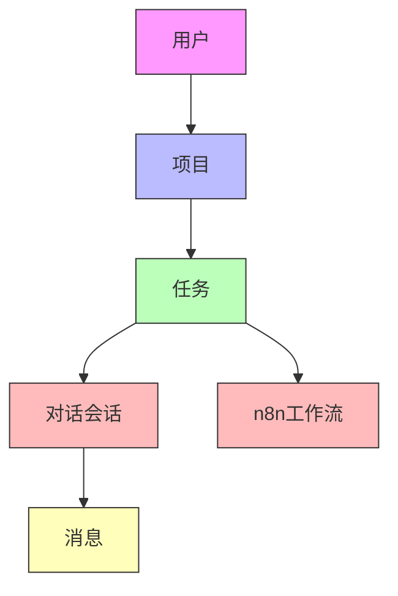
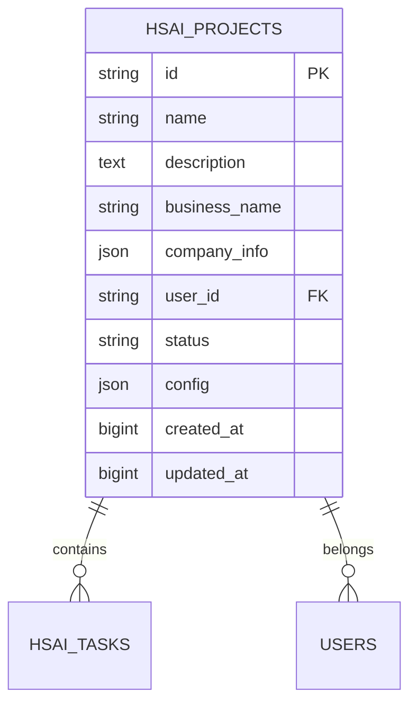
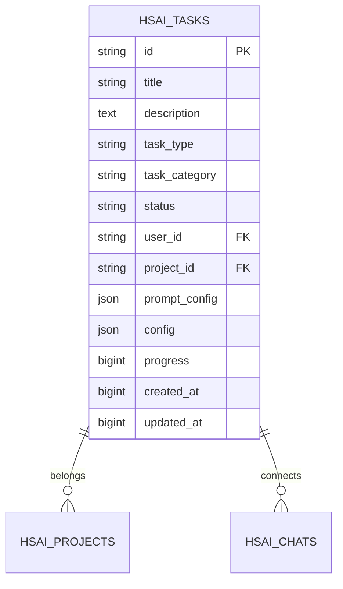
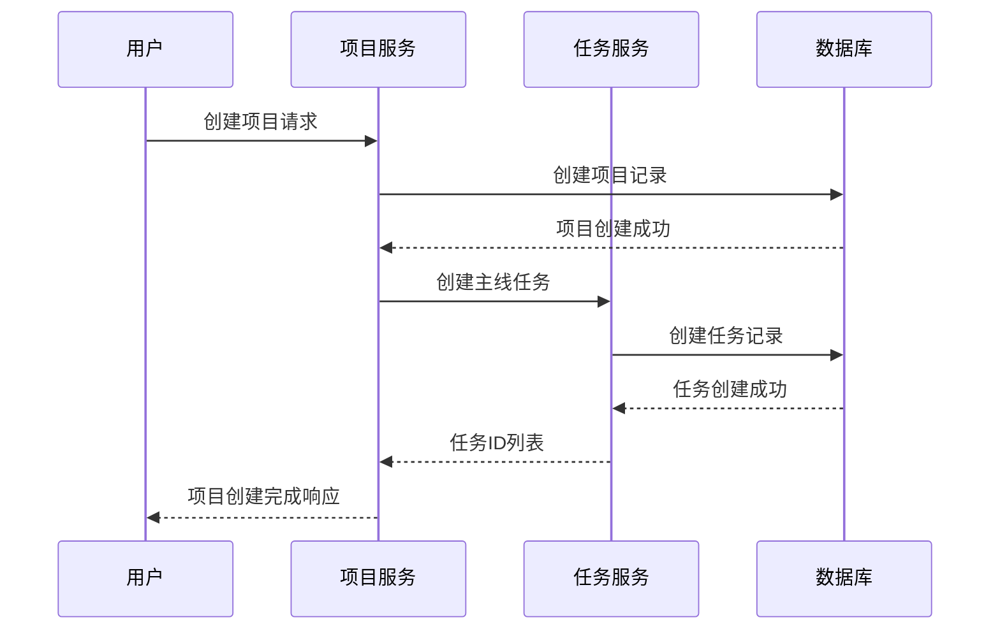
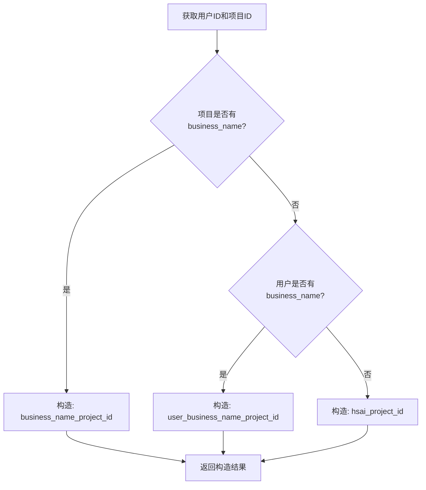
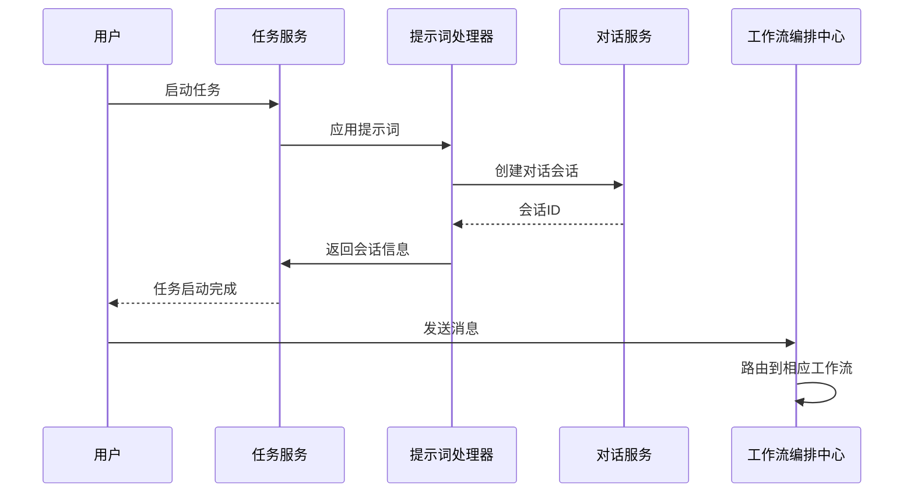
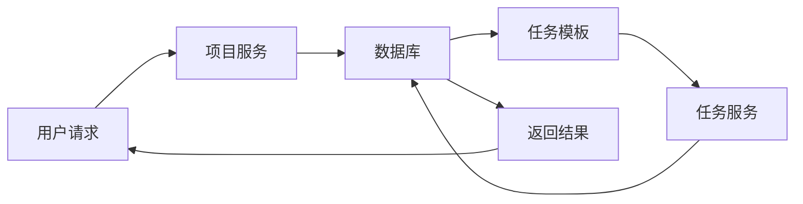
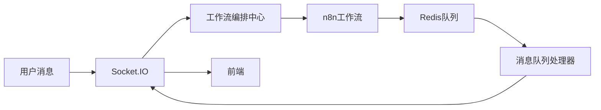
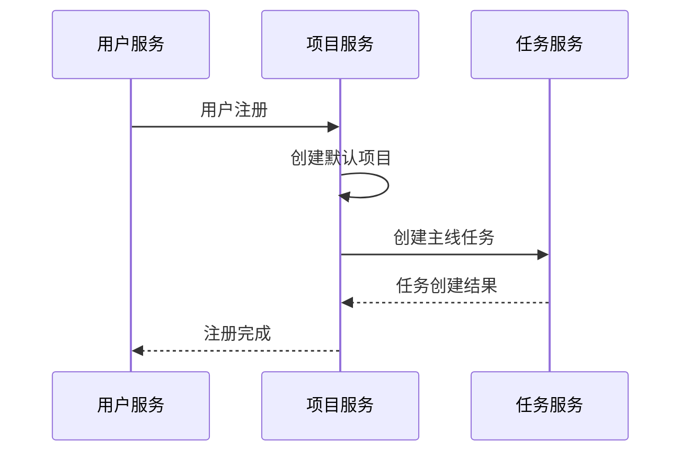
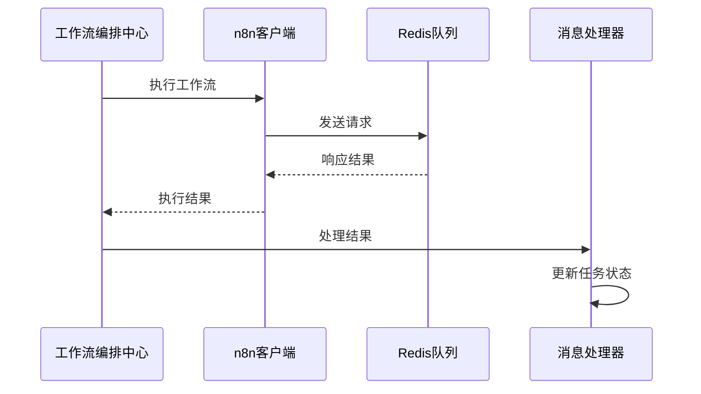

# 基于任务的对话管理系统优化方案

## 1. 方案概述

### 1.1 设计理念

本方案旨在构建一个基于任务的对话管理系统，通过将对话内容分解为最小工作单元（任务），避免因对话内容增长导致的上下文过长问题。系统将通过任务体系实现关键信息的阶段性切割，在较短对话中完成任务并保存进度，从而开启新的上下文对对话影响较小。

### 1.2 核心目标

1. **上下文管理优化**：通过任务划分对话上下文，避免长对话导致的信息丢失
2. **进度保存机制**：实现任务完成状态的持久化保存
3. **企业级隔离**：通过项目概念实现多企业数据隔离
4. **工作流集成**：深度集成n8n工作流，实现复杂业务逻辑处理

## 2. 系统架构设计

### 2.1 核心概念



### 2.2 数据模型扩展

#### 2.2.1 项目模型 (HSAIProject)



#### 2.2.2 任务模型扩展 (HSAITask)



## 3. 核心功能实现

### 3.1 项目管理机制

#### 3.1.1 项目创建流程



#### 3.1.2 企业名称构造机制



### 3.2 主线任务创建机制

#### 3.2.1 项目创建时的任务

当用户创建项目时，系统自动创建以下主线任务：

1. **企业信息完善任务**
2. **项目信息完善任务**
3. **素材库初始化任务**

#### 3.2.2 战略地图生成时的任务

当用户完成战略地图生成后，系统自动创建：

1. **社交媒体账号绑定任务**
2. **每日循环任务模板**

### 3.3 提示词配置机制

#### 3.3.1 提示词配置结构

```json
{
  "system_prompt": "系统提示词",
  "initial_message": "初始引导消息",
  "guidance_questions": ["问题1", "问题2", "问题3"],
  "completion_criteria": "完成标准",
  "success_message": "成功消息"
}
```

#### 3.3.2 提示词应用流程



## 4. 数据流向设计

### 4.1 任务创建数据流



### 4.2 对话处理数据流



## 5. 技术实现细节

### 5.1 项目模型实现

#### 5.1.1 数据库表结构

```sql
CREATE TABLE hsai_projects (
    id VARCHAR(255) PRIMARY KEY,
    name VARCHAR(255) NOT NULL,
    description TEXT,
    business_name VARCHAR(255) NOT NULL,
    company_info JSON,
    user_id VARCHAR(255) NOT NULL,
    status VARCHAR(50) DEFAULT 'active',
    config JSON,
    created_at BIGINT,
    updated_at BIGINT
);
```

#### 5.1.2 模型类定义

```python
class HSAIProject(Base):
    __tablename__ = "hsai_projects"
    
    id = Column(String, primary_key=True)
    name = Column(String, nullable=False)
    description = Column(Text, nullable=True)
    business_name = Column(String, nullable=False)
    company_info = Column(JSON, nullable=True)
    user_id = Column(String, nullable=False)
    status = Column(String, default="active")
    config = Column(JSON, nullable=True)
    created_at = Column(BigInteger)
    updated_at = Column(BigInteger)
```

### 5.2 任务模型扩展

#### 5.2.1 数据库表结构扩展

```sql
ALTER TABLE hsai_tasks 
ADD COLUMN project_id VARCHAR(255) REFERENCES hsai_projects(id),
ADD COLUMN task_category VARCHAR(50),
ADD COLUMN prompt_config JSON;
```

#### 5.2.2 模型类扩展

```python
class HSAITask(Base):
    # ... 现有字段 ...
    
    # 新增项目关联字段
    project_id = Column(String, ForeignKey("hsai_projects.id"), nullable=True)
    
    # 任务类型扩展
    task_category = Column(String, nullable=True)
    
    # 任务提示词配置
    prompt_config = Column(JSON, nullable=True)
```

### 5.3 主线任务模板

```python
TASK_TEMPLATES = {
    "company_info": {
        "title": "完善企业信息",
        "description": "请提供您企业的基本信息，包括企业名称、行业、规模等",
        "task_type": "workflow_execution",
        "task_category": "main",
        "workflow_type": "company_info",
        "priority": 10,
        "prompt_config": {
            "system_prompt": "您是一个企业信息收集助手，请引导用户完善企业基本信息",
            "initial_message": "您好！为了更好地为您服务，我们需要收集一些您企业的基本信息。",
            "guidance_questions": [
                "请告诉我您的企业名称是什么？",
                "您的企业属于哪个行业？",
                "企业大概有多少员工？",
                "企业成立多长时间了？"
            ],
            "completion_criteria": "用户提供了完整的企业基本信息",
            "success_message": "感谢您提供的企业信息，我们已经记录完毕。"
        }
    }
    // ... 其他模板定义
}
```

## 6. 系统集成方案

### 6.1 与用户系统集成



### 6.2 与工作流系统集成



## 7. 实施计划

### 7.1 第一阶段（1-2周）

#### 7.1.1 项目数据模型实现
- 创建项目表（hsai_projects）
- 实现项目CRUD操作API
- 实现项目与用户关联关系

#### 7.1.2 任务模型扩展
- 扩展任务表结构
- 实现任务与项目关联
- 实现任务分类管理

### 7.2 第二阶段（2-3周）

#### 7.2.1 主线任务服务实现
- 实现主线任务模板管理
- 实现任务自动创建机制
- 实现提示词配置管理

#### 7.2.2 对话集成
- 实现任务与对话会话绑定
- 实现提示词应用机制
- 实现任务状态同步

### 7.3 第三阶段（3-4周）

#### 7.3.1 高级功能实现
- 实现任务负责人自动分配
- 实现每日循环任务生成
- 实现任务依赖管理

#### 7.3.2 系统测试
- 完成单元测试
- 完成集成测试
- 完成系统验收测试

## 8. 预期效果

### 8.1 用户体验提升
- 对话上下文更加清晰，避免信息混乱
- 任务进度可视化，提升用户掌控感
- 企业信息隔离，保障数据安全

### 8.2 系统性能优化
- 减少长对话对系统资源的占用
- 提高对话处理效率
- 增强系统可扩展性

### 8.3 业务价值提升
- 提高任务完成率
- 增强用户粘性
- 提升企业用户满意度