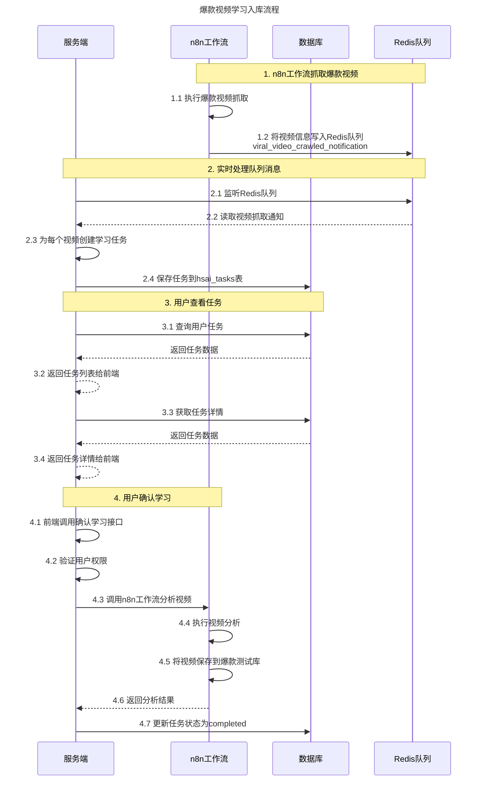

# 爆款视频学习入库流程说明

## 1. 概述

本文档详细描述了从定时触发爆款抓取到指定爆款视频学习入库的完整流程，包括前端、服务端、n8n工作流和数据库四个角色的协同工作机制。

新的流程中，n8n工作流通过Redis队列传递视频信息，服务端监听队列并实时处理后续工作。不再需要爆款视频表以及服务端定时扫描功能。

## 2. 整体流程图



## 3. 详细流程说明

### 3.1 n8n工作流抓取爆款视频

1. n8n工作流执行爆款视频抓取任务
2. n8n工作流将抓取到的视频信息写入Redis队列`viral_video_crawled_notification`

### 3.2 实时处理队列消息

1. 服务端持续监听Redis队列`viral_video_crawled_notification`
2. 读取到视频抓取通知消息后，解析消息内容
3. 为每个视频直接创建学习任务
4. 任务信息保存到`hsai_tasks`表中

### 3.3 用户查看任务

1. 用户登录系统后，可以查看任务列表
2. 系统从`hsai_tasks`表中获取用户的学习任务
3. 任务列表显示任务标题、描述、状态等信息

### 3.4 用户确认学习

1. 用户在任务详情页面点击"确认学习"按钮
2. 前端调用`/api/v1/hsai/viral-videos/confirm-learning`接口
3. 服务端验证用户权限
4. 服务端调用n8n工作流进行视频分析拆解入库
5. n8n工作流完成处理后，将视频保存到爆款测试库中
6. 服务端更新任务状态为`completed`

## 4. 数据库表结构

### 4.1 hsai_tasks（任务表）

| 字段名 | 类型 | 描述 |
| --- | --- | --- |
| id | String | 任务唯一标识符 |
| title | String | 任务标题 |
| description | Text | 任务描述 |
| task_type | String | 任务类型 |
| status | String | 任务状态（pending/in_progress/completed/failed/cancelled） |
| user_id | String | 所属用户 |
| assignee_id | String | 指派人ID |
| chat_id | String | 关联的聊天会话ID |
| config | JSON | 任务配置参数 |
| inputs | JSON | 输入参数 |
| outputs | JSON | 输出结果 |
| workflow_id | String | 关联的工作流ID |
| parent_task_id | String | 父任务ID |
| progress | BigInteger | 进度百分比(0-100) |
| started_at | BigInteger | 开始时间 |
| completed_at | BigInteger | 完成时间 |
| error_message | Text | 错误信息 |
| retry_count | BigInteger | 重试次数 |
| priority | BigInteger | 优先级 |
| tags | JSON | 标签 |
| created_at | BigInteger | 创建时间 |
| updated_at | BigInteger | 更新时间 |

## 5. 状态流转机制

### 5.1 任务状态流转

任务状态遵循三级状态流转：
- `pending`(待执行) -> `in_progress`(进行中) -> `completed`(已完成)

## 6. API接口说明

### 6.1 确认学习并触发视频分析工作流

```
POST /api/v1/hsai/viral-videos/confirm-learning
```

**请求参数：**
```json
{
  "task_id": "任务ID",
  "user_id": "用户ID"
}
```

## 7. Redis队列处理

### 7.1 队列名称
- `viral_video_crawled_notification`: 用于接收n8n工作流抓取到的视频信息

### 7.2 消息结构
```json
{
  "enterprise_id": "企业ID",
  "video_url": "视频链接",
  "video_title": "视频标题",
  "video_description": "视频描述",
  "thumbnail_url": "缩略图链接",
  "duration": 180,
  "platform": "TikTok",
  "tags": ["标签1", "标签2"],
  "metadata": {},
  "crawl_timestamp": 1640995200,
  "create_ts": 1640995200
}
```

## 8. 注意事项

1. 状态更新需保持事务一致性，确保任务状态同步更新
2. 用户确认学习后，系统会自动调用n8n工作流进行视频分析拆解入库
3. n8n工作流会将分析完成的视频保存到爆款测试库中
4. 所有状态更新都有时间戳记录，便于追踪处理过程
5. n8n工作流通过Redis队列传递视频信息，服务端监听队列并实时处理
6. 不再需要爆款视频表以及服务端定时扫描功能