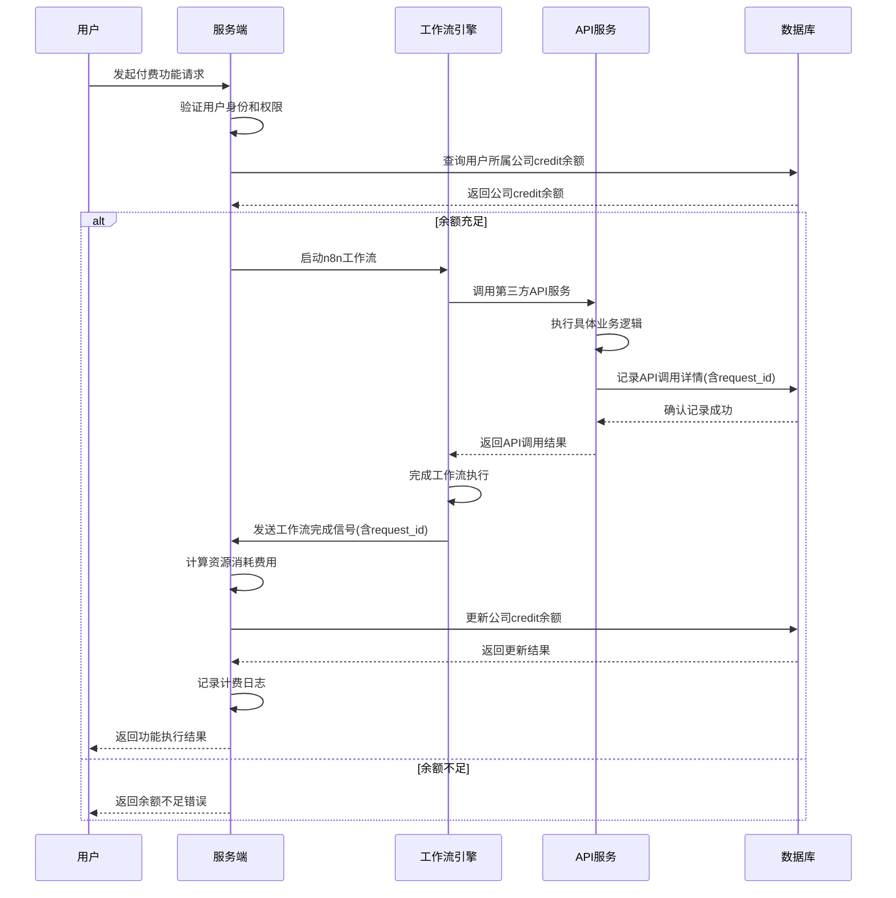

# HSAI项目计费方案

## 1. 背景与挑战

在当前的HSAI项目中，我们面临以下计费挑战：

1. **大模型集成在n8n中，无法有效获取token消耗**：由于大语言模型（LLM）直接在n8n工作流中集成，后端系统无法直接获取模型的token消耗数据，这使得传统的基于token的计费方式变得困难。

2. **n8n中集成了除对话模型以外的各种类型的模型及第三方接口，各渠道的计费方式不同，难以统一计算**：n8n工作流中不仅包含LLM，还集成了多种第三方服务和API，这些服务的计费方式各不相同，难以建立统一的计费模型。

3. **Redis连接不稳定导致计费风险**：系统中偶发Redis连接丢失的情况，如果将计费的关键节点放在Redis，遇到Redis连接丢失时将会出现用户超额度使用的情况。

## 2. 解决方案概述

针对上述挑战，我们提出了一种基于资源消耗的计费模式，该模式不依赖于直接的token消耗数据，而是通过系统资源的使用情况来计算费用。为解决Redis连接不稳定的问题，本方案采用数据库作为计费记录的核心存储，确保计费数据的持久性和一致性。

### 2.1 基于资源消耗的计费

对系统资源的使用情况进行计费：

- **存储资源**：按存储空间大小和时间收费
- **第三方服务调用**：按调用次数或数据量收费

## 3. 具体实施方案

为解决Redis连接不稳定的问题，本方案采用数据库作为计费记录的核心存储，确保计费数据的持久性和一致性。

### 3.1 计费模型设计

#### 3.1.1 资源计费模型

| 资源类型     | 计费方式  | 单价（积分） | 说明      |
| -------- | ----- | ------ | ------- |
| 存储空间     | 按GB/月 | 2/GB/月 | 素材和视频存储 |
| 第三方API调用 | 按调用次数 | 0.1/次  | 外部服务调用  |

> 注：单价配置存储在数据库中，可通过后台管理系统随时调整

### 3.2 计费实现机制

#### 3.2.1 数据库计费记录机制

为避免Redis连接不稳定导致的计费风险，采用数据库进行计费统计：

1. **API调用记录**：在n8n工作流的每次API调用之后，在数据库中记录一次用户的API调用，记录用户ID、API服务商、调用次数、请求ID(request_id)等信息，便于工作流返回之后使用请求ID索引当前请求产生的计费信息，减少数据库请求的时间
2. **实时余额检查**：credit记录在公司信息中，用户每次使用付费功能时，通过查询公司的credit余量确认是否可以使用，同一个公司的用户共享公司的credit
3. **计费计算**：在每次工作流执行完成返回时，读取数据表根据返回结构的request_id查找本次请求产生了多少消耗
4. **余额更新**：根据调用次数乘上换算credit来计算用户的积分使用情况，更新公司表的credit余量

#### 3.2.2 计费记录与统计

在数据库中建立完整的计费记录与统计机制：

1. **API调用记录**：记录每次API调用的详细信息，包括用户ID、API服务商、调用时间、调用次数、请求ID等，便于后续通过请求ID快速索引计费信息
2. **计费日志**：记录每次计费的详细信息，包括资源消耗、费用计算过程等
3. **公司余额跟踪**：实时跟踪每个公司的credit余量变化，确保余额准确性。同一个公司的所有用户共享该公司的credit余额，当任一用户使用付费功能时，都会影响整个公司的余额
4. **统计报表**：提供计费统计报表，展示用户消费情况和系统收入情况
5. **余额提醒**：当公司积分余额不足时，及时提醒充值

### 3.3 技术实现细节

### 3.3.0 用户使用付费功能时序图

以下是用户使用付费功能的完整流程时序图，按照用户、服务端、工作流、API服务、数据库来描述付费流程：



### 3.3.1 计费服务模块

创建独立的计费服务模块，包含以下功能：

```python
class BillingService:
    def calculate_resource_cost(self, resource_type: str, usage: dict) -> Decimal:
        """计算资源使用费用"""
        # 从数据库配置中获取计费比率
        rate = billing_config_service.get_billing_rate("resource", resource_type)
        # 根据具体资源类型和使用量计算费用
        return self._calculate_cost_by_rate(rate, usage)

    def _calculate_cost_by_rate(self, rate: Decimal, data: dict) -> Decimal:
        """根据费率和数据计算费用"""
        # 具体计算逻辑根据数据结构实现
        pass

    def update_company_credit(self, company_id: str, amount: Decimal, detail: dict) -> bool:
        """更新公司积分余额"""
        # 使用数据库事务确保一致性
        with get_db() as db:
            try:
                company = db.query(Company).filter_by(id=company_id).first()
                if company:
                    # 检查余额是否足够
                    if amount < 0 and company.credit + amount < 0:
                        raise InsufficientCreditError("公司积分余额不足")

                    # 更新余额
                    company.credit = company.credit + amount
                    company.updated_at = int(time.time())

                    # 记录日志
                    credit_log = CreditLog(
                        id=str(uuid.uuid4()),
                        company_id=company_id,
                        amount=amount,
                        detail=detail,
                        created_at=int(time.time())
                    )
                    db.add(credit_log)

                    db.commit()
                    return True
                return False
            except Exception as e:
                db.rollback()
                log.error(f"更新公司积分余额失败: {e}")
                return False
```

#### 3.3.2 数据库计费处理器

创建独立的数据库计费处理器，处理工作流完成后的计费逻辑：

```python
async def handle_task_completion_signal_with_billing(message: Dict[str, Any], config: Optional[Dict[str, Any]] = None) -> None:
    """处理任务完成信号并触发计费"""
    # 原有任务完成处理逻辑
    await handle_task_completion_signal(message, config)

    # 新增计费逻辑
    try:
        # 获取任务信息
        task_id = message.get("request_id")
        task = HSAITasks.get_task_by_id(task_id)

        if task:
            # 记录API调用
            api_usage_service.record_api_call(
                user_id=task.user_id,
                task_id=task_id,
                workflow_type=message.get("operate_id"),
                request_id=task_id,  # 使用task_id作为request_id
                call_details=message.get("content", {})
            )

            # 计算费用（仅基于资源消耗）
            # 这里需要根据实际的资源使用情况计算费用
            # 示例：计算API调用费用
            api_calls = message.get("content", {}).get("api_calls", 0)
            cost = billing_service.calculate_resource_cost("api_call", {"count": api_calls})

            # 更新公司credit余量
            company_service.update_company_credit(
                company_id=task.company_id,
                amount=-cost,
                detail={
                    "task_id": task_id,
                    "resource_type": "api_call",
                    "amount": float(cost)
                }
            )
    except Exception as e:
        log.error(f"计费处理失败: {e}")
```

#### 3.3.3 数据库计费配置管理

将调用次数对应的credit换算配置存储在数据库中，方便后台随时调整：

```python
# 数据库计费配置表
class BillingConfig(Base):
    __tablename__ = "billing_config"

    id = Column(String, primary_key=True)
    config_type = Column(String, nullable=False)  # 配置类型：resource
    config_key = Column(String, nullable=False)   # 配置键名
    config_value = Column(JSON, nullable=False)   # 配置值
    description = Column(Text)                    # 配置描述
    is_active = Column(Boolean, default=True)     # 是否启用
    created_at = Column(BigInteger)
    updated_at = Column(BigInteger)

# 计费配置服务
class BillingConfigService:
    def get_billing_rate(self, config_type: str, config_key: str) -> Decimal:
        """获取计费比率"""
        config = db.query(BillingConfig).filter_by(
            config_type=config_type, 
            config_key=config_key, 
            is_active=True
        ).first()

        if config:
            return Decimal(config.config_value.get("rate", 0))
        return Decimal(0)

    def update_billing_rate(self, config_type: str, config_key: str, rate: Decimal, description: str = ""):
        """更新计费比率"""
        config = db.query(BillingConfig).filter_by(
            config_type=config_type, 
            config_key=config_key
        ).first()

        if config:
            config.config_value = {"rate": str(rate)}
            config.description = description
            config.updated_at = int(time.time())
        else:
            config = BillingConfig(
                id=str(uuid.uuid4()),
                config_type=config_type,
                config_key=config_key,
                config_value={"rate": str(rate)},
                description=description,
                created_at=int(time.time()),
                updated_at=int(time.time())
            )
            db.add(config)

        db.commit()
```

## 5. 实施计划

为确保计费系统的稳定性和准确性，采用分阶段实施的方式：

### 5.1 第一阶段：基础计费功能实现（1-2周）

- 实现基于资源消耗的计费模型
- 创建数据库计费处理器，替代Redis消息处理器的计费触发逻辑
- 实现计费记录和统计功能
- 实现公司表credit余量字段和更新逻辑

### 5.2 第二阶段：资源计费完善（2-3周）

- 完善基于资源消耗的计费模型
- 实现计费配置的数据库存储和后台管理功能

### 5.3 第三阶段：优化和扩展（3-4周）

- 优化计费算法，提高准确性
- 扩展资源计费模型，支持更多资源类型
- 完善统计报表和数据分析功能
- 实现计费配置的动态调整和实时生效机制

## 6. 风险控制与监控

为确保计费系统的稳定运行和数据准确性，建立完善的风险控制和监控机制：

### 6.1 计费准确性监控

- 建立计费日志审计机制，确保每次计费都有详细记录
- 定期对账，核对系统收入与用户消费是否一致
- 设置异常消费预警，及时发现异常计费情况
- 实现数据库事务一致性，确保计费记录与余额更新的原子性

### 6.2 用户体验保障

- 提供积分余额查询和消费记录查询功能
- 在积分不足时及时提醒用户充值
- 提供计费争议处理机制，保障用户权益

### 6.3 系统稳定性保障

- 计费服务与主业务分离，避免计费异常影响主业务
- 实现计费失败的重试机制
- 建立计费服务的监控和告警机制
- 采用数据库持久化存储，避免Redis连接不稳定导致的数据丢失

## 7. 总结

本计费方案通过基于资源消耗的计费模式，有效解决了HSAI项目面临的计费挑战。该方案不依赖于直接的token消耗数据，而是通过系统资源的使用情况来计算费用。通过采用数据库而非Redis进行关键计费记录，避免了Redis连接丢失导致的计费风险，同时通过在公司表中实时记录credit余量，确保了余额检查的准确性。调用次数与credit换算的数据库配置设计，方便了后台随时调整计费策略，提升了系统的灵活性和可维护性。