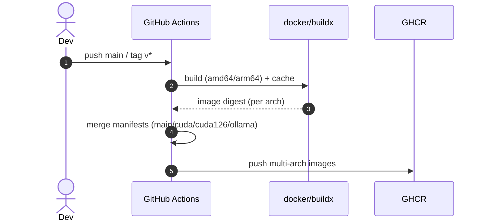

# 开放 WebUI 项目 Docker 方案参考（可复用）

> 本文总结于仓库实际文件（Dockerfile、docker-compose.*、.github/workflows/docker-build.yaml、kubernetes/manifest/* 等）。适用于本项目与其它相似后端 + 前端一体构建的项目复用。编码：UTF-8。

## 1. 方案总览
- 构建与镜像：多阶段 Docker 构建（Node 22 构前端 + Python 3.11 运行后端），支持可选 CUDA/OLLAMA 变体；多架构（amd64/arm64）镜像通过 GitHub Actions + buildx 产出并推送至 GHCR。
- 运行与编排：默认使用 docker compose 组合 open-webui 与 ollama，两类 GPU 覆盖（NVIDIA/AMD）；提供 Playwright 服务用于爬取等场景；Kubernetes 清单内置（含 GPU overlay）。
- 工作流与版本：.github/workflows/docker-build.yaml 按矩阵构建 four flavors（main/cuda/cuda126/ollama），使用缓存、摘要合并与多架构 manifest；默认触发分支 main 与 tag v*。
- 注册表：当前推送目标为 GitHub Container Registry（GHCR，ghcr.io）。暂未配置 Docker Hub 推送，文末附带可选接入指引。

## 2. 镜像与标签
- 注册表与命名：`ghcr.io/<owner>/<repo>`，在本仓库内使用 metadata-action 将仓库名标准化为小写。
- 平台：linux/amd64 与 linux/arm64（QEMU + buildx）。
- 口味（flavor）与示例标签：
  - main：`:latest`（仅 main 分支）、`:git-<sha>`、`:vX.Y.Z` 等常规标签。
  - cuda：在 main 基础上启用 `USE_CUDA=true`，额外带 `-cuda` 后缀（例如 `:vX.Y.Z-cuda`）。
  - cuda126：同上并指定 `USE_CUDA_VER=cu126`，带 `-cuda126` 后缀。
  - ollama：启用 `USE_OLLAMA=true`，带 `-ollama` 后缀。
- 第三方运行时镜像：
  - 推理服务：`ollama/ollama`（docker-compose 与 K8s 均引用）。
  - 测试/爬取：`mcr.microsoft.com/playwright:v1.49.1-noble`（版本与 requirements 对齐）。

## 3. 构建（Dockerfile 要点）
- 路径：`Dockerfile`（根目录），`backend/Dockerfile`（后端轻量镜像），`backend/Dockerfile.optimized`（两段式优化）。
- 多阶段：
  - 阶段1 前端：`FROM node:22-alpine3.20 AS build`，执行 `npm ci && npm run build`，产出 `/app/build`。
  - 阶段2 后端：`FROM python:3.11-slim-bookworm`，可选安装 CUDA/OLLAMA；依赖安装使用 `uv pip`；预下载 embedding/whisper/tiktoken 缓存；复制前端产物至运行镜像；健康检查内置。
- 关键 Build Args/Env（部分）：
  - `USE_CUDA`（true/false）、`USE_CUDA_VER`（如 `cu126`/`cu128`）、`USE_OLLAMA`（true/false）。
  - `BUILD_HASH`（注入 git sha）→ 环境 `WEBUI_BUILD_VERSION`。
  - `UID/GID`（默认 0/0），镜像内切换用户与数据目录属主。
  - 应用端口：`PORT=8080`，`HEALTHCHECK` 请求 `/health`。
- 后端专用镜像（backend/）：更小的变更面，便于本地开发/热更新；入口 `uvicorn open_webui.main:app`。

## 4. 本地运行（docker compose）
- 文件：
  - 核心：`docker-compose.yaml`（open-webui + ollama、持久卷、端口、依赖）。
  - 覆盖：`docker-compose.data.yaml`（外部数据目录）、`docker-compose.api.yaml`（暴露 Ollama API）、`docker-compose.gpu.yaml`（NVIDIA GPU）、`docker-compose.amdgpu.yaml`（AMD ROCm）、`docker-compose.playwright.yaml`（Playwright 服务）。
- 常用环境变量（来自 compose 与约定）：
  - `OPEN_WEBUI_PORT`（默认 3000 → 容器 8080）、`WEBUI_DOCKER_TAG`（默认 main）。
  - `OLLAMA_DOCKER_TAG`（默认 latest 或 rocm 变体）。
  - `WEBUI_SECRET_KEY`（强烈建议设置）。
- 典型启动命令：
```bash
# 最小可用（本地镜像构建 + 默认端口映射 + 卷持久化）
docker compose up -d --build

# 指定端口、持久化到宿主目录
docker compose -f docker-compose.yaml -f docker-compose.data.yaml up -d --build \
  --env-file .env  # 可选

# 暴露 Ollama API（供外部调用）
docker compose -f docker-compose.yaml -f docker-compose.api.yaml up -d

# 启用 NVIDIA GPU
docker compose -f docker-compose.yaml -f docker-compose.gpu.yaml up -d

# 启用 AMD GPU（ROCm）
docker compose -f docker-compose.yaml -f docker-compose.amdgpu.yaml up -d

# 使用 Playwright 作为 Web Loader 引擎
docker compose -f docker-compose.yaml -f docker-compose.playwright.yaml up -d
```
- 数据卷：
  - `open-webui:/app/backend/data`（应用数据）。
  - `ollama:/root/.ollama` 或外部挂载（参见 data 覆盖文件）。
- 相关脚本：`run-ollama-docker.sh`（可选 GPU 交互）、`backend/start-docker.sh`、`backend/dev-docker.sh`（热更新开发）。

## 5. 部署（Kubernetes 可选）
- 清单路径：`kubernetes/manifest/base` 与 `kubernetes/manifest/gpu`（kustomize overlay）。
- 组件：
  - Namespace、Deployment/Service/Ingress（open-webui）、StatefulSet/Service（ollama）、PVC（数据持久化）。
  - 镜像：`ghcr.io/open-webui/open-webui:main` 与 `ollama/ollama:latest`（GPU 覆盖在 gpu overlay 启动 `nvidia.com/gpu: 1`）。
- 典型命令：
```bash
# 基础部署
kubectl apply -k kubernetes/manifest/base

# 启用 GPU 覆盖
a. 确认集群有 NVIDIA Device Plugin
b. 应用 overlay
kubectl apply -k kubernetes/manifest/gpu
```
- 自定义建议：
  - 将 `image: ghcr.io/open-webui/open-webui:main` 替换为 `:vX.Y.Z[-cuda|-ollama|-cuda126]` 固定版本。
  - 调整资源请求/限制、NodePort/Ingress 域名、持久化卷大小。

## 6. CI/CD（GitHub Actions）
- 工作流：`.github/workflows/docker-build.yaml`。
- 流程结构：
  1) `build-main-image` → 产出 main 口味多架构镜像。
  2) `build-cuda-image` / `build-cuda126-image` / `build-ollama-image` → 分别构建带特性口味。
  3) `merge-*-images` → 下载不同平台的 digest，使用 `docker buildx imagetools create` 合成 manifest 并发布。
- 关键技术点：
  - `docker/setup-qemu-action` + `docker/setup-buildx-action` 实现跨架构构建。
  - `docker/metadata-action` 统一生成标签（含 `latest` 条件、`git-<sha>`、semver、口味后缀）。
  - `docker/build-push-action` 搭配 `cache-from/cache-to` 使用 GHCR 作为层缓存，显著减少二次构建时间。
  - 通过 `BUILD_HASH=${{ github.sha }}` 注入构建版本；不同口味通过 `build-args` 切换：
    - `USE_CUDA=true`、`USE_CUDA_VER=cu126`、`USE_OLLAMA=true`。
- 触发：`push` 到 `main` 与 `tags: v*`，以及手动 `workflow_dispatch`。

## 7. Docker Hub 配置（可选接入）
当前仅推送 GHCR。若需要同时推送 Docker Hub，建议新增/修改如下步骤：
- 仓库 Secrets：`DOCKERHUB_USERNAME`、`DOCKERHUB_TOKEN`。
- 登录步骤范例：
```yaml
- name: Login Docker Hub
  uses: docker/login-action@v3
  with:
    registry: docker.io
    username: ${{ secrets.DOCKERHUB_USERNAME }}
    password: ${{ secrets.DOCKERHUB_TOKEN }}
```
- 镜像元数据扩展：
```yaml
- name: Extract Docker Hub metadata
  id: meta-dh
  uses: docker/metadata-action@v5
  with:
    images: |
      ghcr.io/${{ github.repository }}
      docker.io/${{ secrets.DOCKERHUB_USERNAME }}/${{ github.event.repository.name }}
    tags: |
      type=ref,event=branch
      type=ref,event=tag
      type=sha,prefix=git-
      type=semver,pattern={{version}}
      type=semver,pattern={{major}}.{{minor}}
```
- 构建与推送同时针对两套 `images`，或分两个 build-push 步骤分别推送 GHCR 与 Docker Hub。
- 注意：Docker Hub 仓库需先创建并设置为 public/private；命名遵循 `docker.io/<org>/<repo>`。

## 8. 安全与配置基线
- 不在仓库明文保存密钥；运行时通过 `.env` 或容器环境变量注入（生产建议使用 Secret 管理）。
- 强制设置 `WEBUI_SECRET_KEY`；如有外部 API Key（OpenAI/SMTP 等），以环境变量注入；避免写入镜像层。
- `.dockerignore` 与 `backend/.dockerignore` 已排除大体量与敏感路径，保持镜像简洁。
- 对外暴露端口最小化；K8s Ingress/Service 按需开放；启用健康检查用于滚动升级与存活探针。

## 9. 复用指引（给其它项目）
- Dockerfile：沿用「前端构建 + Python 后端运行」模式；将前端产物复制到运行镜像（如 `/app/build`），后端复制到 `/app/backend`；保留健康检查与非 root 运行（可选 UID/GID）。
- 变体策略：通过 `build-args` 切特性（如 GPU、内置服务等），在 CI 中用 matrix 与 flavor tag 管理；明确默认（main）与可选（cuda、ollama 等）。
- 工作流模板：采用 metadata-action 统一打 tag，buildx + QEMU 跨架构，cache-to/from 提速；使用 “导出 digest → 合并 manifest” 保证多平台一致性。
- 本地编排：拆分 compose 覆盖文件，按功能最小化启用；统一数据卷命名；GPU/外部 API 等能力通过 overlay 开关。
- K8s：提供 base + overlay（GPU/地区化/存储类等），在 values/patch 中只覆盖差异字段。

## 10. 常用命令速查
```bash
# 本地构建 main 镜像
docker build -t ghcr.io/<owner>/<repo>:dev --build-arg BUILD_HASH=$(git rev-parse --short HEAD) .

# 本地运行（主文件 + 数据持久化）
docker compose -f docker-compose.yaml -f docker-compose.data.yaml up -d --build

# 拉起 NVIDIA GPU
docker compose -f docker-compose.yaml -f docker-compose.gpu.yaml up -d

# 查看健康状态
docker inspect --format '{{json .State.Health}}' open-webui | jq
```

## 11. 关联文件（路径）
- Dockerfile：Dockerfile、backend/Dockerfile、backend/Dockerfile.optimized
- Compose：docker-compose*.yaml
- CI：.github/workflows/docker-build.yaml
- K8s：kubernetes/manifest/**/*
- 脚本：run-ollama-docker.sh、backend/start-docker.sh、backend/dev-docker.sh

## 12. Mermaid 结构图

### 12.1 运行时（Compose）
```mermaid
flowchart LR
  subgraph Host
    subgraph Compose
      OW[open-webui\nimage: ghcr.io/<owner>/<repo>:<tag>\nport 8080]
      OL[ollama\nimage: ollama/ollama:<tag>\nport 11434]
      PW[(playwright):::opt]
    end
  end
  OW <-.depends_on.-> OL
  OW -- env OLLAMA_BASE_URL --> OL
  classDef opt fill:#f5f5f5,stroke:#bbb,color:#666
```

### 12.2 CI 构建与发布


---
本文档由仓库扫描自动整理并手工校订，可作为后续项目的容器化基线模板复用。
