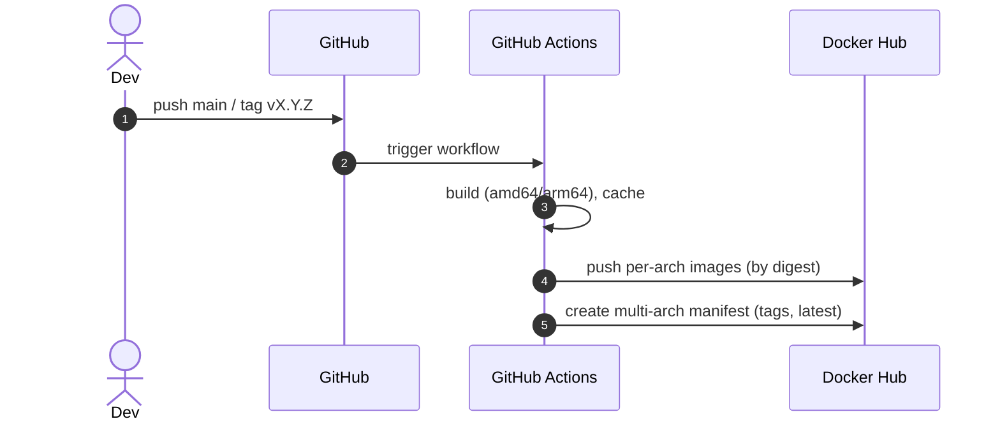
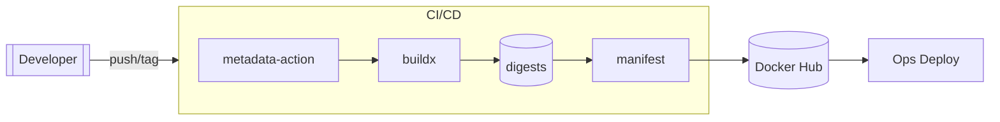

# 通用 Docker 技术使用方案（镜像化 + Git Workflow + Docker Hub + 版本标签 + 编排）

> 适用于大多数 Web/Service 项目，将本仓库的实践抽象为可复用模板。统一 UTF-8、Mermaid 绘图、一键复制可落地。

## 0. 成果物与边界
- 成果物：
  - Dockerfile（多阶段构建模板）
  - .dockerignore（最小上下文模板）
  - GitHub Actions 工作流（multi-arch 构建并推送 Docker Hub）
  - 版本与标签策略（SemVer + latest + 口味后缀）
  - Compose/K8s 编排建议
- 非目标：
  - 不覆盖业务侧测试/灰度策略细节；安全与合规提供基线项，可按组织策略加严。

## 1. 项目镜像化（Dockerfile 模板）
- 关键原则：
  - 多阶段构建：构建期与运行期镜像分离，减少体积与攻击面。
  - 明确入口与健康检查：保证滚动升级的探针可用。
  - 不写入密钥：凭证仅通过运行时 env/secret 注入。
- 通用模板（Node 前端 + Python 后端示例）：
```Dockerfile
# syntax=docker/dockerfile:1
ARG BUILD_HASH=dev

# 1) 前端构建
FROM node:22-alpine3.20 AS fe
WORKDIR /app
COPY package*.json ./
RUN npm ci
COPY . .
ENV APP_BUILD_HASH=${BUILD_HASH}
RUN npm run build

# 2) 后端运行
FROM python:3.11-slim-bookworm AS runtime
ENV ENV=prod PORT=8080 PYTHONUNBUFFERED=1
WORKDIR /srv/app
# 仅复制依赖清单以缓存
COPY backend/requirements.txt ./requirements.txt
RUN pip install -U pip uv && uv pip install --system -r requirements.txt --no-cache-dir \
 && rm -rf /root/.cache
# 复制产物与代码
COPY --from=fe /app/build /srv/build
COPY backend /srv/app

# 健康检查（按需替换）
HEALTHCHECK CMD curl --silent --fail http://localhost:${PORT:-8080}/health || exit 1

EXPOSE 8080
# OCI 标准标签（建议保留）
LABEL org.opencontainers.image.revision=$BUILD_HASH \
      org.opencontainers.image.source="${CI_REPO:-unset}"

CMD ["python","-m","uvicorn","open_webui.main:app","--host","0.0.0.0","--port","8080"]
```
- .dockerignore 模板：
```gitignore
.git
**/__pycache__
**/.pytest_cache
node_modules
.svelte-kit
venv
*.db
*.log
.env*
/docs
kubernetes
```

## 2. Git Workflow + Docker Hub 发布

### 2.1 仓库准备
- 在 GitHub 仓库 Secrets 配置：
  - `DOCKERHUB_USERNAME`、`DOCKERHUB_TOKEN`（token 需有 push 权限）。
- 约定主分支：`main`；发布通过打 tag 触发（vX.Y.Z）。

### 2.2 通用工作流（multi-arch + 缓存 + manifest）
```yaml
name: dockerhub-publish

on:
  push:
    branches: [ main ]
    tags: [ 'v*' ]
  workflow_dispatch: {}

jobs:
  build:
    runs-on: ${{ matrix.runner }}
    strategy:
      fail-fast: false
      matrix:
        include:
          - platform: linux/amd64
            runner: ubuntu-latest
          - platform: linux/arm64
            runner: ubuntu-24.04-arm
    env:
      IMAGE_DH: docker.io/${{ secrets.DOCKERHUB_USERNAME }}/${{ github.event.repository.name }}
    steps:
      - uses: actions/checkout@v4
      - uses: docker/setup-qemu-action@v3
      - uses: docker/setup-buildx-action@v3

      - name: Login Docker Hub
        uses: docker/login-action@v3
        with:
          registry: docker.io
          username: ${{ secrets.DOCKERHUB_USERNAME }}
          password: ${{ secrets.DOCKERHUB_TOKEN }}

      - name: Meta (tags/labels)
        id: meta
        uses: docker/metadata-action@v5
        with:
          images: ${{ env.IMAGE_DH }}
          tags: |
            type=ref,event=branch
            type=ref,event=tag
            type=sha,prefix=git-
            type=semver,pattern={{version}}
            type=semver,pattern={{major}}.{{minor}}
          flavor: |
            latest=${{ github.ref == 'refs/heads/main' }}

      - name: Cache meta
        id: cache
        uses: docker/metadata-action@v5
        with:
          images: ${{ env.IMAGE_DH }}
          tags: type=raw,value=cache-${{ matrix.platform }}
          flavor: latest=false

      - name: Build & Push (by digest)
        id: build
        uses: docker/build-push-action@v5
        with:
          context: .
          file: ./Dockerfile
          platforms: ${{ matrix.platform }}
          push: true
          labels: ${{ steps.meta.outputs.labels }}
          outputs: type=image,name=${{ env.IMAGE_DH }},push-by-digest=true,name-canonical=true,push=true
          cache-from: type=registry,ref=${{ steps.cache.outputs.tags }}
          cache-to: type=registry,ref=${{ steps.cache.outputs.tags }},mode=max
          build-args: |
            BUILD_HASH=${{ github.sha }}
            CI_REPO=${{ github.server_url }}/${{ github.repository }}

      - name: Export digest
        run: |
          mkdir -p /tmp/digests
          digest="${{ steps.build.outputs.digest }}" && touch "/tmp/digests/${digest#sha256:}"
      - uses: actions/upload-artifact@v4
        with:
          name: digests-${{ matrix.platform }}
          path: /tmp/digests/*
          retention-days: 1

  publish:
    runs-on: ubuntu-latest
    needs: [ build ]
    env:
      IMAGE_DH: docker.io/${{ secrets.DOCKERHUB_USERNAME }}/${{ github.event.repository.name }}
    steps:
      - uses: actions/download-artifact@v4
        with:
          pattern: digests-*
          merge-multiple: true
          path: /tmp/digests
      - uses: docker/setup-buildx-action@v3
      - name: Meta (final)
        id: meta
        uses: docker/metadata-action@v5
        with:
          images: ${{ env.IMAGE_DH }}
          tags: |
            type=ref,event=branch
            type=ref,event=tag
            type=sha,prefix=git-
            type=semver,pattern={{version}}
            type=semver,pattern={{major}}.{{minor}}
          flavor: |
            latest=${{ github.ref == 'refs/heads/main' }}
      - name: Create manifest & push
        working-directory: /tmp/digests
        run: |
          docker buildx imagetools create $(jq -cr '.tags | map("-t " + .) | join(" ")' <<< "$DOCKER_METADATA_OUTPUT_JSON") \
            $(printf '${{ env.IMAGE_DH }}@sha256:%s ' *)
      - name: Inspect
        run: docker buildx imagetools inspect ${{ env.IMAGE_DH }}:${{ steps.meta.outputs.version }}
```

### 2.3 Mermaid：发布流程


## 3. 版本与标签策略（SemVer + latest + 口味）
- 版本来源：git tag（`vX.Y.Z`）→ 工作流自动生成 `:X.Y.Z`、`:X.Y`、`:git-<sha>`，主分支可标记 `:latest`。
- 口味后缀（示例）：`-cuda`、`-ollama`、`-lite`、`-dev`。
  - 通过 `build-args` 控制差异，并在 metadata-action 中追加 `suffix`。
- 规范：
  - `latest` 仅代表 main 分支最新稳定构建；具体生产应锁定显式版本。
  - 标签不可变：一旦发布的 `vX.Y.Z` 不应重用；修复以 `vX.Y.(Z+1)` 重新发布。
  - 预发布：`vX.Y.Z-rc.1`、`-beta.1` 仅用于测试环境，不覆盖 `latest`。

## 4. 镜像编排通用建议

### 4.1 docker compose（模块化覆盖）
- 基本文件：`docker-compose.yml`（核心服务与卷），附加覆盖按需启用：
  - `docker-compose.gpu.yml`（GPU 资源）、`docker-compose.data.yml`（外部数据目录）、`docker-compose.api.yml`（额外端口暴露）等。
- 启动示例：
```bash
docker compose -f docker-compose.yml -f docker-compose.data.yml up -d --build
# 叠加 GPU
docker compose -f docker-compose.yml -f docker-compose.gpu.yml up -d
```
- 建议：
  - 显式 `healthcheck`、`restart: unless-stopped`；
  - 卷命名规范化（`<app>-data`），便于迁移与备份；
  - 环境变量集中 `.env` 管理，敏感信息用 secret/变量注入，不写入镜像层。

### 4.2 Kubernetes（kustomize overlay）
- base：Deployment/Service/Ingress/PVC 等通用资源；
- overlay：按环境/能力（GPU/地域/存储类）做 `patch`；
- 建议：
  - 资源请求/限制与 HPA 指标齐备；
  - Readiness/Liveness 探针与健康端点对齐；
  - 使用固定版本镜像并开启镜像拉取策略（IfNotPresent/Always 视环境）。

## 5. 安全与合规基线
- 镜像内容最小化（slim/alpine 需权衡 glibc/调试工具）；删除构建缓存、包管理索引。
- 根用户最小化：若可行，使用非 root（UID/GID）运行并修正卷权限。
- 禁止把密钥写入镜像层；生产使用 Secret 管理（K8s Secret、Vault 等）。
- 开启 SBOM/漏洞扫描（如 trivy/scout）并在 CI 门禁。
- 标注 OCI labels（source、revision、created 等）便于溯源。

## 6. 迁移与回滚建议
- 版本固定：生产环境使用显式版本 tag（含口味后缀）。
- 蓝绿/滚动：compose 以并行实例切换端口；K8s 使用滚动更新 + 最小可用副本策略。
- 回滚条件：健康检查失败率、错误率/延时阈值；镜像回滚 = 重新部署上一个稳定 tag。

## 7. 验收清单（Definition of Done）
- [ ] Dockerfile 多阶段并可无网络构建（本地缓存）
- [ ] .dockerignore 生效，镜像体积合理
- [ ] 健康检查/端口/入口一致
- [ ] CI 能构建 amd64/arm64，推送 Docker Hub，并生成多标签
- [ ] 漏洞扫描通过（阈值可配置）
- [ ] 编排（compose/K8s）最小示例可运行

## 8. Mermaid：组件结构


---
可将本文件复制到新项目的 docs/ 目录，并按需微调模板与变量命名。
