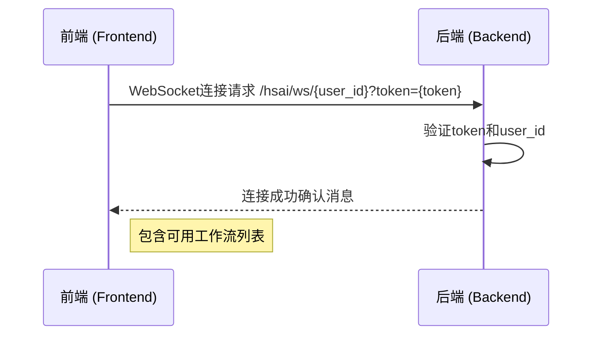
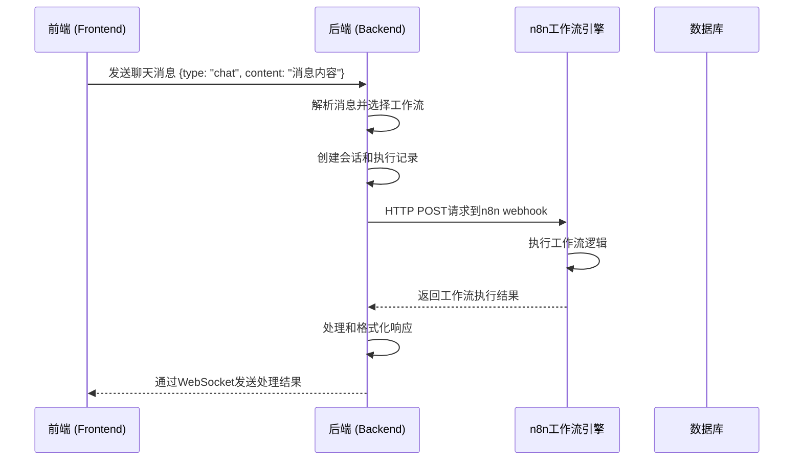
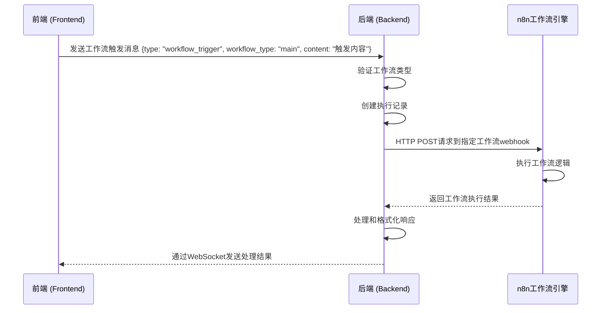
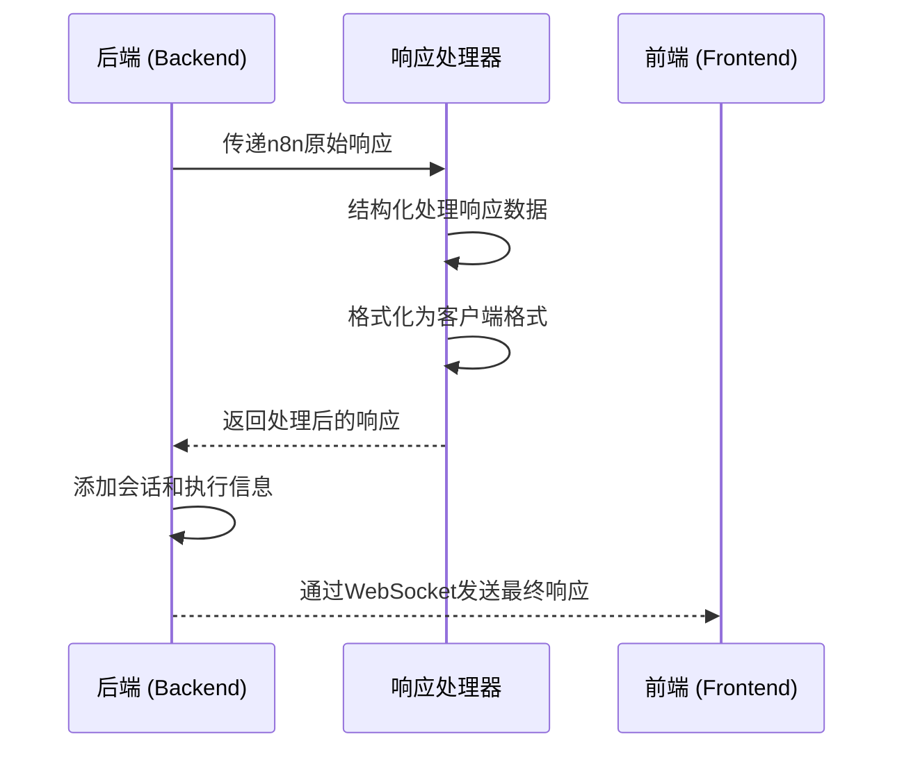
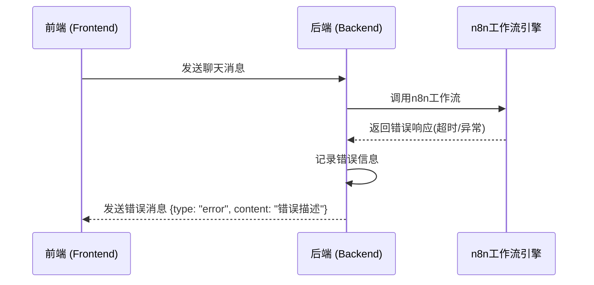
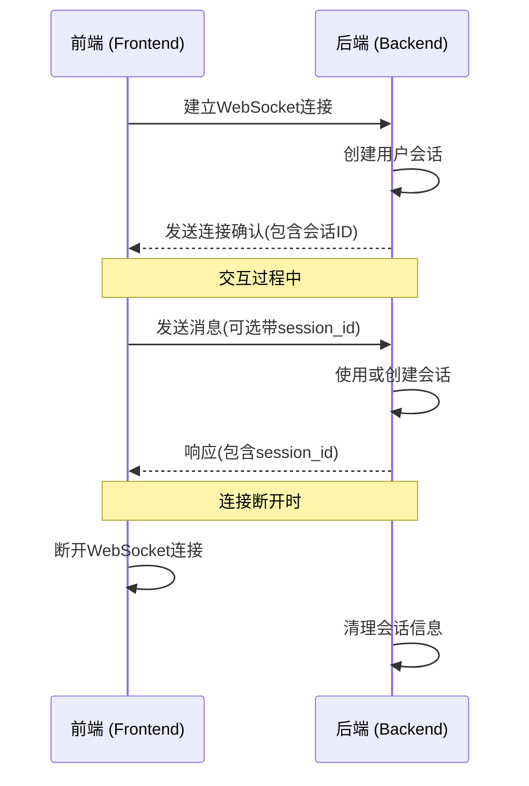

# HSAI系统交互时序图

**版本**: v1.0.0  
**更新日期**: 2025-09-03  
**适用范围**: 前端 ↔ 后端 ↔ n8n工作流  

## 1. WebSocket连接建立

```mermaid
sequenceDiagram
    participant F as 前端 (Frontend)
    participant B as 后端 (Backend)
    
    F->>B: WebSocket连接请求 /hsai/ws/{user_id}?token={token}
    B->>B: 验证token和user_id
    B-->>F: 连接成功确认消息
    Note right of F: 包含可用工作流列表
```

## 2. 聊天消息处理流程

```mermaid
sequenceDiagram
    participant F as 前端 (Frontend)
    participant B as 后端 (Backend)
    participant N as n8n工作流引擎
    participant DB as 数据库
    
    F->>B: 发送聊天消息 {type: "chat", content: "消息内容"}
    B->>B: 解析消息并选择工作流
    B->>B: 创建会话和执行记录
    B->>N: HTTP POST请求到n8n webhook
    N->>N: 执行工作流逻辑
    N-->>B: 返回工作流执行结果
    B->>B: 处理和格式化响应
    B-->>F: 通过WebSocket发送处理结果
```

## 3. 直接工作流触发流程

```mermaid
sequenceDiagram
    participant F as 前端 (Frontend)
    participant B as 后端 (Backend)
    participant N as n8n工作流引擎
    
    F->>B: 发送工作流触发消息 {type: "workflow_trigger", workflow_type: "main", content: "触发内容"}
    B->>B: 验证工作流类型
    B->>B: 创建执行记录
    B->>N: HTTP POST请求到指定工作流webhook
    N->>N: 执行工作流逻辑
    N-->>B: 返回工作流执行结果
    B->>B: 处理和格式化响应
    B-->>F: 通过WebSocket发送处理结果
```

## 4. 工作流响应处理

```mermaid
sequenceDiagram
    participant B as 后端 (Backend)
    participant P as 响应处理器
    participant F as 前端 (Frontend)
    
    B->>P: 传递n8n原始响应
    P->>P: 结构化处理响应数据
    P->>P: 格式化为客户端格式
    P-->>B: 返回处理后的响应
    B->>B: 添加会话和执行信息
    B-->>F: 通过WebSocket发送最终响应
```

## 5. 错误处理流程

```mermaid
sequenceDiagram
    participant F as 前端 (Frontend)
    participant B as 后端 (Backend)
    participant N as n8n工作流引擎
    
    F->>B: 发送聊天消息
    B->>N: 调用n8n工作流
    N-->>B: 返回错误响应(超时/异常)
    B->>B: 记录错误信息
    B-->>F: 发送错误消息 {type: "error", content: "错误描述"}
```

## 6. 会话管理

```mermaid
sequenceDiagram
    participant F as 前端 (Frontend)
    participant B as 后端 (Backend)
    
    F->>B: 建立WebSocket连接
    B->>B: 创建用户会话
    B-->>F: 发送连接确认(包含会话ID)
    
    Note over F,B: 交互过程中
    
    F->>B: 发送消息(可选带session_id)
    B->>B: 使用或创建会话
    B-->>F: 响应(包含session_id)
    
    Note over F,B: 连接断开时
    
    F->>F: 断开WebSocket连接
    B->>B: 清理会话信息
```