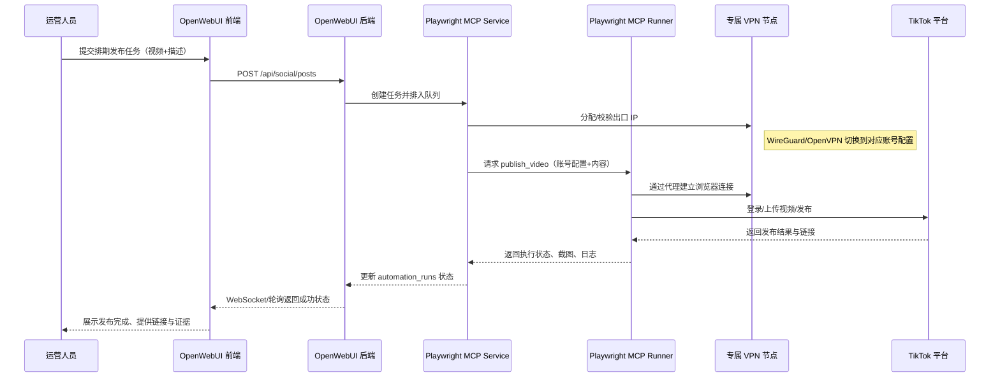

# Playwright MCP 多账号矩阵管理方案

## 1. 方案概览

- 目标：在 OpenWebUI 中集成 Playwright MCP，实现多社媒账号（以 TikTok 为例）的本地化管理、内容排期发布及 VPN 隔离，避免相同设备/IP 导致的封禁风险。
- 基本思路：通过 FastAPI 服务层注册专用 `Playwright MCP` 工具，结合 Redis 队列与多租户权限，完成账号绑定、任务调度、自动化执行及审计溯源。
- 关键能力：
  1. 账号档案 & 指纹隔离：每个账号绑定独立的浏览器配置目录、加密凭据、VPN/代理配置。
  2. 工作流联动：复用 n8n/OpenWebUI Prompt 工作流，支持内容生成、人工审核、自动发布。
  3. 可视化监控：前端提供账号健康、任务状态、执行证据（截图/HAR/日志）等信息。

## 2. 系统组件划分

| 层级     | 组件/文件                                                                          | 功能说明                                            |
| ------ | ------------------------------------------------------------------------------ | ----------------------------------------------- |
| 服务层    | `backend/open_webui/services/playwright_mcp_service.py`                        | 封装账号生命周期、任务排期、MCP 调用与状态回写                       |
| 工具层    | `backend/open_webui/utils/playwright_mcp_client.py`                            | 负责与 Playwright MCP Runner 通讯，处理 schema 校验、重试、日志 |
| 队列层    | `backend/open_webui/models/redis_queue_messages.py` + 新增调度器                    | 管理发布/健康检查任务排队执行                                 |
| 路由层    | `backend/open_webui/routers/social_accounts.py`、`social_posts.py`              | 多租户账号、内容、任务 API                                 |
| 数据层    | 新增数据表/模型：`social_accounts`、`social_campaigns`、`social_posts`、`automation_runs` | 存储账号配置、排期计划、执行记录、审计信息                           |
| Runner | `playwright-mcp-runner` 容器 + TikTok 专用脚本 (`tool/playwright_mcp_scripts/`)      | 具体 Playwright 自动化脚本（登录、发布、健康检查）                 |
| 网络层    | WireGuard/OpenVPN 容器 & 配置信息 (`docs/networking/social_vpn_profiles.md`)         | 为不同账号提供专属出口 IP                                  |

## 3. 数据模型扩展

- `social_accounts`
  - 字段：`id`、`tenant_id`、`platform`、`handle`、`encrypted_credentials_ref`、`playwright_profile_path`、`vpn_profile_id`、`device_fingerprint_hash`、`status`、`last_rotation_at`、`created_by`、`created_at`
  - 用途：绑定账号凭证、浏览器配置目录与 VPN。
- `social_campaigns`
  - 字段：`id`、`tenant_id`、`name`、`description`、`schedule_strategy`、`status`
  - 用途：跨账号/跨平台的排期集合。
- `social_posts`
  - 字段：`id`、`campaign_id`、`account_id`、`title`、`caption`、`media_assets`、`schedule_time`、`status`、`approval_user_id`、`approval_time`
  - 用途：单条文案/视频发布单元，记录审核到执行的状态流。
- `automation_runs`
  - 字段：`id`、`post_id`、`trigger_source`、`mcp_request_id`、`status`、`result_payload`、`screenshot_path`、`har_path`、`proxy_exit_ip`、`duration_ms`、`error_reason`、`created_at`
  - 用途：追踪每次 MCP 执行细节，便于回放与审计。

迁移脚本放置在 `backend/sql/schema_updates/`，在 `postgresql_full_database_init.sql` 及衍生版本中引用；模型与 Pydantic schema 置于 `backend/open_webui/models/`、`backend/open_webui/schemas/`。

## 4. 配置与部署

1. **环境变量**（示例写入 `.env`）：
   - `PLAYWRIGHT_MCP_ENDPOINT=ws://playwright-mcp-runner:8080`
   - `PLAYWRIGHT_PROFILE_ROOT=/var/playwright/profiles`
   - `SOCIAL_VPN_CONFIG_DIR=/var/playwright/vpn`
   - `SOCIAL_AUTOMATION_ALLOWED_PLATFORMS=tiktok,youtube,instagram`
2. **docker-compose 扩展**（基于 `docker-compose.playwright.yaml`）：
   - 添加 `playwright-mcp-runner` 服务，挂载 `PLAYWRIGHT_PROFILE_ROOT`、`SOCIAL_VPN_CONFIG_DIR`。
   - 为每个账号模板化 VPN 容器（WireGuard/OpenVPN），通过 `depends_on` / 网络别名向 Runner 暴露独立代理端口。
3. **Runner 脚本结构**：
   - `tool/playwright_mcp_scripts/`
     - `tiktok/login.ts`
     - `tiktok/publish_video.ts`
     - `tiktok/health_check.ts`
   - 所有脚本遵循 MCP Schema 输入输出，返回统一字段：`status`、`message`、`artifacts`。
4. **安全策略**：
   - 加密凭证走项目已有密钥管理逻辑（参考 `backend/open_webui/models/users.py` 的加密字段）。
   - Runner 容器最小权限运行，仅开放必要端口；定期轮换 VPN 出口。

## 5. 后端实现流程

1. **账号管理服务**
   - `register_account`：校验凭证 → 拉起 MCP `health_check` → 成功后持久化账号、指纹、VPN 信息。
   - `rotate_vpn`：调用网络层 API 切换出口，并异步更新账号状态。
2. **任务调度**
   - 定时任务扫描 `social_posts` 中 `status=scheduled` 且 `schedule_time <= now()` 的记录。
   - 写入 Redis 队列，触发 `playwright_mcp_service.run_post(post_id)`。
3. **执行流程**
   - 服务层根据账号信息组装 MCP Payload：包括 `account_id`、`vpn_endpoint`、`userDataDir`、`content`、`media`。
   - 调用 MCP Runner（WebSocket/HTTP），监听执行日志；失败时按重试策略切换 VPN 或标记人工处理。
4. **审计与通知**
   - 执行结果写入 `automation_runs`，并通过 WebSocket/事件推送给前端。
   - 日志、截图、HAR 存储在对象存储（字段 `screenshot_path` 等记录访问路径）。

## 6. 前端集成指南

1. **路由与页面**
   - 新增目录：`src/routes/(app)/social-automation/`
     - `+page.svelte`：总体仪表盘，展示账号健康、任务成功率。
     - `accounts/+page.svelte`：账号列表与接入表单，调用 `/api/social/accounts`。
     - `campaigns/+page.svelte`：排期列表、文案预览、审批操作。
     - `posts/[id]/+page.svelte`：单条任务详情，展示执行证据、重试按钮。
2. **Store & API 封装**
   - 在 `src/lib/stores/socialAutomation.ts` 管理账号、任务状态，引入租户上下文。
   - 在 `src/lib/api/socialAutomation.ts` 封装接口调用（列表、创建、审批、重试）。
3. **交互表现**
   - 账号卡片：显示 VPN 出口（城市/IP）、设备指纹摘要、上次执行时间；状态颜色标识。
   - 调度视图：甘特/时间线展示计划发布；提供批量操作（审批、取消、调整排期）。
   - 执行详情：嵌入截图缩略图、控制台日志折叠面板、HAR 下载按钮。
   - 通知：利用现有通知组件在成功/失败后推送结果，支持点击跳转详情。
4. **权限控制**
   - 通过现有的 `useTenantGuard`（如已有）限制访问；细分角色（运营、审核、管理员）对应不同按钮显示。

## 7. 示例：发布 TikTok 视频

### 7.1 操作步骤

1. 运营人员在“账号管理”页面新增 TikTok 账号，上传登录 Cookie/Token，绑定 VPN 出口（例如洛杉矶节点）。
2. 在“内容排期”中创建发布任务，填写视频标题、描述、标签，上传视频文件，设定发布时间（UTC）。
3. 审核人员在列表中将任务状态从“待审”切换为“已排期”。
4. 调度器在计划时间触发队列任务，Playwright MCP 拉起浏览器，会话使用该账号的 `userDataDir` 与 VPN。
5. 脚本完成登录校验 → 选择上传 → 上传视频与封面 → 填写描述 → 发布 → 返回发布链接与截图。
6. 后端记录成功状态，前端仪表盘更新，运营可以在详情页查看发布证据并复制 TikTok 链接。

### 7.2 TikTok 发布时序图



```
## 8. 实施建议
1. 优先在测试环境使用 TikTok 沙箱账号验证流程，确保登录与上传稳定。
2. 对高风险操作（VPN 切换、指纹重置）提供审计记录与人工确认接口。
3. 建立失败告警策略：连续失败次数触发暂停账号、通知安全团队检查风险。
4. 定期更新 Playwright MCP 脚本，适配 TikTok 页面变更及风险控制策略。

## 9. 参考实现资源
- **后端接口**：`/api/v1/social/*` 路由已在 `backend/open_webui/routers/social_automation.py` 中实现，可完成账号管理、TikTok 登录检测、创作者信息获取、视频信息获取及视频发布。
- **前端入口**：WebUI 侧新增 `src/routes/(app)/social-automation/+page.svelte`，在侧边栏“社交账号自动化”入口访问，可完成账号配置、任务创建与执行查看。
- **Playwright MCP 脚本示例**：位于 `tool/playwright_mcp_scripts/` 目录，包含 `tiktok_login.js`、`tiktok_fetch_creator.js`、`tiktok_fetch_video.js`、`tiktok_publish_video.js` 以及共用工具 `shared.js`，默认约定：
  - `PLAYWRIGHT_CREDENTIAL_ROOT` 指向凭证 JSON 文件目录，文件名为 `{credentials_ref}.json`。
  - `SOCIAL_VPN_PROXY_DIR`（或 `PLAYWRIGHT_PROXY_DIR`）存放 VPN/代理配置，用于为账号注入专属出口。
  - `PLAYWRIGHT_ARTIFACT_DIR` 定位执行截图及 HAR 文件输出目录（默认为 `playwright-mcp-artifacts/`）。
- **凭证格式样例**：
  ```json
  {
    "username": "account@example.com",
    "password": "StrongPassword!",
    "cookies_path": "/secrets/tiktok/account_cookies.json"
  }
```

- **代理配置样例** (`SOCIAL_VPN_PROXY_DIR/{vpn_profile_id}.json`)：
  
  ```json
  {
    "server": "http://127.0.0.1:9020",
    "username": "proxy-user",
    "password": "proxy-pass"
  }
  ```
  
  ```
  
  ```
